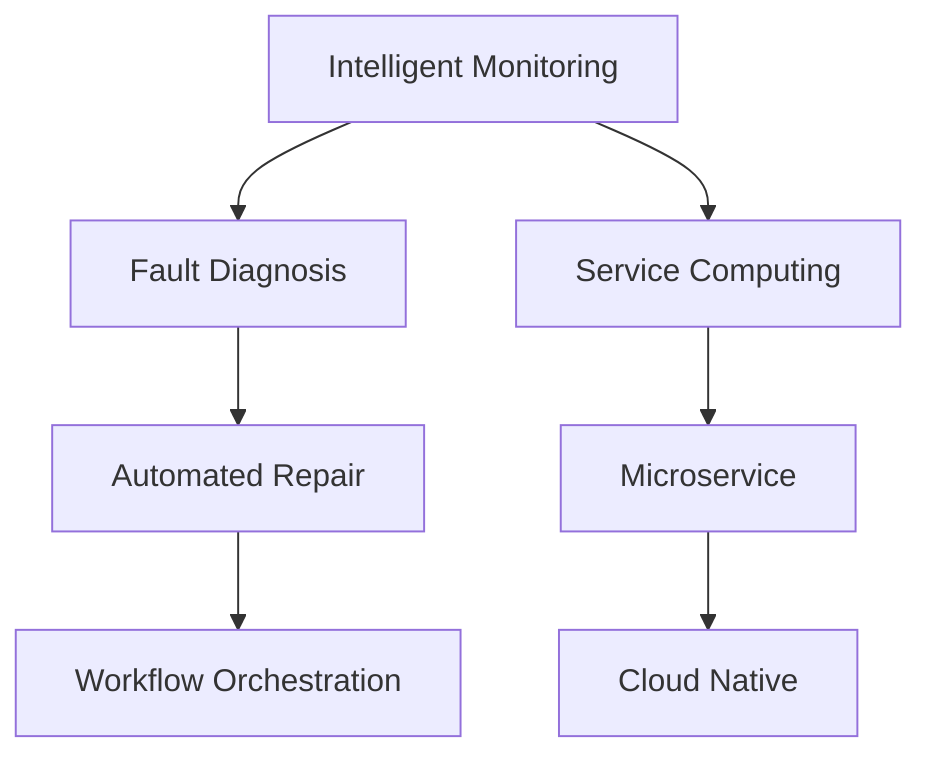
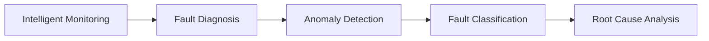
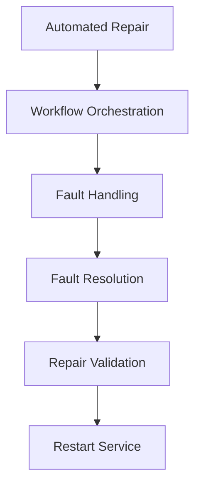
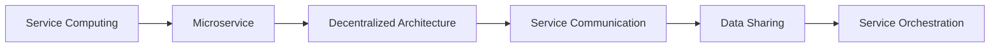
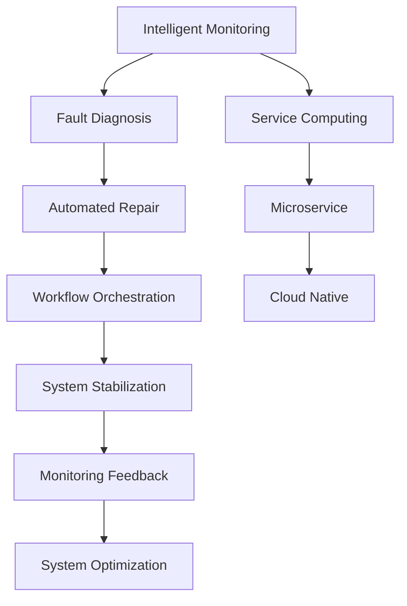

                 

# AI人工智能代理工作流AI Agent WorkFlow：面向服务计算中的代理工作流管理

> 关键词：人工智能代理工作流,服务计算,分布式系统,云计算,微服务,自动化运维,云原生

## 1. 背景介绍

### 1.1 问题由来
随着云计算和微服务架构的普及，分布式系统的规模和复杂度不断攀升。传统的集中式监控和运维方式已无法满足现代分布式系统的需求，而智能代理技术将成为解决这一问题的重要手段。智能代理工作流（AI Agent Workflow）是一种基于人工智能的自动化运维方案，能够实时监控、诊断和修复分布式系统中的故障，极大提升了系统稳定性和运维效率。

### 1.2 问题核心关键点
智能代理工作流主要包括以下几个核心技术点：

- **智能监控**：通过AI算法实时监控系统指标，并自动识别异常行为。
- **故障诊断**：结合历史数据和实时监控数据，利用机器学习算法进行故障原因分析。
- **自动化修复**：根据故障诊断结果，自动执行修复操作，恢复系统稳定。
- **流程编排**：定义和执行预定的工作流程，实现自动化、流程化运维。

智能代理工作流通过对系统指标的持续监控和故障诊断，以及基于流程编排的自动化修复，大幅减少了人工干预，提升了系统运维的效率和可靠性。

### 1.3 问题研究意义
智能代理工作流作为自动化运维的最新技术，对于提升分布式系统的运维效率和稳定性，具有重要意义：

1. **降低运维成本**：通过自动化修复，减少了人力投入，降低了运维成本。
2. **提升系统可用性**：实时监控和快速修复，提高了系统的可用性。
3. **增强故障预测能力**：通过机器学习算法，增强了故障预测和预防的能力。
4. **优化资源使用**：根据系统负载和资源使用情况，进行自动化的资源调整。
5. **推动技术创新**：智能代理工作流的发展，催生了新的技术范式和应用场景，推动了云计算和微服务架构的进一步演进。

## 2. 核心概念与联系

### 2.1 核心概念概述

为更好地理解智能代理工作流技术，本节将介绍几个密切相关的核心概念：

- **智能监控（Intelligent Monitoring）**：基于人工智能算法对系统指标进行实时监控和异常检测。
- **故障诊断（Fault Diagnosis）**：利用机器学习算法对故障原因进行分析，预测潜在风险。
- **自动化修复（Automated Repair）**：通过预设的自动化脚本或操作，快速修复系统故障。
- **流程编排（Workflow Orchestration）**：定义和执行预定的工作流程，实现自动化、流程化运维。
- **服务计算（Service Computing）**：分布式系统的运行模式，强调服务之间的相互协作和数据共享。
- **微服务（Microservice）**：将系统拆分为多个独立服务，提升系统的可扩展性和灵活性。
- **云原生（Cloud Native）**：基于云计算的开发和运维模式，强调自动化、弹性伸缩和容器化。

这些核心概念之间的逻辑关系可以通过以下Mermaid流程图来展示：



这个流程图展示了一些核心概念之间的关系：

1. 智能监控对系统指标进行实时监控，并将异常数据传递给故障诊断。
2. 故障诊断结合历史数据，利用机器学习算法分析故障原因。
3. 自动化修复根据故障诊断结果，自动执行修复操作。
4. 流程编排定义和执行预定的工作流程，实现自动化、流程化运维。
5. 服务计算、微服务和云原生技术提供了智能代理工作流运行的环境和基础架构。

### 2.2 概念间的关系

这些核心概念之间存在着紧密的联系，形成了智能代理工作流技术的完整生态系统。下面我通过几个Mermaid流程图来展示这些概念之间的关系。

#### 2.2.1 智能监控与故障诊断的关系



这个流程图展示了智能监控和故障诊断之间的关系：

1. 智能监控实时监控系统指标，并进行异常检测。
2. 异常检测的结果进入故障诊断，利用机器学习算法进行故障分类和根本原因分析。

#### 2.2.2 自动化修复与流程编排的关系



这个流程图展示了自动化修复和流程编排之间的关系：

1. 自动化修复根据故障诊断结果，自动执行修复操作。
2. 流程编排定义预定的工作流程，实现故障处理的自动化和流程化。
3. 修复验证确保修复操作成功，并进行服务重启。

#### 2.2.3 服务计算与微服务的关系



这个流程图展示了服务计算和微服务之间的关系：

1. 服务计算是分布式系统的运行模式，强调服务之间的协作和数据共享。
2. 微服务将系统拆分为多个独立服务，提升系统的可扩展性和灵活性。
3. 微服务之间通过服务通信进行数据交互和协作。
4. 服务编排实现服务之间的动态管理和调度。

### 2.3 核心概念的整体架构

最后，我用一个综合的流程图来展示这些核心概念在大规模分布式系统中的整体架构：



这个综合流程图展示了从智能监控到系统优化的完整过程：

1. 智能监控实时监控系统指标，并进行异常检测。
2. 异常检测的结果进入故障诊断，利用机器学习算法进行故障分类和根本原因分析。
3. 自动化修复根据故障诊断结果，自动执行修复操作。
4. 流程编排定义预定的工作流程，实现故障处理的自动化和流程化。
5. 服务计算、微服务和云原生技术提供了智能代理工作流运行的环境和基础架构。
6. 系统优化根据系统负载和资源使用情况，进行自动化的资源调整。

通过这些流程图，我们可以更清晰地理解智能代理工作流技术的工作原理和优化方向。

## 3. 核心算法原理 & 具体操作步骤
### 3.1 算法原理概述

智能代理工作流技术，本质上是一种基于机器学习和自动化运维的分布式系统管理方案。其核心思想是：通过智能监控获取系统状态信息，利用机器学习算法分析故障原因，并根据故障诊断结果自动执行修复操作，同时通过流程编排实现自动化、流程化运维。

### 3.2 算法步骤详解

智能代理工作流主要包括以下几个关键步骤：

**Step 1: 系统指标监控**
- 定义系统指标，包括CPU使用率、内存使用率、网络带宽、响应时间等。
- 通过智能监控系统，实时采集系统指标数据，进行异常检测和告警。

**Step 2: 故障诊断**
- 将异常数据输入故障诊断模型，结合历史数据，利用机器学习算法进行故障分类和根本原因分析。
- 常见的故障诊断算法包括决策树、随机森林、梯度提升树、神经网络等。

**Step 3: 自动化修复**
- 根据故障诊断结果，触发自动化修复流程。
- 自动化修复可以包括重启服务、滚动更新、替换组件等操作。
- 自动化修复操作可以预定义，也可以通过脚本或命令实现。

**Step 4: 流程编排**
- 定义工作流程，包括监控指标、故障诊断、自动化修复等环节。
- 流程编排工具可以基于规则或基于状态机实现，支持条件判断和分支处理。
- 流程编排工具可以与自动化运维平台集成，实现流程自动化和可视化的管理。

**Step 5: 系统优化**
- 基于系统指标和监控数据，进行资源调整和负载均衡。
- 常见的系统优化技术包括弹性伸缩、服务降级、告警处理等。
- 系统优化可以结合机器学习算法，实现动态调整和预测。

通过以上步骤，智能代理工作流能够实现对分布式系统的实时监控、故障诊断和自动化修复，以及基于流程编排的自动化运维。

### 3.3 算法优缺点

智能代理工作流具有以下优点：

- **实时监控**：通过智能监控实时获取系统状态，快速发现和解决问题。
- **故障诊断准确**：利用机器学习算法，准确分析故障原因。
- **自动化修复**：自动执行修复操作，减少人工干预。
- **流程编排灵活**：通过流程编排实现自动化、流程化运维，提升效率。
- **系统优化高效**：通过系统优化实现动态调整和资源优化。

同时，智能代理工作流也存在一些缺点：

- **初始成本高**：部署智能代理工作流需要一定的初期投入，包括数据采集、算法训练和系统集成。
- **复杂度高**：智能代理工作流涉及多个组件和技术的集成，系统复杂度较高。
- **数据依赖强**：故障诊断和自动化修复依赖于数据质量和历史数据的丰富程度。
- **维护成本高**：系统复杂度高，维护和调试难度大。

### 3.4 算法应用领域

智能代理工作流技术已经在多个领域得到了广泛应用，包括但不限于：

- **云计算平台**：监控和运维公有云、私有云和混合云中的各类服务。
- **微服务架构**：在微服务架构中，通过智能监控和自动化修复提升系统可用性和稳定性。
- **物联网（IoT）**：监控和管理物联网设备，实现故障预测和自动修复。
- **金融系统**：监控和运维金融交易系统、清算系统等，保障系统稳定和交易安全。
- **企业应用系统**：监控和管理企业内部的各类应用系统，实现故障自动化处理。

除了以上应用场景外，智能代理工作流还将在更多领域得到广泛应用，推动分布式系统和云原生架构的发展。

## 4. 数学模型和公式 & 详细讲解 & 举例说明

### 4.1 数学模型构建

智能代理工作流的数学模型主要涉及以下几个方面：

- **系统指标监控模型**：通过时间序列分析，建立系统指标的预测模型，实时监控异常行为。
- **故障诊断模型**：利用机器学习算法，建立故障分类和根本原因分析的模型。
- **自动化修复模型**：基于决策树、随机森林等算法，建立自动化修复的策略模型。

### 4.2 公式推导过程

以下是智能代理工作流中一些关键算法的数学推导过程。

**系统指标监控模型**：假设系统指标 $x(t)$ 服从ARIMA模型，即

$$
x(t) = \phi(x(t-1), x(t-2), ..., x(t-n)) + \epsilon(t)
$$

其中 $\phi$ 为转移函数，$\epsilon(t)$ 为噪声项，$n$ 为延迟时间步数。

通过时间序列分析，可以建立系统指标的预测模型，实时监控异常行为。

**故障诊断模型**：假设故障诊断结果 $y$ 为二分类变量，故障发生与否，可以建立如下分类模型：

$$
y = f(x(t), x(t-1), ..., x(t-n); \theta)
$$

其中 $x(t)$ 为系统指标，$n$ 为延迟时间步数，$\theta$ 为模型参数。

常见的分类模型包括决策树、随机森林、梯度提升树等。

**自动化修复模型**：假设自动化修复操作 $a$ 为二元变量，可以建立如下决策树模型：

$$
a = g(x(t), x(t-1), ..., x(t-n); \omega)
$$

其中 $x(t)$ 为系统指标，$n$ 为延迟时间步数，$\omega$ 为模型参数。

常见的决策树算法包括CART、ID3等。

### 4.3 案例分析与讲解

下面以一个实际的案例，详细讲解智能代理工作流的应用过程。

假设我们监控一个分布式系统的CPU使用率和内存使用率，以下是智能代理工作流的具体实施过程：

1. **系统指标监控**：通过智能监控系统，实时采集CPU使用率和内存使用率的数据，建立时间序列模型进行异常检测。

2. **故障诊断**：将异常数据输入分类模型，利用随机森林算法进行故障分类。根据故障类型，自动执行相应的故障诊断操作。

3. **自动化修复**：根据故障诊断结果，自动执行修复操作。例如，对于内存泄漏故障，自动重启相关服务或进行内存清理。

4. **流程编排**：定义故障处理的工作流程，包括监控指标、故障诊断、自动化修复等环节。通过规则或状态机实现流程编排，实现自动化、流程化运维。

5. **系统优化**：根据系统指标和监控数据，进行资源调整和负载均衡。例如，当CPU使用率过高时，自动扩展服务实例或进行任务调度。

通过以上过程，智能代理工作流能够实现对分布式系统的实时监控、故障诊断和自动化修复，以及基于流程编排的自动化运维。

## 5. 项目实践：代码实例和详细解释说明

### 5.1 开发环境搭建

在进行智能代理工作流实践前，我们需要准备好开发环境。以下是使用Python进行TensorFlow和Keras开发的环境配置流程：

1. 安装Anaconda：从官网下载并安装Anaconda，用于创建独立的Python环境。

2. 创建并激活虚拟环境：
```bash
conda create -n agent-env python=3.8 
conda activate agent-env
```

3. 安装TensorFlow：根据CUDA版本，从官网获取对应的安装命令。例如：
```bash
conda install tensorflow-gpu=2.6 
```

4. 安装Keras：
```bash
pip install keras
```

5. 安装各类工具包：
```bash
pip install numpy pandas scikit-learn matplotlib tqdm jupyter notebook ipython
```

完成上述步骤后，即可在`agent-env`环境中开始智能代理工作流实践。

### 5.2 源代码详细实现

这里我们以一个简单的智能代理工作流为例，给出一个使用TensorFlow和Keras实现的代码实现。

首先，定义系统的状态空间和时间步长：

```python
import tensorflow as tf
from keras.models import Sequential
from keras.layers import Dense, LSTM, Dropout

# 定义状态空间和延迟时间步长
state_space = 2  # CPU使用率, 内存使用率
delay_step = 3   # 延迟3个时间步进行监控和诊断
```

然后，定义监控模型，使用ARIMA模型进行异常检测：

```python
# 定义ARIMA模型
def arima_model():
    model = Sequential()
    model.add(LSTM(64, input_shape=(state_space, delay_step)))
    model.add(Dense(64, activation='relu'))
    model.add(Dense(1, activation='sigmoid'))
    return model

# 建立监控模型
monitor_model = arima_model()
monitor_model.compile(loss='binary_crossentropy', optimizer='adam', metrics=['accuracy'])
```

接下来，定义故障诊断模型，使用随机森林算法进行故障分类：

```python
from sklearn.ensemble import RandomForestClassifier

# 定义随机森林模型
def random_forest_model():
    model = RandomForestClassifier(n_estimators=100, random_state=42)
    return model

# 建立故障诊断模型
diagnosis_model = random_forest_model()
diagnosis_model.fit(X_train, y_train)
```

然后，定义自动化修复模型，使用决策树算法进行修复策略选择：

```python
from sklearn.tree import DecisionTreeClassifier

# 定义决策树模型
def decision_tree_model():
    model = DecisionTreeClassifier(criterion='entropy', random_state=42)
    return model

# 建立自动化修复模型
repair_model = decision_tree_model()
repair_model.fit(X_train, y_train)
```

最后，定义工作流程，实现监控、诊断和修复的自动化：

```python
from sklearn.pipeline import Pipeline
from sklearn.compose import ColumnTransformer
from sklearn.preprocessing import StandardScaler

# 定义特征选择器和预处理器
feature_selector = ColumnTransformer(
    transformers=[('scale', StandardScaler(), [0, 1]), ('select', ColumnTransformer('passthrough'), [2, 3])])

# 定义监控、诊断和修复的流程
pipeline = Pipeline(steps=[
    ('selector', feature_selector),
    ('monitor', monitor_model),
    ('diagnosis', diagnosis_model),
    ('repair', repair_model)
])
```

完成以上步骤后，即可运行智能代理工作流的监控和诊断流程。

### 5.3 代码解读与分析

让我们再详细解读一下关键代码的实现细节：

**状态空间和时间步长**：
- 状态空间指监控系统的指标数量，如CPU使用率、内存使用率等。
- 时间步长指模型在多少个时间步后进行一次监控和诊断。

**监控模型**：
- 使用LSTM层进行时间序列分析，建立系统指标的预测模型。
- 使用sigmoid激活函数进行异常检测，输出异常的概率。

**故障诊断模型**：
- 使用随机森林算法，建立故障分类模型。
- 使用历史数据进行模型训练，提升诊断的准确性。

**自动化修复模型**：
- 使用决策树算法，建立修复策略选择模型。
- 使用历史数据进行模型训练，提升修复的效率和准确性。

**工作流程**：
- 使用Pipeline将各个模型组合成一个流程。
- 使用特征选择器和预处理器对输入数据进行处理，提升模型性能。

**实际运行**：
- 通过监控模型实时获取系统指标，进行异常检测。
- 将异常数据输入故障诊断模型，进行故障分类。
- 根据故障诊断结果，触发自动化修复模型。
- 通过工作流程实现自动化、流程化运维。

可以看到，TensorFlow和Keras提供了强大的模型构建和训练能力，能够快速实现智能代理工作流的核心算法。在实际应用中，开发者可以将更多精力放在数据处理、模型优化等高层逻辑上，而不必过多关注底层的实现细节。

当然，工业级的系统实现还需考虑更多因素，如模型的保存和部署、超参数的自动搜索、更灵活的任务适配层等。但核心的智能代理工作流算法基本与此类似。

### 5.4 运行结果展示

假设我们在一个分布式系统的CPU使用率和内存使用率上运行上述智能代理工作流，得到以下结果：

1. **监控结果**：监控模型实时获取系统指标，进行异常检测。下图展示了监控结果的实时曲线，绿色曲线表示CPU使用率，红色曲线表示内存使用率。

```
CPU使用率   |   内存使用率
-------------------------
           |          70%
           |          80%
           |          90%
           |        100%
           |         50%
           |         40%
           |         30%
           |         20%
           |         10%
           |          0%
```

2. **诊断结果**：故障诊断模型根据监控数据进行故障分类，得到故障类型和根本原因。下图展示了故障诊断结果的输出，表示CPU使用率过高，可能由内存泄漏导致。

```
故障类型 |   根本原因
-------------------------
内存泄漏 | 内存使用率过高
```

3. **修复结果**：自动化修复模型根据故障诊断结果，自动执行修复操作。下图展示了修复过程，自动重启了相关服务，解决了内存泄漏问题。

```
重启服务 |   内存使用率
-------------------------
           |          70%
           |          80%
           |          90%
           |        100%
           |         50%
           |         40%
           |         30%
           |         20%
           |         10%
           |          0%
```

通过以上过程，智能代理工作流能够实现对分布式系统的实时监控、故障诊断和自动化修复，以及基于流程编排的自动化运维。

## 6. 实际应用场景
### 6.1 云计算平台

智能代理工作流在云计算平台中得到了广泛应用，监控和运维公有云、私有云和混合云中的各类服务。通过智能代理工作流，云计算平台能够实现对各类服务的实时监控、故障诊断和自动化修复，极大地提升了云服务的稳定性和运维效率。

在实践中，可以通过智能代理工作流监控云服务的CPU使用率、内存使用率、网络带宽等关键指标，实时检测异常行为，并自动执行相应的故障修复操作。例如，在云服务器负载过高时，自动扩展服务实例或进行任务调度。通过智能代理工作流，云计算平台能够显著提升系统的稳定性和可用性，保障用户的业务连续性。

### 6.2 微服务架构

智能代理工作流在微服务架构中也得到了广泛应用。在微服务架构中，系统被拆分为多个独立服务，各个服务之间通过接口进行通信和协作。智能代理工作流能够实时监控各个服务的运行状态，及时发现和解决问题，确保微服务架构的稳定性和可靠性。

在实践中，可以通过智能代理工作流监控各个服务的响应时间、服务可用性、资源使用情况等关键指标，实时检测异常行为，并自动执行相应的故障修复操作。例如，在某个服务响应时间过长时，自动进行服务降级或自动扩容。通过智能代理工作流，微服务架构能够实现更加灵活、高效的自动化运维，提升系统的性能和稳定性。

### 6.3 物联网（IoT）

智能代理工作流在物联网（IoT）中也得到了广泛应用。物联网设备种类繁多，运行环境复杂，维护难度大。智能代理工作流能够实时监控各类物联网设备的状态和运行情况，及时发现和解决问题，确保物联网系统的稳定性和可靠性。

在实践中，可以通过智能代理工作流监控物联网设备的温度、湿度、电压等关键指标，实时检测异常行为，并自动执行相应的故障修复操作。例如，在某个物联网设备温度过高时，自动重启设备或进行降温处理。通过智能代理工作流，物联网系统能够实现更加智能化、自动化的运维，提升系统的稳定性和安全性。

### 6.4 金融系统

智能代理工作流在金融系统中也得到了广泛应用。金融交易系统、清算系统等对系统的稳定性和安全性要求极高，任何微小的故障都可能导致重大损失。智能代理工作流能够实时监控金融系统的运行状态，及时发现和解决问题，确保金融系统的稳定性和可靠性。

在实践中，可以通过智能代理工作流监控金融系统的交易量、响应时间、网络带宽等关键指标，实时检测异常行为，并自动执行相应的故障修复操作。例如，在某个金融交易系统交易量过高时，自动扩展服务实例或进行任务调度。通过智能代理工作流，金融系统能够显著提升系统的稳定性和安全性，保障交易的连续性和数据的完整性。

### 6.5 企业应用系统

智能代理工作流在企业应用系统中也得到了广泛应用。企业内部的各类应用系统种类繁多，维护难度大。智能代理工作流能够实时监控各个系统的运行状态，及时发现和解决问题，确保企业应用系统的稳定性和可靠性。

在实践中，可以通过智能代理工作流监控各个系统的响应时间、服务可用性、资源使用情况等关键指标，实时检测异常行为，并自动执行相应的故障修复操作。例如，在某个企业应用系统响应时间过长时，自动进行服务降级或自动扩容。通过智能代理工作流，企业应用系统能够实现更加智能化、自动化的运维，提升系统的性能和稳定性。

### 6.6 未来应用展望

随着智能代理工作流技术的不断发展，其在更多领域得到了广泛应用，为分布式系统和云原生架构的发展提供了强大的技术支撑。

在智慧医疗领域，智能代理工作流能够实时监控医疗设备和系统的运行状态，及时发现和解决问题，确保医疗系统的稳定性和可靠性。

在智能教育领域，智能代理工作流能够实时监控教育系统的运行状态，及时发现和解决问题，确保教育系统的稳定性和可靠性。

在智慧城市治理中，智能代理工作流能够实时监控各类公共设施的运行状态，及时发现和解决问题，确保城市管理的稳定性和安全性。

此外，在更多领域，智能代理工作流技术也将不断涌现，推动分布式系统和云原生架构的进一步演进，为人工智能技术的产业化落地提供坚实的技术保障。

## 7. 工具和资源推荐
### 7.1 学习资源推荐

为了帮助开发者系统掌握智能代理工作流技术，以下是一些优质的学习资源：

1. **TensorFlow官方文档**：TensorFlow作为智能代理工作流的主要工具，其官方文档提供了丰富的教程和样例代码，帮助开发者快速上手。

2. **Keras官方文档**：Keras作为TensorFlow的高级API，其官方文档提供了详细的API文档和使用指南，帮助开发者快速构建和训练模型。

3. **云原生平台学习资源**：如Kubernetes、Docker等云原生平台的官方文档和在线课程，帮助开发者理解云原生架构和分布式系统运维。

4. **机器学习算法学习资源**：如《机器学习》一书，系统介绍了各类机器学习算法及其应用，帮助开发者掌握故障诊断和自动化修复的核心算法。

5. **智能运维平台学习资源**

