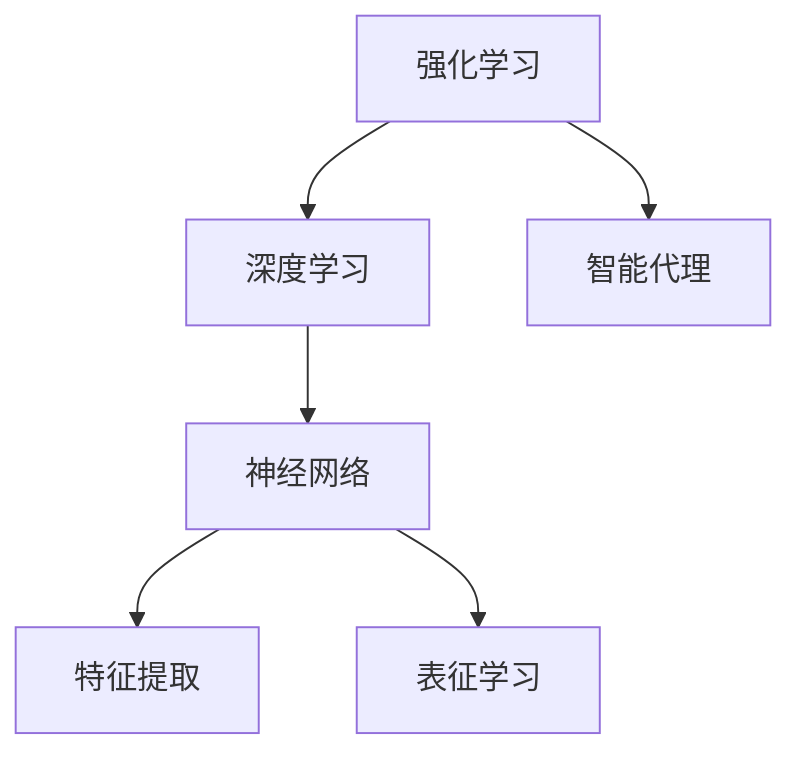
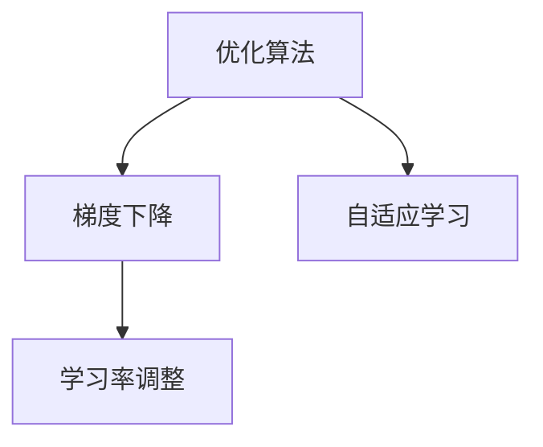
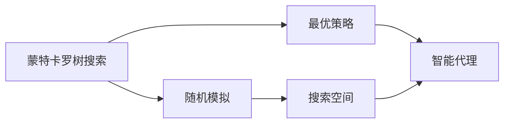
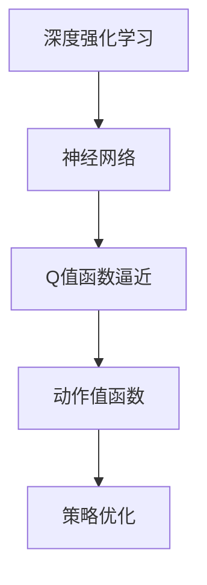

                 

# AI人工智能深度学习算法：使用强化学习优化深度学习模型

> 关键词：深度学习,强化学习,优化算法,自适应学习,神经网络,蒙特卡罗树搜索,深度强化学习,深度Q网络(DQN)

## 1. 背景介绍

### 1.1 问题由来
随着深度学习技术的快速发展，神经网络在各种领域都取得了显著的进展。然而，神经网络的训练是一个复杂且资源密集的过程，往往需要大量的时间、计算资源和数据。此外，由于神经网络的复杂性和非凸性，传统的梯度下降等优化算法并不能保证收敛到最优解，甚至可能陷入局部最优。因此，如何提高神经网络的训练效率和优化性能，是一个亟待解决的难题。

强化学习作为一种高效的智能学习方式，近年来在机器学习领域得到了广泛的应用。强化学习通过与环境的交互，利用奖励信号来指导学习过程，从而找到最优策略。由于其与深度学习技术的天然结合，强化学习已经被广泛应用于各种复杂问题的解决，如游戏智能、机器人控制等。

### 1.2 问题核心关键点
强化学习优化深度学习模型的核心思想是：将深度学习模型作为智能代理，通过与环境的交互，利用奖励信号指导模型的优化过程，最终找到最优的模型参数。这种优化方式相比传统的梯度下降算法，具有以下几个优点：
1. 不需要手动设置目标函数，通过奖励信号自适应学习。
2. 能够处理复杂高维的非凸优化问题。
3. 能够在动态变化的环境中学习，适用于实时在线优化。

基于强化学习的深度学习模型优化方法，近年来在学术界和工业界得到了广泛的研究和应用，包括DQN、TD3、SAC等经典算法，为神经网络的优化提供了新的思路和方法。

### 1.3 问题研究意义
使用强化学习优化深度学习模型，对于提升神经网络的性能和训练效率，具有重要意义：

1. 提升训练速度。强化学习方法可以通过动态调整模型参数，加速模型的训练过程。
2. 改善优化性能。强化学习能够处理复杂的非凸优化问题，找到更好的全局最优解。
3. 增强鲁棒性。强化学习模型在动态变化的环境下也能够学习，提高了模型的鲁棒性。
4. 促进自动化学习。强化学习能够自动探索最优策略，减少了人工调参的复杂性。
5. 支持在线学习。强化学习模型可以实时在线更新，支持动态变化场景下的学习。

## 2. 核心概念与联系

### 2.1 核心概念概述

为更好地理解强化学习优化深度学习模型的方法，本节将介绍几个密切相关的核心概念：

- 强化学习(Reinforcement Learning, RL)：一种通过智能代理与环境交互，利用奖励信号指导学习过程的学习方式。智能代理在每一步选择动作，并根据环境的反馈（奖励或惩罚）调整策略，最终找到最优策略。
- 深度学习(Deep Learning)：通过多层神经网络进行特征学习的方法，具备强大的表征能力和泛化能力。深度学习在图像识别、语音识别、自然语言处理等领域都有广泛应用。
- 优化算法(Optimization Algorithm)：用于求解函数最小值的算法，如梯度下降、牛顿法等。优化算法可以应用于深度学习的模型训练过程。
- 自适应学习(Adaptive Learning)：根据当前数据和模型的表现动态调整学习率、优化器等超参数，从而提高学习效率和性能。
- 蒙特卡罗树搜索(Monte Carlo Tree Search, MCTS)：一种基于随机模拟的搜索算法，用于在复杂搜索空间中找到最优解。蒙特卡罗树搜索在强化学习中应用广泛，尤其是在游戏智能、机器人控制等领域。
- 深度强化学习(Deep Reinforcement Learning)：将深度学习与强化学习相结合，通过神经网络来逼近Q值函数或策略函数，提高强化学习的训练效率和性能。
- 深度Q网络(Deep Q-Network, DQN)：一种基于深度学习的强化学习算法，通过神经网络逼近Q值函数，实现对动作值函数的优化。

这些核心概念之间的逻辑关系可以通过以下Mermaid流程图来展示：

```mermaid
graph TB
    A[强化学习] --> B[深度学习]
    B --> C[优化算法]
    B --> D[自适应学习]
    B --> E[蒙特卡罗树搜索]
    B --> F[深度强化学习]
    F --> G[深度Q网络(DQN)]
    C --> H[梯度下降]
    D --> I[学习率调整]
    E --> J[随机模拟]
    I --> G
    J --> G
```

这个流程图展示了大语言模型的核心概念及其之间的关系：

1. 强化学习将深度学习模型作为智能代理，通过与环境的交互，利用奖励信号指导模型的优化过程。
2. 深度学习为强化学习提供了强大的特征提取和表征能力。
3. 优化算法为深度学习模型训练提供了有效的求解手段。
4. 自适应学习能够根据当前数据和模型的表现动态调整超参数，提高学习效率。
5. 蒙特卡罗树搜索为强化学习提供了高效的搜索手段，特别是在复杂环境下的决策制定。
6. 深度强化学习结合了深度学习和强化学习的优点，通过神经网络逼近Q值函数，提高强化学习的训练效率和性能。
7. 深度Q网络是深度强化学习中的一种经典算法，通过神经网络逼近Q值函数，实现对动作值函数的优化。

这些概念共同构成了强化学习优化深度学习模型的框架，使其能够在各种复杂问题中发挥强大的智能学习能力。通过理解这些核心概念，我们可以更好地把握强化学习优化深度学习模型的原理和应用方向。

### 2.2 概念间的关系

这些核心概念之间存在着紧密的联系，形成了强化学习优化深度学习模型的完整生态系统。下面我通过几个Mermaid流程图来展示这些概念之间的关系。

#### 2.2.1 强化学习与深度学习的关系



这个流程图展示了强化学习与深度学习的紧密联系。强化学习将深度学习模型作为智能代理，利用神经网络进行特征提取和表征学习，从而提高智能代理的学习能力和决策效率。

#### 2.2.2 优化算法与自适应学习的关系



这个流程图展示了优化算法与自适应学习的关系。自适应学习通过动态调整优化算法中的超参数，如学习率、动量等，提高优化过程的稳定性和效率。

#### 2.2.3 蒙特卡罗树搜索与强化学习的关系



这个流程图展示了蒙特卡罗树搜索与强化学习的关系。蒙特卡罗树搜索通过随机模拟，在复杂搜索空间中找到最优策略，从而提高强化学习模型的决策能力。

#### 2.2.4 深度强化学习与深度Q网络的关系



这个流程图展示了深度强化学习与深度Q网络的关系。深度Q网络是深度强化学习中的一种经典算法，通过神经网络逼近Q值函数，实现对动作值函数的优化，从而提高模型的决策能力。

### 2.3 核心概念的整体架构

最后，我们用一个综合的流程图来展示这些核心概念在大语言模型微调过程中的整体架构：

```mermaid
graph TB
    A[大规模文本数据] --> B[预训练]
    B --> C[深度学习模型]
    C --> D[强化学习]
    D --> E[优化算法]
    E --> F[自适应学习]
    F --> G[深度Q网络(DQN)]
    G --> H[深度强化学习]
    H --> I[蒙特卡罗树搜索]
    I --> J[决策制定]
    J --> K[智能代理]
    K --> L[环境交互]
```

这个综合流程图展示了从预训练到强化学习优化的大语言模型微调过程。深度学习模型通过在大规模文本数据上进行预训练，学习到了丰富的语言知识。然后通过强化学习优化模型参数，提高了模型的决策能力。优化算法和自适应学习进一步提高了模型训练的稳定性和效率。最后，深度Q网络和蒙特卡罗树搜索在模型训练和决策制定中起到了关键作用，使得模型能够更好地适应各种复杂场景。通过这些概念的相互配合，强化学习优化深度学习模型的效果得到了极大的提升。

## 3. 核心算法原理 & 具体操作步骤
### 3.1 算法原理概述

使用强化学习优化深度学习模型的核心思想是：将深度学习模型作为智能代理，通过与环境的交互，利用奖励信号指导模型的优化过程，最终找到最优的模型参数。

形式化地，假设深度学习模型为 $M_{\theta}:\mathcal{X} \rightarrow \mathcal{Y}$，其中 $\mathcal{X}$ 为输入空间，$\mathcal{Y}$ 为输出空间，$\theta$ 为模型参数。假设强化学习环境的奖励函数为 $R:\mathcal{X}\times \mathcal{Y} \rightarrow [0,1]$，表示模型在输入 $\mathcal{X}$ 下输出 $\mathcal{Y}$ 所得到的奖励。

强化学习优化深度学习模型的目标是最小化期望的累积奖励，即：

$$
\min_{\theta} \mathbb{E}[\sum_{t=0}^{\infty} \gamma^t R(X_t, Y_t)]
$$

其中 $\gamma$ 为折扣因子，用于控制奖励的长期累积效应。

### 3.2 算法步骤详解

使用强化学习优化深度学习模型的步骤包括：

**Step 1: 准备预训练模型和环境**
- 选择合适的深度学习模型 $M_{\theta}$ 作为初始化参数，如卷积神经网络(CNN)、循环神经网络(RNN)、Transformer等。
- 设计强化学习环境，包括状态空间、动作空间、奖励函数等。
- 定义模型的状态表示方式，如输入文本的表示、注意力机制等。

**Step 2: 设置强化学习算法参数**
- 选择合适的强化学习算法，如Q-learning、SARSA、Deep Q Network (DQN)等。
- 设置算法参数，如学习率、折扣因子、探索与利用的平衡参数等。

**Step 3: 执行强化学习训练**
- 初始化智能代理，如神经网络模型。
- 在强化学习环境中，通过随机策略探索环境，采集样本。
- 利用采集的样本数据，更新智能代理的参数，并计算奖励。
- 重复上述步骤，直到达到预设的训练轮数或满足终止条件。

**Step 4: 测试和部署**
- 在测试数据上评估模型性能，对比优化前后模型效果。
- 使用优化后的模型进行实际应用，集成到实际的应用系统中。
- 持续收集新的数据，定期重新训练和优化模型，以适应数据分布的变化。

以上是使用强化学习优化深度学习模型的一般流程。在实际应用中，还需要针对具体任务的特点，对强化学习过程的各个环节进行优化设计，如改进奖励函数设计、引入更多的正则化技术、搜索最优的超参数组合等，以进一步提升模型性能。

### 3.3 算法优缺点

使用强化学习优化深度学习模型的优点包括：

1. 高效优化。强化学习能够高效地搜索复杂非凸的优化空间，找到全局最优解。
2. 动态适应。强化学习能够动态适应环境变化，处理动态变化的问题。
3. 自适应学习。强化学习能够自适应地调整学习率和策略，提高学习效率和性能。
4. 鲁棒性。强化学习模型在动态变化的环境中也能够学习，提高了模型的鲁棒性。
5. 自动化调参。强化学习能够自动探索最优策略，减少了人工调参的复杂性。

同时，该方法也存在一定的局限性：

1. 数据需求高。强化学习需要大量的数据来探索和优化模型，数据需求相对较高。
2. 收敛性问题。强化学习模型在复杂的非凸空间中可能会陷入局部最优，收敛性问题仍需进一步研究。
3. 可解释性差。强化学习模型通常是一个"黑盒"，难以解释其内部工作机制和决策逻辑。
4. 参数更新不稳定。强化学习模型在探索与利用之间需要平衡，参数更新不稳定可能导致性能波动。
5. 计算资源消耗大。强化学习训练通常需要大量的计算资源，资源消耗较大。

尽管存在这些局限性，但就目前而言，使用强化学习优化深度学习模型仍是最有效的方法之一。未来相关研究的重点在于如何进一步降低强化学习的计算资源消耗，提高模型训练效率，同时兼顾可解释性和鲁棒性等因素。

### 3.4 算法应用领域

使用强化学习优化深度学习模型在许多领域都有广泛应用，例如：

- 游戏智能：使用强化学习训练游戏AI，使其能够在游戏中做出最优决策。
- 机器人控制：使用强化学习优化机器人的动作策略，实现自主导航、抓取等任务。
- 语音识别：使用强化学习优化语音识别模型，提高识别准确率和鲁棒性。
- 自然语言处理：使用强化学习优化机器翻译、文本生成等任务，提高模型的性能和泛化能力。
- 金融预测：使用强化学习优化金融预测模型，提高预测准确性和鲁棒性。
- 医疗诊断：使用强化学习优化医学影像分析模型，提高诊断准确性和鲁棒性。
- 自动驾驶：使用强化学习优化自动驾驶系统，提高驾驶安全和性能。

除了上述这些经典应用外，强化学习优化深度学习模型还被创新性地应用到更多场景中，如资源调度、推荐系统、对抗性训练等，为深度学习技术带来了全新的突破。随着强化学习方法的不断进步，相信深度学习技术将在更广阔的应用领域大放异彩。

## 4. 数学模型和公式 & 详细讲解  
### 4.1 数学模型构建

本节将使用数学语言对强化学习优化深度学习模型过程进行更加严格的刻画。

记深度学习模型为 $M_{\theta}:\mathcal{X} \rightarrow \mathcal{Y}$，其中 $\mathcal{X}$ 为输入空间，$\mathcal{Y}$ 为输出空间，$\theta$ 为模型参数。假设强化学习环境的奖励函数为 $R:\mathcal{X}\times \mathcal{Y} \rightarrow [0,1]$，表示模型在输入 $\mathcal{X}$ 下输出 $\mathcal{Y}$ 所得到的奖励。

定义模型在数据集 $D=\{(x_i,y_i)\}_{i=1}^N, x_i \in \mathcal{X}, y_i \in \mathcal{Y}$ 上的损失函数为 $\ell(M_{\theta}(x_i),y_i)$，则在数据集 $D$ 上的经验风险为：

$$
\mathcal{L}(\theta) = \frac{1}{N} \sum_{i=1}^N \ell(M_{\theta}(x_i),y_i)
$$

强化学习优化深度学习模型的目标是最小化期望的累积奖励，即：

$$
\min_{\theta} \mathbb{E}[\sum_{t=0}^{\infty} \gamma^t R(X_t, Y_t)]
$$

其中 $\gamma$ 为折扣因子，用于控制奖励的长期累积效应。

### 4.2 公式推导过程

以下我们以Q-learning算法为例，推导其数学公式及其训练过程。

Q-learning算法通过状态值函数 $Q(\cdot)$ 来逼近动作值函数 $Q(s, a)$，其中 $s$ 为当前状态，$a$ 为当前动作。Q值函数表示在状态 $s$ 下采取动作 $a$ 的累积奖励期望。

在Q-learning算法中，智能代理在每一步通过状态 $s$ 和动作 $a$ 获得奖励 $r$，同时根据当前状态 $s$ 的Q值函数 $Q(s, a)$ 和下一个状态 $s'$ 的Q值函数 $Q(s', a')$，更新状态值函数 $Q(s, a)$：

$$
Q(s, a) \leftarrow Q(s, a) + \alpha (r + \gamma \max_a Q(s', a') - Q(s, a))
$$

其中 $\alpha$ 为学习率，$max_a Q(s', a')$ 表示在下一个状态 $s'$ 下选择最优动作 $a'$ 的Q值，$\gamma$ 为折扣因子。

在训练过程中，智能代理通过采样当前状态 $s$ 和动作 $a$，获得奖励 $r$ 和下一个状态 $s'$，然后根据上述公式更新状态值函数 $Q(s, a)$。重复此过程直到达到预设的训练轮数或满足终止条件。

### 4.3 案例分析与讲解

假设我们有一个简单的强化学习环境，其中智能代理需要在一系列状态下选择最优动作，以获得最大奖励。具体示例如下：

假设状态空间 $\mathcal{S} = \{1, 2, 3\}$，动作空间 $\mathcal{A} = \{L, R\}$，奖励函数 $R(s, a) = \begin{cases}
2, & \text{if } s=1, a=L \\
-1, & \text{if } s=2, a=R \\
0, & \text{otherwise}
\end{cases}$。智能代理的Q值函数为 $Q(s, a) = \begin{cases}
0, & \text{if } s=1 \\
0, & \text{if } s=2 \\
0, & \text{if } s=3
\end{cases}$。

智能代理从状态 $s=1$ 开始，可以选择动作 $a=L$ 或 $a=R$。根据奖励函数，智能代理在状态 $s=1$ 下选择动作 $a=L$ 可以获得奖励 $2$，选择动作 $a=R$ 可以获得奖励 $0$。智能代理在状态 $s=2$ 下选择动作 $a=R$ 可以获得奖励 $-1$，选择动作 $a=L$ 可以获得奖励 $0$。

在Q-learning算法中，智能代理通过采样当前状态 $s$ 和动作 $a$，获得奖励 $r$ 和下一个状态 $s'$，然后根据上述公式更新状态值函数 $Q(s, a)$。重复此过程直到达到预设的训练轮数或满足终止条件。

例如，当智能代理从状态 $s=1$ 开始时，它可以选择动作 $a=L$ 或 $a=R$。智能代理选择动作 $a=L$，获得奖励 $2$，状态转移到 $s'=2$。智能代理根据奖励函数 $R(s, a)$ 和下一个状态的Q值函数 $Q(s', a')$，更新当前状态的Q值函数：

$$
Q(1, L) \leftarrow Q(1, L) + \alpha (2 + \gamma \max_a Q(2, a') - Q(1, L))
$$

由于智能代理在状态 $s=2$ 下只能选择动作 $a=R$，因此：

$$
Q(2, R) = 0
$$

智能代理通过上述公式计算：

$$
Q(1, L) \leftarrow 0 + \alpha (2 + \gamma \max_a Q(2, a') - 0) = 2
$$

智能代理选择动作 $a=R$，获得奖励 $0$，状态转移到 $s'=3$。智能代理根据奖励函数 $R(s, a)$ 和下一个状态的Q值函数 $Q(s', a')$，更新当前状态的Q值函数：

$$
Q(1, R) \leftarrow 0 + \alpha (0 + \gamma \max_a Q(3, a') - 0) = 0
$$

智能代理通过上述公式计算：

$$
Q(2, R) \leftarrow 0 + \alpha (0 + \gamma \max_a Q(3, a') - 0) = 0
$$

智能代理从状态 $s=2$ 开始，只能选择动作 $a=R$，获得奖励 $-1$，状态转移到 $s'=3$。智能代理根据奖励函数 $R(s, a)$ 和下一个状态的Q值函数 $Q(s', a')$，更新当前状态的Q值函数：

$$
Q(2, R) \leftarrow 0 + \alpha (-1 + \gamma \max_a Q(3, a') - 0) = -1
$$

智能代理通过上述公式计算：

$$
Q(3, R) = 0
$$

在完成一轮训练后，智能代理的Q值函数更新为：

$$
Q(s, a) = \begin{cases}
2, & \text{if } s=1, a=L \\
-1, & \text{if } s=2, a=R \\
0, & \text{otherwise}
\end{cases}
$$

可以看到，智能代理通过Q-learning算法，学会了在每个状态下选择最优动作，从而最大化累积奖励。

## 5. 项目实践：代码实例和详细解释说明
### 5.1 开发环境搭建

在进行强化学习优化深度学习模型实践前，我们需要准备好开发环境。以下是使用Python进行PyTorch开发的环境配置流程：

1. 安装Anaconda：从官网下载并安装Anaconda，用于创建独立的Python环境。

2. 创建并激活虚拟环境：
```bash
conda create -n reinforcement-env python=3.8 
conda activate reinforcement-env
```

3. 安装PyTorch：根据CUDA版本，从官网获取对应的安装命令。例如：
```bash
conda install pytorch torchvision torchaudio cudatoolkit=11.1 -c pytorch -c conda-forge
```

4. 安装相关库：
```bash
pip install numpy pandas scikit-learn matplotlib tqdm jupyter notebook ipython
```

完成上述步骤后，即可在`reinforcement-env`环境中开始强化学习优化深度学习模型的实践。

### 5.2 源代码详细实现

下面我们以强化学习优化卷积神经网络(CNN)为例，给出使用PyTorch进行强化学习训练的PyTorch代码实现。

首先，定义CNN模型：

```python
import torch
import torch.nn as nn
import torch.nn.functional as F

class CNN(nn.Module):
    def __init__(self):
        super(CNN, self).__init__()
        self.conv1 = nn.Conv2d(1, 10, kernel_size=5)
        self.conv2 = nn.Conv2d(10, 20, kernel_size=5)
        self.fc1 = nn.Linear(320, 50)
        self.fc2 = nn.Linear(50, 10)

    def forward(self, x):
        x = F.relu(F.max_pool2d(self.conv1(x), 2))
        x = F.relu(F.max_pool2d(self.conv2(x), 2))
        x = x.view(-1, 320)
        x = F.relu(self.fc1(x))
        x = self.fc2(x)
        return F.softmax(x, dim=1)
```

然后，定义强化学习环境：

```python
import gym

env = gym.make('CartPole-v1')
env.reset()
env.render()
```

定义Q值函数：

```python
import numpy as np

class QNetwork(nn.Module):
    def __init__(self, state_size, action_size):
        super(QNetwork, self).__init__()
        self.fc1 = nn.Linear(state_size, 24)
        self.fc2 = nn.Linear(24, action_size)

    def forward(self, state):
        x = F.relu(self.fc1(state))
        x = self.fc2(x)
        return x
```

定义强化学习算法：

```python
import random

def QLearning(env, model, Q_network, episode_number, episode_length, reward_threshold):
    learning_rate = 0.01
    gamma = 0.9
    epsilon = 0.1
    rewards = np.zeros(episode_number)

    for i in range(episode_number):
        state = env.reset()
        done = False
        ep_r = 0
        while not done:
            state = torch.tensor(state, dtype=torch.float).view(1, -1)
            state = Variable(state)

            # 选择动作
            if random.uniform(0, 1) < epsilon:
                action = np.random.randint(env.action_space.n)
            else:
                q_values = Q_network(state)
                action = torch.max(q_values, 1)[1].data.numpy()[0]

            next_state, reward, done, _ = env.step(action)
            next_state = torch.tensor(next_state, dtype=torch.float).view(1, -1)
            next_state = Variable(next_state)

            # 更新Q值
            q_values = Q_network(next_state)
            max_q = torch.max(q_values, 1)[0].data.numpy()[0]
            target = reward + gamma * max_q
            q_values = Variable(torch.tensor(Q_network(state)), volatile=True)
            loss = F.smooth_l1_loss(q_values, Variable(torch.tensor(QNetwork(state).data.numpy()), volatile=True))
            loss.backward()
            optimizer.step()

            ep_r += reward

        rewards[i] = ep_r

    return rewards
```

最后，进行训练：

```python
import torch.optim as optim

# 定义优化器
optimizer = optim.Adam(Q_network.parameters(), lr=learning_rate)

# 训练模型
rewards = QLearning(env, model, Q_network

