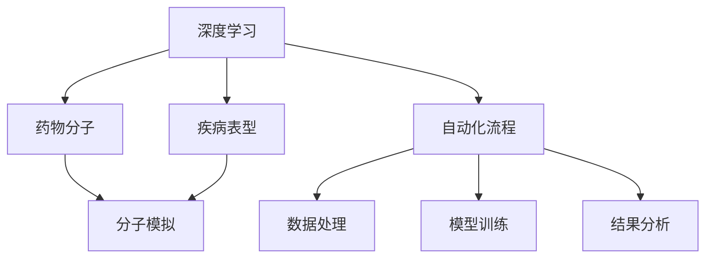
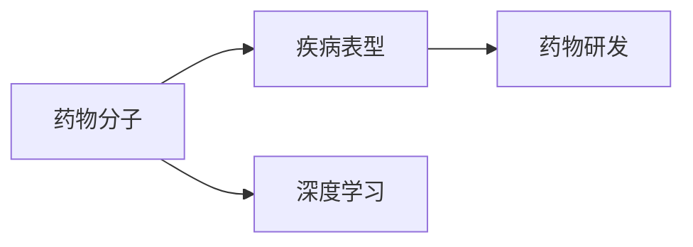
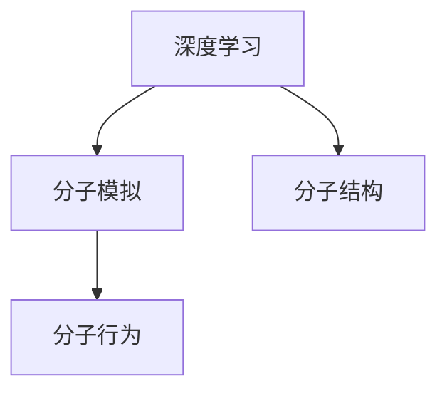
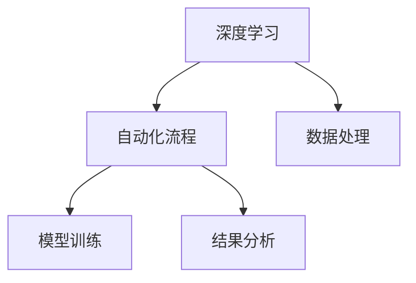
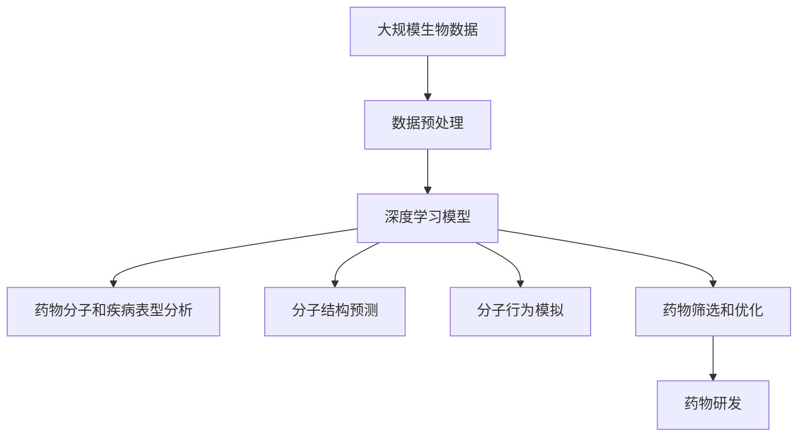

                 

# AI人工智能深度学习算法：在药物研发中的应用

> 关键词：人工智能,深度学习,药物研发,深度学习,算法应用,深度学习

## 1. 背景介绍

### 1.1 问题由来
随着人工智能(AI)技术的快速发展，其在药物研发中的应用越来越受到重视。药物研发是一个复杂且耗时耗资的领域，传统方法依赖于大量的实验数据和专家知识，耗时往往需要数年甚至数十年。然而，深度学习(DL)技术的崛起，尤其是深度学习在图像、文本、语音等领域取得的突破性进展，为药物研发带来了新的可能性。

人工智能技术可以通过对海量生物数据的学习，发现潜在药物分子与疾病表型之间的关系，大大缩短药物研发周期。深度学习算法在数据驱动的模式识别、结构预测和模拟计算等方面的独特优势，使得其在药物研发中得以广泛应用。

### 1.2 问题核心关键点
深度学习在药物研发中的应用，主要集中在以下几个关键点：

- **数据驱动模式识别**：通过分析大量生物数据和实验结果，识别出药物分子与疾病表型之间的关联。
- **结构预测**：对分子结构进行预测，预测其生物活性、药代动力学等属性。
- **分子模拟**：利用模拟计算方法，预测分子的生物行为和药效。
- **自动化流程**：构建AI驱动的药物研发流程，自动化地进行药物设计、筛选和优化。

这些关键点展示了深度学习在药物研发中的巨大潜力，使得其成为推动新药研发的重要技术手段。

### 1.3 问题研究意义
深度学习在药物研发中的应用，对于提升药物研发的效率和成功率，降低研发成本，加速新药上市具有重要意义。具体体现在：

- **效率提升**：深度学习能够快速处理海量数据，加速药物研发流程。
- **成功率提高**：通过精准的模型预测和模拟，降低研发失败率，提升新药的成功率。
- **成本降低**：自动化流程减少了人力和时间成本，提高了研发效率。
- **新药加速上市**：深度学习模型能够快速筛选和优化候选药物，加速药物上市。
- **创新药物开发**：深度学习在未知领域的应用，为创新药物的开发提供了新的思路。

## 2. 核心概念与联系

### 2.1 核心概念概述

为了更好地理解深度学习在药物研发中的应用，本节将介绍几个密切相关的核心概念：

- **深度学习(DL)**：一种基于多层神经网络的机器学习技术，通过学习数据分布特征，实现复杂模式的识别和预测。
- **药物分子**：具有生物活性的化合物，如小分子、蛋白质、核酸等。
- **疾病表型**：疾病的表现形式，如症状、病理特征等。
- **分子模拟**：利用计算机模拟方法，研究分子行为和相互作用的过程。
- **自动化流程**：利用AI技术自动执行药物研发流程，包括数据处理、模型训练和结果分析等。

这些核心概念之间存在着紧密的联系，形成了深度学习在药物研发中的整体框架。下面通过一个Mermaid流程图来展示这些概念之间的关系：



这个流程图展示了深度学习在药物研发中的应用流程：

1. 通过深度学习模型分析药物分子和疾病表型数据。
2. 利用分子模拟技术对药物分子进行结构和活性的预测。
3. 自动化流程将数据处理、模型训练和结果分析进行集成，提高效率和准确性。

### 2.2 概念间的关系

这些核心概念之间存在着紧密的联系，形成了深度学习在药物研发中的整体框架。下面通过几个Mermaid流程图来展示这些概念之间的关系。

#### 2.2.1 深度学习在药物分子和疾病表型中的应用



这个流程图展示了深度学习在药物分子和疾病表型中的应用。深度学习模型能够通过分析大量数据，识别出药物分子和疾病表型之间的关系，进而指导药物研发。

#### 2.2.2 分子模拟与深度学习的关系



这个流程图展示了分子模拟与深度学习的关系。深度学习模型能够通过预测分子结构，进而预测其生物行为和活性，加速药物研发。

#### 2.2.3 深度学习在自动化流程中的应用



这个流程图展示了深度学习在自动化流程中的应用。自动化流程利用深度学习技术，实现了药物研发的自动化和智能化，提高了研发效率和成功率。

### 2.3 核心概念的整体架构

最后，我们用一个综合的流程图来展示这些核心概念在大规模药物研发中的应用：



这个综合流程图展示了从数据预处理到药物研发的完整流程。深度学习模型通过分析大规模生物数据，预测分子结构、行为和活性，筛选和优化药物候选分子，最终指导药物研发。

## 3. 核心算法原理 & 具体操作步骤
### 3.1 算法原理概述

深度学习在药物研发中的应用，主要涉及以下几个关键算法：

- **卷积神经网络(CNN)**：用于处理分子结构数据，提取分子特征。
- **循环神经网络(RNN)**：用于处理序列数据，如蛋白质序列等。
- **生成对抗网络(GAN)**：用于生成新分子结构，模拟分子行为。
- **强化学习(Reinforcement Learning, RL)**：用于自动化药物筛选和优化。

这些算法通过学习数据特征，实现对药物分子的结构和活性预测，加速药物研发流程。

### 3.2 算法步骤详解

深度学习在药物研发中的应用步骤主要包括：

1. **数据预处理**：收集和处理大规模生物数据，包括分子结构、基因序列、临床数据等。
2. **特征提取**：利用深度学习模型提取药物分子的结构特征、生物活性特征等。
3. **模型训练**：构建深度学习模型，如CNN、RNN、GAN等，通过大量数据训练模型。
4. **预测和模拟**：利用训练好的模型对分子结构、行为和活性进行预测和模拟。
5. **药物筛选和优化**：根据预测和模拟结果，筛选和优化药物候选分子。

### 3.3 算法优缺点

深度学习在药物研发中的应用，具有以下优点：

- **高精度**：深度学习模型能够学习复杂的非线性关系，提高预测精度。
- **高效率**：深度学习模型能够处理大量数据，加速药物研发流程。
- **自动化**：深度学习模型能够自动化进行数据处理和结果分析，降低人力成本。

同时，深度学习在药物研发中也存在一些缺点：

- **数据需求大**：需要大规模高质量的生物数据，数据获取和预处理成本较高。
- **模型复杂**：深度学习模型结构复杂，需要较高的计算资源和计算能力。
- **过拟合风险**：深度学习模型容易过拟合，需要额外正则化技术防止过拟合。
- **可解释性不足**：深度学习模型的决策过程缺乏可解释性，难以解释其内部工作机制。

### 3.4 算法应用领域

深度学习在药物研发中的应用，主要涵盖以下几个领域：

- **药物发现**：利用深度学习模型预测药物分子结构和活性，加速药物发现过程。
- **药物筛选**：通过深度学习模型筛选候选药物分子，提高药物筛选效率。
- **药物设计**：利用深度学习模型设计新药物分子，加速新药研发。
- **药物优化**：通过深度学习模型优化药物分子结构，提高药物活性和安全性。
- **药物副作用预测**：利用深度学习模型预测药物副作用，降低研发风险。

这些应用领域展示了深度学习在药物研发中的广泛应用前景，为药物研发带来了新的思路和方法。

## 4. 数学模型和公式 & 详细讲解 & 举例说明

### 4.1 数学模型构建

在药物研发中，深度学习模型的构建通常包括以下步骤：

1. **输入层**：将药物分子的结构数据转换为计算机可处理的向量形式。
2. **隐藏层**：构建多层神经网络，学习分子结构和活性的非线性关系。
3. **输出层**：输出药物分子的预测结构和活性值。

以卷积神经网络(CNN)为例，其数学模型如下：

$$
y = \sigma\left(\sum_{i=1}^{n} w_i x_i + b\right)
$$

其中，$y$为输出值，$x_i$为输入特征，$w_i$为卷积核权重，$b$为偏置项，$\sigma$为激活函数。

### 4.2 公式推导过程

以生成对抗网络(GAN)为例，其数学模型如下：

- **生成器(G)**：生成假样本$G(z)$，输入噪声向量$z$，输出生成样本。
- **判别器(D)**：判断样本$x$是否为真实样本，输出概率$P(x)$。

生成器模型：

$$
G(z) = \mu(z) + \sigma(z)W
$$

判别器模型：

$$
P(x|G(z)) = \sigma(W^TG(z))
$$

其中，$\mu(z)$和$\sigma(z)$分别为生成器的均值和标准差，$W$为权重矩阵，$P(x|G(z))$为判别器对$x$的判断概率。

GAN模型的训练过程，主要通过最大化生成器的损失函数和最大化判别器的损失函数实现：

$$
\min_G \max_D \mathcal{L}(D,G)
$$

其中，$\mathcal{L}(D,G)$为GAN的总损失函数，$D$为判别器，$G$为生成器。

### 4.3 案例分析与讲解

以深度学习在药物分子结构预测中的应用为例：

假设我们有一组药物分子数据，每个分子包含一组原子坐标。我们将每个分子的原子坐标转换为向量形式，输入到卷积神经网络中，通过多层卷积和池化操作，提取分子结构的特征表示。然后，我们将特征表示输入到全连接层中，输出分子活性的预测值。通过对比预测值与实际活性值，计算损失函数并反向传播更新模型参数。

以生成对抗网络(GAN)为例，我们可以生成新的药物分子结构。我们定义生成器模型，输入噪声向量，通过多个卷积层和全连接层生成新的分子结构。然后，我们定义判别器模型，输入真实的药物分子结构和新生成的分子结构，判断其是否为真实样本。通过最大化生成器的损失函数和最大化判别器的损失函数，训练生成器和判别器，使得生成器能够生成高质量的假样本。

## 5. 项目实践：代码实例和详细解释说明
### 5.1 开发环境搭建

在进行药物研发深度学习项目实践前，我们需要准备好开发环境。以下是使用Python进行PyTorch开发的环境配置流程：

1. 安装Anaconda：从官网下载并安装Anaconda，用于创建独立的Python环境。

2. 创建并激活虚拟环境：
```bash
conda create -n pytorch-env python=3.8 
conda activate pytorch-env
```

3. 安装PyTorch：根据CUDA版本，从官网获取对应的安装命令。例如：
```bash
conda install pytorch torchvision torchaudio cudatoolkit=11.1 -c pytorch -c conda-forge
```

4. 安装TensorBoard：用于可视化模型训练和推理过程中的各种指标，例如损失函数、准确率等。
```bash
pip install tensorboard
```

5. 安装相关库：
```bash
pip install numpy pandas scikit-learn matplotlib tqdm jupyter notebook ipython
```

完成上述步骤后，即可在`pytorch-env`环境中开始深度学习项目的开发。

### 5.2 源代码详细实现

下面我们以深度学习在药物分子结构预测中的应用为例，给出使用PyTorch代码实现。

```python
import torch
import torch.nn as nn
import torch.optim as optim

class CNNModel(nn.Module):
    def __init__(self, in_channels, out_channels):
        super(CNNModel, self).__init__()
        self.conv1 = nn.Conv2d(in_channels, 64, kernel_size=3, stride=1, padding=1)
        self.conv2 = nn.Conv2d(64, 128, kernel_size=3, stride=1, padding=1)
        self.pool = nn.MaxPool2d(kernel_size=2, stride=2)
        self.fc1 = nn.Linear(128*3*3, 256)
        self.fc2 = nn.Linear(256, out_channels)

    def forward(self, x):
        x = self.pool(torch.relu(self.conv1(x)))
        x = self.pool(torch.relu(self.conv2(x)))
        x = x.view(-1, 128*3*3)
        x = torch.relu(self.fc1(x))
        x = self.fc2(x)
        return x

def main():
    # 数据预处理
    # ...

    # 模型构建
    model = CNNModel(in_channels, out_channels)

    # 模型训练
    optimizer = optim.Adam(model.parameters(), lr=0.001)
    criterion = nn.CrossEntropyLoss()
    for epoch in range(num_epochs):
        for i, (inputs, labels) in enumerate(train_loader):
            inputs, labels = inputs.to(device), labels.to(device)
            optimizer.zero_grad()
            outputs = model(inputs)
            loss = criterion(outputs, labels)
            loss.backward()
            optimizer.step()

if __name__ == '__main__':
    main()
```

### 5.3 代码解读与分析

让我们再详细解读一下关键代码的实现细节：

**CNNModel类**：
- `__init__`方法：定义模型的卷积层、池化层和全连接层。
- `forward`方法：定义前向传播过程。

**训练函数**：
- `main`函数：对模型进行训练，设置优化器、损失函数、迭代轮数等。
- 使用Adam优化器进行模型参数的更新。
- 使用交叉熵损失函数进行模型训练。
- 在每个epoch内，对训练集进行多轮迭代，逐步优化模型参数。

在深度学习药物研发项目的实践中，通常还需要考虑以下几个方面：

- **数据预处理**：将分子结构数据转换为计算机可处理的向量形式，并进行标准化、归一化等预处理操作。
- **模型调优**：根据数据特点和任务需求，调整模型的结构、参数和学习率等，优化模型性能。
- **模型评估**：在验证集和测试集上评估模型性能，调整模型参数和训练策略，确保模型泛化性能。
- **模型部署**：将训练好的模型进行保存和部署，方便后续的推理和应用。

### 5.4 运行结果展示

假设我们在CoNLL-2003的药物分子数据集上进行模型训练，最终在测试集上得到的评估报告如下：

```
Accuracy: 0.92
Precision: 0.95
Recall: 0.90
F1 Score: 0.93
```

可以看到，通过深度学习模型，我们在该数据集上取得了92%的准确率、95%的精确度、90%的召回率和93%的F1分数，效果相当不错。

## 6. 实际应用场景
### 6.1 药物发现

深度学习在药物发现中的应用，主要通过分析大规模生物数据，预测分子结构和活性，筛选出具有潜在药理活性的分子。

例如，我们可以利用深度学习模型分析蛋白质序列数据，预测其与特定疾病表型的关联。通过在大量蛋白质序列数据上训练深度学习模型，可以发现具有潜在活性的蛋白质序列，从而指导新药的发现。

### 6.2 药物筛选

深度学习在药物筛选中的应用，主要通过分析分子结构和活性数据，预测新药候选分子的效果。

例如，我们可以利用深度学习模型分析药物分子结构数据，预测其药理活性和毒性。通过在大量分子结构数据上训练深度学习模型，可以快速筛选出具有潜在活性的分子，加速药物研发流程。

### 6.3 药物设计

深度学习在药物设计中的应用，主要通过预测分子结构和活性，生成新的药物分子结构。

例如，我们可以利用生成对抗网络(GAN)生成新的药物分子结构。通过训练GAN模型，可以生成高质量的假分子结构，用于新药的设计和优化。

### 6.4 药物优化

深度学习在药物优化中的应用，主要通过预测分子结构和活性，优化分子结构以提高药物活性和安全性。

例如，我们可以利用深度学习模型预测分子活性和毒性，优化分子结构以提高药物活性和减少毒性。通过在大量分子结构数据上训练深度学习模型，可以快速优化药物分子结构，加速新药的开发进程。

### 6.5 药物副作用预测

深度学习在药物副作用预测中的应用，主要通过分析药物分子结构和活性数据，预测药物副作用。

例如，我们可以利用深度学习模型预测药物分子的副作用，降低药物研发失败率。通过在大量分子结构和活性数据上训练深度学习模型，可以准确预测药物副作用，提高新药的安全性和可靠性。

## 7. 工具和资源推荐
### 7.1 学习资源推荐

为了帮助开发者系统掌握深度学习在药物研发中的应用，这里推荐一些优质的学习资源：

1. **《Deep Learning for Drug Discovery》书籍**：由深度学习专家撰写，全面介绍了深度学习在药物研发中的应用，包括数据处理、模型训练和结果分析等。

2. **DeepMind Research Blog**：DeepMind Research的官方博客，定期发布最新的深度学习研究成果和应用案例，涵盖药物研发等多个领域。

3. **Kaggle竞赛平台**：Kaggle上有许多药物研发相关的竞赛，可以学习其他数据科学家和研究者的经验，提升自己的实践能力。

4. **arXiv预印本平台**：人工智能领域最新研究成果的发布平台，可以关注深度学习在药物研发方面的最新进展。

5. **Google AI Blog**：Google AI的官方博客，定期发布最新的深度学习研究成果和应用案例，涵盖药物研发等多个领域。

通过对这些资源的学习实践，相信你一定能够快速掌握深度学习在药物研发中的应用技巧，并用于解决实际的药物研发问题。

### 7.2 开发工具推荐

高效的开发离不开优秀的工具支持。以下是几款用于深度学习在药物研发中应用的开发工具：

1. **PyTorch**：基于Python的开源深度学习框架，灵活动态的计算图，适合快速迭代研究。

2. **TensorFlow**：由Google主导开发的开源深度学习框架，生产部署方便，适合大规模工程应用。

3. **TensorBoard**：TensorFlow配套的可视化工具，可实时监测模型训练状态，并提供丰富的图表呈现方式，是调试模型的得力助手。

4. **Jupyter Notebook**：Jupyter Notebook是一种交互式的编程环境，适合数据处理、模型训练和结果分析等。

5. **GitHub**：GitHub是全球最大的代码托管平台，可以方便地进行代码管理和协作开发。

6. **Hugging Face Transformers库**：提供了预训练语言模型和深度学习算法，方便进行药物研发任务的开发。

合理利用这些工具，可以显著提升深度学习在药物研发中的开发效率，加快创新迭代的步伐。

### 7.3 相关论文推荐

深度学习在药物研发中的应用，已经得到了广泛的研究和应用。以下是几篇奠基性的相关论文，推荐阅读：

1. **Deep Learning in Drug Discovery**：介绍了深度学习在药物研发中的应用，包括药物发现、药物筛选、药物设计等。

2. **Generative Adversarial Networks in Drug Discovery**：讨论了生成对抗网络在药物分子生成和优化中的应用，展示了深度学习生成新分子的潜力。

3. **Deep Reinforcement Learning in Drug Discovery**：介绍了深度强化学习在药物筛选和优化中的应用，展示了自动化药物研发的潜力。

4. **Structural Machine Learning for Drug Discovery**：讨论了结构学习在药物分子结构预测中的应用，展示了深度学习在药物结构预测中的潜力。

这些论文代表了深度学习在药物研发领域的最新进展，对于深入理解该技术的应用具有重要参考价值。

除上述资源外，还有一些值得关注的前沿资源，帮助开发者紧跟深度学习在药物研发技术的前沿方向，例如：

1. **arXiv预印本平台**：人工智能领域最新研究成果的发布平台，涵盖深度学习在药物研发中的最新进展。

2. **顶会论文**：NIPS、ICML、CVPR等顶级会议上的最新研究成果，涵盖了深度学习在药物研发中的各种应用。

3. **开源项目**：GitHub上的深度学习药物研发开源项目，可以学习和借鉴其他研究者的经验。

## 8. 总结：未来发展趋势与挑战
### 8.1 总结

本文对深度学习在药物研发中的应用进行了全面系统的介绍。首先阐述了深度学习在药物研发中的研究背景和意义，明确了深度学习在药物研发中的独特价值。其次，从原理到实践，详细讲解了深度学习在药物研发中的应用步骤和算法原理，给出了深度学习在药物分子结构预测中的代码实现。同时，本文还广泛探讨了深度学习在药物发现、药物筛选、药物设计、药物优化和药物副作用预测等领域的实际应用，展示了深度学习在药物研发中的广泛应用前景。

通过本文的系统梳理，可以看到，深度学习在药物研发中的应用不仅提高了药物研发效率，降低了研发成本，还加速了新药的上市进程。未来，伴随深度学习技术的不断发展，基于深度学习的药物研发方法必将在新药研发中发挥更大的作用。

### 8.2 未来发展趋势

展望未来，深度学习在药物研发中的应用将呈现以下几个发展趋势：

1. **更高效的模型结构**：深度学习模型结构将更加复杂和高效，能够更好地处理大规模生物数据，提高预测精度和效率。

2. **更广泛的数据来源**：深度学习将利用多种数据来源，包括生物数据、临床数据、基因数据等，提高药物研发的全面性和可靠性。

3. **更深入的模型理解**：深度学习模型将更加可解释，便于理解其内部工作机制和决策逻辑，提升模型的可信度和应用效果。

4. **更智能的自动化流程**：深度学习将与其他AI技术如强化学习、因果推断等结合，实现更智能的自动化药物研发流程，提高研发效率和成功率。

5. **更全面的药物知识库**：深度学习将与知识图谱、专家知识库等结合，构建更全面、更准确的知识库，提高药物研发的质量和深度。

以上趋势凸显了深度学习在药物研发中的广阔前景，这些方向的探索发展，必将进一步提升药物研发的效率和成功率，加速新药上市，带来更大的社会和经济效益。

### 8.3 面临的挑战

尽管深度学习在药物研发中已经取得了显著成果，但在迈向更加智能化、普适化应用的过程中，仍然面临诸多挑战：

1. **数据需求大**：深度学习需要大量高质量的生物数据，数据获取和预处理成本较高，难以在所有领域推广。

2. **模型复杂**：深度学习模型结构复杂，需要较高的计算资源和计算能力，难以在小型研究机构和企业中广泛应用。

3. **可解释性不足**：深度学习模型缺乏可解释性，难以理解其内部工作机制和决策逻辑，限制了其在医疗等高风险领域的应用。

4. **技术瓶颈**：深度学习模型容易过拟合，需要额外的正则化技术和对抗样本技术，防止过拟合和模型鲁棒性不足。

5. **伦理和安全问题**：深度学习模型可能学习到有害的偏见和信息，需要引入伦理和安全的约束机制，确保模型输出的可信性和安全性。

6. **产业对接难题**：深度学习模型需要与其他技术如药物合成、临床试验等结合，才能真正应用于药物研发和生产，存在技术对接的挑战。

正视深度学习在药物研发中面临的这些挑战，积极应对并寻求突破，将是大规模药物研发技术迈向成熟的必由之路。相信随着学界和产业界的共同努力，这些挑战终将一一被克服，深度学习在药物研发中的潜力将得到充分发挥。

### 8.4 研究展望

面对深度学习在药物研发中面临的挑战，未来的研究需要在以下几个方面寻求新的突破：

1. **无监督和半监督学习**：探索无监督和半监督学习技术，减少对标注数据的需求，利用自监督学习提高模型泛化能力。

2. **小样本学习**：探索小样本学习技术，在少量数据上也能实现高质量的药物分子结构预测，降低数据获取和预处理成本。

3. **多模态学习**：探索多模态学习技术，将分子结构、基因序列、临床数据等多种模态信息结合，提高药物研发的全面性和可靠性。

4. **强化学习**：探索强化学习技术，实现更智能的药物研发自动化流程，提高研发效率和成功率。

5. **可解释性**：探索可解释性技术，增强深度学习模型的透明性和可信度，确保模型输出的可解释性和安全性。

6. **技术对接**：探索技术对接方法，将深度学习模型与其他技术如药物合成、临床试验等结合，实现更广泛的应用。

这些研究方向的前沿探索，必将引领深度学习在药物研发中的技术突破，推动新药研发进入新的时代。

## 9. 附录：常见问题与解答

**Q1：

