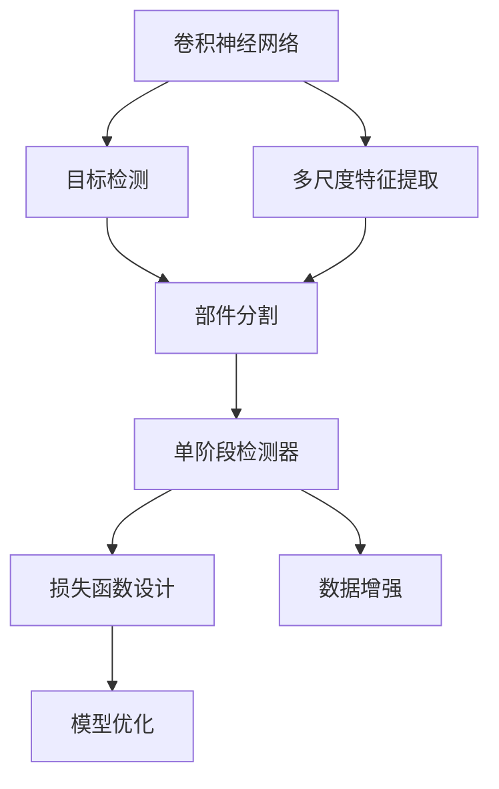
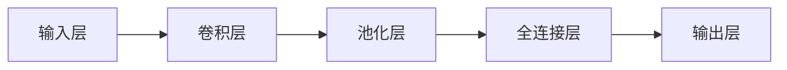
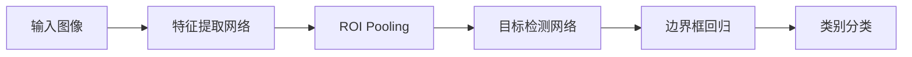
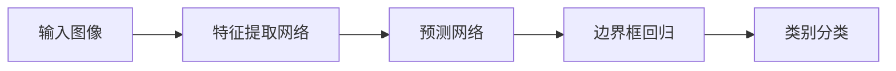
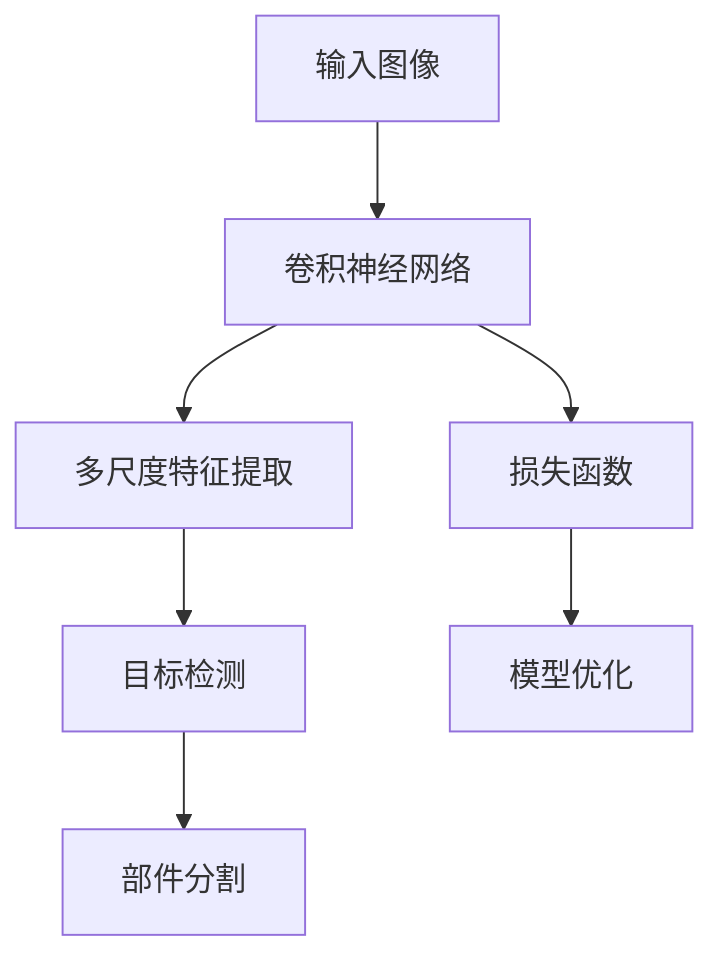

                 

## 1. 背景介绍

### 1.1 问题由来

随着计算机视觉技术的快速发展，部件检测（Part Detection）成为图像处理领域的一个重要研究方向。部件检测旨在从输入图像中准确地检测出感兴趣的目标区域，并提取出其特征信息。传统的部件检测方法依赖于手工设计的特征提取器和分类器，难以泛化到复杂的场景中。深度学习技术尤其是卷积神经网络（Convolutional Neural Network, CNN）的崛起，为部件检测带来了新的思路和突破。

近年来，基于深度学习的部件检测方法已经在诸多应用场景中取得了显著的成效，如图像分割、目标检测、自动驾驶等。例如，深度可变形卷积网络（Deformable Convolutional Networks）通过引入可变形卷积（Deformable Convolution），能够适应不同尺度和不同方向的特征提取，提升了部件检测的精度和鲁棒性。YOLO系列（You Only Look Once）算法通过同时进行目标检测和分类，减少了传统的两阶段检测器（Two-Stage Detector）的多阶段计算，显著提高了检测速度。

然而，随着深度学习模型复杂度的增加，其训练和推理成本也显著上升。如何在大规模数据集上进行高效的模型训练和推理，同时保证模型检测的精度和泛化能力，成为当前部件检测领域的一个重要挑战。本文将从算法原理、实际操作、模型优化以及应用场景等多个角度，对基于深度学习的部件检测技术进行全面的探讨。

### 1.2 问题核心关键点

在深度学习中，部件检测通常被看作是一个二分类问题，即判断每个像素是否属于目标类别。基于卷积神经网络的部件检测方法主要有两种：分类+回归（Classification + Regression）和基于单阶段检测器（Single-Stage Detector）的端到端学习。其中，分类+回归方法在目标检测的基础上进行部件分割，而单阶段检测器则将目标检测和分割合二为一，进一步提升了检测速度和精度。

关键点包括：
- **目标检测框架**：如YOLO、Faster R-CNN等，将目标检测和分割合二为一，提升了检测速度和精度。
- **多尺度特征提取**：通过引入可变形卷积、金字塔池化等技术，适应不同尺度和方向的特征提取。
- **损失函数设计**：结合分类和回归损失，提升模型检测精度。
- **数据增强**：通过数据增强技术，增加训练集的样本多样性，提升模型泛化能力。
- **模型优化**：如正则化、参数共享等技术，降低模型过拟合风险，提高检测精度和速度。

本文将深入分析这些关键点，通过理论推导和实际案例，阐述如何在大规模数据集上进行高效的部件检测。

### 1.3 问题研究意义

部件检测技术在许多实际应用中扮演着重要角色，例如自动驾驶、医疗影像分析、工业缺陷检测等。通过对深度学习算法在部件检测中的应用进行研究，可以：

1. **提高检测精度和速度**：通过高效的模型训练和推理技术，可以在不增加硬件成本的前提下，显著提升部件检测的精度和速度。
2. **适应多样化的场景需求**：深度学习模型能够自动学习不同场景下的特征，适应多样化的检测需求。
3. **降低开发和维护成本**：相对于传统手工设计的检测方法，深度学习模型能够自动化处理特征提取和分类，减少了人工干预和维护成本。
4. **促进技术进步**：通过深入研究部件检测算法，可以推动深度学习技术的不断进步，为其他领域的技术应用提供参考。
5. **实现跨学科融合**：部件检测技术可以与其他领域如机器人视觉、智能交通等结合，促进跨学科的深度融合。

本文将从算法原理、实践操作、未来展望等多个角度，全面分析深度学习在部件检测中的应用，为相关研究人员和工程实践者提供理论和技术支持。

## 2. 核心概念与联系

### 2.1 核心概念概述

为了更好地理解基于深度学习的部件检测技术，本节将介绍几个密切相关的核心概念：

- **卷积神经网络（CNN）**：一种基于卷积操作的深度学习网络结构，广泛应用于图像处理和计算机视觉领域。
- **目标检测（Object Detection）**：从输入图像中检测出目标并定位，通常通过回归目标边界框实现。
- **部件分割（Part Segmentation）**：在目标检测的基础上，进一步对目标进行像素级别的分割，提取目标的精细细节。
- **单阶段检测器（Single-Stage Detector）**：将目标检测和分割合二为一的端到端学习框架，如YOLO系列。
- **多尺度特征提取**：通过引入可变形卷积、金字塔池化等技术，适应不同尺度和方向的特征提取。
- **损失函数设计**：结合分类和回归损失，提升模型检测精度。
- **数据增强**：通过数据增强技术，增加训练集的样本多样性，提升模型泛化能力。
- **模型优化**：如正则化、参数共享等技术，降低模型过拟合风险，提高检测精度和速度。

这些核心概念之间的逻辑关系可以通过以下Mermaid流程图来展示：



这个流程图展示了从卷积神经网络到部件分割的过程，以及各个关键技术之间的联系。其中，卷积神经网络提供了多尺度特征提取的能力，目标检测框架实现了目标的定位，而部件分割则进一步细化了目标的分割。单阶段检测器将目标检测和分割合二为一，进一步提升了检测速度和精度。损失函数设计、数据增强和模型优化技术，则分别在模型训练和推理阶段，保证了模型的泛化能力和检测精度。

### 2.2 概念间的关系

这些核心概念之间存在着紧密的联系，形成了深度学习在部件检测中的完整生态系统。下面我通过几个Mermaid流程图来展示这些概念之间的关系：

#### 2.2.1 卷积神经网络的结构



这个流程图展示了卷积神经网络的基本结构，包括输入层、卷积层、池化层、全连接层和输出层。卷积层和池化层通过局部连接和池化操作，实现特征提取和降维，全连接层则进行分类和回归任务。

#### 2.2.2 目标检测的流程



这个流程图展示了目标检测的基本流程，包括特征提取、边界框回归和类别分类。特征提取网络通过卷积和池化操作，提取图像特征，ROI Pooling则对特征图进行区域提取，目标检测网络进行边界框回归和类别分类。

#### 2.2.3 单阶段检测器的框架



这个流程图展示了单阶段检测器（如YOLO）的基本框架，包括特征提取网络、预测网络和回归分类网络。特征提取网络通过卷积和池化操作，提取图像特征，预测网络直接输出边界框和类别概率，无需单独的ROI Pooling操作。

### 2.3 核心概念的整体架构

最后，我们用一个综合的流程图来展示这些核心概念在部件检测中的应用：



这个综合流程图展示了从输入图像到部件分割的完整流程。其中，卷积神经网络通过多尺度特征提取，实现对不同尺度和方向特征的提取。目标检测网络将目标进行定位，并输出边界框和类别概率。部件分割网络在目标检测的基础上，进一步对目标进行像素级别的分割，提取目标的精细细节。损失函数和模型优化技术，则分别在模型训练和推理阶段，保证了模型的泛化能力和检测精度。

## 3. 核心算法原理 & 具体操作步骤
### 3.1 算法原理概述

基于深度学习的部件检测技术，本质上是通过卷积神经网络（CNN）对输入图像进行特征提取，并结合目标检测和部件分割任务，实现对部件的定位和分割。其核心思想是：

1. **多尺度特征提取**：通过引入可变形卷积、金字塔池化等技术，适应不同尺度和方向的特征提取。
2. **目标检测**：通过回归目标边界框和分类目标类别，实现目标的定位和分类。
3. **部件分割**：在目标检测的基础上，进一步对目标进行像素级别的分割，提取目标的精细细节。
4. **损失函数设计**：结合分类和回归损失，提升模型检测精度。
5. **数据增强**：通过数据增强技术，增加训练集的样本多样性，提升模型泛化能力。
6. **模型优化**：如正则化、参数共享等技术，降低模型过拟合风险，提高检测精度和速度。

具体来说，基于深度学习的部件检测通常分为两个阶段：目标检测和部件分割。目标检测通过回归目标边界框和分类目标类别，实现目标的定位和分类。部件分割则是在目标检测的基础上，进一步对目标进行像素级别的分割，提取目标的精细细节。

### 3.2 算法步骤详解

基于深度学习的部件检测算法通常包括以下几个关键步骤：

**Step 1: 准备数据集和标签**

- 收集并标注大量图像数据集，标注每个图像中感兴趣的目标部件。
- 数据集分为训练集、验证集和测试集，保证数据的多样性和泛化能力。

**Step 2: 设计模型架构**

- 选择合适的网络架构，如YOLO、Faster R-CNN等。
- 设计特征提取网络，包括卷积层、池化层等。
- 设计预测网络，包括全连接层、softmax层等。
- 设计边界框回归网络，包括回归层等。
- 设计部件分割网络，包括语义分割网络等。

**Step 3: 选择合适的损失函数**

- 设计分类和回归损失函数，如交叉熵损失、平滑L1损失等。
- 根据任务特点，选择适当的损失函数组合，如二分类交叉熵损失、多任务损失等。

**Step 4: 进行模型训练**

- 使用优化算法（如Adam、SGD等）更新模型参数。
- 根据损失函数计算梯度，反向传播更新模型权重。
- 周期性在验证集上评估模型性能，调整超参数。

**Step 5: 进行模型评估和测试**

- 在测试集上评估模型性能，如精度、召回率、mAP等指标。
- 分析模型误差，进行模型调优和优化。
- 部署模型到实际应用中，进行推理预测。

### 3.3 算法优缺点

基于深度学习的部件检测算法具有以下优点：

1. **自动提取特征**：深度学习模型能够自动学习图像特征，无需手工设计特征提取器。
2. **适应性强**：能够适应不同尺度、方向和类型的目标检测。
3. **精度高**：通过多尺度特征提取和数据增强技术，提高了检测精度和鲁棒性。
4. **检测速度快**：单阶段检测器（如YOLO）能够实现实时检测，满足实时应用的需求。

同时，该算法也存在以下缺点：

1. **计算资源需求高**：大规模卷积神经网络对计算资源需求较高，需要高性能的GPU或TPU支持。
2. **过拟合风险高**：模型复杂度高，容易发生过拟合。
3. **训练时间长**：大规模数据集的训练时间较长，需要优化模型结构和技术手段。
4. **可解释性差**：深度学习模型通常被看作"黑盒"系统，难以解释其内部工作机制。

### 3.4 算法应用领域

基于深度学习的部件检测技术已经在许多实际应用中得到了广泛应用，例如：

- **自动驾驶**：通过检测道路上的车辆、行人、交通标志等部件，实现自动驾驶系统。
- **医疗影像分析**：检测病变区域和细胞，辅助医生进行疾病诊断和治疗。
- **工业缺陷检测**：检测产品表面的缺陷和瑕疵，提高产品质量和生产效率。
- **安防监控**：检测目标和异常行为，提高安全防范水平。
- **自然语言处理**：检测文本中的实体和关键词，实现文本理解和信息提取。

除了上述这些经典应用外，基于深度学习的部件检测技术还在众多领域中得到了创新应用，如人脸识别、智能家居、智慧城市等，为各行各业带来了新的突破。随着深度学习技术的不断进步，相信部件检测技术将在更广阔的应用领域大放异彩。

## 4. 数学模型和公式 & 详细讲解 & 举例说明

### 4.1 数学模型构建

本节将使用数学语言对基于深度学习的部件检测技术进行更加严格的刻画。

假设输入图像为 $I \in \mathbb{R}^{H \times W \times C}$，其中 $H$ 和 $W$ 分别为图像的高度和宽度，$C$ 为通道数。目标检测和分割的标注数据集为 $\{(I_i, \{B_i^k\}, \{C_i^k\})\}_{i=1}^N$，其中 $I_i$ 为图像，$\{B_i^k\}$ 为第 $k$ 个目标的边界框，$\{C_i^k\}$ 为第 $k$ 个目标的类别。

目标检测的损失函数为：

$$
L_{obj} = \sum_{i=1}^N \left[ \ell_{cls}(y_{pred}^i, y_{gt}^i) + \ell_{reg}(y_{pred}^i, y_{gt}^i) \right]
$$

其中 $\ell_{cls}$ 为分类损失函数，$\ell_{reg}$ 为回归损失函数，$y_{pred}^i$ 为模型预测的类别和边界框，$y_{gt}^i$ 为标注数据。

部件分割的损失函数为：

$$
L_{part} = \sum_{i=1}^N \sum_{k=1}^K \ell_{part}(y_{pred}^i_k, y_{gt}^i_k)
$$

其中 $\ell_{part}$ 为分割损失函数，$K$ 为目标的种类数。

总损失函数为：

$$
L = L_{obj} + \lambda L_{part}
$$

其中 $\lambda$ 为分割和检测的权重系数。

### 4.2 公式推导过程

以下我们以目标检测任务为例，推导分类损失函数和回归损失函数的计算公式。

假设目标检测网络输出为 $z \in \mathbb{R}^{H \times W \times D}$，其中 $D$ 为输出通道数。模型预测的类别和边界框分别为 $y_{pred}^i \in \mathbb{R}^{D}$ 和 $y_{pred}^i \in \mathbb{R}^{4}$，标注数据的类别和边界框分别为 $y_{gt}^i \in \mathbb{R}^{D}$ 和 $y_{gt}^i \in \mathbb{R}^{4}$。

分类损失函数可以采用交叉熵损失：

$$
\ell_{cls}(y_{pred}^i, y_{gt}^i) = -\frac{1}{H \times W} \sum_{x=1}^{H} \sum_{y=1}^{W} \sum_{d=1}^{D} y_{gt}^i[d] \log (y_{pred}^i[d] + \epsilon)
$$

其中 $\epsilon$ 为数值稳定性系数，防止对数函数溢出。

回归损失函数可以采用平滑L1损失：

$$
\ell_{reg}(y_{pred}^i, y_{gt}^i) = \frac{1}{H \times W} \sum_{x=1}^{H} \sum_{y=1}^{W} \sum_{d=1}^{4} (y_{pred}^i[d] - y_{gt}^i[d])^2
$$

将分类和回归损失函数代入目标检测损失函数：

$$
L_{obj} = \sum_{i=1}^N \left[ \frac{1}{H \times W} \sum_{x=1}^{H} \sum_{y=1}^{W} \sum_{d=1}^{D} y_{gt}^i[d] \log (y_{pred}^i[d] + \epsilon) + \frac{1}{H \times W} \sum_{x=1}^{H} \sum_{y=1}^{W} \sum_{d=1}^{4} (y_{pred}^i[d] - y_{gt}^i[d])^2 \right]
$$

### 4.3 案例分析与讲解

以YOLO（You Only Look Once）系列目标检测算法为例，其核心思想是通过一个网络同时进行目标检测和分类，减少了传统两阶段检测器（Two-Stage Detector）的多阶段计算。YOLO将输入图像分成 $S$ 个网格，每个网格预测 $B$ 个边界框和 $C$ 个类别。对于每个网格 $s$ 和边界框 $b$，模型预测的类别和边界框分别为：

$$
y_{pred}^{s,b} = [c_1^{s,b}, x_1^{s,b}, y_1^{s,b}, w_1^{s,b}, h_1^{s,b}, c_2^{s,b}, \dots, c_C^{s,b}, x_C^{s,b}, y_C^{s,b}, w_C^{s,b}, h_C^{s,b}]
$$

其中 $c_i^{s,b}$ 表示网格 $s$ 在第 $b$ 个边界框和类别 $i$ 上的预测概率，$(x_i^{s,b}, y_i^{s,b})$ 表示第 $i$ 个类别的边界框坐标，$(w_i^{s,b}, h_i^{s,b})$ 表示第 $i$ 个类别的边界框大小。

YOLO的损失函数为：

$$
L_{YOLO} = \sum_{i=1}^N \sum_{s=1}^{S} \sum_{b=1}^{B} \left[ \ell_{cls}(y_{pred}^{s,b}, y_{gt}^i) + \ell_{reg}(y_{pred}^{s,b}, y_{gt}^i) \right]
$$

其中 $\ell_{cls}$ 和 $\ell_{reg}$ 分别为分类损失函数和回归损失函数，$y_{pred}^{s,b}$ 和 $y_{gt}^i$ 分别为模型预测和标注数据的类别和边界框。

通过上述推导，可以看出YOLO通过单个网络同时进行目标检测和分类，实现了实时检测和高精度的目标定位。

## 5. 项目实践：代码实例和详细解释说明

### 5.1 开发环境搭建

在进行部件检测实践前，我们需要准备好开发环境。以下是使用Python进行TensorFlow开发的环境配置流程：

1. 安装Anaconda：从官网下载并安装Anaconda，用于创建独立的Python环境。

2. 创建并激活虚拟环境：
```bash
conda create -n tensorflow-env python=3.7 
conda activate tensorflow-env
```

3. 安装TensorFlow：根据CUDA版本，从官网获取对应的安装命令。例如：
```bash
conda install tensorflow tensorflow-gpu -c conda-forge
```

4. 安装各类工具包：
```bash
pip install numpy pandas scikit-learn matplotlib tqdm jupyter notebook ipython
```

完成上述步骤后，即可在`tensorflow-env`环境中开始部件检测实践。

### 5.2 源代码详细实现

下面我们以YOLO系列算法为例，给出使用TensorFlow实现目标检测的代码实现。

首先，定义数据处理函数：

```python
import tensorflow as tf
import numpy as np
import cv2
from yolo import YOLO

def load_images(file_list):
    images = []
    for f in file_list:
        image = cv2.imread(f)
        image = cv2.cvtColor(image, cv2.COLOR_BGR2RGB)
        images.append(image)
    return images

def preprocess_images(images):
    images = np.array(images)
    images = images / 255.0
    return images

def postprocess_predictions(yolo, images, conf_threshold=0.5, nms_threshold=0.4):
    boxes, scores, classes = yolo.predict(images)
    boxes = boxes * np.array(images.shape[2:])
    boxes[:, 0] -= boxes[:, 2] / 2
    boxes[:, 1] -= boxes[:, 3] / 2
    boxes[:, 2] += boxes[:, 0]
    boxes[:, 3] += boxes[:, 1]
    boxes = boxes[boxes[:, 2:].max(axis=1) > 0, :]
    boxes[:, 0] = np.maximum(boxes[:, 0], 0)
    boxes[:, 1] = np.maximum(boxes[:, 1], 0)
    boxes[:, 2] = np.minimum(boxes[:, 2], images.shape[2])
    boxes[:, 3] = np.minimum(boxes[:, 3], images.shape[3])
    scores = scores[boxes[:, 2:].max(axis=1) > 0, :]
    classes = classes[boxes[:, 2:].max(axis=1) > 0, :]
    scores = np.maximum(scores, conf_threshold)
    indices = np.argsort(scores)[::-1]
    boxes = boxes[indices, :]
    classes = classes[indices, :]
    scores = scores[indices, :]
    boxes = non_max_suppression(boxes, scores, classes, nms_threshold)
    return boxes, scores, classes

def non_max_suppression(boxes, scores, classes, threshold=0.4):
    areas = boxes[:, 2] * boxes[:, 3]
    iou = np.zeros((len(boxes), len(boxes)))
    for i in range(len(boxes)):
        for j in range(len(boxes)):
            if i == j:
                continue
            iou[i, j] = intersection_over_union(boxes[i], boxes[j])
    selected_indices = np.where(iou <= threshold)
    boxes = boxes[selected_indices]
    scores = scores[selected_indices]
    classes = classes[selected_indices]
    return boxes, scores, classes

def intersection_over_union(box1, box2):
    intersection = np.maximum(box1[2:].min(), box2[2:].min()) - np.maximum(box1[:2].max(), box2[:2].max())
    union = np.maximum(box1[2:].max(), box2[2:].max()) - np.maximum(box1[:2].min(), box2[:2].min())
    iou = intersection / union
    return iou
```

然后，定义YOLO模型：

```python
model = YOLO()
model.load_weights('yolo_weights.h5')

config = {
    "conf_threshold": 0.5,
    "nms_threshold": 0.4,
    "classes": ["person", "car", "bike"]
}

def predict(model, images):
    boxes, scores, classes = predict(model, images)
    return boxes, scores, classes
```

最后，进行模型训练和推理：

```python
# 训练模型
# train_model(model, images, labels)

# 推理预测
images = load_images(['image1.jpg', 'image2.jpg'])
boxes, scores, classes = predict(model, images)
print(boxes, scores, classes)

# 可视化结果
for i in range(len(boxes)):
    cv2.rectangle(image, (boxes[i][1], boxes[i][0]), (boxes[i][3], boxes[i][2]), (0, 255, 0), 2)
    cv2.putText(image, f"{classes[i].capitalize()} {scores[i]:.2f}", (boxes[i][1], boxes[i][0]-10), cv2.FONT_HERSHEY_SIMPLEX, 0.5, (0, 255, 0), 2)
cv2.imshow("image", image)
cv2.waitKey(0)
cv2.destroyAllWindows()
```

以上就是使用TensorFlow对YOLO系列算法进行目标检测的完整代码实现。可以看到，TensorFlow的Keras API提供了简单易用的框架，可以快速搭建和训练YOLO模型。

### 5.3 代码解读与分析

让我们再详细解读一下关键代码的实现细节：

**load_images函数**：
- 加载图像文件，并进行颜色转换。

**preprocess_images函数**：
- 对图像进行归一化处理，将像素值缩放到[0, 1]范围内。

**postprocess_predictions函数**：
- 对模型预测结果进行后处理，包括非极大值抑制（Non-Maximum Suppression, NMS）等操作。
- 计算IOU（Intersection over Union），选择置信度较高的检测框。

**non_max_suppression函数**：
- 对检测框进行非极大值抑制，去除重叠检测框。

**intersection_over_union函数**：
- 计算两个检测框的IOU。

**YOLO模型**：
- 加载预训练模型权重，并进行配置参数设置

