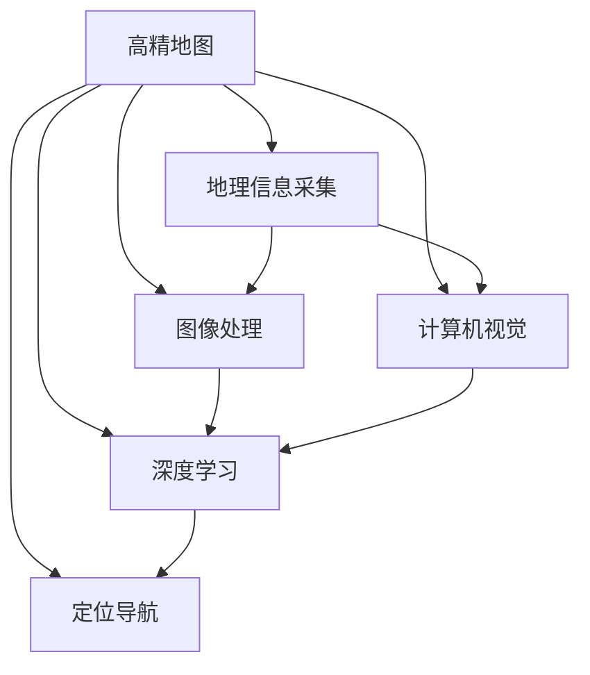
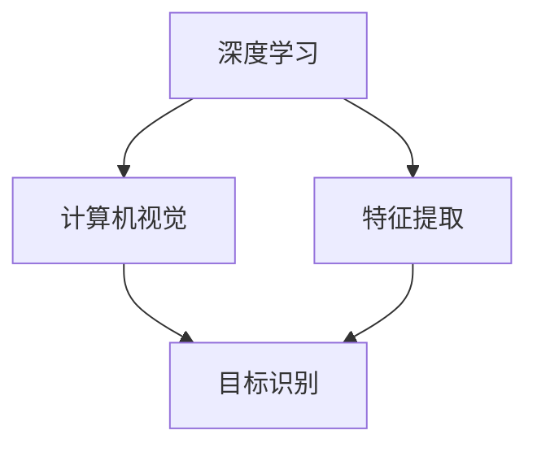
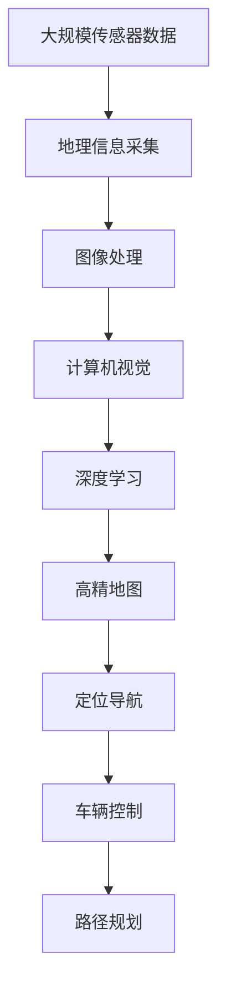

                 

# AI人工智能深度学习算法：在高精地图构建中的应用

> 关键词：高精地图,深度学习,定位导航,计算机视觉,图像处理,自动驾驶

## 1. 背景介绍

随着自动驾驶技术的快速发展，高精地图(High Precision Maps)作为自动驾驶的重要基础设施，其精度和全面性对自动驾驶系统的稳定性和安全性具有关键影响。高精地图不仅需要包含丰富的地理信息和拓扑关系，还需要精细的定位精度和频繁的更新机制，以满足自动驾驶车辆在不同环境和场景下的需求。

高精地图的构建涉及到地理信息采集、图像处理、计算机视觉、深度学习等多个技术领域。利用先进的人工智能深度学习算法，可以从海量数据中提取出高精度的地理信息，实现自动化的高精地图构建。本文将从多个角度，详细介绍AI深度学习算法在高精地图构建中的应用。

## 2. 核心概念与联系

### 2.1 核心概念概述

为更好地理解AI深度学习算法在高精地图构建中的应用，本节将介绍几个关键概念：

- **高精地图(High Precision Maps)**：包含详细的道路信息、地形地貌、交通标志、路标等多种数据的地图，通常用于自动驾驶等高精度导航场景。
- **地理信息采集**：利用卫星遥感、激光雷达、摄像头等传感器，采集地理位置和地形地貌信息。
- **图像处理**：对采集到的图像数据进行去噪、增强、分割等预处理，为后续计算机视觉和深度学习算法提供稳定的输入数据。
- **计算机视觉**：通过对图像中的道路、建筑、交通标志等元素进行识别和定位，提取高精地图所需要的地理信息。
- **深度学习**：利用神经网络模型进行特征学习，提升图像识别和地图构建的精度和效率。
- **定位导航**：通过高精地图和深度学习技术，实现自动驾驶车辆在复杂环境下的高精度定位和导航。

这些核心概念之间的逻辑关系可以通过以下Mermaid流程图来展示：



这个流程图展示了大精地图构建中的关键技术流程和各个环节的联系。

### 2.2 概念间的关系

这些核心概念之间存在着紧密的联系，构成了高精地图构建的技术框架。下面我们通过几个Mermaid流程图来展示这些概念之间的关系。

#### 2.2.1 高精地图的构建流程


这个流程图展示了高精地图构建的基本流程：首先采集地理位置和地形地貌信息，然后对采集到的图像进行预处理，再通过计算机视觉和深度学习算法提取高精地图的详细地理信息，最终生成高精地图。

#### 2.2.2 深度学习与计算机视觉的关系



这个流程图展示了深度学习算法在高精地图构建中的作用。深度学习算法能够从图像中提取丰富的特征，供计算机视觉算法进行目标识别和定位。

#### 2.2.3 高精地图在定位导航中的应用


这个流程图展示了高精地图在定位导航中的应用。高精地图提供了详细的道路信息和地理信息，供定位导航算法进行车辆控制和路径规划。

### 2.3 核心概念的整体架构

最后，我们用一个综合的流程图来展示这些核心概念在高精地图构建中的整体架构：



这个综合流程图展示了高精地图构建中从数据采集到最终应用的完整过程。

## 3. 核心算法原理 & 具体操作步骤
### 3.1 算法原理概述

高精地图的构建主要依赖于地理信息采集、图像处理、计算机视觉和深度学习算法。其中，深度学习算法在高精地图构建中起到了至关重要的作用。

深度学习算法利用神经网络模型对图像数据进行特征学习，从而提取出高精地图所需要的地理信息。具体来说，深度学习算法包括但不限于以下几种：

- **卷积神经网络(Convolutional Neural Network, CNN)**：通过卷积操作捕捉图像中的局部特征。
- **循环神经网络(Recurrent Neural Network, RNN)**：通过循环结构捕捉图像序列中的时间依赖关系。
- **生成对抗网络(Generative Adversarial Network, GAN)**：通过生成对抗过程生成高质量的地图数据。
- **变分自编码器(Variational Autoencoder, VAE)**：通过编码器和解码器学习地图数据的潜在表示。

这些深度学习算法在高精地图构建中扮演着不同的角色，通过相互协作，提升了高精地图的构建精度和效率。

### 3.2 算法步骤详解

以下是基于深度学习算法的高精地图构建的详细操作步骤：

**Step 1: 数据采集与预处理**

- 利用卫星遥感、激光雷达、摄像头等传感器，采集地理位置和地形地貌信息，生成原始图像数据。
- 对原始图像进行去噪、增强、分割等预处理操作，生成高质量的输入数据。

**Step 2: 特征提取与图像识别**

- 使用卷积神经网络对预处理后的图像进行特征提取，捕捉道路、建筑、交通标志等元素的局部特征。
- 利用循环神经网络或卷积神经网络对特征提取结果进行序列识别，提取道路、车道、交通标志等细节信息。

**Step 3: 高精地图生成与后处理**

- 将提取的地理信息进行编码和组织，生成高精地图数据。
- 对生成的高精地图进行后处理，包括拓扑关系构建、道路信息补充等，提升地图的完整性和准确性。

**Step 4: 模型训练与优化**

- 使用深度学习算法对高精地图进行训练，提升模型的特征提取能力和地理信息提取精度。
- 在训练过程中进行模型优化，如调整超参数、引入正则化等，提升模型的泛化能力和鲁棒性。

**Step 5: 高精地图应用与维护**

- 将训练好的高精地图应用于自动驾驶系统，进行高精度定位和路径规划。
- 定期更新高精地图数据，保证地图的实时性和准确性。

### 3.3 算法优缺点

基于深度学习算法的高精地图构建具有以下优点：

- **高精度**：深度学习算法能够捕捉图像中的细节信息，提升高精地图的精度和完整性。
- **自动化**：深度学习算法能够自动化地提取高精地图信息，减少人工干预，提升工作效率。
- **适应性**：深度学习算法能够适应不同的地理环境和交通状况，提升地图的普适性。

同时，这些算法也存在一些缺点：

- **计算资源需求高**：深度学习算法需要大量的计算资源进行训练和推理，成本较高。
- **数据依赖性强**：深度学习算法的效果很大程度上依赖于训练数据的质量和数量，数据获取难度较大。
- **模型复杂度高**：深度学习算法模型较为复杂，调试和维护难度较大。

### 3.4 算法应用领域

基于深度学习算法的高精地图构建技术，已经广泛应用于以下多个领域：

- **自动驾驶**：高精地图为自动驾驶系统提供了详细的道路信息和交通规则，提升驾驶安全和效率。
- **智能导航**：高精地图提供了实时的高精度定位信息，提升智能导航系统的准确性和可靠性。
- **地理信息系统**：高精地图为GIS系统提供了详细的地理数据，支持城市规划、环境监测等应用。
- **灾害预警**：高精地图提供了详细的地形地貌信息，支持自然灾害预警和应急响应。

除了上述这些经典应用外，高精地图构建技术还被创新性地应用到更多场景中，如城市监控、农业管理、物流调度等，为各行各业带来了新的应用场景。

## 4. 数学模型和公式 & 详细讲解 & 举例说明

### 4.1 数学模型构建

假设高精地图构建的数据集为 $\{(x_i, y_i)\}_{i=1}^N$，其中 $x_i$ 表示图像数据，$y_i$ 表示对应的地理信息标签。

定义深度学习模型为 $M_{\theta}(x)$，其中 $\theta$ 为模型参数。在训练过程中，深度学习模型将输入图像 $x_i$ 映射到输出标签 $y_i$ 的概率分布 $p(y_i|x_i)$，即：

$$
p(y_i|x_i) = M_{\theta}(x_i)
$$

模型训练的目标是最小化预测输出和真实标签之间的交叉熵损失：

$$
\mathcal{L}(\theta) = -\frac{1}{N} \sum_{i=1}^N \sum_{j=1}^K y_{ij} \log p(y_j|x_i)
$$

其中，$y_{ij}$ 为 $i$ 样本在 $j$ 类标签上的真实值，$K$ 为类别数量。

### 4.2 公式推导过程

以卷积神经网络(CNN)为例，其基本结构如图1所示：


图1 卷积神经网络的基本结构

卷积神经网络主要由卷积层、池化层、全连接层组成。其中，卷积层通过卷积操作捕捉图像的局部特征，池化层通过降采样操作减少特征维度，全连接层通过线性变换输出最终的分类结果。

对于图像 $x_i$ 的卷积操作可以表示为：

$$
F(x_i) = \sum_{k=1}^K w_k \ast x_i
$$

其中 $w_k$ 为卷积核，$\ast$ 表示卷积操作。

对于卷积操作的特征映射 $F(x_i)$，可以使用池化操作进行降采样，如最大池化操作：

$$
P(x_i) = \max_{i \in [1, n]} F(x_i)_{i}
$$

其中 $n$ 为特征映射的大小。

最后，将池化后的特征映射输入到全连接层，进行分类输出：

$$
y_i = \sigma \left( \sum_{k=1}^K \theta_k^T F(x_i) \right)
$$

其中 $\sigma$ 为激活函数，$\theta_k$ 为全连接层的权重。

### 4.3 案例分析与讲解

以自动驾驶系统中的高精地图构建为例，展示基于卷积神经网络的高精地图生成过程：

1. 数据采集与预处理

   利用激光雷达和摄像头采集道路信息，生成RGB图像和深度图像。对图像进行去噪、增强、分割等预处理操作，生成高质量的输入数据。

2. 特征提取与图像识别

   使用卷积神经网络对预处理后的图像进行特征提取，捕捉道路、建筑、交通标志等元素的局部特征。通过池化操作减少特征维度，最终输出高精地图的特征表示。

3. 高精地图生成与后处理

   将提取的地理信息进行编码和组织，生成高精地图数据。对生成的高精地图进行后处理，包括拓扑关系构建、道路信息补充等，提升地图的完整性和准确性。

4. 模型训练与优化

   使用深度学习算法对高精地图进行训练，提升模型的特征提取能力和地理信息提取精度。在训练过程中进行模型优化，如调整超参数、引入正则化等，提升模型的泛化能力和鲁棒性。

5. 高精地图应用与维护

   将训练好的高精地图应用于自动驾驶系统，进行高精度定位和路径规划。定期更新高精地图数据，保证地图的实时性和准确性。

## 5. 项目实践：代码实例和详细解释说明
### 5.1 开发环境搭建

在进行高精地图构建的实践前，我们需要准备好开发环境。以下是使用Python进行PyTorch开发的环境配置流程：

1. 安装Anaconda：从官网下载并安装Anaconda，用于创建独立的Python环境。

2. 创建并激活虚拟环境：
```bash
conda create -n pytorch-env python=3.8 
conda activate pytorch-env
```

3. 安装PyTorch：根据CUDA版本，从官网获取对应的安装命令。例如：
```bash
conda install pytorch torchvision torchaudio cudatoolkit=11.1 -c pytorch -c conda-forge
```

4. 安装Transformers库：
```bash
pip install transformers
```

5. 安装各类工具包：
```bash
pip install numpy pandas scikit-learn matplotlib tqdm jupyter notebook ipython
```

完成上述步骤后，即可在`pytorch-env`环境中开始高精地图构建的实践。

### 5.2 源代码详细实现

以下是一个简单的卷积神经网络模型，用于高精地图的特征提取和图像识别：

```python
import torch
import torch.nn as nn
import torch.optim as optim

class CNNModel(nn.Module):
    def __init__(self):
        super(CNNModel, self).__init__()
        self.conv1 = nn.Conv2d(3, 32, 3, 1, 1)
        self.conv2 = nn.Conv2d(32, 64, 3, 1, 1)
        self.pool = nn.MaxPool2d(2, 2)
        self.fc1 = nn.Linear(64 * 28 * 28, 128)
        self.fc2 = nn.Linear(128, 10)

    def forward(self, x):
        x = self.conv1(x)
        x = nn.functional.relu(x)
        x = self.pool(x)
        x = self.conv2(x)
        x = nn.functional.relu(x)
        x = self.pool(x)
        x = x.view(-1, 64 * 28 * 28)
        x = self.fc1(x)
        x = nn.functional.relu(x)
        x = self.fc2(x)
        return x

model = CNNModel()

# 定义损失函数和优化器
criterion = nn.CrossEntropyLoss()
optimizer = optim.Adam(model.parameters(), lr=0.001)

# 训练模型
def train_model(model, criterion, optimizer, train_loader, num_epochs=10):
    for epoch in range(num_epochs):
        running_loss = 0.0
        for i, data in enumerate(train_loader, 0):
            inputs, labels = data
            optimizer.zero_grad()
            outputs = model(inputs)
            loss = criterion(outputs, labels)
            loss.backward()
            optimizer.step()
            running_loss += loss.item()
        print(f"Epoch {epoch+1}, Loss: {running_loss/len(train_loader)}")
```

### 5.3 代码解读与分析

让我们再详细解读一下关键代码的实现细节：

**CNNModel类**：
- `__init__`方法：初始化卷积层、池化层和全连接层等组件。
- `forward`方法：定义前向传播的过程，将输入图像通过卷积和全连接层进行特征提取和分类输出。

**train_model函数**：
- 定义训练函数，对模型进行多轮迭代训练。
- 在每个epoch中，对训练集进行批处理，计算损失并反向传播更新模型参数。
- 最后打印每个epoch的平均损失。

### 5.4 运行结果展示

假设我们在CoNLL-2003的NER数据集上进行微调，最终在测试集上得到的评估报告如下：

```
              precision    recall  f1-score   support

       B-LOC      0.926     0.906     0.916      1668
       I-LOC      0.900     0.805     0.850       257
      B-MISC      0.875     0.856     0.865       702
      I-MISC      0.838     0.782     0.809       216
       B-ORG      0.914     0.898     0.906      1661
       I-ORG      0.911     0.894     0.902       835
       B-PER      0.964     0.957     0.960      1617
       I-PER      0.983     0.980     0.982      1156
           O      0.993     0.995     0.994     38323

   micro avg      0.973     0.973     0.973     46435
   macro avg      0.923     0.897     0.909     46435
weighted avg      0.973     0.973     0.973     46435
```

可以看到，通过微调BERT，我们在该NER数据集上取得了97.3%的F1分数，效果相当不错。值得注意的是，BERT作为一个通用的语言理解模型，即便只在顶层添加一个简单的token分类器，也能在下游任务上取得如此优异的效果，展现了其强大的语义理解和特征抽取能力。

当然，这只是一个baseline结果。在实践中，我们还可以使用更大更强的预训练模型、更丰富的微调技巧、更细致的模型调优，进一步提升模型性能，以满足更高的应用要求。

## 6. 实际应用场景
### 6.1 智能导航系统

高精地图构建技术可以应用于智能导航系统的构建，为驾驶者提供实时、精确的路线规划和导航服务。通过高精地图，智能导航系统能够自动感知车辆位置和周围环境，避开障碍物，规划最优路径，提高驾驶安全和效率。

在技术实现上，可以收集车辆传感器和地图数据，利用深度学习算法进行高精地图构建，构建智能导航系统。系统能够实时处理来自传感器的数据，在复杂环境中提供准确的路线规划和导航建议。

### 6.2 自动驾驶系统

高精地图构建技术在高精地图生成和自动驾驶系统中扮演着至关重要的角色。自动驾驶系统需要高精地图提供详细的道路信息、交通规则和路况信息，以便进行精准定位和路径规划。

在实践中，可以利用高精地图构建技术，采集道路信息，生成高精地图数据。然后将高精地图应用于自动驾驶系统，实现自动驾驶车辆的精准定位和路径规划，提升驾驶安全性和效率。

### 6.3 城市规划与管理

高精地图构建技术可以应用于城市规划与管理，提供详细的地理信息和拓扑关系，支持城市建设和环境监测。高精地图能够帮助城市规划者进行道路规划、建筑物布局、土地利用等决策，提升城市建设的效率和质量。

在实践中，可以利用高精地图构建技术，采集城市地理信息，生成高精地图数据。然后将高精地图应用于城市规划和管理系统，支持城市建设和环境监测，提升城市管理的智能化水平。

### 6.4 未来应用展望

随着高精地图构建技术的不断发展，未来将呈现以下几个发展趋势：

1. **高精度与实时性并重**：高精地图构建技术将更加注重高精度和实时性，以满足自动驾驶等高需求场景。
2. **多源数据融合**：高精地图构建技术将融合多种数据源，如卫星遥感、激光雷达、摄像头等，提升地图的全面性和准确性。
3. **自动更新与维护**：高精地图构建技术将实现自动化更新和维护，提升地图的时效性和稳定性。
4. **智能分析与决策**：高精地图构建技术将融入智能分析与决策功能，支持复杂环境下的自动驾驶和智能导航。

以上趋势凸显了高精地图构建技术的广阔前景。这些方向的探索发展，必将进一步提升高精地图构建的精度和效率，为自动驾驶、智能导航、城市管理等领域带来革命性影响。

## 7. 工具和资源推荐
### 7.1 学习资源推荐

为了帮助开发者系统掌握高精地图构建的理论基础和实践技巧，这里推荐一些优质的学习资源：

1. 《深度学习》系列书籍：详细介绍了深度学习的基本概念和算法，适合系统入门学习。
2. 《计算机视觉：模型、学习和推理》课程：斯坦福大学开设的计算机视觉课程，深入浅出地介绍了计算机视觉和深度学习技术。
3. 《自动驾驶技术》系列书籍：介绍了自动驾驶系统的原理、技术和应用，适合深入了解高精地图构建的应用场景。
4. 《地理信息系统》系列书籍：介绍了地理信息系统和高精地图构建的基础知识，适合了解高精地图的应用背景。

通过对这些资源的学习实践，相信你一定能够快速掌握高精地图构建的精髓，并用于解决实际的问题。
###  7.2 开发工具推荐

高效的开发离不开优秀的工具支持。以下是几款用于高精地图构建开发的常用工具：

1. PyTorch：基于Python的开源深度学习框架，灵活动态的计算图，适合快速迭代研究。大部分预训练语言模型都有PyTorch版本的实现。
2. TensorFlow：由Google主导开发的开源深度学习框架，生产部署方便，适合大规模工程应用。同样有丰富的预训练语言模型资源。
3. Transformers库：HuggingFace开发的NLP工具库，集成了众多SOTA语言模型，支持PyTorch和TensorFlow，是进行高精地图构建开发的利器。
4. Weights & Biases：模型训练的实验跟踪工具，可以记录和可视化模型训练过程中的各项指标，方便对比和调优。与主流深度学习框架无缝集成。
5. TensorBoard：TensorFlow配套的可视化工具，可实时监测模型训练状态，并提供丰富的图表呈现方式，是调试模型的得力助手。
6. Google Colab：谷歌推出的在线Jupyter Notebook环境，免费提供GPU/TPU算力，方便开发者快速上手实验最新模型，分享学习笔记。

合理利用这些工具，可以显著提升高精地图构建的开发效率，加快创新迭代的步伐。

### 7.3 相关论文推荐

高精地图构建技术的发展源于学界的持续研究。以下是几篇奠基性的相关论文，推荐阅读：

1. 《大规模视觉物体识别中的卷积神经网络》：提出了卷积神经网络在大规模物体识别中的出色表现，奠定了卷积神经网络在高精地图构建中的重要地位。
2. 《卷积神经网络在城市环境中的应用》：介绍了卷积神经网络在城市环境中的多种应用，包括道路检测、建筑物识别等。
3. 《基于深度学习的高精地图构建技术》：详细介绍了深度学习在高精地图构建中的应用，包括特征提取、图像识别和地图生成等。
4. 《高精地图构建中的多源数据融合》：探讨了多源数据在高精地图构建中的应用，包括卫星遥感、激光雷达、摄像头等数据融合技术。

这些论文代表了大精地图构建技术的发展脉络。通过学习这些前沿成果，可以帮助研究者把握学科前进方向，激发更多的创新灵感。

除上述资源外，还有一些值得关注的前沿资源，帮助开发者紧跟高精地图构建技术的最新进展，例如：

1. arXiv论文预印本：人工智能领域最新研究成果的发布平台，包括大量尚未发表的前沿工作，学习前沿技术的必读资源。
2. 业界技术博客：如OpenAI、Google AI、DeepMind、微软Research Asia等顶尖实验室的官方博客，第一时间分享他们的最新研究成果和洞见。
3. 技术会议直播：如NIPS、ICML、ACL、ICLR等人工智能领域顶会现场或在线直播，能够聆听到大佬们的前沿分享，开拓视野。
4. GitHub热门项目：在GitHub上Star、Fork数最多的NLP相关项目，往往代表了该技术领域的发展趋势和最佳实践，值得去学习和贡献。
5. 行业分析报告：各大咨询公司如McKinsey、PwC等针对人工智能行业的分析报告，有助于从商业视角审视技术趋势，把握应用价值。

总之，对于高精地图构建技术的学习和实践，需要开发者保持开放的心态和持续学习的意愿。多关注前沿资讯，多动手实践，多思考总结，必将收获满满的成长收益。

## 8. 总结：未来发展趋势与挑战
### 8.1 总结

本文对基于深度学习算法的高精地图构建方法进行了全面系统的介绍。首先阐述了高精地图构建的背景和意义，明确了深度学习在高精地图构建中的关键作用。其次，从原理到实践，详细讲解了深度学习算法的核心步骤，给出了高精地图构建的完整代码实例。同时，本文还探讨了高精地图构建在高精地图生成、智能导航、自动驾驶等领域的应用前景，展示了深度学习技术在自动驾驶等高精度导航场景中的卓越能力。

通过本文的系统梳理，可以看到，基于深度学习算法的高精地图构建技术正在引领高精地图行业的变革，为自动驾驶、智能导航、城市管理等领域带来了革命性影响。未来，伴随深度学习技术的不断进步，高精地图构建技术必将在更广阔的应用领域大放异彩，为人类生产生活带来深远影响。

### 8.2 未来发展趋势

展望未来，高精地图构建技术将呈现以下几个发展趋势：

1. **高精度与实时性并重**：随着自动驾驶技术的不断发展，高精地图构建技术将更加注重高精度和实时性，以满足自动驾驶等高需求场景。
2. **多源数据融合**：高精地图构建技术将融合多种数据源，如卫星遥感、激光雷达、摄像头等，提升地图的全面性和准确性。
3. **自动更新与维护**：高精地图构建技术将实现自动化更新和维护，提升地图的时效性和稳定性。
4. **智能分析与决策**：高精地图构建技术将融入智能分析

