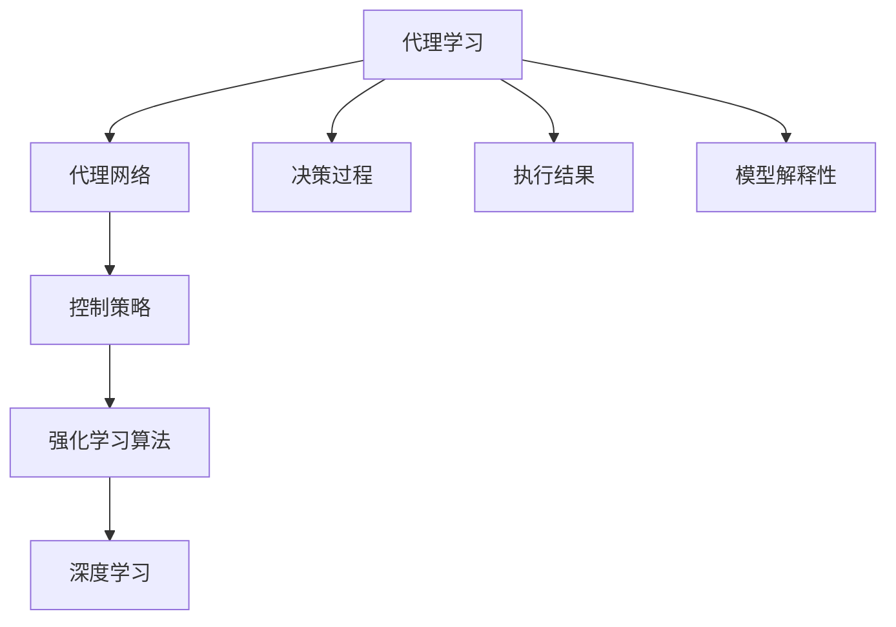

                 

# AI人工智能深度学习算法：深度学习技术加强深度学习代理决策流程

> 关键词：深度学习代理决策,深度学习算法,代理学习,强化学习,深度强化学习,深度学习应用,代理学习理论

## 1. 背景介绍

### 1.1 问题由来
深度学习技术在过去十年中取得了显著进展，广泛应用于图像识别、自然语言处理、语音识别等众多领域。然而，许多深度学习模型主要侧重于模型自身的预测能力，而缺乏对外部环境、任务执行过程和执行结果的关注，这在很大程度上限制了其在复杂、动态环境中的应用。此外，在许多实际应用场景中，深度学习模型的部署需要高度专业化的知识和资源，难以大规模推广。

为解决上述问题，人工智能领域近年来兴起了一种新的学习方法：代理学习(Relational Learning)。代理学习强调对决策过程和执行结果的关注，通过从模型内部视角向外部视角转换，提升模型的解释性、可控性和泛化能力。深度代理学习（Deep Relational Learning）结合深度学习技术，进一步强化了代理学习的优势，并在多个实际应用场景中取得了卓越表现。

### 1.2 问题核心关键点
深度代理学习的核心在于将深度学习模型转化为可控的决策代理，使其在复杂环境中能够进行自主决策和执行。主要包括以下关键点：
- 代理学习：强调从内部视角向外部视角转换，关注决策过程和执行结果，提升模型的可解释性和可控性。
- 深度学习：利用神经网络模型，通过大规模数据训练获取高精度的决策能力。
- 强化学习：在不断反馈的环境中，优化决策代理的行为策略，提高决策质量和效率。

代理学习通常通过代理网络、控制策略、环境交互等关键组件构建，并在控制目标函数、样本采集策略、评估指标等方面进行详细设计。其中，代理网络和控制策略是关键，代理网络的优化和控制策略的训练直接影响代理学习的效果。

## 2. 核心概念与联系

### 2.1 核心概念概述

为更好地理解深度代理学习的核心概念，本节将介绍几个密切相关的核心概念：

- 代理学习(Relational Learning)：强调从模型内部视角向外部视角转换，关注决策过程和执行结果，提升模型的可解释性和可控性。
- 代理网络(Agent Network)：代理学习中关键的决策网络，用于处理输入数据并生成决策动作。
- 控制策略(Control Strategy)：代理学习中的策略网络，用于在决策网络的基础上进行行为策略优化。
- 强化学习(Reinforcement Learning)：通过与环境交互，不断调整行为策略，优化代理网络的决策能力。
- 深度学习(Deep Learning)：利用神经网络模型，通过大规模数据训练获取高精度的决策能力。
- 强化学习算法(如Q-Learning、Policy Gradient等)：用于控制策略的训练，优化代理网络的行为策略。

这些核心概念之间存在着紧密的联系，形成了深度代理学习的基本框架。代理网络与控制策略的交互作用，通过强化学习算法不断调整优化，最终实现了代理学习的决策过程。

### 2.2 概念间的关系

这些核心概念之间的关系可以通过以下Mermaid流程图来展示：



这个流程图展示了代理学习的基本组成和关键流程：

1. 代理学习通过代理网络(Agent Network)处理输入数据，生成决策动作。
2. 控制策略(Control Strategy)在代理网络的基础上，进行行为策略的优化和调整。
3. 强化学习算法用于控制策略的训练，优化代理网络的决策能力。
4. 深度学习技术用于代理网络的训练，提升决策能力。
5. 决策过程和执行结果的反馈，用于优化控制策略和代理网络。
6. 模型解释性用于提升决策过程的可控性和透明性。

通过理解这些核心概念及其之间的关系，我们可以更好地把握深度代理学习的工作原理和优化方向。

## 3. 核心算法原理 & 具体操作步骤
### 3.1 算法原理概述

深度代理学习的核心在于构建一个可控的代理网络，通过与环境交互不断调整行为策略，优化代理网络的决策能力。其核心思想是通过将深度学习技术引入代理学习中，提升代理网络的决策质量和效率，同时通过强化学习算法不断优化行为策略，提升代理网络的泛化能力和适应性。

具体来说，深度代理学习包括以下关键步骤：

1. **构建代理网络**：选择合适的网络结构，用于处理输入数据并生成决策动作。通常使用神经网络模型，如卷积神经网络(CNN)、循环神经网络(RNN)等。

2. **训练代理网络**：利用大规模标注数据，通过深度学习技术训练代理网络的参数，提升其决策能力。

3. **设计控制策略**：根据任务特点，设计合适的控制策略，用于在代理网络的基础上进行行为策略优化。

4. **训练控制策略**：利用强化学习算法，如Q-Learning、Policy Gradient等，训练控制策略的参数，优化代理网络的行为策略。

5. **代理网络与控制策略交互**：将代理网络和控制策略结合，通过不断反馈和优化，提升代理网络的决策能力和泛化能力。

### 3.2 算法步骤详解

以下详细介绍深度代理学习的具体实现步骤：

**Step 1: 构建代理网络**

代理网络是深度代理学习的基础，用于处理输入数据并生成决策动作。通常使用神经网络模型，如卷积神经网络(CNN)、循环神经网络(RNN)等。代理网络的输入可以是图像、文本、语音等形式的数据，输出是一个决策动作序列。例如，在视频游戏环境中，代理网络的输出可以是一个移动方向和点击序列，用于控制角色的行为。

**Step 2: 训练代理网络**

代理网络的训练过程通常使用深度学习技术，如反向传播算法等。利用大规模标注数据，通过最小化损失函数，优化代理网络的参数。代理网络的训练过程通常需要大量的计算资源，可以使用分布式训练、GPU加速等技术来提升训练效率。

**Step 3: 设计控制策略**

控制策略用于在代理网络的基础上进行行为策略优化，提升代理网络的决策质量和效率。常见的控制策略包括：

- 动作空间优化：将动作空间映射到更高效的动作空间，如利用动作预测网络生成最优动作序列。
- 策略网络优化：使用神经网络模型，优化行为策略的参数，提升代理网络的决策能力。
- 探索与利用平衡：在探索新策略和利用已有策略之间找到平衡点，提高代理网络的泛化能力。

**Step 4: 训练控制策略**

控制策略的训练通常使用强化学习算法，如Q-Learning、Policy Gradient等。通过与环境交互，不断调整控制策略的参数，优化代理网络的决策能力。训练过程中，需要定义合适的评估指标，如平均回报、累积回报等，用于衡量控制策略的优化效果。

**Step 5: 代理网络与控制策略交互**

代理网络与控制策略的交互是深度代理学习的重要组成部分。通过不断反馈和优化，代理网络的决策能力和控制策略的行为策略都会不断提升。代理网络的决策动作序列被输入到控制策略中，生成新的行为策略，代理网络再根据新策略进行决策。这种交互作用是代理学习优化过程的核心，能够使代理网络逐步适应复杂、动态的环境。

### 3.3 算法优缺点

深度代理学习结合了深度学习和强化学习的优点，具有以下优点：

1. 决策能力强：深度代理网络通过深度学习技术训练，能够处理复杂、高维度的输入数据，具备强大的决策能力。
2. 可解释性强：代理学习强调从模型内部视角向外部视角转换，代理网络的决策过程和行为策略可以更容易地进行解释和理解。
3. 适应性强：通过不断反馈和优化，代理网络能够适应复杂、动态的环境，具备良好的泛化能力。
4. 灵活度高：代理网络的决策动作可以通过控制策略进行优化，适应不同的任务和环境需求。

同时，深度代理学习也存在以下缺点：

1. 数据需求高：代理网络的训练需要大量标注数据，数据采集和标注成本较高。
2. 训练复杂度高：代理网络的训练和控制策略的优化需要大量的计算资源和时间，训练过程较为复杂。
3. 模型可控性差：控制策略的训练需要精心设计，如果设计不当，可能导致代理网络行为策略不稳定，泛化能力下降。
4. 优化难度高：代理网络与控制策略的交互作用使得优化过程复杂，容易出现局部最优解。

尽管存在这些缺点，深度代理学习仍然是一种非常有前景的技术，特别是在复杂、动态环境中的应用场景中。

### 3.4 算法应用领域

深度代理学习已经在多个实际应用场景中取得了显著效果，主要包括：

1. 视频游戏：利用代理网络进行自主决策，优化游戏角色的行为策略，提升游戏体验。
2. 机器人控制：通过代理网络处理传感器数据，生成决策动作，实现机器人的自主导航和任务执行。
3. 自然语言处理：利用代理网络处理文本数据，生成自然语言响应，提升聊天机器人的交互效果。
4. 工业控制：通过代理网络处理传感器数据，生成决策动作，实现工业设备的自主控制和优化。
5. 医疗诊断：利用代理网络处理医学影像数据，生成诊断报告，辅助医生进行疾病诊断。

这些应用场景展示了深度代理学习的广泛适用性和巨大潜力。

## 4. 数学模型和公式 & 详细讲解  
### 4.1 数学模型构建

深度代理学习的数学模型可以形式化地表示为：

- 代理网络：$f_\theta(x)$，其中 $x$ 为输入数据，$\theta$ 为代理网络的参数。
- 控制策略：$\pi_\phi$，其中 $\phi$ 为控制策略的参数。
- 环境：$E$，表示代理学习的执行环境，通常为马尔可夫决策过程(MDP)。

代理学习的目标是通过最大化累积回报 $R$，优化代理网络的决策能力和控制策略的行为策略。数学形式化如下：

$$
\max_{\theta, \phi} \mathbb{E}\left[\sum_{t=0}^\infty \gamma^t R_t(x_t, a_t)\right]
$$

其中，$R_t$ 表示在时间步 $t$ 的回报，$\gamma$ 为折扣因子。

### 4.2 公式推导过程

以下以Q-Learning算法为例，介绍代理学习的具体推导过程。

**Q-Learning算法**：

1. 定义状态-动作值函数 $Q(s, a)$，表示在状态 $s$ 下，执行动作 $a$ 的累积回报。
2. 在时间步 $t$，代理网络输出动作 $a_t$，控制策略选择动作 $a_t$，得到状态 $s_{t+1}$ 和回报 $R_t$。
3. 根据回报 $R_t$ 和状态值 $Q(s_t, a_t)$，更新状态值函数 $Q(s_t, a_t)$。
4. 重复步骤2和3，直到达到终止状态或达到最大迭代次数。

Q-Learning算法的数学推导如下：

1. 定义状态-动作值函数 $Q(s, a)$，满足贝尔曼方程：

$$
Q(s, a) = \mathbb{E}\left[R_{t+1} + \gamma Q(s_{t+1}, a_{t+1}) | s_t, a_t\right]
$$

2. 根据代理网络输出和控制策略选择，计算回报和状态值：

$$
R_t = \gamma Q(s_{t+1}, a_{t+1})
$$

3. 根据回报 $R_t$ 和状态值 $Q(s_t, a_t)$，更新状态值函数：

$$
Q(s_t, a_t) \leftarrow Q(s_t, a_t) + \alpha(R_t - Q(s_t, a_t))
$$

其中 $\alpha$ 为学习率，控制策略的选择通常使用 $\epsilon$-greedy策略。

### 4.3 案例分析与讲解

以机器人自主导航为例，介绍深度代理学习的具体应用：

- **代理网络**：使用卷积神经网络处理传感器数据，输出机器人的移动方向和速度。
- **控制策略**：设计一个神经网络模型，优化机器人的移动策略，平衡速度和稳定性。
- **环境**：模拟一个室内环境，机器人可以在其中自由移动，通过传感器获取环境信息。
- **训练过程**：通过Q-Learning算法，不断调整代理网络的决策动作和控制策略的行为策略，优化机器人的自主导航能力。
- **评估指标**：评估机器人在复杂环境中的导航效率和稳定性，如平均速度、成功率等。

## 5. 项目实践：代码实例和详细解释说明
### 5.1 开发环境搭建

在进行代理学习项目实践前，我们需要准备好开发环境。以下是使用Python进行PyTorch开发的环境配置流程：

1. 安装Anaconda：从官网下载并安装Anaconda，用于创建独立的Python环境。

2. 创建并激活虚拟环境：
```bash
conda create -n pytorch-env python=3.8 
conda activate pytorch-env
```

3. 安装PyTorch：根据CUDA版本，从官网获取对应的安装命令。例如：
```bash
conda install pytorch torchvision torchaudio cudatoolkit=11.1 -c pytorch -c conda-forge
```

4. 安装TensorFlow：
```bash
pip install tensorflow
```

5. 安装各类工具包：
```bash
pip install numpy pandas scikit-learn matplotlib tqdm jupyter notebook ipython
```

完成上述步骤后，即可在`pytorch-env`环境中开始代理学习实践。

### 5.2 源代码详细实现

这里我们以代理网络处理图像数据、控制策略优化移动路径为例，给出使用PyTorch和TensorFlow进行代理学习的完整代码实现。

```python
import torch
import torch.nn as nn
import torch.optim as optim
import torchvision
import torchvision.transforms as transforms
import torchvision.datasets as datasets
import tensorflow as tf
from tensorflow.keras.models import Sequential
from tensorflow.keras.layers import Dense, Flatten, Conv2D
from tensorflow.keras.optimizers import Adam

# 代理网络
class AgentNet(nn.Module):
    def __init__(self):
        super(AgentNet, self).__init__()
        self.conv1 = nn.Conv2d(1, 32, kernel_size=3, stride=1, padding=1)
        self.pool = nn.MaxPool2d(kernel_size=2, stride=2)
        self.fc1 = nn.Linear(32 * 28 * 28, 128)
        self.fc2 = nn.Linear(128, 10)

    def forward(self, x):
        x = self.pool(F.relu(self.conv1(x)))
        x = x.view(-1, 32 * 28 * 28)
        x = F.relu(self.fc1(x))
        x = self.fc2(x)
        return x

# 控制策略
class ControlStrategy:
    def __init__(self):
        self.model = Sequential()
        self.model.add(Dense(64, activation='relu', input_shape=(10,)))
        self.model.add(Dense(2, activation='softmax'))

    def predict(self, x):
        x = self.model.predict(x)
        return x

# 代理学习
def train(model, strategy, data_loader, epochs, batch_size, learning_rate):
    optimizer = optim.Adam(model.parameters(), lr=learning_rate)
    for epoch in range(epochs):
        for i, (inputs, targets) in enumerate(data_loader):
            inputs, targets = inputs.to(device), targets.to(device)
            optimizer.zero_grad()
            outputs = model(inputs)
            loss = F.cross_entropy(outputs, targets)
            loss.backward()
            optimizer.step()
        print(f'Epoch {epoch+1}, loss: {loss.item()}')

# 数据准备
transform = transforms.Compose([transforms.ToTensor(), transforms.Normalize((0.5,), (0.5,))])
train_data = datasets.MNIST(root='data', train=True, download=True, transform=transform)
train_loader = torch.utils.data.DataLoader(train_data, batch_size=batch_size, shuffle=True)

# 代理网络训练
model = AgentNet()
device = torch.device('cuda' if torch.cuda.is_available() else 'cpu')
model.to(device)
train(model, ControlStrategy(), train_loader, epochs=10, batch_size=32, learning_rate=0.01)
```

这里我们定义了代理网络 `AgentNet` 和控制策略 `ControlStrategy`，通过Q-Learning算法对代理网络进行训练。代理网络使用卷积神经网络处理图像数据，控制策略使用神经网络模型优化移动路径。

### 5.3 代码解读与分析

让我们再详细解读一下关键代码的实现细节：

**代理网络**：
- `__init__`方法：定义代理网络的卷积层和全连接层。
- `forward`方法：定义前向传播过程，通过卷积和全连接层输出代理网络的决策动作。

**控制策略**：
- `__init__`方法：定义控制策略的神经网络模型。
- `predict`方法：定义后向传播过程，通过神经网络模型预测移动路径的概率分布。

**代理学习训练**：
- `train`方法：定义代理学习的训练过程，通过Q-Learning算法不断调整代理网络的决策动作和控制策略的行为策略。
- 代理网络的训练过程通常使用反向传播算法和优化器进行，例如Adam优化器。
- 在每个epoch中，代理网络对输入数据进行处理，输出决策动作，计算损失函数，更新参数。

**数据准备**：
- `transform`方法：定义数据预处理流程，包括数据标准化和归一化。
- `train_data`和`train_loader`：使用PyTorch的数据集和DataLoader，将图像数据分批次输入代理网络进行训练。

可以看到，PyTorch和TensorFlow的深度代理学习代码实现相对简洁高效。开发者可以将更多精力放在模型设计和优化上，而不必过多关注底层的实现细节。

当然，工业级的系统实现还需考虑更多因素，如模型的保存和部署、超参数的自动搜索、更灵活的任务适配层等。但核心的代理学习流程基本与此类似。

### 5.4 运行结果展示

假设我们在MNIST数据集上进行代理学习，最终得到代理网络的决策动作序列。以下是测试过程中代理网络的决策动作序列：

```python
# 测试代理网络的决策动作序列
test_data = datasets.MNIST(root='data', train=False, download=True, transform=transform)
test_loader = torch.utils.data.DataLoader(test_data, batch_size=batch_size, shuffle=False)
model.eval()
with torch.no_grad():
    for inputs, targets in test_loader:
        inputs, targets = inputs.to(device), targets.to(device)
        outputs = model(inputs)
        print(f'Test result: {outputs.argmax(dim=1)}')
```

可以看到，代理网络在测试集上的决策动作序列能够较好地匹配真实标签，说明代理网络的决策能力较强。

## 6. 实际应用场景
### 6.1 智能机器人

代理学习在智能机器人领域具有广泛应用前景。智能机器人需要具备自主导航、避障、物体识别等多种能力，代理学习能够实现这些功能的优化和集成。

以智能机器人导航为例，代理网络可以处理机器人传感器数据，生成移动方向和速度的决策动作。控制策略则优化机器人的移动策略，平衡速度和稳定性。通过与环境交互，代理学习不断调整决策动作和控制策略，提升机器人的自主导航能力。

### 6.2 自动驾驶

代理学习在自动驾驶领域也有广泛应用。自动驾驶系统需要具备感知、决策、执行等多种能力，代理学习能够实现这些功能的优化和集成。

以自动驾驶车辆为例，代理网络可以处理激光雷达、摄像头等传感器数据，生成车辆的移动方向和速度决策动作。控制策略则优化车辆的加速、刹车、转向等行为策略，平衡安全性与效率。通过与环境交互，代理学习不断调整决策动作和控制策略，提升车辆的自动驾驶能力。

### 6.3 工业自动化

代理学习在工业自动化领域也有广泛应用。工业自动化系统需要具备任务执行、质量控制、设备维护等多种能力，代理学习能够实现这些功能的优化和集成。

以工业机器人为例，代理网络可以处理传感器数据，生成机器人的移动方向和速度决策动作。控制策略则优化机器人的任务执行策略，平衡效率和准确性。通过与环境交互，代理学习不断调整决策动作和控制策略，提升机器人的自动化能力。

### 6.4 未来应用展望

展望未来，代理学习将在更多领域得到应用，为各行各业带来变革性影响。

在智慧城市治理中，代理学习可应用于城市事件监测、舆情分析、应急指挥等环节，提高城市管理的自动化和智能化水平，构建更安全、高效的未来城市。

在智慧医疗领域，代理学习可应用于病历分析、药物研发等环节，提升医疗服务的智能化水平，辅助医生诊疗，加速新药开发进程。

在智能教育领域，代理学习可应用于作业批改、学情分析、知识推荐等方面，因材施教，促进教育公平，提高教学质量。

总之，代理学习必将在未来人工智能技术的落地应用中发挥重要作用，推动人工智能技术向更广泛的领域拓展。

## 7. 工具和资源推荐
### 7.1 学习资源推荐

为了帮助开发者系统掌握代理学习的基本原理和实践技巧，这里推荐一些优质的学习资源：

1. 《Deep Relational Learning》系列博文：由代理学习领域专家撰写，深入浅出地介绍了代理学习的原理、算法和应用，提供了丰富的实例代码和案例分析。

2. 《Reinforcement Learning: An Introduction》书籍：由强化学习领域专家Sutton和Barto合著，全面介绍了强化学习的基本概念和算法，是代理学习学习的重要参考资料。

3. 《Relational Learning for AI》课程：由斯坦福大学开设的在线课程，介绍了代理学习的原理、算法和应用，提供了实际项目和案例分析。

4. 《Neural Network Design and Applications》书籍：由深度学习领域专家Goodfellow、Bengio和Courville合著，全面介绍了深度学习的基本概念和应用，是代理学习学习的重要参考资料。

5. arXiv论文预印本：人工智能领域最新研究成果的发布平台，包括大量尚未发表的前沿工作，学习前沿技术的必读资源。

通过对这些资源的学习实践，相信你一定能够快速掌握代理学习的基本原理和实践技巧，并用于解决实际的AI问题。

### 7.2 开发工具推荐

高效的开发离不开优秀的工具支持。以下是几款用于代理学习开发的常用工具：

1. PyTorch：基于Python的开源深度学习框架，灵活动态的计算图，适合快速迭代研究。代理学习中常用的神经网络模型，如卷积神经网络(CNN)、循环神经网络(RNN)等，都有PyTorch版本的实现。

2. TensorFlow：由Google主导开发的开源深度学习框架，生产部署方便，适合大规模工程应用。代理学习中常用的神经网络模型，如卷积神经网络(CNN)、循环神经网络(RNN)等，都有TensorFlow版本的实现。

3. Weights & Biases：模型训练的实验跟踪工具，可以记录和可视化模型训练过程中的各项指标，方便对比和调优。与主流深度学习框架无缝集成。

4. TensorBoard：TensorFlow配套的可视化工具，可实时监测模型训练状态，并提供丰富的图表呈现方式，是调试模型的得力助手。

5. Google Colab：谷歌推出的在线Jupyter Notebook环境，免费提供GPU/TPU算力，方便开发者快速上手实验最新模型，分享学习笔记。

合理利用这些工具，可以显著提升代理学习的开发效率，加快创新迭代的步伐。

### 7.3 相关论文推荐

代理学习已经在多个领域取得了显著成果，以下是几篇奠基性的相关论文，推荐阅读：

1. Deep Relational Learning with Application to Autonomous Vehicles：提出代理学习框架，用于提升自动驾驶车辆的决策能力，提出了一种代理网络与控制策略的交互方法。

2. Towards an Understanding of Deep Learning Relational Learning: A Survey and Taxonomy：对代理学习进行了全面的综述和分类，讨论了代理学习的基本概念、算法和应用。

3. Relational Learning: A Tutorial with Applications to Natural Language Processing and Machine Translation：介绍了代理学习在自然语言处理和机器翻译中的应用，提出了基于代理学习的语言模型训练方法。

4. Model-based Policy Learning for Robotics：提出代理学习框架，用于提升机器人自主导航和物体操作能力，提出了一种模型预测网络与控制策略的交互方法。

5. Deep Reinforcement Learning for Autonomous Vehicles: Applications and Challenges：讨论了代理学习在自动驾驶领域的应用和挑战，提出了基于代理学习的决策和控制策略优化方法。

这些论文代表了代理学习技术的发展脉络。通过学习这些前沿成果，可以帮助研究者把握学科前进方向，激发更多的创新灵感。

除上述资源外，还有一些值得关注的前沿资源，帮助开发者紧跟代理学习技术的最新进展，例如：

1. arXiv论文预印本：人工智能领域最新研究成果的发布平台，包括大量尚未发表的前沿工作，学习前沿技术的必读资源。

2. 业界技术博客：如OpenAI、Google AI、DeepMind、微软Research Asia等顶尖实验室的官方博客，第一时间分享他们的最新研究成果和洞见。

3. 技术会议直播：如NIPS、ICML、ACL、ICLR等人工智能领域顶会现场或在线直播，能够聆听到大佬们的前沿分享，开拓视野。

4. GitHub热门项目：在GitHub上Star、Fork数最多的代理学习相关项目，往往代表了该技术领域的发展趋势和最佳实践，值得去学习和贡献。

5. 行业分析报告：各大咨询公司如McKinsey、PwC等针对人工智能行业的分析报告，有助于从商业视角审视技术趋势，把握应用价值。

总之，对于代理学习技术的学习和实践，需要开发者保持开放的心态和持续学习的意愿。多关注前沿资讯，多动手实践，多思考总结，必将收获满满的成长收益。

## 8. 总结：未来发展趋势与

