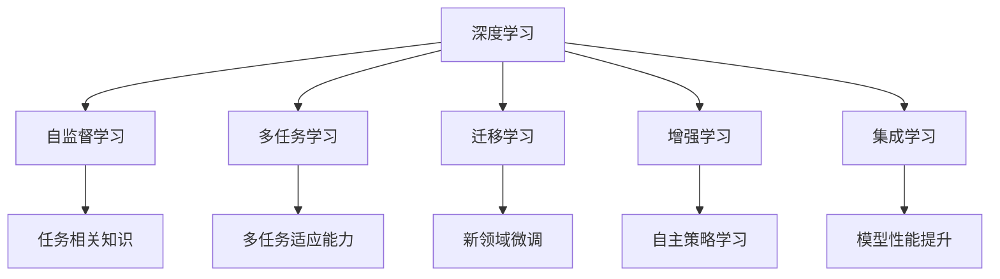
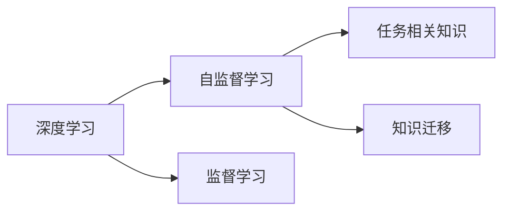
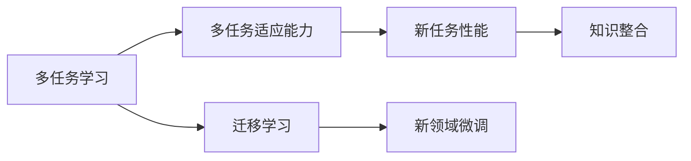
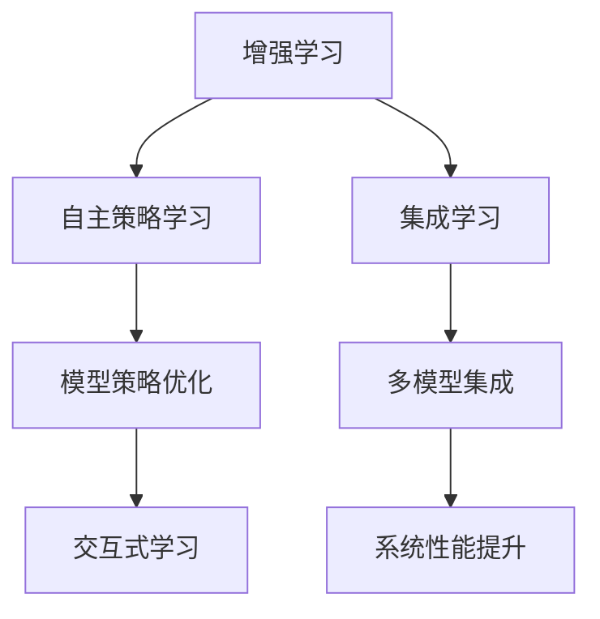
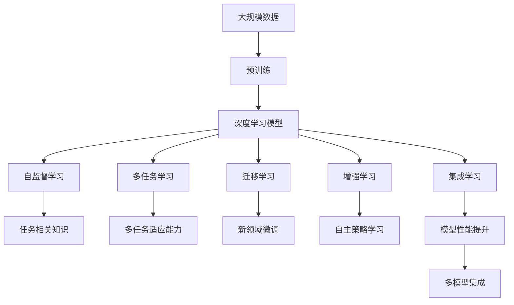

                 

# AI人工智能深度学习算法：跨领域自主深度学习代理的集成

> 关键词：
深度学习, 自主代理, 集成学习, 多模态, 多任务, 迁移学习, 增强学习, 神经网络

## 1. 背景介绍

### 1.1 问题由来
在人工智能发展的道路上，深度学习扮演着至关重要的角色。自2012年ImageNet图像识别竞赛中深度学习大放异彩以来，深度神经网络已成为AI研究的主流范式。然而，随着深度学习技术在各领域的广泛应用，我们逐渐发现一些难以逾越的挑战。

首先，尽管深度学习在特定任务上取得了显著成功，但面对新的任务，模型的泛化能力仍然有限。模型往往需要重新从头训练，耗费大量的数据、时间和计算资源。

其次，深度学习模型通常是"黑盒"，难以解释其内部工作机制和决策逻辑，这在医疗、法律等高风险应用中尤为关键。模型的可解释性和透明性亟需加强。

再次，深度学习模型往往需要大量标注数据进行训练，在标注成本较高的领域，如金融、医疗、航空等，这一需求成为制约模型发展的瓶颈。如何降低标注成本，提高模型效率，是一个亟待解决的问题。

为了解决这些挑战，自主深度学习代理应运而生。它们通过深度学习技术，在缺乏监督的情况下自主学习、适应环境，同时能够与其他模型进行互动，集成学习，形成更强大、更灵活的系统。

### 1.2 问题核心关键点
自主深度学习代理是一种具有自我学习能力、适应环境能力的深度学习模型。它们可以跨领域进行自主学习，将不同领域的经验知识进行集成，提升在特定任务上的性能。其核心技术包括：

- 自监督学习：在缺乏监督信号的情况下，通过设计预训练任务，让模型自主学习任务相关的知识。
- 多任务学习：在训练过程中，同时学习多个任务，使得模型具备更广泛的知识迁移能力。
- 迁移学习：将已训练好的模型参数和知识，迁移到新的领域进行微调，适应新任务。
- 增强学习：在环境中通过与环境的交互，自主学习和改进模型策略。
- 集成学习：将多个模型的预测结果进行集成，提升系统性能和鲁棒性。

这些核心技术共同构成了自主深度学习代理的实现框架，使得模型能够在缺乏监督的情况下，自动适应新环境，提升性能和泛化能力。

### 1.3 问题研究意义
自主深度学习代理的研究，对于拓展深度学习模型的应用范围，提升模型性能和效率，增强模型的可解释性和透明性，具有重要意义：

1. 降低应用开发成本。通过跨领域自主学习，模型可以在不同领域进行迁移应用，无需从头训练，减少了数据、时间和计算资源的投入。
2. 提升模型效果。自主学习使得模型能够自动适应新任务，获得了更强的泛化能力。
3. 增强可解释性。通过设计合理的损失函数和评估指标，使得模型具备更高的可解释性，有助于理解模型的决策逻辑。
4. 降低标注成本。自监督学习和大规模数据预训练能够减少对标注数据的依赖，降低了人工标注的成本。
5. 提供灵活的模型设计。多任务学习和集成学习使得模型能够灵活应对多领域、多任务的需求，增强了模型的适应性。

## 2. 核心概念与联系

### 2.1 核心概念概述

为更好地理解自主深度学习代理的实现框架，本节将介绍几个密切相关的核心概念：

- 深度学习：一种通过多层神经网络进行学习的算法，能够学习复杂的非线性映射关系。
- 自监督学习：在缺乏监督信号的情况下，通过设计预训练任务，让模型自主学习任务相关的知识。
- 多任务学习：在训练过程中，同时学习多个任务，使得模型具备更广泛的知识迁移能力。
- 迁移学习：将已训练好的模型参数和知识，迁移到新的领域进行微调，适应新任务。
- 增强学习：在环境中通过与环境的交互，自主学习和改进模型策略。
- 集成学习：将多个模型的预测结果进行集成，提升系统性能和鲁棒性。

这些核心概念之间的逻辑关系可以通过以下Mermaid流程图来展示：



这个流程图展示了深度学习、自监督学习、多任务学习、迁移学习、增强学习、集成学习等核心概念之间的关系。这些概念共同构成了自主深度学习代理的实现框架，使得模型能够在缺乏监督的情况下，自动适应新环境，提升性能和泛化能力。

### 2.2 概念间的关系

这些核心概念之间存在着紧密的联系，形成了自主深度学习代理的完整生态系统。下面我们通过几个Mermaid流程图来展示这些概念之间的关系。

#### 2.2.1 深度学习与自监督学习的关系



这个流程图展示了深度学习与自监督学习的关系。自监督学习通过设计预训练任务，让模型自主学习任务相关的知识，从而提升模型的泛化能力。

#### 2.2.2 多任务学习与迁移学习的关系



这个流程图展示了多任务学习与迁移学习的关系。多任务学习通过同时学习多个任务，增强模型的泛化能力和适应性。迁移学习则将已训练好的模型参数和知识，迁移到新的领域进行微调，适应新任务。

#### 2.2.3 增强学习与集成学习的关系



这个流程图展示了增强学习与集成学习的关系。增强学习通过与环境的交互，自主学习和改进模型策略。集成学习则将多个模型的预测结果进行集成，提升系统性能和鲁棒性。

### 2.3 核心概念的整体架构

最后，我们用一个综合的流程图来展示这些核心概念在大规模自主学习代理中的整体架构：



这个综合流程图展示了从预训练到自主学习的完整过程。深度学习模型首先在大规模数据上进行预训练，然后通过自监督学习、多任务学习、迁移学习、增强学习、集成学习等技术，构建起一个具备自主学习能力的系统。通过这些技术的综合应用，系统能够在缺乏监督的情况下，自动适应新环境，提升性能和泛化能力。

## 3. 核心算法原理 & 具体操作步骤
### 3.1 算法原理概述

自主深度学习代理的实现框架，是一种集成了自监督学习、多任务学习、迁移学习、增强学习和集成学习等技术的深度学习模型。其核心思想是：通过设计预训练任务和优化损失函数，使得模型在缺乏监督的情况下，自主学习任务相关的知识。

形式化地，假设深度学习模型为 $M_{\theta}$，其中 $\theta$ 为模型参数。假设多任务学习任务为 $\{T_i\}_{i=1}^N$，迁移学习任务为 $T'$。则模型的训练目标可以表示为：

$$
\theta^* = \mathop{\arg\min}_{\theta} \sum_{i=1}^N L_{T_i}(M_{\theta}) + L_{T'}(M_{\theta})
$$

其中 $L_{T_i}$ 为任务 $T_i$ 的损失函数，$L_{T'}$ 为迁移学习任务的损失函数。通过最小化总损失函数，模型在多个任务上均能取得优异的性能。

### 3.2 算法步骤详解

自主深度学习代理的训练过程可以分为以下几个关键步骤：

**Step 1: 准备预训练数据和模型**

- 收集大规模无标签数据，用于深度学习模型的预训练。
- 选择合适的深度学习模型作为初始化参数，如BERT、GPT等。
- 定义任务相关损失函数，设计预训练任务。

**Step 2: 设计预训练任务**

- 选择适合的自监督学习任务，如掩码语言模型、下一句预测等。
- 定义预训练损失函数，通过反向传播算法进行梯度更新。
- 设置预训练参数和迭代轮数，进行深度学习模型的预训练。

**Step 3: 进行多任务学习**

- 收集多个任务的数据，划分训练集、验证集和测试集。
- 在预训练模型的基础上，设计多个任务相关的损失函数。
- 设置多任务学习参数，包括损失权重、迭代轮数等。
- 进行多任务学习的训练，通过梯度下降等优化算法更新模型参数。

**Step 4: 应用迁移学习**

- 收集迁移学习任务的数据，划分训练集和测试集。
- 在多任务学习模型的基础上，设计迁移学习任务的损失函数。
- 设置迁移学习参数，包括微调学习率、迭代轮数等。
- 进行迁移学习的训练，通过梯度下降等优化算法更新模型参数。

**Step 5: 增强学习**

- 设计增强学习环境，定义环境状态和奖励函数。
- 定义增强学习模型的策略，如策略梯度、Q-learning等。
- 进行增强学习的训练，通过与环境的交互更新模型参数。

**Step 6: 集成学习**

- 收集多个模型的预测结果。
- 定义集成学习策略，如投票、加权平均等。
- 进行集成学习的训练，通过梯度下降等优化算法更新模型参数。

### 3.3 算法优缺点

自主深度学习代理的训练过程具有以下优点：

- 跨领域自主学习能力。通过设计预训练任务和多任务学习，模型能够在缺乏监督的情况下，自主学习任务相关的知识，提升泛化能力。
- 减少标注成本。自监督学习和迁移学习能够减少对标注数据的依赖，降低人工标注的成本。
- 提升模型效果。多任务学习和集成学习能够提升模型在多个任务上的性能，增强模型的适应性和鲁棒性。

同时，这种训练过程也存在一些缺点：

- 需要大量数据。自监督学习和多任务学习需要大规模数据进行预训练和训练，数据获取成本较高。
- 计算资源消耗大。深度学习模型的训练和优化过程，需要大量的计算资源，对硬件设备的要求较高。
- 模型复杂度高。集成学习和增强学习模型往往结构复杂，训练过程较为困难。

尽管存在这些局限性，但就目前而言，自主深度学习代理的训练过程仍然是最具前景和潜力的AI技术之一。未来相关研究的重点在于如何进一步降低数据获取和计算资源消耗，提高模型的可解释性和透明性，以及优化模型的训练和优化算法。

### 3.4 算法应用领域

自主深度学习代理的训练过程已经在诸多领域得到了应用，包括但不限于：

- 自然语言处理：通过预训练和微调，提升模型在文本分类、命名实体识别、情感分析等任务上的性能。
- 计算机视觉：通过预训练和迁移学习，提升模型在图像识别、目标检测、语义分割等任务上的性能。
- 智能机器人：通过增强学习，提升机器人在环境中的自主导航和决策能力。
- 推荐系统：通过多任务学习和集成学习，提升推荐系统的个性化和多样性。
- 金融风控：通过增强学习，提升金融模型对市场动态的适应能力，降低风险。
- 自动驾驶：通过多任务学习和集成学习，提升自动驾驶系统在复杂环境中的决策能力。

除了这些经典应用领域外，自主深度学习代理还将在更多场景中得到应用，如医疗诊断、智慧城市、工业控制等，为人工智能技术的广泛应用注入新的活力。

## 4. 数学模型和公式 & 详细讲解  
### 4.1 数学模型构建

本节将使用数学语言对自主深度学习代理的训练过程进行更加严格的刻画。

记深度学习模型为 $M_{\theta}$，其中 $\theta$ 为模型参数。假设多任务学习任务为 $\{T_i\}_{i=1}^N$，迁移学习任务为 $T'$。则模型的训练目标可以表示为：

$$
\theta^* = \mathop{\arg\min}_{\theta} \sum_{i=1}^N L_{T_i}(M_{\theta}) + L_{T'}(M_{\theta})
$$

其中 $L_{T_i}$ 为任务 $T_i$ 的损失函数，$L_{T'}$ 为迁移学习任务的损失函数。

在实际训练过程中，通常采用自监督学习任务进行预训练。以BERT为例，其预训练任务包括掩码语言模型和下一句预测。在预训练过程中，模型通过最大化预测任务的相关性，学习到通用的语言表示。预训练的损失函数可以表示为：

$$
L_{\text{pretrain}} = -\frac{1}{N}\sum_{i=1}^N [\log p(x_i, \hat{x}_i)]
$$

其中 $x_i$ 为输入文本，$\hat{x}_i$ 为掩码后的文本。$p$ 为预测概率分布，$\log$ 为交叉熵损失函数。

在进行多任务学习时，通常需要设计多个任务相关的损失函数。以文本分类为例，其损失函数可以表示为：

$$
L_{\text{classification}} = -\frac{1}{N}\sum_{i=1}^N \sum_{k=1}^K [y_{ik}\log p_k(x_i)]
$$

其中 $y_{ik}$ 为第 $i$ 个样本的第 $k$ 个任务标签，$K$ 为任务的总数。$p_k$ 为第 $k$ 个任务的相关概率分布。

在迁移学习过程中，通常需要对迁移学习任务进行微调。以情感分析为例，其损失函数可以表示为：

$$
L_{\text{transfer}} = -\frac{1}{N}\sum_{i=1}^N [y_i\log p_i(x_i)]
$$

其中 $y_i$ 为迁移学习任务的标签，$p_i$ 为迁移学习任务的相关概率分布。

在进行增强学习时，通常需要设计环境状态和奖励函数。以智能机器人为例，其环境状态可以表示为：

$$
S_t = (x_t, v_t, \ldots)
$$

其中 $x_t$ 为机器人的当前位置，$v_t$ 为机器人的当前速度。奖励函数可以表示为：

$$
R_t = \frac{1}{T} \sum_{t=1}^T [r_t]
$$

其中 $T$ 为时间步长，$r_t$ 为第 $t$ 步的奖励。

在进行集成学习时，通常需要设计多个模型的预测结果并进行集成。以多模型投票为例，其损失函数可以表示为：

$$
L_{\text{ensemble}} = -\frac{1}{N}\sum_{i=1}^N [y_i\log \frac{1}{M}\sum_{j=1}^M p_{ij}(x_i)]
$$

其中 $M$ 为模型的总数，$p_{ij}$ 为第 $i$ 个样本的第 $j$ 个模型的预测概率分布。

### 4.2 公式推导过程

以下我们以文本分类任务为例，推导多任务学习和迁移学习的损失函数及其梯度的计算公式。

假设模型 $M_{\theta}$ 在输入 $x$ 上的输出为 $\hat{y}=M_{\theta}(x) \in [0,1]$，表示样本属于正类的概率。真实标签 $y \in \{0,1\}$。

定义模型 $M_{\theta}$ 在输入 $x$ 上的损失函数为 $\ell(M_{\theta}(x),y)$，则在数据集 $D$ 上的经验风险为：

$$
\mathcal{L}(\theta) = \frac{1}{N}\sum_{i=1}^N \ell(M_{\theta}(x_i),y_i)
$$

对于文本分类任务，模型通过多任务学习同时学习多个分类任务。假设任务 $T_i$ 的损失函数为 $L_{T_i}$，则在多任务学习中，模型的总损失函数可以表示为：

$$
\mathcal{L}^{\text{multi-task}}(\theta) = \sum_{i=1}^N L_{T_i}(M_{\theta}(x_i),y_i)
$$

对于迁移学习任务，模型通过微调进行新任务的适配。假设迁移学习任务的损失函数为 $L_{T'}$，则在迁移学习中，模型的总损失函数可以表示为：

$$
\mathcal{L}^{\text{transfer}}(\theta) = L_{T'}(M_{\theta},D')
$$

其中 $D'$ 为迁移学习任务的标注数据集。

综合考虑多任务学习和迁移学习，模型的总损失函数可以表示为：

$$
\mathcal{L}(\theta) = \mathcal{L}^{\text{multi-task}}(\theta) + \mathcal{L}^{\text{transfer}}(\theta)
$$

通过梯度下降等优化算法，模型不断更新参数 $\theta$，最小化总损失函数 $\mathcal{L}$，使得模型输出逼近真实标签。由于 $\theta$ 已经通过预训练获得了较好的初始化，因此即便在小规模数据集 $D$ 上进行多任务学习和迁移学习，也能较快收敛到理想的模型参数 $\theta^*$。

### 4.3 案例分析与讲解

以下我们以智能机器人为例，给出使用增强学习对深度学习模型进行训练的PyTorch代码实现。

首先，定义智能机器人的环境状态：

```python
from gym import spaces

class RobotEnv(gym.Env):
    def __init__(self, config):
        self.state_dim = config['state_dim']
        self.action_dim = config['action_dim']
        self.observation_space = spaces.Box(low=-1, high=1, shape=(self.state_dim,))
        self.action_space = spaces.Box(low=-1, high=1, shape=(self.action_dim,))
        self._reward = config['reward']
        self._cost = config['cost']
    
    def step(self, action):
        ...
    
    def reset(self):
        ...
    
    def render(self):
        ...
```

然后，定义智能机器人的深度学习模型：

```python
from torch import nn
from torch.autograd import Variable

class RobotModel(nn.Module):
    def __init__(self, config):
        super(RobotModel, self).__init__()
        self.fc1 = nn.Linear(config['state_dim'], config['hidden_dim'])
        self.fc2 = nn.Linear(config['hidden_dim'], config['action_dim'])
    
    def forward(self, state):
        x = F.relu(self.fc1(state))
        x = self.fc2(x)
        return x
```

接着，定义增强学习的训练函数：

```python
import torch
import torch.nn.functional as F
from torch import optim

def train(model, optimizer, env, episode_num, config):
    for episode in range(episode_num):
        state = env.reset()
        done = False
        total_reward = 0
        
        while not done:
            state = Variable(torch.tensor([state], dtype=torch.float32))
            action_probs = model(state)
            action = torch.multinomial(torch.exp(action_probs), 1)[0]
            next_state, reward, done, _ = env.step(action)
            total_reward += reward
            loss = -torch.log(model(next_state))
            optimizer.zero_grad()
            loss.backward()
            optimizer.step()
            state = next_state
        
        print('Episode {}: Total reward = {}'
              .format(episode, total_reward))
```

最后，启动增强学习训练流程：

```python
config = {'state_dim': 2, 'action_dim': 2, 'hidden_dim': 64, 'reward': -1, 'cost': 0.1}
model = RobotModel(config)
optimizer = optim.Adam(model.parameters(), lr=0.01)
env = RobotEnv(config)
train(model, optimizer, env, 100, config)
```

以上就是使用PyTorch对深度学习模型进行增强学习训练的完整代码实现。可以看到，借助Gym和TensorFlow等开源工具，增强学习的训练过程变得简单高效。

## 5. 项目实践：代码实例和详细解释说明
### 5.1 开发环境搭建

在进行自主深度学习代理的开发前，我们需要准备好开发环境。以下是使用Python进行PyTorch开发的环境配置流程：

1. 安装Anaconda：从官网下载并安装Anaconda，用于创建独立的Python环境。

2. 创建并激活虚拟环境：
```bash
conda create -n pytorch-env python=3.8 
conda activate pytorch-env
```

3. 安装PyTorch：根据CUDA版本，从官网获取对应的安装命令。例如：
```bash
conda install pytorch torchvision torchaudio cudatoolkit=11.1 -c pytorch -c conda-forge
```

4. 安装各类工具包：
```bash
pip install numpy pandas scikit-learn matplotlib tqdm jupyter notebook ipython
```

完成上述步骤后，即可在`pytorch-env`环境中开始开发。

### 5.2 源代码详细实现

下面我们以文本分类任务为例，给出使用Transformers库对BERT模型进行多任务学习微调的PyTorch代码实现。

首先，定义多任务学习的数据处理函数：

```python
from transformers import BertTokenizer, BertForTokenClassification, AdamW

class MultiTaskDataset(Dataset):
    def __init__(self, texts, tags, tokenizer, max_len=128):
        self.texts = texts
        self.tags = tags
        self.tokenizer = tokenizer
        self.max_len = max_len
        
    def __len__(self):
        return len(self.texts)
    
    def __getitem__(self, item):
        text = self.texts[item]
        tags = self.tags[item]
        
        encoding = self.tokenizer(text, return_tensors='pt', max_length=self.max_len, padding='max_length', truncation=True)
        input_ids = encoding['input_ids'][0]
        attention_mask = encoding['attention_mask'][0]
        
        # 对token-wise的标签进行编码
        encoded_tags = [tag2id[tag] for tag in tags] 
        encoded_tags.extend([tag2id['O']] * (self.max_len - len(encoded_tags)))
        labels = torch.tensor(encoded_tags, dtype=torch.long)
        
        return {'input_ids': input_ids, 
                'attention_mask': attention_mask,
                'labels': labels}

# 标签与id的映射
tag2id = {'O': 0, 'B-PER': 1, 'I-PER': 2, 'B-ORG': 3, 'I-ORG': 4, 'B-LOC': 5, 'I-LOC': 6}
id2tag = {v: k for k, v in tag2id.items()}

# 创建dataset
tokenizer = BertTokenizer.from_pretrained('bert-base-cased')

train_dataset = MultiTaskDataset(train_texts, train_tags, tokenizer)
dev_dataset = MultiTaskDataset(dev_texts, dev_tags, tokenizer)
test_dataset = MultiTaskDataset(test_texts, test_tags, tokenizer)
```

然后，定义模型和优化器：

```python
from transformers import BertForTokenClassification, AdamW

model = BertForTokenClassification.from_pretrained('bert-base-cased', num_labels=len(tag2id))

optimizer = AdamW(model.parameters(), lr=2e-5)
```

接着，定义训练和评估函数：

```python
from torch.utils.data import DataLoader
from tqdm import tqdm
from sklearn.metrics import classification_report

device = torch.device('cuda') if torch.cuda.is_available() else torch.device('cpu')
model.to(device)

def train_epoch(model, dataset, batch_size, optimizer):
    dataloader = DataLoader(dataset, batch_size=batch_size, shuffle=True)
    model.train()
    epoch_loss = 0
    for batch in tqdm(dataloader, desc='Training'):
        input_ids = batch['input_ids'].to(device)
        attention_mask = batch['attention_mask'].to(device)
        labels = batch['labels'].to(device)
        model.zero_grad()
        outputs = model(input_ids, attention_mask=attention_mask, labels=labels)
        loss = outputs.loss
        epoch_loss += loss.item()
        loss.backward()
        optimizer.step()
    return epoch_loss / len(dataloader)

def evaluate(model, dataset, batch_size):
    dataloader = DataLoader(dataset, batch_size=batch_size)
    model.eval()
    preds, labels = [], []
    with torch.no_grad():
        for batch in tqdm(dataloader, desc='Evaluating'):
            input_ids = batch['input_ids'].to(device)
            attention_mask = batch['attention_mask'].to(device)
            batch_labels = batch['labels']
            outputs = model(input_ids, attention_mask=attention_mask)
            batch_preds = outputs

