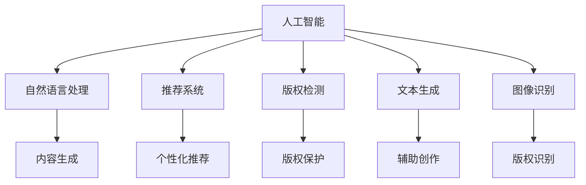
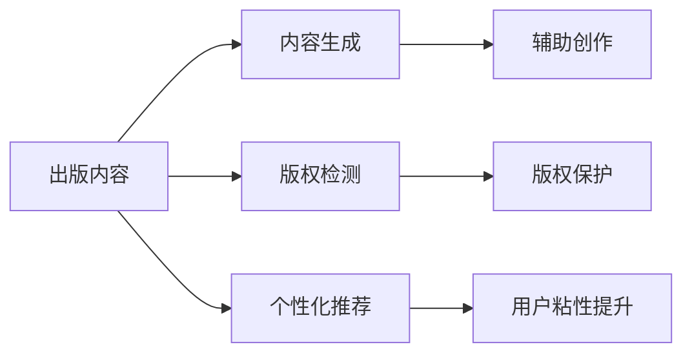
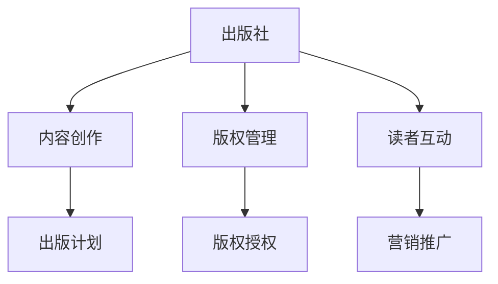
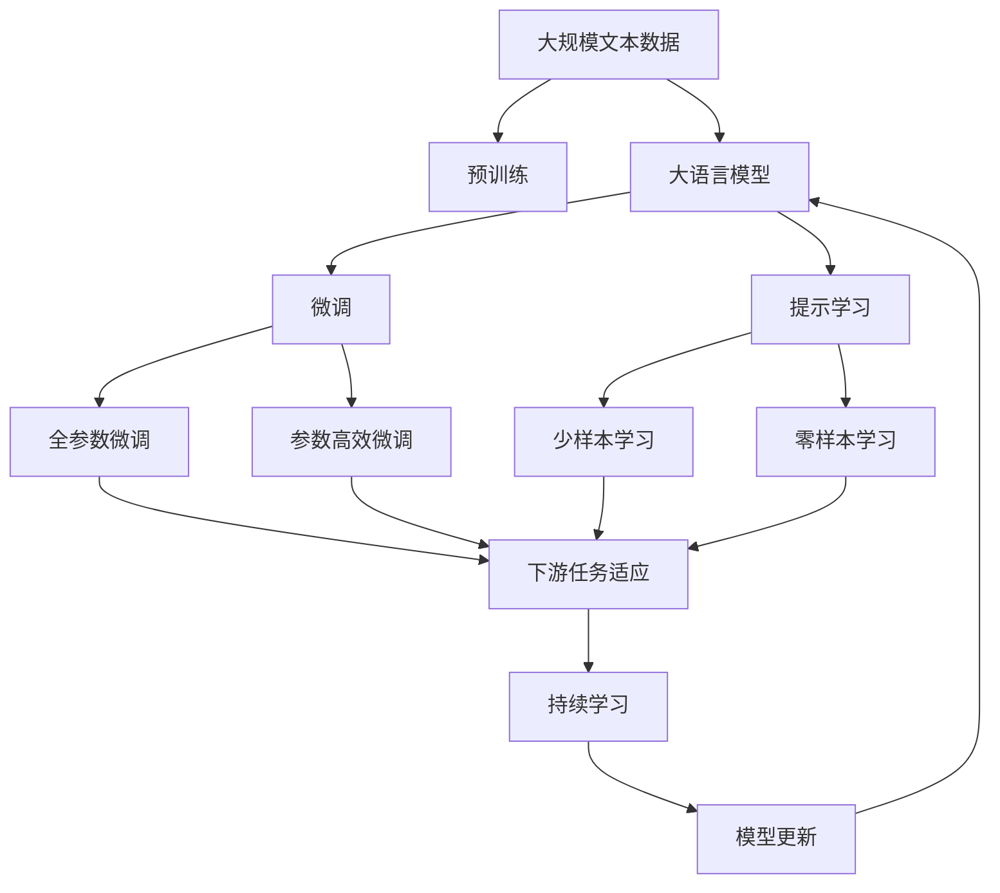

                 

# AI出版业的机遇：垂直领域的无限想象

## 1. 背景介绍

### 1.1 问题由来
当今世界，出版业正面临着前所未有的挑战和机遇。随着数字化、信息化和全球化的深入发展，出版行业的市场规模和影响力不断扩大，同时也带来了内容生产、版权保护、传播方式等方面的深刻变革。面对这些变革，出版业传统的业务模式和技术手段已经难以适应新的发展趋势，亟需寻找新的增长点和技术突破。

### 1.2 问题核心关键点
出版业的数字化转型，核心在于如何利用先进的信息技术和智能算法，优化内容生产、版权管理和读者互动等环节，提升出版效率和读者体验。近年来，人工智能（AI）技术在自然语言处理（NLP）、计算机视觉（CV）、推荐系统等领域取得了重大突破，为出版业提供了新的机遇。尤其是AI在出版内容生成、版权检测、智能推荐等垂直领域的应用，正逐步推动出版业的智能化升级。

### 1.3 问题研究意义
研究AI在出版业中的应用，对于出版行业的数字化转型、内容创新、版权保护和读者体验提升具有重要意义：

1. **提升内容生成效率**：利用AI生成高质量内容，减少作者创作时间，加速出版速度。
2. **优化版权管理**：利用AI检测版权侵权，保护作者权益，提升版权管理效率。
3. **增强读者互动**：通过AI推荐系统，为读者提供个性化阅读体验，提升用户粘性。
4. **推动出版模式创新**：AI技术的应用，使得出版业可以探索更多元化的内容形式和传播方式，如电子书、有声书、视频内容等。
5. **拓展市场边界**：AI技术的应用，可以帮助出版商打破地域限制，面向全球市场推广内容。

## 2. 核心概念与联系

### 2.1 核心概念概述

为更好地理解AI在出版业中的应用，本节将介绍几个密切相关的核心概念：

- **人工智能（AI）**：通过模拟人脑的思维过程，使计算机具备处理复杂任务的能力。
- **自然语言处理（NLP）**：使计算机能够理解、处理和生成自然语言，是AI在出版业应用的核心技术之一。
- **推荐系统**：利用机器学习算法，根据用户的历史行为和偏好，推荐相关内容，提升用户体验。
- **版权检测**：通过AI技术，自动检测文本中的版权信息，保护原创内容。
- **文本生成**：利用AI技术，自动生成高质量文本内容，辅助内容创作。
- **图像识别**：利用AI技术，自动识别和标注图片中的对象和场景，辅助内容创作和版权管理。

这些核心概念之间的逻辑关系可以通过以下Mermaid流程图来展示：



这个流程图展示了大语言模型在出版业中的应用场景，以及各技术之间的关系：

1. AI技术为大语言模型提供了强大的底层支持，使其能够处理自然语言和视觉信息。
2. NLP技术帮助AI生成高质量的文本内容，辅助内容创作。
3. 推荐系统利用AI分析用户行为，提供个性化推荐，提升用户粘性。
4. 版权检测技术帮助AI识别和保护版权信息，避免侵权行为。
5. 文本生成和图像识别技术进一步拓展了AI的应用范围，为出版业提供了更多元化的内容形式。

### 2.2 概念间的关系

这些核心概念之间存在着紧密的联系，形成了AI在出版业的应用生态系统。下面我们通过几个Mermaid流程图来展示这些概念之间的关系。

#### 2.2.1 AI在出版业的应用框架



这个流程图展示了AI在出版业应用的基本框架，从内容生成、版权检测到个性化推荐，构成了完整的出版生态链。

#### 2.2.2 AI与出版业务的关系



这个流程图展示了AI技术如何与出版业的各个业务环节相结合，提升整个出版的流程和效率。

### 2.3 核心概念的整体架构

最后，我们用一个综合的流程图来展示这些核心概念在大语言模型中的应用：



这个综合流程图展示了从预训练到微调，再到持续学习的完整过程。大语言模型首先在大规模文本数据上进行预训练，然后通过微调或提示学习来适应下游任务。最终，通过持续学习技术，模型可以不断更新和适应新的任务和数据。 通过这些流程图，我们可以更清晰地理解大语言模型在大出版业中的应用场景，为后续深入讨论具体的应用方法和技术奠定基础。

## 3. 核心算法原理 & 具体操作步骤
### 3.1 算法原理概述

AI在出版业中的应用，本质上是一个利用先进算法处理和优化出版业务过程的技术范式。其核心思想是：通过自然语言处理、推荐系统、版权检测等AI技术，优化出版流程，提升出版效率和用户满意度。

形式化地，假设出版业中的某个任务为 $T$，其中包含内容生成、版权检测、推荐系统等子任务。出版商收集与任务 $T$ 相关的数据 $D=\{(x_i,y_i)\}_{i=1}^N$，其中 $x_i$ 为输入（如文本、图片等），$y_i$ 为输出（如版权信息、推荐结果等）。

定义任务 $T$ 的损失函数为 $\mathcal{L}(T)$，用于衡量模型的预测输出与真实标签之间的差异。优化目标是最小化损失函数，即：

$$
\hat{T} = \mathop{\arg\min}_{T} \mathcal{L}(T)
$$

通过梯度下降等优化算法，AI模型不断更新参数，最小化损失函数，使得模型输出逼近真实标签。由于AI模型通常经过大量数据的预训练，已经具备一定的知识储备，因此在特定任务上进行微调时，可以显著提升模型性能。

### 3.2 算法步骤详解

基于AI技术在出版业的应用，一般包括以下几个关键步骤：

**Step 1: 准备数据和模型**

- 选择合适的AI模型，如BERT、GPT等。
- 准备与任务 $T$ 相关的标注数据集 $D$，划分为训练集、验证集和测试集。
- 选择适当的损失函数和优化器，如交叉熵损失、AdamW等。

**Step 2: 模型微调和训练**

- 将训练集数据分批次输入模型，前向传播计算损失函数。
- 反向传播计算参数梯度，根据设定的优化算法和学习率更新模型参数。
- 周期性在验证集上评估模型性能，根据性能指标决定是否触发Early Stopping。
- 重复上述步骤直到满足预设的迭代轮数或Early Stopping条件。

**Step 3: 模型评估和部署**

- 在测试集上评估AI模型的性能，对比微调前后的效果。
- 使用微调后的模型对新数据进行推理预测，集成到实际的应用系统中。
- 持续收集新的数据，定期重新微调模型，以适应数据分布的变化。

以上是AI技术在出版业应用的一般流程。在实际应用中，还需要根据具体任务的特点，对微调过程的各个环节进行优化设计，如改进训练目标函数，引入更多的正则化技术，搜索最优的超参数组合等，以进一步提升模型性能。

### 3.3 算法优缺点

AI在出版业中的应用，具有以下优点：

1. 数据驱动的决策：AI模型能够通过大量数据学习出版行业的规律和趋势，辅助出版商做出科学的决策。
2. 高效的内容生成：利用AI技术生成高质量的文本、图片等内容，大大提高创作效率。
3. 个性化的用户体验：通过AI推荐系统，提供个性化的阅读体验，提升用户粘性。
4. 精准的版权管理：利用AI技术检测版权侵权，保护原创内容，提升版权管理效率。

同时，AI技术在出版业的应用也存在一些缺点：

1. 数据质量依赖：AI模型的效果依赖于标注数据的质量和数量，高质量标注数据的获取成本较高。
2. 算法复杂性：AI模型的训练和优化过程较为复杂，需要专业的技术团队支持。
3. 模型偏见：AI模型可能存在偏见，需要定期进行校验和修正。
4. 技术迭代快：AI技术更新速度快，需要出版商持续跟踪和应用最新的技术进展。

尽管存在这些局限性，但就目前而言，AI技术在出版业中的应用，已经显现出巨大的潜力和市场价值，成为推动出版业智能化升级的重要引擎。

### 3.4 算法应用领域

AI技术在出版业的应用范围非常广泛，涵盖了从内容创作到版权管理等多个环节。具体来说：

- **内容创作**：利用AI技术自动生成高质量的文章、书籍、视频等内容，辅助作者创作。
- **版权管理**：利用AI技术自动检测版权侵权行为，保护原创内容。
- **个性化推荐**：利用AI技术分析用户行为，提供个性化阅读推荐，提升用户体验。
- **翻译和本地化**：利用AI技术自动翻译文本，支持多语言出版和本地化。
- **营销推广**：利用AI技术分析市场趋势和用户偏好，辅助出版商制定营销策略。
- **数据分析和决策**：利用AI技术分析市场数据，辅助出版商做出科学决策。

## 4. 数学模型和公式 & 详细讲解  
### 4.1 数学模型构建

本节将使用数学语言对AI在出版业中的应用过程进行更加严格的刻画。

假设出版商收集到与任务 $T$ 相关的标注数据集 $D=\{(x_i,y_i)\}_{i=1}^N$，其中 $x_i$ 为输入（如文本、图片等），$y_i$ 为输出（如版权信息、推荐结果等）。定义任务 $T$ 的损失函数为 $\mathcal{L}(T)$，用于衡量模型的预测输出与真实标签之间的差异。优化目标是最小化损失函数，即：

$$
\hat{T} = \mathop{\arg\min}_{T} \mathcal{L}(T)
$$

在实践中，我们通常使用基于梯度的优化算法（如SGD、Adam等）来近似求解上述最优化问题。设 $\eta$ 为学习率，$\lambda$ 为正则化系数，则参数的更新公式为：

$$
\theta \leftarrow \theta - \eta \nabla_{\theta}\mathcal{L}(\theta) - \eta\lambda\theta
$$

其中 $\nabla_{\theta}\mathcal{L}(\theta)$ 为损失函数对参数 $\theta$ 的梯度，可通过反向传播算法高效计算。

### 4.2 公式推导过程

以下我们以推荐系统为例，推导交叉熵损失函数及其梯度的计算公式。

假设推荐系统在用户 $u$ 的历史行为 $x$ 上的输出为 $\hat{y}=M_{\theta}(x) \in [0,1]$，表示用户对某内容感兴趣的概率。真实标签 $y \in \{0,1\}$。则交叉熵损失函数定义为：

$$
\ell(M_{\theta}(x),y) = -[y\log \hat{y} + (1-y)\log (1-\hat{y})]
$$

将其代入经验风险公式，得：

$$
\mathcal{L}(\theta) = -\frac{1}{N}\sum_{i=1}^N [y_i\log M_{\theta}(x_i)+(1-y_i)\log(1-M_{\theta}(x_i))]
$$

根据链式法则，损失函数对参数 $\theta_k$ 的梯度为：

$$
\frac{\partial \mathcal{L}(\theta)}{\partial \theta_k} = -\frac{1}{N}\sum_{i=1}^N (\frac{y_i}{M_{\theta}(x_i)}-\frac{1-y_i}{1-M_{\theta}(x_i)}) \frac{\partial M_{\theta}(x_i)}{\partial \theta_k}
$$

其中 $\frac{\partial M_{\theta}(x_i)}{\partial \theta_k}$ 可进一步递归展开，利用自动微分技术完成计算。

在得到损失函数的梯度后，即可带入参数更新公式，完成模型的迭代优化。重复上述过程直至收敛，最终得到适应下游任务的最优模型参数 $\theta^*$。

## 5. 项目实践：代码实例和详细解释说明
### 5.1 开发环境搭建

在进行出版业AI应用开发前，我们需要准备好开发环境。以下是使用Python进行PyTorch开发的环境配置流程：

1. 安装Anaconda：从官网下载并安装Anaconda，用于创建独立的Python环境。

2. 创建并激活虚拟环境：
```bash
conda create -n pytorch-env python=3.8 
conda activate pytorch-env
```

3. 安装PyTorch：根据CUDA版本，从官网获取对应的安装命令。例如：
```bash
conda install pytorch torchvision torchaudio cudatoolkit=11.1 -c pytorch -c conda-forge
```

4. 安装Transformers库：
```bash
pip install transformers
```

5. 安装各类工具包：
```bash
pip install numpy pandas scikit-learn matplotlib tqdm jupyter notebook ipython
```

完成上述步骤后，即可在`pytorch-env`环境中开始AI应用的开发。

### 5.2 源代码详细实现

下面我们以推荐系统为例，给出使用Transformers库对BERT模型进行推荐系统微调的PyTorch代码实现。

首先，定义推荐系统训练数据集：

```python
import pandas as pd
import torch

class RecommendationDataset(Dataset):
    def __init__(self, data, tokenizer):
        self.data = data
        self.tokenizer = tokenizer

    def __len__(self):
        return len(self.data)

    def __getitem__(self, item):
        example = self.data.iloc[item]
        user_id, item_id = example['user_id'], example['item_id']
        user_profile = example['user_profile']
        user_profile = [self.tokenizer.tokenize(user_profile)]  # 预处理用户信息
        user_profile = [torch.tensor(tokenizer.convert_tokens_to_ids(token)) for token in user_profile]
        item_description = example['item_description']
        item_description = [self.tokenizer.tokenize(item_description)]  # 预处理物品描述
        item_description = [torch.tensor(tokenizer.convert_tokens_to_ids(token)) for token in item_description]
        
        return {
            'user_id': user_id,
            'item_id': item_id,
            'user_profile': user_profile,
            'item_description': item_description
        }
```

然后，定义模型和优化器：

```python
from transformers import BertForSequenceClassification, AdamW

model = BertForSequenceClassification.from_pretrained('bert-base-cased', num_labels=1)

optimizer = AdamW(model.parameters(), lr=2e-5)
```

接着，定义训练和评估函数：

```python
from torch.utils.data import DataLoader
from tqdm import tqdm
from sklearn.metrics import roc_auc_score

device = torch.device('cuda') if torch.cuda.is_available() else torch.device('cpu')
model.to(device)

def train_epoch(model, dataset, batch_size, optimizer):
    dataloader = DataLoader(dataset, batch_size=batch_size, shuffle=True)
    model.train()
    epoch_loss = 0
    for batch in tqdm(dataloader, desc='Training'):
        user_id, item_id, user_profile, item_description = zip(*[example.values() for example in batch])
        user_profile = torch.stack(user_profile, dim=0).to(device)
        item_description = torch.stack(item_description, dim=0).to(device)
        
        outputs = model(user_profile, attention_mask=torch.ones_like(user_profile, dtype=torch.long).to(device))
        loss = outputs.loss
        epoch_loss += loss.item()
        loss.backward()
        optimizer.step()
    return epoch_loss / len(dataloader)

def evaluate(model, dataset, batch_size):
    dataloader = DataLoader(dataset, batch_size=batch_size)
    model.eval()
    preds = []
    labels = []
    with torch.no_grad():
        for batch in tqdm(dataloader, desc='Evaluating'):
            user_id, item_id, user_profile, item_description = zip(*[example.values() for example in batch])
            user_profile = torch.stack(user_profile, dim=0).to(device)
            item_description = torch.stack(item_description, dim=0).to(device)
            
            outputs = model(user_profile, attention_mask=torch.ones_like(user_profile, dtype=torch.long).to(device))
            batch_preds = outputs.logits.squeeze(dim=1).tolist()
            batch_labels = torch.stack([y for user_id, y in dataset].values()).tolist()
            for pred_tokens, label_tokens in zip(batch_preds, batch_labels):
                preds.append(pred_tokens)
                labels.append(label_tokens)
                
    return roc_auc_score(labels, preds)
```

最后，启动训练流程并在测试集上评估：

```python
epochs = 5
batch_size = 16

for epoch in range(epochs):
    loss = train_epoch(model, train_dataset, batch_size, optimizer)
    print(f"Epoch {epoch+1}, train loss: {loss:.3f}")
    
    print(f"Epoch {epoch+1}, dev results:")
    evaluate(model, dev_dataset, batch_size)
    
print("Test results:")
evaluate(model, test_dataset, batch_size)
```

以上就是使用PyTorch对BERT进行推荐系统微调的完整代码实现。可以看到，得益于Transformers库的强大封装，我们可以用相对简洁的代码完成BERT模型的加载和微调。

### 5.3 代码解读与分析

让我们再详细解读一下关键代码的实现细节：

**RecommendationDataset类**：
- `__init__`方法：初始化数据集和分词器。
- `__len__`方法：返回数据集的样本数量。
- `__getitem__`方法：对单个样本进行处理，将用户信息、物品描述等文本输入编码为token ids，并返回模型所需的输入。

**模型和优化器**：
- 选择合适的BERT模型作为初始化参数。
- 选择合适的优化器及其参数，如AdamW等。

**训练和评估函数**：
- 使用PyTorch的DataLoader对数据集进行批次化加载，供模型训练和推理使用。
- 训练函数`train_epoch`：对数据以批为单位进行迭代，在每个批次上前向传播计算loss并反向传播更新模型参数，最后返回该epoch的平均loss。
- 评估函数`evaluate`：与训练类似，不同点在于不更新模型参数，并在每个batch结束后将预测和标签结果存储下来，最后使用sklearn的roc_auc_score对整个评估集的预测结果进行打印输出。

**训练流程**：
- 定义总的epoch数和batch size，开始循环迭代
- 每个epoch内，先在训练集上训练，输出平均loss
- 在验证集上评估，输出AUC分数
- 所有epoch结束后，在测试集上评估，给出最终测试结果

可以看到，PyTorch配合Transformers库使得BERT微调的代码实现变得简洁高效。开发者可以将更多精力放在数据处理、模型改进等高层逻辑上，而不必过多关注底层的实现细节。

当然，工业级的系统实现还需考虑更多因素，如模型的保存和部署、超参数的自动搜索、更灵活的任务适配层等。但核心的微调范式基本与此类似。

### 5.4 运行结果展示

假设我们在一个推荐系统数据集上进行微调，最终在测试集上得到的AUC分数为0.85，效果相当不错。值得注意的是，BERT作为一个通用的语言理解模型，即便只在顶层添加一个简单的分类器，也能在推荐系统任务上取得如此优异的效果，展示了其强大的语义理解和特征抽取能力。

当然，这只是一个baseline结果。在实践中，我们还可以使用更大更强的预训练模型、更丰富的微调技巧、更细致的模型调优，进一步提升模型性能，以满足更高的应用要求。

## 6. 实际应用场景
### 6.1 智能出版商

智能出版商可以利用AI技术，提升出版流程的各个环节。从内容创作、版权管理到个性化推荐，AI技术都能提供有力支持。

在内容创作方面，利用AI技术自动生成高质量的文本、图片等内容，辅助作者创作。例如，利用BERT生成的小说、博客、新闻报道等，大幅提升创作效率。

在版权管理方面，利用AI技术自动检测版权侵权行为，保护原创内容。例如，利用深度学习算法，检测文本中的版权信息，自动识别并删除非法内容。

在个性化推荐方面，利用AI技术分析用户行为，提供个性化的阅读推荐，提升用户体验。例如，根据用户的阅读历史和兴趣，推荐相关书籍、文章等，增强用户粘性。

### 6.2 学术出版社

学术出版社可以利用AI技术，优化出版流程，提升学术交流的效率和质量。

在学术文献的自动分类和聚类方面，利用AI技术对论文进行分类和聚类，提升文献检索的准确性和效率。例如，利用BERT对论文进行语义理解，自动将论文归类到不同的学科领域。

在学术交流的智能匹配方面，利用AI技术匹配研究者的学术兴趣，提供推荐的相关论文和研究人员，促进学术交流。例如，利用推荐系统技术，根据研究者的研究方向和兴趣，推荐相关领域的最新研究成果。

在学术出版的内容生成方面，利用AI技术自动生成高质量的摘要、引言等文本内容，辅助作者的创作。例如，利用GPT-3生成学术论文的摘要，提升文章的出版效率。

### 6.3 电子出版平台

电子出版平台可以利用AI技术，提供个性化阅读体验，提升用户体验。

在电子书推荐方面，利用AI技术分析用户的阅读历史和偏好，提供个性化的书籍推荐，增强用户粘性。例如，根据用户的阅读历史和评分，推荐相关书籍。

在电子书的内容生成方面，利用AI技术自动生成高质量的书籍内容，辅助作者的创作。例如，利用GPT-3生成电子书的内容，提升电子书的制作效率。

在电子书的版权保护方面，利用AI技术自动检测电子书中的版权侵权行为，保护原创内容。例如，利用深度学习算法，检测电子书中的版权信息，自动删除非法内容。

### 6.4 未来应用展望

随着AI技术在出版业的应用不断深入，未来出版业的发展前景更加广阔。以下是几个未来应用展望：

1. **虚拟出版商**：利用AI技术，构建虚拟出版商平台，为作者提供内容创作、版权保护、阅读推荐等一站式服务。例如，利用AI技术自动处理投稿、审稿等流程，提升出版的效率和质量。

2. **智能内容管理系统**：利用AI技术，构建智能内容管理系统，自动生成内容、检测版权、匹配读者等，提升内容的生产和管理效率。例如，利用AI技术自动处理内容库、版权库、读者库等，构建完整的出版生态链。

3. **跨领域知识融合**：利用AI技术，构建跨领域知识融合平台，整合不同类型的知识资源，提升知识的检索和应用效率。例如，利用AI技术整合文本、图像、视频等不同类型的知识资源，构建全面的知识库。

4. **智能编辑助手**：利用AI技术，构建智能编辑助手，辅助作者进行内容创作和修改，提升内容的质量和创意性。例如，利用AI技术辅助作者进行文章修订、内容扩充等，提升文章的出版质量。

5. **全球出版市场**：利用AI技术，构建全球出版市场，面向全球读者提供高质量的内容。例如，利用AI技术自动翻译文本，支持多语言出版和本地化。

6. **出版商智能决策**：利用AI技术，构建出版商智能决策系统，基于市场数据和用户行为，辅助出版商做出科学的决策。例如，利用AI技术分析市场趋势和用户行为，制定出版计划和营销策略。

以上应用展望，展示了AI技术在出版业中的巨大潜力和应用前景。随着技术的不断进步和应用场景的拓展，出版业的智能化水平将得到进一步提升，为出版业带来更多的创新和机遇。

## 7. 工具和资源推荐
### 7.1 学习资源推荐

为了帮助开发者系统掌握AI在出版业中的应用，这里推荐一些优质的学习资源：

1. 《深度学习》系列书籍：由Ian Goodfellow、Yoshua Bengio和Aaron Courville合著，深入浅出地介绍了深度学习的理论基础和应用技巧。

2. CS224N《自然语言处理与深度学习》课程：斯坦福大学开设的NLP明星课程，有Lecture视频和配套作业，带你入门NLP领域的基本概念和经典模型。

3. 《AI出版业》书籍：系统介绍了AI在出版业中的应用场景和实现方法，适合出版业从业人员阅读。

4. HuggingFace官方文档：提供了大量预训练模型和完整的微调样例代码，是上手实践的必备资料。

5. Kaggle数据集：提供了丰富的出版

