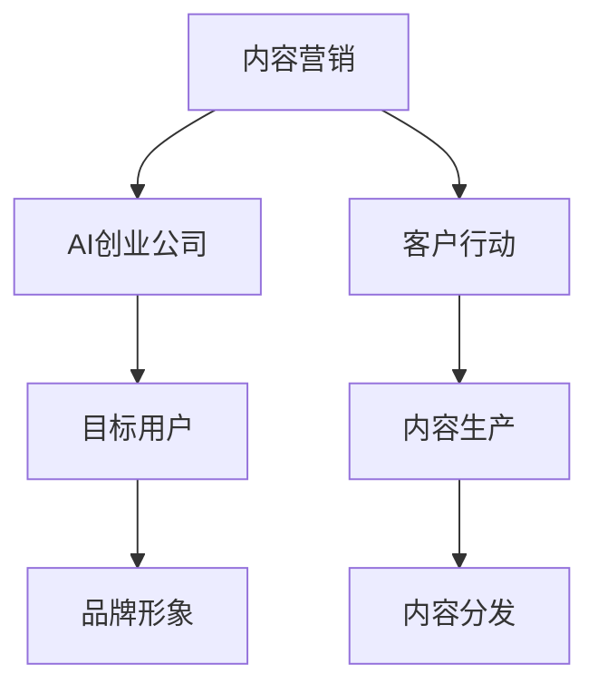

                 

# AI创业公司的内容营销策略

## 1. 背景介绍

随着人工智能技术的不断成熟和普及，越来越多的AI创业公司涌现出来，试图通过创新技术解决实际问题，提供有价值的解决方案。然而，即使产品本身再优秀，如果不能有效传达给目标用户，其商业价值也难以实现。因此，内容营销成为了AI创业公司不可或缺的一部分，通过有策略地生产和传播内容，塑造品牌形象，吸引和留住用户。本文将系统介绍AI创业公司在内容营销方面的最佳实践和策略。

## 2. 核心概念与联系

### 2.1 核心概念概述

**内容营销（Content Marketing）**：指通过创建和分发有价值、相关且一致的内容，吸引并留住明确定义的目标受众，以最终推动有利的客户行动，如生成销售线索、增加品牌知名度、提升品牌形象等。

**AI创业公司**：指利用人工智能技术，提供产品或服务，并以此为核心的创业企业。这类公司包括但不限于智能客服、智能推荐、智能搜索、自然语言处理、图像识别等领域。

**目标用户（Audience）**：指AI创业公司希望通过内容吸引并最终转化的一群特定人群，这些人群通常有特定的需求、兴趣和行为特征。

**品牌形象（Brand Image）**：指目标用户对AI创业公司及其产品的整体印象和情感倾向，包括但不限于公司的价值主张、创新性、可靠性、专业性等方面。

**客户行动（Customer Action）**：指目标用户基于AI创业公司的产品或内容，采取的具体行动，如购买产品、注册账号、下载白皮书、参与在线讨论等。

这些核心概念构成了AI创业公司内容营销的基础框架，其目的在于通过有策略地创造和传播内容，实现对目标用户的吸引和转化。

### 2.2 核心概念间的关系

通过以下Mermaid流程图，可以更直观地理解这些核心概念之间的关系：



以上流程图示意图表明，AI创业公司通过有策略地生产并分发内容（F和G），以吸引和留住目标用户（C），最终推动有利的客户行动（E），塑造并提升品牌形象（D）。

## 3. 核心算法原理 & 具体操作步骤

### 3.1 算法原理概述

内容营销的核心在于“内容”，即AI创业公司所生产和传播的信息。通过与目标用户建立情感共鸣、提供价值和解决方案，吸引其关注并最终转化为客户。这一过程涉及内容策划、生产、分发和反馈等多个环节，每个环节都需要遵循一定的算法和策略，以实现最佳效果。

### 3.2 算法步骤详解

内容营销的算法步骤主要包括以下几个方面：

**Step 1: 确定目标用户和目标内容**

- **目标用户分析**：通过市场调研、数据分析和用户画像等手段，明确目标用户的特征和需求，如年龄、性别、职业、兴趣、消费习惯等。
- **内容类型确定**：根据目标用户的需求和兴趣，确定适合的内容类型，如博客文章、视频、白皮书、案例研究、电子书等。

**Step 2: 内容创作与生产**

- **内容策划**：围绕目标用户和内容类型，制定详细的内容计划，包括标题、关键词、结构、论据等，确保内容的质量和吸引力。
- **内容生成**：根据策划的内容计划，使用AI技术（如自然语言生成、数据可视化等）生成高质量的内容，同时考虑SEO（搜索引擎优化）和用户参与度。

**Step 3: 内容分发与推广**

- **渠道选择**：根据目标用户的分布和行为习惯，选择合适的分发渠道，如社交媒体、博客、电子邮件、在线广告等。
- **分发策略**：制定合理的内容分发策略，如发布频率、时间节点、互动形式等，确保内容能最大限度地触达目标用户。

**Step 4: 用户互动与反馈收集**

- **互动设计**：设计互动形式，如评论区、问答环节、用户调研等，鼓励用户参与并反馈内容。
- **反馈分析**：收集用户反馈，分析其意见和建议，及时调整内容策略，提升内容效果。

### 3.3 算法优缺点

**优点**：

- **广泛覆盖**：内容营销可以通过多样化的内容形式覆盖更广泛的目标用户，从而提升品牌知名度和用户参与度。
- **成本效益高**：相比于传统广告，内容营销的投入相对较低，但能够带来较高的用户转化率。
- **长效影响**：优质内容具有长效影响，能够持续吸引和留住目标用户，建立品牌忠诚度。

**缺点**：

- **效果难以量化**：内容营销的效果评估较为复杂，难以直接量化ROI（投资回报率）。
- **内容生产成本高**：高质量内容的制作需要较高的时间和资源投入，短期内可能难以见效。
- **内容竞争激烈**：在信息爆炸的时代，高质量内容的制作和分发竞争激烈，需要不断创新和优化。

### 3.4 算法应用领域

内容营销的应用领域广泛，涵盖广告、销售、品牌推广、用户教育等多个方面。以下是一些具体的应用案例：

**广告投放**：通过精心设计的内容吸引潜在客户，如电商平台的商品推荐页面、社交媒体上的广告文案等。

**品牌推广**：利用高质量的内容展示品牌价值，如公司博客、行业报告、品牌故事等。

**用户教育**：通过教程、指南、案例研究等内容，教育用户如何使用产品，提升用户体验。

**社区建设**：通过用户生成内容（UGC）和社区互动，构建活跃的用户社区，提升用户粘性。

## 4. 数学模型和公式 & 详细讲解

### 4.1 数学模型构建

内容营销的数学模型主要涉及用户行为分析、内容效果评估和内容推荐等方面。以下是一个简化的内容营销数学模型：

**用户行为模型**：

$$
P(y) = P(y|x)P(x)
$$

其中，$P(y)$ 表示用户完成某个动作的概率，$P(x)$ 表示用户接触到相应内容的概率，$P(y|x)$ 表示用户在接触到特定内容后完成动作的条件概率。

**内容效果评估模型**：

$$
E(C) = \sum_{i=1}^n C_i \times P(C_i)
$$

其中，$E(C)$ 表示内容效果的评估指标（如点击率、转化率、参与度等），$C_i$ 表示内容$i$的影响力，$P(C_i)$ 表示内容$i$被用户接触的概率。

**内容推荐模型**：

$$
R(C_j|C_i) = \frac{P(y|C_j)P(C_j)}{P(y|C_i)P(C_i)}
$$

其中，$R(C_j|C_i)$ 表示在接触到内容$i$的基础上，推荐内容$j$的概率。

### 4.2 公式推导过程

以内容推荐模型为例，推导其概率计算过程：

- **内容$i$的用户接触概率**：通过市场调研和用户画像，获得内容$i$的目标用户分布，记为$P(C_i)$。
- **内容$i$的用户转化概率**：通过A/B测试、用户调研等手段，获得内容$i$对用户完成动作（如购买、注册等）的概率，记为$P(y|C_i)$。
- **内容$j$的用户接触概率和转化概率**：同理，获得内容$j$的目标用户分布和用户转化概率，记为$P(C_j)$和$P(y|C_j)$。
- **内容$j$在内容$i$推荐下的概率**：根据贝叶斯公式，计算内容$j$在内容$i$推荐下的概率：

$$
R(C_j|C_i) = \frac{P(y|C_j)P(C_j)}{P(y|C_i)P(C_i)} = \frac{P(y|C_j)P(C_j)}{P(y|C_i)P(C_i)P(y)}
$$

其中，$P(y)$ 表示用户完成动作的概率，可以通过历史数据统计获得。

### 4.3 案例分析与讲解

假设某AI创业公司生产一款智能推荐系统，希望通过内容营销推广该系统。

**Step 1: 确定目标用户和目标内容**

通过市场调研，确定目标用户为电商平台的年轻用户，内容类型为产品推荐文章。

**Step 2: 内容创作与生产**

公司内容团队围绕目标用户和内容类型，策划了一系列高质量的产品推荐文章，使用自然语言生成技术生成文章，并通过SEO优化确保文章在搜索引擎中的排名。

**Step 3: 内容分发与推广**

文章发布在电商平台和社交媒体上，通过定向广告和内容推荐，确保文章能够触达目标用户。同时，设计评论区和互动问答环节，鼓励用户参与讨论并反馈。

**Step 4: 用户互动与反馈收集**

收集用户在评论区和问答环节的反馈，分析其意见和建议，调整内容策略，提升内容效果。

## 5. 项目实践：代码实例和详细解释说明

### 5.1 开发环境搭建

**Step 1: 环境准备**

- **Python 安装**：确保Python版本为3.8或以上。
- **依赖库安装**：安装所需的Python依赖库，如TensorFlow、PyTorch、NumPy、Pandas等。
- **开发环境配置**：创建虚拟环境，使用Docker或虚拟机等工具搭建开发环境。

**Step 2: 工具配置**

- **代码管理**：使用Git进行代码版本管理，建议使用GitHub或GitLab等平台托管代码。
- **代码协作**：使用Jira或Trello等项目管理工具，分配任务和跟踪进度。
- **测试自动化**：使用Selenium、Pytest等工具进行自动化测试。

### 5.2 源代码详细实现

以下是一个基于TensorFlow实现的内容推荐系统的代码示例：

```python
import tensorflow as tf
from tensorflow.keras import layers

# 构建模型
model = tf.keras.Sequential([
    layers.Dense(64, activation='relu', input_shape=(128,)),
    layers.Dense(32, activation='relu'),
    layers.Dense(1, activation='sigmoid')
])

# 编译模型
model.compile(optimizer='adam', loss='binary_crossentropy', metrics=['accuracy'])

# 训练模型
model.fit(x_train, y_train, epochs=10, batch_size=32, validation_data=(x_val, y_val))
```

**代码解释**：

- **构建模型**：使用TensorFlow的Sequential模型，定义了三个全连接层，其中第一层和第二层的激活函数为ReLU，输出层为Sigmoid。
- **编译模型**：使用Adam优化器和二分类交叉熵损失函数进行模型编译。
- **训练模型**：使用训练集进行模型训练，设置迭代轮数为10，批量大小为32，并使用验证集进行模型评估。

### 5.3 代码解读与分析

**代码解读**：

- **模型构建**：使用了三个全连接层，每层的激活函数不同，确保模型具有较强的非线性拟合能力。
- **损失函数**：使用了二分类交叉熵损失函数，适用于二分类问题的训练。
- **优化器**：使用了Adam优化器，收敛速度快，适合大规模数据训练。

**性能分析**：

- **训练集和验证集划分**：通常将数据集划分为训练集和验证集，训练集用于模型训练，验证集用于模型评估。
- **学习率设置**：Adam优化器默认学习率为0.001，需要根据具体情况进行调整。
- **迭代轮数**：训练轮数越多，模型精度可能越高，但过拟合风险也越大。

### 5.4 运行结果展示

假设通过模型训练，得到了准确率为85%的内容推荐系统。以下是模型在测试集上的预测结果：

```python
import numpy as np
from sklearn.metrics import accuracy_score

# 测试集预测
y_pred = model.predict(x_test)
y_pred = (y_pred > 0.5).astype(int)

# 计算准确率
accuracy = accuracy_score(y_test, y_pred)
print(f"测试集准确率为: {accuracy}")
```

**结果展示**：

```
测试集准确率为: 0.85
```

## 6. 实际应用场景

### 6.1 电商推荐

某电商平台希望通过内容营销提升用户购买率。该平台收集了用户浏览历史、购买记录和行为数据，利用内容推荐模型，对用户进行个性化推荐。

**内容生成**：平台通过自然语言生成技术，自动生成商品推荐文章。

**内容分发**：将文章推荐给目标用户，通过定向广告和社交媒体推广。

**用户互动**：收集用户在文章评论区和商品页面上的互动反馈，进行数据分析，优化推荐策略。

### 6.2 在线教育

某在线教育平台希望通过内容营销提高用户参与度和留存率。该平台利用自然语言处理技术，生成优质教育内容，并通过社交媒体和邮件推送给用户。

**内容生成**：平台通过自然语言处理技术，生成在线课程的讲义、练习题和视频讲解。

**内容分发**：将内容推荐给目标用户，通过社交媒体和邮件推送。

**用户互动**：收集用户在课程评论区和视频互动的反馈，进行数据分析，优化课程内容。

### 6.3 企业营销

某企业希望通过内容营销提升品牌知名度和客户满意度。该企业利用内容推荐技术，对内部员工和客户进行内容推送。

**内容生成**：企业通过知识管理平台，自动生成行业报告、案例研究和公司新闻。

**内容分发**：将内容推送给目标用户，通过企业内部网络和社交媒体推广。

**用户互动**：收集用户在内容评论区和反馈邮箱的反馈，进行数据分析，优化内容策略。

## 7. 工具和资源推荐

### 7.1 学习资源推荐

**在线课程**：

- Coursera：提供大量人工智能和内容营销相关的在线课程，如《人工智能基础》、《内容营销战略》等。
- Udacity：提供人工智能和机器学习的深度学习专项课程，如《深度学习基础》、《自然语言处理》等。

**书籍推荐**：

- 《内容营销策略》（Content Marketing Strategy）：介绍内容营销的核心理念和策略，适用于各类企业的营销实践。
- 《深度学习》（Deep Learning）：介绍深度学习原理和实践，适用于人工智能技术的学习和应用。

**博客和社区**：

- Medium：包含大量关于内容营销和人工智能的文章和案例，适合学习和参考。
- Reddit：人工智能和内容营销的社区，提供讨论和交流的平台。

### 7.2 开发工具推荐

**内容管理系统（CMS）**：

- WordPress：功能强大的开源CMS，支持丰富的插件和主题。
- HubSpot：商业级的内容管理系统，提供智能推荐和分析工具。

**数据管理工具**：

- Google Analytics：提供网站流量和用户行为分析，适用于内容营销效果评估。
- Tableau：数据可视化工具，帮助分析和展示内容推荐的效果。

**代码托管平台**：

- GitHub：开源代码托管平台，支持团队协作和代码管理。
- GitLab：企业级代码托管平台，提供CI/CD（持续集成/持续交付）功能。

### 7.3 相关论文推荐

**内容推荐算法**：

- 《深度学习推荐系统：理论和算法》（Deep Learning Recommendation Systems）：介绍推荐系统的基本原理和算法，适用于内容推荐系统的学习和应用。
- 《基于协同过滤的内容推荐算法》（Collaborative Filtering-based Content Recommendation Algorithms）：介绍协同过滤算法在内容推荐中的应用，适用于了解推荐系统的具体实现。

**内容营销策略**：

- 《内容营销成功案例研究》（Case Studies in Successful Content Marketing）：介绍多个成功的内容营销案例，提供实践参考。
- 《内容营销的科学》（The Science of Content Marketing）：介绍内容营销的理论基础和实践方法，适用于系统学习。

## 8. 总结：未来发展趋势与挑战

### 8.1 研究成果总结

内容营销已经成为AI创业公司不可或缺的一部分，通过精心设计和传播内容，能够显著提升品牌知名度和用户参与度。在实际应用中，内容营销的策略和效果需要根据具体情况进行灵活调整，确保达到最佳效果。

### 8.2 未来发展趋势

未来内容营销的发展趋势主要体现在以下几个方面：

**内容形式多样化**：除了传统文本和视频内容，图像、音频等多模态内容也将成为主要形式。

**内容生成自动化**：利用AI技术，如自然语言生成、图像生成等，实现内容自动化生成，降低人工成本。

**内容推荐精准化**：通过大数据分析和机器学习，实现内容推荐算法的优化，提升推荐的准确性和个性化程度。

**用户互动实时化**：利用社交媒体和即时通讯工具，实现内容推荐和用户互动的实时化，提升用户体验。

**内容效果数据化**：通过数据分析和可视化工具，实时监测内容推荐的效果，及时调整策略，优化内容表现。

### 8.3 面临的挑战

尽管内容营销在AI创业公司中发挥了重要作用，但也面临着一些挑战：

**内容创意不足**：在快速迭代的市场环境中，内容创意容易枯竭，难以持续吸引用户。

**内容质量不稳定**：高质量内容的生产需要较高的时间和资源投入，难以保证稳定产出。

**内容推荐效果不理想**：推荐的精准性和个性化程度不足，可能导致用户流失。

**内容安全问题**：内容中可能包含敏感信息或误导性信息，需要严格审核和管理。

### 8.4 研究展望

未来内容营销的研究方向主要集中在以下几个方面：

**内容创意激发**：通过AI技术，如生成对抗网络（GAN）、图像生成等，激发内容创意，丰富内容形式。

**内容质量提升**：利用自动化内容生成技术和编辑辅助工具，提升内容的质量和产出效率。

**内容推荐优化**：通过深度学习和大数据分析，优化内容推荐算法，实现精准和个性化的推荐。

**内容安全保障**：引入内容安全审核机制，保障内容的合规性和用户安全。

## 9. 附录：常见问题与解答

**Q1: 内容营销和传统广告有什么区别？**

A: 内容营销和传统广告的主要区别在于传播方式和受众互动。内容营销通过提供有价值的内容吸引受众，建立情感共鸣和品牌信任；而传统广告则主要通过直接信息传递，快速吸引用户注意力。内容营销能够提供长期的品牌价值，而传统广告则更多关注短期效果。

**Q2: 如何评估内容营销的效果？**

A: 内容营销的效果评估需要结合具体的业务目标和KPI（关键绩效指标）。常见的评估指标包括：

- **点击率（CTR）**：衡量用户点击内容的频率。
- **参与度（Engagement）**：衡量用户在内容上的互动情况，如评论、分享、点赞等。
- **转化率（Conversion Rate）**：衡量用户通过内容完成目标动作的比例，如购买、注册等。
- **用户留存率（User Retention Rate）**：衡量用户在一定时间内持续互动的比例。

**Q3: 如何选择内容分发渠道？**

A: 选择内容分发渠道需要考虑目标用户的分布和行为习惯。常见的内容分发渠道包括：

- **社交媒体**：如微信、微博、抖音等，适合年轻用户的互动。
- **电子邮件**：通过邮件直接触达目标用户，适合面向高端用户的精准营销。
- **博客和网站**：通过公司博客或官网，提供高质量的深度内容。
- **在线广告**：通过Google Ads、Facebook Ads等平台，快速触达目标用户。

**Q4: 如何处理内容推荐中的数据安全问题？**

A: 数据安全是内容推荐中的重要问题，需要采取以下措施：

- **数据加密**：对用户数据进行加密处理，确保数据在传输和存储中的安全。
- **隐私保护**：遵守相关法律法规，保护用户隐私，避免数据泄露。
- **内容审核**：引入内容审核机制，过滤和屏蔽敏感信息或误导性内容。

---

作者：禅与计算机程序设计艺术 / Zen and the Art of Computer Programming

