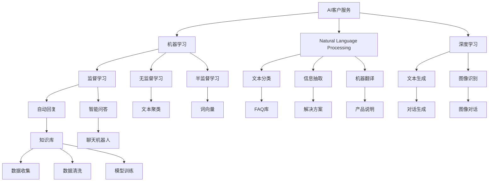
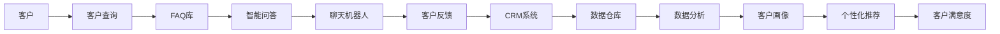
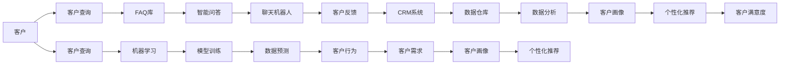
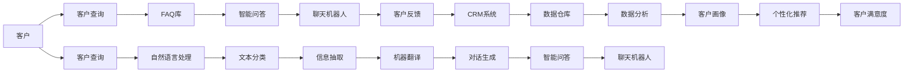
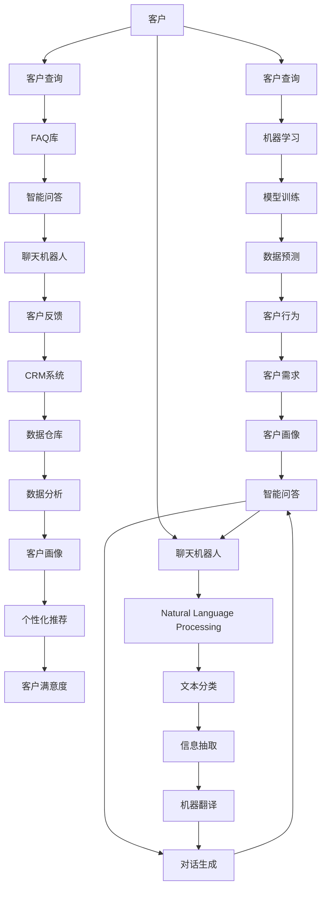

                 

# AI创业公司的客户服务体系搭建

> 关键词：AI客户服务,机器学习,自然语言处理,NLP,深度学习,自动化客户服务,客户关系管理,CRM,智能客服,机器人客服

## 1. 背景介绍

### 1.1 问题由来
随着人工智能(AI)技术的快速发展，AI创业公司层出不穷，各具特色的产品和服务为市场带来了极大的活力。然而，随着市场竞争的加剧和客户需求的不断变化，传统人工客服模式面临效率低下、成本高昂、响应时间不均等问题。AI客户服务体系应运而生，以自动化、智能化的方式提升客户服务的质量和效率。

AI客户服务体系主要包括两大方向：一是通过机器学习、自然语言处理(NLP)等技术，构建自动化客户服务机器人；二是利用AI技术优化客户关系管理(CRM)系统，提升客户服务体验。这两种方式各有优缺点，但都能显著提高客户满意度，降低人工客服成本。

### 1.2 问题核心关键点
构建AI客户服务体系的核心在于选择合适的技术和工具，并根据企业实际情况进行定制化设计和实施。其关键点包括：
- 选择合适的AI技术（如机器学习、深度学习、NLP等）和工具（如TensorFlow、PyTorch、NLTK等）。
- 设计合理的客户服务架构（如FAQ库、知识库、聊天机器人等）。
- 确定有效的客户服务流程（如请求路由、自动回复、人工转接等）。
- 数据获取和处理（如客户查询、反馈数据、交易记录等）。
- 模型训练和优化（如使用监督学习、无监督学习、半监督学习等方法）。

### 1.3 问题研究意义
构建AI客户服务体系具有以下几方面的重要意义：
1. 提升客户服务效率。自动化客户服务机器人可以24/7提供服务，减少人工客服压力。
2. 降低客户服务成本。AI客服系统可以处理大量重复性工作，节省人工成本。
3. 改善客户服务体验。智能客服能快速响应用户需求，提供精准的解决方案。
4. 支持数据驱动决策。客户服务体系能收集大量客户数据，帮助企业洞察客户行为和需求。
5. 增强市场竞争力。AI客服体系成为企业的重要竞争力，能吸引更多客户选择。

## 2. 核心概念与联系

### 2.1 核心概念概述

为更好地理解AI客户服务体系的构建方法，本节将介绍几个关键概念：

- **AI客户服务**：指利用人工智能技术构建的自动化、智能化的客户服务系统。包括自动回复、智能问答、聊天机器人等。
- **机器学习(ML)**：指通过算法和统计模型，使计算机具备学习和适应新数据的能力。常用于训练客户服务模型，如自然语言理解、情感分析等。
- **自然语言处理(NLP)**：指通过计算机处理和理解人类语言的技术，包括文本分类、信息抽取、机器翻译等。
- **深度学习(Deep Learning)**：指利用多层神经网络，对数据进行多层次抽象和特征学习。常用于客户服务模型的构建，如文本生成、图像识别等。
- **知识库**：指存储客户服务相关知识的数据库，如FAQ、解决方案、产品说明等。
- **聊天机器人**：指通过NLP技术实现人机对话的智能客服系统，能理解和回答用户问题。
- **客户关系管理(CRM)**：指通过管理客户数据，优化客户服务流程，提高客户满意度和忠诚度。

这些核心概念之间的联系可以通过以下Mermaid流程图来展示：



这个流程图展示了AI客户服务体系的主要组件及其之间的联系。

### 2.2 概念间的关系

这些核心概念之间存在着紧密的联系，形成了AI客户服务体系的完整框架。下面我们通过几个Mermaid流程图来展示这些概念之间的关系。

#### 2.2.1 AI客户服务体系的整体架构



这个流程图展示了AI客户服务体系的整体架构。客户通过查询系统提出问题，FAQ库、智能问答和聊天机器人提供答案，客户反馈数据进入CRM系统进行进一步处理。数据仓库和分析工具帮助构建客户画像，提升客户满意度和个性化推荐服务。

#### 2.2.2 机器学习在客户服务中的应用



这个流程图展示了机器学习在客户服务中的应用流程。客户查询数据进入机器学习模型进行训练和预测，帮助理解客户行为和需求，提升客户画像和个性化推荐效果。

#### 2.2.3 自然语言处理在客户服务中的应用



这个流程图展示了自然语言处理在客户服务中的应用流程。客户查询数据进入自然语言处理模型进行文本分类、信息抽取和机器翻译等处理，生成智能问答和聊天机器人的回复。

### 2.3 核心概念的整体架构

最后，我们用一个综合的流程图来展示这些核心概念在大语言模型微调过程中的整体架构：



这个综合流程图展示了AI客户服务体系的完整架构，从客户查询到客户满意度的整个过程。

## 3. 核心算法原理 & 具体操作步骤
### 3.1 算法原理概述

AI客户服务体系的构建主要基于机器学习、自然语言处理等技术，通过模型训练和优化，实现自动回复、智能问答和聊天机器人的高效应用。其核心算法原理包括：

1. **文本分类**：将客户查询数据分成若干类别，如常见问题、建议、投诉等。
2. **信息抽取**：从客户查询数据中抽取实体、关系等关键信息，用于生成智能问答和对话生成。
3. **机器翻译**：将客户查询数据翻译成目标语言，支持多语言客户服务。
4. **对话生成**：根据客户查询数据，生成智能问答和聊天机器人回复。

这些算法通过监督学习、无监督学习、半监督学习等方法，对数据进行训练和预测，实现客户服务的自动化和智能化。

### 3.2 算法步骤详解

AI客户服务体系的构建步骤如下：

**Step 1: 数据准备**
- 收集和整理客户服务相关数据，如FAQ库、聊天记录、客户反馈等。
- 对数据进行清洗和预处理，去除噪声和无关信息。

**Step 2: 模型训练**
- 选择合适的模型框架和算法，如TensorFlow、PyTorch等。
- 设计模型架构，包括文本分类、信息抽取、机器翻译、对话生成等模块。
- 训练模型，调整超参数，优化损失函数，提升模型效果。

**Step 3: 模型评估**
- 使用测试数据对模型进行评估，计算精确率、召回率、F1分数等指标。
- 根据评估结果，调整模型参数，优化模型效果。

**Step 4: 模型部署**
- 将训练好的模型部署到生产环境，如云服务器、API接口等。
- 设置监控和报警机制，实时监测模型运行状态。

**Step 5: 持续优化**
- 定期收集客户反馈和运营数据，评估模型效果。
- 根据反馈和数据，更新模型，提升服务质量。

### 3.3 算法优缺点

AI客户服务体系具有以下优缺点：

**优点**：
1. 提高客户服务效率，降低人工客服成本。
2. 提升客户满意度，增强客户忠诚度。
3. 支持数据驱动决策，优化客户服务流程。

**缺点**：
1. 初始搭建和维护成本较高。
2. 需要大量标注数据，数据获取困难。
3. 模型效果依赖数据质量，数据偏差可能导致服务不准确。
4. 客户服务个性化需求较强，模型需要不断更新和优化。

### 3.4 算法应用领域

AI客户服务体系广泛应用于多个领域，如电子商务、金融、医疗、教育等。以下是几个典型应用场景：

- **电子商务**：通过智能客服系统，帮助客户解决购物、物流、售后等问题。
- **金融**：通过智能客服机器人，回答客户关于账户、交易、产品等查询。
- **医疗**：通过智能问答和聊天机器人，提供健康咨询、诊疗建议等。
- **教育**：通过智能客服，帮助学生查询课程、报名、作业解答等。

## 4. 数学模型和公式 & 详细讲解  
### 4.1 数学模型构建

本节将使用数学语言对AI客户服务体系的构建过程进行严格刻画。

记客户查询数据为 $X=\{x_1, x_2, \dots, x_n\}$，其中 $x_i$ 为第 $i$ 条客户查询，包含文本信息 $t_i$ 和对应的标签 $y_i$。模型 $M$ 在输入 $x_i$ 上的预测结果为 $\hat{y}_i$。模型的损失函数为：

$$
\mathcal{L} = \frac{1}{n} \sum_{i=1}^n \ell(\hat{y}_i, y_i)
$$

其中 $\ell$ 为损失函数，常用的有交叉熵损失、均方误差损失等。

### 4.2 公式推导过程

以文本分类任务为例，假设模型 $M$ 为多层感知机(MLP)，其输出层包含 $k$ 个神经元，对应 $k$ 个分类标签。模型 $M$ 在输入 $x_i$ 上的输出为 $\hat{y}_i$，对应的概率分布为 $P(\hat{y}_i|x_i)$。

假设数据集中标签 $y_i$ 为 $1$ 的概率为 $p$，模型 $M$ 对 $y_i=1$ 的预测概率为 $\hat{p}$。则交叉熵损失函数为：

$$
\ell(\hat{y}_i, y_i) = -y_i \log \hat{p} + (1-y_i) \log (1-\hat{p})
$$

对模型 $M$ 进行监督学习训练时，最小化损失函数：

$$
\mathcal{L} = \frac{1}{n} \sum_{i=1}^n \ell(\hat{y}_i, y_i)
$$

对损失函数求导，得到模型的梯度：

$$
\frac{\partial \mathcal{L}}{\partial w} = -\frac{1}{n} \sum_{i=1}^n \frac{\partial \ell(\hat{y}_i, y_i)}{\partial w}
$$

其中 $w$ 为模型的可训练参数。通过梯度下降等优化算法，不断更新参数 $w$，最小化损失函数，最终得到训练好的模型。

### 4.3 案例分析与讲解

假设我们构建一个智能问答系统，用于回答客户的常见问题。以下是构建步骤的案例分析：

**Step 1: 数据准备**
- 收集和整理常见问题及对应的答案，生成标注数据集。
- 使用分词、词性标注等预处理技术，将文本数据转换为模型输入。

**Step 2: 模型训练**
- 选择合适的网络结构，如卷积神经网络(CNN)、循环神经网络(RNN)等。
- 设计损失函数和优化算法，如交叉熵损失、Adam优化器等。
- 训练模型，调整超参数，优化模型效果。

**Step 3: 模型评估**
- 使用测试数据对模型进行评估，计算精确率、召回率、F1分数等指标。
- 根据评估结果，调整模型参数，优化模型效果。

**Step 4: 模型部署**
- 将训练好的模型部署到生产环境，如云服务器、API接口等。
- 设置监控和报警机制，实时监测模型运行状态。

## 5. 项目实践：代码实例和详细解释说明
### 5.1 开发环境搭建

在进行AI客户服务体系开发前，我们需要准备好开发环境。以下是使用Python进行TensorFlow开发的环境配置流程：

1. 安装Anaconda：从官网下载并安装Anaconda，用于创建独立的Python环境。

2. 创建并激活虚拟环境：
```bash
conda create -n tf-env python=3.7 
conda activate tf-env
```

3. 安装TensorFlow：根据CUDA版本，从官网获取对应的安装命令。例如：
```bash
conda install tensorflow -c tf
```

4. 安装各类工具包：
```bash
pip install numpy pandas scikit-learn matplotlib tqdm jupyter notebook ipython
```

完成上述步骤后，即可在`tf-env`环境中开始AI客户服务体系开发。

### 5.2 源代码详细实现

下面我们以智能问答系统为例，给出使用TensorFlow进行文本分类的PyTorch代码实现。

首先，定义模型和数据处理函数：

```python
import tensorflow as tf
from tensorflow.keras import layers

# 定义模型
model = tf.keras.Sequential([
    layers.Embedding(input_dim=vocab_size, output_dim=embedding_dim, input_length=max_len),
    layers.Conv1D(filters=num_filters, kernel_size=filter_size, activation='relu'),
    layers.GlobalMaxPooling1D(),
    layers.Dense(units=num_classes, activation='softmax')
])

# 加载数据集
train_dataset = tf.data.Dataset.from_tensor_slices((train_texts, train_labels))
test_dataset = tf.data.Dataset.from_tensor_slices((test_texts, test_labels))

# 数据预处理
tokenizer = tf.keras.preprocessing.text.Tokenizer(num_words=vocab_size, oov_token=oov_token)
tokenizer.fit_on_texts(train_texts)
train_sequences = tokenizer.texts_to_sequences(train_texts)
test_sequences = tokenizer.texts_to_sequences(test_texts)
train_dataset = train_dataset.batch(batch_size).padded(maxlen=max_len)
test_dataset = test_dataset.batch(batch_size).padded(maxlen=max_len)
```

然后，定义训练和评估函数：

```python
# 定义训练函数
@tf.function
def train_step(data):
    with tf.GradientTape() as tape:
        predictions = model(data)
        loss = tf.keras.losses.sparse_categorical_crossentropy(labels=y, logits=predictions)
    gradients = tape.gradient(loss, model.trainable_variables)
    optimizer.apply_gradients(zip(gradients, model.trainable_variables))

# 定义评估函数
@tf.function
def evaluate_step(data):
    predictions = model(data)
    loss = tf.keras.losses.sparse_categorical_crossentropy(labels=y, logits=predictions)
    accuracy = tf.keras.metrics.sparse_categorical_accuracy(labels=y, predictions=predictions)
    return loss, accuracy

# 训练模型
epochs = 10
batch_size = 32

for epoch in range(epochs):
    train_loss, train_accuracy = 0, 0
    for data in train_dataset:
        train_step(data)
        train_loss += tf.reduce_mean(loss).numpy()
        train_accuracy += accuracy.numpy()
    print(f'Epoch {epoch+1}, train loss: {train_loss:.4f}, train accuracy: {train_accuracy:.4f}')

    test_loss, test_accuracy = evaluate(test_dataset)
    print(f'Epoch {epoch+1}, test loss: {test_loss:.4f}, test accuracy: {test_accuracy:.4f}')
```

最后，启动训练流程：

```python
# 模型训练
epochs = 10
batch_size = 32

for epoch in range(epochs):
    train_loss, train_accuracy = 0, 0
    for data in train_dataset:
        train_step(data)
        train_loss += tf.reduce_mean(loss).numpy()
        train_accuracy += accuracy.numpy()
    print(f'Epoch {epoch+1}, train loss: {train_loss:.4f}, train accuracy: {train_accuracy:.4f}')

    test_loss, test_accuracy = evaluate(test_dataset)
    print(f'Epoch {epoch+1}, test loss: {test_loss:.4f}, test accuracy: {test_accuracy:.4f}')
```

以上就是使用TensorFlow进行文本分类的完整代码实现。可以看到，TensorFlow提供了简单易用的API，使得模型训练和评估变得十分便捷。

### 5.3 代码解读与分析

让我们再详细解读一下关键代码的实现细节：

**模型定义**：
- 使用Sequential模型，定义了嵌入层、卷积层、全局池化层和输出层。
- 嵌入层将文本数据转换为向量表示。
- 卷积层提取文本特征。
- 全局池化层汇聚特征。
- 输出层进行分类预测。

**数据处理**：
- 使用Tokenizer将文本数据转换为模型输入。
- 对文本数据进行填充，保证所有样本长度一致。
- 将文本数据和标签数据分批次加载，进行模型训练和评估。

**训练和评估函数**：
- 使用tf.function装饰器，将训练和评估函数定义为可编译的函数。
- 在训练函数中，使用梯度下降算法更新模型参数。
- 在评估函数中，计算损失和准确率，返回评估结果。

**训练流程**：
- 循环迭代多个epoch，每次更新模型参数，计算损失和准确率。
- 在每个epoch结束后，在测试集上评估模型效果。

可以看到，TensorFlow提供了丰富的API和工具，使得AI客户服务体系的开发变得更加高效便捷。

## 6. 实际应用场景
### 6.1 智能客服系统

智能客服系统是大语言模型在客户服务体系中的典型应用。通过构建自动化、智能化的客服机器人，企业可以提供7x24小时不间断的服务，显著提升客户满意度。

以下是智能客服系统的典型应用场景：
- **常见问题解答**：通过FAQ库，智能客服机器人可以回答客户关于产品、服务、售后等方面的常见问题。
- **实时问答**：通过智能问答，智能客服机器人可以动态生成回答，解决客户的个性化需求。
- **客户反馈**：通过聊天机器人收集客户反馈，生成客户画像，优化服务流程。
- **个性化推荐**：通过分析客户历史查询数据，智能客服机器人可以提供个性化推荐服务，提升客户体验。

### 6.2 金融舆情监测

金融行业需要实时监测市场舆情，避免负面信息传播，规避金融风险。智能客服系统可以发挥重要作用，通过自动回复和情感分析，帮助企业快速响应市场变化，提升风险管理能力。

以下是金融舆情监测的典型应用场景：
- **舆情监测**：通过智能客服机器人监测市场舆情，及时发现负面信息。
- **风险预警**：通过情感分析，智能客服机器人可以识别出市场情绪变化，预警潜在的金融风险。
- **客户服务**：通过智能客服机器人解答客户咨询，提升客户体验。
- **数据分析**：通过收集客户反馈，智能客服机器人可以帮助企业洞察市场变化，优化产品和服务。

### 6.3 电商客户服务

电商行业需要处理大量客户咨询和售后问题，智能客服系统可以大幅提升客户服务效率和质量。

以下是电商客户服务的典型应用场景：
- **产品咨询**：通过智能客服机器人回答客户关于产品、价格、配送等方面的咨询。
- **售后支持**：通过智能客服机器人处理客户关于退换货、物流等方面的问题。
- **客户评价**：通过智能客服机器人收集客户评价，生成客户画像，优化服务流程。
- **推荐系统**：通过智能客服机器人分析客户需求，提供个性化推荐服务，提升客户满意度。

### 6.4 医疗客户服务

医疗行业需要处理客户关于健康、诊疗等方面的咨询，智能客服系统可以提供高效、准确的服务。

以下是医疗客户服务的典型应用场景：
- **健康咨询**：通过智能客服机器人解答客户关于健康、饮食、锻炼等方面的问题。
- **诊疗建议**：通过智能客服机器人提供医疗建议，帮助客户进行初步诊疗。
- **医院导航**：通过智能客服机器人提供医院导航信息，提升客户就医体验。
- **客户画像**：通过智能客服机器人收集客户信息，生成客户画像，优化医疗服务流程。

## 7. 工具和资源推荐
### 7.1 学习资源推荐

为了帮助开发者系统掌握AI客户服务体系的构建方法，这里推荐一些优质的学习资源：

1. **《深度学习》系列课程**：斯坦福大学、MIT等知名高校开设的深度学习课程，涵盖深度学习基础和应用，适合初学者入门。
2. **《TensorFlow官方文档》**：TensorFlow官方文档提供了丰富的API和教程，是学习TensorFlow的必备资源。
3. **《自然语言处理入门》书籍**：《自然语言处理入门》由李航等作者编写，介绍了自然语言处理的基本概念和常用技术。
4. **《Python深度学习》书籍**：Francois Chollet等作者编写，介绍了深度学习在Python中的应用，涵盖卷积神经网络、循环神经网络等。
5. **Kaggle竞赛平台**：Kaggle提供大量NLP相关的竞赛和数据集，适合通过实践提升技能。

通过对这些资源的学习实践，相信你一定能够快速掌握AI客户服务体系的构建方法，并用于解决实际的客户服务问题。

### 7.2 开发工具推荐

高效的开发离不开优秀的工具支持。以下是几款用于AI客户服务体系开发的常用工具：

1. **TensorFlow**：基于Python的开源深度学习框架，适合快速迭代研究。
2. **PyTorch**：基于Python的开源深度学习框架，动态图设计灵活，适合模型研究。
3. **NLTK**：自然语言处理工具包，提供大量文本处理和分析工具。
4. **spaCy**：自然语言处理工具包，提供高效的分词、词性标注等工具。
5. **TensorBoard**：TensorFlow配套的可视化工具，实时监测模型训练状态。
6. **Weights & Biases**：模型训练的实验跟踪工具，记录和可视化模型训练过程中的各项指标。

合理利用这些工具，可以显著提升AI客户服务体系的开发效率，加快创新迭代的步伐。

### 7.3 相关论文推荐

AI客户服务体系的发展源于学界的持续研究。以下是几篇奠基性的相关论文，推荐阅读：

1. **《基于机器学习的客服系统》**：提出了基于机器学习的客服系统，通过监督学习训练问答模型，实现自动化回答。
2. **《多模态客户服务系统》**：介绍了多模态客户服务系统的构建方法，涵盖文本、语音、图像等多模态数据。
3. **《智能客服系统的可解释性》**：探讨了智能客服系统的可解释性问题，提出了一些改进方法。
4. **《情感分析在客户服务中的应用》**：介绍了情感分析在客户服务中的应用，帮助企业洞察客户情绪

