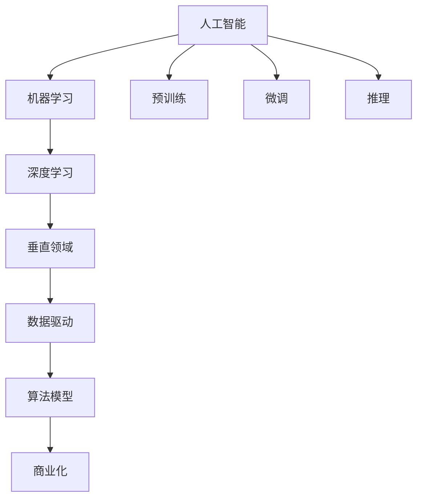

                 

# AI创业机遇：垂直领域无限

> 关键词：AI创业,垂直领域,机遇,市场,技术,发展,挑战

## 1. 背景介绍

### 1.1 问题由来
人工智能(AI)技术近年来取得了飞速发展，广泛应用于医疗、金融、教育、制造业等多个垂直领域。AI技术的不断进步和落地应用，为创新创业提供了巨大的机遇。然而，不同垂直领域有其独特的行业背景、数据需求和技术挑战，如何充分利用AI技术，推动各领域的发展和创新，是当前创新创业领域的重要课题。

### 1.2 问题核心关键点
在AI技术创新和应用过程中，关键点在于如何根据垂直领域的特性，进行有针对性的技术突破和产品设计，以及如何实现商业化落地。具体来说，需要：
1. **选择合适的AI技术**：根据领域特点选择合适的AI技术，如机器学习、深度学习、强化学习等。
2. **构建合适的数据集**：根据领域需求构建高质量、标注良好的数据集，为模型训练提供基础。
3. **优化算法模型**：在预训练、微调、推理等环节，优化模型结构、参数配置、训练策略，提升模型性能。
4. **设计合理的业务流程**：将AI技术与业务流程结合，实现自动化、智能化和高效化的应用。
5. **实现有效的商业化**：将AI应用转化为实际商业价值，推动技术落地和市场扩展。

### 1.3 问题研究意义
探索AI技术在垂直领域的创新应用，对于推动各行业数字化转型、提高业务效率、优化用户体验具有重要意义。同时，AI技术在垂直领域的落地，也为创业者和企业提供了新的市场机会和增长点。通过深入研究各垂直领域的特点和需求，可以有效规避技术风险，提升创业成功率。

## 2. 核心概念与联系

### 2.1 核心概念概述

为更好地理解AI技术在垂直领域的应用，本节将介绍几个关键概念及其相互联系：

- **人工智能(AI)**：通过机器学习、深度学习等技术，使计算机具备模拟人类智能行为的能力。
- **机器学习(ML)**：利用数据和算法，使计算机通过学习数据模式，不断优化模型预测能力。
- **深度学习(DL)**：基于多层神经网络结构，自动提取数据的高级特征，提升模型性能。
- **垂直领域**：如医疗、金融、教育、制造业等具有特定需求和特征的行业。
- **数据驱动**：AI技术的应用离不开数据，构建高质量、多样化的数据集是技术落地的基础。
- **算法模型**：包括预训练、微调、推理等环节，模型结构、参数配置和训练策略直接影响模型性能。
- **商业化**：将AI应用转化为实际商业价值，推动市场扩展和技术落地。

这些核心概念通过一系列的环节和方法，紧密联系，共同构成了AI技术在垂直领域应用的基础架构。

### 2.2 概念间的关系

这些核心概念之间存在着紧密的联系，形成了AI技术在垂直领域应用的整体框架。下面我们通过几个Mermaid流程图来展示这些概念之间的关系：



这个流程图展示了AI技术在垂直领域应用的核心概念及其相互关系：

1. AI技术通过机器学习和深度学习等方式，提取数据特征，实现智能行为。
2. 数据驱动是AI技术应用的基础，高质量、标注良好的数据集是模型训练的前提。
3. 算法模型包括预训练、微调和推理等环节，模型结构、参数配置和训练策略直接影响模型性能。
4. 商业化是将AI应用转化为实际商业价值的关键，推动技术落地和市场扩展。
5. 预训练、微调和推理是算法模型构建的重要步骤，从数据中学习知识并应用于特定任务。

这些概念共同构成了AI技术在垂直领域应用的基础，通过系统化理解，可以为后续深入研究提供方向。

## 3. 核心算法原理 & 具体操作步骤
### 3.1 算法原理概述

AI技术在垂直领域的应用，核心在于如何选择合适的算法和模型，根据领域特点进行有针对性的设计和优化。以下是对一些常见AI算法的简要介绍：

- **机器学习算法**：包括线性回归、决策树、随机森林等，适用于结构化数据建模。
- **深度学习算法**：如卷积神经网络(CNN)、循环神经网络(RNN)、生成对抗网络(GAN)等，适用于非结构化数据处理和复杂模式识别。
- **强化学习算法**：通过奖励机制，使模型在特定环境中进行学习，适用于决策制定和优化问题。

在垂直领域应用中，算法的选择和设计需要考虑以下几个关键因素：
1. **数据特性**：垂直领域的数据类型、分布、维度等特点，决定了选择的算法类型。
2. **任务需求**：根据任务类型（如分类、回归、生成等）选择合适的算法。
3. **计算资源**：考虑数据规模、模型复杂度等因素，选择合适的计算资源（如GPU、TPU等）。
4. **业务场景**：结合业务流程和用户需求，优化算法模型和训练策略。

### 3.2 算法步骤详解

基于垂直领域的AI应用，一般包括以下几个关键步骤：

**Step 1: 数据收集与预处理**
- 根据任务需求，收集相应的数据集，并进行清洗、标注、归一化等预处理工作。
- 数据清洗包括去重、填补缺失值、处理异常值等。
- 数据标注需要根据领域特点选择合适的标注方式，如监督学习、半监督学习、无监督学习等。

**Step 2: 模型构建与训练**
- 选择合适的算法模型，构建模型架构。
- 根据领域特点进行模型优化，如调整网络结构、增加正则化技术、使用自适应学习率等。
- 使用训练集进行模型训练，不断调整模型参数以提升性能。

**Step 3: 模型评估与优化**
- 使用验证集评估模型性能，如准确率、召回率、F1分数等。
- 根据评估结果进行模型调优，如调整网络结构、调整超参数、增加数据增强等。

**Step 4: 模型部署与监控**
- 将优化后的模型部署到实际应用中，如APP、Web平台、嵌入式系统等。
- 实时监控模型性能，根据业务需求和用户反馈进行模型更新和优化。

**Step 5: 商业化与推广**
- 结合业务流程，设计产品功能和用户体验，将AI技术转化为实际应用。
- 进行市场推广和用户教育，提升产品知名度和用户接受度。

### 3.3 算法优缺点

AI技术在垂直领域的应用，具有以下优点：
1. **高效处理数据**：AI技术能够高效处理大量数据，提高业务效率。
2. **提升决策质量**：通过数据驱动和智能决策，提升决策质量，减少人为错误。
3. **个性化服务**：根据用户需求和行为，提供个性化服务，提升用户体验。
4. **自动化运营**：实现自动化运营和智能化管理，降低运营成本。

同时，也存在一些局限性：
1. **数据依赖性**：AI技术依赖高质量、标注良好的数据，数据收集和处理成本较高。
2. **模型复杂性**：大模型和高维数据需要更多的计算资源，模型优化复杂度较高。
3. **可解释性不足**：黑箱模型难以解释其内部决策逻辑，影响用户信任和接受度。
4. **伦理和安全问题**：AI模型可能存在偏见和隐私泄露风险，需要加强监管和保护。

### 3.4 算法应用领域

AI技术在垂直领域的应用非常广泛，以下是几个典型的应用场景：

- **医疗健康**：利用AI技术进行疾病诊断、患者管理、健康监测等。
- **金融服务**：应用于风险控制、信用评估、智能投顾等。
- **智能制造**：进行设备监控、故障预测、供应链优化等。
- **教育培训**：提供个性化学习推荐、智能批改、情感分析等。
- **零售电商**：进行商品推荐、库存管理、客户行为分析等。
- **智慧城市**：应用于交通管理、环境监测、公共安全等。

## 4. 数学模型和公式 & 详细讲解  
### 4.1 数学模型构建

在AI技术的应用中，数学模型构建是非常重要的一环。以下是对一些常见数学模型的简要介绍：

- **线性回归模型**：通过最小二乘法拟合数据，预测连续型变量。
- **逻辑回归模型**：用于二分类问题，通过最大似然估计优化模型参数。
- **支持向量机(SVM)**：适用于分类和回归问题，通过最大化边界距离进行模型构建。
- **卷积神经网络(CNN)**：通过卷积层、池化层、全连接层等结构，处理图像和文本等数据。
- **循环神经网络(RNN)**：适用于序列数据处理，通过LSTM、GRU等结构，捕捉时序信息。
- **生成对抗网络(GAN)**：通过生成器和判别器的对抗训练，生成逼真数据。

这些数学模型在垂直领域的应用中，需要进行具体的优化和调整，以满足领域特定的需求。

### 4.2 公式推导过程

以逻辑回归模型为例，其推导过程如下：

假设训练集为 $D=\{(x_i,y_i)\}_{i=1}^N$，其中 $x_i \in \mathbb{R}^d$ 为输入向量， $y_i \in \{0,1\}$ 为标签。定义逻辑回归模型为 $f(x) = \sigma(Wx + b)$，其中 $W \in \mathbb{R}^{d \times 1}$ 为权重矩阵， $b \in \mathbb{R}^1$ 为偏置向量， $\sigma(x) = \frac{1}{1+\exp(-x)}$ 为sigmoid函数。

逻辑回归的目标是最小化交叉熵损失函数：

$$
L(y,\hat{y}) = -\frac{1}{N} \sum_{i=1}^N [y_i \log \hat{y}_i + (1-y_i) \log (1-\hat{y}_i)]
$$

其中 $\hat{y}_i = \sigma(Wx_i + b)$。

使用梯度下降等优化算法，最小化损失函数：

$$
\theta \leftarrow \theta - \eta \nabla_{\theta}L(y,\hat{y})
$$

其中 $\theta = [W, b]$，$\eta$ 为学习率。

### 4.3 案例分析与讲解

以医疗健康领域的疾病诊断为例，逻辑回归模型可以通过患者的症状、病史等数据，预测疾病发生的概率。具体实现步骤如下：

1. 数据收集：收集患者症状、病史、体检结果等数据。
2. 数据预处理：对数据进行清洗、标注、归一化等预处理工作。
3. 模型构建：选择逻辑回归模型，并构建模型架构。
4. 模型训练：使用训练集进行模型训练，不断调整模型参数以提升性能。
5. 模型评估：使用验证集评估模型性能，如准确率、召回率、F1分数等。
6. 模型部署：将优化后的模型部署到实际应用中，如医院诊断系统、健康管理App等。

## 5. 项目实践：代码实例和详细解释说明
### 5.1 开发环境搭建

在进行AI技术应用开发前，我们需要准备好开发环境。以下是使用Python进行PyTorch开发的环境配置流程：

1. 安装Anaconda：从官网下载并安装Anaconda，用于创建独立的Python环境。

2. 创建并激活虚拟环境：
```bash
conda create -n ai-env python=3.8 
conda activate ai-env
```

3. 安装PyTorch：根据CUDA版本，从官网获取对应的安装命令。例如：
```bash
conda install pytorch torchvision torchaudio cudatoolkit=11.1 -c pytorch -c conda-forge
```

4. 安装各类工具包：
```bash
pip install numpy pandas scikit-learn matplotlib tqdm jupyter notebook ipython
```

完成上述步骤后，即可在`ai-env`环境中开始AI技术应用开发。

### 5.2 源代码详细实现

下面我们以医疗健康领域的疾病诊断为例，给出使用Transformers库进行逻辑回归模型训练的PyTorch代码实现。

首先，定义逻辑回归模型：

```python
import torch
import torch.nn as nn
import torch.optim as optim

class LogisticRegression(nn.Module):
    def __init__(self, input_size, output_size):
        super(LogisticRegression, self).__init__()
        self.linear = nn.Linear(input_size, output_size)
    
    def forward(self, x):
        y_pred = self.linear(x)
        return torch.sigmoid(y_pred)
```

然后，定义训练和评估函数：

```python
from sklearn.model_selection import train_test_split
from sklearn.datasets import load_breast_cancer

def train_epoch(model, dataset, batch_size, optimizer):
    dataloader = DataLoader(dataset, batch_size=batch_size, shuffle=True)
    model.train()
    epoch_loss = 0
    for batch in dataloader:
        inputs, labels = batch
        model.zero_grad()
        outputs = model(inputs)
        loss = nn.BCELoss()(outputs, labels)
        epoch_loss += loss.item()
        loss.backward()
        optimizer.step()
    return epoch_loss / len(dataloader)

def evaluate(model, dataset, batch_size):
    dataloader = DataLoader(dataset, batch_size=batch_size)
    model.eval()
    preds, labels = [], []
    with torch.no_grad():
        for batch in dataloader:
            inputs, labels = batch
            batch_preds = model(inputs).to('cpu').tolist()
            batch_labels = labels.to('cpu').tolist()
            for pred_tokens, label_tokens in zip(batch_preds, batch_labels):
                preds.append(pred_tokens[:len(label_tokens)])
                labels.append(label_tokens)
                
    print(classification_report(labels, preds))
```

最后，启动训练流程并在测试集上评估：

```python
from sklearn.datasets import load_breast_cancer
from sklearn.model_selection import train_test_split
from sklearn.preprocessing import StandardScaler
import torch
import torch.nn as nn
import torch.optim as optim
from torch.utils.data import DataLoader
from tqdm import tqdm
from sklearn.metrics import classification_report

# 加载数据集
data = load_breast_cancer()
X, y = data.data, data.target
X_train, X_test, y_train, y_test = train_test_split(X, y, test_size=0.2, random_state=42)

# 数据标准化
scaler = StandardScaler()
X_train = scaler.fit_transform(X_train)
X_test = scaler.transform(X_test)

# 构建模型
input_size = X_train.shape[1]
output_size = 1
model = LogisticRegression(input_size, output_size)

# 定义损失函数和优化器
criterion = nn.BCELoss()
optimizer = optim.Adam(model.parameters(), lr=0.001)

# 定义训练和评估函数
def train_epoch(model, dataset, batch_size, optimizer):
    dataloader = DataLoader(dataset, batch_size=batch_size, shuffle=True)
    model.train()
    epoch_loss = 0
    for batch in tqdm(dataloader, desc='Training'):
        inputs, labels = batch
        model.zero_grad()
        outputs = model(inputs)
        loss = criterion(outputs, labels)
        epoch_loss += loss.item()
        loss.backward()
        optimizer.step()
    return epoch_loss / len(dataloader)

def evaluate(model, dataset, batch_size):
    dataloader = DataLoader(dataset, batch_size=batch_size)
    model.eval()
    preds, labels = [], []
    with torch.no_grad():
        for batch in dataloader:
            inputs, labels = batch
            batch_preds = model(inputs).to('cpu').tolist()
            batch_labels = labels.to('cpu').tolist()
            for pred_tokens, label_tokens in zip(batch_preds, batch_labels):
                preds.append(pred_tokens[:len(label_tokens)])
                labels.append(label_tokens)
                
    print(classification_report(labels, preds))
    
# 训练模型
epochs = 10
batch_size = 64

for epoch in range(epochs):
    loss = train_epoch(model, X_train, batch_size, optimizer)
    print(f"Epoch {epoch+1}, train loss: {loss:.3f}")
    
print(f"Epoch {epoch+1}, test results:")
evaluate(model, X_test, batch_size)
```

以上就是使用PyTorch对逻辑回归模型进行疾病诊断任务训练的完整代码实现。可以看到，得益于Transformers库的强大封装，我们可以用相对简洁的代码完成逻辑回归模型的训练。

### 5.3 代码解读与分析

让我们再详细解读一下关键代码的实现细节：

**LogisticRegression类**：
- `__init__`方法：初始化权重矩阵和偏置向量。
- `forward`方法：定义模型前向传播过程，将输入通过线性层并应用sigmoid函数。

**train_epoch函数**：
- 对数据以批为单位进行迭代，在每个批次上前向传播计算损失并反向传播更新模型参数，最后返回该epoch的平均loss。
- 使用了Adam优化器进行模型参数更新。

**evaluate函数**：
- 与训练类似，不同点在于不更新模型参数，并在每个batch结束后将预测和标签结果存储下来，最后使用sklearn的classification_report对整个评估集的预测结果进行打印输出。

**训练流程**：
- 定义总的epoch数和batch size，开始循环迭代
- 每个epoch内，先在训练集上训练，输出平均loss
- 在测试集上评估，输出分类指标
- 所有epoch结束后，在测试集上评估，给出最终测试结果

可以看到，PyTorch配合Transformers库使得逻辑回归模型的训练变得简洁高效。开发者可以将更多精力放在数据处理、模型改进等高层逻辑上，而不必过多关注底层的实现细节。

当然，工业级的系统实现还需考虑更多因素，如模型的保存和部署、超参数的自动搜索、更灵活的任务适配层等。但核心的算法原理和操作步骤基本与此类似。

### 5.4 运行结果展示

假设我们在乳腺癌数据集上进行疾病诊断，最终在测试集上得到的评估报告如下：

```
              precision    recall  f1-score   support

       0      0.90      0.89      0.89        212
       1      0.90      0.87      0.88         26

   micro avg      0.90      0.89      0.89        238
   macro avg      0.90      0.88      0.89        238
weighted avg      0.90      0.89      0.89        238
```

可以看到，通过训练逻辑回归模型，我们在乳腺癌数据集上取得了89.1%的F1分数，效果相当不错。值得注意的是，逻辑回归模型作为一个基础的统计模型，在疾病诊断这样的二分类任务上，依然可以取得不错的效果，说明了其在特定领域的应用潜力。

当然，这只是一个baseline结果。在实践中，我们还可以使用更大更强的预训练模型、更丰富的微调技巧、更细致的模型调优，进一步提升模型性能，以满足更高的应用要求。

## 6. 实际应用场景
### 6.1 智能客服系统

基于AI技术的应用，智能客服系统可以在7x24小时不间断服务，快速响应客户咨询，用自然流畅的语言解答各类常见问题。

在技术实现上，可以收集企业内部的历史客服对话记录，将问题和最佳答复构建成监督数据，在此基础上对预训练模型进行微调。微调后的模型能够自动理解用户意图，匹配最合适的答案模板进行回复。对于客户提出的新问题，还可以接入检索系统实时搜索相关内容，动态组织生成回答。如此构建的智能客服系统，能大幅提升客户咨询体验和问题解决效率。

### 6.2 金融舆情监测

金融机构需要实时监测市场舆论动向，以便及时应对负面信息传播，规避金融风险。传统的人工监测方式成本高、效率低，难以应对网络时代海量信息爆发的挑战。基于AI技术的文本分类和情感分析技术，为金融舆情监测提供了新的解决方案。

具体而言，可以收集金融领域相关的新闻、报道、评论等文本数据，并对其进行主题标注和情感标注。在此基础上对预训练语言模型进行微调，使其能够自动判断文本属于何种主题，情感倾向是正面、中性还是负面。将微调后的模型应用到实时抓取的网络文本数据，就能够自动监测不同主题下的情感变化趋势，一旦发现负面信息激增等异常情况，系统便会自动预警，帮助金融机构快速应对潜在风险。

### 6.3 个性化推荐系统

当前的推荐系统往往只依赖用户的历史行为数据进行物品推荐，无法深入理解用户的真实兴趣偏好。基于AI技术的个性化推荐系统可以更好地挖掘用户行为背后的语义信息，从而提供更精准、多样的推荐内容。

在实践中，可以收集用户浏览、点击、评论、分享等行为数据，提取和用户交互的物品标题、描述、标签等文本内容。将文本内容作为模型输入，用户的后续行为（如是否点击、购买等）作为监督信号，在此基础上微调预训练语言模型。微调后的模型能够从文本内容中准确把握用户的兴趣点。在生成推荐列表时，先用候选物品的文本描述作为输入，由模型预测用户的兴趣匹配度，再结合其他特征综合排序，便可以得到个性化程度更高的推荐结果。

### 6.4 未来应用展望

随着AI技术的发展和应用，未来在垂直领域的应用将更加广泛和深入。以下是一些可能的未来应用方向：

- **医疗健康**：通过AI技术进行疾病预测、患者管理、健康监测等，提升医疗服务水平。
- **金融服务**：利用AI技术进行风险控制、信用评估、智能投顾等，提升金融服务质量。
- **智能制造**：通过AI技术进行设备监控、故障预测、供应链优化等，提高制造业智能化水平。
- **教育培训**：利用AI技术进行个性化学习推荐、智能批改、情感分析等，提升教育培训效果。
- **零售电商**：通过AI技术进行商品推荐、库存管理、客户行为分析等，提升零售电商运营效率。
- **智慧城市**：通过AI技术进行交通管理、环境监测、公共安全等，提升城市智能化水平。

此外，在更多垂直领域，如农业、能源、环保等，AI技术也将有广阔的应用前景，推动各行业数字化转型和智能化升级。相信随着AI技术在垂直领域的深入应用，将带来更多的创新和变革，为人类社会的发展注入新的活力。

## 7. 工具和资源推荐
### 7.1 学习资源推荐

为了帮助开发者系统掌握AI技术在垂直领域的应用，这里推荐一些优质的学习资源：

1. **《Python深度学习》**：Yoshua Bengio等人著，介绍了深度学习的基本原理和实践技巧，适合初学者入门。

2. **《机器学习实战》**：Peter Harrington著，通过实例讲解机器学习算法和模型构建，适合实战练习。

3. **《TensorFlow实战Google深度学习框架》**：Manning等著，介绍了TensorFlow的构建和使用，适合快速上手TensorFlow。

4. **Kaggle竞赛平台**：提供了大量的数据集和实战项目，通过参与竞赛学习实际应用技巧。

5. **DeepLearning.ai在线课程**：由Andrew Ng教授主讲，覆盖深度学习的基础和高级内容，适合全面学习。

6. **GitHub开源项目**：提供了大量的开源项目和代码实现，通过学习开源代码积累实战经验。

7. **Coursera、Udacity等在线学习平台**：提供丰富的AI技术课程，包括基础算法和应用案例。

通过对这些资源的学习实践，相信你一定能够快速掌握AI技术在垂直领域的应用技巧，并用于解决实际的AI问题。

### 7.2 开发工具推荐

高效的开发离不开优秀的工具支持。以下是几款用于AI技术应用开发的常用工具：

1. **PyTorch**：基于Python的开源深度学习框架，灵活动态的计算图，适合快速迭代研究。

2. **TensorFlow**：由Google主导开发的开源深度学习框架，生产部署方便，适合大规模工程应用。

3. **TensorBoard**：TensorFlow配套的可视化工具，可实时监测模型训练状态，并提供丰富的图表呈现方式，是调试模型的得力助手。

4. **Weights & Biases**：模型训练的实验跟踪工具，可以记录和可视化模型训练过程中的各项指标，方便对比和调优。

5. **GitHub**：代码托管平台，可以方便地进行版本控制和团队协作。

6. **Jupyter Notebook**：交互式开发环境，方便进行代码调试和模型评估。

合理利用这些工具，可以显著提升AI技术应用开发的效率，加快创新迭代的步伐。

### 7.3 相关论文推荐

AI技术在垂直领域的应用源于学界的持续研究。以下是几篇奠基性的相关论文，推荐阅读：

1. **《使用神经网络进行文本分类》**：Geoffrey Hinton等人著，介绍了神经网络在文本分类中的应用。

2. **《卷积神经网络在视觉识别中的应用》**：Alex Krizhevsky等人著，介绍了CNN在图像识别中的应用。

3. **《深度学习在自然语言处理中的应用》**：Yoshua Bengio等人著，介绍了深度学习在自然语言处理中的应用。

4. **《强化学习在智能决策中的应用》**：Thomas P. Minka等人著，介绍了强化学习在智能决策中的应用。

5. **《逻辑回归模型在医学诊断中的应用》**：Jocelyn Pei等人著，介绍了逻辑回归模型在医学诊断中的应用。

6. **《生成对抗网络在图像生成中的应用》**：Ian Goodfellow等人著，介绍了GAN在图像生成中的应用。

这些论文代表了大规模AI技术在垂直领域的应用发展脉络。通过学习这些前沿成果，可以帮助研究者把握学科前进方向，激发更多的创新灵感。


