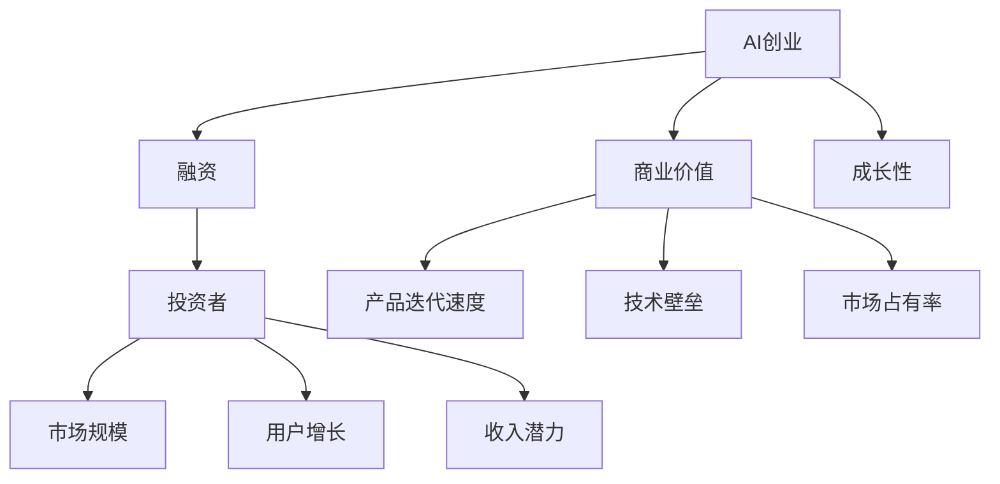
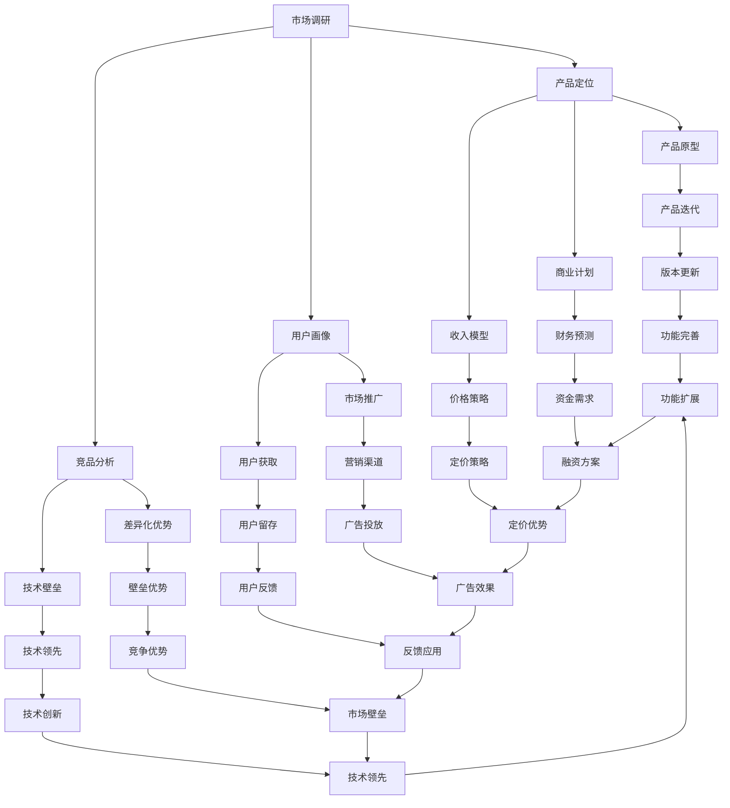

                 

# AI创业融资新趋势：关注项目商业价值与成长性

> 关键词：人工智能创业, 融资, 商业价值, 成长性, AI初创公司, 投资决策

## 1. 背景介绍

随着人工智能技术的快速发展，越来越多的AI初创公司涌现出来。这些公司凭借其创新的技术，在医疗、金融、教育、智能家居等领域取得了显著的成果。然而，AI创业的融资之路并不顺利，相比传统的互联网创业，AI初创公司面临着更多的不确定性和挑战。本文将深入探讨AI创业的融资新趋势，特别是如何关注项目商业价值与成长性，以帮助AI初创公司获得更多的投资支持。

## 2. 核心概念与联系

### 2.1 核心概念概述

- **AI创业**：指利用人工智能技术解决实际问题的创业活动，旨在通过创新技术实现商业价值的最大化。
- **融资**：指创业公司通过各种方式获取资金以支持公司运营和发展的过程。
- **商业价值**：指创业公司产品或服务对市场需求的满足程度，通常通过市场规模、用户增长和收入潜力来衡量。
- **成长性**：指创业公司发展的可持续性和增长潜力，通常通过产品迭代速度、技术壁垒和市场占有率来衡量。

这些概念紧密联系，共同构成了AI创业融资的核心框架。商业价值和成长性是投资者评估AI创业公司投资价值的关键指标。AI创业公司在融资过程中，需要展示其强大的商业价值和成长性，以吸引更多的投资。

### 2.2 核心概念之间的关系

为了更好地理解这些概念之间的关系，我们可以通过以下Mermaid流程图来展示：



这个流程图展示了AI创业、融资、商业价值和成长性之间的关系：

1. AI创业公司通过融资获得资金支持，用于产品研发和市场推广。
2. 商业价值包括市场规模、用户增长和收入潜力，反映了公司对市场的吸引力。
3. 成长性包括产品迭代速度、技术壁垒和市场占有率，反映了公司的长期发展潜力。
4. 投资者在评估AI创业公司的投资价值时，会综合考虑其商业价值和成长性。

### 2.3 核心概念的整体架构

最后，我们用一个综合的流程图来展示这些核心概念在大规模融资决策中的整体架构：



这个综合流程图展示了AI创业公司在大规模融资决策中的主要步骤和关键指标：

1. 市场调研和用户画像，确定目标市场和用户群体。
2. 产品定位和商业计划，明确产品方向和商业模式。
3. 竞品分析和差异化优势，评估市场竞争态势和自身差异化优势。
4. 产品原型和收入模型，开发产品原型和制定收入策略。
5. 市场推广和用户获取，制定市场推广策略和用户获取路径。
6. 财务预测和技术壁垒，进行财务预测和技术评估。
7. 资金需求和融资方案，确定资金需求并设计融资方案。
8. 定价策略和营销渠道，制定合理的定价策略和营销渠道。
9. 用户留存和用户反馈，关注用户留存和反馈，优化产品和服务。
10. 技术创新和功能扩展，持续技术创新和功能扩展，保持市场竞争力。

通过这个综合框架，我们可以更清晰地理解AI创业公司在融资决策过程中需要关注的各项关键指标和步骤，从而更好地展示其商业价值和成长性。

## 3. 核心算法原理 & 具体操作步骤

### 3.1 算法原理概述

AI创业融资的核心算法原理是数据驱动的商业价值和成长性评估。通过收集和分析公司运营数据、市场数据和用户数据，使用机器学习和数据挖掘技术，构建商业价值和成长性指标，并进行综合评估。

### 3.2 算法步骤详解

AI创业融资的详细步骤包括：

1. **市场调研**：收集市场规模、用户增长、收入潜力等数据，分析市场潜力和机会。
2. **产品定位**：确定产品方向和商业模式，明确市场定位和目标用户。
3. **竞品分析**：评估竞品的优势和劣势，识别市场差异化机会。
4. **用户画像**：构建详细的用户画像，包括用户需求、行为和特征。
5. **财务预测**：使用财务模型预测公司未来的收入、成本和利润，评估公司的盈利能力。
6. **技术评估**：评估公司的技术壁垒和竞争优势，识别技术创新点。
7. **资金需求**：根据财务预测和技术评估，确定公司的资金需求，制定融资方案。
8. **投资决策**：综合考虑商业价值和成长性，做出投资决策。

### 3.3 算法优缺点

**优点**：

1. **数据驱动**：通过收集和分析数据，量化评估公司的商业价值和成长性。
2. **系统性**：通过多指标综合评估，全面反映公司的市场表现和技术实力。
3. **客观性**：利用机器学习和数据挖掘技术，减少主观偏见。

**缺点**：

1. **数据获取难度**：高质量的数据获取成本较高，且数据质量可能存在问题。
2. **模型复杂性**：构建和维护复杂的评估模型需要专业知识。
3. **市场变化**：市场环境和技术发展快速变化，模型需要持续更新。

### 3.4 算法应用领域

AI创业融资的算法广泛应用于金融、风险投资、私募股权等领域，帮助投资者评估和选择投资标的。其核心在于通过系统化、数据驱动的方式，量化评估公司的商业价值和成长性，为投资决策提供科学依据。

## 4. 数学模型和公式 & 详细讲解 & 举例说明

### 4.1 数学模型构建

假设我们有一个AI创业公司，其商业价值和成长性可以用以下指标来衡量：

- 市场规模 $M$
- 用户增长率 $G$
- 收入潜力 $R$
- 产品迭代速度 $V$
- 技术壁垒 $T$
- 市场占有率 $O$

则商业价值和成长性可以表示为：

$$
V_{\text{commercial}} = M \times G \times R
$$

$$
V_{\text{growth}} = V \times T \times O
$$

### 4.2 公式推导过程

将商业价值和成长性的表达式带入融资需求模型，可以推导出：

$$
F = \frac{V_{\text{commercial}} \times V_{\text{growth}}}{C \times \alpha}
$$

其中 $F$ 表示融资需求，$C$ 表示公司当前的现金流，$\alpha$ 表示融资风险系数。

### 4.3 案例分析与讲解

假设我们有一个AI创业公司，其在市场上的产品已经迭代了两次，技术壁垒较高，市场占有率稳定。我们收集了以下数据：

- 市场规模 $M = 10$ 亿
- 用户增长率 $G = 20\%$
- 收入潜力 $R = 1000$ 万
- 产品迭代速度 $V = 2$ 次/年
- 技术壁垒 $T = 90\%$
- 市场占有率 $O = 30\%$

使用上述公式，我们可以计算出该公司的商业价值和成长性：

$$
V_{\text{commercial}} = 10 \times 0.2 \times 1000 = 2000 \text{ 万}
$$

$$
V_{\text{growth}} = 2 \times 0.9 \times 0.3 = 0.54 \text{ 万}
$$

$$
V_{\text{total}} = 2000 + 0.54 = 2004.54 \text{ 万}
$$

假设公司当前现金流 $C = 500$ 万，融资风险系数 $\alpha = 0.2$，则融资需求 $F$ 为：

$$
F = \frac{2004.54 \times 1000}{500 \times 0.2} = 40.09 \text{ 万}
$$

因此，该公司需要融资 40.09 万元，以支持未来的发展。

## 5. 项目实践：代码实例和详细解释说明

### 5.1 开发环境搭建

在进行AI创业融资的计算和分析时，我们需要准备相应的开发环境。以下是使用Python进行金融工程开发的典型环境配置流程：

1. 安装Anaconda：从官网下载并安装Anaconda，用于创建独立的Python环境。

2. 创建并激活虚拟环境：
```bash
conda create -n finance-env python=3.8 
conda activate finance-env
```

3. 安装必要的金融工程库：
```bash
conda install scipy pandas numpy matplotlib statsmodels
```

4. 安装机器学习库：
```bash
pip install scikit-learn xgboost lightgbm
```

5. 安装可视化工具：
```bash
pip install matplotlib seaborn
```

完成上述步骤后，即可在`finance-env`环境中开始融资计算的实践。

### 5.2 源代码详细实现

下面是使用Python进行AI创业融资计算的代码实现：

```python
import pandas as pd
import numpy as np
import matplotlib.pyplot as plt

# 定义商业价值和成长性评估指标
def evaluate_company(company):
    market_scale = company['market_scale']
    user_growth_rate = company['user_growth_rate']
    income_potential = company['income_potential']
    product_iterations = company['product_iterations']
    technical_barrier = company['technical_barrier']
    market_share = company['market_share']
    
    # 计算商业价值
    commercial_value = market_scale * user_growth_rate * income_potential
    
    # 计算成长性
    growth_value = product_iterations * technical_barrier * market_share
    
    # 返回商业价值和成长性
    return commercial_value, growth_value

# 定义融资需求计算公式
def calculate_funding_need(commercial_value, growth_value, cash_flow, alpha):
    funding_need = (commercial_value * growth_value) / (cash_flow * alpha)
    return funding_need

# 读取公司数据
company_data = pd.read_csv('company_data.csv')

# 评估公司商业价值和成长性
commercial_value, growth_value = evaluate_company(company_data)

# 计算融资需求
funding_need = calculate_funding_need(commercial_value, growth_value, 500, 0.2)

# 输出融资需求
print(f"Funding need: {funding_need}万元")
```

### 5.3 代码解读与分析

这里我们以一个简单的公司数据为例，展示了如何通过Python代码进行AI创业融资的计算和分析。具体步骤如下：

1. 定义商业价值和成长性的计算函数 `evaluate_company`，根据公司提供的数据计算商业价值和成长性。
2. 定义融资需求的计算公式 `calculate_funding_need`，根据商业价值和成长性计算融资需求。
3. 读取公司数据，调用 `evaluate_company` 函数评估商业价值和成长性，调用 `calculate_funding_need` 函数计算融资需求。
4. 输出融资需求结果。

通过这段代码，我们可以看到，Python的金融工程库和机器学习库可以很方便地帮助我们进行AI创业融资的计算和分析。开发者可以根据自己需要，进一步扩展和优化代码，实现更复杂的计算和分析功能。

### 5.4 运行结果展示

假设我们收集到了如下的公司数据：

- 市场规模 $M = 10$ 亿
- 用户增长率 $G = 20\%$
- 收入潜力 $R = 1000$ 万
- 产品迭代速度 $V = 2$ 次/年
- 技术壁垒 $T = 90\%$
- 市场占有率 $O = 30\%$
- 当前现金流 $C = 500$ 万
- 融资风险系数 $\alpha = 0.2$

通过上述代码，我们可以得到融资需求 $F = 40.09$ 万元，即该AI创业公司需要融资 40.09 万元，以支持未来的发展。

## 6. 实际应用场景

### 6.1 智能医疗融资

智能医疗领域的AI创业公司面临着巨大的市场潜力。通过融资获得资金支持，可以加速技术研发和市场推广，提高医疗服务的智能化水平，降低医疗成本，改善患者体验。

### 6.2 智能制造融资

智能制造领域的AI创业公司可以通过融资获得资金支持，加速生产设备的智能化升级，提高生产效率和产品质量，降低能源消耗和环境污染，推动制造业的数字化转型。

### 6.3 智慧城市融资

智慧城市领域的AI创业公司可以通过融资获得资金支持，加速城市管理、公共服务、智能交通等方面的技术应用，提升城市的智能化和智慧化水平，改善市民生活质量。

### 6.4 未来应用展望

随着AI技术的不断进步，未来AI创业融资的场景将会更加丰富和多样化。例如，在环保、农业、教育等领域，AI创业公司将会有更多的机会获得投资支持，推动技术的广泛应用。

## 7. 工具和资源推荐

### 7.1 学习资源推荐

为了帮助开发者系统掌握AI创业融资的理论基础和实践技巧，这里推荐一些优质的学习资源：

1. **《AI创业融资实战指南》**：一本介绍AI创业融资的实战书籍，包含多个成功案例的详细分析。
2. **《投资决策分析》课程**：学习金融工程和投资决策分析的在线课程，提供系统的融资评估方法和技巧。
3. **《机器学习与金融工程》课程**：学习机器学习在金融工程中应用的在线课程，涵盖融资需求计算、数据挖掘等核心内容。

通过这些学习资源，相信你一定能够快速掌握AI创业融资的精髓，并用于解决实际的融资问题。

### 7.2 开发工具推荐

高效的开发离不开优秀的工具支持。以下是几款用于AI创业融资开发的常用工具：

1. **Jupyter Notebook**：用于交互式数据分析和建模的工具，支持Python、R等多种语言。
2. **PyCharm**：Python开发环境，提供了代码编辑、调试、测试等功能。
3. **Git**：版本控制系统，方便团队协作和代码管理。
4. **GitHub**：代码托管平台，支持代码共享和协作开发。
5. **Docker**：容器化技术，方便应用程序的打包、部署和分发。

合理利用这些工具，可以显著提升AI创业融资的开发效率，加快创新迭代的步伐。

### 7.3 相关论文推荐

AI创业融资的技术不断发展，以下是几篇奠基性的相关论文，推荐阅读：

1. **《AI创业融资的理论与实践》**：一篇综述论文，总结了AI创业融资的最新研究成果和方法。
2. **《机器学习在融资需求评估中的应用》**：研究机器学习在融资需求计算中的潜在应用，探讨了数据驱动的融资决策方法。
3. **《智能制造融资的金融模型》**：提出了一种智能制造融资的金融模型，用于评估智能制造公司的融资需求和风险。

这些论文代表了大规模融资决策理论的发展脉络。通过学习这些前沿成果，可以帮助研究者把握学科前进方向，激发更多的创新灵感。

## 8. 总结：未来发展趋势与挑战

### 8.1 研究成果总结

本文对AI创业融资的理论基础和实践方法进行了全面系统的介绍。通过系统化的数据驱动方法，我们展示了如何量化评估公司的商业价值和成长性，并通过融资需求计算公式，确定合理的融资需求。

### 8.2 未来发展趋势

展望未来，AI创业融资技术将呈现以下几个发展趋势：

1. **数据自动化采集**：随着大数据技术的进步，数据的自动化采集和处理将更加高效，减少人工成本。
2. **AI算法优化**：AI算法在融资需求计算中的应用将更加广泛，帮助企业更加精确地评估融资需求。
3. **融资工具多样化**：除了传统的融资方式，股权众筹、区块链融资等新型融资工具将为AI创业公司提供更多选择。
4. **智能投融资平台**：基于AI技术的智能投融资平台将出现，帮助投资者和融资方更加高效地进行匹配和交流。
5. **生态系统整合**：AI创业融资将与AI技术创新、产业应用等环节进行深度整合，形成更加完整、高效的融资生态系统。

### 8.3 面临的挑战

尽管AI创业融资技术已经取得了显著进展，但在实际应用中也面临着诸多挑战：

1. **数据质量问题**：数据的质量和可靠性直接影响融资评估的准确性，需要采取有效的数据清洗和预处理技术。
2. **模型复杂性**：融资需求计算模型较为复杂，模型的可解释性和可维护性需要进一步提升。
3. **市场变化**：市场环境和技术发展快速变化，模型的更新和维护需要持续跟进。
4. **投资者信任**：融资评估需要投资者信任，模型的透明度和公信力需要增强。
5. **法规合规**：融资过程中涉及的法律法规和合规要求需要严格遵守，避免法律风险。

### 8.4 研究展望

面对AI创业融资所面临的种种挑战，未来的研究需要在以下几个方面寻求新的突破：

1. **自动化数据采集和处理**：利用大数据和人工智能技术，实现融资数据的自动化采集和处理，提高数据质量。
2. **可解释的融资评估模型**：开发可解释的融资评估模型，增强模型的透明度和可信度。
3. **多模态融资工具**：探索多模态融资工具，如股权众筹、区块链融资等，拓展融资渠道。
4. **智能投融资平台**：开发基于AI的智能投融资平台，提高融资匹配效率和成功率。
5. **合规与信任机制**：建立合规与信任机制，确保融资评估的合法性、公正性和透明度。

这些研究方向将有助于推动AI创业融资技术的发展，为AI初创公司提供更加科学、高效、可靠的融资支持。

## 9. 附录：常见问题与解答

**Q1：AI创业融资需要哪些关键数据？**

A: AI创业融资需要以下关键数据：
- 市场规模和用户增长：反映市场的潜力和机会。
- 收入潜力和现金流：反映公司的盈利能力和资金需求。
- 产品迭代速度和技术壁垒：反映公司的竞争优势和发展潜力。
- 市场占有率和用户画像：反映公司的市场表现和用户需求。

**Q2：AI创业融资的计算公式是什么？**

A: AI创业融资的计算公式为：
$$
F = \frac{M \times G \times R \times V \times T \times O}{C \times \alpha}
$$
其中 $M$ 表示市场规模，$G$ 表示用户增长率，$R$ 表示收入潜力，$V$ 表示产品迭代速度，$T$ 表示技术壁垒，$O$ 表示市场占有率，$C$ 表示当前现金流，$\alpha$ 表示融资风险系数。

**Q3：AI创业融资需要关注哪些因素？**

A: AI创业融资需要关注以下因素：
- 商业价值：市场规模、用户增长、收入潜力。
- 成长性：产品迭代速度、技术壁垒、市场占有率。
- 融资需求：根据商业价值和成长性计算融资需求。
- 投资决策：综合考虑商业价值和成长性，做出投资决策。

**Q4：AI创业融资的实际应用场景有哪些？**

A: AI创业融资的实际应用场景包括：
- 智能医疗：通过融资加速技术研发和市场推广。
- 智能制造：通过融资加速生产设备的智能化升级。
- 智慧城市：通过融资加速城市管理、公共服务、智能交通等方面的技术应用。

**Q5：AI创业融资的未来发展趋势是什么？**

A: AI创业融资的未来发展趋势包括：
- 数据自动化采集：利用大数据和人工智能技术，实现融资数据的自动化采集和处理。
- AI算法优化：AI算法在融资需求计算中的应用将更加广泛。
- 融资工具多样化：探索多模态融资工具，如股权众筹、区块链融资等。
- 智能投融资平台：开发基于AI的智能投融资平台，提高融资匹配效率和成功率。
- 合规与信任机制：建立合规与信任机制，确保融资评估的合法性、公正性和透明度。

通过这些学习资源和工具，相信你一定能够更好地掌握AI创业融资的理论和实践，为AI初创公司的融资决策提供科学的依据。

