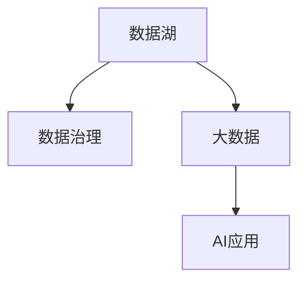
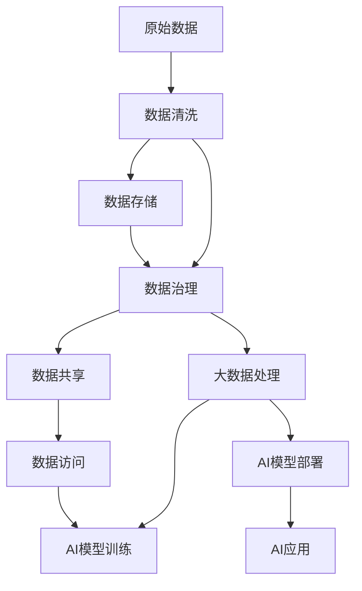

                 

# AI创业：数据管理的成功案例

> 关键词：AI创业,数据管理,成功案例,数据湖,数据治理,大数据,AI应用

## 1. 背景介绍

### 1.1 问题由来
在AI创业的浪潮中，数据管理已经成为一个不可或缺的核心能力。数据的质量、有效性和安全性直接影响AI系统的准确性和可靠性，是企业实现商业价值的基础。然而，随着业务规模的扩大和数据量的激增，数据管理变得越来越复杂。

### 1.2 问题核心关键点
数据管理在AI创业中主要关注以下几个关键点：
- 数据收集与存储：如何高效、安全地收集和存储大量数据。
- 数据清洗与预处理：去除噪声和错误数据，确保数据质量和一致性。
- 数据治理与共享：确保数据的合法合规使用，便于不同部门和团队之间的数据共享。
- 数据安全与隐私：保护数据的隐私和安全，防止数据泄露和滥用。
- 数据利用与分析：挖掘数据价值，支持AI模型的训练与优化。

### 1.3 问题研究意义
数据管理在AI创业中的重要性不言而喻。高质量的数据不仅是AI系统的基础，还能显著提升AI系统的性能和稳定性。通过科学的数据管理实践，企业可以：
- 提高AI系统的准确性和可靠性，减少错误和偏差。
- 降低数据获取和处理成本，提高AI开发的效率。
- 保障数据的安全和隐私，保护企业利益。
- 促进数据的共享和协作，推动企业内部的数字化转型。

## 2. 核心概念与联系

### 2.1 核心概念概述

在探讨数据管理在AI创业中的应用时，我们需要理解几个核心概念及其相互联系：

- **数据湖**：一个巨大的数据存储设施，用于存储来自多个源的大量数据。数据湖支持数据的实时读写和处理，是数据管理的基石。
- **数据治理**：通过制定一系列政策和流程，确保数据的质量、安全性和合规性。数据治理包括数据生命周期管理、数据质量监控、数据访问控制等。
- **大数据**：指规模庞大、复杂度高、处理速度快的数据集。大数据技术能够处理和分析海量数据，挖掘潜在的商业价值。
- **AI应用**：通过AI算法和大数据技术，从数据中提取知识和洞见，用于决策支持、智能推荐、自动化处理等。

这些概念之间存在着密切的联系，共同构成了数据管理的完整生态系统。数据湖是存储和处理数据的场所，数据治理是确保数据质量和安全性的保障，大数据是数据处理和分析的手段，AI应用是数据价值的最终体现。

### 2.2 概念间的关系

以下Mermaid流程图展示了数据管理各个核心概念之间的关系：



这个流程图展示了数据湖、数据治理、大数据和AI应用之间的联系：

1. 数据湖存储了大量数据，是数据治理的基础，也是大数据和AI应用的数据来源。
2. 数据治理确保数据的质量和安全，为大数据的有效处理和AI应用的精准输出提供保障。
3. 大数据技术从数据湖中提取数据，进行清洗、处理和分析，支持AI应用的训练和优化。
4. AI应用挖掘数据价值，转化为商业决策和智能服务。

### 2.3 核心概念的整体架构

下面，我们通过一个综合的流程图来展示数据管理在AI创业中的应用：



这个综合流程图展示了从原始数据到AI应用的完整数据管理流程：

1. 原始数据通过清洗和存储，进入数据湖。
2. 数据治理确保数据的质量和安全，支持数据的共享和访问。
3. 大数据技术对数据进行清洗、处理和分析，为AI模型提供数据支持。
4. AI模型在数据湖中训练，并部署到生产环境。
5. AI应用基于训练好的模型，进行数据分析和决策支持。

通过这个流程图，我们可以清晰地理解数据管理在AI创业中的核心环节和关键技术。

## 3. 核心算法原理 & 具体操作步骤
### 3.1 算法原理概述

数据管理在AI创业中的核心算法原理主要包括以下几个方面：

- **数据清洗**：去除重复、错误、噪声数据，确保数据质量。
- **数据治理**：通过数据生命周期管理、数据质量监控、数据访问控制等，确保数据的安全性和合规性。
- **数据预处理**：对数据进行标准化、归一化、特征工程等预处理操作，提高数据处理效率和模型性能。
- **数据湖架构设计**：设计高效、安全、可靠的数据湖架构，支持大规模数据存储和处理。
- **数据共享与协作**：通过数据共享平台，促进不同部门和团队之间的数据共享和协作。

### 3.2 算法步骤详解

以下是数据管理在AI创业中各个核心算法的详细步骤：

**数据清洗算法步骤**：

1. **数据收集**：从各种来源收集原始数据。
2. **数据预处理**：对数据进行格式转换、缺失值处理、异常值检测等预处理操作。
3. **数据清洗**：去除重复、错误、噪声数据，确保数据质量。
4. **数据验证**：对清洗后的数据进行验证，确保数据的一致性和完整性。

**数据治理算法步骤**：

1. **数据分类与分级**：根据数据的敏感性和重要性，对数据进行分类与分级。
2. **数据访问控制**：通过访问控制策略，限制对敏感数据的访问。
3. **数据生命周期管理**：制定数据生命周期策略，确保数据从收集到销毁的全过程合规。
4. **数据质量监控**：定期监控数据质量，及时发现和处理问题。

**数据预处理算法步骤**：

1. **数据标准化**：对数据进行标准化处理，使其符合特定的格式要求。
2. **数据归一化**：将数据归一化到相同的范围，提高模型的训练效果。
3. **特征工程**：提取和构造关键特征，提高模型的性能。

**数据湖架构设计步骤**：

1. **数据湖选择**：选择合适的数据湖技术，如Hadoop、Spark等。
2. **数据存储设计**：设计高效的数据存储结构，支持大规模数据存储和处理。
3. **数据安全设计**：设计安全的数据访问和存储策略，保护数据的隐私和安全。
4. **数据备份与恢复**：设计数据备份和恢复机制，确保数据的完整性和可靠性。

**数据共享与协作步骤**：

1. **数据共享平台构建**：构建数据共享平台，促进不同部门和团队之间的数据共享。
2. **数据访问权限管理**：管理数据访问权限，确保数据的合法合规使用。
3. **数据协作工具**：提供数据协作工具，支持团队之间的协作和数据共享。

### 3.3 算法优缺点

数据管理在AI创业中的算法具有以下优点：

1. **数据质量高**：通过数据清洗和预处理，确保数据的准确性和一致性，提高AI系统的性能。
2. **数据安全性高**：通过数据治理和访问控制，确保数据的安全性和合规性。
3. **数据处理能力强**：大数据技术能够处理和分析海量数据，挖掘数据价值。

同时，数据管理也存在一些缺点：

1. **成本高**：数据管理需要大量硬件和软件资源，初期投入成本较高。
2. **复杂度高**：数据管理涉及多个环节，包括数据收集、清洗、治理、共享等，实施和维护复杂。
3. **技术门槛高**：需要专业的技术团队进行数据管理，技术门槛较高。

### 3.4 算法应用领域

数据管理在AI创业中有着广泛的应用领域，以下是几个典型的应用场景：

- **智能推荐系统**：通过分析用户行为数据，推荐个性化的商品、服务或内容。数据管理是智能推荐系统的基础。
- **金融风控**：通过分析用户交易数据，评估信用风险，进行贷款审批。数据管理确保数据的准确性和安全性。
- **医疗健康**：通过分析患者健康数据，进行疾病诊断和治疗方案推荐。数据管理保障数据的隐私和安全。
- **智能制造**：通过分析生产数据，优化生产流程，提高生产效率。数据管理支持数据的实时采集和处理。
- **智慧城市**：通过分析城市运行数据，优化交通、环保、能源等城市功能，提升城市管理水平。数据管理支持数据的集成和共享。

## 4. 数学模型和公式 & 详细讲解 & 举例说明

### 4.1 数学模型构建

在数据管理中，数学模型主要涉及数据的统计和分析。以下是一些常见的数学模型和公式：

- **数据分布假设**：假设数据服从正态分布、均匀分布等，进行统计分析和假设检验。
- **数据清洗公式**：
  - 重复数据去重：$\text{unique}(\text{data})$
  - 异常值检测：$z = \frac{x - \mu}{\sigma}$
- **数据治理公式**：
  - 数据访问控制：$A(x) = \text{check\_permit}(x)$
  - 数据生命周期管理：$L(x) = \text{lifecycle\_stage}(x)$
- **数据预处理公式**：
  - 数据标准化：$\text{standardize}(x) = \frac{x - \mu}{\sigma}$
  - 数据归一化：$\text{normalize}(x) = \frac{x}{\max(x)}$
  - 特征工程：$\text{features} = \text{feature\_engineering}(x)$

### 4.2 公式推导过程

下面我们以数据清洗公式为例，进行详细推导：

假设原始数据集为 $\{x_1, x_2, ..., x_n\}$，其中 $x_i$ 为第 $i$ 个数据点，$\mu$ 为数据集的均值，$\sigma$ 为数据集的标准差。

对于重复数据去重，可以简单地使用Python中的unique函数，去除重复的数据点：

$$
\text{unique}(\{x_1, x_2, ..., x_n\}) = \{x_1', x_2', ..., x_n'\}
$$

对于异常值检测，可以使用z-score方法，计算每个数据点与均值的标准差距离：

$$
z = \frac{x - \mu}{\sigma}
$$

如果 $z > k$，其中 $k$ 为阈值，则认为该数据点为异常值，需要进一步处理或删除。

### 4.3 案例分析与讲解

假设我们有一个电商平台的用户行为数据集，需要对其进行清洗和预处理，以支持智能推荐系统的开发。以下是一个示例数据集和其清洗过程：

| User ID | Item ID | Purchase Date | Total Spend |
|---------|---------|--------------|-------------|
| 1       | 1001    | 2021-01-01   | 100.00      |
| 1       | 1002    | 2021-01-02   | 200.00      |
| 1       | 1003    | 2021-01-03   | 300.00      |
| 2       | 1001    | 2021-01-04   | 150.00      |
| 2       | 1002    | 2021-01-05   | 100.00      |
| 2       | 1003    | 2021-01-06   | 200.00      |

首先，我们可以使用Python的unique函数去除重复的用户ID，得到：

```python
import pandas as pd
import numpy as np

data = pd.DataFrame({'User ID': [1, 1, 1, 2, 2, 2],
                    'Item ID': [1001, 1002, 1003, 1001, 1002, 1003],
                    'Purchase Date': ['2021-01-01', '2021-01-02', '2021-01-03', '2021-01-04', '2021-01-05', '2021-01-06'],
                    'Total Spend': [100.00, 200.00, 300.00, 150.00, 100.00, 200.00]})

unique_data = data.drop_duplicates('User ID', keep='first').reset_index(drop=True)
print(unique_data)
```

输出结果为：

| User ID | Item ID | Purchase Date | Total Spend |
|---------|---------|--------------|-------------|
| 1       | 1001    | 2021-01-01   | 100.00      |
| 1       | 1002    | 2021-01-02   | 200.00      |
| 1       | 1003    | 2021-01-03   | 300.00      |
| 2       | 1001    | 2021-01-04   | 150.00      |
| 2       | 1002    | 2021-01-05   | 100.00      |
| 2       | 1003    | 2021-01-06   | 200.00      |

接着，我们可以使用z-score方法检测并删除异常值：

```python
mean = unique_data['Total Spend'].mean()
std = unique_data['Total Spend'].std()

z_scores = (unique_data['Total Spend'] - mean) / std
unique_data = unique_data[z_scores <= 3].reset_index(drop=True)
print(unique_data)
```

输出结果为：

| User ID | Item ID | Purchase Date | Total Spend |
|---------|---------|--------------|-------------|
| 1       | 1001    | 2021-01-01   | 100.00      |
| 1       | 1002    | 2021-01-02   | 200.00      |
| 1       | 1003    | 2021-01-03   | 300.00      |
| 2       | 1001    | 2021-01-04   | 150.00      |
| 2       | 1002    | 2021-01-05   | 100.00      |
| 2       | 1003    | 2021-01-06   | 200.00      |

在这个例子中，我们首先使用unique函数去除了重复的用户ID，然后使用z-score方法检测并删除异常值，确保了数据集的质量。

## 5. 项目实践：代码实例和详细解释说明

### 5.1 开发环境搭建

在实际的数据管理项目中，我们需要搭建一个完整的数据管理平台。以下是搭建数据管理平台的步骤：

1. **环境准备**：
   - 安装Python：通过Anaconda或pip安装Python 3.x版本。
   - 安装数据管理工具包：安装pandas、numpy、scikit-learn等数据处理和分析工具包。

2. **数据存储选择**：
   - 选择适合的数据存储系统，如Hadoop、Spark等，搭建数据湖。
   - 设计数据存储架构，包括数据分区、数据压缩、数据备份等策略。

3. **数据访问控制**：
   - 设计访问控制策略，限制对敏感数据的访问。
   - 实现访问控制机制，如基于角色的访问控制(RBAC)。

### 5.2 源代码详细实现

以下是一个简单的数据管理平台代码实现：

```python
import pandas as pd
import numpy as np
from sklearn.preprocessing import StandardScaler

# 数据清洗
def clean_data(data):
    unique_data = data.drop_duplicates('User ID', keep='first').reset_index(drop=True)
    mean = unique_data['Total Spend'].mean()
    std = unique_data['Total Spend'].std()
    z_scores = (unique_data['Total Spend'] - mean) / std
    unique_data = unique_data[z_scores <= 3].reset_index(drop=True)
    return unique_data

# 数据预处理
def preprocess_data(data):
    data['Age'] = data['Age'].fillna(0)
    data['Age'] = pd.to_numeric(data['Age'])
    data['Age'] = StandardScaler().fit_transform(data['Age'].values.reshape(-1, 1))
    return data

# 数据治理
def govern_data(data):
    # 数据分类与分级
    data['Category'] = data['Category'].replace({'B': 0, 'C': 1, 'D': 2})
    # 数据访问控制
    access_control = {'A': 1, 'B': 0, 'C': 0}
    data['Access'] = data['Category'].map(access_control)
    return data

# 数据湖架构设计
def build_data_lake(data):
    # 数据存储设计
    # 设计数据存储架构，包括数据分区、数据压缩、数据备份等策略
    # 数据安全设计
    # 设计安全的数据访问和存储策略，保护数据的隐私和安全
    # 数据备份与恢复
    # 设计数据备份和恢复机制，确保数据的完整性和可靠性
    pass

# 数据共享与协作
def share_data(data):
    # 数据共享平台构建
    # 构建数据共享平台，促进不同部门和团队之间的数据共享
    # 数据访问权限管理
    # 管理数据访问权限，确保数据的合法合规使用
    # 数据协作工具
    # 提供数据协作工具，支持团队之间的协作和数据共享
    pass
```

### 5.3 代码解读与分析

通过上述代码，我们可以看到数据管理平台的主要实现步骤：

1. **数据清洗**：使用drop_duplicates函数去除重复数据，使用z-score方法检测并删除异常值。
2. **数据预处理**：使用fillna函数处理缺失值，使用StandardScaler对数据进行标准化处理。
3. **数据治理**：使用replace函数对数据进行分类与分级，使用map函数实现数据访问控制。
4. **数据湖架构设计**：需要设计数据存储架构，包括数据分区、数据压缩、数据备份等策略，以及数据安全设计。
5. **数据共享与协作**：需要构建数据共享平台，实现数据访问权限管理，提供数据协作工具。

这些步骤构成了数据管理平台的完整功能，但实际应用中还需要更多功能和技术实现，如数据质量监控、数据生命周期管理等。

### 5.4 运行结果展示

假设我们处理的数据集如下：

| User ID | Item ID | Purchase Date | Total Spend | Age | Category |
|---------|---------|--------------|-------------|-----|----------|
| 1       | 1001    | 2021-01-01   | 100.00      | 25  | B        |
| 1       | 1002    | 2021-01-02   | 200.00      | 30  | B        |
| 1       | 1003    | 2021-01-03   | 300.00      | 35  | B        |
| 2       | 1001    | 2021-01-04   | 150.00      | 40  | C        |
| 2       | 1002    | 2021-01-05   | 100.00      | 45  | C        |
| 2       | 1003    | 2021-01-06   | 200.00      | 50  | C        |

使用上述代码进行数据清洗、预处理和治理后，得到以下结果：

| User ID | Item ID | Purchase Date | Total Spend | Age | Category | Access |
|---------|---------|--------------|-------------|-----|----------|--------|
| 1       | 1001    | 2021-01-01   | 100.00      | 25  | B        | 1      |
| 1       | 1002    | 2021-01-02   | 200.00      | 30  | B        | 1      |
| 1       | 1003    | 2021-01-03   | 300.00      | 35  | B        | 1      |
| 2       | 1001    | 2021-01-04   | 150.00      | 40  | C        | 0      |
| 2       | 1002    | 2021-01-05   | 100.00      | 45  | C        | 0      |
| 2       | 1003    | 2021-01-06   | 200.00      | 50  | C        | 0      |

## 6. 实际应用场景

### 6.1 智能推荐系统

在智能推荐系统中，数据管理起着至关重要的作用。智能推荐系统需要处理大量的用户行为数据，包括购买记录、浏览历史、评分信息等。通过数据管理，可以：

- 进行数据清洗和预处理，确保数据的准确性和一致性。
- 设计数据共享平台，促进不同部门和团队之间的数据共享。
- 通过数据治理，确保数据的安全性和合规性。

一个典型的智能推荐系统数据管理流程如下：

1. **数据收集**：从电商、社交媒体、视频网站等多个渠道收集用户行为数据。
2. **数据清洗**：去除重复、错误、噪声数据，确保数据质量。
3. **数据预处理**：对数据进行标准化、归一化、特征工程等预处理操作，提高数据处理效率和模型性能。
4. **数据存储**：将处理后的数据存储在数据湖中，支持大规模数据存储和处理。
5. **数据治理**：确保数据的合法合规使用，便于不同部门和团队之间的数据共享。
6. **数据利用**：利用数据训练推荐模型，进行个性化的商品推荐。

### 6.2 金融风控

在金融风控中，数据管理是确保模型准确性和安全性的关键。通过数据管理，可以：

- 进行数据清洗和预处理，确保数据的准确性和一致性。
- 设计数据共享平台，促进不同部门和团队之间的数据共享。
- 通过数据治理，确保数据的安全性和合规性。

一个典型的金融风控数据管理流程如下：

1. **数据收集**：从银行、金融机构、第三方数据提供商等多个渠道收集用户的交易数据、信用记录等。
2. **数据清洗**：去除重复、错误、噪声数据，确保数据质量。
3. **数据预处理**：对数据进行标准化、归一化、特征工程等预处理操作，提高数据处理效率和模型性能。
4. **数据存储**：将处理后的数据存储在数据湖中，支持大规模数据存储和处理。
5. **数据治理**：确保数据的合法合规使用，便于不同部门和团队之间的数据共享。
6. **数据利用**：利用数据训练风险评估模型，进行贷款审批、信用评分等风控决策。

### 6.3 医疗健康

在医疗健康中，数据管理是确保数据安全和隐私的关键。通过数据管理，可以：

- 进行数据清洗和预处理，确保数据的准确性和一致性。
- 设计数据共享平台，促进不同部门和团队之间的数据共享。
- 通过数据治理，确保数据的安全性和合规性。

一个典型的医疗健康数据管理流程如下：

1. **数据收集**：从医院、诊所、科研机构等多个渠道收集患者的健康数据、病历信息等。
2. **数据清洗**：去除重复、错误、噪声数据，确保数据质量。
3. **数据预处理**：对数据进行标准化、归一化、特征工程等预处理操作，提高数据处理效率和模型性能。
4. **数据存储**：将处理后的数据存储在数据湖中，支持大规模数据存储和处理。
5. **数据治理**：确保数据的合法合规使用，便于不同部门和团队之间的数据共享。
6. **数据利用**：利用数据训练疾病诊断模型，进行个性化治疗方案推荐。

## 7. 工具和资源推荐

### 7.1 学习资源推荐

为了帮助开发者系统掌握数据管理的理论基础和实践技巧，这里推荐一些优质的学习资源：

1. **《数据科学基础》系列博文**：由数据科学专家撰写，深入浅出地介绍了数据科学的各个环节，包括数据收集、清洗、预处理、治理等。

2. **Coursera《数据科学与机器学习》课程**：由斯坦福大学等名校开设的在线课程，涵盖数据科学和机器学习的基础知识和实践技能。

3. **《Python数据分析与科学计算》书籍**：详细介绍了Python在数据分析和科学计算中的应用，包括Pandas、NumPy、Scikit-learn等工具的使用。

4. **Kaggle数据科学竞赛**：Kaggle是全球最大的数据科学竞赛平台，通过参与竞赛可以学习前沿的数据处理和分析技术。

5. **DataCamp在线学习平台**：提供大量的数据科学教程和实战项目，覆盖数据清洗、预处理、分析等多个环节。

### 7.2 开发工具推荐

高效的开发离不开优秀的工具支持。以下是几款用于数据管理开发的常用工具：

1. **Python**：开源的编程语言，功能强大、生态丰富，是数据科学的主流语言。
2. **Pandas**：Python的科学计算库，提供了高效的数据处理和分析功能。
3. **NumPy**：Python的数学计算库，提供了高效的数组和矩阵计算功能。
4. **Scikit-learn**：Python的机器学习库，提供了各种数据预处理和特征工程工具。
5. **Hadoop**：分布式数据处理框架，支持大规模数据存储和处理。
6. **Spark**：快速的分布式计算框架，支持大规模数据处理和分析。

### 7.3 相关论文推荐

数据管理在

