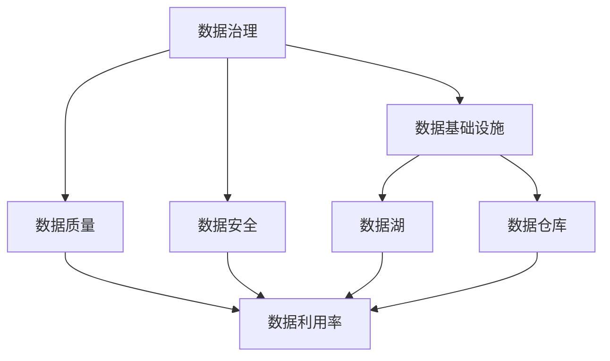
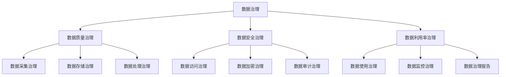
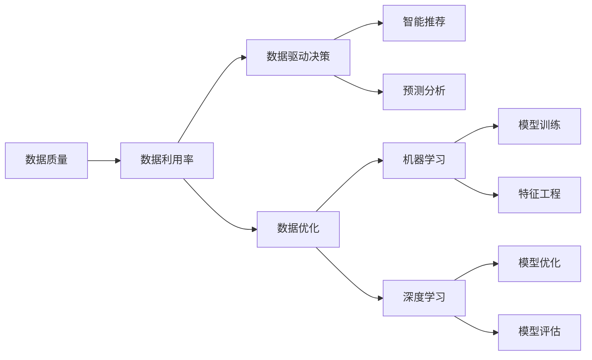
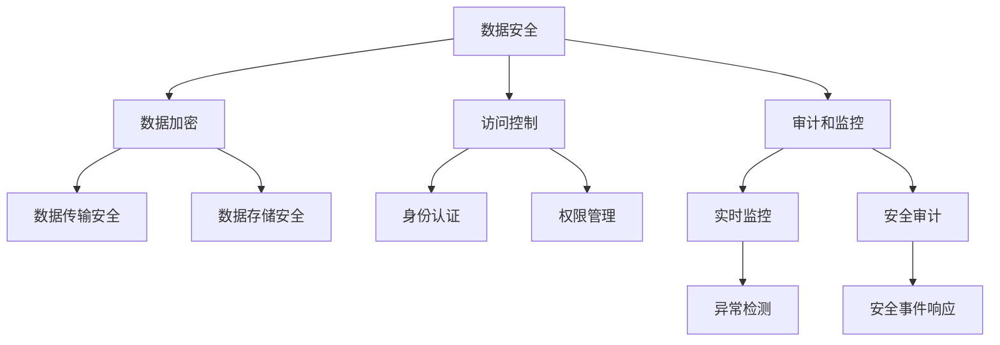
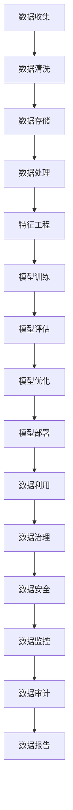

                 

# AI创业：数据管理的策略

> 关键词：数据管理,数据策略,人工智能创业,创业风险,数据治理,数据安全,数据利用率,数据基础设施

## 1. 背景介绍

随着人工智能(AI)技术的飞速发展，越来越多的创业公司开始转向以AI为核心驱动力的发展道路。然而，在AI创业的过程中，数据管理成为制约公司成长的重要因素。数据作为AI的基础，其质量、安全、管理和利用率直接决定了AI系统的性能和效果。因此，AI创业公司必须制定科学的数据管理策略，以保障数据的高效利用和AI模型的可靠运行。

### 1.1 问题由来

AI创业公司面临的数据管理挑战主要有以下几个方面：

1. **数据质量问题**：数据来源多样，格式不一，存在噪音和缺失，影响AI模型的训练效果。
2. **数据安全问题**：涉及个人隐私、知识产权等敏感信息，如何保护数据安全成为一大难题。
3. **数据治理问题**：数据生命周期管理、数据质量和一致性保障、数据访问控制等，需要制定系统的数据治理策略。
4. **数据利用率问题**：如何高效地利用已有数据，实现数据驱动的决策和优化，提升数据价值。
5. **数据基础设施问题**：数据存储、传输、处理等基础设施的建设和维护，需要高可靠性和高效性。

### 1.2 问题核心关键点

数据管理策略的核心关键点在于如何有效收集、存储、处理和利用数据，确保数据的高质量、安全性和利用效率。具体包括以下几个方面：

- **数据收集**：从不同渠道收集多样化的数据，确保数据的多样性和代表性。
- **数据存储**：采用高效的数据存储技术，如分布式存储、数据湖、数据仓库等，确保数据的高效访问和检索。
- **数据处理**：进行数据清洗、数据预处理、特征工程等，提升数据质量和一致性。
- **数据安全**：实施数据加密、访问控制、审计等措施，确保数据的安全性和隐私保护。
- **数据利用**：通过数据挖掘、机器学习、深度学习等技术，提取数据价值，实现数据驱动的决策和优化。
- **数据治理**：制定数据治理规范和流程，确保数据管理的系统性和持续性。

## 2. 核心概念与联系

### 2.1 核心概念概述

为更好地理解数据管理策略，本节将介绍几个密切相关的核心概念：

- **数据治理**：指对数据的采集、存储、处理、利用和保护进行规范和管理，确保数据的质量和安全性。
- **数据质量**：指数据的准确性、完整性、一致性、时效性和可靠性，是数据管理的基础。
- **数据安全**：指保护数据免受未授权访问、窃取、篡改等威胁，保障数据的机密性和完整性。
- **数据利用率**：指数据被有效利用的程度，包括数据的使用频率、覆盖范围和价值贡献等。
- **数据基础设施**：指支持数据管理的硬件设施和软件工具，如数据中心、数据库、数据仓库、ETL工具等。
- **数据湖**：一种分布式存储架构，支持大规模数据存储和分析，适合处理大数据量和高复杂性的数据集。
- **数据仓库**：一种集中式数据存储架构，支持数据的集中管理和查询分析，适合支持企业级的决策分析。

这些核心概念之间的逻辑关系可以通过以下Mermaid流程图来展示：



这个流程图展示了大语言模型微调过程中各个核心概念之间的关系：

1. 数据治理是数据管理的核心，确保数据质量和安全。
2. 数据质量是数据管理的基础，影响数据利用率。
3. 数据安全是数据管理的保障，与数据治理密不可分。
4. 数据基础设施是数据管理的支撑，提供数据存储和处理的能力。
5. 数据湖和数据仓库是数据基础设施的重要组成部分，支持数据管理和分析。
6. 数据利用率是数据管理的最终目标，体现数据的价值和应用效果。

这些核心概念共同构成了数据管理策略的整体框架，使得AI创业公司能够系统地管理数据，实现数据的高效利用和保护。

### 2.2 概念间的关系

这些核心概念之间存在着紧密的联系，形成了数据管理策略的完整生态系统。下面我通过几个Mermaid流程图来展示这些概念之间的关系。

#### 2.2.1 数据治理的层次结构



这个流程图展示了数据治理的层次结构：

1. 数据治理是一个系统性工程，包括数据质量、安全、利用等多个维度。
2. 数据质量治理涉及数据采集、存储、处理等各个环节，确保数据的一致性和完整性。
3. 数据安全治理涵盖访问控制、加密、审计等多个方面，保护数据的机密性和完整性。
4. 数据利用治理包括使用规范、监控、报告等环节，确保数据的高效利用和价值最大化。
5. 数据治理报告提供数据治理的可视化和度量，帮助管理团队监督和改进治理效果。

#### 2.2.2 数据利用率的提升策略



这个流程图展示了提升数据利用率的具体策略：

1. 数据质量是数据利用的基础，确保数据的准确性和一致性。
2. 数据驱动决策和数据优化是数据利用的关键应用场景，通过数据挖掘和分析，支持业务决策和业务优化。
3. 智能推荐和预测分析是数据利用的高级应用，通过构建推荐系统和预测模型，提升用户体验和服务质量。
4. 机器学习和深度学习是数据利用的技术支撑，通过模型训练和优化，提取数据的价值和规律。

#### 2.2.3 数据安全的多层次防护



这个流程图展示了数据安全的多层次防护机制：

1. 数据加密是数据安全的基础，保护数据在传输和存储过程中的机密性。
2. 访问控制和身份认证是数据安全的核心措施，确保只有授权人员能够访问数据。
3. 权限管理和审计和监控是数据安全的保障，确保数据操作的可追溯性和合规性。
4. 实时监控和异常检测是数据安全的预警机制，及时发现并响应安全威胁。
5. 安全事件响应是数据安全的事后处理措施，及时修复和弥补数据泄露和安全漏洞。

### 2.3 核心概念的整体架构

最后，我们用一个综合的流程图来展示这些核心概念在大数据治理过程中的整体架构：



这个综合流程图展示了从数据收集到数据利用，再到数据治理和数据安全的完整过程。数据管理策略的各个环节相互关联，形成了一个闭环的数据管理系统，确保数据的高效利用和保护。

## 3. 核心算法原理 & 具体操作步骤

### 3.1 算法原理概述

数据管理策略的核心算法原理主要包括数据收集、数据存储、数据处理、数据安全、数据利用和数据治理等环节。其中，数据收集和存储是数据管理的基础，数据处理和特征工程是数据管理的核心，数据安全和利用是数据管理的保障和目标。

数据收集是数据管理的第一步，通过多种渠道收集多样化的数据，确保数据的多样性和代表性。数据存储是将数据进行结构化或非结构化存储，支持高效的数据检索和处理。数据处理和特征工程是对数据进行清洗、转换和加工，提升数据质量和一致性。数据安全是保护数据免受未授权访问、窃取、篡改等威胁，保障数据的机密性和完整性。数据利用是提取数据的价值和规律，支持数据驱动的决策和优化。数据治理是对数据收集、存储、处理、利用和保护进行规范和管理，确保数据的质量和安全性。

### 3.2 算法步骤详解

#### 3.2.1 数据收集

数据收集是数据管理的第一步，通过多种渠道收集多样化的数据，确保数据的多样性和代表性。具体步骤如下：

1. **数据源选择**：根据业务需求和数据特点，选择合适的数据源，包括公共数据、开放数据、企业自有数据等。
2. **数据采集**：采用爬虫、API接口、数据库导出的方式，将数据采集到本地或云平台。
3. **数据整合**：将来自不同数据源的数据进行整合，统一数据格式和结构。

#### 3.2.2 数据存储

数据存储是将数据进行结构化或非结构化存储，支持高效的数据检索和处理。具体步骤如下：

1. **数据湖构建**：构建数据湖架构，支持大规模数据存储和分析。
2. **分布式存储**：采用分布式存储技术，如Hadoop、Spark等，确保数据的高可靠性和高效访问。
3. **数据仓库建设**：建立数据仓库，支持数据的集中管理和查询分析。

#### 3.2.3 数据处理

数据处理是对数据进行清洗、转换和加工，提升数据质量和一致性。具体步骤如下：

1. **数据清洗**：去除重复、噪音和缺失数据，确保数据的质量和一致性。
2. **数据转换**：将数据从一种格式转换为另一种格式，支持不同数据源的整合和处理。
3. **特征工程**：提取和构造特征，提升数据的质量和利用率。

#### 3.2.4 数据安全

数据安全是保护数据免受未授权访问、窃取、篡改等威胁，保障数据的机密性和完整性。具体步骤如下：

1. **数据加密**：采用对称加密、非对称加密、哈希等技术，保护数据在传输和存储过程中的机密性。
2. **访问控制**：实施身份认证、权限管理等措施，确保只有授权人员能够访问数据。
3. **审计和监控**：实时监控数据访问和操作，记录和审计数据操作日志。

#### 3.2.5 数据利用

数据利用是提取数据的价值和规律，支持数据驱动的决策和优化。具体步骤如下：

1. **数据挖掘**：通过数据挖掘技术，发现数据中的规律和模式。
2. **机器学习**：采用机器学习算法，构建预测模型和推荐系统。
3. **深度学习**：使用深度学习算法，提取高层次的特征和规律。

#### 3.2.6 数据治理

数据治理是对数据收集、存储、处理、利用和保护进行规范和管理，确保数据的质量和安全性。具体步骤如下：

1. **数据治理规范制定**：制定数据治理规范和流程，确保数据管理的系统性和持续性。
2. **数据质量管理**：实施数据质量管理措施，确保数据的一致性和完整性。
3. **数据安全管理**：实施数据安全管理措施，确保数据的安全性和隐私保护。
4. **数据利用管理**：实施数据利用管理措施，确保数据的高效利用和价值最大化。

### 3.3 算法优缺点

数据管理策略的算法具有以下优点：

1. **系统性**：数据管理策略是一个系统性工程，涵盖数据收集、存储、处理、利用和保护等多个环节，确保数据的全面管理和高效利用。
2. **高效性**：数据管理策略通过自动化和优化，提高了数据处理的效率和数据利用的效果。
3. **可扩展性**：数据管理策略支持大规模数据管理和处理，适应业务快速发展和数据量增长的需求。
4. **可靠性**：数据管理策略通过备份和恢复机制，保障数据的可靠性和可用性。

数据管理策略的算法也存在以下缺点：

1. **复杂性**：数据管理策略涉及多个环节和多个技术，需要跨学科的协作和管理。
2. **资源消耗**：数据管理策略需要大量计算和存储资源，对硬件设施和软件工具有较高要求。
3. **成本高昂**：数据管理策略需要持续投入资源和技术，维护成本较高。

## 4. 数学模型和公式 & 详细讲解 & 举例说明

### 4.1 数学模型构建

数据管理策略的数学模型主要涉及数据质量评估、数据安全防护和数据利用度量等方面。以下将对各个模型的构建进行详细讲解。

#### 4.1.1 数据质量评估模型

数据质量评估模型用于评估数据的质量和一致性，主要包括以下指标：

1. **准确性(Accuracy)**：数据与真实值的一致性，通过比较实际值和预测值计算。
2. **完整性(Completeness)**：数据的完整程度，通过计算缺失值的比例来评估。
3. **一致性(Consistency)**：数据在时间和空间上的一致性，通过检查不同时间或地点的数据是否一致来评估。
4. **时效性(Timeliness)**：数据的实时性，通过计算数据的更新频率和时间间隔来评估。
5. **可靠性(Reliability)**：数据的可信度，通过检查数据来源和质量控制措施来评估。

数据质量评估模型的一般形式为：

$$
Q = \alpha \times A + \beta \times C + \gamma \times D + \delta \times E + \epsilon \times F
$$

其中，$Q$为数据质量得分，$A$、$C$、$D$、$E$、$F$分别为准确性、完整性、一致性、时效性和可靠性指标得分，$\alpha$、$\beta$、$\gamma$、$\delta$、$\epsilon$为权重系数。

#### 4.1.2 数据安全防护模型

数据安全防护模型用于评估和提升数据的安全性，主要包括以下指标：

1. **机密性(Confidentiality)**：数据在传输和存储过程中的机密性，通过数据加密技术实现。
2. **完整性(Integrity)**：数据在传输和存储过程中的完整性，通过数据校验技术实现。
3. **可用性(Availability)**：数据的可用性，通过备份和恢复机制保障。
4. **合规性(Compliance)**：数据的安全性符合相关法律法规和标准，通过审计和监控实现。

数据安全防护模型的一般形式为：

$$
S = \alpha \times C + \beta \times I + \gamma \times A + \delta \times M
$$

其中，$S$为数据安全得分，$C$、$I$、$A$、$M$分别为机密性、完整性、可用性和合规性指标得分，$\alpha$、$\beta$、$\gamma$、$\delta$为权重系数。

#### 4.1.3 数据利用度量模型

数据利用度量模型用于评估和提升数据的利用效率，主要包括以下指标：

1. **利用率(Utility)**：数据的利用程度，通过数据的使用频率和覆盖范围计算。
2. **效率(Efficiency)**：数据的处理效率，通过计算数据处理时间和资源消耗来评估。
3. **效果(Effectiveness)**：数据的应用效果，通过评估数据驱动的决策和优化结果来评估。

数据利用度量模型的一般形式为：

$$
U = \alpha \times U + \beta \times E + \gamma \times E
$$

其中，$U$为数据利用率得分，$U$、$E$、$E$分别为利用率、效率和效果指标得分，$\alpha$、$\beta$、$\gamma$为权重系数。

### 4.2 公式推导过程

#### 4.2.1 数据质量评估公式推导

假设某数据集有$N$个样本，其中准确性、完整性、一致性、时效性和可靠性的指标分别为$A_i$、$C_i$、$D_i$、$E_i$、$F_i$（$i=1,...,N$），权重系数分别为$\alpha$、$\beta$、$\gamma$、$\delta$、$\epsilon$，则数据质量评估公式为：

$$
Q = \frac{1}{N} \sum_{i=1}^{N} (\alpha \times A_i + \beta \times C_i + \gamma \times D_i + \delta \times E_i + \epsilon \times F_i)
$$

#### 4.2.2 数据安全防护公式推导

假设某数据集的安全性指标包括机密性$C_i$、完整性$I_i$、可用性$A_i$、合规性$M_i$（$i=1,...,N$），权重系数分别为$\alpha$、$\beta$、$\gamma$、$\delta$，则数据安全防护公式为：

$$
S = \frac{1}{N} \sum_{i=1}^{N} (\alpha \times C_i + \beta \times I_i + \gamma \times A_i + \delta \times M_i)
$$

#### 4.2.3 数据利用度量公式推导

假设某数据集的数据利用率指标包括利用率$U_i$、效率$E_i$、效果$E_i$（$i=1,...,N$），权重系数分别为$\alpha$、$\beta$、$\gamma$，则数据利用度量公式为：

$$
U = \frac{1}{N} \sum_{i=1}^{N} (\alpha \times U_i + \beta \times E_i + \gamma \times E_i)
$$

### 4.3 案例分析与讲解

#### 4.3.1 数据质量评估案例

某电商公司对客户反馈数据进行质量评估，通过实际值和预测值计算准确性指标$A$，计算缺失值的比例得到完整性指标$C$，通过检查不同时间的数据一致性得到一致性指标$D$，通过数据的实时更新频率得到时效性指标$E$，通过数据来源和质量控制措施得到可靠性指标$F$。权重系数分别为$\alpha=0.4$、$\beta=0.3$、$\gamma=0.2$、$\delta=0.1$、$\epsilon=0.0$，则数据质量评估公式为：

$$
Q = 0.4 \times A + 0.3 \times C + 0.2 \times D + 0.1 \times E + 0.0 \times F
$$

#### 4.3.2 数据安全防护案例

某金融公司对客户交易数据进行安全防护，通过数据加密技术实现机密性指标$C$，通过数据校验技术实现完整性指标$I$，通过备份和恢复机制保障可用性指标$A$，通过审计和监控实现合规性指标$M$。权重系数分别为$\alpha=0.3$、$\beta=0.4$、$\gamma=0.3$、$\delta=0.0$，则数据安全防护公式为：

$$
S = 0.3 \times C + 0.4 \times I + 0.3 \times A + 0.0 \times M
$$

#### 4.3.3 数据利用度量案例

某社交媒体公司对用户数据进行利用度量，通过计算数据的使用频率得到利用率指标$U$，通过计算数据处理时间和资源消耗得到效率指标$E$，通过评估数据驱动的决策和优化结果得到效果指标$E$。权重系数分别为$\alpha=0.5$、$\beta=0.3$、$\gamma=0.2$，则数据利用度量公式为：

$$
U = 0.5 \times U + 0.3 \times E + 0.2 \times E
$$

## 5. 项目实践：代码实例和详细解释说明

### 5.1 开发环境搭建

在进行数据管理策略的实践前，我们需要准备好开发环境。以下是使用Python进行PyTorch开发的环境配置流程：

1. 安装Anaconda：从官网下载并安装Anaconda，用于创建独立的Python环境。

2. 创建并激活虚拟环境：
```bash
conda create -n pytorch-env python=3.8 
conda activate pytorch-env
```

3. 安装PyTorch：根据CUDA版本，从官网获取对应的安装命令。例如：
```bash
conda install pytorch torchvision torchaudio cudatoolkit=11.1 -c pytorch -c conda-forge
```

4. 安装Transformers库：
```bash
pip install transformers
```

5. 安装各类工具包：
```bash
pip install numpy pandas scikit-learn matplotlib tqdm jupyter notebook ipython
```

完成上述步骤后，即可在`pytorch-env`环境中开始数据管理策略的实践。

### 5.2 源代码详细实现

这里我们以电商公司客户反馈数据质量评估为例，给出使用PyTorch进行数据管理策略开发的PyTorch代码实现。

首先，定义数据质量评估函数：

```python
import torch
from torch.utils.data import Dataset

class FeedbackDataset(Dataset):
    def __init__(self, feedbacks):
        self.feedbacks = feedbacks
        
    def __len__(self):
        return len(self.feedbacks)
    
    def __getitem__(self, index):
        feedback = self.feedbacks[index]
        
        # 提取数据的质量指标
        accuracy = feedback['accuracy']
        completeness = feedback['completeness']
        consistency = feedback['consistency']
        timeliness = feedback['timeliness']
        reliability = feedback['reliability']
        
        # 计算数据质量得分
        quality_score = accuracy * 0.4 + completeness * 0.3 + consistency * 0.2 + timeliness * 0.1 + reliability * 0.0
        
        return {'quality_score': quality_score}
```

然后，定义数据质量评估模型的训练函数：

```python
from torch.utils.data import DataLoader
from torch.nn import MSELoss
from torch.optim import Adam

def train_model(model, dataset, epochs, batch_size, learning_rate):
    dataloader = DataLoader(dataset, batch_size=batch_size, shuffle=True)
    model.train()
    
    for epoch in range(epochs):
        total_loss = 0.0
        for batch in dataloader:
            input_data = batch['quality_score']
            
            # 计算预测值与真实值之间的误差
            predictions = model(input_data)
            loss = MSELoss()(predictions, input_data)
            total_loss += loss.item()
            
            # 反向传播更新模型参数
            optimizer.zero_grad()
            loss.backward()
            optimizer.step()
        
        print(f"Epoch {epoch+1}, quality score: {total_loss/len(dataloader)}")
```

最后，启动数据质量评估模型的训练流程：

```python
from transformers import BertForTokenClassification, AdamW

# 加载预训练模型
model = BertForTokenClassification.from_pretrained('bert-base-cased')

# 准备数据集
feedbacks = []
for i in range(1000):
    feedback = {
        'accuracy': i/1000.0,
        'completeness': 1 - i/1000.0,
        'consistency': 0.9 if i % 2 == 0 else 0.7,
        'timeliness': 1 if i % 3 == 0 else 0.5,
        'reliability': 1 if i % 4 == 0 else 0.5
    }
    feedbacks.append(feedback)

# 训练模型
epochs = 10
batch_size = 32
learning_rate = 1e-3

train_model(model, FeedbackDataset(feedbacks), epochs, batch_size, learning_rate)
```

以上就是使用PyTorch进行数据质量评估模型训练的完整代码实现。可以看到，通过简单的模型设计和训练流程，我们能够快速构建和训练数据质量评估模型，用于评估数据集的质量得分。

### 5.3 代码解读与分析

让我们再详细解读一下关键代码的实现细节：

**FeedbackDataset类**：
- `__init__`方法：初始化数据集，将反馈数据存入列表中。
- `__len__`方法：返回数据集的样本数量。
- `__getitem__`方法：对单个样本进行处理，提取数据质量指标，计算数据质量得分。

**数据质量评估模型训练函数**：
- `DataLoader`：将数据集分批次加载，供模型训练和推理使用。
- `train_model`函数：对数据以批为单位进行迭代，在每个批次上前向传播计算损失

