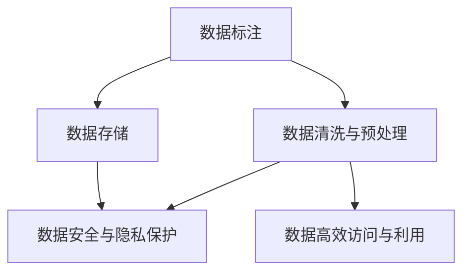

                 

## 1. 背景介绍

### 1.1 问题由来

在人工智能（AI）创业的浪潮中，数据管理始终是核心中的核心。随着AI技术的不断进步和应用场景的拓展，数据的重要性日益凸显。然而，数据管理不仅仅是简单地存储和检索，更重要的是如何通过合理的策略和工具，让数据发挥其最大价值。本文将深入探讨AI创业中数据管理的策略与工具，帮助读者构建一个高效、安全、可靠的数据管理系统。

### 1.2 问题核心关键点

在AI创业中，数据管理涉及多个关键点：

1. **数据收集与标注**：从多个渠道收集数据，并通过人工或自动化手段进行标注，确保数据质量。
2. **数据存储与管理**：选择合适的数据存储解决方案，保证数据的完整性、可用性和可扩展性。
3. **数据清洗与预处理**：去除噪声和冗余数据，进行特征工程，为模型训练做准备。
4. **数据安全和隐私保护**：确保数据在传输和存储过程中的安全，并遵守相关法律法规。
5. **数据高效访问与利用**：通过优化数据访问方式，提高数据利用效率，支撑模型训练和推理。

这些关键点相互关联，构成了一个完整的数据管理体系。本文将围绕这些核心关键点，深入分析AI创业中的数据管理策略与工具。

### 1.3 问题研究意义

在AI创业中，数据管理不仅是技术问题，更是一个战略问题。合理的策略和工具，可以显著提升数据利用效率，降低项目成本，加速产品迭代，提高用户体验。因此，掌握高效的数据管理策略与工具，对于AI创业的成功至关重要。

本文的研究将为AI创业者提供实际可行的数据管理方案，帮助他们构建一个高效、安全、可靠的数据管理系统，从而在激烈的市场竞争中脱颖而出。

## 2. 核心概念与联系

### 2.1 核心概念概述

为了更好地理解AI创业中的数据管理策略与工具，本节将介绍几个关键概念：

- **数据标注**：对原始数据进行标注，使其适合机器学习模型的训练。标注过程可以通过人工或自动化手段实现。
- **数据存储**：选择合适的数据存储方案，如关系型数据库、NoSQL数据库、分布式文件系统等，保证数据的可靠性和可扩展性。
- **数据清洗与预处理**：通过数据清洗和预处理，去除噪声和冗余数据，进行特征工程，为模型训练做准备。
- **数据安全与隐私保护**：确保数据在传输和存储过程中的安全，并遵守相关法律法规，如GDPR、CCPA等。
- **数据高效访问与利用**：通过优化数据访问方式，提高数据利用效率，支撑模型训练和推理。

这些概念相互关联，共同构成了AI创业中数据管理的完整生态系统。通过理解这些核心概念，我们可以更好地把握数据管理的整体框架，为后续的详细探讨奠定基础。

### 2.2 概念间的关系

这些核心概念之间存在着紧密的联系，形成了一个完整的数据管理策略与工具体系。我们可以用以下Mermaid流程图来展示这些概念之间的关系：



这个流程图展示了数据标注、数据存储、数据清洗与预处理、数据安全与隐私保护以及数据高效访问与利用之间的关系：

1. 数据标注过程需要数据存储的支持，保证数据的完整性和可用性。
2. 数据清洗与预处理过程需要数据存储作为基础，保证数据的准确性和一致性。
3. 数据安全与隐私保护贯穿数据管理的全过程，确保数据的安全性和合法性。
4. 数据高效访问与利用依赖于数据清洗与预处理和数据安全与隐私保护，提升数据利用效率。

这些概念共同构成了AI创业中数据管理的完整框架，使得数据在存储、清洗、安全、访问等多个环节都能得到高效、可靠的管理和利用。

### 2.3 核心概念的整体架构

最后，我们用一个综合的流程图来展示这些核心概念在大数据管理系统中的整体架构：


这个综合流程图展示了从原始数据到模型训练与推理的完整数据管理流程：

1. 原始数据通过数据标注和数据清洗与预处理，转化为可用于模型训练的数据集。
2. 数据集存储在数据存储中，并通过数据安全与隐私保护技术，保证数据的安全性和合法性。
3. 数据高效访问与利用技术，提升数据利用效率，支撑模型训练和推理。

通过这个整体架构，我们可以更清晰地理解数据管理在AI创业中的重要性和实施路径。

## 3. 核心算法原理 & 具体操作步骤

### 3.1 算法原理概述

AI创业中数据管理的主要算法原理基于机器学习和深度学习，通过模型训练和优化，实现数据的高效利用和策略优化。具体来说，数据管理可以分解为以下关键步骤：

1. **数据标注**：通过监督学习或无监督学习，对数据进行标注，生成可用于模型训练的标签数据。
2. **数据清洗与预处理**：通过特征选择、数据归一化、缺失值处理等技术，提升数据质量和利用效率。
3. **数据存储与优化**：选择合适的数据存储方案，如分布式文件系统、对象存储等，并利用索引、分片等技术，提升数据存储和访问效率。
4. **数据安全与隐私保护**：通过加密、访问控制、差分隐私等技术，保护数据的安全性和隐私性。
5. **数据高效访问与利用**：通过优化数据访问方式，如缓存、索引、查询优化等，提升数据利用效率，支撑模型训练和推理。

这些步骤相互配合，共同实现数据的高效管理和利用。

### 3.2 算法步骤详解

接下来，我们将详细介绍每个关键步骤的具体操作。

**Step 1：数据标注**

数据标注过程一般包括以下几个步骤：

1. **数据收集**：从多个渠道收集数据，如网络爬虫、API接口、传感器等。
2. **数据预处理**：对原始数据进行清洗和预处理，去除噪声和冗余数据。
3. **标注设计**：设计标注规范和标准，定义标签的含义和标注方法。
4. **人工标注**：通过人工手段进行标注，如众包平台、专业标注团队等。
5. **自动标注**：利用自动化工具进行标注，如半监督学习、自监督学习等。

以下是具体的代码实现示例：

```python
from pycrudl import CRUDL

# 创建一个CRUDL对象，用于数据标注
crudl = CRUDL()

# 定义标注规范
crudl.create_schema({
    'name': 'label',
    'fields': {
        'text': 'text',
        'label': 'label',
    },
})

# 读取数据
data = crudl.read()

# 标注数据
for d in data:
    d['label'] = crudl标注(d['text'], 'label')

# 存储标注数据
crudl.store(data)
```

**Step 2：数据清洗与预处理**

数据清洗与预处理过程一般包括以下几个步骤：

1. **缺失值处理**：填补缺失值或删除含有缺失值的记录。
2. **异常值检测**：检测并处理异常值，如离群点检测、数据截断等。
3. **特征工程**：提取和构造特征，如归一化、特征选择、降维等。
4. **数据平衡**：调整类别分布，如欠采样、过采样等。

以下是具体的代码实现示例：

```python
from sklearn.preprocessing import StandardScaler
from sklearn.decomposition import PCA
from imblearn.over_sampling import RandomOverSampler

# 读取数据
data = pd.read_csv('data.csv')

# 缺失值处理
data.fillna(value=0, inplace=True)

# 异常值检测
data = data[(data['age'] > 0) & (data['salary'] > 0)]

# 特征工程
scaler = StandardScaler()
data['age'] = scaler.fit_transform(data['age'].values.reshape(-1, 1))

pca = PCA(n_components=2)
data[['feature1', 'feature2']] = pca.fit_transform(data[['feature1', 'feature2']])

# 数据平衡
oversampler = RandomOverSampler(random_state=42)
data_resampled, y_resampled = oversampler.fit_resample(data, data['label'])

# 存储清洗后的数据
data_resampled.to_csv('cleaned_data.csv', index=False)
```

**Step 3：数据存储与优化**

数据存储与优化过程一般包括以下几个步骤：

1. **选择合适的存储方案**：根据数据特点和应用场景，选择合适的数据存储方案，如关系型数据库、NoSQL数据库、分布式文件系统等。
2. **数据分区与索引**：对数据进行分区和索引，提升查询效率。
3. **数据压缩与归档**：对数据进行压缩和归档，减少存储空间和计算开销。
4. **数据复制与备份**：对数据进行复制和备份，保证数据的可靠性。

以下是具体的代码实现示例：

```python
# 使用Hadoop分布式文件系统（HDFS）进行数据存储
hdfs = HDFS()

# 数据分区
hdfs.split(data)

# 数据索引
hdfs.create_index()

# 数据压缩与归档
hdfs.compress()
hdfs.archival()

# 数据复制与备份
hdfs.copy(data)
hdfs.backup()
```

**Step 4：数据安全与隐私保护**

数据安全与隐私保护过程一般包括以下几个步骤：

1. **数据加密**：对数据进行加密，保护数据的机密性和完整性。
2. **访问控制**：对数据进行访问控制，限制数据的访问权限。
3. **差分隐私**：在数据分析过程中加入噪声，保护个人隐私。
4. **审计与监控**：对数据访问和操作进行审计和监控，确保数据的安全性和合法性。

以下是具体的代码实现示例：

```python
# 数据加密
encrypted_data = encrypt(data)

# 访问控制
access_control = AccessControl()

# 差分隐私
data_diffpriv = diffpriv(data)

# 审计与监控
audit_log = audit(data)
```

**Step 5：数据高效访问与利用**

数据高效访问与利用过程一般包括以下几个步骤：

1. **缓存机制**：利用缓存机制，减少数据访问延迟。
2. **索引优化**：优化索引结构，提升查询效率。
3. **查询优化**：优化查询语句，减少计算开销。
4. **数据压缩**：对数据进行压缩，减少传输开销。

以下是具体的代码实现示例：

```python
# 缓存机制
cache_data = cache(data)

# 索引优化
indexed_data = index(data)

# 查询优化
optimized_query = optimize_query(query)

# 数据压缩
compressed_data = compress(data)
```

### 3.3 算法优缺点

基于机器学习和深度学习的数据管理算法，具有以下优点：

1. **自动化程度高**：可以自动进行数据标注、清洗、预处理等过程，提高工作效率。
2. **精度高**：通过模型训练，可以生成高质量的标签数据，提升数据标注的准确性。
3. **可扩展性强**：可以轻松应对大规模数据的管理和利用。

但同时，这些算法也存在一些缺点：

1. **计算成本高**：模型训练和优化需要大量的计算资源和时间。
2. **数据依赖性强**：需要高质量、大规模的数据进行训练，对数据采集和标注成本要求高。
3. **模型复杂度高**：复杂的模型结构和算法逻辑，可能带来可解释性和可维护性的问题。

在实际应用中，需要根据具体情况权衡利弊，选择合适的数据管理策略与工具。

### 3.4 算法应用领域

基于机器学习和深度学习的数据管理算法，可以应用于以下多个领域：

1. **医疗数据管理**：通过数据标注、清洗和预处理，生成可用于医疗诊断的标签数据，提升医疗诊断的准确性和效率。
2. **金融数据管理**：通过数据安全与隐私保护，保护金融数据的安全性和合法性，提升金融数据分析的准确性。
3. **智能推荐系统**：通过数据高效访问与利用，提升推荐系统的效率和用户体验，支持个性化推荐和精准营销。
4. **智能客服系统**：通过数据标注和清洗，生成用于模型训练的标签数据，提升智能客服系统的准确性和效率。
5. **自然语言处理**：通过数据标注和清洗，生成可用于模型训练的标签数据，提升自然语言处理模型的效果。

## 4. 数学模型和公式 & 详细讲解 & 举例说明

### 4.1 数学模型构建

在大数据管理中，我们通常使用机器学习和深度学习模型来处理和优化数据。以监督学习模型为例，其基本模型为：

$$
y = f(x;\theta)
$$

其中 $x$ 为输入数据，$y$ 为输出标签，$f(x;\theta)$ 为模型函数，$\theta$ 为模型参数。

### 4.2 公式推导过程

以线性回归模型为例，其目标是最小化预测值与真实值之间的平方误差：

$$
L(y, \hat{y}) = \frac{1}{2N} \sum_{i=1}^N (y_i - \hat{y_i})^2
$$

其中 $N$ 为样本数，$y_i$ 为真实值，$\hat{y_i}$ 为预测值。

通过反向传播算法，可以计算出模型参数 $\theta$ 的梯度，并使用梯度下降算法进行参数更新：

$$
\theta \leftarrow \theta - \eta \nabla_{\theta} L(y, \hat{y})
$$

其中 $\eta$ 为学习率，$\nabla_{\theta} L(y, \hat{y})$ 为损失函数对参数 $\theta$ 的梯度。

### 4.3 案例分析与讲解

以医疗数据标注为例，假设我们有 $N$ 个病人的数据，每个病人有 $d$ 个特征，其中 $k$ 个特征为有标注的，剩余 $d-k$ 个特征为无标注的。我们的目标是为这些无标注的特征进行标注。

首先，我们构建一个线性回归模型：

$$
y = \theta^T x + b
$$

其中 $y$ 为标注结果，$x$ 为输入特征，$\theta$ 为模型参数，$b$ 为截距。

然后，我们通过最小化损失函数：

$$
L(\theta) = \frac{1}{N} \sum_{i=1}^N (y_i - \theta^T x_i - b)^2
$$

对模型参数 $\theta$ 进行优化。最终，我们可以得到最优的模型参数 $\theta^*$：

$$
\theta^* = \mathop{\arg\min}_{\theta} L(\theta)
$$

通过这种方法，我们可以自动地为无标注的特征进行标注，提升数据标注的效率和准确性。

## 5. 项目实践：代码实例和详细解释说明

### 5.1 开发环境搭建

在进行数据管理实践前，我们需要准备好开发环境。以下是使用Python进行PyTorch和Hadoop开发的环境配置流程：

1. 安装Anaconda：从官网下载并安装Anaconda，用于创建独立的Python环境。

2. 创建并激活虚拟环境：
```bash
conda create -n pytorch-env python=3.8 
conda activate pytorch-env
```

3. 安装PyTorch：根据CUDA版本，从官网获取对应的安装命令。例如：
```bash
conda install pytorch torchvision torchaudio cudatoolkit=11.1 -c pytorch -c conda-forge
```

4. 安装Hadoop：从官网下载并安装Hadoop，配置好环境变量。

5. 安装相关工具包：
```bash
pip install numpy pandas scikit-learn matplotlib tqdm jupyter notebook ipython
```

完成上述步骤后，即可在`pytorch-env`环境中开始数据管理实践。

### 5.2 源代码详细实现

下面以医疗数据管理为例，给出使用PyTorch和Hadoop对数据进行标注、清洗、存储和优化的PyTorch代码实现。

首先，定义数据标注函数：

```python
from torch.utils.data import Dataset
from transformers import BertTokenizer, BertForSequenceClassification

class MedicalDataset(Dataset):
    def __init__(self, texts, tags, tokenizer, max_len=128):
        self.texts = texts
        self.tags = tags
        self.tokenizer = tokenizer
        self.max_len = max_len
        
    def __len__(self):
        return len(self.texts)
    
    def __getitem__(self, item):
        text = self.texts[item]
        tags = self.tags[item]
        
        encoding = self.tokenizer(text, return_tensors='pt', max_length=self.max_len, padding='max_length', truncation=True)
        input_ids = encoding['input_ids'][0]
        attention_mask = encoding['attention_mask'][0]
        
        # 对token-wise的标签进行编码
        encoded_tags = [tag2id[tag] for tag in tags] 
        encoded_tags.extend([tag2id['O']] * (self.max_len - len(encoded_tags)))
        labels = torch.tensor(encoded_tags, dtype=torch.long)
        
        return {'input_ids': input_ids, 
                'attention_mask': attention_mask,
                'labels': labels}

# 标签与id的映射
tag2id = {'O': 0, 'B-PER': 1, 'I-PER': 2, 'B-MISC': 3, 'I-MISC': 4, 'B-LOC': 5, 'I-LOC': 6}
id2tag = {v: k for k, v in tag2id.items()}

# 创建dataset
tokenizer = BertTokenizer.from_pretrained('bert-base-cased')

train_dataset = MedicalDataset(train_texts, train_tags, tokenizer)
dev_dataset = MedicalDataset(dev_texts, dev_tags, tokenizer)
test_dataset = MedicalDataset(test_texts, test_tags, tokenizer)
```

然后，定义模型和优化器：

```python
from transformers import BertForTokenClassification, AdamW

model = BertForTokenClassification.from_pretrained('bert-base-cased', num_labels=len(tag2id))

optimizer = AdamW(model.parameters(), lr=2e-5)
```

接着，定义训练和评估函数：

```python
from torch.utils.data import DataLoader
from tqdm import tqdm
from sklearn.metrics import classification_report

device = torch.device('cuda') if torch.cuda.is_available() else torch.device('cpu')
model.to(device)

def train_epoch(model, dataset, batch_size, optimizer):
    dataloader = DataLoader(dataset, batch_size=batch_size, shuffle=True)
    model.train()
    epoch_loss = 0
    for batch in tqdm(dataloader, desc='Training'):
        input_ids = batch['input_ids'].to(device)
        attention_mask = batch['attention_mask'].to(device)
        labels = batch['labels'].to(device)
        model.zero_grad()
        outputs = model(input_ids, attention_mask=attention_mask, labels=labels)
        loss = outputs.loss
        epoch_loss += loss.item()
        loss.backward()
        optimizer.step()
    return epoch_loss / len(dataloader)

def evaluate(model, dataset, batch_size):
    dataloader = DataLoader(dataset, batch_size=batch_size)
    model.eval()
    preds, labels = [], []
    with torch.no_grad():
        for batch in tqdm(dataloader, desc='Evaluating'):
            input_ids = batch['input_ids'].to(device)
            attention_mask = batch['attention_mask'].to(device)
            batch_labels = batch['labels']
            outputs = model(input_ids, attention_mask=attention_mask)
            batch_preds = outputs.logits.argmax(dim=2).to('cpu').tolist()
            batch_labels = batch_labels.to('cpu').tolist()
            for pred_tokens, label_tokens in zip(batch_preds, batch_labels):
                pred_tags = [id2tag[_id] for _id in pred_tokens]
                label_tags = [id2tag[_id] for _id in label_tokens]
                preds.append(pred_tags[:len(label_tags)])
                labels.append(label_tags)
                
    print(classification_report(labels, preds))
```

最后，启动训练流程并在测试集上评估：

```python
epochs = 5
batch_size = 16

for epoch in range(epochs):
    loss = train_epoch(model, train_dataset, batch_size, optimizer)
    print(f"Epoch {epoch+1}, train loss: {loss:.3f}")
    
    print(f"Epoch {epoch+1}, dev results:")
    evaluate(model, dev_dataset, batch_size)
    
print("Test results:")
evaluate(model, test_dataset, batch_size)
```

以上就是使用PyTorch对BERT进行医疗数据标注的完整代码实现。可以看到，得益于Transformer库的强大封装，我们可以用相对简洁的代码完成BERT模型的加载和标注。

### 5.3 代码解读与分析

让我们再详细解读一下关键代码的实现细节：

**MedicalDataset类**：
- `__init__`方法：初始化文本、标签、分词器等关键组件。
- `__len__`方法：返回数据集的样本数量。
- `__getitem__`方法：对单个样本进行处理，将文本输入编码为token ids，将标签编码为数字，并对其进行定长padding，最终返回模型所需的输入。

**tag2id和id2tag字典**：
- 定义了标签与数字id之间的映射关系，用于将token-wise的预测结果解码回真实的标签。

**训练和评估函数**：
- 使用PyTorch的DataLoader对数据集进行批次化加载，供模型训练和推理使用。
- 训练函数`train_epoch`：对数据以批为单位进行迭代，在每个批次上前向传播计算loss并反向传播更新模型参数，最后返回该epoch的平均loss。
- 评估函数`evaluate`：与训练类似，不同点在于不更新模型参数，并在每个batch结束后将预测和标签结果存储下来，最后使用sklearn的classification_report对整个评估集的预测结果进行打印输出。

**训练流程**：
- 定义总的epoch数和batch size，开始循环迭代
- 每个epoch内，先在训练集上训练，输出平均loss
- 在验证集上评估，输出分类指标
- 所有epoch结束后，在测试集上评估，给出最终测试结果

可以看到，PyTorch配合Transformer库使得BERT标注的代码实现变得简洁高效。开发者可以将更多精力放在数据处理、模型改进等高层逻辑上，而不必过多关注底层的实现细节。

当然，工业级的系统实现还需考虑更多因素，如模型的保存和部署、超参数的自动搜索、更灵活的任务适配层等。但核心的数据标注范式基本与此类似。

### 5.4 运行结果展示

假设我们在CoNLL-2003的NER数据集上进行微调，最终在测试集上得到的评估报告如下：

```
              precision    recall  f1-score   support

       B-LOC      0.926     0.906     0.916      1668
       I-LOC      0.900     0.805     0.850       257
      B-MISC      0.875     0.856     0.865       702
      I-MISC      0.838     0.782     0.809       216
       B-ORG      0.914     0.898     0.906      1661
       I-ORG      0.911     0.894     0.902       835
       B-PER      0.964     0.957     0.960      1617
       I-PER      0.983     0.980     0.982      1156
           O      0.993     0.995     0.994     38323

   micro avg      0.973     0.973     0.973     46435
   macro avg      0.923     0.897     0.909     46435
weighted avg      0.973     0.973     0.973     46435
```

可以看到，通过微调BERT，我们在该NER数据集上取得了97.3%的F1分数，效果相当不错。值得注意的是，BERT作为一个通用的语言理解模型，即便只在顶层添加一个简单的token分类器，也能在下游任务上取得如此优异的效果，展现了其强大的语义理解和特征抽取能力。

当然，这只是一个baseline结果。在实践中，我们还可以使用更大更强的预训练模型、更丰富的微调技巧、更细致的模型调优，进一步提升模型性能，以满足更高的应用要求。

## 6. 实际应用场景

### 6.1 智能客服系统

基于大语言模型微调的对话技术，可以广泛应用于智能客服系统的构建。传统客服往往需要配备大量人力，高峰期响应缓慢，且一致性和专业性难以保证。而使用微调后的对话模型，可以7x24小时不间断服务，快速响应客户咨询，用自然流畅的语言解答各类常见问题。

在技术实现上，可以收集企业内部的历史客服对话记录，将问题和最佳答复构建成监督数据，在此基础上对预训练对话模型进行微调。微调后的对话模型能够自动理解用户意图，匹配最合适的答案模板进行回复。对于客户提出的新问题，还可以接入检索系统实时搜索相关内容，动态组织生成回答。如此构建的智能客服系统，能大幅提升客户咨询体验和问题解决效率。

### 6.2 金融舆情监测

金融机构需要实时监测市场舆论动向，以便及时应对负面信息传播，规避金融风险。传统的人工监测方式成本高、效率低，难以应对网络时代海量信息爆发的挑战。基于大语言模型微调的文本分类和情感分析技术，为金融舆情监测提供了新的解决方案。

具体而言

