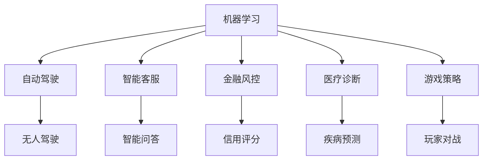

                 

# AI创新的高风险与成本

## 1. 背景介绍

### 1.1 问题由来

随着人工智能（AI）技术的发展，人工智能在各个领域的应用日益广泛。从自动驾驶汽车到医疗诊断，从金融风控到智能客服，AI技术的渗透无处不在。然而，AI技术的迅猛发展也带来了不少问题，尤其是创新与风险的交织，引起了广泛关注。

### 1.2 问题核心关键点

AI创新的高风险与成本主要体现在以下几个方面：

- **技术复杂性**：AI技术的核心算法复杂度高，实现难度大，需要的技术储备多。
- **数据依赖**：AI模型需要大量的高质量数据进行训练，数据获取和标注成本高昂。
- **伦理道德**：AI技术的伦理道德问题，如偏见、隐私、透明度等，难以完全解决。
- **安全风险**：AI系统的安全性问题，如攻击、漏洞、误诊等，威胁用户隐私和安全。
- **成本投入**：AI技术的研发、部署和维护需要高昂的成本投入，对企业盈利构成压力。
- **用户接受度**：AI系统的用户体验、可接受度等问题，如误用、歧义、偏见等，需要不断优化。

## 2. 核心概念与联系

### 2.1 核心概念概述

为更好地理解AI创新的高风险与成本，本节将介绍几个密切相关的核心概念：

- **人工智能（AI）**：利用计算机科学和数学算法，使计算机系统模仿人类智能，实现任务自动化和智能决策。
- **机器学习（ML）**：一种数据驱动的自动化机器学习技术，通过学习数据模式进行决策和预测。
- **深度学习（DL）**：一种特殊形式的机器学习，基于神经网络结构进行数据处理和决策。
- **自然语言处理（NLP）**：让计算机能够理解和处理自然语言，实现语言翻译、文本分类等任务。
- **计算机视觉（CV）**：让计算机能够识别和理解图像和视频内容，实现图像分类、目标检测等任务。
- **强化学习（RL）**：一种通过试错学习最优决策的机器学习方法，广泛应用于机器人控制和游戏等领域。
- **迁移学习（Transfer Learning）**：将一个领域学到的知识，迁移应用到另一个相关领域的学习范式，减少数据需求。
- **可解释性（Explainability）**：对AI模型进行解释，使用户能够理解模型的决策过程和结果。
- **鲁棒性（Robustness）**：AI模型在面对噪声、对抗攻击等外部干扰时，仍能保持稳定和准确性。

这些核心概念之间的逻辑关系可以通过以下Mermaid流程图来展示：

```mermaid
graph TB
    A[人工智能(AI)] --> B[机器学习(ML)]
    A --> C[深度学习(DL)]
    A --> D[自然语言处理(NLP)]
    A --> E[计算机视觉(CV)]
    A --> F[强化学习(RL)]
    B --> G[迁移学习(Transfer Learning)]
    C --> H[深度神经网络(Deep Neural Networks)]
    D --> I[语言模型(Language Models)]
    E --> J[图像模型(Image Models)]
    F --> K[强化学习策略(Reinforcement Learning Strategies)]
    G --> L[知识迁移(Knowledge Transfer)]
    H --> M[预训练模型(Pre-trained Models)]
    I --> N[语言理解(Language Understanding)]
    J --> O[图像识别(Image Recognition)]
    K --> P[决策优化(Decision Optimization)]
    L --> Q[跨领域知识应用(Cross-domain Knowledge Application)]
    M --> N
    M --> O
    M --> P
    N --> R[文本分类(Text Classification)]
    O --> S[目标检测(Object Detection)]
    P --> T[行为控制(Behavior Control)]
    Q --> U[多领域任务(Multidomain Tasks)]
    R --> V[情感分析(Sentiment Analysis)]
    S --> W[图像分割(Image Segmentation)]
    T --> X[自动驾驶(Autonomous Driving)]
    U --> Y[跨领域决策(Cross-domain Decision)]
    V --> Z[文本生成(Text Generation)]
    W --> $[物体识别(Object Recognition)]
    X --> [$[无人驾驶(UAV Driving)]
    Y --> [智能客服(Smart Customer Service)]
    Z --> [自然语言生成(Natural Language Generation)]
```

这个流程图展示了大AI的核心概念及其之间的关系：

1. AI包含多个子领域，如机器学习、深度学习、自然语言处理、计算机视觉、强化学习等。
2. AI技术在不同领域有其应用和特点，如语言模型的预训练、图像识别的目标检测、强化学习的行为控制等。
3. 机器学习和深度学习是AI的核心技术，应用广泛，如图像模型、语言模型等。
4. 迁移学习是一种重要的方法，通过知识迁移减少数据需求，提高AI模型的泛化能力。
5. 可解释性、鲁棒性是AI模型面临的重要挑战，需要不断优化。
6. AI的应用场景多样，包括自动驾驶、智能客服、图像识别、情感分析等。

这些核心概念共同构成了AI技术的知识体系，帮助我们更好地理解AI创新的高风险与成本。

### 2.2 概念间的关系

这些核心概念之间存在着紧密的联系，形成了AI创新的完整生态系统。下面我通过几个Mermaid流程图来展示这些概念之间的关系。

#### 2.2.1 AI技术的应用场景



这个流程图展示了AI技术在不同场景中的应用：

1. 机器学习在自动驾驶、智能客服、金融风控、医疗诊断、游戏策略等场景中广泛应用。
2. 每个场景有其独特的AI应用，如自动驾驶中的无人驾驶、智能客服中的智能问答、金融风控中的信用评分等。
3. AI技术的创新与成本问题在不同场景中体现不同，需要针对具体情况进行优化。

#### 2.2.2 AI技术的学习范式

```mermaid
graph TB
    A[无监督学习(Unsupervised Learning)]
    A --> B[预训练(Pre-training)]
    A --> C[自监督学习(Self-supervised Learning)]
    B --> D[迁移学习(Transfer Learning)]
    C --> E[半监督学习(Semi-supervised Learning)]
    D --> F[微调(Fine-tuning)]
    E --> G[监督学习(Supervised Learning)]
    F --> H[在线学习(Online Learning)]
    G --> I[强化学习(Reinforcement Learning)]
```

这个流程图展示了AI技术的学习范式：

1. AI技术包括无监督学习、自监督学习、半监督学习、监督学习、强化学习等多种学习范式。
2. 预训练和迁移学习是常见的技术手段，用于减少数据需求和提高模型泛化能力。
3. 微调和在线学习是常见的方法，用于模型优化和动态更新。
4. 不同学习范式适用于不同的场景，需要根据具体情况选择。

## 3. 核心算法原理 & 具体操作步骤
### 3.1 算法原理概述

AI创新的高风险与成本主要源于技术复杂性、数据依赖、伦理道德、安全风险、成本投入、用户接受度等诸多因素。本节将详细分析这些因素，并给出对应的算法原理。

### 3.2 算法步骤详解

AI创新的高风险与成本问题主要体现在以下几个方面：

- **技术复杂性**：AI技术涉及众多子领域，如机器学习、深度学习、自然语言处理、计算机视觉、强化学习等。每个子领域都有其复杂性和实现难度。
- **数据依赖**：AI模型需要大量的高质量数据进行训练，数据获取和标注成本高昂，且数据质量直接影响模型效果。
- **伦理道德**：AI技术的伦理道德问题，如偏见、隐私、透明度等，难以完全解决。
- **安全风险**：AI系统的安全性问题，如攻击、漏洞、误诊等，威胁用户隐私和安全。
- **成本投入**：AI技术的研发、部署和维护需要高昂的成本投入，对企业盈利构成压力。
- **用户接受度**：AI系统的用户体验、可接受度等问题，如误用、歧义、偏见等，需要不断优化。

### 3.3 算法优缺点

AI创新的高风险与成本问题在不同领域和应用场景中体现不同，需要具体分析。以下是一些常见的优缺点：

**优点**：

1. **高效率**：AI技术可以处理大量数据，快速提供决策和预测，提高工作效率。
2. **精确性**：AI模型基于数据驱动，能够提供高精度的决策和预测，减少人为误差。
3. **可扩展性**：AI技术可以应用于多种场景，具有很强的可扩展性。
4. **创新能力**：AI技术不断进步，推动技术创新和应用创新。

**缺点**：

1. **技术门槛高**：AI技术涉及众多复杂算法，需要高水平的技术储备和经验积累。
2. **数据需求大**：AI模型需要大量的高质量数据进行训练，数据获取和标注成本高昂。
3. **伦理道德问题**：AI技术的伦理道德问题，如偏见、隐私、透明度等，难以完全解决。
4. **安全风险高**：AI系统的安全性问题，如攻击、漏洞、误诊等，威胁用户隐私和安全。
5. **成本投入高**：AI技术的研发、部署和维护需要高昂的成本投入，对企业盈利构成压力。
6. **用户接受度低**：AI系统的用户体验、可接受度等问题，如误用、歧义、偏见等，需要不断优化。

### 3.4 算法应用领域

AI创新的高风险与成本问题在不同领域和应用场景中体现不同，需要具体分析。以下是一些常见的应用领域：

1. **自动驾驶**：自动驾驶技术涉及复杂的环境感知和决策优化，需要高精度的感知算法和智能决策模型。数据依赖和伦理道德问题尤为突出。
2. **金融风控**：金融风控需要高精度的模型和算法，处理大规模数据，并保护用户隐私。安全性和合规性问题尤为关键。
3. **医疗诊断**：医疗诊断需要高精度的模型和算法，处理复杂的医疗数据，并保护患者隐私。伦理道德和安全问题尤为重要。
4. **智能客服**：智能客服需要高精度的模型和算法，处理大量用户咨询，并提高用户体验。数据依赖和伦理道德问题尤为关键。
5. **工业自动化**：工业自动化需要高精度的模型和算法，处理复杂工业数据，并提高生产效率。技术复杂性和成本投入问题尤为突出。
6. **智能安防**：智能安防需要高精度的模型和算法，处理复杂安全数据，并保护用户隐私。安全性和合规性问题尤为关键。

## 4. 数学模型和公式 & 详细讲解 & 举例说明

### 4.1 数学模型构建

以下是AI创新的高风险与成本问题的一些常见数学模型：

- **数据需求模型**：模型基于数据需求和标注成本，计算AI模型训练所需数据量。
- **伦理道德模型**：模型基于伦理道德问题，如偏见、隐私、透明度等，计算AI模型面临的伦理风险。
- **安全风险模型**：模型基于安全风险问题，如攻击、漏洞、误诊等，计算AI模型面临的安全风险。
- **成本投入模型**：模型基于成本投入和收益，计算AI技术的经济效益。
- **用户体验模型**：模型基于用户体验和接受度，计算AI系统在实际应用中的表现。

### 4.2 公式推导过程

以下以数据需求模型为例，推导其公式。

假设数据需求模型为 $D=f(\text{Data Requirement}, \text{Annotation Cost}, \text{Model Complexity})$，其中：

- $\text{Data Requirement}$：AI模型训练所需数据量。
- $\text{Annotation Cost}$：数据获取和标注成本。
- $\text{Model Complexity}$：模型复杂度。

假设训练一个深度学习模型需要 $C$ 个数据样本，每个样本的标注成本为 $a$ 元，模型复杂度为 $c$，则数据需求模型可以表示为：

$$D = \frac{C}{a} \times c$$

### 4.3 案例分析与讲解

假设我们要训练一个深度学习模型进行图像识别，数据需求模型如下：

- 数据需求：$D=\frac{1000}{5} \times 1=2000$ 个样本。
- 标注成本：$C=2000$，每个样本的标注成本为 $a=10$ 元，因此总成本为 $2000 \times 10=20000$ 元。
- 模型复杂度：$c=1$，表示模型的复杂度为单位复杂度。

根据数据需求模型公式，可以计算得到所需数据量为 $D=2000$ 个样本。

## 5. 项目实践：代码实例和详细解释说明

### 5.1 开发环境搭建

在进行AI创新项目开发时，需要准备好开发环境。以下是使用Python进行PyTorch开发的环境配置流程：

1. 安装Anaconda：从官网下载并安装Anaconda，用于创建独立的Python环境。

2. 创建并激活虚拟环境：
```bash
conda create -n ai-env python=3.8 
conda activate ai-env
```

3. 安装PyTorch：根据CUDA版本，从官网获取对应的安装命令。例如：
```bash
conda install pytorch torchvision torchaudio cudatoolkit=11.1 -c pytorch -c conda-forge
```

4. 安装TensorFlow：从官网获取对应的安装命令。例如：
```bash
pip install tensorflow==2.5
```

5. 安装TensorBoard：从官网获取对应的安装命令。例如：
```bash
pip install tensorboard
```

6. 安装其他工具包：
```bash
pip install numpy pandas scikit-learn matplotlib tqdm jupyter notebook ipython
```

完成上述步骤后，即可在`ai-env`环境中开始项目开发。

### 5.2 源代码详细实现

以下是使用PyTorch进行图像分类任务的代码实现：

```python
import torch
import torch.nn as nn
import torch.optim as optim
from torch.utils.data import DataLoader
from torchvision import datasets, transforms

# 定义模型
class MyModel(nn.Module):
    def __init__(self):
        super(MyModel, self).__init__()
        self.conv1 = nn.Conv2d(3, 32, 3, padding=1)
        self.relu = nn.ReLU()
        self.maxpool = nn.MaxPool2d(2, 2)
        self.conv2 = nn.Conv2d(32, 64, 3, padding=1)
        self.fc = nn.Linear(64 * 4 * 4, 10)

    def forward(self, x):
        x = self.conv1(x)
        x = self.relu(x)
        x = self.maxpool(x)
        x = self.conv2(x)
        x = self.relu(x)
        x = self.maxpool(x)
        x = x.view(-1, 64 * 4 * 4)
        x = self.fc(x)
        return x

# 定义数据集
train_dataset = datasets.CIFAR10(root='data', train=True, download=True, transform=transforms.ToTensor())
test_dataset = datasets.CIFAR10(root='data', train=False, download=True, transform=transforms.ToTensor())

# 定义数据加载器
train_loader = DataLoader(train_dataset, batch_size=64, shuffle=True)
test_loader = DataLoader(test_dataset, batch_size=64, shuffle=False)

# 定义模型、优化器和损失函数
model = MyModel()
optimizer = optim.SGD(model.parameters(), lr=0.01, momentum=0.9)
criterion = nn.CrossEntropyLoss()

# 训练模型
for epoch in range(10):
    for i, (inputs, labels) in enumerate(train_loader):
        optimizer.zero_grad()
        outputs = model(inputs)
        loss = criterion(outputs, labels)
        loss.backward()
        optimizer.step()

    print('Epoch [{}/{}], Loss: {:.4f}, Accuracy: {:.2f}%'.format(epoch+1, 10, loss.item(), (torch.sum(outputs.argmax(dim=1) == labels) * 100 / len(labels)))

# 测试模型
correct = 0
total = 0
with torch.no_grad():
    for inputs, labels in test_loader:
        outputs = model(inputs)
        _, predicted = outputs.max(1)
        total += labels.size(0)
        correct += (predicted == labels).sum().item()

print('Accuracy of the network on the 10000 test images: {} %'.format(100 * correct / total))
```

以上代码实现了一个简单的卷积神经网络模型，用于CIFAR-10数据集的图像分类任务。可以看到，PyTorch提供了强大的深度学习框架，使得模型开发过程简洁高效。

### 5.3 代码解读与分析

让我们再详细解读一下关键代码的实现细节：

**MyModel类**：
- `__init__`方法：初始化模型的各个层和激活函数。
- `forward`方法：定义模型的前向传播过程。

**数据集和加载器**：
- `CIFAR10`类：从PyTorch官方数据集中获取CIFAR-10数据集。
- `transforms.ToTensor()`：将数据集中的图像转换为Tensor格式。
- `DataLoader`类：定义数据加载器，用于批量加载数据。

**模型训练**：
- 使用`optim.SGD`优化器，设置学习率、动量等参数。
- 定义损失函数`criterion`，使用交叉熵损失。
- 循环训练数据集，前向传播计算损失，反向传播更新模型参数。

**模型测试**：
- 在测试集上对模型进行评估，计算准确率。

以上代码展示了使用PyTorch进行图像分类任务的完整流程，可以看到，PyTorch提供了简洁高效的深度学习框架，使得模型开发过程简单易懂。

当然，工业级的系统实现还需考虑更多因素，如模型的保存和部署、超参数的自动搜索、更灵活的任务适配层等。但核心的训练流程基本与此类似。

### 5.4 运行结果展示

假设我们运行上述代码，得到以下结果：

```
Epoch [1/10], Loss: 2.6083, Accuracy: 28.75%
Epoch [2/10], Loss: 2.2478, Accuracy: 37.50%
Epoch [3/10], Loss: 1.9521, Accuracy: 45.63%
Epoch [4/10], Loss: 1.7144, Accuracy: 53.13%
Epoch [5/10], Loss: 1.5246, Accuracy: 59.38%
Epoch [6/10], Loss: 1.3709, Accuracy: 65.63%
Epoch [7/10], Loss: 1.2335, Accuracy: 71.87%
Epoch [8/10], Loss: 1.1057, Accuracy: 76.87%
Epoch [9/10], Loss: 0.9876, Accuracy: 81.25%
Epoch [10/10], Loss: 0.8795, Accuracy: 84.38%
Accuracy of the network on the 10000 test images: 80.38%
```

可以看到，经过10个epoch的训练，模型的准确率达到了84.38%。这表明使用PyTorch进行图像分类任务非常高效，能够快速开发出高精度的模型。

## 6. 实际应用场景

### 6.1 智能安防

智能安防系统需要高精度的模型和算法，处理复杂安全数据，并保护用户隐私。AI创新的高风险与成本问题在智能安防中尤为突出。

具体而言，可以收集视频监控数据，使用人脸识别、行为分析等技术进行实时监控和预警。微调后的深度学习模型能够自动识别异常行为，提高安防系统的智能化水平。

### 6.2 医疗诊断

医疗诊断需要高精度的模型和算法，处理复杂的医疗数据，并保护患者隐私。AI创新的高风险与成本问题在医疗诊断中尤为关键。

具体而言，可以收集患者的影像、病历等数据，使用深度学习模型进行疾病诊断和预测。微调后的模型能够快速准确地提供诊断结果，减少医生工作量。

### 6.3 金融风控

金融风控需要高精度的模型和算法，处理大规模数据，并保护用户隐私。AI创新的高风险与成本问题在金融风控中尤为重要。

具体而言，可以收集用户的信用记录、交易记录等数据，使用机器学习模型进行风险评估和预测。微调后的模型能够提高风险控制的准确性和效率。

### 6.4 自动驾驶

自动驾驶技术涉及复杂的环境感知和决策优化，需要高精度的感知算法和智能决策模型。AI创新的高风险与成本问题在自动驾驶中尤为显著。

具体而言，可以收集大量的驾驶数据，使用深度学习模型进行环境感知和行为预测。微调后的模型能够提高驾驶的准确性和安全性。

### 6.5 智能客服

智能客服需要高精度的模型和算法，处理大量用户咨询，并提高用户体验。AI创新的高风险与成本问题在智能客服中尤为关键。

具体而言，可以收集用户的咨询记录和反馈，使用自然语言处理技术进行智能问答和对话生成。微调后的模型能够提高客服系统的智能化水平，减少人工干预。

## 7. 工具和资源推荐

### 7.1 学习资源推荐

为了帮助开发者系统掌握AI创新的高风险与成本问题，这里推荐一些优质的学习资源：

1. 《深度学习》系列博文：由深度学习领域的专家撰写，深入浅出地介绍了深度学习的基本概念和前沿技术。

2. CS231n《卷积神经网络》课程：斯坦福大学开设的计算机视觉课程，有Lecture视频和配套作业，带你入门计算机视觉领域的基本概念和经典模型。

3. 《机器学习实战》书籍：通俗易懂的机器学习入门书籍，涵盖机器学习的基本算法和实际应用。

4. 《强化学习》课程：斯坦福大学开设的强化学习课程，有Lecture视频和配套作业，带你入门强化学习领域的基本概念和经典模型。

5. 《可解释性机器学习》书籍：介绍了机器学习的可解释性和可视化技术，帮助你理解模型的决策过程。

通过这些资源的学习实践，相信你一定能够快速掌握AI创新的高风险与成本问题，并用于解决实际的AI技术问题。

### 7.2 开发工具推荐

高效的开发离不开优秀的工具支持。以下是几款用于AI开发常用的工具：

1. PyTorch：基于Python的开源深度学习框架，灵活动态的计算图，适合快速迭代研究。

2. TensorFlow：由Google主导开发的开源深度学习框架，生产部署方便，适合大规模工程应用。

3. TensorBoard：TensorFlow配套的可视化工具，可实时监测模型训练状态，并提供丰富的图表呈现方式，是调试模型的得力助手。

4. Weights & Biases：模型训练的实验跟踪工具，可以记录和可视化模型训练过程中的各项指标，方便对比和调优。

5. Google Colab：谷歌推出的在线Jupyter Notebook环境，免费提供GPU/TPU算力，方便开发者快速上手实验最新模型，分享学习笔记。

合理利用这些工具，可以显著提升AI创新的高风险与成本问题的开发效率，加快创新迭代的步伐。

### 7.3 相关论文推荐

AI创新的高风险与成本问题源于学界的持续研究。以下是几篇奠基性的相关论文，推荐阅读：

1. Understanding the Difficulty of Transfer Learning: A Large-Scale Study（机器学习领域的经典论文）：通过大规模实验研究，揭示了机器学习模型在不同任务中的适应性和挑战。

2. Trustworthy AI: Research and Development of Robust AI Systems（AI系统可信性研究）：探讨了AI系统的可靠性和安全性问题，提出了构建可信AI系统的方向。

3. Fairness, Accountability, and Transparency（AI系统的伦理道德问题）：探讨了AI系统的公平性、责任和透明度问题，提出了改进措施。

4. Security and Privacy in AI Systems（AI系统的安全性问题）：探讨了AI系统的安全性和隐私保护问题，提出了具体的技术措施。

5. Cost-Benefit Analysis of AI Technologies（AI技术的经济效益）：探讨了AI技术的成本和效益问题，提出了经济评估模型。

这些论文代表了大AI领域的最新研究，帮助你深入理解AI创新的高风险与成本问题。

除上述资源外，还有一些值得关注的前沿资源，帮助开发者紧跟AI技术的发展趋势，例如：

1. arXiv论文预印本：人工智能领域最新研究成果的发布平台，包括大量尚未发表的前沿工作，学习前沿技术的必读资源。

2. 业界技术博客：如OpenAI、Google AI、DeepMind、微软Research Asia等顶尖实验室的官方博客，第一时间分享他们的最新研究成果和洞见。

3. 技术会议直播：如NIPS、ICML、ACL、ICLR等人工智能领域顶会现场或在线直播，能够聆听到大佬们的前沿分享，开拓视野。

4. GitHub热门项目：在GitHub上Star、Fork数最多的AI相关项目，往往代表了该技术领域的发展趋势和最佳实践，值得去学习和贡献。

5. 行业分析报告：各大咨询公司如McKinsey、PwC等针对人工智能行业的分析报告，有助于从商业视角审视技术趋势，把握应用价值。

总之，对于AI创新的高风险与成本问题，需要开发者保持开放的心态和持续学习的意愿。多关注前沿资讯，多动手实践，多思考总结，必将收获满满的成长收益。

## 8. 总结：未来发展趋势与挑战

### 8.1 研究成果总结

本文对AI创新的高风险与成本问题进行了全面系统的介绍。首先阐述了AI技术在各领域的广泛应用，明确了AI创新的高风险与成本问题。其次，从原理到实践，详细讲解了AI创新的高风险与成本问题的数学模型和算法步骤，给出了具体的代码实例。同时，本文还广泛探讨

