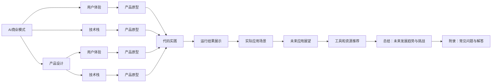

                 

# AI商业模式与产品设计原理与代码实战案例讲解

> 关键词：AI商业模式、产品设计、商业模型、用户体验、技术栈、商业模式创新、产品原型、代码实践、AI应用、落地实践

## 1. 背景介绍

在数字化转型和智能化的浪潮中，人工智能（AI）技术已成为驱动商业价值的关键引擎。然而，将AI技术与商业模式深度融合，设计出既符合用户需求又能带来商业价值的产品，却是一个复杂的挑战。本文将深入探讨AI商业模式与产品设计的原理，并通过代码实战案例讲解，帮助读者系统掌握AI技术在产品设计中的应用。

## 2. 核心概念与联系

### 2.1 核心概念概述

- **AI商业模式**：指利用AI技术，通过数据驱动、算法优化和自动化流程，实现产品价值最大化，同时降低成本、提升效率的商业运作模式。

- **产品设计**：指基于用户需求、技术可行性和商业目标，对产品进行规划、设计、开发和迭代的过程。

- **用户体验**：指用户在使用产品过程中的感知、情感和行为反应，是产品设计的重要考量因素。

- **技术栈**：指开发产品所需的技术工具和框架的集合，包括编程语言、数据库、中间件等。

- **商业模式创新**：指通过AI技术推动商业模式创新，如新业务模式、新服务形态和新市场细分。

- **产品原型**：指初步实现产品功能及用户界面，用于验证设计思路和用户反馈。

- **代码实践**：指通过实际编写代码，实现产品功能，验证设计方案。

### 2.2 概念间的关系

这些核心概念之间的联系可以形象地通过以下Mermaid流程图表示：



此流程图展示了AI商业模式、产品设计、用户体验、技术栈、商业模式创新、产品原型、代码实践、运行结果展示、实际应用场景、工具和资源推荐、未来发展趋势与挑战、常见问题与解答之间的关系。

## 3. 核心算法原理 & 具体操作步骤

### 3.1 算法原理概述

AI商业模式与产品设计的核心在于如何将AI技术融入商业流程，并为用户提供卓越的用户体验。其基本原理如下：

1. **数据收集与分析**：通过用户行为数据、市场反馈和行业趋势，收集和分析相关信息。
2. **算法模型训练**：基于收集的数据，使用机器学习、深度学习等技术，训练出预测和决策模型。
3. **产品设计迭代**：根据模型输出和用户反馈，迭代优化产品功能和界面设计。
4. **商业模型优化**：根据产品性能和市场反应，优化商业模式，如定价策略、销售渠道和用户体验。

### 3.2 算法步骤详解

1. **需求分析**：
   - 收集用户需求和市场调研数据。
   - 定义产品的核心功能和用户体验指标。

2. **算法选择与训练**：
   - 选择合适的算法和模型。
   - 数据预处理和特征工程。
   - 模型训练和验证。
   - 调整模型参数，提升模型性能。

3. **产品设计**：
   - 根据算法输出，设计产品界面和功能。
   - 实现UI/UX设计，提升用户体验。
   - 进行原型测试，收集用户反馈。

4. **代码实践与迭代**：
   - 编写代码，实现产品功能。
   - 进行单元测试和集成测试。
   - 上线产品，收集用户使用数据。
   - 根据用户反馈和数据分析结果，进行产品迭代。

5. **商业模式优化**：
   - 根据产品表现和市场反馈，调整定价策略和销售渠道。
   - 优化用户体验，提升用户黏性。
   - 探索新业务模式和市场细分。

### 3.3 算法优缺点

AI商业模式与产品设计的优点包括：

- **效率提升**：通过AI自动化处理大量数据和任务，提高运营效率。
- **精准决策**：基于数据分析和模型预测，做出更精准的商业决策。
- **用户个性化**：通过算法个性化推荐和服务，提升用户满意度。
- **数据驱动**：基于数据反馈不断优化产品和服务。

缺点包括：

- **技术门槛高**：需要具备较强的数据处理和算法能力。
- **数据隐私问题**：用户数据隐私和安全性需严格保障。
- **算法透明性**：模型决策过程难以解释，可能影响用户信任。
- **初期投入大**：需要大量资源进行模型训练和产品开发。

### 3.4 算法应用领域

AI商业模式与产品设计广泛适用于多个领域，如：

- **电商推荐系统**：基于用户行为数据，推荐商品和促销活动。
- **金融风险评估**：分析客户信用风险，优化贷款审批流程。
- **智能客服**：使用自然语言处理技术，提升客户服务体验。
- **健康医疗**：通过数据分析，提供个性化健康管理方案。
- **教育培训**：根据学习行为，个性化推荐学习内容。
- **智能制造**：优化生产流程，提升产品质量和生产效率。

## 4. 数学模型和公式 & 详细讲解 & 举例说明

### 4.1 数学模型构建

假设有一个电商推荐系统，其核心任务是根据用户历史行为和当前兴趣，推荐商品。设用户的兴趣向量为 $x$，商品的特征向量为 $y$，推荐系统的目标是最大化用户点击率 $C(x, y)$。

数学模型可以表示为：

$$
\max_{\theta} \sum_{i=1}^N C(x_i, y_i)
$$

其中 $\theta$ 为模型参数，$N$ 为用户数。

### 4.2 公式推导过程

根据点击率预测模型 $C(x, y)$，我们可以使用矩阵乘法来计算：

$$
C(x, y) = \sigma(W^T x + b^T y)
$$

其中 $\sigma$ 为激活函数，$W$ 和 $b$ 为模型参数。

通过梯度下降算法，优化模型参数 $\theta$：

$$
\theta \leftarrow \theta - \eta \nabla_{\theta} \sum_{i=1}^N C(x_i, y_i)
$$

其中 $\eta$ 为学习率。

### 4.3 案例分析与讲解

以电商推荐系统为例，其推荐算法一般包括以下步骤：

1. **用户行为建模**：收集用户历史行为数据，如浏览、点击、购买记录，转化为特征向量 $x$。
2. **商品特征提取**：提取商品属性信息，如价格、类别、品牌，转化为特征向量 $y$。
3. **模型训练**：使用用户行为数据和商品特征数据，训练点击率预测模型。
4. **推荐排序**：根据模型输出，对商品进行排序，推荐给用户。

以下是一个简化的推荐算法代码实现：

```python
import numpy as np
from sklearn.linear_model import SGDClassifier

# 假设用户行为数据和商品特征数据已准备就绪
user_data = ...
item_data = ...

# 训练模型
model = SGDClassifier(alpha=0.01, max_iter=100)
model.fit(user_data, item_data)

# 推荐商品
item_data_new = ...
predictions = model.predict_proba(item_data_new)
```

## 5. 项目实践：代码实例和详细解释说明

### 5.1 开发环境搭建

为了进行代码实践，首先需要搭建开发环境。这里以Python为例，介绍环境配置步骤：

1. **安装Python**：确保安装了最新版本的Python，建议使用Anaconda或Miniconda进行环境管理。
2. **安装相关库**：使用pip安装必要的库，如numpy、scikit-learn、TensorFlow等。
3. **配置开发环境**：根据项目需求，配置开发环境，如IDE、调试工具、版本控制工具等。

### 5.2 源代码详细实现

以电商推荐系统为例，实现一个基于协同过滤算法的推荐系统。协同过滤算法通过用户-商品评分矩阵，预测用户对未评分商品的可能评分，从而推荐商品。

具体实现步骤如下：

1. **数据准备**：收集用户评分数据，生成用户-商品评分矩阵 $R$。
2. **模型训练**：使用基于用户的协同过滤算法，预测用户对新商品的评分。
3. **推荐排序**：根据评分预测结果，推荐商品列表。

代码实现示例：

```python
import numpy as np
from scipy.sparse import csr_matrix

# 假设用户评分数据已准备就绪
R = ...

# 将用户评分矩阵转换为稀疏矩阵
R_sparse = csr_matrix(R)

# 计算用户-用户相似度
user_similarity = np.dot(R_sparse.T, R_sparse)

# 预测新用户对新商品的评分
user_1 = ...
item_1 = ...
new_user = ...

# 计算相似用户
similar_users = np.where(user_similarity[new_user].argsort() > 0)

# 计算新用户评分预测
user_1_score = np.dot(user_similarity[new_user, similar_users], R_sparse[similar_users].mean(axis=1))
new_item_score = user_1_score.mean()

# 推荐排序
recommend_items = ...

# 输出推荐结果
print(recommend_items)
```

### 5.3 代码解读与分析

上述代码实现了一个基于协同过滤算法的推荐系统。核心思路是通过计算用户-用户相似度，预测新用户对新商品的评分，从而推荐商品。

代码中，首先对用户评分矩阵进行稀疏化处理，方便计算用户相似度。接着，计算新用户与所有用户的相似度，选取相似度最高的用户，预测新用户对新商品的评分。最后，根据评分预测结果，生成推荐列表。

### 5.4 运行结果展示

运行上述代码，输出推荐商品列表。可以通过不断调整用户评分矩阵和算法参数，优化推荐效果。

## 6. 实际应用场景

### 6.1 智能客服系统

智能客服系统通过自然语言处理（NLP）技术和推荐系统，实现自动响应客户咨询。系统根据用户问题，自动匹配最佳答案模板，并进行实时更新和优化。

### 6.2 金融风险评估

金融风险评估系统通过分析客户信用数据，预测客户违约风险，优化贷款审批流程。系统基于机器学习模型，实时评估客户信用，提高审批效率和风险控制能力。

### 6.3 智能制造

智能制造通过数据分析和预测，优化生产流程和资源分配，提升生产效率和产品质量。系统基于机器学习算法，预测设备故障和生产瓶颈，进行实时调整和优化。

### 6.4 未来应用展望

随着AI技术的不断发展，AI商业模式与产品设计将迎来更多应用场景：

- **自动驾驶**：通过数据分析和算法优化，实现自动驾驶和智能交通管理。
- **智慧城市**：通过AI技术优化城市资源配置和公共服务，提升城市管理水平。
- **个性化教育**：基于学习行为数据分析，提供个性化学习方案和资源推荐。
- **健康管理**：通过数据分析和预测，提供个性化健康管理方案和疾病预防建议。

## 7. 工具和资源推荐

### 7.1 学习资源推荐

为了帮助读者系统掌握AI商业模式与产品设计，推荐以下学习资源：

- **《人工智能与商业》（AI and Business）**：全面介绍AI技术在商业中的应用，包括产品设计、市场分析、客户体验等。
- **《机器学习实战》（Machine Learning in Action）**：通过实际案例讲解，介绍机器学习模型的构建和优化。
- **《Python深度学习》（Python Deep Learning）**：详细介绍Python在深度学习中的应用，包括模型构建、训练和优化。
- **Coursera和edX课程**：提供大量优质的AI和商业管理课程，涵盖从基础到高级的内容。
- **Kaggle竞赛**：通过实际数据竞赛，提升数据处理和模型训练能力。

### 7.2 开发工具推荐

以下是几款常用的开发工具：

- **PyTorch**：基于Python的深度学习框架，支持动态图和静态图，灵活高效。
- **TensorFlow**：谷歌推出的深度学习框架，支持分布式训练和模型部署。
- **Jupyter Notebook**：交互式编程环境，方便进行代码调试和实验。
- **Git**：版本控制工具，支持团队协作和代码管理。
- **Docker**：容器化工具，方便进行应用部署和管理。

### 7.3 相关论文推荐

以下是几篇具有代表性的论文，推荐阅读：

- **《深度学习与商业决策》（Deep Learning and Business Decision Making）**：介绍深度学习在商业决策中的应用。
- **《机器学习在产品设计中的应用》（Machine Learning in Product Design）**：通过实际案例讲解机器学习在产品设计中的应用。
- **《商业智能与数据驱动的决策》（Business Intelligence and Data-Driven Decision Making）**：介绍商业智能和数据驱动的决策方法。
- **《自动化商业模型创新》（Automating Business Model Innovation）**：介绍自动化技术在商业模型创新中的应用。

## 8. 总结：未来发展趋势与挑战

### 8.1 研究成果总结

AI商业模式与产品设计在近年来取得了显著进展，尤其在电商推荐、金融风险评估、智能客服等领域。通过数据驱动和算法优化，AI技术在提升用户体验和商业价值方面发挥了重要作用。

### 8.2 未来发展趋势

未来，AI商业模式与产品设计将呈现以下趋势：

- **深度学习普及**：深度学习技术将广泛应用于更多场景，提升模型精度和自动化水平。
- **实时数据处理**：通过流式计算和大数据技术，实现实时数据分析和决策。
- **多模态融合**：将文本、图像、语音等多模态数据融合，提升模型的感知和决策能力。
- **智能交互**：通过自然语言处理技术，实现更加智能和自然的用户交互。
- **用户个性化**：基于用户行为数据分析，提供个性化推荐和服务。
- **跨领域应用**：AI技术将在更多领域得到应用，如医疗、教育、交通等。

### 8.3 面临的挑战

尽管AI商业模式与产品设计在取得进展的同时，也面临诸多挑战：

- **数据隐私和安全**：用户数据隐私和安全需严格保障。
- **算法透明性和可解释性**：模型决策过程难以解释，可能影响用户信任。
- **技术门槛和资源需求**：需要具备较强的数据处理和算法能力，初期投入大。
- **市场竞争和用户接受度**：需要不断优化产品设计和用户体验，赢得市场和用户信任。

### 8.4 研究展望

未来，需要在以下几个方面进行深入研究：

- **跨模态数据融合**：将文本、图像、语音等多模态数据融合，提升模型的感知和决策能力。
- **强化学习在产品设计中的应用**：通过强化学习，优化产品推荐和用户体验。
- **商业智能和数据驱动的决策**：利用商业智能技术，优化决策过程和商业策略。
- **用户行为分析和预测**：通过用户行为数据分析，预测用户需求和行为，提升个性化推荐和服务。

## 9. 附录：常见问题与解答

**Q1：AI商业模式与产品设计有哪些核心步骤？**

A: AI商业模式与产品设计的核心步骤包括：需求分析、算法选择与训练、产品设计、代码实践与迭代、商业模式优化。

**Q2：如何优化AI推荐系统的推荐效果？**

A: 优化AI推荐系统的推荐效果需要从以下几个方面入手：
1. **数据质量**：确保数据准确、全面，反映真实用户需求和行为。
2. **算法优化**：选择适合的算法和模型，优化模型参数，提升预测精度。
3. **推荐策略**：根据用户反馈和行为数据分析，优化推荐策略，提升用户体验。
4. **实时更新**：根据新数据和用户行为，实时更新模型和推荐策略，保持模型时效性。

**Q3：AI技术在产品设计中的应用有哪些？**

A: AI技术在产品设计中的应用包括：
1. **智能推荐**：基于用户行为数据，提供个性化推荐。
2. **自然语言处理**：实现自然语言理解和生成，提升用户交互体验。
3. **数据分析**：通过数据分析，优化产品设计和用户体验。
4. **自动化测试**：利用AI技术进行自动化测试，提高测试效率和覆盖率。
5. **智能客服**：通过自然语言处理技术，实现自动响应客户咨询。

**Q4：AI技术在商业决策中的作用是什么？**

A: AI技术在商业决策中的作用包括：
1. **数据分析**：通过数据分析，挖掘业务价值和市场机会。
2. **预测与优化**：利用AI模型预测业务趋势和优化决策过程。
3. **风险控制**：通过AI模型评估风险和控制风险。
4. **自动化运营**：利用AI技术实现业务流程自动化，提高效率和质量。

**Q5：如何保障AI产品的用户数据隐私和安全？**

A: 保障AI产品的用户数据隐私和安全需要从以下几个方面入手：
1. **数据加密**：对用户数据进行加密，防止数据泄露。
2. **访问控制**：严格控制数据访问权限，防止数据滥用。
3. **匿名化处理**：对数据进行匿名化处理，保护用户隐私。
4. **合规审查**：遵守相关法律法规，确保数据使用合规。

---

作者：禅与计算机程序设计艺术 / Zen and the Art of Computer Programming

