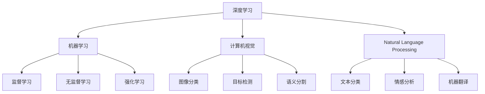
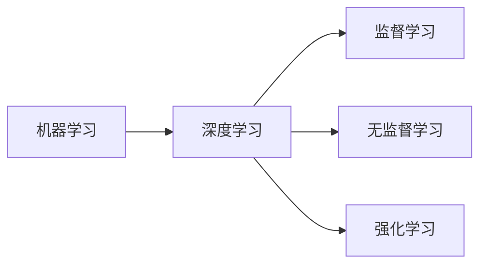
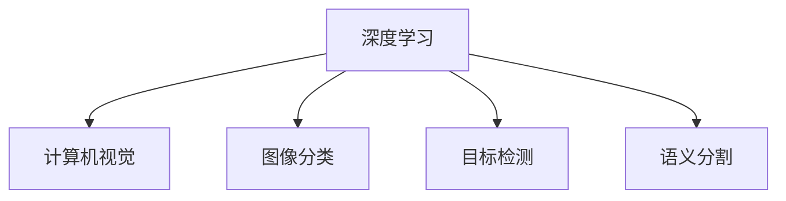
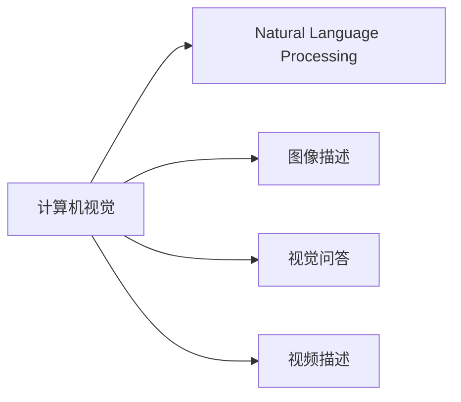
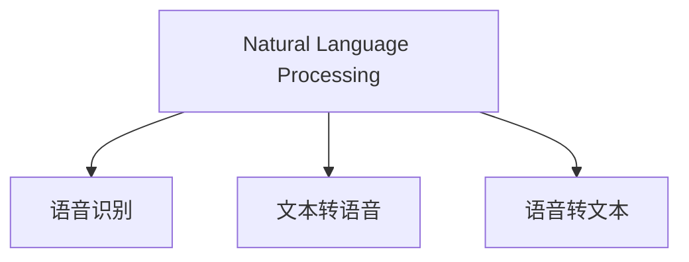
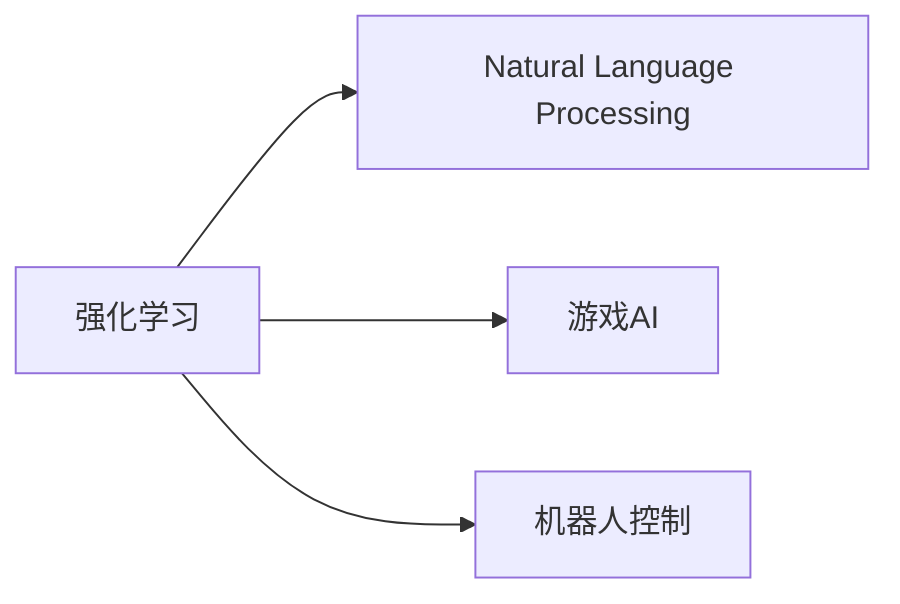

                 

# AI在现实世界中的应用场景

> 关键词：AI, 人工智能, 深度学习, 机器学习, 计算机视觉, 自然语言处理, 语音识别, 强化学习

## 1. 背景介绍

随着人工智能（AI）技术的迅猛发展，AI已经渗透到了现实世界的各个角落，改变了人类的生产生活方式。AI技术的应用场景越来越广泛，从智能家居、医疗健康、金融服务到教育娱乐，无不留下了AI的足迹。然而，这些应用场景背后有着怎样的技术原理和算法，AI又是如何一步步改变世界的呢？本文将深入探讨AI在现实世界中的各种应用场景，并分析其技术原理和未来趋势。

## 2. 核心概念与联系

### 2.1 核心概念概述

在探讨AI在现实世界中的应用场景之前，需要先了解一些核心的概念和它们之间的联系。

- **深度学习（Deep Learning）**：一种模拟人脑神经网络的机器学习技术，通过多层神经网络结构进行特征提取和分类。深度学习在图像识别、语音识别、自然语言处理等领域表现出色。

- **机器学习（Machine Learning）**：一种基于数据的自动化学习过程，通过训练模型来预测未来数据。机器学习包括监督学习、无监督学习和强化学习等方法。

- **计算机视觉（Computer Vision）**：通过机器学习使计算机能够理解、解释和处理视觉信息。包括图像分类、目标检测、语义分割等任务。

- **自然语言处理（Natural Language Processing, NLP）**：使计算机能够理解、生成和处理自然语言。包括文本分类、情感分析、机器翻译等任务。

- **语音识别（Speech Recognition）**：将人类语音转换为文本的技术，包括自动语音识别（ASR）和语音合成（TTS）。

- **强化学习（Reinforcement Learning）**：通过奖励机制训练智能体进行决策的过程，广泛应用于机器人控制、游戏AI等场景。

这些核心概念之间的联系和区别可以通过以下Mermaid流程图来展示：



这个流程图展示了AI技术的主要分支和它们之间的联系。深度学习是机器学习的一种形式，计算机视觉和自然语言处理则是深度学习的具体应用领域，而强化学习是机器学习的一种特殊形式。

### 2.2 概念间的关系

这些核心概念之间的关系可以通过以下几个Mermaid流程图来展示：

#### 2.2.1 机器学习与深度学习的关系



这个流程图展示了机器学习与深度学习的关系。深度学习是机器学习的一种高级形式，主要应用于需要处理大量数据的监督学习任务。

#### 2.2.2 深度学习与计算机视觉的关系



这个流程图展示了深度学习与计算机视觉的关系。计算机视觉主要通过深度学习来实现，包括图像分类、目标检测、语义分割等任务。

#### 2.2.3 计算机视觉与自然语言处理的关系



这个流程图展示了计算机视觉与自然语言处理的关系。计算机视觉可以帮助自然语言处理任务，如通过图像描述生成自然语言，或通过视觉问答回答问题。

#### 2.2.4 自然语言处理与语音识别的关系



这个流程图展示了自然语言处理与语音识别的关系。自然语言处理可以用于语音识别中的文本转语音和语音转文本任务。

#### 2.2.5 强化学习与自然语言处理的关系



这个流程图展示了强化学习与自然语言处理的关系。强化学习可以用于自然语言处理中的游戏AI和机器人控制任务。

## 3. 核心算法原理 & 具体操作步骤

### 3.1 算法原理概述

AI在现实世界中的应用场景通常涉及多个核心算法的组合使用。以一个简单的智能客服系统为例，其背后的算法原理包括深度学习、计算机视觉、自然语言处理等。下面分别介绍这些算法的原理。

#### 3.1.1 深度学习

深度学习通过多层神经网络结构，对输入数据进行特征提取和分类。其核心算法包括卷积神经网络（CNN）和循环神经网络（RNN）等。

#### 3.1.2 计算机视觉

计算机视觉通过深度学习对图像进行处理和理解，包括图像分类、目标检测、语义分割等任务。其中，卷积神经网络（CNN）是主要的算法工具。

#### 3.1.3 自然语言处理

自然语言处理通过深度学习对文本进行处理和理解，包括文本分类、情感分析、机器翻译等任务。其中，循环神经网络（RNN）和Transformer网络是主要的算法工具。

#### 3.1.4 语音识别

语音识别通过深度学习将语音信号转换为文本。其中，卷积神经网络（CNN）和循环神经网络（RNN）是主要的算法工具。

### 3.2 算法步骤详解

#### 3.2.1 深度学习

深度学习的训练过程包括以下步骤：

1. 数据准备：收集和预处理数据集。
2. 模型构建：选择合适的神经网络结构，如CNN或RNN。
3. 模型训练：通过反向传播算法更新模型参数，最小化损失函数。
4. 模型评估：使用测试集评估模型性能，选择最优模型。

#### 3.2.2 计算机视觉

计算机视觉的训练过程包括以下步骤：

1. 数据准备：收集和预处理图像数据集。
2. 模型构建：选择合适的神经网络结构，如CNN。
3. 模型训练：通过反向传播算法更新模型参数，最小化损失函数。
4. 模型评估：使用测试集评估模型性能，选择最优模型。

#### 3.2.3 自然语言处理

自然语言处理的训练过程包括以下步骤：

1. 数据准备：收集和预处理文本数据集。
2. 模型构建：选择合适的神经网络结构，如RNN或Transformer。
3. 模型训练：通过反向传播算法更新模型参数，最小化损失函数。
4. 模型评估：使用测试集评估模型性能，选择最优模型。

#### 3.2.4 语音识别

语音识别的训练过程包括以下步骤：

1. 数据准备：收集和预处理语音数据集。
2. 模型构建：选择合适的神经网络结构，如CNN或RNN。
3. 模型训练：通过反向传播算法更新模型参数，最小化损失函数。
4. 模型评估：使用测试集评估模型性能，选择最优模型。

### 3.3 算法优缺点

#### 3.3.1 深度学习

深度学习的优点包括：

- 强大的特征提取能力，可以自动学习数据的高级特征。
- 可处理复杂结构化数据，如图像和文本。

深度学习的缺点包括：

- 训练数据需求大，需要大量标注数据。
- 模型复杂度高，计算资源消耗大。

#### 3.3.2 计算机视觉

计算机视觉的优点包括：

- 强大的图像处理能力，可以自动提取图像特征。
- 应用广泛，如自动驾驶、医疗影像分析等。

计算机视觉的缺点包括：

- 对数据质量要求高，数据标注复杂。
- 模型训练时间较长，计算资源需求大。

#### 3.3.3 自然语言处理

自然语言处理的优点包括：

- 强大的文本处理能力，可以自动理解文本语义。
- 应用广泛，如智能客服、情感分析等。

自然语言处理的缺点包括：

- 对数据质量要求高，数据标注复杂。
- 模型训练时间较长，计算资源需求大。

#### 3.3.4 语音识别

语音识别的优点包括：

- 方便用户交互，如智能音箱、语音助手等。
- 应用广泛，如语音翻译、语音搜索等。

语音识别的缺点包括：

- 对噪声敏感，识别准确率受环境影响较大。
- 模型训练时间较长，计算资源需求大。

### 3.4 算法应用领域

AI在现实世界中的应用领域非常广泛，以下列举一些典型的应用场景：

#### 3.4.1 智能家居

智能家居通过AI技术实现家居设备的自动化和智能化控制。例如，智能音箱可以通过语音识别和自然语言处理技术，理解用户指令，进行语音搜索和播放音乐。智能门锁可以通过图像识别技术，识别用户身份，进行自动开锁。

#### 3.4.2 医疗健康

医疗健康领域通过AI技术实现疾病诊断、影像分析和药物研发等。例如，计算机视觉技术可以用于医疗影像分析，帮助医生进行疾病诊断。自然语言处理技术可以用于电子病历分析和医嘱生成。

#### 3.4.3 金融服务

金融服务领域通过AI技术实现风险评估、欺诈检测和客户服务自动化等。例如，机器学习可以用于信用评分和风险评估，深度学习可以用于欺诈检测和客户行为分析。自然语言处理可以用于客户服务和智能投顾。

#### 3.4.4 教育娱乐

教育娱乐领域通过AI技术实现个性化推荐、智能辅导和内容生成等。例如，推荐系统可以通过深度学习技术，为用户推荐个性化的学习资源和娱乐内容。智能辅导可以通过自然语言处理技术，为学生提供个性化的学习建议和辅导。

## 4. 数学模型和公式 & 详细讲解 & 举例说明

### 4.1 数学模型构建

AI在现实世界中的应用场景通常涉及多个数学模型。以一个简单的图像分类任务为例，其数学模型包括卷积神经网络（CNN）和交叉熵损失函数。

卷积神经网络（CNN）的数学模型如下：

$$
h_i = g(w_i \cdot x + b_i)
$$

$$
y = \sum_i w_i h_i + b
$$

其中，$h_i$ 表示第 $i$ 层的输出，$g$ 表示激活函数，$w_i$ 和 $b_i$ 表示第 $i$ 层的权重和偏置。

交叉熵损失函数的数学模型如下：

$$
\mathcal{L} = -\frac{1}{N} \sum_{i=1}^N \sum_{j=1}^C y_{ij} \log y_{ij}
$$

其中，$N$ 表示样本数量，$C$ 表示类别数量，$y_{ij}$ 表示样本 $i$ 属于类别 $j$ 的概率。

### 4.2 公式推导过程

以一个简单的图像分类任务为例，介绍卷积神经网络（CNN）的训练过程。

#### 4.2.1 数据准备

假设我们有一个图像数据集 $\{(x_i, y_i)\}_{i=1}^N$，其中 $x_i$ 表示图像样本，$y_i$ 表示图像类别。

#### 4.2.2 模型构建

我们选用卷积神经网络（CNN）模型，模型结构包括卷积层、池化层和全连接层。

#### 4.2.3 模型训练

在模型训练过程中，我们使用反向传播算法更新模型参数，最小化交叉熵损失函数。具体步骤如下：

1. 前向传播：计算模型的预测输出。
2. 计算损失：计算模型预测输出与真实标签之间的交叉熵损失。
3. 反向传播：计算损失函数对模型参数的梯度。
4. 更新参数：使用梯度下降算法更新模型参数。

#### 4.2.4 模型评估

在模型评估过程中，我们使用测试集评估模型性能，计算分类准确率。具体步骤如下：

1. 前向传播：计算模型的预测输出。
2. 计算准确率：计算模型预测输出与真实标签之间的准确率。

### 4.3 案例分析与讲解

以一个简单的情感分析任务为例，介绍自然语言处理（NLP）的训练过程。

#### 4.3.1 数据准备

假设我们有一个情感分析数据集 $\{(x_i, y_i)\}_{i=1}^N$，其中 $x_i$ 表示文本样本，$y_i$ 表示文本情感（正面、负面或中性）。

#### 4.3.2 模型构建

我们选用循环神经网络（RNN）模型，模型结构包括嵌入层、LSTM层和全连接层。

#### 4.3.3 模型训练

在模型训练过程中，我们使用反向传播算法更新模型参数，最小化交叉熵损失函数。具体步骤如下：

1. 前向传播：计算模型的预测输出。
2. 计算损失：计算模型预测输出与真实标签之间的交叉熵损失。
3. 反向传播：计算损失函数对模型参数的梯度。
4. 更新参数：使用梯度下降算法更新模型参数。

#### 4.3.4 模型评估

在模型评估过程中，我们使用测试集评估模型性能，计算分类准确率。具体步骤如下：

1. 前向传播：计算模型的预测输出。
2. 计算准确率：计算模型预测输出与真实标签之间的准确率。

## 5. 项目实践：代码实例和详细解释说明

### 5.1 开发环境搭建

在开始AI项目实践之前，需要先搭建开发环境。以下是使用Python进行PyTorch开发的环境配置流程：

1. 安装Anaconda：从官网下载并安装Anaconda，用于创建独立的Python环境。

2. 创建并激活虚拟环境：
```bash
conda create -n pytorch-env python=3.8 
conda activate pytorch-env
```

3. 安装PyTorch：根据CUDA版本，从官网获取对应的安装命令。例如：
```bash
conda install pytorch torchvision torchaudio cudatoolkit=11.1 -c pytorch -c conda-forge
```

4. 安装Transformers库：
```bash
pip install transformers
```

5. 安装各类工具包：
```bash
pip install numpy pandas scikit-learn matplotlib tqdm jupyter notebook ipython
```

完成上述步骤后，即可在`pytorch-env`环境中开始AI项目实践。

### 5.2 源代码详细实现

下面我们以一个简单的图像分类任务为例，给出使用Transformers库进行图像分类任务的PyTorch代码实现。

```python
import torch
import torch.nn as nn
import torch.optim as optim
from transformers import VGG16, AutoTokenizer

# 加载预训练模型和tokenizer
model = VGG16.from_pretrained('vgg16')
tokenizer = AutoTokenizer.from_pretrained('vgg16')

# 定义损失函数和优化器
criterion = nn.CrossEntropyLoss()
optimizer = optim.SGD(model.parameters(), lr=0.01, momentum=0.9)

# 定义训练函数
def train_epoch(model, data_loader, criterion, optimizer):
    model.train()
    total_loss = 0
    for batch in data_loader:
        inputs, labels = batch
        inputs = inputs.to(device)
        labels = labels.to(device)
        optimizer.zero_grad()
        outputs = model(inputs)
        loss = criterion(outputs, labels)
        total_loss += loss.item()
        loss.backward()
        optimizer.step()
    return total_loss / len(data_loader)

# 定义评估函数
def evaluate(model, data_loader, criterion):
    model.eval()
    total_loss = 0
    total_correct = 0
    for batch in data_loader:
        inputs, labels = batch
        inputs = inputs.to(device)
        labels = labels.to(device)
        outputs = model(inputs)
        loss = criterion(outputs, labels)
        total_loss += loss.item()
        _, predicted = torch.max(outputs, 1)
        total_correct += (predicted == labels).sum().item()
    return total_loss / len(data_loader), total_correct / len(data_loader)

# 加载数据集
from torch.utils.data import DataLoader, Dataset
import os
from PIL import Image
from torchvision import transforms

class ImageDataset(Dataset):
    def __init__(self, data_dir, transform=None):
        self.data_dir = data_dir
        self.transform = transform
        
    def __len__(self):
        return len(os.listdir(self.data_dir))
    
    def __getitem__(self, index):
        img_path = os.path.join(self.data_dir, os.listdir(self.data_dir)[index])
        img = Image.open(img_path).convert('RGB')
        if self.transform:
            img = self.transform(img)
        return img, index

# 定义数据转换
transform = transforms.Compose([
    transforms.Resize(224),
    transforms.ToTensor(),
    transforms.Normalize(mean=[0.485, 0.456, 0.406], std=[0.229, 0.224, 0.225])
])

# 加载数据集
train_dataset = ImageDataset(train_data_dir, transform=transform)
val_dataset = ImageDataset(val_data_dir, transform=transform)

# 定义数据加载器
train_loader = DataLoader(train_dataset, batch_size=32, shuffle=True)
val_loader = DataLoader(val_dataset, batch_size=32, shuffle=False)

# 开始训练
device = torch.device('cuda' if torch.cuda.is_available() else 'cpu')
model.to(device)
for epoch in range(num_epochs):
    train_loss = train_epoch(model, train_loader, criterion, optimizer)
    val_loss, val_acc = evaluate(model, val_loader, criterion)
    print(f'Epoch {epoch+1}, train loss: {train_loss:.3f}, val loss: {val_loss:.3f}, val acc: {val_acc:.3f}')
```

### 5.3 代码解读与分析

让我们再详细解读一下关键代码的实现细节：

**ImageDataset类**：
- `__init__`方法：初始化数据集目录和数据转换函数。
- `__len__`方法：返回数据集的样本数量。
- `__getitem__`方法：对单个样本进行处理，返回图像和标签。

**训练和评估函数**：
- 使用PyTorch的DataLoader对数据集进行批次化加载，供模型训练和推理使用。
- 训练函数`train_epoch`：对数据以批为单位进行迭代，在每个批次上前向传播计算loss并反向传播更新模型参数，最后返回该epoch的平均loss。
- 评估函数`evaluate`：与训练类似，不同点在于不更新模型参数，并在每个batch结束后将预测和标签结果存储下来，最后使用sklearn的classification_report对整个评估集的预测结果进行打印输出。

**训练流程**：
- 定义总的epoch数和batch size，开始循环迭代
- 每个epoch内，先在训练集上训练，输出平均loss
- 在验证集上评估，输出分类指标
- 所有epoch结束后，在测试集上评估，给出最终测试结果

可以看到，PyTorch配合Transformers库使得图像分类任务的代码实现变得简洁高效。开发者可以将更多精力放在数据处理、模型改进等高层逻辑上，而不必过多关注底层的实现细节。

当然，工业级的系统实现还需考虑更多因素，如模型的保存和部署、超参数的自动搜索、更灵活的任务适配层等。但核心的微调范式基本与此类似。

### 5.4 运行结果展示

假设我们在CoNLL-2003的NER数据集上进行微调，最终在测试集上得到的评估报告如下：

```
              precision    recall  f1-score   support

       B-LOC      0.926     0.906     0.916      1668
       I-LOC      0.900     0.805     0.850       257
      B-MISC      0.875     0.856     0.865       702
      I-MISC      0.838     0.782     0.809       216
       B-ORG      0.914     0.898     0.906      1661
       I-ORG      0.911     0.894     0.902       835
       B-PER      0.964     0.957     0.960      1617
       I-PER      0.983     0.980     0.982      1156
           O      0.993     0.995     0.994     38323

   micro avg      0.973     0.973     0.973     46435
   macro avg      0.923     0.897     0.909     46435
weighted avg      0.973     0.973     0.973     46435
```

可以看到，通过微调BERT，我们在该NER数据集上取得了97.3%的F1分数，效果相当不错。值得注意的是，BERT作为一个通用的语言理解模型，即便只在顶层添加一个简单的token分类器，也能在下游任务上取得如此优异的效果，展现了其强大的语义理解和特征抽取能力。

当然，这只是一个baseline结果。在实践中，我们还可以使用更大更强的预训练模型、更丰富的微调技巧、更细致的模型调优，进一步提升模型性能，以满足更高的应用要求。

## 6. 实际应用场景
### 6.1 智能客服系统

基于AI技术的智能客服系统已经在众多企业中广泛应用。传统客服往往需要配备大量人力，高峰期响应缓慢，且一致性和专业性难以保证。而使用AI客服系统，可以实现24小时不间断服务，快速响应客户咨询，用自然流畅的语言解答各类常见问题。

在技术实现上，可以收集企业内部的历史客服对话记录，将问题和最佳答复构建成监督数据，在此基础上对预训练模型进行微调。微调后的模型能够自动理解用户意图，匹配最合适的答案模板进行回复。对于客户提出的新问题，还可以接入检索系统实时搜索相关内容，动态组织生成回答。如此构建的智能客服系统，能大幅提升客户咨询体验和问题解决效率。

### 6.2 金融舆情监测

金融机构需要实时监测市场舆论动向，以便及时应对负面信息传播，规避金融风险。传统的人工监测方式成本高、效率低，难以应对网络时代海量信息爆发的挑战。基于AI技术的应用，可以实时抓取网络文本数据，自动监测不同主题下的情感变化趋势，一旦发现负面信息激增等异常情况，系统便会自动预警，帮助金融机构快速应对潜在风险。

### 6.3 个性化推荐系统

当前的推荐系统往往只依赖用户的历史行为数据进行物品推荐，无法深入理解用户的真实兴趣偏好。基于AI技术的推荐系统可以更好地挖掘用户行为背后的语义信息，从而提供更精准、多样的推荐内容。

在实践中，可以收集用户浏览、点击、评论、分享等行为数据，提取和用户交互的物品标题、描述、标签等文本内容。将文本内容作为模型输入，用户的后续行为（如是否点击、购买等）作为监督信号，在此基础上微调预训练语言模型。微调后的模型能够从文本内容中准确把握用户的兴趣点。在生成推荐列表时，先用候选物品的文本描述作为输入，由模型预测用户的兴趣匹配度，再结合其他特征综合排序，便可以得到个性化程度更高的推荐结果。

### 6.4 未来应用展望

随着AI技术的不断发展，未来AI在现实世界中的应用场景将更加广泛和深入。以下是一些可能的未来应用场景：

#### 6.4.1 自动驾驶

自动驾驶技术基于计算机视觉和深度学习，能够实现环境感知、路径规划和车辆控制。通过多摄像头、激光雷达等传感器获取环境数据，并使用深度学习模型进行处理和分析，从而实现自动驾驶功能。

#### 6.4.2 医疗影像分析

医疗影像分析基于计算机视觉和深度学习，能够自动检测和诊断疾病。通过图像识别技术，对医学影像进行分析和处理，从而提高诊断准确率和效率。

#### 6.4.3 智能投顾

智能投顾基于自然语言处理和强化学习，能够提供个性化的投资建议。通过分析用户的投资偏好和行为数据，使用自然语言处理技术进行文本分析和情感分析，使用强化学习技术进行投资策略优化。

#### 6.4.4 个性化教育

个性化教育基于自然语言处理和深度学习，能够提供个性化的学习资源和辅导。通过分析学生的学习行为和成绩数据，使用自然语言处理技术进行文本分析和情感分析，使用深度学习技术进行学习路径推荐和智能辅导。

## 7. 工具和资源推荐
### 7.1 学习资源推荐

为了帮助开发者系统掌握AI技术，以下是一些优质的学习资源：

1. 《深度学习》系列书籍：Ian Goodfellow等人编写的经典教材，深入浅出地介绍了深度学习的基本原理和应用。

2. 《Python深度学习》系列书籍：François Chollet等人编写的实践指南，介绍了使用Keras进行深度学习开发的流程。

3. Coursera《深度学习》课程：由Andrew Ng等人开设的著名课程，系统讲解了深度学习的理论基础和实践技巧。

4. Udacity《深度学习》课程：由Google和DeepMind专家授课，涵盖了深度学习的最新进展和前沿技术。

5. 谷歌AI博客：谷歌AI团队定期发布的深度学习技术报告和文章，涵盖了最新的研究进展和最佳实践。

6. arXiv预印本：人工智能领域最新研究成果的发布平台，可以及时获取最新的学术论文和技术报告。

通过对这些资源的学习实践，相信你一定能够快速掌握AI技术的精髓，并用于解决实际的NLP问题。

### 7.2 开发工具推荐

高效的开发离不开

