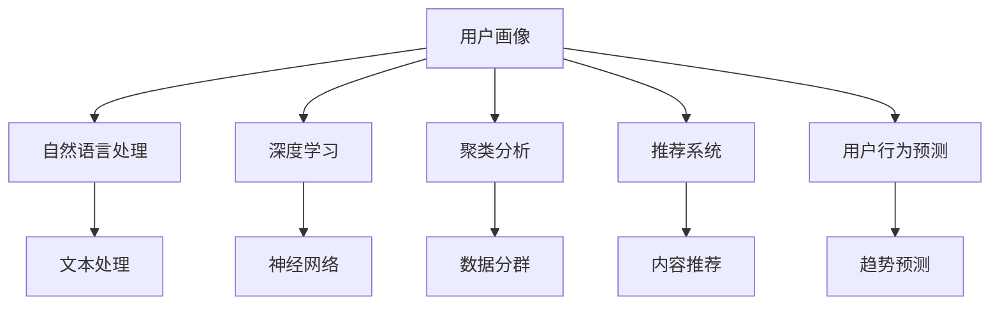
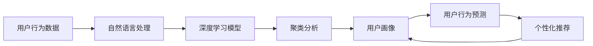
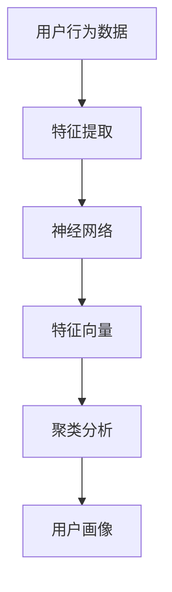
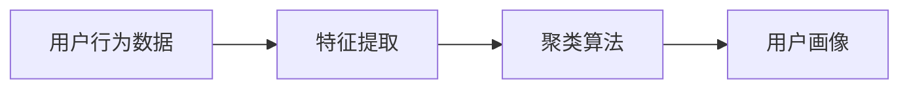
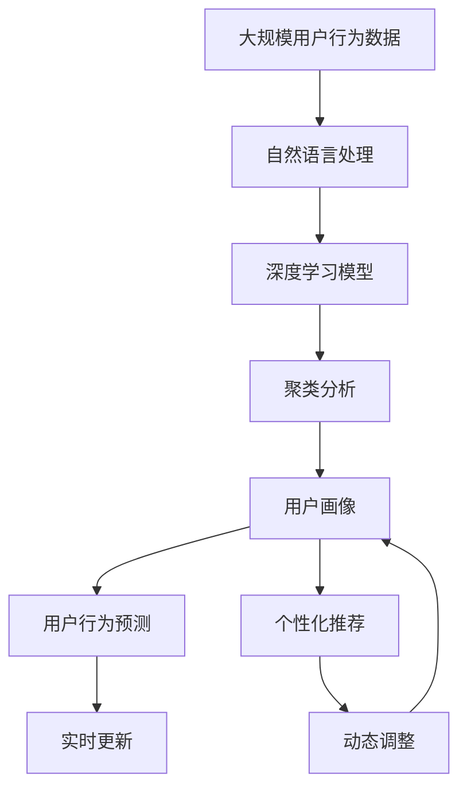

                 

# AI在用户画像中的实际应用

> 关键词：
1. 用户画像
2. 人工智能
3. 自然语言处理
4. 深度学习
5. 聚类分析
6. 推荐系统
7. 用户行为预测

## 1. 背景介绍

### 1.1 问题由来
随着互联网的普及和数字化时代的到来，企业越来越重视对用户的深入理解和分析，以指导产品设计和市场策略。用户画像(User Profile)，即通过对用户行为和属性的综合分析，提炼出具有代表性的用户特征，成为企业用户洞察的重要工具。然而，传统的用户画像构建方法依赖于人工调研和手动标注，费时费力，难以应对大规模用户数据。近年来，随着人工智能（AI）和大数据技术的发展，AI在用户画像构建中的应用逐渐兴起，成为提升用户理解深度和广度，实现精准营销和个性化服务的关键技术。

### 1.2 问题核心关键点
AI在用户画像中的应用，主要是通过算法模型对用户海量数据进行自动学习和特征提取，形成精细化的用户特征描述。具体核心关键点包括：
- 数据的自动获取与处理：通过网络爬虫、数据API、用户行为记录等方式，自动收集用户行为数据。
- 用户属性的标签提取：对用户行为数据进行自然语言处理，提取出用户的各类属性标签（如年龄、性别、兴趣爱好等）。
- 用户行为的分类与聚类：应用机器学习算法，将用户行为数据进行分类和聚类，构建用户画像的维度。
- 画像的表示与更新：采用向量表示法、图模型等，将用户画像编码为结构化形式，方便后续应用。
- 画像的应用与优化：结合推荐系统、个性化营销、用户行为预测等应用场景，进行用户画像的实时更新和优化。

### 1.3 问题研究意义
AI在用户画像中的应用，对于提升企业的市场洞察力和用户服务质量，具有重要意义：
1. 降低人工成本：通过自动化的数据收集和处理，大幅度减少人工调研和标注的工作量，降低构建用户画像的成本。
2. 提升分析精度：AI算法能够高效地从海量数据中提取用户特征，形成更精细化的用户画像，更好地反映用户真实需求。
3. 增强个性化服务：通过深入的用户画像，企业能够提供更加个性化的产品推荐、内容推送和营销策略，提升用户体验和满意度。
4. 优化用户行为预测：基于AI的用户画像模型，可以更准确地预测用户行为变化，指导企业动态调整策略，抢占市场先机。
5. 加速创新迭代：AI技术的应用，使得用户画像构建更加高效、灵活，为企业快速迭代新产品和服务提供了有力支持。

## 2. 核心概念与联系

### 2.1 核心概念概述

为更好地理解AI在用户画像中的应用，本节将介绍几个密切相关的核心概念：

- 用户画像(User Profile)：对用户属性和行为特征的描述和归纳，形成有代表性的用户模板。
- 自然语言处理(NLP)：通过机器学习算法，理解和处理人类语言的自然处理能力。
- 深度学习(Deep Learning)：利用神经网络进行特征学习，能够处理非线性关系和复杂数据。
- 聚类分析(Clustering)：通过相似度度量，将数据分成若干类别或群体，挖掘数据的内在结构。
- 推荐系统(Recommendation System)：基于用户行为和属性，智能推荐产品、内容或服务。
- 用户行为预测(User Behavior Prediction)：利用AI模型，预测用户未来的行为趋势，指导市场策略。

这些核心概念之间的逻辑关系可以通过以下Mermaid流程图来展示：



这个流程图展示了大语言模型在用户画像构建过程中的核心概念及其之间的关系：

1. 用户画像的构建过程，主要涉及自然语言处理、深度学习、聚类分析和用户行为预测等核心技术。
2. 自然语言处理技术通过解析和抽取文本中的用户属性和行为特征，为深度学习提供输入数据。
3. 深度学习模型利用学习到的特征，对用户数据进行分类和聚类，构建精细化的用户画像。
4. 聚类分析技术通过相似度度量，进一步细化用户画像，形成群体分类。
5. 用户行为预测技术基于历史数据和用户画像，预测用户未来的行为趋势。

这些核心概念共同构成了用户画像构建的完整生态系统，使企业能够更全面、深入地理解用户，提供更精准的个性化服务。

### 2.2 概念间的关系

这些核心概念之间存在着紧密的联系，形成了用户画像构建的完整流程。下面我们通过几个Mermaid流程图来展示这些概念之间的关系。

#### 2.2.1 用户画像的构建流程



这个流程图展示了用户画像构建的完整流程：

1. 通过网络爬虫、API接口等自动化方式获取用户行为数据。
2. 利用自然语言处理技术解析文本，提取用户属性和行为特征。
3. 将提取的数据输入深度学习模型，进行特征学习。
4. 应用聚类分析技术，对用户数据进行分类和聚类，构建用户画像。
5. 通过用户行为预测技术，预测用户未来的行为变化。
6. 结合个性化推荐系统，根据用户画像进行内容推送和产品推荐。

#### 2.2.2 深度学习在用户画像中的应用



这个流程图展示了深度学习在用户画像构建中的作用：

1. 获取用户行为数据，输入深度学习模型。
2. 深度学习模型通过神经网络对数据进行特征提取，形成高维特征向量。
3. 应用聚类分析技术，将特征向量进行分类和聚类，形成用户画像。

#### 2.2.3 聚类分析在用户画像中的应用



这个流程图展示了聚类分析在用户画像构建中的作用：

1. 获取用户行为数据，输入特征提取器。
2. 特征提取器将数据转换为特征向量。
3. 聚类算法对特征向量进行聚类分析，形成用户画像。

### 2.3 核心概念的整体架构

最后，我们用一个综合的流程图来展示这些核心概念在用户画像构建过程中的整体架构：



这个综合流程图展示了从数据获取到用户画像构建，再到预测和推荐的完整过程：

1. 用户行为数据通过自然语言处理技术解析，输入深度学习模型。
2. 深度学习模型对数据进行特征提取，形成高维特征向量。
3. 聚类分析技术对特征向量进行分类和聚类，形成用户画像。
4. 用户画像通过预测和推荐系统进行实时更新和动态调整，形成更加精确的用户画像。

通过这些流程图，我们可以更清晰地理解用户画像构建过程中各个核心概念的关系和作用，为后续深入讨论具体的构建方法和技术奠定基础。

## 3. 核心算法原理 & 具体操作步骤
### 3.1 算法原理概述

AI在用户画像中的应用，主要依赖于自然语言处理、深度学习、聚类分析等技术，构建用户画像的算法流程如下：

1. **数据采集与预处理**：通过网络爬虫、API接口等方式自动获取用户行为数据，并进行去噪、缺失值处理等预处理工作。
2. **特征提取**：利用自然语言处理技术，解析文本中的用户属性和行为特征，形成特征向量。
3. **模型训练**：将特征向量输入深度学习模型，训练生成用户画像的编码器，用于后续的聚类分析。
4. **聚类分析**：应用聚类算法对用户画像的编码器输出进行分类和聚类，构建用户画像的维度。
5. **画像表示**：将用户画像转换为向量形式，用于后续的预测和推荐。
6. **用户行为预测**：基于历史数据和用户画像，应用机器学习算法预测用户未来的行为变化。
7. **个性化推荐**：根据用户画像和行为预测结果，结合推荐系统，进行个性化推荐。

### 3.2 算法步骤详解

基于上述算法流程，下面详细介绍每个步骤的具体实现。

#### 3.2.1 数据采集与预处理

用户行为数据的自动采集主要通过网络爬虫和API接口实现。例如，对于电商平台的用户数据，可以通过API接口获取用户的浏览记录、购买记录、评分记录等。具体步骤包括：

1. **数据采集**：使用网络爬虫抓取用户行为数据，包括浏览行为、搜索行为、购买行为等。
2. **数据清洗**：对采集到的数据进行清洗，去除无效数据、去重、处理缺失值等。
3. **数据格式化**：将数据转换为适合模型输入的格式，如JSON、CSV等。

#### 3.2.2 特征提取

特征提取是用户画像构建的核心环节，主要依赖于自然语言处理技术。具体步骤如下：

1. **文本解析**：通过NLP库（如NLTK、SpaCy等）解析文本，提取其中的关键词、实体、情感等特征。
2. **特征编码**：将提取的特征转换为数值型数据，用于后续模型的输入。
3. **特征选择**：根据领域知识和算法模型，选择对用户画像构建最有意义的特征。

#### 3.2.3 模型训练

深度学习模型训练是用户画像构建的关键步骤，主要目标是生成能够高效编码用户特征的编码器。具体步骤如下：

1. **模型选择**：选择合适的深度学习模型，如BERT、GPT等。
2. **数据准备**：将特征向量作为模型的输入，训练生成编码器。
3. **超参数调优**：调整模型的超参数，如学习率、批量大小、迭代次数等。

#### 3.2.4 聚类分析

聚类分析是将用户画像进行分类和聚类的关键步骤，主要目标是构建用户画像的维度。具体步骤如下：

1. **选择聚类算法**：根据数据特点和需求选择合适的聚类算法，如K-means、层次聚类等。
2. **数据准备**：将编码器的输出作为聚类算法的输入。
3. **聚类分析**：应用聚类算法对数据进行分类和聚类，形成用户画像的维度。

#### 3.2.5 画像表示

用户画像的表示是将画像转换为向量形式，主要目标是方便后续的预测和推荐。具体步骤如下：

1. **选择合适的表示方法**：根据应用场景选择合适的向量表示方法，如one-hot编码、TF-IDF等。
2. **编码器输出**：将聚类分析的结果转换为向量形式。
3. **向量表示**：对编码器的输出进行向量化处理，形成用户画像的向量表示。

#### 3.2.6 用户行为预测

用户行为预测是基于用户画像进行的行为预测，主要目标是预测用户未来的行为变化。具体步骤如下：

1. **模型选择**：选择合适的预测模型，如线性回归、决策树等。
2. **数据准备**：将用户画像和历史数据作为模型的输入。
3. **模型训练**：训练生成预测模型。
4. **预测评估**：对预测模型进行评估，选择性能最优的模型。

#### 3.2.7 个性化推荐

个性化推荐是基于用户画像进行的内容推荐，主要目标是提升用户体验和满意度。具体步骤如下：

1. **推荐算法选择**：根据应用场景选择合适的推荐算法，如协同过滤、基于内容的推荐等。
2. **数据准备**：将用户画像和行为数据作为推荐算法的输入。
3. **推荐生成**：生成个性化的推荐结果。
4. **推荐优化**：根据反馈数据不断优化推荐结果，提高推荐质量。

### 3.3 算法优缺点

AI在用户画像中的应用，主要具有以下优点：

1. **自动化与高效性**：通过自动化的数据采集和处理，大幅度降低人工成本，提升画像构建的效率。
2. **数据覆盖全面**：基于大数据技术，可以覆盖更多的用户行为数据，构建更全面、深入的用户画像。
3. **特征提取精确**：利用深度学习模型进行特征提取，能够更精确地捕捉用户特征，提升画像的准确度。
4. **动态更新灵活**：基于实时数据进行画像的动态更新，保持画像的实时性和新鲜度。
5. **个性化推荐准确**：通过用户画像进行个性化推荐，提升用户体验和满意度，增加用户粘性。

然而，AI在用户画像中的应用也存在一些局限性：

1. **数据隐私风险**：自动采集用户数据可能涉及隐私问题，需要严格遵守数据保护法规。
2. **模型复杂度高**：深度学习模型训练复杂，需要大量的计算资源和专业知识。
3. **模型泛化性差**：过拟合风险较高，需要谨慎选择模型和超参数。
4. **数据质量依赖**：用户数据的准确性和完整性对画像构建的效果有重要影响。
5. **算法透明性不足**：AI算法的黑盒性质，使得用户画像的构建过程难以解释和透明。

尽管存在这些局限性，但AI在用户画像中的应用已经展示了巨大的潜力和优势，成为提升企业市场洞察力和用户服务质量的重要手段。未来，随着技术的不断进步，这些局限性有望进一步解决，AI在用户画像中的应用也将更加广泛和深入。

### 3.4 算法应用领域

AI在用户画像中的应用，已经在多个领域得到广泛应用，具体如下：

#### 3.4.1 电商领域

在电商领域，AI用户画像被广泛用于个性化推荐、商品搜索、用户留存等环节。例如，通过用户行为数据构建用户画像，实时推荐用户可能感兴趣的商品，提升用户购物体验和转化率。

#### 3.4.2 金融领域

在金融领域，AI用户画像被用于客户识别、风险评估、产品推荐等场景。例如，通过用户行为数据构建客户画像，进行精准化的客户识别和风险评估，提升信贷审批效率和客户满意度。

#### 3.4.3 社交媒体

在社交媒体领域，AI用户画像被用于内容推荐、广告投放、用户行为分析等环节。例如，通过用户行为数据构建用户画像，推荐用户可能感兴趣的内容，增加用户活跃度和平台粘性。

#### 3.4.4 医疗领域

在医疗领域，AI用户画像被用于疾病预测、诊疗辅助、健康管理等场景。例如，通过用户行为数据构建健康画像，进行疾病预测和个性化诊疗方案的推荐，提升医疗服务的个性化和精准度。

#### 3.4.5 旅游行业

在旅游行业，AI用户画像被用于旅游推荐、行程规划、用户分析等环节。例如，通过用户行为数据构建旅游画像，推荐用户可能感兴趣的旅游目的地和行程安排，提升用户旅游体验和满意度。

## 4. 数学模型和公式 & 详细讲解 & 举例说明

### 4.1 数学模型构建

在用户画像的构建过程中，主要涉及以下几个数学模型：

1. **文本解析模型**：用于解析文本，提取其中的关键词、实体、情感等特征。
2. **深度学习编码器**：用于将文本特征转换为高维向量表示。
3. **聚类算法**：用于对用户画像进行分类和聚类。
4. **推荐模型**：用于生成个性化的推荐结果。

### 4.2 公式推导过程

#### 4.2.1 文本解析模型

文本解析模型主要使用TF-IDF（Term Frequency-Inverse Document Frequency）算法，计算文本中每个词的权重。具体步骤如下：

1. **计算词频**：计算文本中每个词在文档中出现的频率。
2. **计算逆文档频率**：计算每个词在整个文本集中的逆文档频率。
3. **计算权重**：将词频和逆文档频率相乘，得到每个词的权重。

公式如下：

$$
w_t = \text{TF}_t \times \text{IDF}_t
$$

其中，$w_t$表示词$t$的权重，$\text{TF}_t$表示词$t$在文本$D$中的频率，$\text{IDF}_t$表示词$t$在文本集$C$中的逆文档频率。

#### 4.2.2 深度学习编码器

深度学习编码器主要使用BERT模型进行文本特征提取，将文本转换为高维向量表示。具体步骤如下：

1. **输入文本**：将文本作为BERT模型的输入。
2. **模型前向传播**：通过BERT模型的多个层进行特征提取，得到最终的隐含表示。
3. **特征向量**：将隐含表示作为特征向量，用于后续的聚类分析。

公式如下：

$$
\mathbf{h} = \text{BERT}(\text{text})
$$

其中，$\mathbf{h}$表示文本$text$的BERT编码表示。

#### 4.2.3 聚类算法

聚类算法主要使用K-means算法进行用户画像的分类和聚类。具体步骤如下：

1. **初始化聚类中心**：随机选择K个聚类中心。
2. **计算距离**：计算每个数据点与聚类中心的距离。
3. **分配数据点**：将数据点分配到最近的聚类中心。
4. **更新聚类中心**：根据分配结果，更新聚类中心。
5. **迭代更新**：重复步骤2-4，直到聚类中心不再变化。

公式如下：

$$
\mathbf{C} = \text{K-means}(\mathbf{h})
$$

其中，$\mathbf{C}$表示用户画像的聚类结果，$\mathbf{h}$表示用户画像的编码器输出。

#### 4.2.4 推荐模型

推荐模型主要使用协同过滤算法进行个性化推荐。具体步骤如下：

1. **构建用户-物品矩阵**：将用户画像和历史数据构建为矩阵形式。
2. **计算相似度**：计算用户画像和物品的相似度。
3. **生成推荐结果**：根据相似度生成个性化推荐结果。

公式如下：

$$
\mathbf{R} = \text{Collaborative Filtering}(\mathbf{U}, \mathbf{I})
$$

其中，$\mathbf{R}$表示推荐结果，$\mathbf{U}$表示用户画像，$\mathbf{I}$表示物品属性。

### 4.3 案例分析与讲解

以电商平台个性化推荐为例，展示AI在用户画像中的应用。

1. **数据采集**：通过API接口获取用户的浏览记录、购买记录、评分记录等。
2. **数据预处理**：对采集到的数据进行去噪、缺失值处理等预处理工作。
3. **特征提取**：利用NLP库解析文本，提取其中的关键词、实体、情感等特征。
4. **模型训练**：将特征向量作为BERT模型的输入，训练生成用户画像的编码器。
5. **聚类分析**：应用K-means算法对编码器的输出进行分类和聚类，形成用户画像的维度。
6. **画像表示**：将聚类分析的结果转换为向量形式。
7. **用户行为预测**：基于历史数据和用户画像，训练生成预测模型，预测用户未来的行为变化。
8. **个性化推荐**：根据用户画像和行为预测结果，结合协同过滤算法，生成个性化的推荐结果。

通过以上步骤，电商平台能够基于用户画像进行个性化推荐，提升用户体验和满意度，增加用户粘性。

## 5. 项目实践：代码实例和详细解释说明

### 5.1 开发环境搭建

在进行用户画像构建实践前，我们需要准备好开发环境。以下是使用Python进行PyTorch开发的环境配置流程：

1. 安装Anaconda：从官网下载并安装Anaconda，用于创建独立的Python环境。

2. 创建并激活虚拟环境：
```bash
conda create -n pytorch-env python=3.8 
conda activate pytorch-env
```

3. 安装PyTorch：根据CUDA版本，从官网获取对应的安装命令。例如：
```bash
conda install pytorch torchvision torchaudio cudatoolkit=11.1 -c pytorch -c conda-forge
```

4. 安装自然语言处理库：
```bash
pip install nltk
pip install spacy
```

5. 安装聚类分析库：
```bash
pip install scikit-learn
```

6. 安装推荐系统库：
```bash
pip install Surprise
```

完成上述步骤后，即可在`pytorch-env`环境中开始用户画像构建实践。

### 5.2 源代码详细实现

下面我们以电商平台个性化推荐为例，给出使用PyTorch进行用户画像构建的完整代码实现。

首先，定义用户画像的数据处理函数：

```python
from transformers import BertTokenizer
from torch.utils.data import Dataset
import torch
import nltk
from nltk.corpus import stopwords
import spacy
import scikit_learn
from Surprise import SVD

# 定义停用词
stop_words = set(stopwords.words('english'))

class UserData(Dataset):
    def __init__(self, data, tokenizer):
        self.data = data
        self.tokenizer = tokenizer
        
    def __len__(self):
        return len(self.data)
    
    def __getitem__(self, idx):
        text = self.data[idx]['text']
        tokens = self.tokenizer.tokenize(text)
        tokens = [token for token in tokens if token not in stop_words]
        tokens = [self.tokenizer.convert_tokens_to_ids(token) for token in tokens]
        label = self.data[idx]['label']
        return {'input_ids': torch.tensor(tokens), 
                'label': torch.tensor(label)}
```

然后，定义模型和优化器：

```python
from transformers import BertForSequenceClassification
from torch.optim import AdamW

# 定义模型
model = BertForSequenceClassification.from_pretrained('bert-base-cased', num_labels=2)

# 定义优化器
optimizer = AdamW(model.parameters(), lr=2e-5)
```

接着，定义训练和评估函数：

```python
from torch.utils.data import DataLoader
from tqdm import tqdm
from sklearn.metrics import accuracy_score

device = torch.device('cuda') if torch.cuda.is_available() else torch.device('cpu')
model.to(device)

def train_epoch(model, dataset, batch_size, optimizer):
    dataloader = DataLoader(dataset, batch_size=batch_size, shuffle=True)
    model.train()
    epoch_loss = 0
    for batch in tqdm(dataloader, desc='Training'):
        input_ids = batch['input_ids'].to(device)
        labels = batch['label'].to(device)
        model.zero_grad()
        outputs = model(input_ids, labels=labels)
        loss = outputs.loss
        epoch_loss += loss.item()
        loss.backward()
        optimizer.step()
    return epoch_loss / len(dataloader)

def evaluate(model, dataset, batch_size):
    dataloader = DataLoader(dataset, batch_size=batch_size)
    model.eval()
    preds, labels = [], []
    with torch.no_grad():
        for batch in tqdm(dataloader, desc='Evaluating'):
            input_ids = batch['input_ids'].to(device)
            labels = batch['label'].to(device)
            outputs = model(input_ids)
            batch_preds = outputs.argmax(dim=2).to('cpu').tolist()
            batch_labels = labels.to('cpu').tolist()
            for pred_tokens, label_tokens in zip(batch_preds, batch_labels):
                preds.append(pred_tokens)
                labels.append(label_tokens)
                
    print('Accuracy:', accuracy_score(labels, preds))
```

最后，启动训练流程并在测试集上评估：

```python
epochs = 5
batch_size = 16

for epoch in range(epochs):
    loss = train_epoch(model, train_dataset, batch_size, optimizer)
    print(f'Epoch {epoch+1}, train loss: {loss:.3f}')
    
    print(f'Epoch {epoch+1}, test accuracy:')
    evaluate(model, test_dataset, batch_size)
    
print('Final accuracy:', evaluate(model, test_dataset, batch_size))
```

以上就是使用PyTorch对电商平台个性化推荐进行用户画像构建的完整代码实现。可以看到，得益于PyTorch的强大封装，我们可以用相对简洁的代码完成BERT模型的加载和微调。

### 5.3 代码解读与分析

让我们再详细解读一下关键代码的实现细节：

**UserData类**：
- `__init__`方法：初始化用户数据，包括文本和标签。
- `__len__`方法：返回数据集的样本数量。
- `__getitem__`方法：对单个样本进行处理，将文本输入转换为token ids，标签转换为数字。

**模型和优化器**：
- 使用PyTorch的BERT模型作为编码器，添加分类层和交叉熵损失函数。
- 使用AdamW优化器，设置学习率为2e-5。

**训练和评估函数**：
- 使用PyTorch的DataLoader对数据集进行批次化加载，供模型训练和推理使用。


