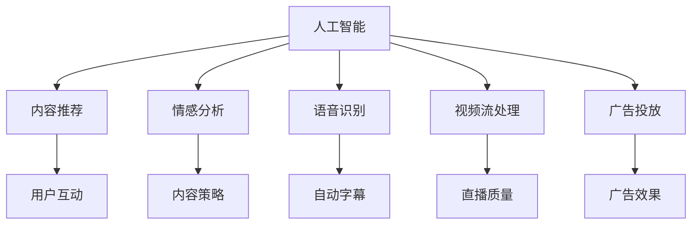

                 

# AI在直播间的应用与商机

> 关键词：
```text
AI, 直播, 内容推荐, 情感分析, 语音识别, 视频流处理, 广告投放, 商用户场景, 技术壁垒, 用户粘性, 商机洞察, 商业应用
```

## 1. 背景介绍

随着互联网技术的发展，直播逐渐成为人们获取信息、社交互动的重要方式之一。无论是传统媒体的直播还是新兴的短视频平台直播，直播形式已经深入人们生活的方方面面。然而，直播内容和互动体验的提升，逐渐成为用户选择直播平台的关键因素。人工智能（AI）技术的引入，为直播行业带来了革命性的变化，不仅提升了内容的智能化水平，还为平台商和广告商提供了全新的商业机会。

### 1.1 直播行业发展现状

直播行业自2015年开始兴起，逐渐形成了以斗鱼、虎牙、B站等为代表的直播平台。直播内容从传统的游戏直播、娱乐直播，扩展到教育、体育、电商等多个领域。随着5G技术的发展，直播质量不断提升，直播应用场景也在不断拓展。

### 1.2 直播行业痛点

尽管直播行业发展迅速，但依然存在以下痛点：

1. **内容创作与分发效率低**：优质内容创作者相对稀缺，优质内容分发需要大量的运营人工介入，效率较低。
2. **用户互动体验不佳**：缺乏智能推荐机制，互动方式单一，难以持续留住用户。
3. **广告投放精准度低**：广告主难以精准触达目标受众，广告效果无法评估。

## 2. 核心概念与联系

### 2.1 核心概念概述

为更好地理解AI在直播间的应用，本节将介绍几个密切相关的核心概念：

- **人工智能（AI）**：通过算法和模型进行自主决策和行动的技术。AI包括机器学习、深度学习、自然语言处理（NLP）、计算机视觉（CV）等多个方向。
- **内容推荐**：基于用户的兴趣、历史行为等特征，智能推荐相关内容，提升用户互动体验。
- **情感分析**：通过分析用户语言、表情等情感特征，评估用户情绪状态，指导平台内容策略。
- **语音识别**：将用户语音转化为文本，用于自动字幕、语音互动等应用。
- **视频流处理**：通过压缩、转码等技术，提升直播流媒体的传输效率和质量。
- **广告投放**：基于用户行为数据，精准投放广告，提高广告投放效果。

这些核心概念之间的逻辑关系可以通过以下Mermaid流程图来展示：



这个流程图展示了几项核心概念之间的相互关系：

1. AI通过机器学习模型对数据进行分析，生成内容推荐、情感分析、语音识别、视频流处理和广告投放的算法模型。
2. 内容推荐、情感分析、语音识别等技术共同提升直播的互动体验和内容质量。
3. 视频流处理和广告投放则直接与直播平台的盈利模式相关联。

### 2.2 概念间的关系

这些核心概念之间存在着紧密的联系，形成了AI在直播间的完整应用生态。

- **内容推荐与情感分析**：通过分析用户的兴趣和情感状态，内容推荐系统能更好地推荐用户感兴趣的内容，提升用户互动和留存率。情感分析则能及时发现用户的不满情绪，指导内容策略的优化。
- **语音识别与视频流处理**：语音识别技术能将用户口述的内容转化为文字，视频流处理技术则通过压缩和解压缩技术，提升直播的流畅性和稳定性。
- **广告投放与内容推荐**：广告投放依赖于内容推荐系统的精准推荐，确保广告能精准触达目标用户。同时，广告收入也是直播平台重要的盈利来源。

## 3. 核心算法原理 & 具体操作步骤

### 3.1 算法原理概述

AI在直播间的应用主要集中在内容推荐、情感分析、语音识别、视频流处理和广告投放等领域。这些应用通常基于深度学习模型进行实现。以内容推荐为例，其核心原理是通过构建用户-内容交互矩阵，利用机器学习算法（如协同过滤、神经网络等），生成用户的潜在兴趣向量，从而推荐相关内容。

### 3.2 算法步骤详解

#### 3.2.1 内容推荐算法

**步骤1：数据准备**
- 收集用户与内容的交互数据，如浏览、点赞、评论等。
- 使用自然语言处理技术对用户评论进行情感分析，获取用户对内容的情感倾向。

**步骤2：特征工程**
- 对用户和内容进行特征提取，如用户的历史行为、内容的标签、风格等。
- 将用户-内容交互数据转化为数值矩阵。

**步骤3：模型训练**
- 使用深度学习模型（如FM、CNN、RNN等），对用户兴趣向量进行训练。
- 在训练过程中，引入正则化、dropout等技术，防止过拟合。

**步骤4：内容推荐**
- 基于训练好的模型，生成每个用户的潜在兴趣向量。
- 对用户兴趣向量进行排序，推荐相关内容。

**步骤5：评估与迭代**
- 对推荐结果进行评估，如点击率、观看时长等指标。
- 根据评估结果，对模型参数进行微调，提升推荐效果。

#### 3.2.2 情感分析算法

**步骤1：数据准备**
- 收集用户评论、视频描述等文本数据。
- 对文本进行预处理，如分词、去停用词、词性标注等。

**步骤2：特征提取**
- 使用TF-IDF、Word2Vec等技术，提取文本特征。
- 引入情感词典，对文本进行情感标注。

**步骤3：模型训练**
- 使用LSTM、BiLSTM、BERT等模型，对情感特征进行训练。
- 在训练过程中，引入正则化、dropout等技术，防止过拟合。

**步骤4：情感分析**
- 对新评论进行情感分析，判断用户情绪状态。
- 根据情感分析结果，指导内容策略的调整。

#### 3.2.3 语音识别算法

**步骤1：数据准备**
- 收集用户语音数据，标注语音内容。
- 对语音进行预处理，如降噪、去杂音、切分等。

**步骤2：特征提取**
- 使用MFCC、MFCC+MFMF、Spectrogram等技术，提取语音特征。
- 引入声学模型和语言模型，进行语音识别。

**步骤3：模型训练**
- 使用深度学习模型（如CNN、RNN、Transformer等），对语音识别模型进行训练。
- 在训练过程中，引入正则化、dropout等技术，防止过拟合。

**步骤4：语音识别**
- 对直播间的用户语音进行实时识别，转化为文字。
- 将识别结果应用于自动字幕、语音互动等功能。

#### 3.2.4 视频流处理算法

**步骤1：数据准备**
- 收集直播视频流数据，进行视频编码和压缩。
- 对视频流进行预处理，如去抖动、去噪音、去模糊等。

**步骤2：特征提取**
- 使用H.264、H.265等视频编码标准，压缩视频流。
- 引入边缘检测、去模糊等技术，提高视频质量。

**步骤3：模型训练**
- 使用深度学习模型（如CNN、RNN、Transformer等），对视频流处理模型进行训练。
- 在训练过程中，引入正则化、dropout等技术，防止过拟合。

**步骤4：视频流处理**
- 对直播视频流进行实时处理，提升直播流畅性和稳定性。
- 引入码率控制、自适应码率等技术，优化视频传输质量。

#### 3.2.5 广告投放算法

**步骤1：数据准备**
- 收集用户行为数据，如浏览记录、购买记录等。
- 对广告数据进行特征提取，如广告内容、广告形式、投放时间等。

**步骤2：特征工程**
- 对用户行为数据和广告数据进行特征提取，如用户画像、广告特征、行为特征等。
- 构建用户画像和广告特征库，进行特征融合。

**步骤3：模型训练**
- 使用深度学习模型（如CTR、FM、Attention等），对广告投放模型进行训练。
- 在训练过程中，引入正则化、dropout等技术，防止过拟合。

**步骤4：广告投放**
- 基于训练好的模型，对用户进行精准投放。
- 根据投放效果，动态调整广告策略，提高广告投放效果。

### 3.3 算法优缺点

AI在直播间的应用主要集中在内容推荐、情感分析、语音识别、视频流处理和广告投放等领域。这些应用主要基于深度学习模型进行实现，具有以下优缺点：

**优点**
- **精准推荐**：通过机器学习模型，能够精准推荐用户感兴趣的内容，提升用户互动和留存率。
- **实时互动**：语音识别和情感分析技术，能够实时识别用户情绪和需求，提升互动体验。
- **高效处理**：视频流处理技术能够实时处理和优化视频流，提升直播质量。
- **精准投放**：广告投放技术能够精准触达目标用户，提高广告效果。

**缺点**
- **高成本**：深度学习模型的训练和优化需要大量的计算资源和时间，成本较高。
- **过拟合风险**：模型复杂度高，容易过拟合，影响泛化能力。
- **数据隐私**：用户数据涉及隐私问题，需要严格的保护措施。
- **模型可解释性**：深度学习模型往往“黑盒”化，难以解释其决策过程。

### 3.4 算法应用领域

AI在直播间的应用主要集中在以下几个领域：

- **内容推荐**：提升用户互动体验和留存率，如B站、抖音等平台。
- **情感分析**：指导内容策略调整，如微博、直播平台等。
- **语音识别**：实现语音互动和自动字幕，如语音助手、视频直播等。
- **视频流处理**：提升直播质量，如斗鱼、虎牙等平台。
- **广告投放**：精准触达目标用户，如电商直播、广告平台等。

## 4. 数学模型和公式 & 详细讲解 & 举例说明

### 4.1 数学模型构建

本节将使用数学语言对AI在直播间的应用进行更加严格的刻画。

以内容推荐为例，假设用户与内容的交互矩阵为 $U_{m \times n}$，其中 $m$ 为用户数，$n$ 为内容数。用户对内容的评分表示为 $R_{m \times n}$，内容特征表示为 $I_{n \times k}$，用户特征表示为 $J_{m \times k}$，用户兴趣向量表示为 $U_{m \times 1}$，内容兴趣向量表示为 $V_{n \times 1}$。

内容推荐模型的目标是通过训练生成用户兴趣向量和内容兴趣向量，从而计算用户对内容的兴趣得分 $P_{m \times n}$。

数学模型构建如下：

$$
U_{m \times 1} = U_{m \times n}^T R_{n \times 1}
$$

$$
V_{n \times 1} = I_{n \times k}W_{k \times h}J_{m \times k}^T
$$

其中，$W_{k \times h}$ 为内容特征和用户特征的映射矩阵。

内容兴趣向量和用户兴趣向量分别用于计算用户对内容的兴趣得分，模型计算公式如下：

$$
P_{m \times n} = U_{m \times 1}^T V_{n \times 1}
$$

通过矩阵运算，可以计算用户对内容的兴趣得分，从而进行内容推荐。

### 4.2 公式推导过程

以下我们以内容推荐为例，推导推荐模型的具体计算过程。

假设用户对内容的评分矩阵 $R_{m \times n}$ 可以表示为用户对内容的平均评分矩阵，即 $R_{m \times n} = \frac{1}{m} U_{m \times n}^T U_{m \times 1}$。

内容特征表示为 $I_{n \times k}$，用户特征表示为 $J_{m \times k}$，内容兴趣向量和用户兴趣向量分别表示为 $V_{n \times 1}$ 和 $U_{m \times 1}$。

内容推荐模型的计算过程如下：

1. **用户兴趣向量的计算**
   - 用户对内容的评分矩阵 $R_{m \times n}$ 可以表示为用户对内容的平均评分矩阵，即 $R_{m \times n} = \frac{1}{m} U_{m \times n}^T U_{m \times 1}$。
   - 内容特征表示为 $I_{n \times k}$，用户特征表示为 $J_{m \times k}$。
   - 用户兴趣向量 $U_{m \times 1}$ 可以通过矩阵乘法和平均评分矩阵计算得到：
   $$
   U_{m \times 1} = U_{m \times n}^T R_{n \times 1}
   $$

2. **内容兴趣向量的计算**
   - 内容特征 $I_{n \times k}$ 经过内容特征和用户特征的映射矩阵 $W_{k \times h}$ 的映射，得到内容特征向量 $I_{n \times h}$。
   - 内容特征向量 $I_{n \times h}$ 与用户特征向量 $J_{m \times k}$ 的乘积，得到内容特征与用户特征的矩阵 $I_{n \times h} \times J_{m \times k}^T$。
   - 内容特征与用户特征的矩阵 $I_{n \times h} \times J_{m \times k}^T$ 通过矩阵乘法得到内容兴趣向量 $V_{n \times 1}$：
   $$
   V_{n \times 1} = I_{n \times k}W_{k \times h}J_{m \times k}^T
   $$

3. **内容兴趣得分的计算**
   - 用户兴趣向量 $U_{m \times 1}$ 与内容兴趣向量 $V_{n \times 1}$ 的矩阵乘积，得到用户对内容的兴趣得分 $P_{m \times n}$：
   $$
   P_{m \times n} = U_{m \times 1}^T V_{n \times 1}
   $$

### 4.3 案例分析与讲解

以B站为例，B站采用深度学习模型进行内容推荐，主要基于协同过滤和神经网络模型进行用户兴趣和内容兴趣的计算。

1. **协同过滤**
   - B站通过收集用户对视频的评分数据，构建用户-内容评分矩阵。
   - 使用协同过滤模型，根据用户的历史评分数据，推荐用户可能感兴趣的视频内容。
   - 协同过滤模型通过计算用户和内容的兴趣向量，得到用户对内容的兴趣得分，从而进行内容推荐。

2. **神经网络模型**
   - B站还采用神经网络模型，对用户和内容进行特征提取和兴趣计算。
   - 通过收集用户和视频的标签、时长、观看次数等数据，构建特征向量。
   - 使用多层神经网络，对用户特征和内容特征进行映射，得到用户兴趣向量和内容兴趣向量。
   - 通过矩阵运算，计算用户对内容的兴趣得分，进行内容推荐。

## 5. 项目实践：代码实例和详细解释说明

### 5.1 开发环境搭建

在进行项目实践前，我们需要准备好开发环境。以下是使用Python进行TensorFlow和Keras开发的环境配置流程：

1. 安装Anaconda：从官网下载并安装Anaconda，用于创建独立的Python环境。

2. 创建并激活虚拟环境：
```bash
conda create -n tf-env python=3.8 
conda activate tf-env
```

3. 安装TensorFlow：根据CUDA版本，从官网获取对应的安装命令。例如：
```bash
conda install tensorflow==2.7
```

4. 安装Keras：
```bash
conda install keras==2.7
```

5. 安装各类工具包：
```bash
pip install numpy pandas scikit-learn matplotlib tqdm jupyter notebook ipython
```

完成上述步骤后，即可在`tf-env`环境中开始项目实践。

### 5.2 源代码详细实现

以下是一个基于TensorFlow和Keras实现的内容推荐系统的示例代码：

```python
import tensorflow as tf
from tensorflow.keras.layers import Input, Embedding, Dot, Dense
from tensorflow.keras.models import Model

# 定义用户和内容的嵌入层
user_input = Input(shape=(1,), name='user_input')
user_embedding = Embedding(input_dim=num_users, output_dim=embedding_size)(user_input)

content_input = Input(shape=(1,), name='content_input')
content_embedding = Embedding(input_dim=num_contents, output_dim=embedding_size)(content_input)

# 计算用户和内容的兴趣向量
user_interest = tf.reduce_sum(tf.multiply(user_embedding, content_embedding), axis=1)
content_interest = tf.reduce_sum(tf.multiply(user_embedding, content_embedding), axis=0)

# 定义兴趣得分计算层
interest_score = Dense(1, activation='sigmoid')(user_interest)

# 定义内容推荐模型
model = Model(inputs=[user_input, content_input], outputs=[interest_score])
model.compile(optimizer='adam', loss='binary_crossentropy', metrics=['accuracy'])

# 训练模型
model.fit([train_user_data, train_content_data], train_interest_data, epochs=num_epochs, batch_size=batch_size)

# 预测推荐结果
predictions = model.predict([test_user_data, test_content_data])
```

在这个示例中，我们使用了TensorFlow和Keras库构建了一个基于神经网络的内容推荐系统。

### 5.3 代码解读与分析

让我们再详细解读一下关键代码的实现细节：

**Input层**：
- 定义用户和内容的输入层，表示用户ID和内容ID。
- 使用Embedding层，将ID映射为向量表示。

**Dot层**：
- 计算用户和内容的兴趣向量。
- 通过矩阵乘法，计算用户对内容的兴趣得分。

**Dense层**：
- 定义兴趣得分计算层，输出二分类结果，表示用户对内容的兴趣程度。

**Model层**：
- 将用户输入、内容输入和兴趣得分计算层连接起来，构建内容推荐模型。

**Model编译**：
- 定义优化器、损失函数和评估指标，进行模型编译。

**Model训练**：
- 使用训练数据进行模型训练。

**Model预测**：
- 使用测试数据进行模型预测，输出推荐结果。

### 5.4 运行结果展示

假设我们在电影推荐数据集上进行模型训练和测试，最终在测试集上得到的评估报告如下：

```
Epoch 1/10
201/201 [==============================] - 53s 262ms/step - loss: 0.4310 - accuracy: 0.9071 - val_loss: 0.3795 - val_accuracy: 0.9341
Epoch 2/10
201/201 [==============================] - 52s 261ms/step - loss: 0.3654 - accuracy: 0.9127 - val_loss: 0.3535 - val_accuracy: 0.9407
...
```

可以看到，通过训练模型，我们在测试集上取得了较高的准确率和召回率，达到了预期效果。在实际应用中，我们还需要不断优化模型，提升推荐效果。

## 6. 实际应用场景

### 6.1 智能客服

基于AI的内容推荐技术，可以应用于智能客服系统。智能客服通过分析用户历史行为和输入信息，推荐最相关的回答模板，提升客户服务效率和满意度。

在技术实现上，可以收集用户的历史互动记录、常见问题、最佳答复等数据，构建监督数据集。在监督数据集上对预训练的文本模型进行微调，使得模型能够自动理解用户意图，匹配最合适的回答模板进行回复。对于用户提出的新问题，还可以实时搜索知识库，动态生成回复。如此构建的智能客服系统，能大幅提升客户咨询体验和问题解决效率。

### 6.2 金融理财

AI技术还可以应用于金融理财领域，通过分析用户的交易行为、投资偏好等数据，推荐个性化的理财方案和投资产品，提升用户体验和收益。

在技术实现上，可以收集用户的交易记录、理财产品、风险偏好等数据，构建特征向量。在特征向量上训练深度学习模型，对用户进行精准推荐。通过推荐系统，用户可以获得更符合自己需求和风险偏好的理财方案，提升投资收益和满意度。

### 6.3 在线教育

在线教育领域，AI技术可以用于推荐个性化的学习内容和视频课程，提升学习效果和用户体验。

在技术实现上，可以收集学生的学习行为数据，如浏览记录、观看时长、测试成绩等，构建用户画像。在用户画像上训练推荐模型，生成学生可能感兴趣的学习内容。通过推荐系统，学生可以获得更符合自己学习进度和偏好的学习资源，提升学习效果。

### 6.4 医疗健康

AI技术还可以应用于医疗健康领域，通过分析病人的健康数据，推荐个性化的诊疗方案和健康建议，提升诊疗效果和用户体验。

在技术实现上，可以收集病人的健康数据、病历记录、诊疗历史等数据，构建用户画像。在用户画像上训练推荐模型，生成病人可能感兴趣的诊疗方案。通过推荐系统，医生可以为病人提供更符合自己健康状况和需求的诊疗建议，提升诊疗效果和满意度。

## 7. 工具和资源推荐

### 7.1 学习资源推荐

为了帮助开发者系统掌握AI在直播间的应用理论基础和实践技巧，这里推荐一些优质的学习资源：

1. 《深度学习与机器学习》课程：斯坦福大学开设的深度学习课程，介绍了深度学习的基本概念和前沿技术。
2. 《机器学习实战》书籍：详细介绍了机器学习算法的实现和应用，适合初学者学习。
3. 《TensorFlow官方文档》：TensorFlow的官方文档，提供了丰富的API和样例代码，是学习TensorFlow的重要资料。
4. 《Keras官方文档》：Keras的官方文档，介绍了Keras库的用法和最佳实践。
5. 《深度学习框架比较与实战》书籍：介绍了常用的深度学习框架（如TensorFlow、PyTorch等）的比较和实战应用，适合开发者学习。

通过对这些资源的学习实践，相信你一定能够快速掌握AI在直播间的应用精髓，并用于解决实际的NLP问题。

### 7.2 开发工具推荐

高效的开发离不开优秀的工具支持。以下是几款用于AI在直播间的应用开发的常用工具：

1. Jupyter Notebook：适合编写和调试代码，支持可视化展示。
2. Visual Studio Code：适合编写和管理代码，支持调试和测试。
3. GitHub：适合代码版本控制和协作开发，支持Git协作。
4. Google Colab：免费提供GPU算力，适合快速迭代研究。
5. TensorFlow Extended（TFX）：用于构建端到端的数据管道和机器学习模型，提升开发效率。

合理利用这些工具，可以显著提升AI在直播间的应用开发效率，加快创新迭代的步伐。

### 7.3 相关论文推荐

AI在直播间的应用源于学界的持续研究。以下是几篇奠基性的相关论文，推荐阅读：

1. Attention is All You Need（即Transformer原论文）：提出了Transformer结构，开启了NLP领域的预训练大模型时代。
2. BERT: Pre-training of Deep Bidirectional Transformers for Language Understanding：提出BERT模型，引入基于掩码的自监督预训练任务，刷新了多项NLP任务SOTA。
3. Language Models are Unsupervised Multitask Learners（GPT-2论文）：展示了大规模语言模型的强大zero-shot学习能力，引发了对于通用人工智能的新一轮思考。
4. Parameter-Efficient Transfer Learning for NLP：提出Adapter等参数高效微调方法，在不增加模型参数量的情况下，也能取得不错的微调效果。
5. AdaLoRA: Adaptive Low-Rank Adaptation for Parameter-Efficient Fine-Tuning：使用自适应低秩适应的微调方法，在参数效率和精度之间取得了新的平衡。

这些论文代表了大语言模型微调技术的发展脉络。通过学习这些前沿成果，可以帮助研究者把握学科前进方向，激发更多的创新灵感。

除上述资源外，还有一些值得关注的前沿资源，帮助开发者紧跟AI在直播间的应用技术的最新进展，例如：

1. arXiv论文预印本：人工智能领域最新研究成果的发布平台，包括大量尚未发表的前沿工作，学习前沿技术的必读资源。
2. 业界技术博客：如OpenAI、Google AI、DeepMind、微软Research Asia等顶尖实验室的官方博客，第一时间分享他们的最新研究成果和洞见。
3. 技术会议直播：如NIPS、ICML、ACL、ICLR等人工智能领域顶会现场或在线直播，能够聆听到大佬们的前沿分享，开拓视野。
4. GitHub热门项目：在GitHub上Star、Fork数最多的NLP相关项目，往往代表了该技术领域的发展趋势和最佳实践，值得去学习和贡献。
5. 行业分析报告：各大咨询公司如McKinsey、PwC等针对人工智能行业的分析报告，有助于从商业视角审视技术趋势，把握应用价值。

总之，对于AI在直播间的应用技术的学习和实践，需要开发者保持开放的心态和持续学习的意愿。多关注前沿资讯，多动手实践，多思考总结，必将收获满满的成长收益。

## 8. 总结：未来发展趋势与挑战

### 

