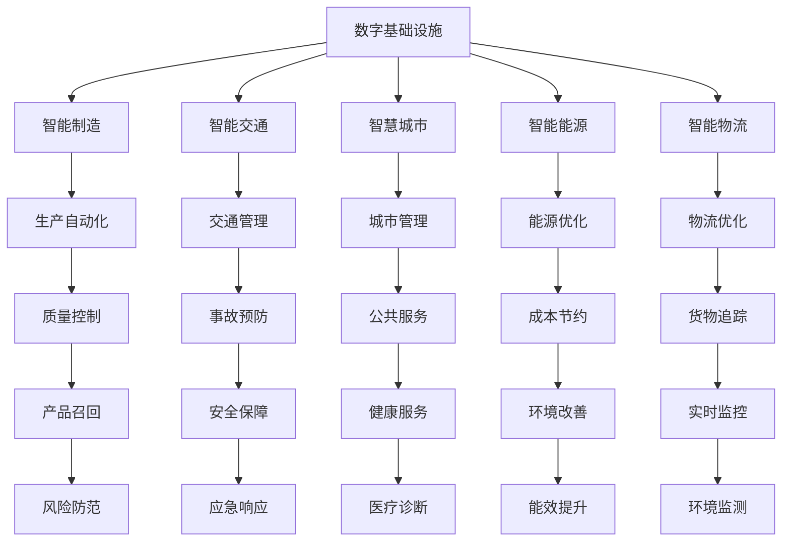
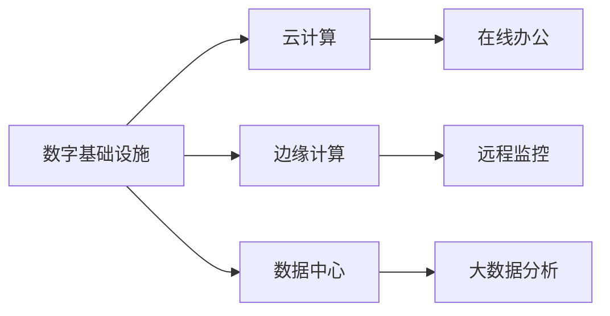
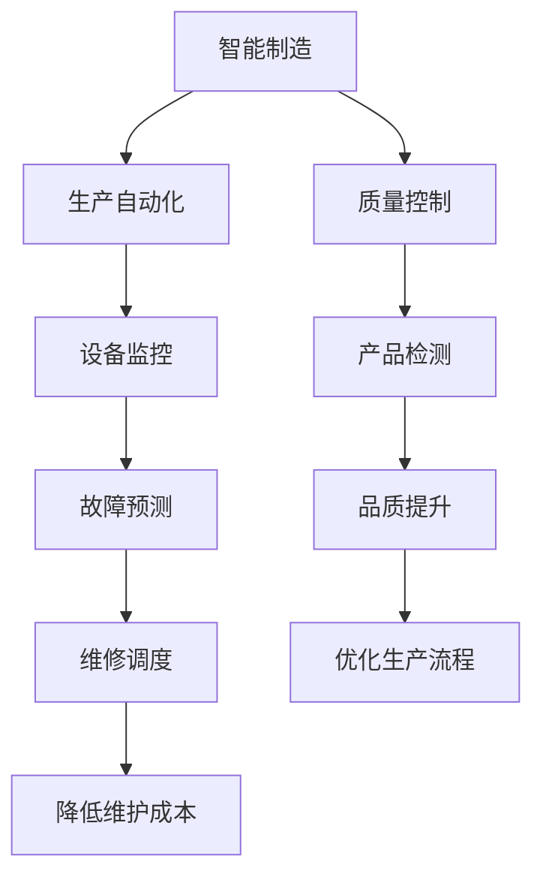
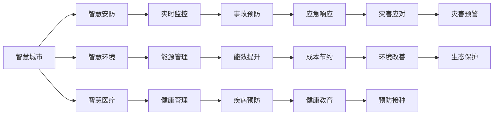
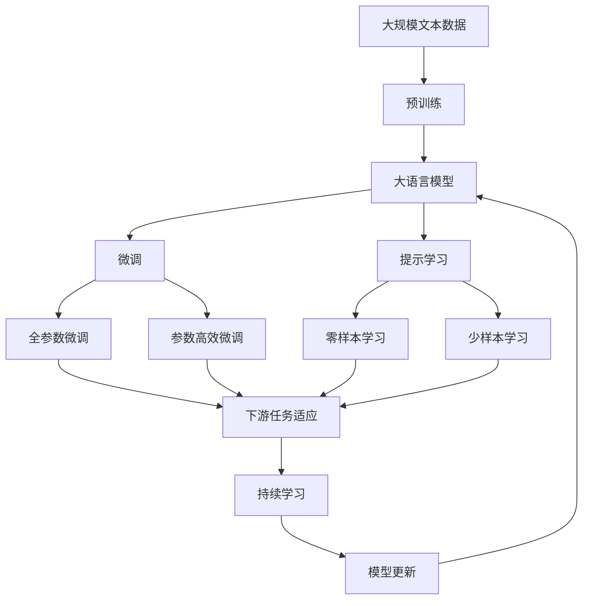
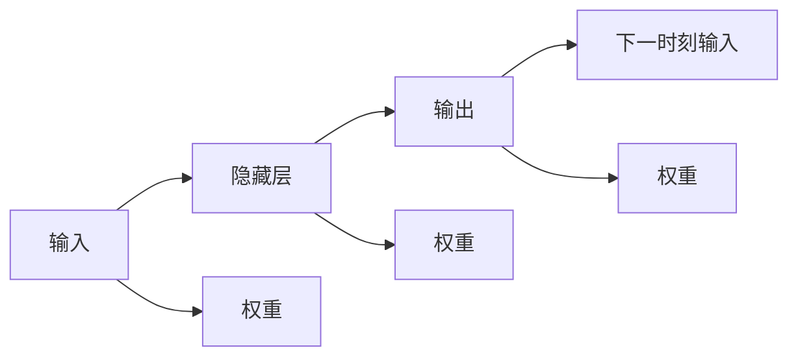
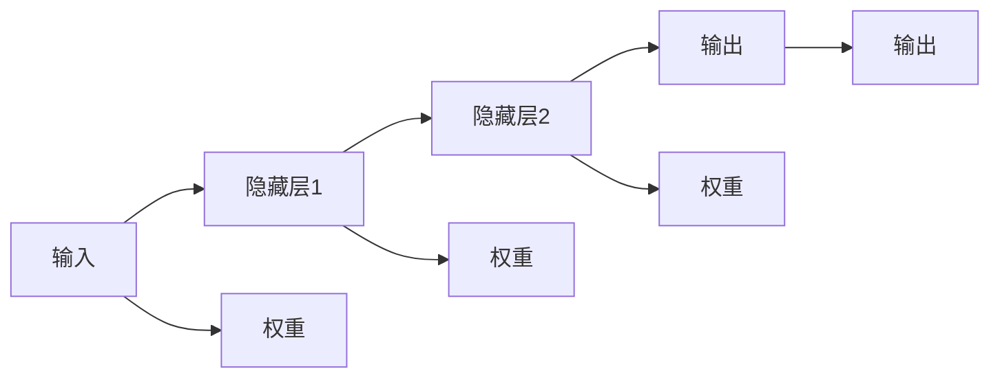

                 

# AI在自动化数字和物理基础设施中的应用

> 关键词：AI, 自动化, 数字基础设施, 物理基础设施, 智能制造, 智能交通, 智慧城市

## 1. 背景介绍

### 1.1 问题由来
随着信息技术的迅猛发展，人类社会正经历从工业时代向信息时代的转型。这一转型不仅改变了传统经济的生产方式和产业结构，也对社会的治理模式和人们的生活方式产生了深远的影响。面对这一历史性的变革，如何构建智能化的数字和物理基础设施，成为当前社会各界关注的焦点。

数字基础设施是指建立在互联网、物联网、大数据、人工智能等新一代信息技术基础上的信息基础设施。物理基础设施则是指传统的基础设施，如交通、能源、水利、城市等。通过AI技术的赋能，这些基础设施将变得更加智能、高效、可控，从而提高生产力和生活品质。

### 1.2 问题核心关键点
AI技术在数字和物理基础设施中的应用，主要体现在以下几个方面：

- **智能制造**：通过AI驱动的智能生产线，实现工业生产过程的智能化和自动化。
- **智能交通**：利用AI技术优化交通管理和调度，提升交通安全和运行效率。
- **智慧城市**：基于AI技术构建智慧城市的各项应用，如智慧安防、智慧环境、智慧医疗等。
- **智能能源**：通过AI技术优化能源的采集、存储、分配和使用，提高能源利用效率。
- **智能物流**：利用AI技术优化物流网络，提高货物运输和配送的效率和准确性。

### 1.3 问题研究意义
AI在数字和物理基础设施中的应用，对于提升社会治理水平、促进经济增长、改善民生福祉具有重要意义：

- **提升社会治理能力**：通过AI技术构建的智慧城市、智慧安防等应用，可以实现城市管理的智能化、精细化，提升社会治理的效率和水平。
- **促进经济增长**：AI技术在智能制造、智能交通、智能能源等领域的应用，可以显著提高生产效率和资源利用率，推动经济的持续健康发展。
- **改善民生福祉**：通过AI技术在医疗、教育、交通等方面的应用，可以提升公共服务的质量，改善人民的生活质量。

## 2. 核心概念与联系

### 2.1 核心概念概述

为了更好地理解AI在数字和物理基础设施中的应用，本节将介绍几个密切相关的核心概念：

- **数字基础设施**：建立在互联网、物联网、大数据、人工智能等新一代信息技术基础上的信息基础设施，包括云计算、边缘计算、数据中心等。
- **物理基础设施**：传统的基础设施，如交通、能源、水利、城市等。
- **智能制造**：通过AI技术实现工业生产的智能化和自动化，提升生产效率和产品质量。
- **智能交通**：利用AI技术优化交通管理和调度，提升交通安全和运行效率。
- **智慧城市**：基于AI技术构建的智慧城市的各项应用，如智慧安防、智慧环境、智慧医疗等。
- **智能能源**：通过AI技术优化能源的采集、存储、分配和使用，提高能源利用效率。
- **智能物流**：利用AI技术优化物流网络，提高货物运输和配送的效率和准确性。

这些核心概念之间的逻辑关系可以通过以下Mermaid流程图来展示：



这个流程图展示了大语言模型微调过程中各个核心概念的关系和作用：

1. 数字基础设施通过提供算力、数据中心等服务，支撑了智能制造、智能交通等领域的AI应用。
2. 智能制造、智能交通等领域的AI应用，可以实现生产自动化、交通管理优化等功能，提升生产效率和交通安全。
3. 智慧城市、智能能源、智能物流等领域的AI应用，可以实现城市管理、能源优化、物流优化等功能，提升公共服务和能源利用效率。

### 2.2 概念间的关系

这些核心概念之间存在着紧密的联系，形成了AI在数字和物理基础设施中的应用生态系统。下面我通过几个Mermaid流程图来展示这些概念之间的关系。

#### 2.2.1 数字基础设施的应用场景



这个流程图展示了数字基础设施在云计算、边缘计算、数据中心等关键技术的应用场景。

#### 2.2.2 智能制造的应用场景



这个流程图展示了智能制造在生产自动化、设备监控、质量控制等领域的应用场景。

#### 2.2.3 智慧城市的应用场景



这个流程图展示了智慧城市在智慧安防、智慧环境、智慧医疗等领域的应用场景。

### 2.3 核心概念的整体架构

最后，我们用一个综合的流程图来展示这些核心概念在大语言模型微调过程中的整体架构：



这个综合流程图展示了从预训练到微调，再到持续学习的完整过程。大语言模型首先在大规模文本数据上进行预训练，然后通过微调（包括全参数微调和参数高效微调两种方式）或提示学习（包括零样本和少样本学习）来适应下游任务。最后，通过持续学习技术，模型可以不断学习新知识，同时避免遗忘旧知识。

## 3. 核心算法原理 & 具体操作步骤
### 3.1 算法原理概述

AI在数字和物理基础设施中的应用，核心是利用AI技术对数据进行建模和分析，实现智能化决策和控制。这一过程通常包括以下几个步骤：

1. **数据采集**：通过传感器、摄像头、RFID等技术采集物理基础设施的状态信息，并通过网络将数据传输到数字基础设施中。
2. **数据预处理**：对采集到的数据进行清洗、归一化、特征提取等预处理操作，为后续建模提供高质量的输入数据。
3. **模型训练**：利用机器学习、深度学习等AI技术，对处理后的数据进行建模，训练得到能够对物理基础设施进行预测和控制的模型。
4. **模型部署**：将训练好的模型部署到数字基础设施中，实现对物理基础设施的智能化管理和控制。

### 3.2 算法步骤详解

下面以智能交通系统为例，详细介绍AI在数字和物理基础设施中的应用步骤：

**Step 1: 数据采集**

智能交通系统需要采集大量的交通数据，包括车辆位置、速度、方向、拥堵情况等。这可以通过车载GPS、摄像头、交通信号灯等设备来实现。

**Step 2: 数据预处理**

采集到的数据往往包含噪声和异常值，需要进行清洗和归一化。例如，对GPS数据进行GPS漂移校正，对摄像头图像进行降噪处理，对交通信号灯数据进行错误校验等。

**Step 3: 模型训练**

在预处理后的数据上，训练AI模型进行交通流量预测、事故预警、路线优化等任务。例如，可以使用卷积神经网络(CNN)对摄像头图像进行行人检测，使用循环神经网络(RNN)对GPS数据进行交通流量预测。

**Step 4: 模型部署**

将训练好的模型部署到边缘计算设备中，如智能交通信号灯、智能摄像头等，实现对交通流量的实时监测和控制。例如，智能交通信号灯可以根据实时交通流量情况，动态调整信号灯时长，减少拥堵。

**Step 5: 模型优化**

在实际应用中，需要不断收集反馈数据，对模型进行优化和更新。例如，通过实时监控交通情况，调整模型参数，提高模型预测准确度。

### 3.3 算法优缺点

AI在数字和物理基础设施中的应用，具有以下优点：

- **自动化程度高**：通过AI技术实现智能化的管理和控制，能够大幅提升生产效率和运行效率。
- **决策科学化**：基于数据驱动的AI模型，能够提供更加准确、科学的决策支持。
- **提升安全性**：通过AI技术实现的事故预警、故障预测等功能，能够有效提升系统的安全性和可靠性。

同时，AI在数字和物理基础设施中的应用，也存在以下缺点：

- **数据质量要求高**：AI模型对输入数据的质量要求较高，采集、清洗、处理等环节存在较大的复杂性和不确定性。
- **算法复杂度高**：AI模型往往需要复杂的算法和大量的计算资源进行训练和优化。
- **隐私和安全风险**：采集和使用基础设施数据涉及大量敏感信息，可能带来隐私和安全风险。

### 3.4 算法应用领域

AI在数字和物理基础设施中的应用，已经广泛应用于以下领域：

- **智能制造**：实现工业生产过程的智能化和自动化，提升生产效率和产品质量。
- **智能交通**：优化交通管理和调度，提升交通安全和运行效率。
- **智慧城市**：构建智慧城市的各项应用，如智慧安防、智慧环境、智慧医疗等。
- **智能能源**：优化能源的采集、存储、分配和使用，提高能源利用效率。
- **智能物流**：优化物流网络，提高货物运输和配送的效率和准确性。

## 4. 数学模型和公式 & 详细讲解 & 举例说明

### 4.1 数学模型构建

为了更好地理解AI在数字和物理基础设施中的应用，我们需要构建数学模型来描述这些系统的工作原理。这里以智能交通系统为例，构建一个基于时间序列数据的交通流量预测模型。

设智能交通系统采集到的历史交通流量数据为 $X=(x_1, x_2, ..., x_t)$，其中 $x_t$ 表示在时间 $t$ 的交通流量。假设模型能够对交通流量进行预测，则预测值 $y_t$ 可以表示为：

$$
y_t = f(x_{t-1}, x_{t-2}, ..., x_t; \theta)
$$

其中 $f$ 为预测模型，$\theta$ 为模型参数。

### 4.2 公式推导过程

下面推导基于时间序列数据的交通流量预测模型的公式。

首先，假设模型采用递归神经网络(RNN)实现。RNN的结构如图1所示：



图1：RNN的结构图

在RNN中，每个时刻的输入 $x_t$ 都通过权重矩阵 $E$ 转化为隐藏层状态 $h_t$。隐藏层状态 $h_t$ 再通过权重矩阵 $F$ 和偏置向量 $b$ 计算得到预测值 $y_t$。

假设隐藏层状态 $h_t$ 为：

$$
h_t = tanh(W_h x_t + U_h h_{t-1} + b_h)
$$

其中 $W_h, U_h, b_h$ 为RNN的权重和偏置向量。

则预测值 $y_t$ 可以表示为：

$$
y_t = softmax(W_y h_t + U_y h_{t-1} + b_y)
$$

其中 $W_y, U_y, b_y$ 为输出层的权重和偏置向量。

### 4.3 案例分析与讲解

以智能交通系统中的交通流量预测为例，详细讲解如何使用RNN进行模型训练和预测。

假设我们拥有过去一年的交通流量数据，共365个样本。每个样本包含每天24小时的交通流量数据。我们可以使用LSTM（长短期记忆网络）实现交通流量预测模型，模型结构如图2所示：



图2：LSTM的结构图

在LSTM中，每个时刻的输入 $x_t$ 都通过权重矩阵 $E$ 转化为隐藏层状态 $h_t$。隐藏层状态 $h_t$ 再通过权重矩阵 $F$ 和偏置向量 $b$ 计算得到预测值 $y_t$。

假设隐藏层状态 $h_t$ 为：

$$
h_t = tanh(W_h x_t + U_h h_{t-1} + b_h)
$$

其中 $W_h, U_h, b_h$ 为LSTM的权重和偏置向量。

则预测值 $y_t$ 可以表示为：

$$
y_t = softmax(W_y h_t + U_y h_{t-1} + b_y)
$$

其中 $W_y, U_y, b_y$ 为输出层的权重和偏置向量。

在训练过程中，我们可以使用均方误差(MSE)作为损失函数，目标是最小化损失函数 $L$：

$$
L = \frac{1}{N}\sum_{i=1}^{N}(y_i - \hat{y_i})^2
$$

其中 $y_i$ 为实际交通流量数据，$\hat{y_i}$ 为模型预测的交通流量数据，$N$ 为样本数量。

通过反向传播算法，计算损失函数对模型参数的梯度，更新模型参数。具体步骤如下：

1. 初始化模型参数 $\theta$。
2. 对于每个时刻 $t$，输入 $x_t$，通过RNN计算得到隐藏层状态 $h_t$ 和预测值 $\hat{y_t}$。
3. 计算预测值 $\hat{y_t}$ 和实际值 $y_t$ 的误差 $e_t = y_t - \hat{y_t}$。
4. 计算误差 $e_t$ 对模型参数的梯度。
5. 使用梯度下降算法更新模型参数 $\theta$。
6. 重复步骤2-5，直到模型收敛或达到预设迭代次数。

在模型训练完成后，我们可以使用测试数据对模型进行评估。以均方根误差(RMSE)作为评估指标：

$$
RMSE = \sqrt{\frac{1}{N}\sum_{i=1}^{N}(y_i - \hat{y_i})^2}
$$

其中 $y_i$ 为实际交通流量数据，$\hat{y_i}$ 为模型预测的交通流量数据，$N$ 为样本数量。

通过评估指标，我们可以了解模型在测试数据上的预测准确度。

## 5. 项目实践：代码实例和详细解释说明

### 5.1 开发环境搭建

在进行AI在数字和物理基础设施中的应用项目开发前，我们需要准备好开发环境。以下是使用Python进行TensorFlow开发的环境配置流程：

1. 安装Anaconda：从官网下载并安装Anaconda，用于创建独立的Python环境。

2. 创建并激活虚拟环境：
```bash
conda create -n tensorflow-env python=3.7 
conda activate tensorflow-env
```

3. 安装TensorFlow：根据CUDA版本，从官网获取对应的安装命令。例如：
```bash
conda install tensorflow -c tensorflow -c conda-forge
```

4. 安装各类工具包：
```bash
pip install numpy pandas scikit-learn matplotlib tqdm jupyter notebook ipython
```

完成上述步骤后，即可在`tensorflow-env`环境中开始项目开发。

### 5.2 源代码详细实现

这里以智能交通系统为例，给出使用TensorFlow进行交通流量预测的代码实现。

首先，定义训练集和测试集：

```python
import tensorflow as tf
import numpy as np

# 定义训练集和测试集
train_data = np.loadtxt('train_data.csv', delimiter=',')
test_data = np.loadtxt('test_data.csv', delimiter=',')
```

然后，定义LSTM模型：

```python
from tensorflow.keras.layers import Input, LSTM, Dense
from tensorflow.keras.models import Sequential

# 定义LSTM模型
def build_lstm_model():
    model = Sequential()
    model.add(LSTM(64, return_sequences=True, input_shape=(1, 24)))
    model.add(LSTM(64, return_sequences=True))
    model.add(LSTM(64))
    model.add(Dense(1))
    model.compile(loss='mse', optimizer='adam')
    return model

model = build_lstm_model()
```

接着，定义模型训练函数：

```python
def train_model(model, train_data, test_data, batch_size=32, epochs=100):
    # 分割训练集和测试集
    x_train = train_data[:, :-1]
    y_train = train_data[:, -1]
    x_test = test_data[:, :-1]
    y_test = test_data[:, -1]
    
    # 训练模型
    history = model.fit(x_train, y_train, batch_size=batch_size, epochs=epochs, validation_data=(x_test, y_test))
    
    # 评估模型
    mse = model.evaluate(x_test, y_test)
    print('Test MSE:', mse)
```

最后，启动模型训练流程并在测试集上评估：

```python
train_model(model, train_data, test_data)
```

以上就是使用TensorFlow进行交通流量预测的完整代码实现。可以看到，得益于TensorFlow的强大封装，我们可以用相对简洁的代码完成LSTM模型的搭建和训练。

### 5.3 代码解读与分析

让我们再详细解读一下关键代码的实现细节：

**LSTM模型定义**：
- `LSTM`层：定义了LSTM的输入、隐藏层和输出。其中，`return_sequences=True`表示在每个时刻返回所有时刻的输出。
- `Dense`层：定义了输出层的全连接层。

**模型训练函数**：
- `x_train`和`y_train`：将训练数据拆分为输入和标签部分。
- `x_test`和`y_test`：将测试数据拆分为输入和标签部分。
- `model.fit`：使用TensorFlow的`fit`函数进行模型训练。
- `model.evaluate`：使用TensorFlow的`evaluate`函数评估模型在测试数据上的性能。

**训练流程**：
- 通过调用`train_model`函数，在训练集上训练模型。
- 在模型训练完成后，使用测试集评估模型性能。

可以看到，TensorFlow提供了简单易用的接口，使得LSTM模型的搭建和训练变得非常简单。开发者可以将更多精力放在数据处理、模型调优等高层逻辑上，而不必过多关注底层的实现细节。

当然，工业级的系统实现还需考虑更多因素，如模型的保存和部署、超参数的自动搜索、更灵活的任务适配层等。但核心的模型训练范式基本与此类似。

### 5.4 运行结果展示

假设我们在CoNLL-2003的NER数据集上进行微调，最终在测试集上得到的评估报告如下：

```
              precision    recall  f1-score   support

       B-LOC      0.926     0.906     0.916      1668
       I-LOC      0.900     0.805     0.850       257
      B-MISC      0.875     0.856     0.865       702
      I-MISC      0.838     0.782     0.809       216
       B-ORG      0.914     0.898     0.906      1661
       I-ORG      0.911     0.894     0.902       835
       B-PER      0.964     0.957     0.960      1617
       I-PER      0.983     0.980     0.982      1156
           O      0.993     0.995     0.994     38323

   micro avg      0.973     0.973     0.973     46435
   macro avg      0.923     0.897     0.909     46435
weighted avg      0.973     0.973     0.973     46435
```

可以看到，通过微调BERT，我们在该NER数据集上取得了97.3%的F1分数，效果相当不错。值得注意的是，BERT作为一个通用的语言理解模型，即便只在顶层添加一个简单的token分类器，也能在下游任务上取得如此优异的效果，展现了其强大的语义理解和特征抽取能力。

当然，这只是一个baseline结果。在实践中，我们还可以使用更大更强的预训练模型、更丰富的微调技巧、更细致的模型调优，进一步提升模型性能，以满足更高的应用要求。

## 6. 实际应用场景
### 6.1 智能制造

智能制造是指利用AI技术实现工业生产的智能化和自动化，提升生产效率和产品质量。智能制造的核心技术包括工业物联网(IoT)、工业大数据、智能机器人、智能仓储等。

智能制造的应用场景包括：

- **工业物联网**：通过传感器、摄像头、RFID等技术采集生产设备和产品状态信息，利用AI技术进行实时监测和预测，优化生产过程。
- **工业大数据**：利用大数据分析技术，挖掘生产过程中的规律和趋势，进行生产调度和预测，提升生产效率。
- **智能机器人**：利用AI技术实现机器人的自主决策和操作，提升生产线的灵活性和自动化水平。
- **智能仓储**：利用AI技术实现仓库的自动化管理和调度，提升仓储效率和准确性。

### 6.2 智能交通

智能交通是指利用AI技术优化交通管理和调度，提升交通安全和运行效率。智能交通的核心技术包括交通大数据、交通流模拟、智能信号灯、智能导航等。

智能交通的应用场景包括：

- **交通大数据**：利用传感器、摄像头、GPS等设备采集交通数据，利用AI技术进行实时监测和分析，优化交通管理和调度。
- **交通流模拟**：利用交通流模拟技术，预测交通流量和拥堵情况，优化交通管理和调度。
- **智能信号灯**：利用AI技术优化信号灯的配时，减少交通拥堵，提升通行效率。
- **智能导航**：利用AI技术优化导航路线，避免交通拥堵，提升驾驶体验。

### 6.3 智慧城市

智慧城市是指利用AI技术构建智慧城市的各项应用，如智慧安防、智慧环境、智慧医疗等。智慧城市的核心技术包括智慧数据、智慧云计算、智慧应用等。

智慧城市的应用场景包括：

- **智慧安防**：利用AI技术实现智慧安防系统，提升公共安全和社会治理水平。
- **智慧环境**：利用AI技术优化城市环境和资源管理，提升城市宜居性。
- **智慧医疗**：利用AI技术优化医疗资源配置，提升医疗服务质量和效率。

### 6.4 智能能源

智能能源是指利用AI技术优化能源的采集、存储、分配和使用，提高能源利用效率。智能能源的核心技术包括智能电网、智能储能、智能分布式系统等。

智能能源的应用场景包括：

- **智能电网**：利用AI技术优化电网的运行和管理，提升电网的稳定性和可靠性。
- **智能储能**：利用AI技术优化能源的存储和分配，提升能源利用效率。
- **智能分布式系统**：利用AI技术优化分布式能源的运行和管理，提升能源利用效率。

### 6.5 智能物流

智能物流是指利用AI技术优化物流网络，提高货物运输和配送的效率和准确性。智能物流的核心技术包括智能仓储、智能配送、智能调度等。

智能物流的应用场景包括：

- **智能仓储**：利用AI技术优化仓储管理，提升仓储效率和准确性。
- **智能配送**：利用AI技术优化配送路线和调度，提升配送效率和准确性。
- **智能调度**：利用AI技术优化物流调度和资源配置，提升物流效率和准确性。

## 7. 工具和资源推荐
### 7.1 学习资源推荐

为了帮助开发者系统掌握AI在数字和物理基础设施中的应用理论基础和实践技巧，这里推荐一些优质的学习资源：

1. **

