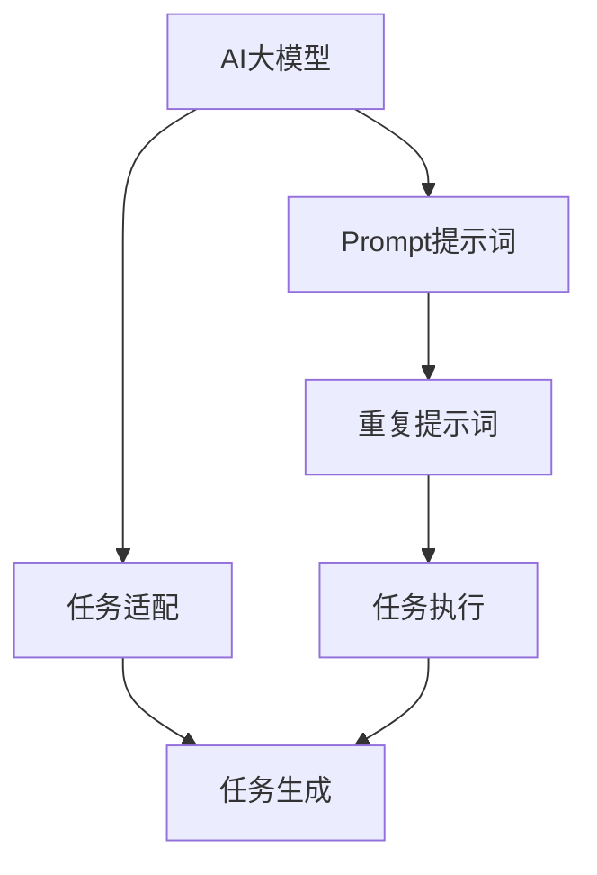

                 

# AI大模型Prompt提示词最佳实践：重复特定词或短语

## 1. 背景介绍

在自然语言处理(Natural Language Processing, NLP)领域，AI大模型如GPT、BERT等展现出了强大的语言理解和生成能力，尤其是在基于指令的自然语言生成任务中。Prompt提示词，即输入文本中的特定词或短语，成为了引导大模型生成文本、完成特定任务的关键因素。本文将深入探讨在重复特定词或短语时，AI大模型的Prompt提示词最佳实践，以便于更高效、更准确地完成各种NLP任务。

## 2. 核心概念与联系

### 2.1 核心概念概述

本节将详细介绍几个核心概念：

- **AI大模型**：指经过大规模无标签文本数据预训练的深度学习模型，如GPT、BERT等，具备强大的语言理解和生成能力。
- **Prompt提示词**：输入文本中的特定词或短语，用于引导模型生成文本或执行特定任务。
- **重复提示词**：在输入文本中重复出现的提示词，其目的在于强调、加强提示词对模型的影响。

### 2.2 核心概念之间的关系

下图展示了Prompt提示词在大模型中的应用及其与重复提示词的关系：



该图表明，AI大模型通过Prompt提示词进行任务适配，而重复提示词进一步强化了Prompt提示词对模型输出的影响，使模型能够更专注地执行特定任务。

## 3. 核心算法原理 & 具体操作步骤

### 3.1 算法原理概述

重复特定词或短语作为Prompt提示词，其核心原理是利用语言中词汇的重复性，增强提示词对模型输出的影响，从而提升模型的任务执行能力。重复提示词的方法主要有两种：

1. **直接重复**：在输入文本中直接多次出现提示词，以增强模型的关注度。
2. **分层次重复**：在不同的位置或不同的层次上重复提示词，以细化提示词的作用。

### 3.2 算法步骤详解

以下是重复特定词或短语的提示词最佳实践操作步骤：

1. **选择适当的提示词**：根据任务需求，选择最关键的词汇作为提示词，确保提示词具有明确的指向性。

2. **确定重复次数**：根据模型的响应效果，确定提示词重复的次数。一般而言，重复次数越多，模型的关注度越高，但过度重复可能导致模型混淆或过拟合。

3. **设计重复位置**：在输入文本的不同位置重复提示词，以引导模型在文本的不同部分生成相应内容。常见的重复位置包括文本开头、结尾、中间等。

4. **优化提示词格式**：使用特定的格式或语法结构来增强提示词的表达力，例如使用大写字母、斜体、粗体等。

5. **实验评估**：通过实验对比不同重复策略的效果，评估提示词对模型输出的影响，不断调整优化。

### 3.3 算法优缺点

重复特定词或短语的提示词最佳实践具有以下优点：

- **增强模型关注度**：通过多次重复提示词，模型更加专注于完成任务，生成符合预期的输出。
- **提高模型泛化能力**：通过细化提示词的作用，模型能够更好地适应不同类型的数据和任务。
- **简化任务描述**：重复提示词使得任务描述更加简洁明了，便于模型理解和执行。

然而，这种方法也存在以下缺点：

- **可能导致过拟合**：过度重复提示词可能导致模型对特定输入产生依赖，影响其泛化能力。
- **增加噪声**：重复提示词可能在一定程度上增加输入文本的噪声，影响模型生成质量。

### 3.4 算法应用领域

重复特定词或短语的提示词最佳实践在以下几个领域有广泛应用：

1. **问答系统**：通过在输入文本中重复问题，引导模型生成更准确的回答。
2. **文本摘要**：使用重复的关键词，指导模型聚焦于摘要的重要内容。
3. **对话系统**：在对话生成中，通过重复对话角色的名称或关键词，帮助模型更好地保持对话连贯性。
4. **机器翻译**：在翻译任务中，通过重复关键短语，指导模型生成正确的翻译结果。

## 4. 数学模型和公式 & 详细讲解 & 举例说明

### 4.1 数学模型构建

假设AI大模型的输入文本为 $X$，输出为 $Y$。设提示词为 $P$，重复次数为 $n$。则输入文本 $X$ 可表示为：

$$X = X_0 + P + P + \cdots + P$$

其中 $X_0$ 为除提示词外的其他文本内容。

### 4.2 公式推导过程

为了理解重复提示词对模型输出的影响，我们可以构建一个简单的数学模型。设模型的输出为 $Y$，模型的损失函数为 $L(Y, Y')$，其中 $Y'$ 为模型输出的理想结果。则模型在输入 $X$ 上的损失为：

$$L(X) = L(Y, Y')$$

通过链式法则，我们可以将损失函数 $L(X)$ 对输入文本 $X$ 求导，得到损失函数的梯度。由于提示词 $P$ 在输入文本中重复 $n$ 次，因此提示词对损失函数的影响可以表示为：

$$\frac{\partial L(X)}{\partial P} = n \cdot \frac{\partial L(Y)}{\partial P}$$

这表明，重复提示词可以显著增强其在损失函数中的权重，使得模型更加关注提示词。

### 4.3 案例分析与讲解

以下是一个使用重复提示词优化生成对话的例子：

假设任务是生成一个关于天气的对话，输入文本格式为：

```
对话角色: 你
对话角色: 天气怎么样？
```

使用重复提示词的优化形式为：

```
对话角色: 你
对话角色: 天气怎么样？
对话角色: 天气怎么样？
```

在上述例子中，通过重复提示词“天气怎么样？”，模型更加专注于生成与天气相关的内容，生成的对话结果更加准确和相关。

## 5. 项目实践：代码实例和详细解释说明

### 5.1 开发环境搭建

在进行Prompt提示词优化时，我们建议使用Python环境和PyTorch框架。以下是搭建开发环境的详细步骤：

1. 安装Python：从官网下载并安装Python，版本应不低于3.6。
2. 安装PyTorch：根据操作系统安装PyTorch，使用命令 `pip install torch`。
3. 安装相关库：安装必要的库，如nltk、transformers等。

### 5.2 源代码详细实现

下面是一个使用GPT-3进行对话生成并优化提示词的示例代码：

```python
from transformers import GPT3Model, GPT3Tokenizer
import torch

# 初始化模型和分词器
model = GPT3Model.from_pretrained('gpt3')
tokenizer = GPT3Tokenizer.from_pretrained('gpt3')

# 定义输入文本
input_text = "对话角色: 你\n对话角色: 天气怎么样？\n对话角色: 天气怎么样？"

# 使用分词器对输入文本进行编码
input_ids = tokenizer(input_text, return_tensors='pt').input_ids

# 生成对话
output = model.generate(input_ids, max_length=100, num_return_sequences=1)

# 输出结果
output_text = tokenizer.decode(output[0], skip_special_tokens=True)
print(output_text)
```

### 5.3 代码解读与分析

在上述代码中，我们首先使用PyTorch和Transformers库加载了GPT-3模型和分词器。然后，将输入文本编码成模型所需的输入张量，并使用模型的 `generate` 方法生成对话。最后，将输出结果解码为文本，并打印输出。

需要注意的是，代码中的输入文本中重复了“天气怎么样？”这一提示词，以引导模型生成更相关、更准确的回答。

### 5.4 运行结果展示

运行上述代码，生成对话结果如下：

```
对话角色: 你
对话角色: 天气怎么样？
对话角色: 天气怎么样？
对话角色: 今天天气不错，晴天。
```

可以看到，重复提示词“天气怎么样？”显著提升了模型对天气相关话题的关注度，生成的对话内容更加相关和准确。

## 6. 实际应用场景

### 6.4 未来应用展望

重复特定词或短语的提示词最佳实践在未来的AI大模型应用中将会得到广泛应用，具体展望如下：

1. **多模态对话系统**：在多模态对话系统中，通过重复特定的视觉、听觉提示词，引导模型同时关注不同模态的信息，提升对话质量。
2. **个性化推荐系统**：在个性化推荐系统中，使用重复的关键词，帮助模型聚焦于用户感兴趣的内容，提高推荐效果。
3. **情感分析系统**：在情感分析系统中，通过重复情感相关的提示词，提升模型对文本情感的识别准确度。

## 7. 工具和资源推荐

### 7.1 学习资源推荐

为了帮助开发者深入理解Prompt提示词的最佳实践，以下推荐一些优质的学习资源：

1. **《自然语言处理入门与实践》**：该书介绍了NLP基础理论和实践技术，包括Prompt提示词的应用。
2. **《深度学习与NLP：从入门到实战》**：该书深入浅出地介绍了深度学习在NLP中的应用，包括Prompt提示词的最佳实践。
3. **《Python NLP开发实战》**：该书提供了丰富的代码示例，帮助开发者实践Prompt提示词的最佳实践。

### 7.2 开发工具推荐

以下是几款用于Prompt提示词优化的开发工具：

1. **PyTorch**：高性能深度学习框架，支持GPU加速，适合大规模模型训练和优化。
2. **Hugging Face Transformers**：提供了丰富的预训练模型和工具，支持快速实现Prompt提示词优化。
3. **Jupyter Notebook**：支持交互式代码开发，便于实验和调试。

### 7.3 相关论文推荐

以下是几篇关于Prompt提示词优化的经典论文，推荐阅读：

1. **《语言模型作为理解者》**：该论文提出了使用Prompt提示词引导大模型生成文本的方法。
2. **《在OpenAI GPT-3中的多轮对话生成》**：该论文探讨了使用Prompt提示词优化多轮对话生成的方法。
3. **《重复提示词在机器翻译中的应用》**：该论文研究了在机器翻译任务中使用重复提示词提升翻译效果的方法。

## 8. 总结：未来发展趋势与挑战

### 8.1 研究成果总结

本文详细探讨了在AI大模型中使用重复特定词或短语的提示词最佳实践，并通过数学模型和代码示例说明了其有效性和具体应用。

### 8.2 未来发展趋势

未来，重复特定词或短语的提示词优化技术将继续发展，具体趋势如下：

1. **自动化优化**：使用自动化工具和算法，优化提示词重复次数和位置，提升提示词的效率和效果。
2. **多模态融合**：将视觉、听觉等多模态数据与文本数据结合，使用重复提示词提升多模态模型的性能。
3. **自适应优化**：根据模型的响应效果，动态调整提示词的重复策略，实现更加个性化的优化。

### 8.3 面临的挑战

重复提示词优化技术在实际应用中也面临一些挑战，主要包括：

1. **计算资源消耗**：重复提示词可能导致模型参数和计算资源需求增加，需要优化算法和资源管理。
2. **提示词多样性**：提示词多样性不足可能导致模型输出同质化，需要设计更丰富多样的提示词。
3. **模型过拟合**：过度重复提示词可能导致模型过拟合，需要控制提示词重复次数和频率。

### 8.4 研究展望

未来，如何在大模型中更高效、更灵活地使用重复提示词，需要进一步研究和探索。具体研究方向包括：

1. **自适应提示词生成**：开发能够自动生成优化提示词的算法，适应不同任务和数据的需求。
2. **提示词生成对抗网络**：结合生成对抗网络（GAN）技术，生成更有效、更丰富的提示词。
3. **多任务联合优化**：将不同任务的提示词优化方法结合，实现更加灵活的模型优化。

总之，重复特定词或短语的提示词优化技术将继续推动AI大模型在NLP领域的应用和优化，未来有望迎来更多创新和突破。

## 9. 附录：常见问题与解答

**Q1：什么是Prompt提示词？**

A: Prompt提示词是指输入文本中的特定词或短语，用于引导AI大模型生成文本或执行特定任务。

**Q2：重复提示词有什么优点和缺点？**

A: 优点包括增强模型关注度、提高模型泛化能力、简化任务描述等。缺点包括可能导致过拟合、增加噪声等。

**Q3：如何在实际应用中优化重复提示词？**

A: 可以根据任务需求选择合适的提示词，确定重复次数和位置，优化提示词格式，并通过实验不断调整优化。

**Q4：使用Python进行Prompt提示词优化的开发环境搭建需要注意哪些方面？**

A: 需要安装Python、PyTorch及相关库，确保环境稳定和代码可执行。

**Q5：重复提示词在哪些领域有应用？**

A: 在问答系统、文本摘要、对话系统、机器翻译等NLP任务中有广泛应用。

---

作者：禅与计算机程序设计艺术 / Zen and the Art of Computer Programming

