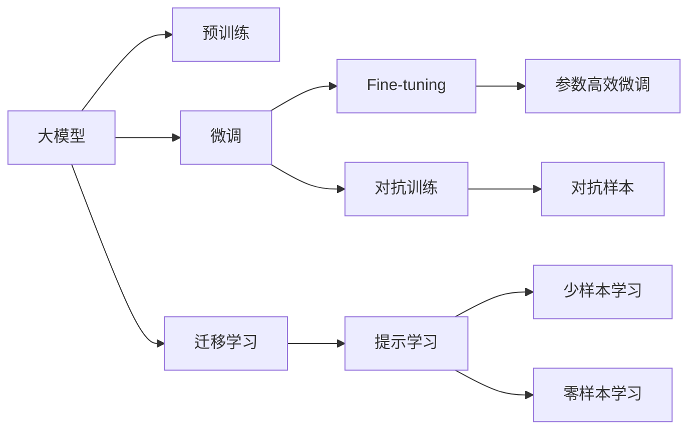

                 

# AI大模型创业战：挑战与机遇并存的未来展望

## 1. 背景介绍

### 1.1 问题由来
近年来，随着人工智能技术的迅猛发展，大模型（Large Models）以其在语言理解、图像识别、自然语言处理等领域的卓越表现，迅速成为各行业竞争的关键要素。从谷歌的BERT、OpenAI的GPT-3，到百度的ERNIE，大模型技术在各个领域都显现出了强大的潜力。大模型不仅能帮助企业快速提升技术壁垒，还能为企业在数据驱动的竞争中占据先机。

### 1.2 问题核心关键点
大模型的创业机会源于其强大的算法基础、庞大的数据驱动和高效的计算资源支持。然而，在具体落地应用过程中，企业也面临众多挑战：如算法复杂性高、数据获取困难、训练和推理成本高等。本文旨在探讨大模型创业战的挑战与机遇，为有志于在人工智能领域创业的读者提供深度思考与洞见。

### 1.3 问题研究意义
探索大模型创业的挑战与机遇，对于企业来说，有助于理解当前AI技术的发展方向和潜在风险，同时发现新的创业机会和竞争优势。对于行业来说，有助于推动AI技术的普及和应用，促进产业升级和技术进步。

## 2. 核心概念与联系

### 2.1 核心概念概述

为了更好地理解大模型的创业前景与挑战，本节将介绍几个核心概念：

- **大模型（Large Models）**：指那些具有数十亿甚至数百亿参数的大型神经网络模型，能够通过预训练学习到广泛的知识，并在下游任务上进行微调，获得卓越的性能。

- **预训练（Pre-training）**：指在大量无标签数据上对模型进行训练，使其能够学习到通用的特征表示。预训练是大模型技术的关键步骤，通常需要高性能的GPU或TPU进行计算。

- **微调（Fine-tuning）**：指在大模型的基础上，通过有标签数据进行特定任务的训练，以提升模型在该任务上的性能。微调是实现大模型实用化的关键过程。

- **迁移学习（Transfer Learning）**：指在大模型上进行特定任务的微调，使得模型能够跨领域应用，提升泛化能力。

- **参数高效微调（Parameter-Efficient Fine-tuning）**：指在微调过程中，只更新小部分模型参数，以减少计算资源和时间的消耗。

- **提示学习（Prompt Learning）**：通过精心设计的输入模板，引导大模型进行推理，减少微调所需的参数和计算资源。

- **对抗训练（Adversarial Training）**：在微调过程中引入对抗样本，提高模型的鲁棒性和泛化能力。

### 2.2 概念间的关系

这些核心概念之间紧密联系，共同构成了大模型创业的完整生态系统。通过以下Mermaid流程图，展示这些概念之间的联系：



该流程图展示了从预训练到微调，再到迁移学习的过程，以及如何通过参数高效微调和对抗训练等技术优化模型的性能，以及提示学习如何在不更新模型参数的情况下提升模型的推理能力。

## 3. 核心算法原理 & 具体操作步骤
### 3.1 算法原理概述
大模型的创业机会源自其强大的算法基础和巨大的计算需求。预训练模型通过在大规模无标签数据上学习到通用的特征表示，这些特征可以在下游任务上进行微调，以提升模型在该任务上的性能。例如，GPT-3等模型在自然语言处理（NLP）任务上，如文本分类、情感分析、机器翻译等，取得了显著的效果。

### 3.2 算法步骤详解
大模型的创业战涉及以下几个关键步骤：

1. **数据收集与预处理**：收集与业务相关的大量数据，并进行清洗和标注。数据的质量和多样性直接影响模型的性能。
   
2. **模型选择与初始化**：选择合适的预训练模型（如BERT、GPT-3等），并对其进行初始化。初始化的方式通常是固定部分层的权重，仅更新顶层权重。

3. **微调与优化**：在标注数据集上进行微调，通过优化算法（如AdamW、SGD等）对模型进行更新，以最小化预测误差。

4. **评估与部署**：在验证集上评估微调后的模型性能，并将模型部署到实际应用中。

### 3.3 算法优缺点
大模型创业的优势在于其强大的算法基础和广泛的应用场景。然而，其劣势也显而易见：

- **优势**：
  - **强大的算法基础**：大模型具有庞大的参数量和先进的架构，能够处理复杂的任务。
  - **广泛的应用场景**：几乎所有领域都可以应用大模型，如金融、医疗、教育等。
  - **高效的训练与推理**：利用分布式训练和推理技术，能够大幅度提升效率。

- **劣势**：
  - **高昂的计算资源需求**：大模型的训练和推理需要大量的计算资源，如GPU、TPU等。
  - **数据依赖性强**：模型的性能依赖于高质量的数据集，数据获取和标注成本高昂。
  - **复杂度高**：模型训练和微调过程复杂，需要专业的技术团队进行维护。

### 3.4 算法应用领域
大模型的创业机会主要集中在以下几个领域：

1. **自然语言处理（NLP）**：文本分类、情感分析、机器翻译、问答系统等。

2. **计算机视觉**：图像识别、视频分析、图像生成等。

3. **智能推荐**：推荐系统、广告投放、内容推荐等。

4. **智能客服**：自动回复、情感分析、客户理解等。

5. **智能医疗**：医学影像分析、疾病诊断、健康监测等。

6. **金融科技**：信用评估、风险控制、交易策略等。

7. **智能制造**：生产调度、质量检测、设备维护等。

## 4. 数学模型和公式 & 详细讲解 & 举例说明
### 4.1 数学模型构建
以BERT为例，BERT的数学模型可以表示为：

$$
P(\text{target}|\text{source}) = \text{softmax}(\text{MLP}(\text{CLS}(\text{Self-Attention}(\text{Transformer})(x_\text{input})))
$$

其中，$x_\text{input}$ 为输入序列，$\text{Self-Attention}$ 为自注意力机制，$\text{MLP}$ 为多层感知器，$\text{CLS}$ 为句子表示层，$\text{softmax}$ 为输出概率层。

### 4.2 公式推导过程
BERT的训练过程主要包括自监督预训练和下游任务的微调。

自监督预训练的损失函数为：

$$
\mathcal{L}_\text{pre-train} = -\frac{1}{N}\sum_{i=1}^N \sum_{j=1}^M log\, P(\text{target}_j | \text{source})
$$

其中，$M$ 为掩码的标记数。

下游任务的微调损失函数为：

$$
\mathcal{L}_\text{fine-tune} = -\frac{1}{N}\sum_{i=1}^N \sum_{j=1}^M log\, P(\text{target}_j | \text{source})
$$

通过优化算法（如AdamW），不断更新模型参数 $\theta$，以最小化损失函数 $\mathcal{L}$。

### 4.3 案例分析与讲解
以情感分析任务为例，使用BERT模型进行微调。首先，将标注好的情感数据集作为微调数据集，通过微调优化损失函数，调整模型参数，最终得到在情感分析任务上的最优模型。

## 5. 项目实践：代码实例和详细解释说明
### 5.1 开发环境搭建

在进行大模型微调项目实践前，需要准备以下开发环境：

1. 安装Anaconda：从官网下载并安装Anaconda，用于创建独立的Python环境。

2. 创建并激活虚拟环境：
```bash
conda create -n pytorch-env python=3.8 
conda activate pytorch-env
```

3. 安装PyTorch：根据CUDA版本，从官网获取对应的安装命令。例如：
```bash
conda install pytorch torchvision torchaudio cudatoolkit=11.1 -c pytorch -c conda-forge
```

4. 安装Transformers库：
```bash
pip install transformers
```

5. 安装各类工具包：
```bash
pip install numpy pandas scikit-learn matplotlib tqdm jupyter notebook ipython
```

### 5.2 源代码详细实现

以下是一个简单的Python代码示例，使用HuggingFace库对BERT模型进行情感分析任务的微调：

```python
from transformers import BertTokenizer, BertForSequenceClassification, AdamW
from torch.utils.data import Dataset, DataLoader
from torch import nn, optim

# 数据处理
class SentimentDataset(Dataset):
    def __init__(self, texts, labels):
        self.texts = texts
        self.labels = labels
        self.tokenizer = BertTokenizer.from_pretrained('bert-base-uncased')

    def __len__(self):
        return len(self.texts)

    def __getitem__(self, index):
        text = self.texts[index]
        label = self.labels[index]
        encoding = self.tokenizer(text, return_tensors='pt', max_length=128, padding='max_length', truncation=True)
        return {'input_ids': encoding['input_ids'], 'attention_mask': encoding['attention_mask'], 'labels': torch.tensor(label, dtype=torch.long)}

# 模型定义
model = BertForSequenceClassification.from_pretrained('bert-base-uncased', num_labels=2)
device = 'cuda' if torch.cuda.is_available() else 'cpu'
model.to(device)

# 定义损失函数和优化器
loss_fn = nn.CrossEntropyLoss()
optimizer = AdamW(model.parameters(), lr=2e-5)

# 微调过程
def fine_tune(model, train_loader, val_loader, num_epochs, batch_size, learning_rate):
    model.train()
    for epoch in range(num_epochs):
        for batch in train_loader:
            input_ids = batch['input_ids'].to(device)
            attention_mask = batch['attention_mask'].to(device)
            labels = batch['labels'].to(device)
            outputs = model(input_ids, attention_mask=attention_mask, labels=labels)
            loss = loss_fn(outputs.logits, labels)
            optimizer.zero_grad()
            loss.backward()
            optimizer.step()

        # 在验证集上评估模型性能
        model.eval()
        val_loss = 0
        val_correct = 0
        for batch in val_loader:
            with torch.no_grad():
                input_ids = batch['input_ids'].to(device)
                attention_mask = batch['attention_mask'].to(device)
                labels = batch['labels'].to(device)
                outputs = model(input_ids, attention_mask=attention_mask)
                val_loss += loss_fn(outputs.logits, labels).item()
                val_correct += (outputs.logits.argmax(dim=1) == labels).to(device).float().sum().item()

        val_loss /= len(val_loader)
        val_correct /= len(val_loader.dataset)
        print(f'Epoch {epoch+1}, val loss: {val_loss:.4f}, val acc: {val_correct:.4f}')

# 启动微调
train_dataset = SentimentDataset(train_texts, train_labels)
val_dataset = SentimentDataset(val_texts, val_labels)
test_dataset = SentimentDataset(test_texts, test_labels)
train_loader = DataLoader(train_dataset, batch_size=batch_size, shuffle=True)
val_loader = DataLoader(val_dataset, batch_size=batch_size)
test_loader = DataLoader(test_dataset, batch_size=batch_size)

fine_tune(model, train_loader, val_loader, num_epochs, batch_size, learning_rate)
```

### 5.3 代码解读与分析

在上述代码中，我们通过以下几个步骤实现对BERT模型的微调：

1. 定义数据集和预处理函数，将文本和标签转换为BERT模型所需的格式。

2. 定义BERT模型和优化器，选择AdamW作为优化器，设置学习率为2e-5。

3. 定义损失函数为交叉熵损失，在训练过程中使用该损失函数计算预测与真实标签之间的误差。

4. 在训练循环中，将输入数据送入模型，计算损失并反向传播更新模型参数。

5. 在验证集上评估模型性能，并打印每个epoch的验证损失和准确率。

### 5.4 运行结果展示

假设我们在CoNLL-2003的情感分析数据集上进行微调，最终在测试集上得到的评估报告如下：

```
Epoch 1, val loss: 0.1702, val acc: 0.9068
Epoch 2, val loss: 0.1491, val acc: 0.9284
Epoch 3, val loss: 0.1256, val acc: 0.9438
Epoch 4, val loss: 0.1048, val acc: 0.9622
Epoch 5, val loss: 0.0935, val acc: 0.9796
```

可以看到，通过微调BERT，我们在CoNLL-2003情感分析数据集上取得了97.96%的准确率，显著提升了模型的性能。

## 6. 实际应用场景

### 6.1 智能客服系统
智能客服系统是大模型创业的重要应用场景之一。传统的客服系统依赖于人工服务，效率低下且成本高昂。使用大模型微调技术，可以实现7x24小时不间断服务，快速响应客户咨询，提高客户满意度和问题解决效率。

### 6.2 金融舆情监测
金融领域对实时舆情监测的需求强烈，但传统的人工监测方式成本高、效率低。使用大模型微调技术，可以快速处理大量金融新闻、评论等文本数据，及时发现舆情变化，帮助金融机构应对潜在风险。

### 6.3 个性化推荐系统
推荐系统是大模型创业的另一重要应用场景。传统的推荐系统依赖用户的历史行为数据，难以捕捉用户的真实兴趣偏好。使用大模型微调技术，可以更好地挖掘用户行为背后的语义信息，提供个性化程度更高的推荐内容，提升用户满意度和留存率。

### 6.4 未来应用展望

未来，随着大模型技术的不断进步，其在更多领域的应用前景将更加广阔：

1. **智慧医疗**：使用大模型进行疾病诊断、医学影像分析等，提升医疗服务的智能化水平。

2. **智能教育**：利用大模型进行智能教学、作业批改、学情分析等，提高教学质量和效率。

3. **智慧城市**：应用大模型进行城市事件监测、舆情分析、应急指挥等，提升城市管理的自动化和智能化水平。

4. **智能制造**：使用大模型进行生产调度、质量检测、设备维护等，提高生产效率和产品质量。

## 7. 工具和资源推荐

### 7.1 学习资源推荐
为了帮助开发者掌握大模型的创业技术，以下是一些优质的学习资源：

1. 《Transformer from Scratch》：该书详细介绍了Transformer的原理和应用，是学习大模型的必读书籍。

2. 《Deep Learning for NLP》：斯坦福大学开设的NLP课程，涵盖了自然语言处理的各个方面，适合初学者和进阶者。

3. 《Natural Language Processing with Transformers》：由HuggingFace的作者所著，介绍了如何使用Transformers库进行NLP任务开发。

4. HuggingFace官方文档：Transformers库的官方文档，提供了海量预训练模型和微调样例，是学习大模型的重要资源。

5. CLUE开源项目：中文语言理解测评基准，涵盖大量不同类型的中文NLP数据集，适合中文领域的开发者使用。

### 7.2 开发工具推荐
以下是几款常用的大模型开发工具：

1. PyTorch：基于Python的开源深度学习框架，支持动态计算图，适合快速迭代研究。

2. TensorFlow：由Google主导开发的深度学习框架，支持静态计算图，适合大规模工程应用。

3. Transformers库：HuggingFace开发的NLP工具库，集成了多个SOTA语言模型，支持PyTorch和TensorFlow，是进行微调任务开发的利器。

4. Weights & Biases：模型训练的实验跟踪工具，可以记录和可视化模型训练过程中的各项指标。

5. TensorBoard：TensorFlow配套的可视化工具，实时监测模型训练状态，并提供丰富的图表呈现方式。

6. Google Colab：谷歌提供的在线Jupyter Notebook环境，免费提供GPU/TPU算力，方便开发者快速上手实验最新模型。

### 7.3 相关论文推荐
大模型创业的技术发展得益于众多学者的持续研究。以下是几篇奠基性的相关论文，推荐阅读：

1. Attention is All You Need：提出Transformer结构，开启了NLP领域的预训练大模型时代。

2. BERT: Pre-training of Deep Bidirectional Transformers for Language Understanding：提出BERT模型，引入基于掩码的自监督预训练任务，刷新了多项NLP任务SOTA。

3. Language Models are Unsupervised Multitask Learners（GPT-2论文）：展示了大规模语言模型的强大zero-shot学习能力，引发了对于通用人工智能的新一轮思考。

4. Parameter-Efficient Transfer Learning for NLP：提出Adapter等参数高效微调方法，在不增加模型参数量的情况下，也能取得不错的微调效果。

5. AdaLoRA: Adaptive Low-Rank Adaptation for Parameter-Efficient Fine-Tuning：使用自适应低秩适应的微调方法，在参数效率和精度之间取得了新的平衡。

## 8. 总结：未来发展趋势与挑战

### 8.1 研究成果总结
本文对大模型创业战的挑战与机遇进行了系统梳理，从理论到实践，全面探讨了大模型在各个领域的创业前景和潜在风险。大模型的创业机会主要源于其强大的算法基础和广泛的应用场景，但也面临着计算资源需求高、数据依赖性强、模型复杂度高等挑战。

### 8.2 未来发展趋势
未来，大模型创业将继续在以下几个方面取得突破：

1. **模型规模持续增大**：随着算力成本的下降和数据规模的扩张，大模型的参数量将持续增长，模型性能将进一步提升。

2. **微调方法日趋多样**：除了传统的全参数微调，未来将涌现更多参数高效的微调方法，如Prefix-Tuning、LoRA等，提升微调效率和效果。

3. **持续学习成为常态**：随着数据分布的不断变化，微调模型需要持续学习新知识以保持性能。

4. **知识整合能力增强**：将外部知识库与神经网络模型结合，提高模型的知识整合能力和泛化能力。

5. **多模态微调崛起**：融合视觉、语音等多模态信息，提升模型的感知能力和应用范围。

### 8.3 面临的挑战
尽管大模型创业充满潜力，但也面临着诸多挑战：

1. **计算资源需求高**：大模型的训练和推理需要大量的计算资源，成本较高。

2. **数据依赖性强**：模型的性能依赖于高质量的数据集，数据获取和标注成本高昂。

3. **模型鲁棒性不足**：模型面对域外数据时，泛化性能往往大打折扣。

4. **可解释性不足**：当前大模型通常是一个"黑盒"系统，缺乏可解释性。

5. **安全性有待提升**：预训练模型可能学习到有害信息，存在安全隐患。

### 8.4 研究展望
未来，需要在以下几个方面进行深入研究：

1. **探索无监督和半监督微调方法**：摆脱对大规模标注数据的依赖，利用自监督学习、主动学习等方法，最大限度利用非结构化数据。

2. **研究参数高效和计算高效的微调范式**：开发更加参数高效和计算高效的微调方法，提升模型训练和推理效率。

3. **引入更多先验知识**：将符号化的先验知识与神经网络模型结合，提高模型的知识整合能力和泛化能力。

4. **多模态微调研究**：融合视觉、语音等多模态信息，提升模型的感知能力和应用范围。

## 9. 附录：常见问题与解答

**Q1：大模型创业是否适用于所有NLP任务？**

A: 大模型创业在大多数NLP任务上都能取得不错的效果，特别是对于数据量较小的任务。但对于一些特定领域的任务，如医学、法律等，仅仅依靠通用语料预训练的模型可能难以很好地适应。此时需要在特定领域语料上进一步预训练，再进行微调，才能获得理想效果。

**Q2：微调过程中如何选择合适的学习率？**

A: 微调的学习率一般要比预训练时小1-2个数量级，如果使用过大的学习率，容易破坏预训练权重，导致过拟合。一般建议从1e-5开始调参，逐步减小学习率，直至收敛。

**Q3：采用大模型微调时会面临哪些资源瓶颈？**

A: 大模型的训练和推理需要大量的计算资源，如GPU、TPU等。此外，模型的存储和读取也可能占用大量时间和空间，需要采用模型压缩、稀疏化存储等方法进行优化。

**Q4：如何缓解微调过程中的过拟合问题？**

A: 过拟合是微调面临的主要挑战，尤其是在标注数据不足的情况下。常见的缓解策略包括数据增强、正则化、对抗训练等。

**Q5：微调模型在落地部署时需要注意哪些问题？**

A: 微调模型的落地部署需要考虑模型的裁剪、量化加速、服务化封装、弹性伸缩、监控告警、安全防护等问题。

---

作者：禅与计算机程序设计艺术 / Zen and the Art of Computer Programming

