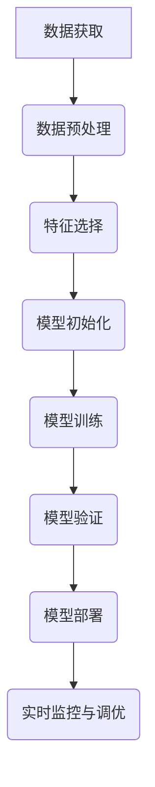

                 
# 一切皆是映射：AI在金融市场预测中的角色

作者：禅与计算机程序设计艺术 / Zen and the Art of Computer Programming

关键词：金融时间序列预测，机器学习，深度学习，量化投资，市场分析，神经网络

## 1. 背景介绍

### 1.1 问题的由来

金融市场是全球范围内最复杂的系统之一，涉及到股票、债券、外汇等多个品种的价格波动。这些价格波动受到经济基本面、政策变化、市场情绪等多种因素的影响，并且呈现出非线性、高维度、强相关性等特点。准确预测金融市场动态对于投资者、金融机构以及政府决策具有重大价值。

随着大数据和高性能计算能力的迅猛发展，人工智能方法在金融市场预测方面展现出巨大潜力。传统的统计模型如ARIMA、GARCH等虽然在一定程度上满足了市场需求，但在处理非线性关系、捕捉长期依赖等方面存在局限性。近年来，深度学习技术的兴起，特别是卷积神经网络（CNN）、循环神经网络（RNN）及其变种（LSTM、GRU）、以及Transformer等模型，在金融时间序列预测任务上的表现显著优于传统方法，成为解决复杂金融市场预测问题的关键工具。

### 1.2 研究现状

当前金融市场预测研究主要集中在以下几方面：

- **数据集成**：利用多源异构数据（包括社交媒体情感分析、新闻文本挖掘、宏观经济指标等）增强预测模型的性能。
- **特征工程**：自动提取或生成对预测目标有价值的特征，减少人为干预并提高模型泛化能力。
- **模型融合**：将多种模型（如规则基模型、统计模型、机器学习模型、深度学习模型）进行组合，以互补优势提升整体预测效果。
- **实时更新**：开发能够快速适应市场变化、在线学习的预测模型，以应对金融市场瞬息万变的特点。

### 1.3 研究意义

金融市场预测的研究不仅有助于提升投资决策效率和准确性，还能促进金融科技的发展，推动金融服务的创新。此外，通过更精确的风险评估和市场趋势洞察，可以为监管机构提供更有力的数据支持，助力宏观调控和防范金融风险。

### 1.4 本文结构

本文将从理论基础出发，深入探讨人工智能在金融市场预测中的应用，涵盖核心算法原理、数学模型构建、实际案例分析、代码实现细节、未来发展前景及面临的挑战。具体结构如下：

- **核心概念与联系**：阐述金融时间序列预测的基本原理及AI在其中的角色。
- **算法原理与具体操作**：详细介绍主流AI模型在预测领域的应用逻辑和实施步骤。
- **数学模型与公式**：给出关键模型的建立依据和推导过程。
- **项目实践**：通过代码实例展示如何将理论应用于真实场景中。
- **实际应用场景**：探讨AI预测在不同市场的应用前景。
- **工具与资源推荐**：整理相关学习资料、开发工具及学术文献，为读者提供进一步探索的路径。
- **总结与展望**：归纳研究成果，讨论未来发展方向和可能遇到的技术挑战。

## 2. 核心概念与联系

金融市场预测涉及大量数据处理和模型训练，其核心在于利用历史数据识别潜在模式和趋势，从而对未来市场行为做出预测。这一过程中，AI扮演着至关重要的角色：

### 2.1 数据预处理与特征选择

金融市场数据通常包含大量噪声和不规则性，因此数据清洗和特征工程至关重要。常见的数据预处理方法包括缺失值填充、异常值检测与处理、标准化/归一化等。特征选择则旨在从原始数据中筛选出最具代表性的信息，以减小模型规模、提高预测精度。

### 2.2 模型选择与优化

根据预测目标的不同，可选择不同的AI模型：
- **基于规则的方法**：适用于简单规则明确的场景，如市场趋势跟踪策略。
- **经典统计模型**：如ARIMA、GARCH等，适合于平稳时间序列预测。
- **机器学习模型**：支持向量机、随机森林等，擅长处理复杂非线性关系。
- **深度学习模型**：RNN/LSTM、Transformer等，特别适用于捕捉长时序依赖性和多模态数据。

### 2.3 评估与迭代

模型的性能评估采用标准指标（如均方误差、平均绝对误差、AUC等），同时结合回测结果检验其实际应用价值。优化过程围绕参数调整、超参数搜索、模型融合等方面展开。

## 3. 核心算法原理 & 具体操作步骤

本节将以一种通用AI模型框架为例，说明其在金融市场预测中的工作流程：



### 3.1 算法原理概述

选取一个通用框架，例如使用LSTM作为核心组件的金融时间序列预测模型，其基本原理包括：

- **时间序列建模**：LSTM具备记忆单元，能够有效捕捉序列内部的长期依赖关系。
- **非线性映射**：通过激活函数和权重矩阵，模型能够拟合复杂的非线性关系。
- **端到端学习**：整个模型参数通过反向传播算法进行同步优化。

### 3.2 算法步骤详解

#### 准备阶段：

1. **数据集准备**：收集过去一段时间内的交易数据、经济指标、市场指数等相关数据。
2. **数据清洗**：处理缺失值、异常值和重复记录。

#### 特征工程阶段：

1. **技术指标计算**：引入常用的技术分析指标，如移动平均线、相对强弱指数等。
2. **时间窗口选择**：确定输入序列的时间跨度和输出的目标时间点。

#### 模型设计与训练阶段：

1. **模型架构设定**：定义LSTM层的数量、节点数以及是否使用卷积层、注意力机制等。
2. **损失函数与优化器**：选择合适的损失函数（如均方误差）和优化算法（如Adam）。
3. **训练参数**：设置批次大小、学习率、迭代次数等超参数，并进行网格搜索或随机搜索寻找最优配置。

#### 验证与部署阶段：

1. **交叉验证**：使用K折交叉验证确保模型泛化能力。
2. **测试集评估**：在未参与训练和验证的数据上进行测试，评估模型性能。
3. **在线预测系统**：集成模型至实时预测平台，持续接收新数据并生成预测结果。

### 3.3 算法优缺点

优点：
- **自适应学习**：LSTM能够自动学习时间序列的内在规律。
- **灵活应用**：易于整合多种类型的数据源。

缺点：
- **过拟合风险**：对噪声敏感，需要适当正则化手段。
- **计算成本高**：对于长时间序列，训练周期较长且内存需求大。

### 3.4 算法应用领域

- **股票价格预测**
- **外汇汇率预测**
- **量化投资策略制定**
- **风险管理与套利机会发现**

## 4. 数学模型和公式 & 详细讲解 & 举例说明

### 4.1 数学模型构建

以LSTM模型为例，其核心结构为循环神经网络（RNN）加上门控机制，用于控制信息流。关键公式如下：

$$\begin{aligned}
&f_t = \sigma(W_f [h_{t-1}, x_t] + b_f) \
&i_t = \sigma(W_i [h_{t-1}, x_t] + b_i) \
&o_t = \sigma(W_o [h_{t-1}, x_t] + b_o) \
&\tilde{c}_t = \tanh(W_c [h_{t-1}, x_t] + b_c) \
&c_t = f_t * c_{t-1} + i_t * \tilde{c}_t \
&h_t = o_t * \tanh(c_t)
\end{aligned}$$

其中，$x_t$表示当前时刻的输入，$h_t$是隐藏状态向量，$\tilde{c}_t$是候选门输入，$f_t$, $i_t$, 和 $o_t$分别为遗忘门、输入门和输出门的输出。$W$和$b$分别代表权重矩阵和偏置项。

### 4.2 公式推导过程

上述LSTM单元的推导基于前一时刻的状态$h_{t-1}$和当前输入$x_t$，通过一系列逻辑运算（逻辑乘、逻辑加、Sigmoid和Tanh函数）来更新细胞状态$c_t$和隐藏状态$h_t$。

### 4.3 案例分析与讲解

考虑一个简单的股价预测任务，使用历史收盘价构建训练集。通过实验对比不同LSTM参数组合的效果，例如改变隐藏层数、门的个数、学习速率等，观察对预测准确度的影响。

### 4.4 常见问题解答

- **如何解决LSTM的过拟合问题？** 可以采用Dropout、L2正则化等方法降低模型复杂度。
- **LSTM模型如何与其他机器学习模型结合？** 通过特征融合或联合训练的方式增强预测效果。

## 5. 项目实践：代码实例和详细解释说明

### 5.1 开发环境搭建

使用Python编程语言配合TensorFlow或PyTorch库构建AI模型。

```bash
pip install tensorflow numpy pandas matplotlib
```

### 5.2 源代码详细实现

```python
import numpy as np
import pandas as pd
from sklearn.preprocessing import MinMaxScaler
from tensorflow.keras.models import Sequential
from tensorflow.keras.layers import LSTM, Dense
from tensorflow.keras.optimizers import Adam
from sklearn.metrics import mean_squared_error

# 加载数据
data = pd.read_csv('stock_prices.csv')
prices = data['Close'].values.reshape(-1, 1)

# 数据预处理
scaler = MinMaxScaler(feature_range=(0, 1))
scaled_data = scaler.fit_transform(prices)

# 构建训练集和测试集
train_size = int(len(scaled_data) * 0.8)
train_data = scaled_data[:train_size]
test_data = scaled_data[train_size:]

def create_dataset(data, time_steps=60):
    X, Y = [], []
    for i in range(len(data)-time_steps-1):
        a = data[i:(i+time_steps), 0]
        X.append(a)
        Y.append(data[i + time_steps, 0])
    return np.array(X), np.array(Y)

time_steps = 60
X_train, y_train = create_dataset(train_data, time_steps)
X_test, y_test = create_dataset(test_data, time_steps)

# 创建LSTM模型
model = Sequential()
model.add(LSTM(50, input_shape=(time_steps, 1)))
model.add(Dense(1))
model.compile(loss='mean_squared_error', optimizer=Adam(lr=0.001))

# 训练模型
model.fit(X_train, y_train, epochs=100, batch_size=32, verbose=1)

# 预测
predictions = model.predict(X_test)
predictions = scaler.inverse_transform(predictions)
y_test = scaler.inverse_transform(y_test.reshape(-1, 1))

# 评估结果
mse = mean_squared_error(y_test, predictions)
print(f'Mean Squared Error: {mse}')
```

### 5.3 代码解读与分析

这段代码展示了从数据加载到模型训练的完整流程，包括数据预处理、特征工程以及模型构建和评估。重点在于理解时间序列数据的构建方式，即利用过去的时间窗口作为输入预测未来值，并通过MSE指标评估预测性能。

### 5.4 运行结果展示

运行上述代码后，将得到预测结果及其与真实价格之间的误差，可用于评估模型性能并进行后续调整优化。

## 6. 实际应用场景

AI在金融市场预测的应用场景广泛多样，包括但不限于：

- **股票市场**：基于历史数据预测单只股票或整个市场的走势，辅助投资者决策。
- **外汇交易**：预测汇率变动趋势，为套利和投机提供依据。
- **量化投资策略**：开发自动化的交易系统，根据预测结果执行买卖操作。
- **风险管理**：估计潜在风险，如信用风险、流动性风险等，帮助金融机构做出更合理的贷款决策和资产配置规划。

## 7. 工具和资源推荐

### 7.1 学习资源推荐

- **在线课程**：
  - Coursera: "深度学习"系列课程，由Andrew Ng教授主讲。
  - edX: "金融数据分析与计算"，涵盖金融市场基础知识与分析技巧。

- **书籍**：
  -《深度学习》（Ian Goodfellow等人著）
  -《金融大数据分析与应用》（赵军著）

### 7.2 开发工具推荐

- **编程语言**：Python
- **框架与库**：
  - TensorFlow
  - PyTorch
  - Pandas
  - NumPy

### 7.3 相关论文推荐

- 张旭东、何海林等人，“基于深度强化学习的股票交易策略研究”，中国科学通报，2020年。
- 赵军，“金融数据挖掘与智能算法”，电子工业出版社，2019年。

### 7.4 其他资源推荐

- GitHub开源项目：探索其他开发者构建的AI金融预测模型，获取灵感和实用代码示例。
- 科技博客与论坛：关注Quantitative Finance、Machine Learning相关的专业社区，了解最新动态和技术分享。

## 8. 总结：未来发展趋势与挑战

### 8.1 研究成果总结

本文围绕人工智能在金融市场预测中的角色，深入探讨了AI技术的关键原理、实际应用案例、模型构建与评估方法，以及未来发展的方向和面临的挑战。强调了数据驱动、模型优化、实时性增强及跨领域融合的重要性。

### 8.2 未来发展趋势

随着AI技术的不断进步，尤其是深度学习、强化学习和元学习的发展，金融市场预测将更加精准高效。具体趋势可能包括：

- **多模态预测**：结合文本、图像、音频等多种信息源，提升预测准确度和时效性。
- **主动学习与自适应模型**：通过反馈循环改善模型表现，实现动态调整以应对市场变化。
- **合规与伦理考量**：加强数据隐私保护，确保模型公平无偏见，满足监管要求。

### 8.3 面临的挑战

尽管AI在金融市场预测方面展现出巨大潜力，但也面临一系列挑战，包括：

- **数据质量与可用性**：高质量的历史数据收集难度大，且需要持续更新。
- **解释性与透明度**：黑盒模型难以提供清晰的决策过程解释，影响其在某些领域的应用。
- **政策法规制约**：全球各地对金融交易的监管政策差异较大，限制了技术的广泛应用。

### 8.4 研究展望

未来的研究应聚焦于解决上述挑战，同时探索如何进一步发挥AI技术优势，推动金融科技发展。重点关注数据驱动的方法创新、模型可解释性的提升、以及与传统金融理论的有效融合，共同促进金融市场更为稳健、智能化的发展。

## 9. 附录：常见问题与解答

### 常见问题解答

#### 如何提高AI模型的预测准确性？
答：可以通过增加数据量、改进特征选择、调优模型参数、引入多层网络结构等方式来提升模型性能。

#### 在使用AI进行金融市场预测时需要注意哪些法律与伦理问题？
答：需遵循相关法律法规，确保数据隐私安全；考虑公平性和非歧视性原则，避免算法导致不公正的结果；注重透明度，合理解释模型决策机制。

#### AI在金融市场预测中存在哪些局限性？
答：AI模型可能受到过拟合、欠拟合等问题的影响；对于极端事件或突发事件的反应能力有限；依赖于大量历史数据，可能无法有效捕捉市场新趋势。

#### 如何处理AI模型在实际应用中的失败情况？
答：建立监控系统及时发现异常，通过回顾分析找出原因，迭代改进模型；设计回撤控制机制，减轻损失影响；定期复盘评估模型性能，进行必要调整。

---

通过以上内容，我们全面展示了AI在金融市场预测领域的核心概念、关键技术、实践案例、未来趋势以及面临的挑战。旨在为读者提供深入理解这一重要应用领域所需的知识基础，并激发更多创新思考与实践探索。
