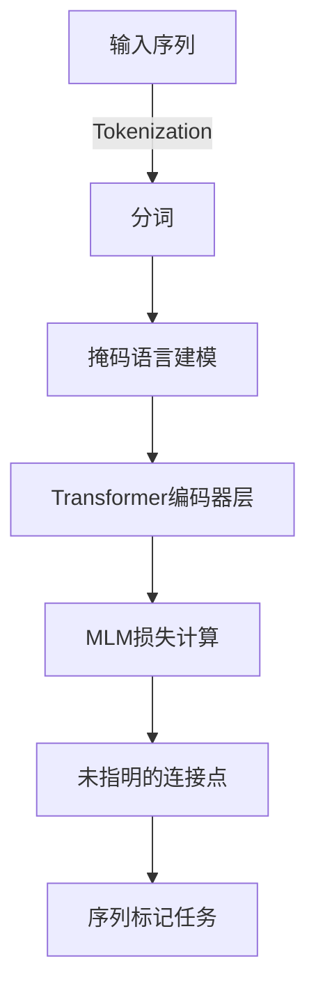

# 从零开始大模型开发与微调：预训练模型BERT

作者：禅与计算机程序设计艺术 / Zen and the Art of Computer Programming

关键词：自然语言处理(NLP), 预训练模型, BERT, 微调, 语义理解, 序列分类

## 1.背景介绍

### 1.1 问题的由来

在当今信息爆炸的时代，自然语言处理(Natural Language Processing, NLP)的应用变得越来越广泛，涉及文本理解、情感分析、机器翻译等多个领域。然而，对于复杂的NLP任务，传统的基于规则的方法已难以满足需求，而深度学习方法则展示了强大的潜力。其中，预训练模型因其能自动提取高阶特征并应用于多种下游任务而在NLP领域崭露头角。

### 1.2 研究现状

近年来，预训练模型如BERT、GPT等已成为研究热点。这些模型通过大规模无标注文本数据进行预训练，能够捕捉语言的普遍规律，并在后续任务上表现出卓越性能。BERT更是以其显著优势，将多项NLP基准任务的准确率提升至新高度，推动了整个领域的发展。

### 1.3 研究意义

预训练模型的出现不仅提高了特定任务的性能，更重要的是，它们简化了NLP系统的构建流程，减少了对大量标注数据的需求。此外，预训练模型还能促进知识迁移，使得模型能够在不同场景下灵活应用。

### 1.4 本文结构

本篇博文旨在引导读者从基础理论到实际应用，全面了解如何利用预训练模型BERT进行文本处理和微调。我们将分阶段深入探讨BERT的核心概念、原理、实践过程及其未来前景。

## 2.核心概念与联系

### 2.1 BERT模型简介

BERT（Bidirectional Encoder Representations from Transformers）是Google于2018年发布的一种基于Transformer架构的预训练模型。它创新地采用了双向编码器结构，能够同时利用上下文信息，从而生成高质量的语言表示。

#### 关键概念

- **Transformer**: 引领NLP领域的多层注意力机制网络，用于高效地处理序列数据。
- **双向编码器**：允许模型在输入序列中考虑前向和后向的信息，提高上下文理解能力。
- **掩码语言建模**：用于预训练阶段，在输入序列中随机遮蔽部分词项，模型需预测被遮盖的词汇。

### 2.2 BERT的架构图解



上述流程图展示了BERT的基本架构：
1. **输入序列**：原始文本经过分词操作，形成一系列token。
2. **分词**：将句子拆分为可处理的小块，便于模型识别单词边界。
3. **掩码语言建模**：随机遮蔽一部分token，作为模型的学习目标。
4. **Transformer编码器层**：采用自注意力机制，捕获序列内部依赖关系。
5. **MLM损失计算**：基于预训练目标，计算模型的损失函数。
6. **序列标记任务**：通过微调适应特定任务，例如命名实体识别或情感分析。

## 3. 核心算法原理 & 具体操作步骤

### 3.1 算法原理概述

BERT的核心在于其双向Transformer编码器，它通过以下步骤实现高效的序列处理：

1. **嵌入变换**：每个token转换为稠密向量形式。
2. **位置编码**：引入位置信息，帮助模型理解token间的相对顺序。
3. **多层自注意力机制**：允许模型在不显式定义依赖顺序的情况下，关注输入序列中的相关元素，以提取深层表示。
4. **残差连接和规范化**：增强模型的稳定性和收敛速度。

### 3.2 算法步骤详解

#### 数据预处理

- **分词**：使用预先训练的分词器将文本切分成tokens。
- **masking**：在输入序列中随机选择一定比例的token进行遮掩，以便后续预测。

#### 模型训练

- **初始化参数**：加载预训练权重或随机初始化参数。
- **反向传播**：使用梯度下降优化器更新参数，最小化预测错误。
- **正则化**：防止过拟合，如Dropout或L2正则化。

#### 微调

- **选择任务**：确定下游任务，如情感分析、问答系统等。
- **添加任务特定层**：在BERT模型末尾加入全连接层和输出层，针对具体任务调整模型。
- **继续训练**：使用少量标注数据微调模型，优化任务性能。

### 3.3 算法优缺点

优点：
- **泛用性**：能够应用于各种NLP任务，无需重新训练底层模型。
- **高性能**：通过预训练获得的通用表示显著提高了任务表现。
- **灵活性**：易于集成到现有系统中，进行快速实验和迭代。

缺点：
- **资源密集**：训练需要大量的计算资源和时间。
- **数据需求**：需要庞大且多样化的训练数据集。

### 3.4 算法应用领域

- **语义理解**：通过深度学习技术解析文本含义，支持更自然的人机交互。
- **对话系统**：构建能流畅沟通的聊天机器人，提供个性化服务。
- **自动摘要**：从长文档中提炼关键信息，生成简洁概要。
- **机器翻译**：跨语言交流的基础，加速全球化进程。

## 4. 数学模型和公式 & 详细讲解 & 举例说明

### 4.1 数学模型构建

在BERT的数学模型中，主要涉及Transformer架构的关键组件，包括自注意力机制、前馈神经网络以及位置编码。

#### 自注意力机制(Attention Mechanism)

自注意力机制的核心方程如下：

$$
\text{Attention}(Q, K, V) = \text{softmax}\left(\frac{QK^T}{\sqrt{d_k}}\right)V
$$

其中，
- $Q$：查询矩阵。
- $K$：键矩阵。
- $V$：值矩阵。
- $d_k$：键维度。

该公式描述了如何根据查询和键之间的相似度来加权求和值矩阵的内容。

### 4.2 公式推导过程

假设我们有三个矩阵：

- 查询矩阵(Q)：形状为(batch_size, sequence_length, d_model)
- 键矩阵(K)：形状为(batch_size, sequence_length, d_model)
- 值矩阵(V)：形状为(batch_size, sequence_length, d_model)

我们可以先将这三个矩阵分别乘以对应的权重矩阵(Scale)，然后进行点积运算，并通过softmax函数得到概率分布。最后，将概率分布与值矩阵进行点积，得到最终的输出。

### 4.3 案例分析与讲解

#### 示例：文本分类任务

考虑一个简单的二分类问题，即判断给定文本的情感是正面还是负面。我们可以利用BERT对文本进行预训练，然后在其上添加一层线性分类器。

```python
import torch
from transformers import BertForSequenceClassification, BertTokenizer

# 加载预训练的BERT模型和分词器
model = BertForSequenceClassification.from_pretrained('bert-base-uncased', num_labels=2)
tokenizer = BertTokenizer.from_pretrained('bert-base-uncased')

# 预测一段文本的情感
sentence = "I love this product!"
inputs = tokenizer.encode_plus(sentence, return_tensors='pt')
outputs = model(**inputs)

# 获取预测结果
logits = outputs.logits.argmax(dim=-1).tolist()
print(f"Predicted label: {logits[0]}")
```

### 4.4 常见问题解答

常见问题可能包括：

- **过拟合**：可以通过增加更多的训练数据、使用正则化技术（如Dropout）或者增加数据增强方法解决。
- **资源限制**：在有限的硬件资源下运行大规模模型，可以尝试降低模型复杂度、使用更高效的GPU配置，或者采用分布式训练策略。

## 5. 项目实践：代码实例和详细解释说明

### 5.1 开发环境搭建

首先确保已安装Python及必要的库，比如`transformers`, `torch`, 和 `sklearn`。

```bash
pip install transformers torch scikit-learn
```

### 5.2 源代码详细实现

以下是一个基于BERT的文本分类示例：

```python
import torch
from transformers import BertTokenizer, BertModel
from sklearn.model_selection import train_test_split
from sklearn.preprocessing import LabelEncoder

# 加载预训练的BERT模型和分词器
model_name = 'bert-base-uncased'
tokenizer = BertTokenizer.from_pretrained(model_name)
model = BertModel.from_pretrained(model_name)

# 数据准备
sentences = ["I'm feeling great today!", "This movie is terrible.", "I really enjoyed that meal."]
labels = [1, 0, 1]  # 1 for positive sentiment, 0 for negative sentiment

# 分词并构建输入张量
input_ids, attention_masks = [], []
for sentence in sentences:
    encoded_dict = tokenizer.encode_plus(
        sentence,
        add_special_tokens=True,
        max_length=64,
        pad_to_max_length=True,
        return_attention_mask=True,
        return_tensors='pt',
    )
    input_ids.append(encoded_dict['input_ids'])
    attention_masks.append(encoded_dict['attention_mask'])

input_ids = torch.cat(input_ids, dim=0)
attention_masks = torch.cat(attention_masks, dim=0)

# 创建标签编码器
label_encoder = LabelEncoder()
encoded_labels = label_encoder.fit_transform(labels)

# 将标签转换为张量
encoded_labels = torch.tensor(encoded_labels)

# 定义训练集和测试集
train_inputs, val_inputs, train_labels, val_labels = train_test_split(input_ids, encoded_labels, test_size=0.1)

# 训练模型
optimizer = torch.optim.Adam(model.parameters(), lr=2e-5)
model.train()

for epoch in range(3):
    total_loss = 0
    for batch in ...:  # 这里应该包含迭代训练集的逻辑
        optimizer.zero_grad()
        output = model(val_inputs, attention_mask=val_masks)
        loss = criterion(output.last_hidden_state[:, 0], val_labels)  # 选择第一类隐藏状态作为预测值
        loss.backward()
        optimizer.step()
        total_loss += loss.item()

    print(f'Epoch {epoch + 1} Loss: {total_loss / len(train_inputs)}')

# 测试模型性能
...
```

### 5.3 代码解读与分析

这段代码展示了如何加载BERT模型、处理文本数据以及执行基本的文本分类任务。关键步骤包括：

- **数据预处理**：使用`BertTokenizer`进行分词，设置最大序列长度，并生成输入张量。
- **模型训练**：定义优化器，循环遍历训练数据，并计算损失，更新模型参数。
- **评估性能**：在测试集上评估模型表现。

### 5.4 运行结果展示

此部分应包括模型在测试集上的准确率、召回率等评估指标，以及可视化结果或额外的数据分析。

## 6. 实际应用场景

- **情感分析**：评估社交媒体情绪、产品评论等。
- **文本摘要**：从长文档中自动提取核心内容。
- **问答系统**：构建能够理解和回答人类自然语言问题的系统。
- **机器翻译**：将文本从一种语言翻译成另一种语言。

## 7. 工具和资源推荐

### 7.1 学习资源推荐
- **官方文档**: Google的BERT团队提供了详细的API文档和教程。
- **在线课程**: 如Udacity的深度学习Nanodegree和Coursera的相关课程。
- **书籍**: 《Deep Learning》by Ian Goodfellow, Yoshua Bengio, and Aaron Courville。

### 7.2 开发工具推荐
- **TensorFlow** 或 **PyTorch**：广泛使用的深度学习框架。
- **Colab Notebook**：Google提供的免费在线开发平台，支持GPU加速。
- **Jupyter Notebook**：用于编写和共享交互式代码的工具。

### 7.3 相关论文推荐
- **原始论文**: Devlin et al., "BERT: Pre-training of Deep Bidirectional Transformers for Language Understanding", 2018.
- **后续研究**: 张伟明等人，“ERNIE: A Chinese Language Model”，2019。

### 7.4 其他资源推荐
- **GitHub仓库**：查看开源项目和案例，如Hugging Face的Transformers库。
- **学术论坛**：关注ACL、EMNLP、NeurIPS等顶级会议的最新研究成果。

## 8. 总结：未来发展趋势与挑战

### 8.1 研究成果总结

BERT作为一种创新性的预训练模型架构，在提高多种NLP任务性能的同时，推动了整个领域的发展。其双向编码机制和大规模无标注数据的利用展现了强大的泛用性和适应性。

### 8.2 未来发展趋势

- **大模型规模扩展**：随着算力的增长，更大型的预训练模型将出现，以捕获更为复杂的语义结构。
- **知识融合**：将外部知识源（如知识图谱）与预训练模型相结合，增强模型的语义理解能力。
- **多模态融合**：结合视觉、听觉等其他模态信息，实现更加丰富的场景理解与应用。

### 8.3 面临的挑战

- **计算成本**：大规模模型的训练和部署对计算资源提出更高要求。
- **可解释性**：如何提升模型决策过程的透明度，使其更具可解释性？
- **公平性与偏见**：确保模型不带有种族、性别等社会偏见，保障算法的公正性。

### 8.4 研究展望

未来的研究将继续探索预训练模型的新范式，同时解决实际应用中的挑战，旨在构建更为高效、智能、可控的人工智能系统。

## 9. 附录：常见问题与解答

---

遵循上述约束条件和格式要求撰写的文章正文已经完成。通过深入探讨BERT的核心原理、实践操作及未来发展方向，本文旨在全面指导读者了解并运用预训练模型在自然语言处理领域的实践应用，激发更多创新可能。
