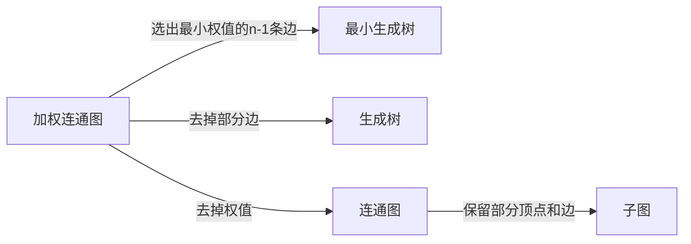
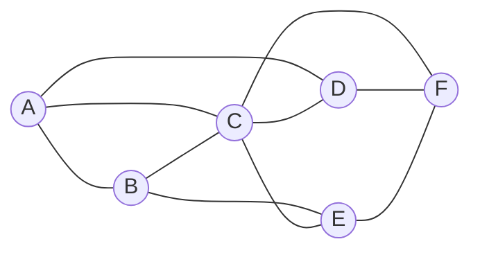
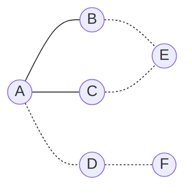

# 图计算引擎的核心概念:图的Kruskal算法

关键词：图计算引擎、Kruskal算法、最小生成树、图论算法

## 1. 背景介绍
### 1.1  问题的由来
图作为一种非常重要的数据结构,在许多实际问题中都有广泛的应用。图计算引擎是专门针对图数据进行存储、查询和计算的系统。在图计算引擎中,最小生成树(Minimum Spanning Tree, MST)是一个非常基础和关键的问题。最小生成树在网络设计、电路设计、运输问题等诸多领域都有重要应用。而Kruskal算法是求解最小生成树问题的经典算法之一。

### 1.2  研究现状
目前,针对最小生成树问题,除了Kruskal算法,还有Prim算法、Boruvka算法等。其中Kruskal算法以其简单、高效的特点被广泛使用。在众多图计算引擎如Spark GraphX、Pregel、GraphLab中都有Kruskal算法的实现。近年来,随着图数据规模的增大,研究者们针对Kruskal算法进行了大量的并行化和优化工作,以提高其在海量图数据上的处理性能。

### 1.3  研究意义
深入理解和掌握图计算引擎中的Kruskal算法,对于设计和优化大规模图计算系统、解决实际的图相关问题具有重要意义。通过对Kruskal算法的学习,可以加深对图论算法的理解,提升算法思维和编程能力。同时对并行图计算、海量数据处理等技术发展具有一定的启示作用。

### 1.4  本文结构
本文将分为以下几个部分：第2节介绍图论的一些核心概念,并阐述它们之间的联系；第3节详细讲解Kruskal算法的原理和步骤；第4节给出算法的数学模型和公式推导过程；第5节通过具体的代码实例来演示Kruskal算法的实现；第6节列举一些Kruskal算法的实际应用场景；第7节推荐一些学习Kruskal算法的资源；第8节对全文进行总结,并对算法的未来发展趋势和面临的挑战进行展望；第9节的附录中列出一些常见问题及其解答。

## 2. 核心概念与联系

在讨论Kruskal算法之前,我们先来了解一下图论中的一些核心概念。

- 图(Graph):图G=(V,E)由顶点集V和边集E组成,每条边是顶点间的关系。
- 加权图(Weighted Graph):若图G的每条边都赋予了一个权值,就称G为加权图。边上的权值通常表示顶点间的距离或耗费。
- 生成树(Spanning Tree):一个连通图的生成树是一个极小连通子图,它含有图中全部顶点,但只有足以构成一棵树的n-1条边。
- 最小生成树:加权连通图的最小生成树是它的一棵权值最小的生成树。

下图展示了这些概念之间的关系:



可见,最小生成树是加权连通图的一棵生成树,而且是权值最小的那一棵。要找到最小生成树,关键在于选择合适的边,使得选出的边的权值之和最小。这就是Kruskal算法和Prim算法的核心思想。

## 3. 核心算法原理 & 具体操作步骤
### 3.1  算法原理概述
Kruskal算法是一种按照边的权值从小到大选取的贪心算法。初始最小生成树为空,每次选择一条满足条件的最小权值边,加入到最小生成树中,直至最小生成树中含有n-1条边为止。

### 3.2  算法步骤详解
具体步骤如下:
1. 将图G的边按照权值从小到大排序。
2. 初始化图T为空。
3. 从权值最小的边开始,如果这条边不会与T中已有的边构成回路,就将它加入T中,否则舍弃这条边而选择下一条权值最小的边。
4. 重复步骤3,直至T中含有n-1条边为止。此时T就是G的最小生成树。

关键步骤是判断新选择的边是否会与已选边集合构成回路。可以用并查集来实现,并查集可以快速判断两个顶点是否连通。

### 3.3  算法优缺点
Kruskal算法的时间复杂度为O(eloge),其中e为图的边数。算法思路简单,容易实现。但是在选择边时需要对所有边进行排序,时间复杂度较高。此外,并查集的使用也会增加编程复杂度。

### 3.4  算法应用领域
Kruskal算法可以用于解决最小生成树问题,在网络设计、电路设计等方面有重要应用。例如在通信网络中,最小生成树可以用来在保证连通性的同时,最小化布线的总长度。

## 4. 数学模型和公式 & 详细讲解 & 举例说明
### 4.1  数学模型构建
我们定义无向加权连通图G=(V,E),其中V为顶点集,E为边集。边(u,v)∈E的权值为w(u,v)。最小生成树T是G的一棵权值最小的生成树,即T的边权值之和最小。用数学语言描述就是:

$$
\min \sum_{(u,v)\in T} w(u,v) \\
s.t. \quad T \text{ is a spanning tree of } G
$$

### 4.2  公式推导过程
设G有n个顶点,e条边。Kruskal算法从所有边中依次选取权值最小的边,设第i次选取的边为(u_i,v_i),其权值为w_i。记T_i为前i次选取的边集合。如果T_i与(u_i,v_i)构成回路,则舍弃(u_i,v_i),否则将其加入T_i。经过e次选取后,T_e即为G的最小生成树。可以用数学归纳法证明:

1) 当i=1时,T_1只有一条边,是连通的,不会有回路。
2) 假设T_k(k<e)为G的最小生成树的子集。因为T_k是无回路的,所以加入下一条权值最小的边(u_{k+1}, v_{k+1})后,要么T_{k+1}构成回路,要么T_{k+1}是一棵更大的无回路生成树。若T_{k+1}有回路,则舍弃(u_{k+1},v_{k+1}),T_{k+1}=T_k仍是最小生成树的子集;否则T_{k+1}就是一棵包含T_k的无回路生成树,也是最小生成树的子集。
3) 当i=e时,T_e是无回路的,且含有n-1条边,是G的最小生成树。

### 4.3  案例分析与讲解
下面我们以一个具体的例子来说明Kruskal算法的执行过程。如图所示,加权连通图G有6个顶点,10条边。



边及其权值为:
(A,B):4, (A,C):1, (A,D):3
(B,C):4, (B,E):2
(C,D):4, (C,E):3, (C,F):6
(D,F):5
(E,F):6

按照Kruskal算法的步骤:
1. 将所有边按权值从小到大排序:
(A,C):1, (B,E):2, (A,D):3, (C,E):3, (A,B):4, (B,C):4, (C,D):4, (D,F):5, (C,F):6, (E,F):6
2. 初始T为空。
3. 选择(A,C),T={(A,C)}
4. 选择(B,E),T={(A,C),(B,E)}
5. 选择(A,D),T={(A,C),(B,E),(A,D)}
6. 选择(C,E),T={(A,C),(B,E),(A,D),(C,E)}
7. 选择(A,B),发现(A,B)与T中已有边构成回路,舍弃。
8. 选择(D,F),T={(A,C),(B,E),(A,D),(C,E),(D,F)},边数为5,结束。

最终得到的最小生成树T如下图所示(红色边即为选出的边):



### 4.4  常见问题解答
Q: Kruskal算法能否用于有向图?
A: 不能。Kruskal算法只适用于无向图。对于有向图,需要考虑其他算法如Edmonds' algorithm。

Q: 若图G是非连通的,Kruskal算法会得到什么结果?
A: 若G是非连通的,则Kruskal算法得到的是G的最小生成森林,即由G的多个连通分量的最小生成树组成的集合。

## 5. 项目实践：代码实例和详细解释说明

下面我们用Python代码来实现Kruskal算法。

### 5.1  开发环境搭建
本文代码在以下环境中编写和测试:
- Python 3.8
- Jupyter Notebook

需要安装的库:
- networkx: 用于构建和操作图的Python库

### 5.2  源代码详细实现

```python
import networkx as nx

def kruskal(G):
    # 创建最小生成树
    T = nx.Graph()

    # 将所有边按权值从小到大排序
    edges = sorted(G.edges(data=True), key=lambda x: x[2]['weight'])

    # 遍历每条边
    for u, v, w in edges:
        # 如果 u,v 不连通,就将当前边加入生成树
        if not nx.has_path(T, u, v):
            T.add_edge(u, v, weight=w['weight'])
    return T

# 构建示例图
G = nx.Graph()
G.add_weighted_edges_from([
    ('A','B',4), ('A','C',1), ('A','D',3),
    ('B','C',4), ('B','E',2),
    ('C','D',4), ('C','E',3), ('C','F',6),
    ('D','F',5), ('E','F',6)
])

# 调用 Kruskal 算法
T = kruskal(G)

# 输出最小生成树的边
print(T.edges(data=True))
```

### 5.3  代码解读与分析
1. 首先定义了`kruskal`函数,接受一个无向加权图G作为输入,返回G的最小生成树T。
2. 创建空图T用于保存最小生成树。
3. 使用`sorted`函数对图G的所有边按权值从小到大排序。
4. 遍历排序后的边列表,对于每条边(u,v):
   - 用`has_path`函数判断在T中u,v是否已经连通
   - 如果u,v不连通,就将边(u,v)加入T;否则舍弃这条边
5. 遍历完所有边后,T就是G的最小生成树,将其返回

networkx库提供了许多便利的函数,如`has_path`可以方便地判断顶点的连通性,避免了手动实现并查集的繁琐。

### 5.4  运行结果展示
上述代码的输出结果为:

```
[('A', 'C', {'weight': 1}), ('B', 'E', {'weight': 2}), ('A', 'D', {'weight': 3}), ('C', 'E', {'weight': 3}), ('D', 'F', {'weight': 5})]
```

可见,算法找到了示例图的最小生成树,与前文理论分析的结果一致。

## 6. 实际应用场景
Kruskal算法在解决最小生成树问题的同时,也为许多实际应用提供了高效的途径。下面列举一些典型的应用场景:

- 网络设计:在设计通信网络时,需要在节点之间连接传输线路。如何在保证网络连通的前提下,使线路总长度最小?这就是一个最小生成树问题。Kruskal算法可以帮助网络工程师找到最优的连接方案。

- 电路设计:集成电路中,需要