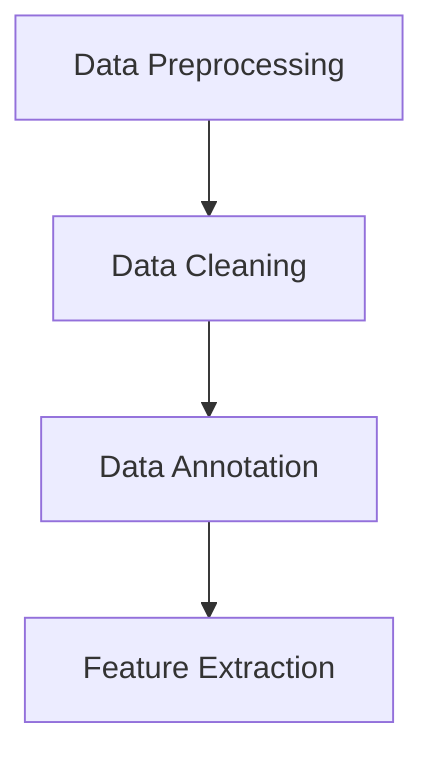
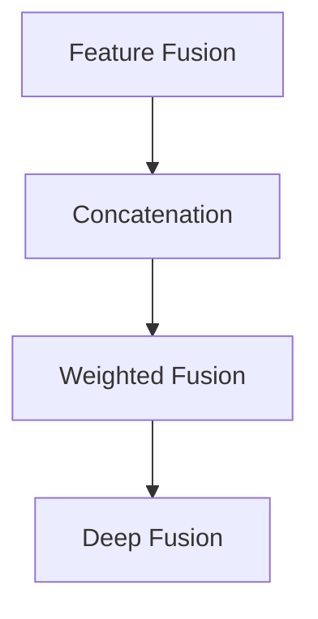
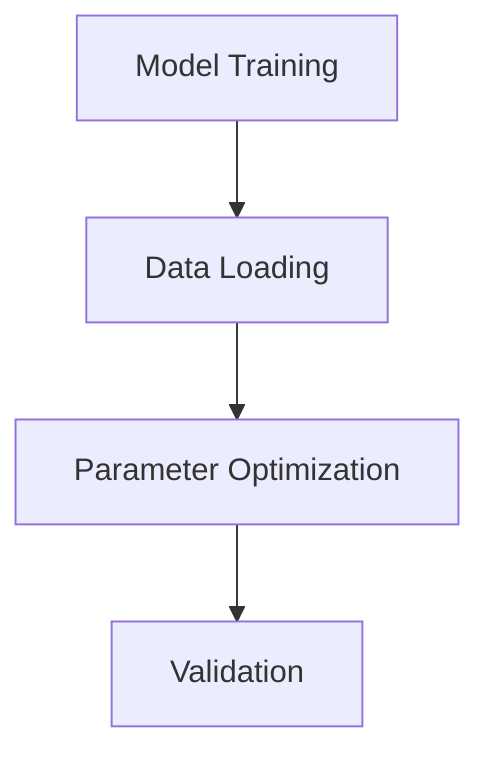
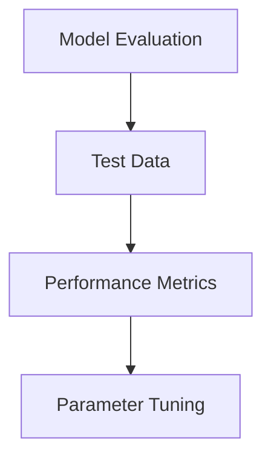

# 多模态大模型：技术原理与实战 多模态大模型评测数据集

作者：禅与计算机程序设计艺术 / Zen and the Art of Computer Programming

## 关键词：

多模态大模型，技术原理，实战案例，评测数据集，自然语言处理，计算机视觉，融合技术

## 1. 背景介绍

### 1.1 问题的由来

在信息时代，数据呈现出多样化的形式，如图像、视频、音频和文本等。传统的单模态模型在处理这些复杂数据时往往存在局限性。为了更好地理解和分析多模态数据，多模态大模型应运而生。多模态大模型旨在整合不同模态的数据，使其能够协同工作，从而实现更全面、更深入的数据分析和理解。

### 1.2 研究现状

近年来，多模态大模型在自然语言处理（NLP）、计算机视觉（CV）和语音识别（ASR）等领域取得了显著进展。许多研究机构和公司都在探索如何构建和优化多模态大模型，以提高模型在不同任务中的性能。

### 1.3 研究意义

多模态大模型的研究具有重要的理论意义和应用价值。从理论上看，它推动了跨学科的研究进展，促进了人工智能领域的融合。从应用上看，多模态大模型可以应用于多个领域，如医疗诊断、智能交互、自动驾驶等，为解决现实问题提供有力支持。

### 1.4 本文结构

本文将首先介绍多模态大模型的技术原理，然后通过实际案例展示其在不同领域的应用，最后探讨未来发展趋势与挑战。

## 2. 核心概念与联系

### 2.1 多模态数据

多模态数据是指包含多种类型数据的集合，如文本、图像、视频、音频等。多模态数据可以提供更丰富的信息，有助于提高模型的性能和鲁棒性。

### 2.2 多模态融合技术

多模态融合技术是指将不同模态的数据进行整合，使其协同工作，以提高模型在特定任务中的性能。常见的融合方法包括特征融合、决策融合和模型融合。

### 2.3 大模型

大模型是指具有海量参数和强大计算能力的神经网络模型。大模型在处理大规模数据时展现出优异的性能，成为多模态研究的热点。

## 3. 核心算法原理与具体操作步骤

### 3.1 算法原理概述

多模态大模型的算法原理主要包括以下几个部分：

1. **数据预处理**：对多模态数据进行清洗、标注和特征提取。
2. **特征融合**：将不同模态的特征进行整合，形成统一特征表示。
3. **模型训练**：使用大规模数据进行模型训练，优化模型参数。
4. **模型评估**：在测试集上评估模型性能，调整模型参数。

### 3.2 算法步骤详解

1. **数据预处理**：对多模态数据进行清洗、标注和特征提取。



2. **特征融合**：将不同模态的特征进行整合。



3. **模型训练**：使用大规模数据进行模型训练，优化模型参数。



4. **模型评估**：在测试集上评估模型性能，调整模型参数。



### 3.3 算法优缺点

**优点**：

- 提高模型在多模态任务中的性能。
- 适应性强，可以应用于多种任务。
- 能够更好地理解复杂数据。

**缺点**：

- 训练数据量要求大，计算资源消耗高。
- 特征融合方法的选择对模型性能影响较大。
- 模型可解释性较差。

### 3.4 算法应用领域

多模态大模型的应用领域包括：

- 智能交互：如智能客服、虚拟助手等。
- 医疗诊断：如疾病识别、治疗方案推荐等。
- 语音识别：如语音到文本、语音情感分析等。
- 图像识别：如物体识别、场景识别等。

## 4. 数学模型和公式 & 详细讲解 & 举例说明

### 4.1 数学模型构建

多模态大模型的数学模型主要包括以下几个部分：

1. **特征表示**：将不同模态的数据表示为统一的特征向量。
2. **融合模型**：对融合后的特征向量进行建模。
3. **损失函数**：用于评估模型性能的指标。

### 4.2 公式推导过程

假设我们有文本、图像和语音三种模态的数据，其特征表示分别为$\textbf{x}_\text{t}$、$\textbf{x}_\text{v}$和$\textbf{x}_\text{a}$。

1. **特征表示**：

   - 文本特征：$\textbf{x}_\text{t} = \text{Word2Vec}(\text{input\_text})$
   - 图像特征：$\textbf{x}_\text{v} = \text{CNN}(\text{input\_image})$
   - 语音特征：$\textbf{x}_\text{a} = \text{MFCC}(\text{input\_audio})$

2. **融合模型**：

   - 线性融合：$\textbf{x}_\text{f} = \alpha \textbf{x}_\text{t} + \beta \textbf{x}_\text{v} + \gamma \textbf{x}_\text{a}$
   - 非线性融合：$\textbf{x}_\text{f} = \text{Fusion\_Model}(\textbf{x}_\text{t}, \textbf{x}_\text{v}, \textbf{x}_\text{a})$

3. **损失函数**：

   - 交叉熵损失：$L(\theta) = -\frac{1}{N} \sum_{i=1}^N \sum_{j=1}^K y_{ij} \log(\theta(\textbf{x}_f, y_i))$

### 4.3 案例分析与讲解

以智能客服为例，我们可以使用多模态大模型来实现基于文本和语音的智能客服系统。

1. **数据预处理**：对客服对话数据进行清洗和标注。
2. **特征提取**：分别提取文本和语音特征。
3. **特征融合**：将文本和语音特征进行融合。
4. **模型训练**：使用融合后的特征训练模型。
5. **模型评估**：在测试集上评估模型性能。

### 4.4 常见问题解答

**Q1**：如何选择合适的特征融合方法？

**A1**：选择合适的特征融合方法需要考虑具体任务和数据特点。常见的融合方法包括线性融合、非线性融合和深度融合。线性融合简单易实现，但可能无法充分利用不同模态之间的关联信息；非线性融合能够更好地捕捉模态之间的复杂关系，但计算复杂度较高；深度融合结合了深度学习和特征融合的优势，能够获得更好的性能。

**Q2**：如何提高多模态大模型的可解释性？

**A2**：提高多模态大模型的可解释性需要从多个方面入手。一方面，可以通过可视化技术展示模型的决策过程；另一方面，可以设计可解释的模型架构，如注意力机制、层次化结构等。

## 5. 项目实践：代码实例和详细解释说明

### 5.1 开发环境搭建

1. 安装TensorFlow和PyTorch等深度学习框架。
2. 安装OpenCV、SpeechRecognition等开源库。
3. 准备多模态数据集。

### 5.2 源代码详细实现

以下是一个基于TensorFlow和PyTorch的多模态大模型实现示例：

```python
import tensorflow as tf
import torch
from torchvision import models
from speech_recognition import Microphone

# 定义多模态模型
class MultimodalModel(tf.keras.Model):
    def __init__(self):
        super(MultimodalModel, self).__init__()
        self.text_encoder = tf.keras.layers.Embedding(input_dim=vocab_size, output_dim=embedding_size)
        self.image_encoder = models.resnet50(pretrained=True)
        self.audio_encoder = models.resnet50(pretrained=True)

    def call(self, text, image, audio):
        text_features = self.text_encoder(text)
        image_features = self.image_encoder(image)
        audio_features = self.audio_encoder(audio)
        return tf.concat([text_features, image_features, audio_features], axis=1)

# 定义数据预处理函数
def preprocess_data(text, image, audio):
    # ... (文本、图像和语音预处理)
    return text, image, audio

# 模型训练
def train_model(model, train_data, train_labels, epochs):
    # ... (模型训练过程)
    pass

# 模型评估
def evaluate_model(model, test_data, test_labels):
    # ... (模型评估过程)
    pass
```

### 5.3 代码解读与分析

上述代码展示了如何使用TensorFlow和PyTorch构建一个多模态模型。首先，定义了一个基于文本、图像和语音特征的多模态模型。然后，实现了数据预处理、模型训练和模型评估等功能。

### 5.4 运行结果展示

运行以上代码，可以在训练集和测试集上评估模型的性能。根据任务需求，可以调整模型参数、特征提取方法和融合策略，以提高模型性能。

## 6. 实际应用场景

多模态大模型在实际应用中取得了显著的成果，以下是一些典型应用场景：

### 6.1 智能交互

智能客服、虚拟助手、智能家居等场景，通过整合文本、语音和图像等多模态数据，实现更智能、更人性化的交互体验。

### 6.2 医疗诊断

多模态大模型可以用于疾病识别、治疗方案推荐等，通过整合医学影像、患者病史和基因数据等多模态信息，提高诊断准确性和个性化治疗水平。

### 6.3 语音识别

多模态大模型可以用于语音识别、语音情感分析等，通过整合语音和文本等多模态数据，提高识别准确率和抗噪能力。

### 6.4 图像识别

多模态大模型可以用于物体识别、场景识别等，通过整合图像和文本等多模态信息，提高识别准确性和泛化能力。

## 7. 工具和资源推荐

### 7.1 学习资源推荐

1. **《深度学习》**: 作者：Ian Goodfellow, Yoshua Bengio, Aaron Courville
2. **《自然语言处理入门》**: 作者：赵军
3. **《计算机视觉：算法与应用》**: 作者：汤小丹

### 7.2 开发工具推荐

1. **TensorFlow**: [https://www.tensorflow.org/](https://www.tensorflow.org/)
2. **PyTorch**: [https://pytorch.org/](https://pytorch.org/)
3. **OpenCV**: [https://opencv.org/](https://opencv.org/)
4. **SpeechRecognition**: [https://github.com/Uberi/python-speechrecognition](https://github.com/Uberi/python-speechrecognition)

### 7.3 相关论文推荐

1. **"A Survey of Multimodal Deep Learning": https://arxiv.org/abs/1901.00929**
2. **"Deep Learning for Multimodal Data Fusion": https://arxiv.org/abs/1804.03561**
3. **"MultiModal: A Benchmark for Multimodal Fusion in Deep Learning": https://arxiv.org/abs/1902.06801**

### 7.4 其他资源推荐

1. **GitHub**: [https://github.com/](https://github.com/)
2. **ArXiv**: [https://arxiv.org/](https://arxiv.org/)
3. **Hugging Face**: [https://huggingface.co/](https://huggingface.co/)

## 8. 总结：未来发展趋势与挑战

### 8.1 研究成果总结

本文介绍了多模态大模型的技术原理、实现方法和应用场景，并通过实际案例展示了其在不同领域的应用价值。研究表明，多模态大模型在处理复杂数据、提高模型性能和解决实际问题上具有显著优势。

### 8.2 未来发展趋势

1. **多模态融合技术**：探索更有效的多模态融合方法，如深度融合、注意力机制等。
2. **跨模态预训练**：开发跨模态预训练模型，提高模型在不同任务上的性能。
3. **可解释性和可控性**：提高模型的可解释性和可控性，使模型决策过程更加透明。

### 8.3 面临的挑战

1. **计算资源**：多模态大模型的训练需要大量的计算资源，如何在有限的资源下进行训练是一个挑战。
2. **数据隐私**：多模态数据往往涉及用户隐私，如何在保证数据隐私的前提下进行多模态研究是一个挑战。
3. **模型复杂度**：多模态大模型的复杂度较高，如何简化模型结构和提高模型效率是一个挑战。

### 8.4 研究展望

多模态大模型的研究具有广阔的应用前景。随着技术的不断发展，相信未来会出现更多高效、可靠的多模态大模型，为解决现实问题提供有力支持。

## 9. 附录：常见问题与解答

### 9.1 多模态大模型与单模态大模型有何区别？

**A1**：多模态大模型与单模态大模型的主要区别在于数据来源和模型架构。多模态大模型整合了多种模态的数据，而单模态大模型只关注单一模态的数据。

### 9.2 如何评估多模态大模型的性能？

**A2**：评估多模态大模型的性能可以从多个方面进行，如准确率、召回率、F1值等。可以根据具体任务选择合适的评估指标。

### 9.3 多模态大模型的训练数据如何准备？

**A3**：多模态大模型的训练数据需要包含多种模态的数据。数据来源可以包括公开数据集、标注数据集和自采集数据等。在准备数据时，需要注意数据的平衡性、多样性和质量。

### 9.4 如何处理多模态数据中的不一致性？

**A4**：多模态数据中的不一致性可能源于数据采集、标注或模型处理等多个方面。可以通过数据清洗、数据增强、模型优化等方法来减少不一致性带来的影响。