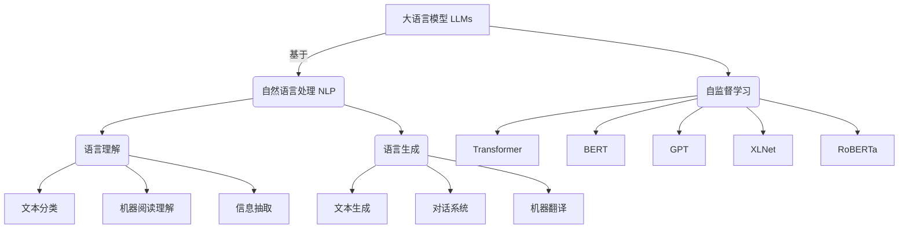

# 大语言模型应用指南：什么是大语言模型

## 1. 背景介绍

### 1.1 问题的由来

随着人工智能技术的不断发展,大型语言模型(Large Language Models, LLMs)近年来受到了广泛关注。作为一种基于深度学习的自然语言处理(NLP)技术,大语言模型能够通过训练海量文本数据,捕捉语言的复杂模式和语义关联,从而实现对自然语言的理解和生成。

传统的NLP系统通常采用基于规则或统计方法,需要手工设计特征和构建复杂的流程。而大语言模型则是一种端到端的方法,通过自监督学习直接从原始文本中学习语言知识,无需人工特征工程,具有更强的泛化能力。

然而,训练一个高质量的大语言模型需要消耗大量的计算资源,对数据、算力和算法提出了极高的要求。此外,如何有效利用大语言模型,将其应用于实际场景中,也是一个值得探讨的重要课题。

### 1.2 研究现状

近年来,以GPT(Generative Pre-trained Transformer)、BERT(Bidirectional Encoder Representations from Transformers)、XLNet、RoBERTa等为代表的大语言模型取得了令人瞩目的成就,在多项自然语言处理任务上达到了人类水平,甚至超过人类。

这些大语言模型通过预训练学习语言知识,再结合少量标注数据进行微调(fine-tuning),就能够完成文本分类、机器阅读理解、文本生成、问答系统等多种NLP任务。大语言模型的出现极大地推动了自然语言处理技术的发展,为人工智能系统赋予了更强的语言理解和生成能力。

不过,大语言模型也面临着一些挑战,例如训练成本高昂、模型可解释性差、存在偏见和不确定性等问题。如何进一步优化大语言模型的性能、降低训练成本、提高模型的可解释性和鲁棒性,是当前研究的重点方向。

### 1.3 研究意义

大语言模型作为一种通用的语言智能基础模型,具有广泛的应用前景。掌握大语言模型的原理和应用方法,对于推动自然语言处理技术的发展、构建智能对话系统、实现人机交互等具有重要意义。

本文将全面介绍大语言模型的核心概念、关键技术、训练方法和应用场景,旨在为读者提供一个系统的认知框架,帮助读者深入理解大语言模型的本质,掌握其应用开发的基本方法。

### 1.4 本文结构

本文共分为9个部分:

1. 背景介绍
2. 核心概念与联系
3. 核心算法原理与具体操作步骤
4. 数学模型和公式详细讲解与举例说明
5. 项目实践:代码实例和详细解释说明
6. 实际应用场景
7. 工具和资源推荐
8. 总结:未来发展趋势与挑战
9. 附录:常见问题与解答

## 2. 核心概念与联系

大语言模型(LLMs)是一种基于自然语言处理(NLP)技术的深度学习模型,主要用于语言理解和语言生成两大类任务。

- 语言理解任务包括文本分类、机器阅读理解、信息抽取等,旨在让机器精准理解自然语言的语义信息。
- 语言生成任务包括文本生成、对话系统、机器翻译等,目标是让机器生成符合语义逻辑的自然语言文本。

大语言模型通过自监督学习的方式,在大规模语料库上进行预训练,捕捉语言的深层次模式和语义关联,从而获得通用的语言表示能力。

目前主流的大语言模型架构多采用Transformer编码器-解码器结构,包括BERT、GPT、XLNet、RoBERTa等,通过注意力机制和残差连接等技术增强了模型的表达能力。

大语言模型为自然语言处理任务提供了一种通用的语言智能基础模型,极大推动了NLP技术的发展。掌握大语言模型的核心概念及其与NLP任务之间的联系,是理解和应用这一前沿技术的基础。

## 3. 核心算法原理与具体操作步骤

### 3.1 算法原理概述

大语言模型的核心算法是基于Transformer的自注意力机制和自监督学习范式。

1. **Transformer编码器-解码器架构**

   Transformer是一种全新的基于注意力机制的序列到序列(Seq2Seq)模型,包含编码器(Encoder)和解码器(Decoder)两个主要部分。编码器将输入序列编码为向量表示,解码器则根据编码器输出和之前生成的tokens,自回归地生成输出序列。

2. **多头自注意力机制**

   自注意力机制是Transformer的核心,它允许输入序列中的每个单词关注与之相关的单词,捕捉长距离依赖关系。多头注意力则是将注意力机制扩展到多个子空间,增强了模型的表达能力。

3. **位置编码**

   由于Transformer没有递归或卷积结构,因此引入了位置编码,将单词在序列中的位置信息编码到向量表示中,使模型具有捕捉序列顺序信息的能力。

4. **残差连接与层归一化**

   残差连接和层归一化技术有助于加速模型收敛,提高训练稳定性,是Transformer架构的重要设计。

5. **掩码语言模型与下一句预测**

   大语言模型通常采用自监督学习的方式进行预训练。BERT使用掩码语言模型(Masked LM)和下一句预测(Next Sentence Prediction)两个预训练任务,前者是根据上下文预测掩码单词,后者是判断两个句子是否相邻。GPT则使用标准的语言模型来预测下一个单词。通过预训练,模型学习到通用的语言表示能力。

6. **微调(Fine-tuning)**

   在完成预训练后,大语言模型可以针对特定的下游NLP任务(如文本分类、阅读理解等)进行微调,通过在有标注数据上进行进一步训练,使模型适应具体任务。

通过上述核心算法,大语言模型能够高效地从大规模语料中学习语义和上下文信息,为各种NLP任务提供强大的语言表示能力。

### 3.2 算法步骤详解

以BERT为例,大语言模型的训练过程可分为两个阶段:预训练(Pre-training)和微调(Fine-tuning)。

**1. 预训练阶段**

输入: 大规模原始文本语料库
输出: 预训练的BERT模型

(1) 构建预训练语料库:收集海量无标注文本数据,如网页、书籍、维基百科等。

(2) 文本预处理:对文本进行分词、词典构建、子词映射等预处理操作。

(3) 掩码语言模型构建:随机遮蔽部分单词,目标是根据上下文预测被遮蔽的单词。

(4) 下一句预测任务构建:为部分句子对构造IsNext或NotNext标签,判断两句话是否相邻。

(5) 预训练BERT模型:使用掩码语言模型和下一句预测两个任务,在大规模语料上并行训练BERT模型的编码器。

(6) 模型保存:保存预训练得到的BERT模型参数。

**2. 微调阶段**

输入: 预训练的BERT模型,特定NLP任务的标注数据集
输出: 针对该任务微调后的BERT模型

(1) 标注数据预处理:按BERT模型的输入格式,对任务数据进行分词、词典映射等预处理。

(2) 构建微调模型:在预训练的BERT模型基础上,根据具体任务构建微调模型,包括添加特定的输出层等。

(3) 微调训练:使用任务标注数据,对微调模型进行进一步训练,直至收敛。

(4) 模型评估:在任务的测试集上评估微调后模型的性能。

(5) 模型部署:保存微调后的模型,并集成到实际的应用系统中。

通过两阶段的训练方式,大语言模型能够先在大规模语料上学习通用的语言表示知识,再针对特定任务进行微调,从而发挥出更强的性能表现。

### 3.3 算法优缺点

**优点:**

1. **语言理解能力强**:通过预训练捕捉语义和上下文信息,大语言模型具备出色的语言理解能力。
2. **泛化性好**:自监督预训练使模型获得通用的语言表示知识,能够快速适应新的下游任务。
3. **无需人工特征工程**:端到端的自监督学习范式,无需人工设计特征,降低了工程复杂度。
4. **性能优异**:在多项NLP任务上达到或超过人类水平。

**缺点:**

1. **训练成本高昂**:需要消耗大量的计算资源进行预训练,对算力和算法要求很高。
2. **缺乏可解释性**:模型内部的语义捕捉过程是一个黑箱,缺乏可解释性。
3. **存在偏差和不确定性**:预训练语料和模型架构会引入一定的偏差和不确定性。
4. **幂等性差**:相同输入不一定产生相同输出,模型的鲁棒性有待提高。

### 3.4 算法应用领域

大语言模型因其强大的语言理解和生成能力,在自然语言处理的诸多领域都有广泛的应用前景:

1. **文本分类**:可将大语言模型应用于新闻分类、情感分析、垃圾邮件检测等分类任务。
2. **机器阅读理解**:用于问答系统、事实抽取、智能助手等需要深度理解文本语义的场景。
3. **信息抽取**:从非结构化文本中抽取结构化信息,如命名实体识别、关系抽取、事件抽取等。
4. **文本生成**:包括文章自动写作、对话生成、广告营销文案创作、故事续写等。
5. **机器翻译**:将大语言模型应用于多语种之间的高质量机器翻译。
6. **智能对话系统**:构建对话代理、客服机器人等交互式对话系统。
7. **知识图谱构建**:从大规模文本中自动抽取知识图谱信息。

总的来说,大语言模型为自然语言处理领域带来了革命性的突破,在各种语言理解和生成任务中展现出巨大的应用潜力。

## 4. 数学模型和公式详细讲解与举例说明

### 4.1 数学模型构建

大语言模型的核心是基于Transformer的自注意力机制,用于捕捉输入序列中单词之间的长距离依赖关系。我们先介绍自注意力机制的数学模型。

给定一个长度为 $n$ 的输入序列 $X = (x_1, x_2, ..., x_n)$,其中 $x_i \in \mathbb{R}^{d_x}$ 表示第 $i$ 个单词的 $d_x$ 维向量表示。自注意力机制的目标是计算一个加权和向量 $z_i$,作为第 $i$ 个单词的新表示:

$$z_i = \sum_{j=1}^{n}\alpha_{ij}(x_jW^V)$$

其中, $W^V \in \mathbb{R}^{d_x \times d_v}$ 是一个可训练的权重矩阵,将输入向量 $x_j$ 映射到值空间 $\mathbb{R}^{d_v}$; $\alpha_{ij}$ 是注意力分数,表示第 $i$