# 开发规范与编码标准原理与代码实战案例讲解

## 1. 背景介绍

### 1.1 问题的由来

在软件开发过程中，代码质量和可维护性是至关重要的。随着项目规模和复杂度的增加，缺乏统一的编码标准和开发规范会导致代码混乱、难以协作、bug频发等问题。因此，制定并遵循合理的开发规范和编码标准就显得尤为重要。

### 1.2 研究现状

目前，许多公司和开源社区都制定了自己的编码规范和最佳实践,例如:

- Google 的开源项目风格指南
- PEP 8 (Python 增强建议)
- 阿里巴巴 Java 开发手册
- 微软 .NET 设计指南

然而,这些规范往往针对特定语言或框架,缺乏通用性。此外,随着新技术和编程范式的出现,规范也需要不断更新和完善。

### 1.3 研究意义 

制定统一的开发规范和编码标准,可以带来以下好处:

- 提高代码可读性和可维护性
- 减少潜在 bug 和安全漏洞
- 促进团队协作和代码共享
- 加快新手入门和代码审查
- 保证项目长期健康发展

因此,探索开发规范与编码标准的原理和最佳实践,对于提高软件质量、加强团队协作、推动技术进步都有重要意义。

### 1.4 本文结构

本文将从以下几个方面深入探讨开发规范与编码标准:

1. 核心概念与联系
2. 核心算法原理与具体操作步骤  
3. 数学模型和公式详细讲解与案例分析
4. 项目实践:代码实例和详细解释
5. 实际应用场景
6. 工具和资源推荐
7. 未来发展趋势与挑战
8. 常见问题解答

## 2. 核心概念与联系

开发规范和编码标准涉及了软件工程的多个核心概念,它们相互关联、环环相扣。让我们先了解这些概念:

### 2.1 代码风格

代码风格指代码格式化的统一规范,包括缩进、空格、命名、注释等。保持良好的代码风格能够提高代码可读性,减少不必要的分歧。

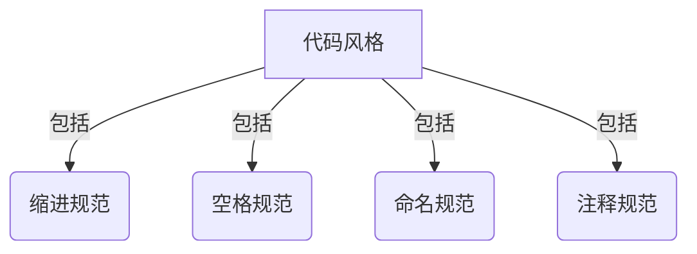

### 2.2 编码实践 

编码实践指在实际编写代码时应遵循的原则和模式,例如:

- 单一职责原则
- 开放封闭原则  
- SOLID 原则
- 设计模式的应用

良好的编码实践能提高代码质量、可扩展性和可维护性。

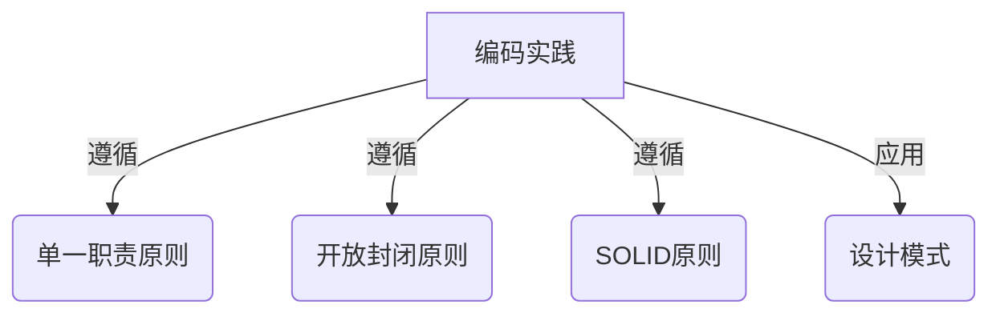

### 2.3 代码审查

代码审查是指在代码合并到主干之前,由其他开发人员审查代码质量和规范遵循情况。它可以及时发现潜在问题,提高代码质量。

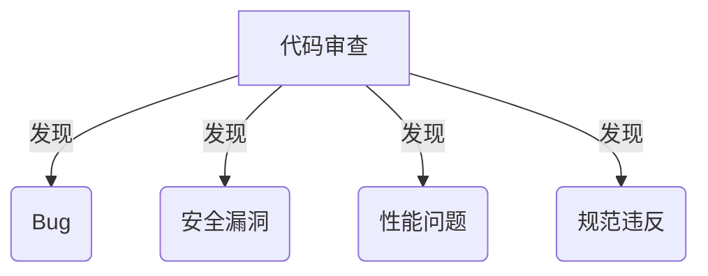

### 2.4 自动化工具

自动化工具可以自动检查代码风格、质量和安全性,减轻人工审查的工作量。例如:

- 代码格式化工具(Prettier、Black)
- 静态代码分析工具(ESLint、SonarQube)  
- 单元测试框架(JUnit、pytest)
- 持续集成工具(Jenkins、Travis CI)

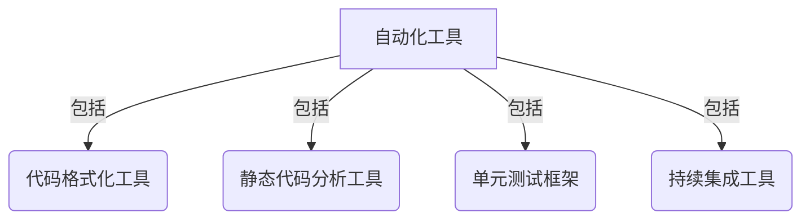

这些核心概念相互关联、环环相扣,共同构建了开发规范和编码标准的完整体系。接下来,我们将深入探讨其核心算法原理和实现细节。

## 3. 核心算法原理与具体操作步骤

### 3.1 算法原理概述

开发规范和编码标准的实现涉及多种算法,包括:

1. **代码格式化算法**: 根据预定义的规则自动格式化代码的缩进、空格、换行等。
2. **静态代码分析算法**: 通过语法树分析、数据流分析等技术,发现代码中的潜在 bug、质量问题和安全漏洞。
3. **规则匹配算法**: 将代码与预定义的规则集进行匹配,发现违反编码标准的地方。
4. **测试用例生成算法**: 根据代码自动生成测试用例,提高测试覆盖率。
5. **重构算法**: 在不改变代码行为的前提下,对代码进行重构,提高可读性和可维护性。

这些算法的有机结合,构成了开发规范和编码标准的核心算法基础。

### 3.2 算法步骤详解

以**静态代码分析算法**为例,其主要步骤如下:

1. **词法分析**: 将源代码分割成一个个有意义的词法单元(token),如关键字、变量名、运算符等。

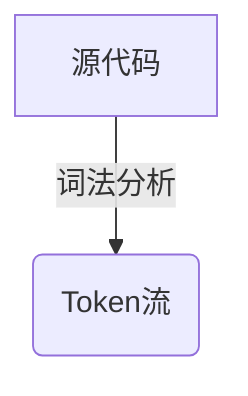

2. **语法分析**: 根据语言的语法规则,将 Token 流构建成抽象语法树(AST)。

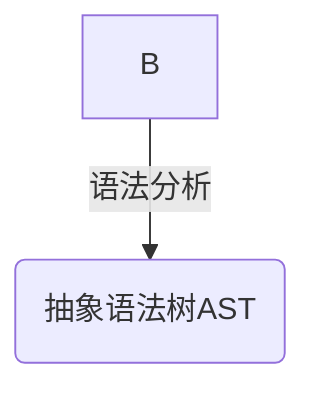

3. **数据流分析**: 在 AST 上进行数据流分析,检测变量作用域、未初始化使用等问题。

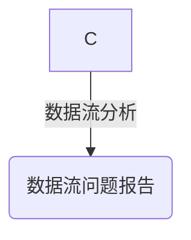

4. **控制流分析**: 在 AST 上进行控制流分析,检测死循环、不可达代码等问题。

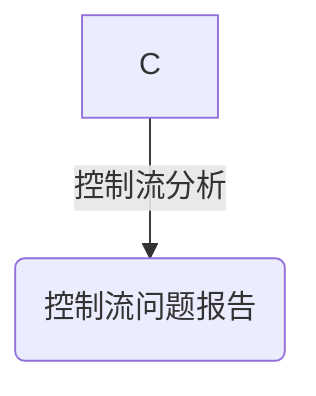

5. **规则匹配**: 将 AST 与预定义的规则集进行匹配,发现违反编码标准的地方。

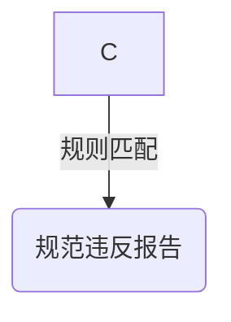

6. **报告生成**: 将检测到的所有问题汇总成报告,提供修复建议。

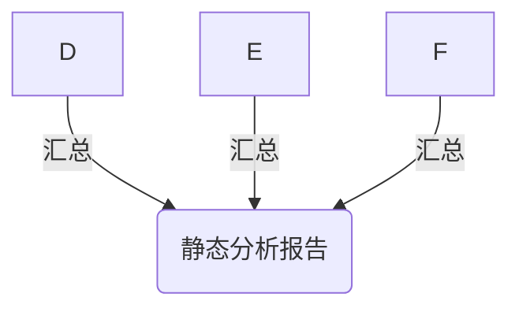

通过以上步骤,静态代码分析算法能够全面检测代码中的潜在问题和规范违反,为提高代码质量提供有力支持。

### 3.3 算法优缺点

上述算法具有以下优缺点:

**优点**:

- 自动化程度高,减轻人工审查工作量
- 能够全面检测各种潜在问题和规范违反
- 支持多种编程语言和框架
- 可配置化,能够根据团队需求定制规则

**缺点**:

- 需要一定的配置和调优成本
- 对于复杂的逻辑,分析准确性可能不足
- 无法完全取代人工审查和测试
- 对于新语言特性和框架,支持可能滞后

### 3.4 算法应用领域

上述算法在以下领域有广泛应用:

- **开源社区**: 开源项目通常会制定自己的编码规范,并使用自动化工具强制执行。
- **企业级开发**: 大型企业会为不同语言和框架制定内部编码标准,并集成到持续集成/持续交付(CI/CD)流程中。
- **编程教育**: 在编程教学中,自动化工具可以帮助学生养成良好的编码习惯。
- **代码审查**: 自动化工具可以辅助人工代码审查,提高效率和质量。
- **低代码/无代码开发**: 通过可视化工具和代码生成技术,确保生成的代码符合规范。

## 4. 数学模型和公式详细讲解与案例分析

在开发规范和编码标准的实现中,数学模型和公式也扮演着重要角色。让我们来详细探讨其中的一些核心概念。

### 4.1 数学模型构建

#### 4.1.1 形式语言理论

形式语言理论是计算机科学的基础理论之一,它为编程语言的设计和实现提供了坚实的数学基础。在开发规范和编码标准的实现中,我们需要对编程语言的语法和语义进行建模和分析。

形式语言可以用一个四元组 $L = (V, \Sigma, R, S)$ 来表示,其中:

- $V$ 是非终结符号集合
- $\Sigma$ 是终结符号集合
- $R$ 是产生式规则集合
- $S \in V$ 是开始符号

例如,一个简单的算术表达式语言可以用以下形式语言来描述:

$$
\begin{aligned}
V &= \{\text{Expr}, \text{Term}, \text{Factor}\} \
\Sigma &= \{+, -, *, /, (, ), 0, 1, 2, \ldots, 9\} \
R &= \begin{cases}
\text{Expr} \rightarrow \text{Term} \
\text{Expr} \rightarrow \text{Expr} + \text{Term} \
\text{Expr} \rightarrow \text{Expr} - \text{Term} \
\text{Term} \rightarrow \text{Factor} \
\text{Term} \rightarrow \text{Term} * \text{Factor} \
\text{Term} \rightarrow \text{Term} / \text{Factor} \
\text{Factor} \rightarrow (\text{Expr}) \
\text{Factor} \rightarrow \text{Digit}
\end{cases} \
S &= \text{Expr}
\end{aligned}
$$

通过形式语言理论,我们可以对编程语言的语法进行严格的数学建模,为后续的语法分析和规则匹配奠定基础。

#### 4.1.2 图论

在静态代码分析中,抽象语法树(AST)是一种广泛使用的数据结构,它可以用图论中的有向树来建模。

一棵有向树 $T = (V, E)$ 由一个顶点集合 $V$ 和一个有向边集合 $E$ 组成,满足以下条件:

- 存在一个唯一的根节点 $r \in V$,对于任意其他节点 $v \in V \setminus \{r\}$,都存在一条唯一的有向路径从 $r$ 到 $v$。
- 对于任意 $v \in V$,存在至多一条有向边 $(u, v) \in E$。

在 AST 中,每个节点表示源代码中的一个语法构造,如语句、表达式、操作符等。节点之间的有向边表示构造之间的包含关系。

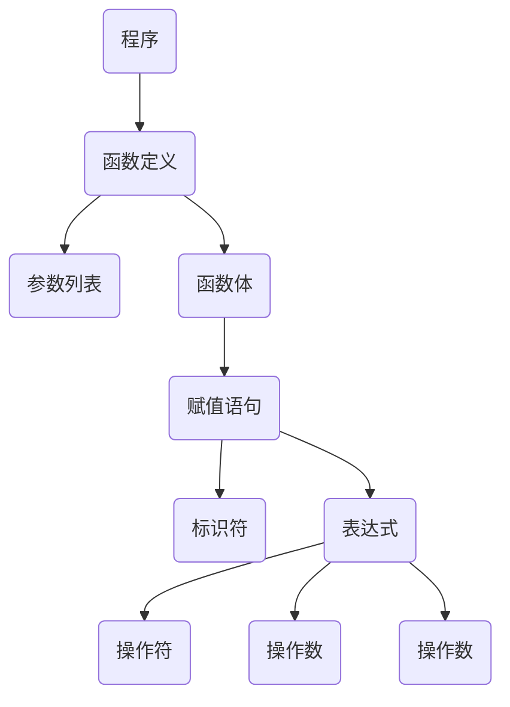

通过在 AST 上进行遍历和模式匹配,我们可以发现代码中的潜在问题和规范违反。图论为 AST 的构建、遍历和分析提供了数学基础。

### 4.2 公式推导过程

在静态代码分析中,我们需要计算一些代码指标,如圈复杂度、分支覆盖率等。这些指标的计算过程往往涉及复杂的数学公式推导。

#### 4.2.1 圈复杂度

圈复杂度(Cyclomatic Complexity)是一种衡量代码复杂度的指标,它反映了程序的控制流复杂程度。圈复杂度的计算公式如下:

$$
M = E - N + 2P
$$

其中:

- $M$ 是圈复杂度
- $E$ 是程序流程图中边的数量
- $N$ 是程序流程图中节点的数量
- $P$ 是程序流程图中环路的数量

我们可以将程序的控制流转换为流程图,然后计算边数、节点数和环路数,即可得到圈复杂度。

例如,对于以下代码片段:

```python
def foo(x, y):
    