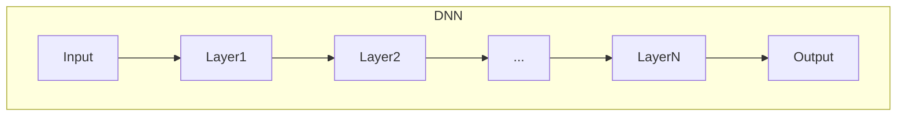

# 深度 Q-learning：DL、ML 和 AI 的交集

## 1. 背景介绍

### 1.1 问题的由来

在人工智能领域中，强化学习是一种重要的机器学习范式,旨在通过与环境的交互来学习最优策略。传统的强化学习算法,如 Q-learning 和 SARSA,在处理具有高维状态空间和动作空间的复杂问题时,往往会遇到维数灾难的挑战。为了解决这一问题,深度强化学习 (Deep Reinforcement Learning, DRL) 应运而生,它将深度神经网络与强化学习相结合,利用神经网络的强大函数逼近能力来近似值函数或策略函数。

深度 Q-learning (Deep Q-Learning, DQN) 是深度强化学习领域的一个里程碑式算法,它将深度神经网络用于近似 Q 值函数,从而能够处理高维状态空间和动作空间的问题。DQN 算法的提出不仅推动了深度强化学习的发展,也促进了机器学习、深度学习和人工智能等领域的交叉融合。

### 1.2 研究现状

自 2015 年 DeepMind 提出 DQN 算法以来,深度强化学习领域取得了长足的进步。研究人员不断改进和扩展 DQN 算法,提出了诸如 Double DQN、Dueling DQN、Prioritized Experience Replay 等变体算法,以提高算法的性能和稳定性。同时,DQN 也被成功应用于多个领域,如视频游戏、机器人控制、自然语言处理等。

然而,DQN 算法仍然存在一些局限性,例如对离散动作空间的依赖、探索效率低下、难以处理连续控制问题等。为了解决这些问题,研究人员提出了新的深度强化学习算法,如 DDPG、A3C、PPO 等,这些算法进一步扩展了深度强化学习的应用范围。

### 1.3 研究意义

深度 Q-learning 算法的提出,标志着人工智能、机器学习和深度学习三个领域的交叉融合。它不仅推动了强化学习算法的发展,也促进了深度神经网络在决策和控制领域的应用。研究深度 Q-learning 算法有以下重要意义:

1. **理论意义**: 深入探讨深度 Q-learning 算法的原理和机制,有助于加深对强化学习和深度学习的理解,为进一步改进和创新算法奠定理论基础。

2. **应用价值**: 深度 Q-learning 算法在多个领域展现出巨大的应用潜力,如游戏AI、机器人控制、自动驾驶等。研究该算法有助于推动相关领域的技术进步。

3. **交叉融合**: 深度 Q-learning 算法是深度学习、机器学习和强化学习三个领域交叉融合的产物,研究该算法有助于促进不同领域的相互借鉴和融合,推动人工智能技术的发展。

### 1.4 本文结构

本文将全面介绍深度 Q-learning 算法的理论基础、核心原理、实现细节和应用场景。文章的主要结构如下:

1. **背景介绍**: 阐述深度 Q-learning 算法的由来、研究现状和意义。

2. **核心概念与联系**: 介绍深度 Q-learning 算法所涉及的核心概念,如强化学习、Q-learning、深度神经网络等,并阐明它们之间的关联。

3. **核心算法原理与具体操作步骤**: 详细解释深度 Q-learning 算法的原理和实现细节,包括算法流程、网络结构、超参数设置等。

4. **数学模型和公式详细讲解与举例说明**: 推导深度 Q-learning 算法所涉及的数学模型和公式,并通过具体案例进行讲解和分析。

5. **项目实践:代码实例和详细解释说明**: 提供深度 Q-learning 算法的代码实现示例,并对关键代码进行解读和分析。

6. **实际应用场景**: 介绍深度 Q-learning 算法在游戏AI、机器人控制、自动驾驶等领域的实际应用案例。

7. **工具和资源推荐**: 推荐深度 Q-learning 算法相关的学习资源、开发工具、论文等。

8. **总结:未来发展趋势与挑战**: 总结深度 Q-learning 算法的研究成果,并展望其未来发展趋势和面临的挑战。

9. **附录:常见问题与解答**: 针对深度 Q-learning 算法的常见问题进行解答和说明。

## 2. 核心概念与联系

在深入探讨深度 Q-learning 算法之前,我们需要先了解它所涉及的几个核心概念,包括强化学习、Q-learning 算法、深度神经网络等,并阐明它们之间的关联。

### 2.1 强化学习

强化学习 (Reinforcement Learning, RL) 是一种基于环境交互的机器学习范式。在强化学习中,智能体 (Agent) 通过与环境 (Environment) 进行交互,观察当前状态 (State),执行动作 (Action),并获得相应的奖励 (Reward)。智能体的目标是学习一个最优策略 (Policy),使得在给定环境下获得的累积奖励最大化。

强化学习可以形式化为一个马尔可夫决策过程 (Markov Decision Process, MDP),其中包括以下几个核心要素:

- **状态 (State)**: 描述环境的当前状态。
- **动作 (Action)**: 智能体可以执行的动作。
- **奖励 (Reward)**: 智能体执行动作后从环境获得的即时回报。
- **状态转移概率 (State Transition Probability)**: 描述在执行某个动作后,环境从一个状态转移到另一个状态的概率。
- **折扣因子 (Discount Factor)**: 用于权衡即时奖励和未来奖励的重要性。

强化学习算法的目标是找到一个最优策略 $\pi^*$,使得在该策略下,智能体从初始状态开始,期望获得的累积折扣奖励最大化,即:

$$
\pi^* = \arg\max_\pi \mathbb{E}\left[\sum_{t=0}^\infty \gamma^t r_t | \pi\right]
$$

其中 $\gamma \in [0, 1)$ 是折扣因子,用于平衡即时奖励和未来奖励的权重。

### 2.2 Q-learning 算法

Q-learning 是一种基于时序差分 (Temporal Difference, TD) 的无模型强化学习算法,它不需要事先了解环境的状态转移概率和奖励函数,而是通过与环境的交互来学习最优策略。

Q-learning 算法的核心思想是估计一个 Q 值函数 $Q(s, a)$,表示在状态 $s$ 下执行动作 $a$ 后,可以获得的期望累积奖励。最优 Q 值函数 $Q^*(s, a)$ 满足下式:

$$
Q^*(s, a) = \mathbb{E}\left[r_t + \gamma \max_{a'} Q^*(s', a') | s_t = s, a_t = a\right]
$$

其中 $r_t$ 是立即奖励, $s'$ 是执行动作 $a$ 后到达的下一个状态, $\gamma$ 是折扣因子。

Q-learning 算法通过不断更新 Q 值函数,使其逼近最优 Q 值函数 $Q^*$。更新规则如下:

$$
Q(s_t, a_t) \leftarrow Q(s_t, a_t) + \alpha \left[r_t + \gamma \max_{a'} Q(s_{t+1}, a') - Q(s_t, a_t)\right]
$$

其中 $\alpha$ 是学习率,控制着更新幅度。

通过不断与环境交互并更新 Q 值函数,Q-learning 算法最终可以找到一个近似最优策略 $\pi^*$,使得对于任意状态 $s$,执行 $\pi^*(s) = \arg\max_a Q^*(s, a)$ 可以获得最大的期望累积奖励。

### 2.3 深度神经网络

深度神经网络 (Deep Neural Network, DNN) 是一种强大的机器学习模型,具有很好的函数逼近能力。它由多层神经元组成,每一层通过非线性变换对上一层的输出进行处理,最终将输入映射到输出。

深度神经网络的基本结构如下:

其中,每一层都由多个神经元组成,每个神经元执行如下计算:

$$
y = f\left(\sum_{i=1}^n w_i x_i + b\right)
$$

其中 $x_i$ 是输入, $w_i$ 是权重, $b$ 是偏置, $f$ 是非线性激活函数,如 ReLU、Sigmoid 等。

通过反向传播算法,深度神经网络可以根据输入和期望输出,自动学习权重和偏置的最优值,从而实现特定的映射函数。深度神经网络在计算机视觉、自然语言处理、语音识别等领域展现出了卓越的性能。

### 2.4 深度 Q-learning 算法

深度 Q-learning 算法将深度神经网络与 Q-learning 算法相结合,用于近似 Q 值函数。具体来说,深度神经网络以状态 $s$ 为输入,输出对应的 Q 值 $Q(s, a)$,即:

$$
Q(s, a; \theta) \approx Q^*(s, a)
$$

其中 $\theta$ 表示深度神经网络的参数。

在训练过程中,深度 Q-learning 算法通过与环境交互获取样本 $(s_t, a_t, r_t, s_{t+1})$,并根据 Q-learning 的更新规则计算目标值 $y_t$:

$$
y_t = r_t + \gamma \max_{a'} Q(s_{t+1}, a'; \theta^-)
$$

其中 $\theta^-$ 表示目标网络的参数,用于增强算法的稳定性。

然后,深度 Q-learning 算法通过最小化损失函数来更新神经网络参数 $\theta$:

$$
L(\theta) = \mathbb{E}_{(s, a, r, s')\sim D}\left[(y_t - Q(s, a; \theta))^2\right]
$$

其中 $D$ 是经验回放池 (Experience Replay Buffer),用于存储过去的交互样本,增强样本的利用效率和算法的稳定性。

通过不断与环境交互、更新神经网络参数,深度 Q-learning 算法可以逐步学习到近似最优的 Q 值函数,从而找到一个近似最优策略。

深度 Q-learning 算法的优点在于:

1. 利用深度神经网络的强大函数逼近能力,可以处理高维状态空间和动作空间的问题。
2. 通过经验回放池和目标网络,提高了算法的稳定性和收敛性。
3. 算法简单易懂,易于实现和扩展。

然而,深度 Q-learning 算法也存在一些局限性,如仅适用于离散动作空间、探索效率低下等。因此,研究人员提出了多种改进和扩展算法,如 Double DQN、Dueling DQN、Prioritized Experience Replay 等,以提高算法的性能和适用范围。

## 3. 核心算法原理与具体操作步骤

### 3.1 算法原理概述

深度 Q-learning 算法的核心思想是利用深度神经网络来近似 Q 值函数,从而解决传统 Q-learning 算法在处理高维状态空间和动作空间时面临的维数灾难问题。

算法的基本流程如下:

1. 初始化深度神经网络及其参数 $\theta$,用于近似 Q 值函数 $Q(s, a; \theta)$。
2. 初始化目标网络及其参数 $\theta^-$,用于计算目标值 $y_t$,增强算法的稳定性。
3. 初始化经验回放池 $D$,用于存储过去的交互样本。
4. 对于每一个时间步:
   a. 根据当前策略从 $Q(s, a; \theta)$ 中选择动作 $a_t$。
   b. 执行动作 $a_t$,观察到下一个状态 $s_{t+1}$ 和即时奖励 $r_t$。
   c. 将 $(s_t, a_t, r_t, s_{t+1})$ 存储到经验回放池 $