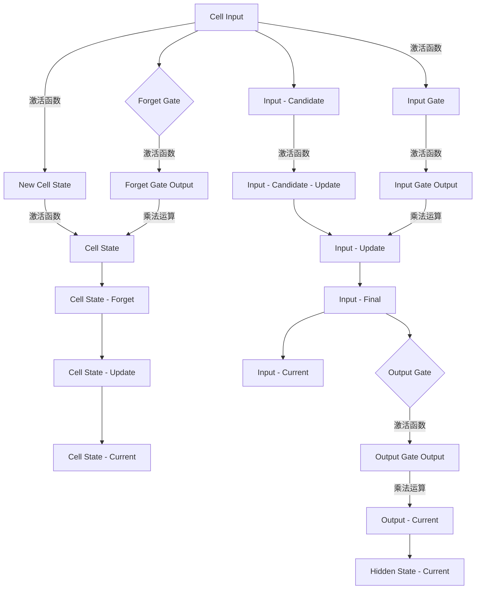
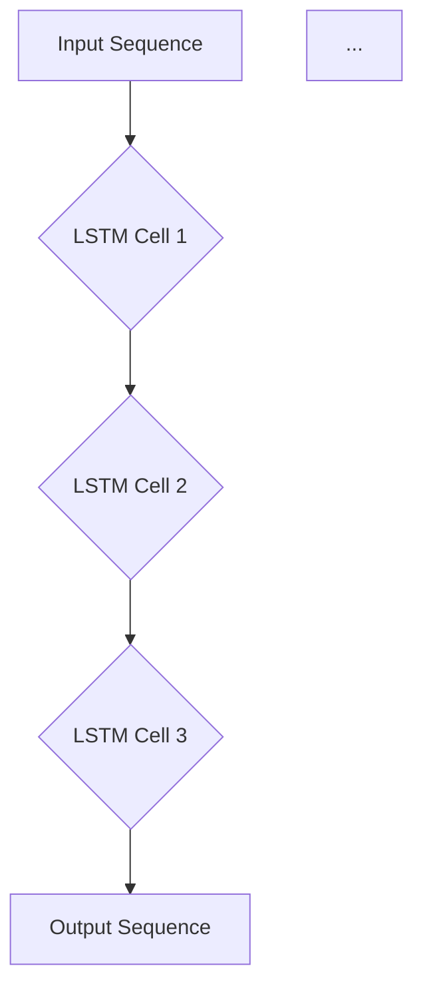

# 长短时记忆网络 (LSTM) 原理与代码实例讲解

作者：禅与计算机程序设计艺术 / Zen and the Art of Computer Programming

## 1. 背景介绍

### 1.1 问题的由来

在传统的循环神经网络（RNN）中，长期依赖问题一直是困扰研究者的一大难题。RNN在处理序列数据时，由于梯度消失或爆炸现象，难以学习到长期依赖关系。为了解决这个问题，Hochreiter和Schmidhuber于1997年提出了长短时记忆网络（Long Short-Term Memory，LSTM）。

### 1.2 研究现状

随着深度学习技术的发展，LSTM已经在多个领域取得了显著的成果，如自然语言处理、语音识别、时间序列分析等。近年来，研究者们对LSTM进行了不断改进，提出了许多变体，如门控循环单元（GRU）、双向LSTM等，以适应不同场景的需求。

### 1.3 研究意义

LSTM作为一种有效的序列数据处理模型，对于推动人工智能技术的发展具有重要意义。它不仅能够解决RNN的长期依赖问题，还能在各种实际应用中取得优异的性能。

### 1.4 本文结构

本文将首先介绍LSTM的核心概念和原理，然后通过代码实例进行讲解，最后探讨LSTM在实际应用中的场景和未来发展趋势。

## 2. 核心概念与联系

LSTM是循环神经网络（RNN）的一种变体，它通过引入门控机制来控制信息的流动，从而有效学习长期依赖关系。

### 2.1 隐藏状态（h_t）

LSTM的隐藏状态h_t表示了当前时间步的信息，包含了历史信息的摘要。h_t是LSTM网络的核心，它通过遗忘门、输入门和输出门进行更新。

### 2.2 单个LSTM单元

LSTM单元由输入门、遗忘门、细胞状态和输出门组成。以下是一个LSTM单元的Mermaid流程图：



### 2.3 LSTM网络

LSTM网络由多个LSTM单元组成，每个单元接收前一个单元的输出作为输入，并产生当前的输出。以下是一个LSTM网络的Mermaid流程图：



## 3. 核心算法原理 & 具体操作步骤

### 3.1 算法原理概述

LSTM通过遗忘门、输入门和输出门来控制信息的流动。遗忘门决定哪些信息被丢弃，输入门决定哪些信息被保存，输出门决定哪些信息被输出。

### 3.2 算法步骤详解

1. 遗忘门：根据当前输入和前一个隐藏状态，计算遗忘门的输出，用于决定哪些信息被丢弃。
2. 输入门：根据当前输入和前一个隐藏状态，计算输入门的输出，用于决定哪些信息被保存。
3. 单个细胞状态：根据遗忘门、输入门和候选状态，计算新的细胞状态。
4. 输出门：根据细胞状态和前一个隐藏状态，计算输出门的输出，用于决定哪些信息被输出。

### 3.3 算法优缺点

#### 优点

1. 解决了RNN的长期依赖问题。
2. 能够学习长期依赖关系。
3. 在多种序列数据处理任务中表现出色。

#### 缺点

1. 计算复杂度高，训练时间较长。
2. 对于某些任务，模型性能可能不如其他模型。

### 3.4 算法应用领域

LSTM在以下领域有着广泛的应用：

1. 自然语言处理：文本分类、情感分析、机器翻译、文本生成等。
2. 语音识别：语音识别、语音合成、语音转换等。
3. 时间序列分析：股票预测、天气预测、交通流量预测等。

## 4. 数学模型和公式 & 详细讲解 & 举例说明

### 4.1 数学模型构建

LSTM的数学模型主要基于神经网络和门控机制。以下是一个LSTM单元的数学模型：

$$
h_t = \text{sigmoid}(W_f \cdot [h_{t-1}, x_t] + b_f) \cdot f_t + \text{sigmoid}(W_i \cdot [h_{t-1}, x_t] + b_i) \cdot i_t + \text{sigmoid}(W_o \cdot [h_{t-1}, x_t] + b_o) \cdot o_t
$$

其中，$W_f$、$W_i$、$W_o$分别是遗忘门、输入门和输出门的权重矩阵，$b_f$、$b_i$、$b_o$分别是遗忘门、输入门和输出门的偏置向量，$f_t$、$i_t$、$o_t$分别是遗忘门、输入门和输出门的输出，$[h_{t-1}, x_t]$表示输入序列的第t个时间步的输入和前一个隐藏状态。

### 4.2 公式推导过程

LSTM的数学模型推导过程较为复杂，涉及矩阵运算、激活函数等。这里简要介绍遗忘门、输入门和输出门的公式推导过程。

#### 遗忘门

遗忘门根据当前输入和前一个隐藏状态计算遗忘门输出：

$$
f_t = \text{sigmoid}(W_f \cdot [h_{t-1}, x_t] + b_f)
$$

其中，$W_f$是遗忘门的权重矩阵，$b_f$是遗忘门的偏置向量，$\text{sigmoid}$是Sigmoid激活函数。

#### 输入门

输入门根据当前输入和前一个隐藏状态计算输入门输出：

$$
i_t = \text{sigmoid}(W_i \cdot [h_{t-1}, x_t] + b_i)
$$

其中，$W_i$是输入门的权重矩阵，$b_i$是输入门的偏置向量。

#### 输出门

输出门根据细胞状态和前一个隐藏状态计算输出门输出：

$$
o_t = \text{sigmoid}(W_o \cdot [h_{t-1}, x_t] + b_o)
$$

其中，$W_o$是输出门的权重矩阵，$b_o$是输出门的偏置向量。

### 4.3 案例分析与讲解

以下是一个LSTM在文本分类任务中的应用示例：

1. 数据准备：将文本数据划分为训练集和测试集。
2. 模型构建：使用LSTM模型对训练数据进行训练。
3. 模型评估：使用测试集评估模型的性能。

### 4.4 常见问题解答

#### 如何处理序列长度不一致的问题？

对于序列长度不一致的问题，可以使用以下方法：

1. 切片填充：将较长的序列截断，较短的序列进行填充。
2. 采样：对较长的序列进行采样，得到固定长度的子序列。
3. 长短时记忆池（Long Short-Term Memory Pooling，LSTMP）。

## 5. 项目实践：代码实例和详细解释说明

### 5.1 开发环境搭建

1. 安装Python环境。
2. 安装TensorFlow或PyTorch库。

### 5.2 源代码详细实现

以下是一个使用TensorFlow构建LSTM模型的示例：

```python
import tensorflow as tf
from tensorflow.keras.models import Sequential
from tensorflow.keras.layers import LSTM, Dense

# 模型构建
model = Sequential()
model.add(LSTM(128, return_sequences=True, input_shape=(max_sequence_length, num_features)))
model.add(LSTM(128))
model.add(Dense(num_classes, activation='softmax'))

# 编译模型
model.compile(loss='categorical_crossentropy', optimizer='adam', metrics=['accuracy'])

# 训练模型
model.fit(train_data, train_labels, epochs=epochs, batch_size=batch_size, validation_data=(test_data, test_labels))

# 评估模型
score, acc = model.evaluate(test_data, test_labels, verbose=2)
print(f"Test score: {score:.4f}, accuracy: {acc:.4f}")
```

### 5.3 代码解读与分析

上述代码首先导入所需的库，然后构建LSTM模型。模型由两个LSTM层和一个全连接层组成。编译模型时，使用交叉熵损失函数和Adam优化器。训练模型时，使用训练数据和标签进行训练，并设置验证集。最后，评估模型的性能。

### 5.4 运行结果展示

运行上述代码后，会输出模型的性能指标，包括测试集上的损失值和准确率。

## 6. 实际应用场景

### 6.1 自然语言处理

LSTM在自然语言处理领域有着广泛的应用，如文本分类、情感分析、机器翻译、文本生成等。

### 6.2 语音识别

LSTM在语音识别领域可以用于声学模型、语言模型和声学-语言联合模型。

### 6.3 时间序列分析

LSTM在时间序列分析领域可以用于股票预测、天气预测、交通流量预测等。

## 7. 工具和资源推荐

### 7.1 学习资源推荐

1. 《深度学习》: 作者：Ian Goodfellow, Yoshua Bengio, Aaron Courville
2. 《神经网络与深度学习》: 作者：邱锡鹏

### 7.2 开发工具推荐

1. TensorFlow: [https://www.tensorflow.org/](https://www.tensorflow.org/)
2. PyTorch: [https://pytorch.org/](https://pytorch.org/)

### 7.3 相关论文推荐

1. "Long Short-Term Memory" by Hochreiter and Schmidhuber
2. "Sequence to Sequence Learning with Neural Networks" by Sutskever et al.

### 7.4 其他资源推荐

1. [Keras LSTM教程](https://keras.io/lstm/)
2. [TensorFlow LSTM教程](https://www.tensorflow.org/tutorials/sequence/sequential)

## 8. 总结：未来发展趋势与挑战

### 8.1 研究成果总结

LSTM作为一种有效的序列数据处理模型，已经在多个领域取得了显著的成果。然而，随着深度学习技术的发展，LSTM仍面临着一些挑战。

### 8.2 未来发展趋势

1. 模型简化：简化LSTM结构，提高计算效率。
2. 多模态学习：结合多种模态数据进行序列处理。
3. 跨领域学习：在不同领域之间迁移LSTM模型。

### 8.3 面临的挑战

1. 计算复杂度：LSTM的计算复杂度较高，需要大量的计算资源。
2. 梯度消失和梯度爆炸：LSTM在处理长序列时，仍然存在梯度消失和梯度爆炸问题。
3. 模型泛化能力：LSTM在处理未知数据时，可能存在泛化能力不足的问题。

### 8.4 研究展望

随着深度学习技术的不断发展，LSTM将在未来得到更广泛的应用。为了应对挑战，研究者们将不断优化LSTM模型，提高其性能和效率。

## 9. 附录：常见问题与解答

### 9.1 什么是LSTM？

LSTM（Long Short-Term Memory）是一种特殊的循环神经网络，它通过引入门控机制来控制信息的流动，从而有效学习长期依赖关系。

### 9.2 LSTM与RNN有何区别？

LSTM是RNN的一种变体，它通过引入门控机制来解决RNN的长期依赖问题。

### 9.3 如何优化LSTM模型？

优化LSTM模型可以从以下几个方面入手：

1. 模型简化：简化LSTM结构，提高计算效率。
2. 学习率调整：调整学习率，提高模型收敛速度。
3. 正则化技术：使用正则化技术，如Dropout，防止过拟合。

### 9.4 LSTM在实际应用中有什么优势？

LSTM在处理序列数据时，能够学习到长期依赖关系，因此在自然语言处理、语音识别、时间序列分析等领域具有显著优势。

### 9.5 如何解决LSTM的梯度消失和梯度爆炸问题？

解决LSTM的梯度消失和梯度爆炸问题可以从以下几个方面入手：

1. 使用梯度裁剪技术，限制梯度的大小。
2. 使用LSTM变体，如GRU，解决梯度消失和梯度爆炸问题。
3. 使用残差连接，减轻梯度消失和梯度爆炸的影响。

### 9.6 如何评估LSTM模型的性能？

评估LSTM模型的性能可以从以下几个方面入手：

1. 准确率：评估模型在测试数据上的预测准确率。
2. 泛化能力：评估模型在未知数据上的预测能力。
3. 计算复杂度：评估模型的计算复杂度。