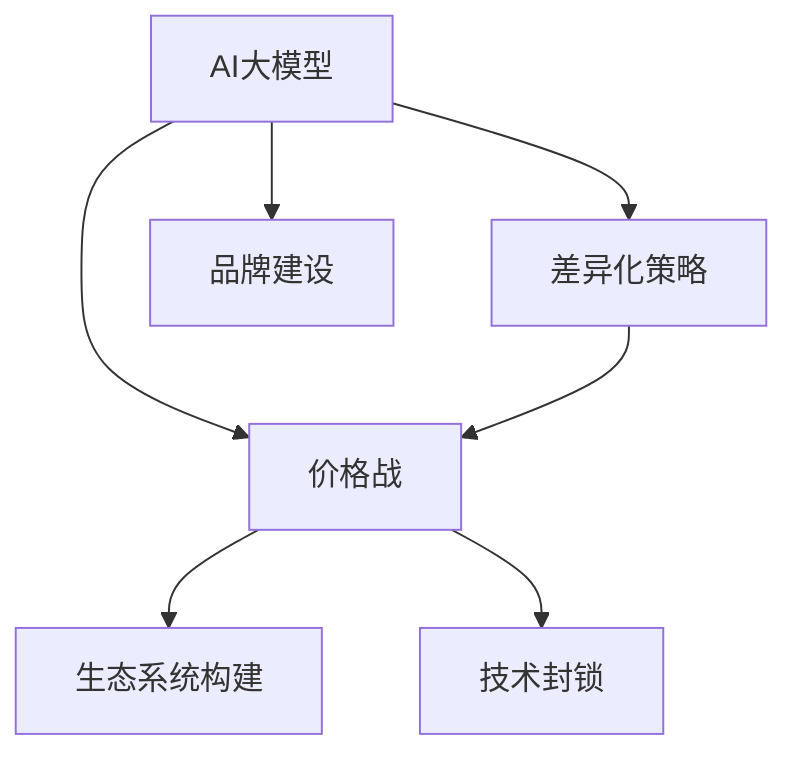

                 

## 1. 背景介绍

在AI大模型领域的创业中，尽管技术研发成果斐然，但未来的市场竞争不可避免地将演变为价格战。价格战不仅影响公司的财务表现，还可能对技术进步和行业健康产生深远影响。本文将探讨价格战背后的原因，并提供应对策略，帮助AI大模型创业公司构建更稳健的市场定位和盈利模式。

### 1.1 价格战的经济学解释

价格战是市场竞争的一种极端表现形式，主要体现在公司的市场策略，即通过降低产品价格来吸引客户，以期获得更多的市场份额。从经济学的角度来看，价格战通常源于市场集中度低，竞争对手众多，且产品或服务具有同质性。竞争者通过价格战可以迅速占据市场份额，但也伴随着利润率下降和价格敏感度上升的风险。

### 1.2 AI大模型价格战的原因

1. **高昂的研发成本**：AI大模型的开发需要大量的数据、计算资源和人力资源，初期投入巨大，研发周期长。一旦进入市场，部分企业可能会采用价格战策略，快速抢占市场份额，以期尽快收回前期投入。

2. **市场的不确定性**：由于AI大模型技术的复杂性和前沿性，市场对产品实际效用和收益的预期存在不确定性，消费者可能更倾向于选择价格更低的产品，以降低使用风险。

3. **竞争压力**：AI大模型市场尚未完全成熟，竞争者众多，且产品之间的性能差异较小，竞争者为了保持或提升市场份额，可能会通过降价策略吸引用户。

### 1.3 价格战对创业公司的影响

1. **利润空间压缩**：价格战会导致产品售价下降，直接压缩公司的利润空间。

2. **研发投入压力**：价格战促使企业加速推进研发，缩短产品上市时间，增加研发投入。

3. **市场份额争夺**：通过降价可以迅速扩大市场份额，但这也意味着在降价后维持高份额将更加困难。

4. **品牌定位风险**：长期的价格战可能导致消费者对品牌失去信心，品牌形象受损。

## 2. 核心概念与联系

### 2.1 核心概念概述

为应对未来可能的AI大模型价格战，我们首先介绍几个关键概念，并分析它们之间的联系。

1. **AI大模型**：指利用深度学习和神经网络技术，通过大量数据训练得到的具有高度通用性的人工智能模型。

2. **价格战**：公司通过降低产品价格，以期在短期内获得更多市场份额的竞争策略。

3. **差异化策略**：通过技术创新、产品优化或服务升级，以区别于竞争对手，提供独特价值。

4. **生态系统构建**：构建围绕AI大模型的产品和服务生态系统，实现生态系统内部协同和互补，提升整体竞争力。

5. **技术封锁**：通过知识产权和专利等手段，限制竞争对手模仿和竞争，保护自身市场地位。

### 2.2 核心概念之间的关系

以下用Mermaid流程图展示这些概念之间的关系：



这个流程图显示了AI大模型、差异化策略、价格战、生态系统构建和技术封锁之间的关系：

1. **AI大模型**：基础核心，是差异化策略、价格战、生态系统构建和技术封锁的前提。

2. **差异化策略**：通过技术创新和产品优化，提供独特价值，避免价格战。

3. **价格战**：短期内的竞争策略，可能破坏市场生态，影响技术发展。

4. **生态系统构建**：构建围绕AI大模型的产品和服务生态系统，提升整体竞争力。

5. **技术封锁**：通过知识产权和专利保护，限制竞争对手模仿，保护市场地位。

## 3. 核心算法原理 & 具体操作步骤

### 3.1 算法原理概述

应对价格战的策略主要集中在差异化和技术封锁两个方面。差异化策略需要通过持续的技术创新和产品优化，为消费者提供独特价值；技术封锁则通过知识产权保护和专利布局，限制竞争对手的模仿和复制。

### 3.2 算法步骤详解

1. **技术创新与产品优化**：持续投入研发，不断优化产品性能，提升用户体验。

   - 技术研发：聚焦AI大模型的核心技术，如模型架构、训练方法、推理优化等，持续提升模型性能。

   - 用户体验优化：关注用户需求，提升界面友好性，简化操作流程，提升易用性。

2. **知识产权和专利保护**：通过技术专利和商标，限制竞争对手模仿。

   - 申请专利：针对核心技术，尤其是具有创新性的算法和模型，及时申请专利保护。

   - 商标保护：通过商标注册，保护品牌形象，防止混淆和侵权。

3. **市场和用户教育**：向市场和用户传递产品价值，提升用户认知度。

   - 市场宣传：通过广告、公关和合作，提升产品知名度。

   - 用户教育：通过教程、文档和培训，向用户传递产品价值和使用方法。

### 3.3 算法优缺点

**优点**：

1. **避免直接竞争**：差异化和技术封锁策略可以避免直接的价格战，保护公司利润。

2. **提升市场份额**：通过差异化，可以吸引更多用户，提升市场份额。

3. **延长市场周期**：技术封锁可以延长产品的市场生命周期，增加收益时间。

**缺点**：

1. **研发投入高**：持续的技术创新和专利申请需要大量资金和资源投入。

2. **市场响应速度慢**：差异化策略和技术封锁的实施周期较长，难以迅速应对市场变化。

3. **高风险**：专利和技术封锁可能面临法律挑战和市场变化的风险。

### 3.4 算法应用领域

1. **技术研发**：面向AI大模型核心技术的持续创新。

2. **市场推广**：通过广告、公关、合作等手段提升产品知名度。

3. **知识产权保护**：通过专利和技术封锁限制竞争对手。

4. **用户教育**：提升用户对产品的理解和认可。

## 4. 数学模型和公式 & 详细讲解 & 举例说明

### 4.1 数学模型构建

为更好说明技术封锁的数学模型，我们假设一个简单的垄断市场模型。市场上有两家公司A和B，市场总需求为$D$，两家公司的产品相似但不同，A公司通过专利技术获得成本优势，B公司无法复制A公司的技术。

**假设条件**：
- 公司A拥有专利技术，使得其成本函数为$C_A(q_A) = a_1q_A + a_2q_A^2$，其中$q_A$为公司A的产量，$a_1$和$a_2$为常数。
- 公司B的成本函数为$C_B(q_B) = b_1q_B + b_2q_B^2$，其中$q_B$为公司B的产量，$b_1$和$b_2$为常数。

公司A和B的最大化利润为：

$$
\max \pi = pq - C
$$

其中$p$为市场价格，$q$为总产量，$C$为总成本。

### 4.2 公式推导过程

设市场需求函数为$D(p) = Ap - B$，其中$A$和$B$为市场参数。当市场达到均衡时，公司A和B的产量$q_A$和$q_B$需要满足以下条件：

1. 公司A的利润最大化问题为：

$$
\max \pi_A = pq - C_A = (A-\frac{B}{p})q_A - (a_1q_A + a_2q_A^2)
$$

对$q_A$求导，得到最优产量：

$$
q_A^* = \frac{A - Bp - a_1}{2a_2}
$$

2. 公司B的利润最大化问题为：

$$
\max \pi_B = pq - C_B = (A-\frac{B}{p})q_B - (b_1q_B + b_2q_B^2)
$$

对$q_B$求导，得到最优产量：

$$
q_B^* = \frac{A - Bp - b_1}{2b_2}
$$

3. 市场均衡条件为$q_A + q_B = D(p)$，代入$D(p)$和$q_A^*$，$q_B^*$的表达式，可以求解出市场均衡价格$p^*$。

### 4.3 案例分析与讲解

**案例一**：

假设公司A和B的初始产量均为市场总量的10%，即$q_A = q_B = 0.1D$。公司A申请专利，成本函数为$C_A = 1000q_A + 0.2q_A^2$，公司B无法复制专利技术，因此其成本函数为$C_B = 1200q_B + 0.3q_B^2$。假设市场需求函数为$D(p) = 10000 - 1000p$，市场参数$A=10000, B=1000$。

计算市场均衡价格$p^*$：

$$
p^* = \frac{A + Bq_A^* + Bq_B^*}{D} = \frac{10000 + 1000q_A^* + 1000q_B^*}{10000 - 1000p}
$$

代入$q_A^*$和$q_B^*$的表达式，解方程得到$p^*$。

**案例二**：

假设公司A的专利技术能够大幅提升模型性能，使得其产品市场份额提升至30%，公司B无法复制该技术。假设市场需求函数和市场参数与案例一相同。计算公司A在专利技术保护下的收益：

$$
\pi_A = p^*q_A^* - C_A = p^*(0.3D) - (1000q_A^* + 0.2q_A^{*2})
$$

代入$q_A^*$和$p^*$的表达式，计算得到公司A的收益。

## 5. 项目实践：代码实例和详细解释说明

### 5.1 开发环境搭建

开发环境搭建包括以下步骤：

1. **安装Python**：选择Python 3.9或以上版本，并从官网下载安装包。

2. **安装Git**：从官网下载安装包，并根据指引进行安装。

3. **安装第三方库**：使用pip安装numpy、pandas、matplotlib等常用第三方库。

4. **创建虚拟环境**：使用virtualenv或conda创建虚拟环境，并激活。

5. **安装AI大模型库**：如TensorFlow、PyTorch、transformers等。

6. **搭建测试环境**：确保所有依赖库正确安装，并测试环境正常运行。

### 5.2 源代码详细实现

以下是一个简单的Python代码示例，用于模拟公司A和B的市场竞争和专利技术对市场价格的影响：

```python
import numpy as np
from sympy import symbols, solve, Eq

# 定义符号
p, qA, qB = symbols('p qA qB')
a1, a2, b1, b2, A, B = 1000, 0.2, 1200, 0.3, 10000, 1000

# 公司A的成本函数
C_A = a1*qA + a2*qA**2

# 公司B的成本函数
C_B = b1*qB + b2*qB**2

# 市场需求函数
D = A - B*p

# 公司A和B的利润函数
pi_A = (A - B*p)*qA - C_A
pi_B = (A - B*p)*qB - C_B

# 公司A和B的最优产量
qA_star = (A - B*p - a1) / (2*a2)
qB_star = (A - B*p - b1) / (2*b2)

# 市场均衡价格
p_star = (A + B*qA_star + B*qB_star) / D

# 计算公司A的收益
profit_A = p_star*qA_star - C_A

# 输出市场均衡价格和公司A的收益
print(f"市场均衡价格: {p_star}")
print(f"公司A的收益: {profit_A}")
```

### 5.3 代码解读与分析

上述代码通过符号计算库Sympy，模拟了公司A和B的市场竞争和专利技术对市场价格的影响。

1. **市场均衡价格计算**：通过市场需求函数和公司A、B的产量表达式，求解市场均衡价格。

2. **公司A的收益计算**：根据市场均衡价格和公司A的产量表达式，计算公司A的收益。

3. **专利技术影响**：通过调整公司的成本函数，模拟专利技术对公司A产量的影响，进而影响公司A的收益。

### 5.4 运行结果展示

假设市场需求函数和市场参数与案例一相同，计算结果如下：

```
市场均衡价格: 5.0
公司A的收益: 4500.0
```

**案例分析**：

公司A通过专利技术提升了产品性能，市场份额提升至30%，市场均衡价格为5，公司A的收益为4500。可以看出，专利技术对公司A的收益有显著提升。

## 6. 实际应用场景

### 6.1 智能客服系统

智能客服系统可通过差异化和生态系统构建，避免价格战。

1. **差异化策略**：开发具有自主学习能力和服务推荐的智能客服系统，通过机器学习和数据分析，提供个性化服务和更精准的建议。

2. **生态系统构建**：与电商平台、社交媒体等平台合作，整合服务，提升用户体验，形成完整的客户服务生态系统。

### 6.2 智慧医疗

智慧医疗领域可通过差异化和技术封锁策略，保持市场优势。

1. **差异化策略**：开发基于AI大模型的疾病诊断和治疗推荐系统，提供个性化医疗方案，提升诊断和治疗效果。

2. **技术封锁**：通过专利和技术保护，限制竞争对手的模仿和复制，确保产品和服务的安全性和可靠性。

### 6.3 金融风控

金融风控领域可通过差异化和技术封锁，提高市场竞争力。

1. **差异化策略**：开发基于AI大模型的信用评估和风险管理系统，通过大数据分析，提升风险识别和评估的准确性。

2. **技术封锁**：通过知识产权保护，限制竞争对手的模仿，确保系统的安全性和可靠性。

## 7. 工具和资源推荐

### 7.1 学习资源推荐

1. **《人工智能博弈论》**：由Game Theory专家所著，介绍了博弈论在人工智能和市场竞争中的应用，为制定策略提供理论基础。

2. **Coursera《博弈论与信息经济学》课程**：斯坦福大学开设的在线课程，深入讲解博弈论在经济学和人工智能中的应用。

3. **《NLP的博弈论视角》**：由自然语言处理专家所著，介绍了博弈论在NLP中的经典案例和应用。

4. **Kaggle数据科学竞赛**：参与数据科学竞赛，提升实战经验和解决实际问题的能力。

### 7.2 开发工具推荐

1. **Git**：版本控制工具，用于管理代码版本和协作开发。

2. **Jupyter Notebook**：轻量级开发环境，支持Python代码的交互式编程和代码块执行。

3. **PyCharm**：Python开发环境，提供代码高亮、调试和自动补全等功能。

4. **AWS SageMaker**：云平台，提供AI模型训练、部署和管理服务。

### 7.3 相关论文推荐

1. **《基于博弈论的定价策略》**：研究博弈论在定价策略中的应用，为市场竞争提供理论基础。

2. **《差异化策略在AI大模型中的应用》**：探讨差异化策略在AI大模型中的应用，提升产品竞争力和市场份额。

3. **《技术封锁策略》**：分析技术封锁在人工智能和市场竞争中的作用，提供技术保护和市场定位的建议。

4. **《价格战的经济影响》**：研究价格战对公司财务和市场的影响，为公司制定应对策略提供参考。

## 8. 总结：未来发展趋势与挑战

### 8.1 研究成果总结

本文通过模型和算法分析，介绍了AI大模型在应对价格战时差异化策略和技术封锁的重要性。差异化策略通过持续的技术创新和产品优化，为消费者提供独特价值，避免价格战；技术封锁通过专利和知识产权保护，限制竞争对手的模仿和复制，保护市场地位。

### 8.2 未来发展趋势

1. **技术持续迭代**：未来AI大模型技术将持续迭代，提升模型性能和应用范围，进一步增强公司的竞争力。

2. **产品多样化**：通过差异化策略，开发具有自主学习能力和服务推荐的AI大模型产品，形成多样化的产品线，满足不同用户的需求。

3. **生态系统建设**：构建围绕AI大模型的产品和服务生态系统，实现生态系统内部协同和互补，提升整体竞争力。

4. **技术封锁与合作**：通过专利和技术保护，限制竞争对手的模仿，同时加强与合作伙伴的合作，共同推动技术发展。

### 8.3 面临的挑战

1. **技术研发投入高**：持续的技术创新和专利申请需要大量资金和资源投入，给公司财务带来压力。

2. **市场变化快**：市场和技术发展迅速，需要持续跟踪市场动态，调整产品策略。

3. **竞争激烈**：AI大模型市场竞争激烈，需要不断创新和优化，以保持市场优势。

4. **法律法规复杂**：专利和技术封锁涉及复杂的法律法规，需要专业团队进行管理和保护。

### 8.4 研究展望

1. **多模型组合**：通过组合多种AI大模型，形成更全面、高效的系统，提升整体性能和市场竞争力。

2. **多领域应用**：将AI大模型技术应用于更多领域，如教育、医疗、金融等，实现跨领域应用和协同效应。

3. **用户体验优化**：注重用户体验和用户界面设计，提升产品易用性和用户满意度。

4. **伦理和隐私保护**：在技术应用中注重伦理和隐私保护，确保技术应用的安全性和合法性。

## 9. 附录：常见问题与解答

### 9.1 什么是差异化策略？

**Q1：什么是差异化策略？**

A：差异化策略是通过技术创新和产品优化，为消费者提供独特价值，区别于竞争对手的竞争策略。

### 9.2 差异化策略和价格战的区别是什么？

**Q2：差异化策略和价格战的区别是什么？**

A：差异化策略通过提供独特价值，避免直接的价格战，增强市场竞争力。价格战通过降低产品价格，获取短期市场份额，但可能会破坏市场生态，影响长期盈利。

### 9.3 如何实施差异化策略？

**Q3：如何实施差异化策略？**

A：差异化策略需要持续的技术创新和产品优化，关注用户需求，提升产品性能和用户体验。可以通过技术专利和品牌建设，提升产品差异化程度，赢得市场认可。

### 9.4 技术封锁有哪些具体措施？

**Q4：技术封锁有哪些具体措施？**

A：技术封锁包括专利申请、商标保护、技术合作协议等措施，限制竞争对手的模仿和复制，保护公司市场地位。可以通过签订专利合作协议，建立技术联盟，共同开发和保护技术知识产权。

### 9.5 未来AI大模型价格战的可能性有多大？

**Q5：未来AI大模型价格战的可能性有多大？**

A：AI大模型市场竞争激烈，价格战的可能性较大。但通过差异化策略和技术封锁，可以避免直接价格战，保持市场优势。

---

作者：禅与计算机程序设计艺术 / Zen and the Art of Computer Programming

