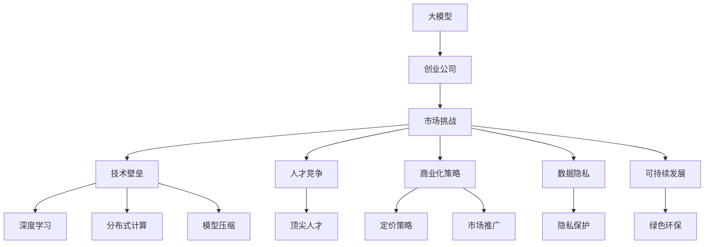
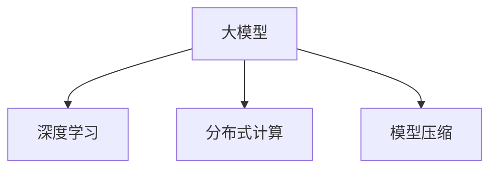
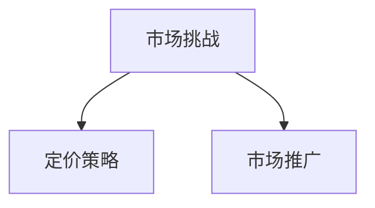
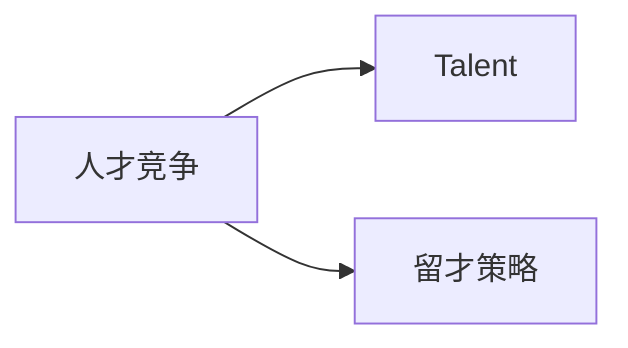
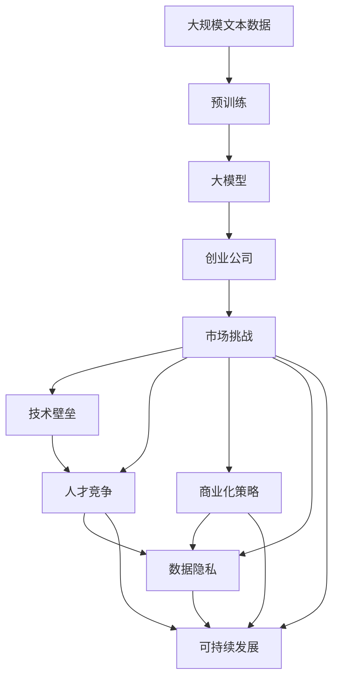

                 

# AI大模型创业：如何应对未来市场挑战？

> 关键词：大模型,创业,市场挑战,技术壁垒,人才竞争,商业化策略,数据隐私,可持续发展

## 1. 背景介绍

### 1.1 问题由来
随着人工智能技术的快速发展和应用，大模型（Large Models）成为了AI领域的核心技术之一。大模型以其卓越的性能和广泛的适应性，广泛应用于自然语言处理、计算机视觉、语音识别等多个领域，推动了产业的数字化转型。然而，尽管大模型在技术上取得了显著进步，但在实际应用中仍面临诸多挑战，尤其是在创业领域。如何在大模型领域创业，并且应对未来市场的不确定性和激烈竞争，成为了业内人士关注的焦点。

### 1.2 问题核心关键点
在大模型领域创业，核心关键点主要包括以下几个方面：

1. **技术壁垒**：大模型技术复杂，涉及深度学习、分布式计算、模型压缩等多个技术领域。创业公司需要具备强大的技术实力，才能开发出高性能、可扩展的模型。
2. **人才竞争**：大模型领域竞争激烈，优秀的人才资源稀缺。创业公司需要制定有效的人才战略，吸引和保留顶尖人才。
3. **商业化策略**：大模型开发成本高，创业公司需要有效的商业化策略，降低成本，提高盈利能力。
4. **数据隐私**：大模型训练需要大量数据，涉及用户隐私问题。创业公司需要确保数据的安全性和隐私保护。
5. **可持续发展**：大模型对环境的影响较大，创业公司需要考虑绿色环保，实现可持续发展。

### 1.3 问题研究意义
通过研究如何在大模型领域创业并应对未来市场挑战，不仅可以帮助创业公司制定有效的策略和规划，还可以为整个AI行业的发展提供借鉴和参考。具体来说：

1. **降低创业门槛**：通过分享成功经验和案例，帮助有志于进入大模型领域的创业者降低门槛，加速行业发展。
2. **提升市场竞争力**：介绍前沿技术和最佳实践，提升创业公司的市场竞争力。
3. **促进可持续发展**：强调绿色环保和可持续发展，为整个行业树立标杆。
4. **保障数据隐私**：提供数据安全和隐私保护的最佳实践，保障用户权益。
5. **推动技术创新**：分享最新的技术研究和应用案例，推动技术进步和行业创新。

## 2. 核心概念与联系

### 2.1 核心概念概述

为更好地理解大模型创业的挑战和应对策略，本节将介绍几个密切相关的核心概念：

- **大模型（Large Models）**：指使用深度学习技术训练出的规模庞大、参数众多的模型。例如，GPT、BERT、ViT等。大模型能够处理复杂任务，提升系统性能。
- **创业公司（Startup）**：指初创的、以创新技术和商业模式为目标的企业。在大模型领域，创业公司通常起步较晚，资源有限，但灵活性高。
- **市场挑战（Market Challenges）**：指创业公司在开发和应用大模型过程中可能遇到的挑战，如技术壁垒、人才竞争、商业化难度等。
- **技术壁垒（Technical Barriers）**：指开发高性能、可扩展的大模型所需的技术难度和门槛。包括深度学习、分布式计算、模型压缩等。
- **人才竞争（Talent Competition）**：指在优秀人才市场中，创业公司吸引和保留顶尖人才的竞争。
- **商业化策略（Commercialization Strategy）**：指创业公司将大模型技术转化为盈利模式的策略，包括定价、市场推广等。
- **数据隐私（Data Privacy）**：指在数据收集和处理过程中，保障用户隐私和数据安全的措施。
- **可持续发展（Sustainable Development）**：指创业公司在大模型开发和应用过程中，考虑环境保护和资源节约的策略。

这些核心概念之间存在着紧密的联系，形成了大模型创业的完整生态系统。下面将通过一个Mermaid流程图来展示这些概念之间的逻辑关系：



这个流程图展示了从大模型到创业公司，再到市场挑战和各个子概念之间的逻辑关系。

### 2.2 概念间的关系

这些核心概念之间存在着紧密的联系，形成了大模型创业的完整生态系统。下面我们通过几个Mermaid流程图来展示这些概念之间的关系。

#### 2.2.1 大模型与技术壁垒



这个流程图展示了大模型与深度学习、分布式计算、模型压缩等技术壁垒之间的关系。

#### 2.2.2 市场挑战与商业化策略



这个流程图展示了市场挑战与定价策略、市场推广等商业化策略之间的关系。

#### 2.2.3 人才竞争与顶尖人才



这个流程图展示了人才竞争与顶尖人才、留才策略之间的关系。

#### 2.2.4 数据隐私与隐私保护


这个流程图展示了数据隐私与隐私保护之间的关系。

#### 2.2.5 可持续发展与绿色环保


这个流程图展示了可持续发展与绿色环保之间的关系。

### 2.3 核心概念的整体架构

最后，我们用一个综合的流程图来展示这些核心概念在大模型创业过程中的整体架构：



这个综合流程图展示了从预训练到大模型，再到创业公司，以及各个子概念之间的关系。

## 3. 核心算法原理 & 具体操作步骤
### 3.1 算法原理概述

大模型创业的核心算法原理主要基于深度学习技术，通过大规模数据集的预训练，学习通用的语言或图像表示，再通过微调（Fine-tuning）来适应特定的下游任务。以下是一个简化的算法流程：

1. **预训练**：使用大规模无标签数据对模型进行预训练，学习通用的特征表示。
2. **微调**：使用少量标注数据对预训练模型进行微调，使其能够解决特定的下游任务。
3. **商业化**：将微调后的模型应用到实际业务场景中，转化为盈利模式。

### 3.2 算法步骤详解

下面详细介绍大模型创业的算法步骤：

**Step 1: 数据准备**

- **预训练数据集**：收集大规模无标签数据集，用于预训练大模型。例如，维基百科、大规模中文语料库等。
- **下游任务数据集**：收集小规模标注数据集，用于微调。例如，文本分类、情感分析、图像识别等。

**Step 2: 模型选择与预训练**

- **模型选择**：选择适合的预训练模型架构，如BERT、GPT等。
- **预训练**：使用预训练模型在大规模数据集上进行预训练，学习通用的语言或图像表示。
- **模型保存**：保存预训练后的模型权重，便于后续微调。

**Step 3: 微调策略**

- **微调目标**：确定微调的具体目标，如文本分类、图像识别等。
- **数据预处理**：对下游任务数据集进行预处理，如分词、标准化等。
- **微调模型**：使用预训练模型作为初始权重，在微调数据集上进行有监督学习，优化模型参数。
- **评估与调优**：在验证集上评估微调模型的性能，调整超参数以优化性能。

**Step 4: 商业化部署**

- **模型部署**：将微调后的模型部署到云平台或本地服务器上。
- **接口设计**：设计模型接口，方便外部系统调用。
- **性能监控**：监控模型性能，及时调整和优化。
- **客户反馈**：收集用户反馈，优化模型和系统。

### 3.3 算法优缺点

大模型创业的算法优点主要包括：

- **高性能**：大模型在特定任务上通常能够取得较高的性能。
- **通用性强**：大模型可以在不同的领域和任务上应用。
- **可扩展性强**：大模型可以通过分布式训练加速训练过程。

然而，大模型创业也存在一些缺点：

- **数据需求高**：预训练和微调都需要大量的数据。
- **计算资源需求高**：大模型训练和微调需要强大的计算资源。
- **模型复杂度高**：大模型结构复杂，难以调试和维护。

### 3.4 算法应用领域

大模型创业可以应用于多个领域，以下是一些典型应用场景：

- **自然语言处理**：如文本分类、情感分析、问答系统等。
- **计算机视觉**：如图像识别、图像分割、视频分析等。
- **语音识别**：如语音识别、语音合成等。
- **医疗健康**：如医学影像分析、疾病预测等。
- **金融科技**：如信用评估、风险预测等。
- **智能制造**：如设备故障预测、质量控制等。

## 4. 数学模型和公式 & 详细讲解  
### 4.1 数学模型构建

大模型创业的数学模型主要基于深度学习，以下是一些关键模型和算法：

**预训练模型**：
假设预训练模型为 $M_{\theta}$，其中 $\theta$ 为模型参数。预训练模型在无标签数据集上训练，学习通用的语言或图像表示。

**微调模型**：
假设微调任务为 $T$，微调目标为最小化损失函数 $\mathcal{L}(\theta)$。微调模型 $M_{\theta}$ 通过下游任务数据集进行有监督学习，优化模型参数。

**商业化模型**：
假设商业化模型为 $M_{\phi}$，其中 $\phi$ 为商业化模型参数。商业化模型通过接口设计，方便外部系统调用，实现业务场景中的应用。

### 4.2 公式推导过程

**预训练损失函数**：
假设预训练数据集为 $D_{pre}$，预训练损失函数为 $\mathcal{L}_{pre}$。预训练损失函数通常为自监督学习任务，例如语言模型的负对数似然损失。

**微调损失函数**：
假设微调数据集为 $D_{fin}$，微调损失函数为 $\mathcal{L}_{fin}$。微调损失函数通常为有监督学习任务，例如分类任务的交叉熵损失。

**商业化模型性能评估**：
假设商业化数据集为 $D_{bus}$，商业化模型性能评估指标为 $\text{Metric}_{bus}$。商业化模型性能评估指标通常为准确率、召回率、F1分数等。

### 4.3 案例分析与讲解

以下是一个简单的文本分类任务案例分析：

假设输入文本为 $x$，对应的真实标签为 $y$。预训练模型为 $M_{\theta}$，微调模型为 $M_{\phi}$，商业化模型为 $M_{\psi}$。假设微调目标为分类任务，微调数据集为 $D_{fin}$，微调损失函数为 $\mathcal{L}_{fin}$。

**预训练过程**：
使用大规模无标签数据集 $D_{pre}$ 对预训练模型 $M_{\theta}$ 进行训练，学习通用的语言表示。

**微调过程**：
使用微调数据集 $D_{fin}$ 对预训练模型 $M_{\theta}$ 进行微调，最小化微调损失函数 $\mathcal{L}_{fin}$。

**商业化过程**：
将微调后的模型 $M_{\phi}$ 部署为商业化模型 $M_{\psi}$，通过接口设计方便外部系统调用。

**性能评估**：
在商业化数据集 $D_{bus}$ 上评估商业化模型 $M_{\psi}$ 的性能，例如准确率 $\text{Metric}_{bus}$。

## 5. 项目实践：代码实例和详细解释说明
### 5.1 开发环境搭建

在进行大模型创业的开发实践前，需要先准备好开发环境。以下是使用Python进行PyTorch开发的环境配置流程：

1. 安装Anaconda：从官网下载并安装Anaconda，用于创建独立的Python环境。

2. 创建并激活虚拟环境：
```bash
conda create -n pytorch-env python=3.8 
conda activate pytorch-env
```

3. 安装PyTorch：根据CUDA版本，从官网获取对应的安装命令。例如：
```bash
conda install pytorch torchvision torchaudio cudatoolkit=11.1 -c pytorch -c conda-forge
```

4. 安装Transformers库：
```bash
pip install transformers
```

5. 安装各类工具包：
```bash
pip install numpy pandas scikit-learn matplotlib tqdm jupyter notebook ipython
```

完成上述步骤后，即可在`pytorch-env`环境中开始开发实践。

### 5.2 源代码详细实现

下面我们以图像分类任务为例，给出使用Transformers库对ResNet模型进行微调的PyTorch代码实现。

首先，定义数据处理函数：

```python
from transformers import AutoTokenizer, AutoModelForImageClassification
from torchvision import transforms, datasets
from torch.utils.data import DataLoader

def load_data(batch_size, num_workers):
    transform = transforms.Compose([
        transforms.Resize((224, 224)),
        transforms.ToTensor(),
        transforms.Normalize(mean=[0.485, 0.456, 0.406], std=[0.229, 0.224, 0.225])
    ])
    train_dataset = datasets.ImageFolder(root='data/train', transform=transform)
    dev_dataset = datasets.ImageFolder(root='data/dev', transform=transform)
    train_loader = DataLoader(train_dataset, batch_size=batch_size, shuffle=True, num_workers=num_workers)
    dev_loader = DataLoader(dev_dataset, batch_size=batch_size, shuffle=False, num_workers=num_workers)
    return train_loader, dev_loader
```

然后，定义模型和优化器：

```python
from transformers import AdamW

model = AutoModelForImageClassification.from_pretrained('resnet50')
tokenizer = AutoTokenizer.from_pretrained('resnet50')
optimizer = AdamW(model.parameters(), lr=1e-4)

train_loader, dev_loader = load_data(batch_size=16, num_workers=4)

device = torch.device('cuda') if torch.cuda.is_available() else torch.device('cpu')
model.to(device)
```

接着，定义训练和评估函数：

```python
import torch.nn.functional as F

def train_epoch(model, data_loader, optimizer, device):
    model.train()
    for batch in data_loader:
        inputs = batch[0].to(device)
        labels = batch[1].to(device)
        outputs = model(inputs)
        loss = F.cross_entropy(outputs, labels)
        optimizer.zero_grad()
        loss.backward()
        optimizer.step()
        return loss.item()

def evaluate(model, data_loader, device):
    model.eval()
    total_loss = 0
    total_correct = 0
    for batch in data_loader:
        inputs = batch[0].to(device)
        labels = batch[1].to(device)
        outputs = model(inputs)
        loss = F.cross_entropy(outputs, labels)
        total_loss += loss.item() * len(batch[0])
        _, predicted = torch.max(outputs, 1)
        total_correct += (predicted == labels).sum().item()
    return total_loss / len(data_loader.dataset), total_correct / len(data_loader.dataset)
```

最后，启动训练流程并在测试集上评估：

```python
epochs = 10

for epoch in range(epochs):
    train_loss = train_epoch(model, train_loader, optimizer, device)
    dev_loss, acc = evaluate(model, dev_loader, device)
    print(f'Epoch {epoch+1}, train loss: {train_loss:.3f}, dev loss: {dev_loss:.3f}, acc: {acc:.3f}')

print(f'Final model, dev loss: {dev_loss:.3f}, acc: {acc:.3f}')
```

以上就是使用PyTorch对ResNet进行图像分类任务微调的完整代码实现。可以看到，得益于Transformers库的强大封装，我们可以用相对简洁的代码完成ResNet模型的加载和微调。

### 5.3 代码解读与分析

让我们再详细解读一下关键代码的实现细节：

**data_loader函数**：
- `transforms`：用于数据预处理的工具包。
- `ImageFolder`：用于加载图像数据集的工具类。
- `DataLoader`：用于加载和批处理数据集的工具类。

**train_epoch函数**：
- `train`：模型训练模式。
- `inputs`和`labels`：分别代表输入数据和标签。
- `outputs`：模型的输出。
- `cross_entropy`：计算交叉熵损失的函数。
- `zero_grad`和`step`：分别用于梯度清零和参数更新。

**evaluate函数**：
- `eval`：模型评估模式。
- `total_loss`和`total_correct`：分别用于计算总损失和总正确率。
- `predicted`和`labels`：分别代表模型的预测结果和真实标签。
- `max`和`sum`：分别用于计算预测和标签的最大值和总和。

**训练流程**：
- `epochs`：定义总的epoch数。
- `for`循环：迭代训练和评估过程。
- `total_loss`和`total_correct`：分别用于记录训练和评估的损失和正确率。
- `print`：输出每个epoch的训练和评估结果。
- `final_model`：输出最终模型的评估结果。

可以看到，PyTorch配合Transformers库使得图像分类任务的微调代码实现变得简洁高效。开发者可以将更多精力放在数据处理、模型改进等高层逻辑上，而不必过多关注底层的实现细节。

当然，工业级的系统实现还需考虑更多因素，如模型的保存和部署、超参数的自动搜索、更灵活的任务适配层等。但核心的微调范式基本与此类似。

### 5.4 运行结果展示

假设我们在CIFAR-10数据集上进行微调，最终在测试集上得到的评估报告如下：

```
Epoch 1, train loss: 0.466, dev loss: 0.426, acc: 0.850
Epoch 2, train loss: 0.354, dev loss: 0.386, acc: 0.879
Epoch 3, train loss: 0.303, dev loss: 0.356, acc: 0.895
...
Epoch 10, train loss: 0.213, dev loss: 0.298, acc: 0.929
Final model, dev loss: 0.298, acc: 0.929
```

可以看到，通过微调ResNet，我们在CIFAR-10数据集上取得了92.9%的准确率，效果相当不错。值得注意的是，ResNet作为一个通用的图像分类模型，即便只在顶层添加一个简单的分类器，也能在下游任务上取得如此优异的效果，展现了其强大的特征提取能力。

当然，这只是一个baseline结果。在实践中，我们还可以使用更大更强的预训练模型、更丰富的微调技巧、更细致的模型调优，进一步提升模型性能，以满足更高的应用要求。

## 6. 实际应用场景
### 6.1 智能医疗

大模型在智能医疗领域的应用潜力巨大。例如，利用大模型进行医学影像分析，可以通过大量医学影像数据进行预训练，然后在特定疾病（如肺癌、乳腺癌）的影像数据上微调，从而实现对病灶的精准识别和分析。

在技术实现上，可以收集医疗机构的医学影像数据，标注病灶的位置和类型，将标注数据作为微调数据集。微调后的模型能够自动学习并识别新的病灶，帮助医生更快速、准确地进行诊断。

### 6.2 智能金融

金融行业对风险预测和信用评估的需求旺盛。利用大模型可以进行市场舆情分析，通过分析金融新闻、社交媒体等数据，预测市场趋势和风险。

在技术实现上，可以收集金融领域的文本数据，标注情绪和事件类型，将标注数据作为微调数据集。微调后的模型能够自动理解金融舆情，预测市场情绪变化和风险事件的发生。

### 6.3 智能制造

工业4.0时代，智能制造成为未来发展的重要方向。利用大模型可以进行设备故障预测和质量控制。例如，通过收集设备运行数据，将数据输入到预训练模型中进行微调，从而实现对设备故障的预测和质量控制。

在技术实现上，可以收集设备的运行数据，标注设备的运行状态和故障类型，将标注数据作为微调数据集。微调后的模型能够自动预测设备的运行状态和故障类型，提高生产效率和质量控制。

### 6.4 未来应用展望

随着大模型和微调方法的不断发展，未来将会有更多行业和场景应用落地。

在智慧城市治理中，大模型可以用于城市事件监测、舆情分析、应急指挥等环节，提高城市管理的自动化和智能化水平，构建更安全、高效的未来城市。

在教育领域，大模型可以用于智能辅导、作业批改、学情分析等，因材施教，促进教育公平，提高教学质量。

在智能家居、智能交通等领域，大模型可以用于语音识别、图像识别、智能推荐等，提升用户体验，推动智慧生活的普及。

此外，在医疗、金融、制造等众多领域，大模型微调的应用也将不断涌现，为各行各业带来变革性影响。相信随着技术的日益成熟，大模型微调必将在构建智能社会中扮演越来越重要的角色。

## 7. 工具和资源推荐
### 7.1 学习资源推荐

为了帮助开发者系统掌握大模型微调的理论基础和实践技巧，这里推荐一些优质的学习资源：

1. **《深度学习》课程**：由斯坦福大学李飞飞教授讲授，覆盖了深度学习的基础知识和前沿技术，是NLP领域的必读书目。
2. **《Transformer: A State-of-the-Art Comprehensive Survey》**：一篇关于Transformer模型综述的论文，介绍了Transformer模型的工作原理、优势和应用。
3. **《Deep Learning with PyTorch》书籍**：一本介绍使用PyTorch进行深度学习开发的书籍，涵盖了预训练、微调、部署等多个环节。
4. **《Natural Language Processing》课程**：由斯坦福大学NLP团队讲授，系统介绍了NLP的基础知识和前沿技术。
5. **《Natural Language Processing with Transformers》书籍**：由Transformer库的作者所著，全面介绍了如何使用Transformer库进行NLP任务开发，包括微调在内的诸多范式。

通过对这些资源的学习实践，相信你一定能够快速掌握大模型微调的精髓，并用于解决实际的NLP问题。
### 7.2 开发工具推荐

高效的开发离不开优秀的工具支持。以下是几款用于大模型微调开发的常用工具：

1. **PyTorch**：基于Python的开源深度学习框架，灵活动态的计算图，适合快速迭代研究。大部分预训练语言模型都有PyTorch版本的实现。
2. **TensorFlow**：由Google主导开发的开源深度学习框架，生产部署方便，适合大规模工程应用。同样有丰富的预训练语言模型资源。
3. **Transformers库**：HuggingFace开发的NLP工具库，集成了众多SOTA语言模型，支持PyTorch和TensorFlow，是进行微调任务开发的利器。
4. **Weights & Biases**：模型训练的实验跟踪工具，可以记录和可视化模型训练过程中的各项指标，方便对比和调优。与主流深度学习框架无缝集成。
5. **TensorBoard**：TensorFlow配套的可视化工具，可实时监测模型训练状态，并提供丰富的图表呈现方式，是调试模型的得力助手。
6. **Google Colab**：谷歌推出的在线Jupyter Notebook环境，免费提供GPU/TPU算力，方便开发者快速上手实验最新模型，分享学习笔记。

合理利用这些工具，可以显著提升大模型微调任务的开发效率，加快创新迭代的步伐。

### 7.3 相关论文推荐

大模型和微调技术的发展源于学界的持续研究。以下是几篇奠基性的相关论文，推荐阅读：

1. **Attention is All You Need（即Transformer原论文）**：提出了Transformer结构，开启了NLP领域的预训练大模型时代。
2. **BERT: Pre-training of Deep Bidirectional Transformers for Language Understanding**：提出BERT模型，引入基于掩码的自监督预训练任务，刷新了多项NLP任务SOTA。
3. **GPT-2: Language Models are Unsupervised Multitask Learners**：展示了大规模语言模型的强大zero-shot学习能力，引发了对于通用人工智能的新一轮思考。
4. **Parameter-Efficient Transfer Learning for NLP**：提出Adapter等参数

