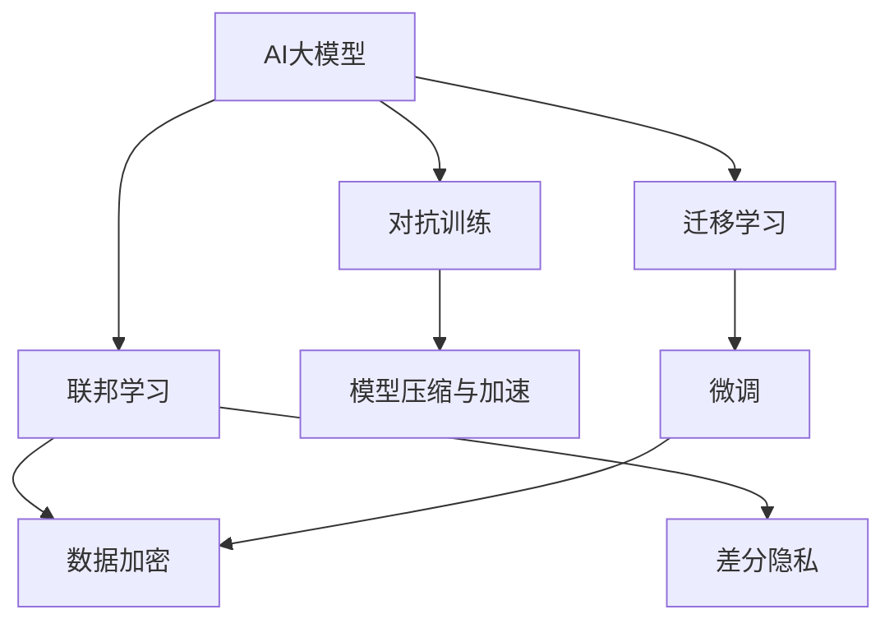
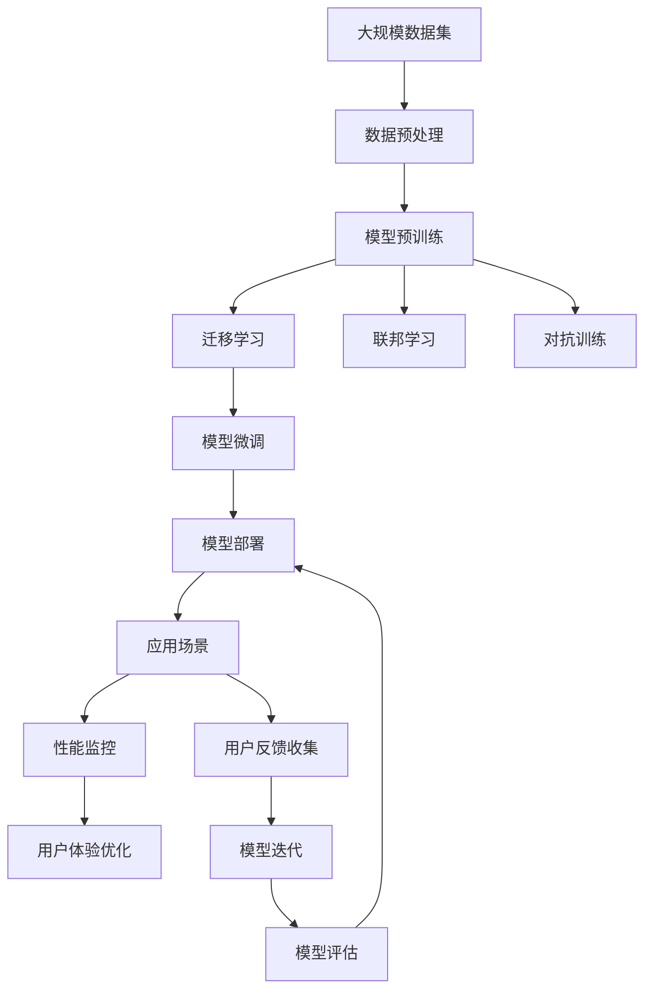

                 

# AI大模型创业：如何应对未来技术挑战？

## 1. 背景介绍

### 1.1 问题由来
近年来，AI大模型在自然语言处理(NLP)、计算机视觉(CV)、语音识别(SR)等众多领域取得了突破性的进展。这些大模型，如GPT-3、BERT、ResNet等，展示了其在复杂任务上的强大能力，同时也带来了新的创业机会。然而，随之而来的问题也越来越多，比如数据隐私、算力需求、模型偏见等。本文将从多个角度讨论如何应对这些挑战，为AI大模型的创业之路提供参考。

### 1.2 问题核心关键点
1. **数据隐私与安全**：大模型依赖大量的数据进行训练，数据隐私和安全性成为关注的焦点。
2. **算力需求与成本**：大模型通常需要高效的计算资源，算力需求与成本问题突出。
3. **模型偏见与公平性**：模型训练数据的不平衡可能导致偏见，影响模型的公平性。
4. **部署与运行效率**：模型的实时性和性能直接影响用户体验。
5. **开源与商业化平衡**：开源社区和商业公司之间的平衡关系需要处理。

### 1.3 问题研究意义
在AI大模型的创业浪潮中，数据隐私、算力成本、模型偏见等问题的解决，对于构建可持续发展的AI创业生态至关重要。本文将探讨如何应对这些技术挑战，为AI创业提供实用的解决方案。

## 2. 核心概念与联系

### 2.1 核心概念概述

为更好地理解这些技术挑战的解决方案，首先需要介绍相关的核心概念：

- **AI大模型**：基于深度学习技术的模型，如BERT、GPT-3等，在特定任务上表现出卓越的性能。
- **迁移学习**：通过将预训练模型在小规模数据上进行微调，提升模型在新任务上的性能。
- **联邦学习**：多边协作学习，保护数据隐私同时共享模型知识。
- **对抗训练**：通过引入对抗样本，提升模型的鲁棒性。
- **差分隐私**：保护数据隐私的一种技术手段，使得单个样本无法被识别。
- **模型压缩与加速**：通过模型裁剪、量化等技术，减少模型大小和计算量。

这些概念之间有着紧密的联系，共同构成了AI大模型创业的核心技术体系。

### 2.2 概念间的关系

通过以下Mermaid流程图展示这些核心概念之间的关系：



这个流程图展示了AI大模型的主要学习范式和技术手段之间的关系。迁移学习、联邦学习、差分隐私、对抗训练和模型压缩与加速，都在不同程度上支撑和改进着AI大模型的性能和应用效果。

### 2.3 核心概念的整体架构

最后，用一个综合的流程图来展示这些核心概念在大模型创业中的整体架构：



这个综合流程图展示了从数据预处理、模型预训练、迁移学习、联邦学习、对抗训练、模型微调到模型部署和性能监控的完整流程，以及用户反馈和模型迭代的持续优化。

## 3. 核心算法原理 & 具体操作步骤
### 3.1 算法原理概述

大模型的创业之路，涉及多个技术环节，主要包括模型训练、迁移学习、模型微调和应用部署等。每个环节都有其算法原理和操作步骤，下面将详细阐述这些核心算法。

### 3.2 算法步骤详解

**3.2.1 模型训练**

- **步骤1**：收集和清洗大规模数据集，确保数据的质量和多样性。
- **步骤2**：选择合适的深度学习框架，如TensorFlow、PyTorch等，搭建模型架构。
- **步骤3**：定义损失函数和优化器，选择合适的超参数，开始训练模型。

**3.2.2 迁移学习**

- **步骤1**：选择一个预训练模型，如BERT、GPT-3等，作为初始化参数。
- **步骤2**：根据任务需求，调整模型的输出层和损失函数。
- **步骤3**：使用小规模的标注数据集进行微调，优化模型在新任务上的表现。

**3.2.3 模型微调**

- **步骤1**：在预训练模型的基础上，选择微调的数据集和任务。
- **步骤2**：使用小学习率进行微调，避免破坏预训练权重。
- **步骤3**：使用正则化技术，如L2正则、Dropout等，防止过拟合。

**3.2.4 模型部署**

- **步骤1**：将微调好的模型转换为可部署的形式，如TensorFlow Serving、Amazon SageMaker等。
- **步骤2**：部署模型到服务器或云端，确保可扩展性和高可用性。
- **步骤3**：使用容器化技术，如Docker、Kubernetes等，管理模型的部署和运行。

### 3.3 算法优缺点

**3.3.1 模型训练**

优点：大模型在特定任务上表现优异，能够快速提升模型性能。
缺点：需要大量计算资源和数据，成本较高。

**3.3.2 迁移学习**

优点：提升模型在新任务上的表现，减少训练时间。
缺点：依赖标注数据，获取高质量标注数据成本高。

**3.3.3 模型微调**

优点：适应性强，能够在特定任务上快速提升模型性能。
缺点：容易过拟合，需要调整超参数。

**3.3.4 模型部署**

优点：模型可以部署到各种环境，支持实时推理。
缺点：需要考虑计算资源和服务器管理。

### 3.4 算法应用领域

AI大模型在多个领域都有广泛的应用，包括：

- **自然语言处理**：机器翻译、文本生成、情感分析等。
- **计算机视觉**：图像分类、目标检测、图像生成等。
- **语音识别**：语音识别、语音合成、语音翻译等。
- **推荐系统**：个性化推荐、广告推荐等。

## 4. 数学模型和公式 & 详细讲解 & 举例说明

### 4.1 数学模型构建

在AI大模型的创业中，数学模型和公式的理解和应用至关重要。这里我们将通过数学模型和公式，详细讲解迁移学习和模型微调的基本原理。

**4.1.1 迁移学习**

假设有两个任务 $T_1$ 和 $T_2$，预训练模型为 $M$，分别定义损失函数 $\ell_{T_1}$ 和 $\ell_{T_2}$。迁移学习的目标是最小化迁移损失函数 $\ell_{T1 \to T2}$：

$$
\ell_{T1 \to T2} = \lambda \ell_{T_1} + (1-\lambda) \ell_{T_2}
$$

其中 $\lambda$ 为迁移权重，控制任务 $T_2$ 的权重。

**4.1.2 模型微调**

假设微调后的模型为 $M'$，定义损失函数 $\ell_{T}$。微调的目标是最小化损失函数 $\mathcal{L}_{\theta'}$：

$$
\mathcal{L}_{\theta'} = \frac{1}{N} \sum_{i=1}^N \ell(M'(x_i), y_i)
$$

其中 $N$ 为样本数量，$x_i$ 和 $y_i$ 分别为输入和标签。

### 4.2 公式推导过程

**4.2.1 迁移学习**

定义迁移损失函数 $\ell_{T1 \to T2}$ 为：

$$
\ell_{T1 \to T2} = \frac{1}{N} \sum_{i=1}^N (\ell_{T_1}(x_i, y_i) + \lambda \ell_{T_2}(x_i, y_i))
$$

其中 $x_i$ 为输入数据，$y_i$ 为标签。

**4.2.2 模型微调**

定义微调后的模型损失函数 $\mathcal{L}_{\theta'}$ 为：

$$
\mathcal{L}_{\theta'} = \frac{1}{N} \sum_{i=1}^N \ell(M'(x_i), y_i)
$$

其中 $M' = M + \Delta \theta$，$\Delta \theta$ 为微调后的参数更新量。

### 4.3 案例分析与讲解

以BERT模型在文本分类任务上的微调为例：

- **数据准备**：收集文本分类数据集，进行预处理和标注。
- **模型选择**：选择BERT模型，并使用其预训练参数作为初始化权重。
- **微调过程**：调整模型的输出层和损失函数，定义适当的超参数，进行模型微调。
- **评估与部署**：在验证集上评估微调效果，部署到生产环境进行实时推理。

## 5. 项目实践：代码实例和详细解释说明

### 5.1 开发环境搭建

在开始代码实践前，需要准备好开发环境。以下是在Python和PyTorch环境下搭建环境的详细步骤：

1. 安装Anaconda：从官网下载并安装Anaconda，创建虚拟环境。
2. 安装PyTorch：使用conda命令安装PyTorch及其相关依赖。
3. 安装TensorFlow：使用conda命令安装TensorFlow及其相关依赖。
4. 安装相关库：安装numpy、pandas、scikit-learn等常用库。
5. 配置环境变量：设置Python解释器和库路径。

### 5.2 源代码详细实现

以下是一个使用PyTorch框架实现BERT模型微调的代码示例：

```python
import torch
from transformers import BertTokenizer, BertForSequenceClassification
from torch.utils.data import DataLoader, Dataset

class TextDataset(Dataset):
    def __init__(self, texts, labels, tokenizer):
        self.texts = texts
        self.labels = labels
        self.tokenizer = tokenizer

    def __len__(self):
        return len(self.texts)

    def __getitem__(self, item):
        text = self.texts[item]
        label = self.labels[item]

        encoding = self.tokenizer(text, max_length=512, padding='max_length', truncation=True)
        input_ids = encoding['input_ids']
        attention_mask = encoding['attention_mask']

        return {'input_ids': input_ids, 'attention_mask': attention_mask, 'labels': label}

# 数据准备
tokenizer = BertTokenizer.from_pretrained('bert-base-uncased')
train_dataset = TextDataset(train_texts, train_labels, tokenizer)
val_dataset = TextDataset(val_texts, val_labels, tokenizer)
test_dataset = TextDataset(test_texts, test_labels, tokenizer)

# 模型选择与配置
model = BertForSequenceClassification.from_pretrained('bert-base-uncased', num_labels=2)
optimizer = torch.optim.Adam(model.parameters(), lr=2e-5)
loss_fn = torch.nn.CrossEntropyLoss()

# 模型微调
device = torch.device('cuda' if torch.cuda.is_available() else 'cpu')
model.to(device)

def train_epoch(model, dataset, batch_size, optimizer, loss_fn):
    model.train()
    total_loss = 0

    for batch in DataLoader(dataset, batch_size=batch_size, shuffle=True):
        inputs = {k: v.to(device) for k, v in batch.items()}
        labels = inputs.pop('labels').to(device)

        outputs = model(**inputs)
        loss = loss_fn(outputs.logits, labels)
        optimizer.zero_grad()
        loss.backward()
        optimizer.step()

        total_loss += loss.item()

    return total_loss / len(dataset)

def evaluate(model, dataset, batch_size, loss_fn):
    model.eval()
    total_loss = 0
    total_correct = 0

    with torch.no_grad():
        for batch in DataLoader(dataset, batch_size=batch_size):
            inputs = {k: v.to(device) for k, v in batch.items()}
            labels = inputs.pop('labels').to(device)

            outputs = model(**inputs)
            loss = loss_fn(outputs.logits, labels)

            total_loss += loss.item()
            total_correct += torch.argmax(outputs.logits, dim=1).eq(labels).sum().item()

    return total_loss / len(dataset), total_correct / len(dataset)

# 训练与评估
epochs = 5
batch_size = 32

for epoch in range(epochs):
    train_loss = train_epoch(model, train_dataset, batch_size, optimizer, loss_fn)
    val_loss, val_acc = evaluate(model, val_dataset, batch_size, loss_fn)
    print(f'Epoch {epoch+1}/{epochs}, train loss: {train_loss:.4f}, val loss: {val_loss:.4f}, val acc: {val_acc:.4f}')

print('Test loss: {test_loss:.4f}, Test acc: {test_acc:.4f}')
```

### 5.3 代码解读与分析

以上代码实现了一个简单的BERT模型在文本分类任务上的微调过程。其中，`TextDataset`类用于处理文本数据，`BertForSequenceClassification`类定义了模型的结构和输出，`train_epoch`函数实现了一个epoch的训练过程，`evaluate`函数用于在验证集和测试集上评估模型性能。

## 6. 实际应用场景

### 6.1 医疗诊断

AI大模型在医疗诊断中具有广泛的应用前景。通过分析患者的电子病历和医学影像，模型可以辅助医生进行疾病诊断和治疗方案的推荐。例如，在放射学领域，模型可以对X光片进行自动分类和分析，帮助医生快速诊断疾病。

### 6.2 金融风险评估

在金融领域，AI大模型可以用于风险评估、欺诈检测和信用评分等方面。模型通过分析客户的财务数据、行为数据等，预测其信用风险和欺诈行为，为金融机构提供决策支持。

### 6.3 智能客服

智能客服系统利用AI大模型进行自然语言理解和对话生成，能够快速响应客户咨询，提供24小时不间断服务。模型可以理解客户的需求，自动匹配最佳答复，提升客户满意度。

### 6.4 未来应用展望

随着AI大模型的不断进步，未来其在更多领域的应用将更加广泛。例如，在智慧城市、智能交通、智能家居等领域，模型可以用于城市管理、交通规划、智能家电控制等，提升城市智能化水平。

## 7. 工具和资源推荐

### 7.1 学习资源推荐

1. **DeepLearning.ai**：斯坦福大学开设的深度学习课程，涵盖从基础到进阶的多个层次，适合不同水平的学习者。
2. **TensorFlow官方文档**：TensorFlow的官方文档，包含丰富的教程、API文档和案例，是学习TensorFlow的最佳资源。
3. **Transformers官方文档**：HuggingFace提供的Transformer库文档，包含大量预训练模型和微调示例。
4. **Kaggle**：Kaggle是一个数据科学竞赛平台，提供大量的数据集和模型，适合实践和竞赛。
5. **arXiv**：人工智能领域的预印本平台，可以获取最新的研究论文和模型。

### 7.2 开发工具推荐

1. **PyTorch**：基于Python的开源深度学习框架，支持动态计算图，适合研究和实验。
2. **TensorFlow**：由Google开发的深度学习框架，生产部署方便，适合大规模工程应用。
3. **Jupyter Notebook**：交互式编程环境，适合快速原型开发和数据探索。
4. **AWS SageMaker**：亚马逊提供的云端AI平台，支持模型的训练、部署和监控。
5. **Google Colab**：谷歌提供的免费云端Jupyter Notebook环境，支持GPU加速，适合高性能计算。

### 7.3 相关论文推荐

1. **Transformers: State-of-the-art Machine Learning for Natural Language Processing**：Transformer的原始论文，展示了其在大规模语言理解任务上的出色表现。
2. **BERT: Pre-training of Deep Bidirectional Transformers for Language Understanding**：BERT的论文，介绍了其在自然语言处理任务上的突破性应用。
3. **A Survey on Transfer Learning in NLP**：综述论文，详细介绍了迁移学习在NLP中的最新进展。
4. **FedAvg: A Decentralized Algorithm for Distributed Deep Learning**：联邦学习的经典论文，介绍了其核心算法和应用场景。

## 8. 总结：未来发展趋势与挑战

### 8.1 研究成果总结

本文探讨了AI大模型创业过程中面临的多个技术挑战，包括数据隐私、算力需求、模型偏见等。针对这些挑战，提出了相应的解决方案，如联邦学习、差分隐私、模型压缩等。通过这些技术手段，可以在保证模型性能的同时，提升系统的安全性和效率。

### 8.2 未来发展趋势

未来AI大模型将面临更多的挑战，但同时也存在巨大的机遇。以下是一些未来的发展趋势：

1. **自动化与可解释性**：AI大模型的自动化和可解释性将成为研究热点，使得模型更加透明和可信。
2. **多模态融合**：将视觉、语音等模态信息与文本信息融合，提升模型的感知能力和应用场景。
3. **分布式训练**：利用分布式计算资源，加速模型训练和推理过程。
4. **边缘计算**：将大模型部署到边缘设备上，提高实时性和响应速度。
5. **联邦学习**：在保护数据隐私的同时，共享模型知识，提升模型效果。

### 8.3 面临的挑战

尽管AI大模型取得了诸多进展，但仍面临诸多挑战：

1. **数据隐私和安全**：数据隐私和安全问题需要重点关注，防止数据泄露和滥用。
2. **计算资源需求**：大模型需要高效的计算资源，计算成本高昂。
3. **模型偏见与公平性**：模型偏见和公平性问题需要引起重视，防止歧视和偏见。
4. **部署与运行效率**：模型的实时性和性能直接影响用户体验。
5. **开源与商业化平衡**：开源社区和商业公司之间的平衡关系需要处理。

### 8.4 研究展望

未来的研究需要针对这些挑战进行深入探索和解决：

1. **差分隐私**：进一步研究差分隐私技术，保护数据隐私的同时，提供更好的模型效果。
2. **模型压缩与加速**：开发高效的模型压缩和加速方法，减少计算资源需求。
3. **自动化与可解释性**：开发可解释性强的模型，提升用户信任度。
4. **联邦学习**：进一步优化联邦学习算法，提升模型效果和隐私保护能力。
5. **边缘计算**：研究边缘计算技术，实现模型的高效部署和推理。

## 9. 附录：常见问题与解答

**Q1: 如何保证数据隐私和安全？**

A: 采用差分隐私技术，对数据进行扰动和去标识化处理，确保单个样本无法被识别。同时，使用加密技术，保护数据在传输和存储过程中的安全。

**Q2: 如何应对大规模模型的计算资源需求？**

A: 利用分布式计算和GPU加速技术，提高模型训练和推理的效率。同时，采用模型压缩和量化技术，减少模型大小和计算量。

**Q3: 如何避免模型偏见和公平性问题？**

A: 通过收集多样化的训练数据，减少数据偏见。同时，采用公平性算法，检测和修正模型偏见。

**Q4: 如何提升模型的实时性和性能？**

A: 采用边缘计算和分布式计算技术，将模型部署到靠近用户端的设备上，实现实时推理。同时，使用高效的模型结构和算法，减少计算量。

**Q5: 如何平衡开源与商业化？**

A: 采用灵活的开源策略，鼓励社区贡献和商业化应用的结合。同时，对商业化应用收取合理的费用，支持社区的持续发展和维护。

总之，AI大模型创业之路充满挑战，但同时也充满机遇。通过技术创新和多方协作，我们可以克服这些挑战，实现AI大模型在各个领域的广泛应用。

