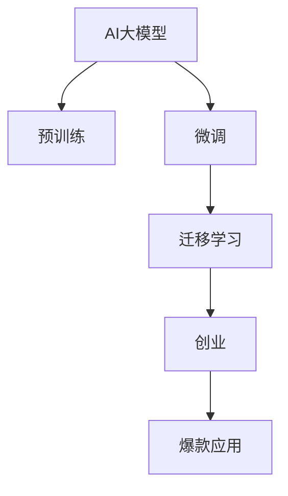
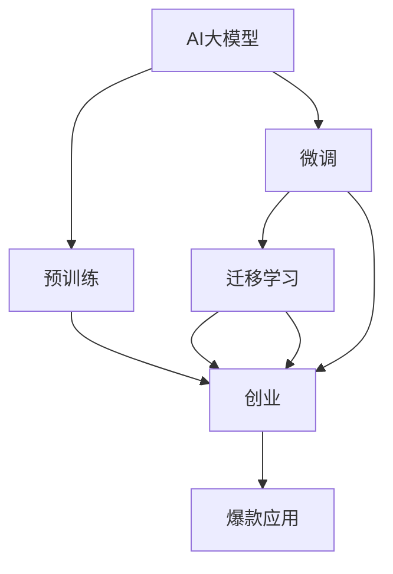

                 

# AI大模型创业：如何打造未来爆款应用？

> 关键词：AI大模型, 创业, 爆款应用, 深度学习, 数据驱动, 技术创新, 产品设计, 市场策略

## 1. 背景介绍

### 1.1 问题由来
近年来，人工智能（AI）技术快速发展，AI大模型成为新一轮技术变革的重要推动力。以GPT、BERT等为代表的预训练语言模型，展示了AI在自然语言处理（NLP）领域惊人的潜力和应用前景。AI大模型具备强大的语言理解和生成能力，能够处理复杂的文本任务，驱动NLP技术在更多垂直行业落地应用。

### 1.2 问题核心关键点
AI大模型的成功应用，不仅仅依赖于技术的先进性，还涉及产品设计、市场策略、团队协作等多方面因素。如何将AI大模型转化为市场爆款应用，成为许多创业者和企业的共同挑战。本文将从技术、产品、市场三个维度，探讨如何打造未来爆款AI大模型应用。

### 1.3 问题研究意义
对于AI大模型创业公司而言，如何快速构建高性价比的产品，占领市场先机，持续创新迭代，实现商业成功，是当前亟待解决的问题。本文旨在为AI大模型创业提供全面的技术指导和策略建议，帮助企业在激烈的市场竞争中脱颖而出，构建长久的商业模式。

## 2. 核心概念与联系

### 2.1 核心概念概述

为了更好地理解AI大模型创业的策略，本节将介绍几个核心概念及其联系：

- AI大模型（AI Large Models）：以深度学习为基础，在大规模数据集上进行预训练的语言模型。常见的有GPT、BERT、T5等。
- 预训练（Pre-training）：通过在大规模无标签数据集上进行自监督学习，学习通用语言表示。
- 微调（Fine-tuning）：在预训练模型的基础上，使用特定任务的数据集进行有监督学习，优化模型在该任务上的表现。
- 迁移学习（Transfer Learning）：将预训练模型的知识迁移到特定任务上，提升模型效果。
- 创业（Entrepreneurship）：通过技术创新、产品设计、市场策略等多方面协同，实现商业价值的创造和最大化。
- 爆款应用（Blockbuster Application）：能够在目标市场中迅速取得广泛用户认可和市场份额的产品。

这些概念之间的联系通过以下Mermaid流程图展示：



这个流程图展示了AI大模型从预训练到爆款应用的完整过程，其中创业过程涉及产品设计、市场策略等多个环节，与技术密切相关。

### 2.2 概念间的关系

这些核心概念之间的联系是相互交织的，形成了AI大模型创业的完整生态系统。我们可以通过以下Mermaid流程图来进一步展示它们之间的关系：



这个综合流程图展示了AI大模型从预训练到爆款应用的完整过程，并强调了技术与创业、市场之间的紧密联系。

## 3. 核心算法原理 & 具体操作步骤

### 3.1 算法原理概述

AI大模型创业的关键在于如何将预训练模型转化为在特定任务上表现优秀的应用。核心算法包括：

- 预训练模型：在大规模无标签数据集上进行自监督学习，学习到通用的语言表示。
- 微调模型：在预训练模型的基础上，使用特定任务的数据集进行有监督学习，优化模型在该任务上的表现。
- 迁移学习：将预训练模型的知识迁移到特定任务上，提升模型效果。
- 创业模型：通过产品设计、市场策略等多方面协同，实现商业价值的创造和最大化。

这些算法在大模型创业中缺一不可，共同构成了AI大模型应用的完整范式。

### 3.2 算法步骤详解

AI大模型创业的算法步骤主要包括：

1. **预训练模型选择**：根据目标任务选择适合的预训练模型。
2. **微调模型构建**：设计适合特定任务的微调架构。
3. **迁移学习实施**：将预训练模型迁移到特定任务上。
4. **创业模型优化**：优化产品设计、市场策略，提升用户体验和市场竞争力。
5. **爆款应用实现**：在特定市场中快速获取用户认可和市场份额。

### 3.3 算法优缺点

AI大模型创业具有以下优点：

- **高效**：使用预训练模型，在少量标注数据下也能快速取得优异效果。
- **泛化能力强**：预训练模型在大规模数据上学习到通用知识，在特定任务上表现出色。
- **成本低**：相比从头开发模型，预训练模型和微调成本较低。

同时，也存在以下缺点：

- **依赖数据**：模型的性能高度依赖于数据的质量和数量。
- **模型复杂**：预训练和微调过程复杂，需要较强的技术积累。
- **可解释性差**：模型通常是“黑盒”，难以解释其内部工作机制。

### 3.4 算法应用领域

AI大模型创业在多个领域都有广泛应用，包括：

- 自然语言处理（NLP）：文本分类、情感分析、机器翻译等。
- 语音识别：语音转换、语音命令识别等。
- 计算机视觉：图像识别、图像生成等。
- 推荐系统：个性化推荐、广告定向等。
- 医疗健康：智能诊断、医疗信息检索等。
- 金融服务：风险评估、客户服务等。

## 4. 数学模型和公式 & 详细讲解 & 举例说明

### 4.1 数学模型构建

AI大模型创业中的数学模型主要涉及预训练和微调两部分。

- 预训练模型：常见的方法包括自编码器（Autoencoder）、掩码语言模型（Masked Language Modeling, MLM）、语言建模（Language Modeling）等。
- 微调模型：常见的方法包括有监督学习（Supervised Learning）、迁移学习（Transfer Learning）、微调（Fine-tuning）等。

### 4.2 公式推导过程

以下我们以BERT微调为例，展示其数学模型的推导过程。

- **预训练模型**：
  - 自编码器：$M(x)=x$，其中$x$为输入，$M$为编码器。
  - 掩码语言模型：$M(x)=[MLM(x)]^N$，其中$MLM(x)$表示在$x$中随机掩码部分单词，并预测其位置。

- **微调模型**：
  - 有监督学习：$L_{task}(x,y)=\sum_{i=1}^N loss_{task}(x_i,y_i)$，其中$loss_{task}$为任务损失函数，$x$为输入，$y$为标签。
  - 迁移学习：$L_{total}=\alpha L_{pre}+\beta L_{task}$，其中$\alpha$为预训练权重，$\beta$为微调权重。

### 4.3 案例分析与讲解

以一个简单的文本分类任务为例，展示BERT微调的数学模型推导过程。

- **输入数据**：$x=\{x_1, x_2, ..., x_N\}$，其中$x_i$表示第$i$个文本。
- **标签数据**：$y=\{y_1, y_2, ..., y_N\}$，其中$y_i$表示$x_i$的标签。
- **任务损失函数**：$L_{task}=\sum_{i=1}^N loss_{class}(x_i, y_i)$，其中$loss_{class}$为交叉熵损失函数。
- **微调权重**：$\beta=0.9$，表示微调权重占总权重的90%。
- **预训练权重**：$\alpha=0.1$，表示预训练权重占总权重的10%。

## 5. 项目实践：代码实例和详细解释说明

### 5.1 开发环境搭建

AI大模型创业的开发环境主要涉及深度学习框架、模型库、数据集等。

- **深度学习框架**：选择PyTorch、TensorFlow等主流框架。
- **模型库**：选择Hugging Face、TensorFlow Hub等。
- **数据集**：选择IMDB、CoNLL-2003等标准数据集，或自定义数据集。

### 5.2 源代码详细实现

以下是一个简单的文本分类任务代码实现，展示BERT微调的流程。

```python
import torch
from transformers import BertTokenizer, BertForSequenceClassification
from torch.utils.data import DataLoader, Dataset
from sklearn.metrics import accuracy_score

# 数据集准备
class MyDataset(Dataset):
    def __init__(self, texts, labels):
        self.texts = texts
        self.labels = labels
        self.tokenizer = BertTokenizer.from_pretrained('bert-base-uncased')
    
    def __len__(self):
        return len(self.texts)
    
    def __getitem__(self, idx):
        text = self.texts[idx]
        label = self.labels[idx]
        
        encoding = self.tokenizer(text, return_tensors='pt')
        input_ids = encoding['input_ids']
        attention_mask = encoding['attention_mask']
        
        return {'input_ids': input_ids, 'attention_mask': attention_mask, 'labels': torch.tensor(label, dtype=torch.long)}

# 模型加载和微调
model = BertForSequenceClassification.from_pretrained('bert-base-uncased', num_labels=2)
optimizer = torch.optim.Adam(model.parameters(), lr=2e-5)
tokenizer = BertTokenizer.from_pretrained('bert-base-uncased')

# 数据加载器
train_dataset = MyDataset(train_texts, train_labels)
val_dataset = MyDataset(val_texts, val_labels)
test_dataset = MyDataset(test_texts, test_labels)

# 训练和验证
device = torch.device('cuda' if torch.cuda.is_available() else 'cpu')
model.to(device)

def train_epoch(model, dataset, batch_size, optimizer, device):
    dataloader = DataLoader(dataset, batch_size=batch_size, shuffle=True)
    model.train()
    for batch in dataloader:
        input_ids = batch['input_ids'].to(device)
        attention_mask = batch['attention_mask'].to(device)
        labels = batch['labels'].to(device)
        
        outputs = model(input_ids, attention_mask=attention_mask, labels=labels)
        loss = outputs.loss
        optimizer.zero_grad()
        loss.backward()
        optimizer.step()

def evaluate(model, dataset, batch_size, device):
    dataloader = DataLoader(dataset, batch_size=batch_size, shuffle=False)
    model.eval()
    preds, labels = [], []
    
    with torch.no_grad():
        for batch in dataloader:
            input_ids = batch['input_ids'].to(device)
            attention_mask = batch['attention_mask'].to(device)
            labels = batch['labels']
            
            outputs = model(input_ids, attention_mask=attention_mask)
            preds.append(outputs.logits.argmax(dim=1))
            labels.append(labels)
    
    preds = torch.cat(preds)
    labels = torch.cat(labels)
    return accuracy_score(labels, preds)

# 训练和验证
epochs = 3
batch_size = 32

for epoch in range(epochs):
    train_epoch(model, train_dataset, batch_size, optimizer, device)
    acc = evaluate(model, val_dataset, batch_size, device)
    print(f'Epoch {epoch+1}, accuracy: {acc:.4f}')
    
print(f'Test accuracy: {evaluate(model, test_dataset, batch_size, device):.4f}')
```

### 5.3 代码解读与分析

此代码实现了一个简单的文本分类任务，展示了BERT微调的流程。其中：

- 数据集准备：使用BertTokenizer将文本转换为BERT模型所需的格式。
- 模型加载：从预训练模型中加载BERT模型。
- 训练和验证：在训练集上进行模型训练，并在验证集上进行性能评估。
- 测试：在测试集上评估模型性能。

## 6. 实际应用场景

### 6.1 智能客服系统

智能客服系统是AI大模型创业的重要应用场景之一。通过微调BERT等模型，智能客服系统能够自动处理大量客户咨询，提供自然流畅的回答，提高客户满意度和效率。

- **技术实现**：收集历史客服对话记录，将问题和最佳答复构建成监督数据，在预训练模型基础上进行微调。
- **市场策略**：通过免费试用、订阅服务等方式，快速获取客户，同时结合客户反馈进行持续优化。

### 6.2 金融舆情监测

金融舆情监测是AI大模型创业的另一个重要应用场景。通过微调BERT等模型，可以实时监测市场舆论动向，及时应对负面信息传播，规避金融风险。

- **技术实现**：收集金融领域相关新闻、报道、评论等文本数据，进行主题标注和情感标注。
- **市场策略**：与金融机构合作，提供实时舆情监测服务，增强风险管理能力。

### 6.3 个性化推荐系统

个性化推荐系统是AI大模型创业的重要应用场景之一。通过微调BERT等模型，可以提升推荐系统的精准性和多样性，满足用户个性化需求。

- **技术实现**：收集用户浏览、点击、评论、分享等行为数据，提取和用户交互的物品标题、描述、标签等文本内容。
- **市场策略**：结合电商平台，提供个性化商品推荐服务，提升用户体验和平台粘性。

### 6.4 未来应用展望

随着AI大模型和微调技术的不断发展，未来的应用场景将更加多样，影响范围将更加广泛。

- **智慧医疗**：通过微调BERT等模型，实现智能诊断、医疗信息检索等功能，提升医疗服务智能化水平。
- **智能教育**：通过微调BERT等模型，实现作业批改、学情分析、知识推荐等功能，提升教育公平和教学质量。
- **智慧城市**：通过微调BERT等模型，实现城市事件监测、舆情分析、应急指挥等功能，提升城市管理智能化水平。

## 7. 工具和资源推荐

### 7.1 学习资源推荐

为帮助开发者系统掌握AI大模型创业的理论与实践，推荐以下学习资源：

- **《深度学习》课程**：斯坦福大学开设的深度学习课程，涵盖深度学习的基本概念和经典模型。
- **《Transformer》书籍**：Transformer模型的作者所著，详细介绍了Transformer原理和微调技术。
- **Transformers库文档**：Hugging Face官方文档，提供了海量预训练模型和微调样例。
- **CoNLL-2003数据集**：中文语言理解测评基准，涵盖大量不同类型的中文NLP数据集，可用于模型微调。

### 7.2 开发工具推荐

高效的开发工具对AI大模型创业至关重要。以下是几款常用工具：

- **PyTorch**：基于Python的深度学习框架，支持动态图，适合快速迭代研究。
- **TensorFlow**：由Google主导的深度学习框架，生产部署方便，适合大规模工程应用。
- **Weights & Biases**：模型训练实验跟踪工具，可记录和可视化模型训练过程中的各项指标。
- **TensorBoard**：TensorFlow配套的可视化工具，可实时监测模型训练状态。
- **Jupyter Notebook**：交互式开发环境，适合编写和调试代码。

### 7.3 相关论文推荐

以下是几篇AI大模型创业的奠基性论文，推荐阅读：

- **《Attention is All You Need》**：Transformer原论文，提出Transformer结构，开启NLP领域的预训练大模型时代。
- **《BERT: Pre-training of Deep Bidirectional Transformers for Language Understanding》**：BERT模型，引入掩码语言模型，刷新多项NLP任务SOTA。
- **《Adaptive Low-Rank Adaptation for Parameter-Efficient Fine-Tuning》**：参数高效微调方法，通过LoRA技术，只调整少量参数，减小微调风险。
- **《AdaLoRA: Adaptive Low-Rank Adaptation for Parameter-Efficient Fine-Tuning》**：进一步优化LoRA技术，提升微调模型的参数效率。

## 8. 总结：未来发展趋势与挑战

### 8.1 总结

本文详细介绍了AI大模型创业的过程，从技术、产品、市场三个维度探讨了如何打造未来爆款应用。通过预训练模型选择、微调模型构建、迁移学习实施等关键步骤，实现了AI大模型在特定任务上的高效应用。

### 8.2 未来发展趋势

AI大模型创业的未来发展趋势包括以下几个方面：

- **技术进步**：预训练模型和微调技术的不断进步，将推动AI大模型在更多垂直行业落地应用。
- **多模态融合**：AI大模型将融合视觉、语音、文本等多种模态数据，提升模型的理解能力和应用范围。
- **模型高效化**：通过参数高效微调等技术，提升AI大模型的推理效率和资源利用率。
- **知识库融合**：AI大模型将与知识图谱、逻辑规则等专家知识融合，提升模型的普适性和鲁棒性。
- **伦理与安全**：AI大模型将结合伦理和安全性约束，确保模型的公平性、透明性和安全性。

### 8.3 面临的挑战

尽管AI大模型创业前景广阔，但也面临着诸多挑战：

- **数据依赖**：模型的性能高度依赖于数据的质量和数量，获取高质量标注数据成本较高。
- **技术门槛**：预训练和微调过程复杂，需要较强的技术积累。
- **模型解释性**：模型通常是“黑盒”，难以解释其内部工作机制。
- **市场竞争**：AI大模型市场竞争激烈，需要快速迭代和持续优化。
- **伦理与安全**：AI大模型可能学习到有偏见、有害的信息，引发伦理和安全问题。

### 8.4 研究展望

未来，AI大模型创业需要在以下几个方面进行深入研究：

- **无监督和半监督学习**：探索无监督和半监督学习方法，降低对标注数据的依赖。
- **跨领域迁移学习**：研究跨领域迁移学习方法，提高模型的泛化能力和应用范围。
- **参数高效微调**：开发更多参数高效的微调方法，提升模型的推理效率和资源利用率。
- **知识库融合**：将符号化的先验知识与神经网络模型融合，提升模型的普适性和鲁棒性。
- **伦理与安全**：在模型训练目标中引入伦理导向的评估指标，确保模型的公平性和安全性。

## 9. 附录：常见问题与解答

**Q1：AI大模型微调时如何选择适当的预训练模型？**

A: 根据目标任务选择适当的预训练模型。常见的预训练模型包括BERT、GPT、T5等，需要根据任务特性和数据规模进行选择。

**Q2：AI大模型微调时如何设置合适的学习率？**

A: 微调的学习率一般比预训练时小1-2个数量级，建议使用AdamW等优化器，并结合学习率调度策略进行调整。

**Q3：AI大模型微调时如何避免过拟合？**

A: 可以通过数据增强、正则化、早停等方法来避免过拟合，同时在模型设计上采用参数高效微调等技术，减小过拟合风险。

**Q4：AI大模型创业时如何选择合适的市场策略？**

A: 需要根据产品特性和目标市场，选择合适的市场策略。可以通过免费试用、订阅服务、合作伙伴等方式快速获取用户，同时结合客户反馈进行持续优化。

**Q5：AI大模型创业时如何应对激烈的市场竞争？**

A: 需要通过持续创新、快速迭代、提升用户体验等方式，快速响应市场变化，保持竞争优势。

---

作者：禅与计算机程序设计艺术 / Zen and the Art of Computer Programming

