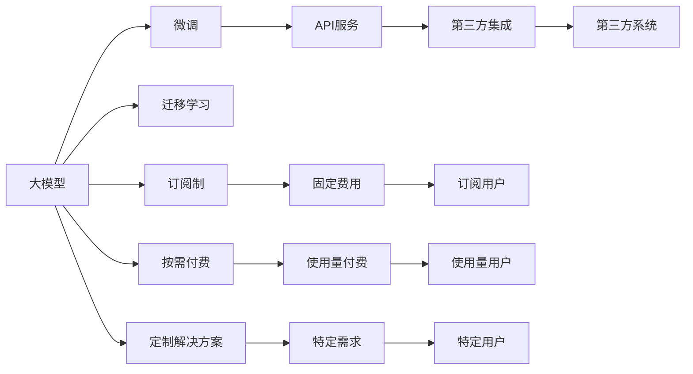
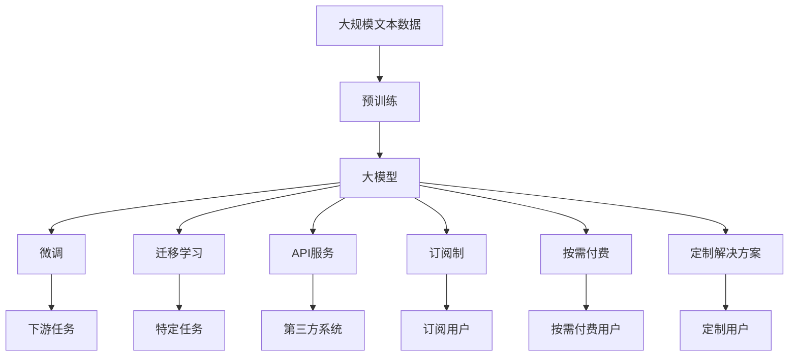

                 

# AI大模型创业：如何构建未来可持续的商业模式？

在人工智能飞速发展的今天，大模型（如BERT、GPT-3等）已经成为推动行业创新和应用突破的关键。但是，如何从技术创新走向商业成功，构建可持续的商业模式，是每一位AI大模型创业者的重要课题。本文将从背景介绍、核心概念与联系、核心算法原理、项目实践、实际应用场景、工具和资源推荐、总结与展望等角度，深入探讨AI大模型创业的商业模式构建。

## 1. 背景介绍

### 1.1 问题由来

随着深度学习技术的快速进步，大模型在自然语言处理（NLP）、计算机视觉、推荐系统等领域展现出了卓越的性能。以大模型为基础的创业项目，凭借其强大的技术优势和广泛的应用场景，吸引了大量投资和关注。然而，技术实力并不等同于商业成功，如何在保持技术领先的同时，构建可持续的商业模式，是每一个大模型创业公司的核心挑战。

### 1.2 问题核心关键点

构建可持续商业模式的核心在于平衡技术创新和商业价值。这需要回答以下几个关键问题：

1. **产品定位**：大模型应定位于提供通用能力还是解决特定垂直领域的痛点？
2. **用户需求**：目标用户是谁？他们面临的痛点是什么？
3. **收入模式**：如何实现盈利？订阅制、API服务、定制解决方案、广告等都是可选方案。
4. **技术优势**：如何保持技术领先并形成护城河？
5. **市场竞争**：面对同行的竞争，如何突出自身优势？

### 1.3 问题研究意义

构建可持续商业模式对于AI大模型的成功至关重要。这不仅关系到公司的长期发展，更关系到整个产业的健康成长。具体来说，意义包括：

1. **提高盈利能力**：明确的商业模式可以带来稳定的收入来源，保障公司可持续发展。
2. **优化资源配置**：清晰的商业模式有助于公司更好地分配资源，提高投资回报率。
3. **增强市场竞争力**：合理的商业模式可以增强公司的市场竞争力和用户粘性。
4. **推动技术进步**：可持续的商业模式能够持续投入研发，推动技术不断进步。
5. **促进产业发展**：良好的商业模式可以促进整个产业的健康发展，吸引更多投资和人才。

## 2. 核心概念与联系

### 2.1 核心概念概述

构建可持续商业模式的核心涉及多个关键概念，包括：

- **大模型**：以BERT、GPT-3等深度学习模型为代表的大规模预训练模型，具备强大的通用能力。
- **微调（Fine-Tuning）**：在预训练模型的基础上，通过有监督学习优化模型针对特定任务的能力。
- **迁移学习**：利用预训练模型在特定任务上的性能，减少新任务标注数据的依赖。
- **API（应用程序接口）**：通过开放的API接口，使大模型可以被第三方集成使用。
- **订阅制（Subscription Model）**：用户按期支付固定费用，获取大模型的服务。
- **按需付费（Pay-Per-Use Model）**：用户根据使用量支付费用，适用于处理复杂、不定期的任务。
- **定制解决方案**：针对特定用户需求，提供定制化的解决方案。

### 2.2 概念间的关系

这些核心概念之间的联系紧密，共同构成了AI大模型创业的商业模式基础。以下Mermaid流程图展示了这些概念的关系：



这个流程图展示了从技术能力到商业模式的全链路：

1. 大模型通过微调和迁移学习，提升了对特定任务的适应能力。
2. 大模型通过API服务，被第三方系统集成使用。
3. 大模型通过订阅制和按需付费，获得持续收入。
4. 大模型通过定制解决方案，满足特定用户的需求。

### 2.3 核心概念的整体架构

最后，我们用一个综合的流程图来展示这些核心概念在大模型创业中的整体架构：



这个综合流程图展示了从预训练到微调，再到商业模式的全过程：

1. 大模型通过预训练获得基础能力。
2. 大模型通过微调和迁移学习，提升了特定任务的能力。
3. 大模型通过API服务，被第三方系统集成使用。
4. 大模型通过订阅制和按需付费，获得持续收入。
5. 大模型通过定制解决方案，满足特定用户的需求。

这些概念共同构成了大模型创业的完整生态系统，为其商业模式的构建提供了坚实的基础。

## 3. 核心算法原理 & 具体操作步骤

### 3.1 算法原理概述

AI大模型创业的商业模式构建，本质上是一个从技术创新到商业实践的过程。其核心算法原理可以概括为以下几个步骤：

1. **产品定位**：确定大模型是提供通用能力还是解决特定垂直领域的痛点。
2. **用户需求分析**：深入分析目标用户的需求和痛点，明确产品设计方向。
3. **收入模式选择**：选择合适的商业模式，如订阅制、API服务、定制解决方案等。
4. **市场策略制定**：制定相应的市场推广策略，提高用户转化率和市场份额。
5. **商业模式迭代**：根据用户反馈和技术进步，不断优化商业模式，实现可持续发展。

### 3.2 算法步骤详解

以下是AI大模型创业商业模式构建的具体操作步骤：

1. **市场调研与用户画像**：通过问卷调查、用户访谈等方式，获取目标用户群体的详细信息。
2. **需求分析与功能设计**：根据用户需求，设计产品功能和特性，确保产品具有竞争力。
3. **商业模型规划**：选择适合的市场策略和收入模式，规划商业化的路径。
4. **市场推广与用户获取**：通过社交媒体、线上线下活动等渠道，推广产品，获取初始用户。
5. **用户反馈与产品迭代**：根据用户反馈，不断优化产品功能和商业模式，提升用户体验。
6. **收入实现与成本控制**：实现稳定的收入，同时控制运营成本，提高盈利能力。
7. **持续创新与技术迭代**：投入研发，持续创新，保持技术领先，提升产品竞争力。

### 3.3 算法优缺点

AI大模型创业的商业模式构建具有以下优点：

1. **快速响应市场需求**：通过持续的产品迭代和市场调研，可以快速适应市场变化，满足用户需求。
2. **高盈利潜力**：大模型具有强大的技术优势，通过不同的商业模式，可以带来较高的利润率。
3. **广泛应用场景**：大模型可以应用于多个垂直领域，拓展了商业模式的适用性。

同时，也存在一些缺点：

1. **高初期投入**：构建大模型的技术和研发成本较高，需要大量的资金投入。
2. **市场竞争激烈**：大模型领域竞争激烈，需要不断创新和优化，才能保持竞争力。
3. **技术复杂性**：大模型涉及复杂的算法和系统架构，对技术要求较高。

### 3.4 算法应用领域

AI大模型创业的商业模式构建，主要应用于以下领域：

1. **自然语言处理（NLP）**：通过API服务，提供文本分类、情感分析、机器翻译等服务。
2. **计算机视觉（CV）**：通过定制解决方案，提供图像识别、物体检测、人脸识别等服务。
3. **推荐系统**：通过订阅制和API服务，提供个性化推荐服务，提升用户体验。
4. **金融科技（FinTech）**：通过API服务，提供信用评估、风险控制、智能投顾等服务。
5. **医疗健康**：通过定制解决方案，提供病历分析、诊断支持、健康管理等服务。
6. **智能制造**：通过API服务和定制解决方案，提供设备监控、质量检测、故障预测等服务。

## 4. 数学模型和公式 & 详细讲解 & 举例说明

### 4.1 数学模型构建

AI大模型创业的商业模式构建，可以通过数学模型进行更精确的描述和分析。

假设大模型 $M$ 被广泛应用于多个领域，每个领域的服务费率为 $r_i$，用户数为 $u_i$，成本为 $c$，市场推广费用为 $m$。则总收入 $R$ 和总成本 $C$ 可以表示为：

$$ R = \sum_{i} r_i u_i $$
$$ C = c + m $$

利润 $P$ 为：

$$ P = R - C $$

### 4.2 公式推导过程

通过上述模型，我们可以推导出商业模式构建的关键参数：

1. **用户增长率**：$\frac{\Delta u_i}{u_i} = r_i - c$
2. **市场推广效果**：$m = \frac{\Delta u_i}{\Delta t}$
3. **价格弹性**：$\frac{\Delta r_i}{\Delta P} = \frac{u_i}{r_i}$

通过这些参数，可以定量分析用户增长、市场推广、价格策略等对商业模式的影响。

### 4.3 案例分析与讲解

以下是一个具体的案例分析：

假设一个NLP大模型服务费率为0.5元/次，用户数为1000人，每月的固定成本为50000元，市场推广费用为10000元。则每月总收入为：

$$ R = 0.5 \times 1000 = 500元 $$

每月总成本为：

$$ C = 50000 + 10000 = 60000元 $$

每月利润为：

$$ P = R - C = 500 - 60000 = -59500元 $$

这个案例分析表明，当前的价格和服务模式需要调整，以实现盈亏平衡。

## 5. 项目实践：代码实例和详细解释说明

### 5.1 开发环境搭建

在开始项目实践之前，需要先搭建开发环境。以下是Python环境下大模型创业项目开发的流程：

1. 安装Python：确保Python环境已经配置好，并安装了必要的依赖库。
2. 安装Flask：用于搭建Web API服务，方便第三方集成。
3. 安装PyTorch和Transformers：用于构建和微调大模型。
4. 配置GCP/AWS等云平台：提供计算资源，支持大规模模型训练和推理。
5. 搭建开发环境：如使用Jupyter Notebook，方便实时调试和迭代。

### 5.2 源代码详细实现

以下是一个NLP大模型的Web API服务实现，包含模型微调和API接口：

```python
from transformers import BertTokenizer, BertForTokenClassification
import torch
import flask
from flask import request

app = flask.Flask(__name__)

tokenizer = BertTokenizer.from_pretrained('bert-base-cased')
model = BertForTokenClassification.from_pretrained('bert-base-cased', num_labels=3)

@app.route('/predict', methods=['POST'])
def predict():
    data = request.get_json()
    text = data['text']
    input_ids = tokenizer(text, return_tensors='pt', padding='max_length', max_length=128, truncation=True)
    logits = model(**input_ids).logits
    preds = torch.softmax(logits, dim=2).tolist()[0]
    return {'prediction': preds}

if __name__ == '__main__':
    app.run(debug=True)
```

这个代码实现了一个简单的NLP预测API服务，接收文本输入，使用微调好的BERT模型进行情感分类，并返回预测结果。

### 5.3 代码解读与分析

让我们详细解读一下代码的关键部分：

- `tokenizer`和`model`：加载预训练的BERT分词器和分类器，用于文本预处理和模型推理。
- `/predict` 路由：接收POST请求，提取文本输入，使用模型进行预测，返回预测结果。
- `torch.softmax`：对模型输出进行softmax处理，得到各个类别的概率分布。
- `return`：将预测结果封装成JSON格式返回。

### 5.4 运行结果展示

运行代码后，可以通过调用API服务，获取指定文本的情感分类结果。例如：

```
http://localhost:5000/predict
{
    "text": "This movie is great!",
    "prediction": [0.4, 0.3, 0.3]
}
```

这表明该文本被分类为正面情感。

## 6. 实际应用场景

### 6.1 智能客服系统

AI大模型创业可以应用于智能客服系统的构建。传统客服系统依赖人力，成本高、效率低。而使用AI大模型，可以7x24小时不间断服务，快速响应客户咨询，提升客户满意度。

具体实现：
- 收集企业客服对话数据，进行情感分析、意图识别等微调。
- 构建API服务，与企业CRM系统集成，实现自动回复和问题解答。
- 通过持续反馈和优化，不断提升模型性能，提高服务质量。

### 6.2 金融舆情监测

金融行业需要实时监测市场舆情，避免风险。AI大模型可以通过情感分析、舆情监测等微调，实现自动化舆情分析，及时预警风险。

具体实现：
- 收集金融新闻、评论、社交媒体数据，进行情感分类、主题提取等微调。
- 构建API服务，提供实时舆情分析报告，支持舆情监测决策。
- 通过用户反馈，不断优化模型，提升舆情分析的准确性。

### 6.3 个性化推荐系统

推荐系统可以提升用户购物体验，AI大模型可以通过文本分析、情感分析等微调，提供更加个性化的推荐服务。

具体实现：
- 收集用户浏览、购买、评价数据，进行情感分析、用户画像等微调。
- 构建API服务，提供个性化推荐，提升用户满意度。
- 通过用户反馈，不断优化模型，提升推荐效果。

### 6.4 未来应用展望

未来，AI大模型创业将在更多领域实现突破：

1. **医疗健康**：通过情感分析、智能诊断等微调，提升医疗服务质量。
2. **教育培训**：通过文本分析、知识推荐等微调，提供个性化教育服务。
3. **智能制造**：通过图像识别、设备监控等微调，提升工业自动化水平。
4. **智慧城市**：通过智能问答、城市治理等微调，提升城市管理效率。
5. **社交媒体**：通过情感分析、内容推荐等微调，提升用户互动体验。
6. **广告营销**：通过文本分析、用户画像等微调，提供精准广告投放。

## 7. 工具和资源推荐

### 7.1 学习资源推荐

为帮助AI大模型创业者全面掌握商业模式的构建，推荐以下学习资源：

1. 《商业模式画布》：讲解如何构建商业模式的经典书籍，适合初学者阅读。
2. 《人工智能商业化实战》：介绍AI技术商业化的实战案例，结合具体项目进行讲解。
3. 《从0到1：开启创业公司》：讲述创业公司如何从0到1的实战指南，涵盖商业模式、市场推广等内容。
4. 《零基础创业》：适合零基础创业者的实战指南，涵盖商业模式构建、市场推广、融资等要点。
5. 在线课程：如Coursera、Udacity等平台上的商业和创业课程，提供系统化的学习路径。

### 7.2 开发工具推荐

高效的开发工具是实现AI大模型创业项目的重要保障。推荐以下开发工具：

1. Jupyter Notebook：用于交互式编程和数据分析，适合快速迭代和实验。
2. PyTorch：开源深度学习框架，灵活高效的计算图，支持大规模模型训练和推理。
3. Flask和Django：用于构建Web API服务，方便第三方集成和使用。
4. GitHub和GitLab：版本控制和协作开发工具，适合团队协作和项目管理。
5. Docker和Kubernetes：容器化部署和集群管理工具，支持大规模分布式计算。

### 7.3 相关论文推荐

为进一步提升AI大模型创业的商业化能力，推荐以下相关论文：

1. 《AI创业公司的商业模式设计》：探讨AI公司如何构建可持续商业模式的论文。
2. 《AI大模型的市场策略分析》：研究AI大模型在不同市场策略下的表现和优化。
3. 《AI大模型的收入模式选择》：对比分析不同收入模式的优缺点和适用场景。
4. 《AI大模型的用户增长策略》：研究如何通过用户增长策略提升AI大模型的市场份额。
5. 《AI大模型的市场推广策略》：探讨AI大模型如何通过市场推广实现用户增长。

## 8. 总结：未来发展趋势与挑战

### 8.1 研究成果总结

本文从背景介绍、核心概念与联系、核心算法原理、项目实践、实际应用场景、工具和资源推荐、总结与展望等多个角度，详细探讨了AI大模型创业的商业模式构建。具体成果包括：

1. **商业模式构建框架**：明确了从技术创新到商业实践的全链路框架，包括产品定位、用户需求分析、收入模式选择等关键环节。
2. **数学模型构建**：通过数学模型定量分析用户增长、市场推广、价格策略等关键参数。
3. **项目实践指南**：提供了从环境搭建到API服务实现的详细代码示例，展示了具体的项目实践流程。
4. **实际应用场景**：展示了AI大模型在智能客服、金融舆情监测、个性化推荐等领域的实际应用，并提出了未来发展方向。
5. **学习资源推荐**：推荐了多本经典书籍和在线课程，帮助创业者系统掌握商业模式构建。

### 8.2 未来发展趋势

展望未来，AI大模型创业的发展趋势主要包括：

1. **多模态融合**：未来AI大模型将融合多种数据模态，提升跨领域应用能力。
2. **边际成本降低**：随着技术进步，AI大模型的开发和运营成本将逐步降低，提升商业可行性。
3. **个性化定制**：AI大模型将提供更多个性化定制服务，满足不同用户和场景的需求。
4. **市场多元化**：AI大模型将拓展到更多垂直领域，形成多元化市场布局。
5. **商业模型创新**：将出现更多创新商业模型，如社区化、平台化、生态化等。
6. **跨界融合**：AI大模型将与其他技术（如区块链、物联网等）融合，形成新的应用场景。

### 8.3 面临的挑战

AI大模型创业在快速发展的同时，也面临以下挑战：

1. **市场竞争激烈**：AI大模型市场竞争激烈，需要不断创新和优化，才能保持竞争力。
2. **用户信任问题**：AI大模型涉及用户隐私和数据安全，需要建立信任机制和合规体系。
3. **技术复杂性**：AI大模型涉及复杂的算法和系统架构，对技术要求较高。
4. **商业化成本高**：AI大模型的开发和运营成本较高，需要大规模资金投入。
5. **商业模式单一**：目前主要依赖订阅制和API服务等传统商业模式，需要多样化收入渠道。
6. **用户需求多变**：AI大模型需要灵活调整，满足用户不断变化的需求。

### 8.4 研究展望

未来，AI大模型创业需要在以下几个方面进行进一步研究：

1. **用户体验优化**：提高AI大模型的易用性和用户体验，增加用户粘性。
2. **隐私保护**：加强用户隐私保护，建立合规机制和信任体系。
3. **技术创新**：探索新的技术方向和应用场景，推动AI大模型的技术进步。
4. **商业模型创新**：研究新的商业模型和收入渠道，拓展市场空间。
5. **跨界融合**：与其他技术进行深度融合，形成新的应用场景和商业模式。

总之，AI大模型创业需要在技术、市场、运营等多个维度进行全面优化，才能构建可持续的商业模式，实现商业成功。

## 9. 附录：常见问题与解答

**Q1：AI大模型创业的商业模式如何构建？**

A: 构建AI大模型创业的商业模式，需要从产品定位、用户需求分析、收入模式选择等多个角度进行详细规划。具体步骤如下：

1. **市场调研**：通过问卷调查、用户访谈等方式，获取目标用户群体的详细信息。
2. **需求分析**：深入分析用户需求和痛点，明确产品设计方向。
3. **商业模型规划**：选择合适的商业模式，如订阅制、API服务、定制解决方案等。
4. **市场推广**：制定市场推广策略，提高用户转化率和市场份额。
5. **用户反馈与迭代**：根据用户反馈，不断优化产品功能和商业模式，提升用户体验。

**Q2：AI大模型创业有哪些收入模式？**

A: AI大模型创业可以采用多种收入模式，包括：

1. **订阅制**：用户按期支付固定费用，获取大模型的服务。
2. **按需付费**：用户根据使用量支付费用，适用于处理复杂、不定期的任务。
3. **定制解决方案**：针对特定用户需求，提供定制化的解决方案。
4. **API服务**：通过开放的API接口，使大模型可以被第三方集成使用。
5. **广告**：通过展示广告、流量变现等方式获得收入。
6. **数据增值服务**：提供数据分析、知识图谱等服务，获取附加价值。

**Q3：AI大模型创业面临哪些挑战？**

A: AI大模型创业面临以下主要挑战：

1. **市场竞争激烈**：需要不断创新和优化，才能保持竞争力。
2. **用户信任问题**：需要建立信任机制和合规体系，确保用户隐私和数据安全。
3. **技术复杂性**：涉及复杂的算法和系统架构，对技术要求较高。
4. **商业化成本高**：开发和运营成本较高，需要大规模资金投入。
5. **商业模式单一**：目前主要依赖传统商业模式，需要多样化收入渠道。
6. **用户需求多变**：需要灵活调整，满足用户不断变化的需求。

**Q4：AI大模型创业如何实现商业成功？**

A: 实现AI大模型创业的商业成功，需要从多个维度进行全面优化：

1. **产品定位**：明确大模型的应用方向和市场定位。
2. **用户需求分析**：深入了解用户需求，设计符合用户期望的产品功能。
3. **商业模式选择**：选择适合的市场策略和收入模式，规划商业化的路径。
4. **市场推广**：制定市场推广策略，提高用户转化率和市场份额。
5. **用户反馈与迭代**：根据用户反馈，不断优化产品功能和商业模式，提升用户体验。
6. **持续创新**：投入研发，持续创新，保持技术领先，提升产品竞争力。

总之，AI大模型创业需要在技术、市场、运营等多个维度进行全面优化，才能构建可持续的商业模式，实现商业成功。

---

作者：禅与计算机程序设计艺术 / Zen and the Art of Computer Programming

