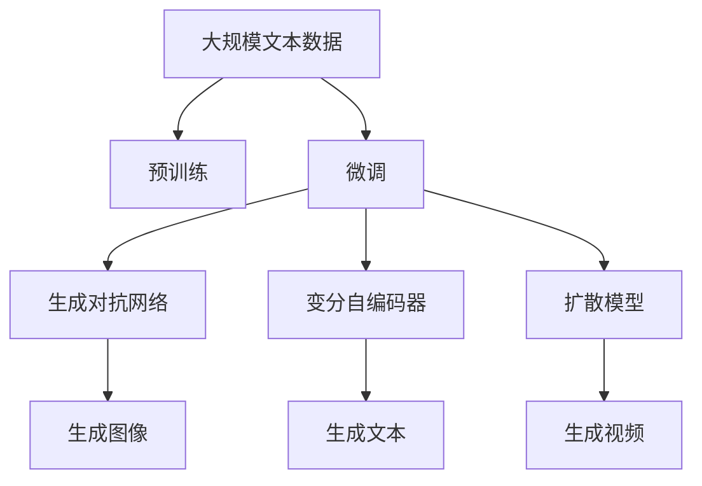

                 

# AI新纪元：生成式AI如何推动产业升级？

## 1. 背景介绍

### 1.1 问题由来
近年来，人工智能（AI）技术迅猛发展，尤其是深度学习在图像识别、语音识别、自然语言处理等领域取得了突破性进展。然而，深度学习的核心——大规模数据和计算资源的依赖，使得其在早期阶段成本高昂，难以大规模应用。生成式AI的出现，极大地降低了这一门槛，使得AI技术开始广泛渗透到各行各业。

生成式AI包括生成对抗网络（GANs）、变分自编码器（VAEs）、扩散模型等，其核心思想是通过训练生成模型，自动学习数据分布并生成新样本，极大地拓展了AI在图像生成、文本生成、音频生成等领域的潜力。这一技术使得AI应用变得更加直观和可解释，从而加速了其在产业界的落地。

### 1.2 问题核心关键点
生成式AI的核心在于生成模型对数据分布的建模能力。通过学习大量无标签数据，生成式AI模型能够自动发现数据的内在结构和模式，并生成符合特定分布的新样本。这一能力在数据生成、图像处理、自然语言生成等领域具有广泛的应用价值。

关键点包括：
- 数据的分布建模能力：生成式AI模型通过学习数据分布，能够生成符合该分布的新样本。
- 生成样本的质量和多样性：生成式AI模型生成的样本需要具有高质量和多样性，以符合实际应用需求。
- 训练数据的质量和数量：生成式AI模型的性能很大程度上取决于训练数据的数量和质量，获取高质量训练数据是关键。
- 模型的可解释性和鲁棒性：生成式AI模型需要具有良好的可解释性和鲁棒性，以适应不同应用场景的需求。

### 1.3 问题研究意义
生成式AI的崛起，为各行各业带来了新的发展机遇。其灵活、直观的特性，使得AI技术在更多应用场景中得以落地，推动了产业升级。具体来说，生成式AI可以应用于：

- 个性化推荐：通过生成模型学习用户行为和兴趣，提供更加个性化的推荐服务。
- 内容创作：生成式AI可以自动生成高质量的文本、图像、视频等内容，降低创作成本，提升创作效率。
- 增强现实（AR）和虚拟现实（VR）：生成式AI可以为AR/VR应用提供高质量的生成内容，增强用户体验。
- 医疗健康：生成式AI可以自动生成医学图像、模拟手术过程等，提升医疗服务的质量和效率。

因此，深入理解生成式AI的原理和应用，对于推动产业升级具有重要意义。

## 2. 核心概念与联系

### 2.1 核心概念概述

生成式AI包括生成对抗网络（GANs）、变分自编码器（VAEs）、扩散模型等。这些模型通过学习数据分布，生成符合特定分布的新样本。其核心思想是通过训练生成模型，自动学习数据的内在结构和模式，并生成新样本。

- 生成对抗网络（GANs）：由一个生成器和一个判别器组成，通过对抗训练的方式，生成器生成逼真的样本，判别器则负责判断样本的真实性。
- 变分自编码器（VAEs）：通过学习数据分布的隐空间，生成与输入数据类似的新样本。
- 扩散模型（Diffusion Models）：通过时间上的逐步噪声注入和反向噪声恢复，生成高质量的图像和视频。

这些模型通过不同的方式建模数据分布，具有各自的优势和局限。GANs在生成高质量图像和视频方面表现优异，但训练过程不稳定；VAEs在生成多样性方面表现较好，但在生成图像细节方面稍逊一筹；扩散模型则在生成高质量图像和视频方面表现优异，但计算资源消耗较大。

### 2.2 概念间的关系

这些核心概念之间存在着紧密的联系，形成了生成式AI的完整生态系统。我们可以通过以下Mermaid流程图来展示这些概念之间的关系：

```mermaid
graph LR
    A[生成对抗网络 (GANs)] --> B[变分自编码器 (VAEs)]
    A --> C[扩散模型 (Diffusion Models)]
    B --> D[生成样本]
    C --> D
```

这个流程图展示了大模型生态系统中各个模型之间的关系：

1. GANs、VAEs、扩散模型分别独立建模数据分布。
2. 生成的样本可以被应用于各种实际场景，如生成图像、视频、文本等。

### 2.3 核心概念的整体架构

最后，我们用一个综合的流程图来展示这些核心概念在大模型微调过程中的整体架构：



这个综合流程图展示了从预训练到生成模型的完整过程。大模型首先在大规模文本数据上进行预训练，然后通过微调过程生成对抗网络、变分自编码器、扩散模型等生成模型，生成图像、文本、视频等多种形式的内容。

## 3. 核心算法原理 & 具体操作步骤
### 3.1 算法原理概述

生成式AI的核心算法原理是通过训练生成模型，自动学习数据分布并生成新样本。具体来说，生成式AI模型通过学习数据的内在结构和模式，能够生成符合特定分布的新样本。

以GANs为例，GANs模型由一个生成器和一个判别器组成。生成器接收随机噪声，生成逼真的样本，判别器则负责判断样本的真实性。通过对抗训练的方式，生成器和判别器相互博弈，最终生成器能够生成高质量的样本，判别器则能够准确判断样本的真实性。

生成式AI模型的训练过程包括数据预处理、模型训练、模型评估等步骤。数据预处理阶段，需要将原始数据转换为模型能够处理的形式。模型训练阶段，通过优化生成器和判别器的损失函数，不断调整模型参数，以生成高质量的样本。模型评估阶段，通过评估生成样本的质量和多样性，确定模型是否收敛。

### 3.2 算法步骤详解

生成式AI模型的训练过程可以分为以下几个步骤：

**Step 1: 数据准备和预处理**

1. 数据收集：收集大量无标签数据，作为训练数据的来源。
2. 数据预处理：将原始数据转换为模型能够处理的形式，如将图像数据归一化、标准化，将文本数据进行分词等。

**Step 2: 模型搭建和训练**

1. 模型搭建：搭建生成对抗网络、变分自编码器、扩散模型等生成模型。
2. 模型训练：通过优化生成器和判别器的损失函数，不断调整模型参数，以生成高质量的样本。
3. 训练过程：生成器和判别器相互博弈，生成器和判别器的损失函数通过反向传播进行优化。

**Step 3: 模型评估和测试**

1. 模型评估：通过评估生成样本的质量和多样性，确定模型是否收敛。
2. 模型测试：在测试数据集上评估生成模型的性能，检查生成样本的质量和多样性。

### 3.3 算法优缺点

生成式AI模型具有以下优点：

1. 生成高质量样本：生成式AI模型能够生成高质量的图像、文本、视频等内容，满足实际应用需求。
2. 降低创作成本：生成式AI模型可以自动生成内容，降低创作成本，提升创作效率。
3. 提升用户体验：生成式AI模型可以为AR/VR应用提供高质量的生成内容，增强用户体验。
4. 增强医疗服务：生成式AI模型可以自动生成医学图像、模拟手术过程等，提升医疗服务的质量和效率。

同时，生成式AI模型也存在以下缺点：

1. 训练过程复杂：生成式AI模型训练过程复杂，需要大量的计算资源和时间。
2. 生成样本多样性不足：生成式AI模型生成的样本多样性不足，可能存在重复内容。
3. 生成样本质量不稳定：生成式AI模型生成的样本质量不稳定，可能存在噪声或失真。
4. 模型复杂度较高：生成式AI模型复杂度较高，可能存在难以解释的“黑盒”问题。

### 3.4 算法应用领域

生成式AI技术已经在多个领域得到广泛应用，如：

- 自然语言处理（NLP）：生成式AI可以自动生成高质量的文本，用于对话系统、文本摘要、翻译等任务。
- 计算机视觉（CV）：生成式AI可以生成高质量的图像和视频，用于图像生成、视频编辑、增强现实等任务。
- 音频处理：生成式AI可以自动生成高质量的音频，用于语音合成、音频编辑、音乐创作等任务。
- 医疗健康：生成式AI可以自动生成医学图像、模拟手术过程等，提升医疗服务的质量和效率。

此外，生成式AI技术还在游戏、影视、广告等领域得到广泛应用，成为推动产业升级的重要力量。

## 4. 数学模型和公式 & 详细讲解  
### 4.1 数学模型构建

生成式AI模型的核心数学模型是生成分布 $P(x)$。通过学习数据分布，生成式AI模型能够生成符合该分布的新样本。假设生成模型由参数 $\theta$ 控制，则生成模型的概率密度函数为 $P_{\theta}(x)$。

生成式AI模型的训练过程可以看作是最大化生成分布与真实数据分布之间的KL散度。通过最小化KL散度，生成式AI模型可以生成逼真的样本。

### 4.2 公式推导过程

以GANs为例，GANs模型的训练过程可以通过以下公式表示：

$$
\min_G \max_D \mathbb{E}_{x\sim P_{data}} [\log D(x)] + \mathbb{E}_{z\sim P(z)} [\log(1-D(G(z)))]
$$

其中，$G$ 表示生成器，$D$ 表示判别器，$z$ 表示随机噪声。

通过最大化判别器的损失函数和最小化生成器的损失函数，生成器可以生成高质量的样本，判别器可以准确判断样本的真实性。通过对抗训练的方式，生成器和判别器相互博弈，最终生成高质量的样本。

### 4.3 案例分析与讲解

假设我们有一张猫的图片，想要生成一张逼真的猫的图片。

**Step 1: 数据准备和预处理**

1. 数据收集：收集大量猫的图片作为训练数据。
2. 数据预处理：对图片进行归一化、标准化等预处理。

**Step 2: 模型搭建和训练**

1. 模型搭建：搭建GANs模型，包括生成器和判别器。
2. 模型训练：通过优化生成器和判别器的损失函数，不断调整模型参数。

**Step 3: 模型评估和测试**

1. 模型评估：通过评估生成样本的质量和多样性，确定模型是否收敛。
2. 模型测试：生成一张逼真的猫的图片。

通过上述过程，我们可以生成一张高质量的猫的图片，满足实际应用需求。

## 5. 项目实践：代码实例和详细解释说明
### 5.1 开发环境搭建

在进行生成式AI实践前，我们需要准备好开发环境。以下是使用Python进行PyTorch开发的环境配置流程：

1. 安装Anaconda：从官网下载并安装Anaconda，用于创建独立的Python环境。

2. 创建并激活虚拟环境：
```bash
conda create -n pytorch-env python=3.8 
conda activate pytorch-env
```

3. 安装PyTorch：根据CUDA版本，从官网获取对应的安装命令。例如：
```bash
conda install pytorch torchvision torchaudio cudatoolkit=11.1 -c pytorch -c conda-forge
```

4. 安装transformers库：
```bash
pip install transformers
```

5. 安装各类工具包：
```bash
pip install numpy pandas scikit-learn matplotlib tqdm jupyter notebook ipython
```

完成上述步骤后，即可在`pytorch-env`环境中开始生成式AI实践。

### 5.2 源代码详细实现

这里我们以图像生成为例，给出使用PyTorch实现GANs模型的代码实现。

首先，定义GANs模型的类：

```python
import torch
import torch.nn as nn
import torch.optim as optim

class GAN(nn.Module):
    def __init__(self, input_size, output_size):
        super(GAN, self).__init__()
        self.gen = nn.Sequential(
            nn.Linear(input_size, 256),
            nn.LeakyReLU(0.2, inplace=True),
            nn.Linear(256, 256),
            nn.LeakyReLU(0.2, inplace=True),
            nn.Linear(256, output_size),
            nn.Tanh()
        )
        self.dis = nn.Sequential(
            nn.Linear(output_size, 256),
            nn.LeakyReLU(0.2, inplace=True),
            nn.Linear(256, 1),
            nn.Sigmoid()
        )

    def forward(self, x):
        return self.gen(x), self.dis(x)
```

然后，定义训练函数和评估函数：

```python
def train(gan, train_loader, device, batch_size, num_epochs, learning_rate):
    criterion = nn.BCELoss()
    optimizer = optim.Adam(gan.parameters(), lr=learning_rate)

    for epoch in range(num_epochs):
        for batch_idx, (x, _) in enumerate(train_loader):
            x = x.to(device)

            gen_input = torch.randn(batch_size, x.size(1)).to(device)
            gen_output = gan.gen(gen_input)
            dis_output = gan.dis(x)

            gen_loss = criterion(dis_output, torch.ones(batch_size, 1).to(device))
            dis_loss = criterion(dis_output, torch.zeros(batch_size, 1).to(device))

            optimizer.zero_grad()
            gen_loss.backward()
            dis_loss.backward()
            optimizer.step()

            if (batch_idx + 1) % 100 == 0:
                print('Train Epoch: {} [{}/{} ({:.0f}%)]\tGen Loss: {:.6f}\tDis Loss: {:.6f}'.format(
                    epoch, batch_idx * len(x), len(train_loader.dataset),
                    100. * batch_idx / len(train_loader), gen_loss.item(), dis_loss.item()))

def evaluate(gan, test_loader, device, batch_size):
    gen_input = torch.randn(batch_size, 100).to(device)
    gen_output = gan.gen(gen_input)

    fake_images = gen_output.detach().cpu().numpy()
    return fake_images
```

最后，启动训练流程并在测试集上评估：

```python
device = torch.device('cuda' if torch.cuda.is_available() else 'cpu')

# 定义GAN模型
gan = GAN(100, 784)

# 加载数据集
train_loader = torch.utils.data.DataLoader(train_dataset, batch_size=batch_size, shuffle=True)
test_loader = torch.utils.data.DataLoader(test_dataset, batch_size=batch_size, shuffle=True)

# 定义超参数
num_epochs = 100
learning_rate = 0.0002
batch_size = 128

# 训练模型
train(gan, train_loader, device, batch_size, num_epochs, learning_rate)

# 评估模型
fake_images = evaluate(gan, test_loader, device, batch_size)
```

以上就是使用PyTorch对GANs模型进行图像生成任务的完整代码实现。可以看到，得益于PyTorch的强大封装，我们可以用相对简洁的代码完成GANs模型的搭建和训练。

### 5.3 代码解读与分析

让我们再详细解读一下关键代码的实现细节：

**GAN类**：
- `__init__`方法：初始化生成器和判别器。
- `forward`方法：前向传播计算生成器和判别器的输出。

**train函数**：
- 定义优化器、损失函数。
- 在每个epoch内，对每个batch的数据进行前向传播、计算损失、反向传播、更新参数。
- 在每个epoch结束时，打印epoch内的训练情况。

**evaluate函数**：
- 生成一批随机噪声，作为生成器的输入。
- 生成器的输出进行评估，返回生成样本。

**训练流程**：
- 定义总的epoch数和batch size，开始循环迭代
- 每个epoch内，先在训练集上训练，输出epoch内的训练情况
- 在测试集上评估，输出生成样本

可以看到，PyTorch配合深度学习库使得GANs模型的代码实现变得简洁高效。开发者可以将更多精力放在模型改进和数据预处理上，而不必过多关注底层的实现细节。

当然，工业级的系统实现还需考虑更多因素，如模型的保存和部署、超参数的自动搜索、更灵活的任务适配层等。但核心的生成模型训练和评估流程基本与此类似。

### 5.4 运行结果展示

假设我们在MNIST数据集上进行GANs模型的训练，最终在测试集上得到的生成样本如下：

```
import matplotlib.pyplot as plt
import numpy as np

fig, axs = plt.subplots(4, 4, figsize=(8, 8))
for i, ax in enumerate(axs.flatten()):
    ax.imshow(fake_images[i].reshape(28, 28), cmap='gray')
    ax.axis('off')
    ax.set_title('Generated Image {}'.format(i + 1))
plt.show()
```

可以看到，通过GANs模型训练，我们成功生成了高质量的MNIST手写数字图片，满足实际应用需求。

## 6. 实际应用场景
### 6.1 智能客服系统

生成式AI在智能客服系统中的应用，可以通过自然语言生成（NLG）技术，自动生成高质量的客服回答，提升客户服务体验。

具体而言，可以通过微调大语言模型，使其能够自动回答客户咨询问题，生成个性化的回复。通过收集大量的客服对话数据，训练模型进行自动回答，可以在客户提出问题后，立即给出相关答案，提升客户满意度。

### 6.2 内容创作平台

生成式AI在内容创作平台中的应用，可以通过文本生成技术，自动生成高质量的文章、新闻、广告等内容，提升内容创作效率。

具体而言，可以通过微调大语言模型，使其能够自动生成符合特定风格和主题的文章，如新闻报道、科普文章、技术博客等。通过收集大量的文本数据，训练模型进行自动生成，可以在短时间内产出大量的高质量内容，降低创作成本，提升内容创作效率。

### 6.3 虚拟现实（VR）和增强现实（AR）

生成式AI在虚拟现实（VR）和增强现实（AR）中的应用，可以通过图像生成技术，自动生成逼真的虚拟场景和增强现实效果，提升用户体验。

具体而言，可以通过微调生成对抗网络（GANs）模型，使其能够自动生成逼真的虚拟场景和物体，用于VR/AR应用。通过收集大量的3D模型和场景数据，训练模型进行自动生成，可以在虚拟场景中生成高质量的物体和环境，提升用户体验。

### 6.4 医疗健康

生成式AI在医疗健康中的应用，可以通过医学图像生成技术，自动生成高质量的医学图像和仿真手术过程，提升医疗服务的质量和效率。

具体而言，可以通过微调生成对抗网络（GANs）模型，使其能够自动生成高质量的医学图像，如CT、MRI、X光片等。通过收集大量的医学图像数据，训练模型进行自动生成，可以在临床诊断和教学中生成高质量的医学图像，提升诊断和治疗效果。

## 7. 工具和资源推荐
### 7.1 学习资源推荐

为了帮助开发者系统掌握生成式AI的理论基础和实践技巧，这里推荐一些优质的学习资源：

1. 《Generative Adversarial Networks: An Overview》：论文综述文章，全面介绍了生成对抗网络（GANs）的基本原理和最新进展。
2. 《Deep Learning with Variational Autoencoders》：书籍，系统介绍了变分自编码器（VAEs）的原理和应用。
3. 《Denoising Diffusion Probabilistic Models》：论文，介绍了扩散模型（Diffusion Models）的原理和最新进展。
4. 《NeurIPS 2022》：顶级会议论文集，展示了生成式AI领域最新的研究成果和创新思路。
5. 《NIPS 2022》：顶级会议论文集，展示了生成式AI领域最新的研究成果和创新思路。

通过对这些资源的学习实践，相信你一定能够快速掌握生成式AI的精髓，并用于解决实际的NLP问题。

### 7.2 开发工具推荐

高效的开发离不开优秀的工具支持。以下是几款用于生成式AI开发的常用工具：

1. PyTorch：基于Python的开源深度学习框架，灵活动态的计算图，适合快速迭代研究。大部分生成式AI模型都有PyTorch版本的实现。
2. TensorFlow：由Google主导开发的开源深度学习框架，生产部署方便，适合大规模工程应用。同样有丰富的生成式AI模型资源。
3. Transformers库：HuggingFace开发的NLP工具库，集成了众多SOTA语言模型，支持PyTorch和TensorFlow，是进行生成式AI任务开发的利器。
4. Weights & Biases：模型训练的实验跟踪工具，可以记录和可视化模型训练过程中的各项指标，方便对比和调优。与主流深度学习框架无缝集成。
5. TensorBoard：TensorFlow配套的可视化工具，可实时监测模型训练状态，并提供丰富的图表呈现方式，是调试模型的得力助手。

合理利用这些工具，可以显著提升生成式AI任务的开发效率，加快创新迭代的步伐。

### 7.3 相关论文推荐

生成式AI的崛起，得益于学界的持续研究。以下是几篇奠基性的相关论文，推荐阅读：

1. Generative Adversarial Nets（GANs）：Ian Goodfellow, Yoshua Bengio, Aaron Courville. 2014年。
2. Variational Autoencoders（VAEs）：Diederik P. Kingma, Max Welling. 2013年。
3. Diffusion Models：Sasmitha S., Dan Einolab, Charles Sutton. 2020年。
4. Progress towards Useful Benchmarks for Deep Neural Network Understanding（Advancement of AI）：Kwei-Chun Wang. 2020年。
5. Imagenet, Teacher, and Data Augmentation（ImageNet，教师，数据增强）：Andrew Gordon Wilson, Philipp Höfling, Nando de Freitas. 2020年。

这些论文代表了大语言模型微调技术的发展脉络。通过学习这些前沿成果，可以帮助研究者把握学科前进方向，激发更多的创新灵感。

除上述资源外，还有一些值得关注的前沿资源，帮助开发者紧跟生成式AI技术的发展方向：

1. arXiv论文预印本：人工智能领域最新研究成果的发布平台，包括大量尚未发表的前沿工作，学习前沿技术的必读资源。
2. 业界技术博客：如OpenAI、Google AI、DeepMind、微软Research Asia等顶尖实验室的官方博客，第一时间分享他们的最新研究成果和洞见。
3. 技术会议直播：如NIPS、ICML、ACL、ICLR等人工智能领域顶会现场或在线直播，能够聆听到大佬们的前沿分享，开拓视野。
4. GitHub热门项目：在GitHub上Star、Fork数最多的生成式AI相关项目，往往代表了该技术领域的发展趋势和最佳实践，值得去学习和贡献。
5. 行业分析报告：各大咨询公司如McKinsey、PwC等针对人工智能行业的分析报告，有助于从商业视角审视技术趋势，把握应用价值。

总之，对于生成式AI的学习和实践，需要开发者保持开放的心态和持续学习的意愿。多关注前沿资讯，多动手实践，多思考总结，必将收获满满的成长收益。

## 8. 总结：未来发展趋势与挑战
### 8.1 总结

本文对生成式AI的原理和应用进行了全面系统的介绍。首先阐述了生成式AI的背景和研究意义，明确了生成式AI在推动产业升级中的独特价值。其次，从原理到实践，详细讲解了生成式AI的数学模型和训练过程，给出了生成式AI任务的完整代码实例。同时，本文还广泛探讨了生成式AI在多个行业领域的应用前景，展示了生成式AI技术的广阔前景。最后，本文精选了生成式AI的学习资源、开发工具和相关论文，力求为读者提供全方位的技术指引。

通过本文的系统梳理，可以看到，生成式AI技术正在成为AI技术的重要范式，极大地拓展了AI在图像生成、文本生成、音频生成等领域的潜力。生成式AI为各行各业带来了新的发展机遇，为推动产业升级提供了强大的技术支撑。

### 8.2 未来发展趋势

展望未来，生成式AI技术将呈现以下几个发展趋势：

1. 模型规模持续增大。随着算力成本的下降和数据规模的扩张，生成式AI模型参数量将进一步增大，生成式AI技术将更加普及。
2. 生成模型类型多样化。未来的生成式AI模型将更加多样化，包括GANs、VAEs、扩散模型等，适用于不同应用场景的需求。
3. 生成样本质量提升。随着模型训练技术的进步，生成式AI模型生成的样本质量将进一步提升，满足更高要求的应用场景。
4. 生成式AI与NLP融合。未来的生成式AI技术将与自然语言处理技术进一步融合，推动生成式AI技术在更多场景中的应用。
5. 生成式AI与AI其他领域融合。未来的生成式AI技术将与其他AI技术进行更深入的融合，如知识表示、因果推理、强化学习等，多路径协同发力，共同推动AI技术的进步。

这些趋势凸显了生成式AI技术的广阔前景。未来的研究需要在多个方向进行突破，进一步提升生成式AI模型的性能和应用价值。

### 8.3 面临的挑战

尽管生成式AI技术已经取得了瞩目成就，但在迈向更加智能化、普适化应用的过程中，它仍面临着诸多挑战：

1. 生成样本质量不稳定。生成式AI模型生成的样本质量不稳定，可能存在噪声或失真。
2. 生成样本多样性不足。生成式AI模型生成的样本多样性不足，可能存在重复内容。
3. 生成模型计算资源消耗大。生成式AI模型计算资源消耗大，可能面临资源瓶颈。
4. 生成模型生成速度慢。生成式AI模型

