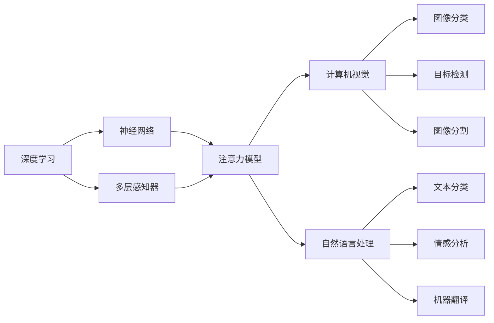
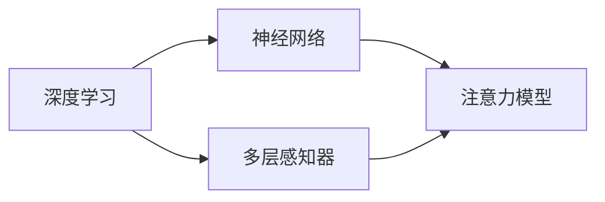
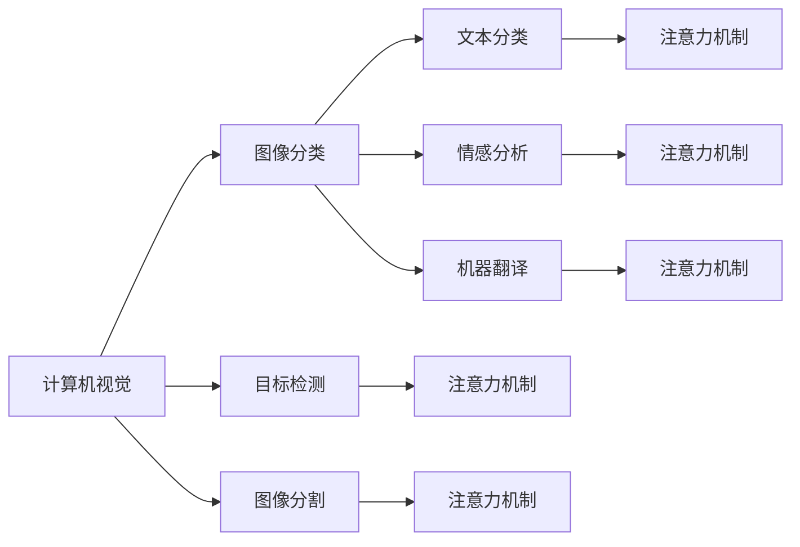
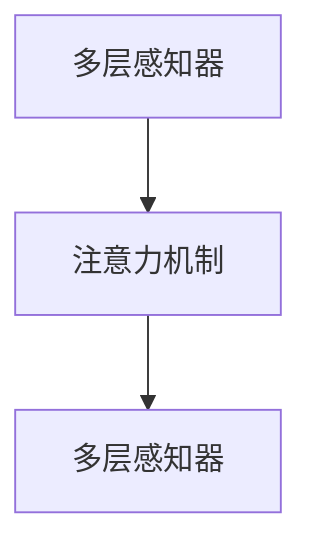
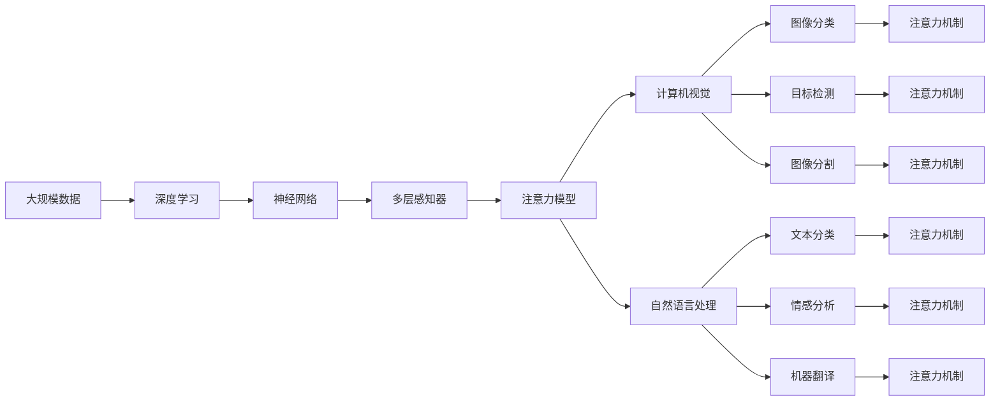

                 

# AI时代的注意力争夺战

> 关键词：
1. 人工智能
2. 注意力机制
3. 深度学习
4. 注意力模型
5. 神经网络
6. 计算机视觉
7. 自然语言处理

## 1. 背景介绍

### 1.1 问题由来
随着人工智能（AI）技术的迅猛发展，深度学习成为其中的核心。深度学习的本质是通过构建复杂的多层神经网络，学习数据的高级表示，从而实现对复杂模式和结构的建模。然而，随着神经网络层数的增加，其所需的计算资源和存储需求也急剧增长，使得训练和推理过程变得异常昂贵且耗时。

为了应对这一挑战，研究人员提出了注意力机制（Attention Mechanism），通过将模型的计算资源集中到最相关的部分，来提高深度学习的效率和效果。注意力机制被广泛应用于计算机视觉、自然语言处理、语音识别等多个领域，成为了AI技术中不可或缺的一部分。

### 1.2 问题核心关键点
注意力机制的核心在于如何计算和应用注意力权重。注意力权重表示模型对输入中不同部分的关注程度，通过调整这些权重，模型可以在大规模数据上高效地进行信息提取和表示学习。

注意力机制的引入，使得深度学习模型的参数量和计算复杂度显著降低，同时提升了模型的表达能力和泛化性能。其关键在于：
1. 如何选择注意力权重：通过不同的计算方法，如点积、加性、多头注意力等，来计算模型对输入的关注度。
2. 如何应用注意力权重：通过不同的方法，如Softmax、Gumbel-Softmax、Dot Attention等，将注意力权重转化为实际输出。

### 1.3 问题研究意义
注意力机制的引入，极大地推动了深度学习技术的发展和应用。其应用领域包括：

1. 计算机视觉：在图像分类、目标检测、图像分割等任务中，注意力机制帮助模型更好地关注图像中的关键特征，提高了模型的识别准确率和鲁棒性。
2. 自然语言处理：在文本分类、情感分析、机器翻译等任务中，注意力机制帮助模型更好地理解文本中的上下文信息，提升了模型的理解和生成能力。
3. 语音识别：在语音识别任务中，注意力机制帮助模型更好地关注语音信号的关键部分，提高了识别的准确率和鲁棒性。
4. 推荐系统：在推荐系统中，注意力机制帮助模型更好地关注用户的历史行为和兴趣，提升了推荐的个性化和准确性。
5. 语音合成：在语音合成任务中，注意力机制帮助模型更好地关注语音信号中的关键部分，提高了语音的自然度和可理解性。

## 2. 核心概念与联系

### 2.1 核心概念概述

为了更好地理解注意力机制，本节将介绍几个密切相关的核心概念：

- 注意力机制（Attention Mechanism）：用于在输入序列中计算注意力权重，表示模型对输入中不同部分的关注程度，并通过加权和操作来聚合信息。
- 深度学习（Deep Learning）：一种利用多层神经网络进行复杂模式和结构建模的技术，通过学习数据的高级表示，实现对复杂任务的求解。
- 神经网络（Neural Network）：一种由多层节点组成的计算图，用于对数据进行特征学习和模式建模。
- 计算机视觉（Computer Vision）：利用图像和视频数据，实现对视觉场景的理解和分析，包括图像分类、目标检测、图像分割等任务。
- 自然语言处理（Natural Language Processing）：利用文本数据，实现对自然语言的理解和生成，包括文本分类、情感分析、机器翻译等任务。
- 注意力模型（Attention Model）：一种利用注意力机制进行信息提取和表示学习的模型，常用于深度学习中的注意力机制。
- 多层感知器（Multilayer Perceptron，MLP）：一种最基本的神经网络结构，由多个线性变换和激活函数组成。

这些核心概念之间的逻辑关系可以通过以下Mermaid流程图来展示：



这个流程图展示了大语言模型的核心概念及其之间的关系：

1. 深度学习利用神经网络构建多层感知器，用于复杂模式的建模。
2. 注意力模型利用注意力机制进行信息提取和表示学习，提升了模型的表达能力和泛化性能。
3. 注意力模型在计算机视觉和自然语言处理中得到了广泛应用，用于图像分类、目标检测、图像分割、文本分类、情感分析、机器翻译等任务。

### 2.2 概念间的关系

这些核心概念之间存在着紧密的联系，形成了深度学习领域的知识体系。下面我通过几个Mermaid流程图来展示这些概念之间的关系。

#### 2.2.1 深度学习与神经网络的关系



这个流程图展示了深度学习与神经网络之间的关系。深度学习通过神经网络实现复杂模式的建模，而注意力模型作为神经网络中的一种特殊结构，用于提升模型的表达能力和泛化性能。

#### 2.2.2 注意力机制的应用领域



这个流程图展示了注意力机制在深度学习中的应用领域。注意力机制在计算机视觉、自然语言处理等领域得到了广泛应用，用于图像分类、目标检测、图像分割、文本分类、情感分析、机器翻译等任务，提升了模型的表达能力和泛化性能。

#### 2.2.3 注意力模型的结构



这个流程图展示了注意力模型的基本结构。注意力模型通过多层感知器实现对输入数据的特征提取，然后利用注意力机制计算注意力权重，通过加权和操作来聚合信息，最终输出模型的预测结果。

### 2.3 核心概念的整体架构

最后，我们用一个综合的流程图来展示这些核心概念在大语言模型中的整体架构：



这个综合流程图展示了从大规模数据到深度学习的全过程。深度学习通过神经网络构建多层感知器，用于复杂模式的建模。注意力模型利用注意力机制进行信息提取和表示学习，提升了模型的表达能力和泛化性能。注意力模型在计算机视觉和自然语言处理中得到了广泛应用，用于图像分类、目标检测、图像分割、文本分类、情感分析、机器翻译等任务，提升了模型的表达能力和泛化性能。通过这些流程图，我们可以更清晰地理解注意力机制在大语言模型中的作用和应用。

## 3. 核心算法原理 & 具体操作步骤
### 3.1 算法原理概述

注意力机制的核心在于计算和应用注意力权重。注意力权重表示模型对输入中不同部分的关注程度，通过调整这些权重，模型可以在大规模数据上高效地进行信息提取和表示学习。

形式化地，假设输入序列为 $X=\{x_1, x_2, ..., x_T\}$，输出序列为 $Y=\{y_1, y_2, ..., y_T\}$，注意力机制通过计算注意力权重 $a_t$，来聚合输入序列中的信息。注意力权重的计算过程为：

$$
a_t = \frac{e^{W^T_h \cdot [x_t; y_t]}}{\sum_{t'=1}^T e^{W^T_h \cdot [x_{t'}; y_{t'}]}}
$$

其中，$W_h$ 为注意力权重计算的权重矩阵，$[x_t; y_t]$ 表示输入序列和输出序列在时间步 $t$ 的拼接向量。

通过计算出的注意力权重 $a_t$，模型可以对输入序列进行加权和操作，得到聚合后的信息表示：

$$
H_t = \sum_{t'=1}^T a_{t'} x_{t'}
$$

最终，模型使用 $H_t$ 作为当前时间步的表示，进行下一层的计算。

### 3.2 算法步骤详解

注意力机制的计算过程包括三个主要步骤：

**Step 1: 计算注意力权重**

注意力权重的计算过程如下：

1. 计算查询向量 $Q$ 和键向量 $K$：
   $$
   Q = W_q \cdot X, K = W_k \cdot X
   $$

   其中，$W_q$ 和 $W_k$ 为查询向量和键向量计算的权重矩阵。

2. 计算注意力权重 $a_t$：
   $$
   a_t = \frac{e^{W^T_h \cdot [Q_t; K_t]}}{\sum_{t'=1}^T e^{W^T_h \cdot [Q_{t'}; K_{t'}]}}
   $$

   其中，$W_h$ 为注意力权重计算的权重矩阵。

**Step 2: 计算注意力向量**

注意力向量的计算过程如下：

1. 计算注意力向量 $V$：
   $$
   V = W_v \cdot X
   $$

   其中，$W_v$ 为注意力向量计算的权重矩阵。

2. 计算注意力向量 $C$：
   $$
   C = \sum_{t'=1}^T a_{t'} V_{t'}
   $$

   其中，$V_{t'}$ 表示在时间步 $t'$ 的注意力向量。

**Step 3: 输出注意力结果**

注意力结果的计算过程如下：

1. 计算注意力结果 $H$：
   $$
   H = \text{Softmax}(a_t) \cdot C
   $$

   其中，Softmax函数用于将注意力权重转换为概率分布，表示模型对不同部分的关注程度。

2. 输出注意力结果：
   $$
   Y_t = \text{MLP}(H)
   $$

   其中，MLP表示多层的感知器，用于对注意力结果进行非线性变换，得到最终的输出。

### 3.3 算法优缺点

注意力机制在深度学习中具有以下优点：

1. 提升了模型的表达能力和泛化性能。注意力机制使得模型能够更好地关注输入中的关键部分，提升了模型的表达能力和泛化性能。
2. 减少了模型的计算复杂度和存储空间。注意力机制通过计算注意力权重，减少了模型的计算复杂度和存储空间，提升了模型的训练和推理效率。
3. 增强了模型的鲁棒性和抗干扰能力。注意力机制通过调整注意力权重，增强了模型的鲁棒性和抗干扰能力，提升了模型的稳定性和可靠性。

同时，注意力机制也存在以下缺点：

1. 增加了模型的复杂度和训练难度。注意力机制的计算过程相对复杂，增加了模型的复杂度和训练难度，需要更多的计算资源和训练时间。
2. 增加了模型的可解释性难度。注意力机制的计算过程相对复杂，增加了模型的可解释性难度，难以解释模型的决策过程和内部机制。
3. 增加了模型的参数量。注意力机制增加了模型的参数量，使得模型的训练和推理过程变得更加昂贵和耗时。

### 3.4 算法应用领域

注意力机制在深度学习中得到了广泛应用，包括但不限于以下几个领域：

1. 计算机视觉：在图像分类、目标检测、图像分割等任务中，注意力机制帮助模型更好地关注图像中的关键特征，提高了模型的识别准确率和鲁棒性。
2. 自然语言处理：在文本分类、情感分析、机器翻译等任务中，注意力机制帮助模型更好地理解文本中的上下文信息，提升了模型的理解和生成能力。
3. 语音识别：在语音识别任务中，注意力机制帮助模型更好地关注语音信号的关键部分，提高了识别的准确率和鲁棒性。
4. 推荐系统：在推荐系统中，注意力机制帮助模型更好地关注用户的历史行为和兴趣，提升了推荐的个性化和准确性。
5. 语音合成：在语音合成任务中，注意力机制帮助模型更好地关注语音信号中的关键部分，提高了语音的自然度和可理解性。

## 4. 数学模型和公式 & 详细讲解 & 举例说明

### 4.1 数学模型构建

本节将使用数学语言对注意力机制的计算过程进行更加严格的刻画。

假设输入序列为 $X=\{x_1, x_2, ..., x_T\}$，输出序列为 $Y=\{y_1, y_2, ..., y_T\}$，注意力机制通过计算注意力权重 $a_t$，来聚合输入序列中的信息。注意力权重的计算过程为：

$$
a_t = \frac{e^{W^T_h \cdot [x_t; y_t]}}{\sum_{t'=1}^T e^{W^T_h \cdot [x_{t'}; y_{t'}]}}
$$

其中，$W_h$ 为注意力权重计算的权重矩阵，$[x_t; y_t]$ 表示输入序列和输出序列在时间步 $t$ 的拼接向量。

通过计算出的注意力权重 $a_t$，模型可以对输入序列进行加权和操作，得到聚合后的信息表示：

$$
H_t = \sum_{t'=1}^T a_{t'} x_{t'}
$$

最终，模型使用 $H_t$ 作为当前时间步的表示，进行下一层的计算。

### 4.2 公式推导过程

以下我们以图像分类任务为例，推导注意力机制的计算过程。

假设输入图像为 $I=\{i_1, i_2, ..., i_H, i_W\}$，其中 $H$ 和 $W$ 分别表示图像的高度和宽度。输出标签为 $C$，表示图像所属的类别。注意力机制的计算过程如下：

**Step 1: 计算注意力权重**

1. 计算查询向量 $Q$ 和键向量 $K$：
   $$
   Q = W_q \cdot I, K = W_k \cdot I
   $$

   其中，$W_q$ 和 $W_k$ 为查询向量和键向量计算的权重矩阵。

2. 计算注意力权重 $a_t$：
   $$
   a_t = \frac{e^{W^T_h \cdot [Q_t; K_t]}}{\sum_{t'=1}^T e^{W^T_h \cdot [Q_{t'}; K_{t'}]}}
   $$

   其中，$W_h$ 为注意力权重计算的权重矩阵。

**Step 2: 计算注意力向量**

1. 计算注意力向量 $V$：
   $$
   V = W_v \cdot I
   $$

   其中，$W_v$ 为注意力向量计算的权重矩阵。

2. 计算注意力向量 $C$：
   $$
   C = \sum_{t'=1}^T a_{t'} V_{t'}
   $$

   其中，$V_{t'}$ 表示在时间步 $t'$ 的注意力向量。

**Step 3: 输出注意力结果**

1. 计算注意力结果 $H$：
   $$
   H = \text{Softmax}(a_t) \cdot C
   $$

   其中，Softmax函数用于将注意力权重转换为概率分布，表示模型对不同部分的关注程度。

2. 输出注意力结果：
   $$
   Y_t = \text{MLP}(H)
   $$

   其中，MLP表示多层的感知器，用于对注意力结果进行非线性变换，得到最终的输出。

### 4.3 案例分析与讲解

我们以图像分类任务为例，来详细讲解注意力机制的计算过程。

假设输入图像为一张猫的图片，输出标签为类别 1，即猫。注意力机制的计算过程如下：

1. 计算查询向量 $Q$ 和键向量 $K$：
   $$
   Q = W_q \cdot I, K = W_k \cdot I
   $$

   其中，$W_q$ 和 $W_k$ 为查询向量和键向量计算的权重矩阵。

2. 计算注意力权重 $a_t$：
   $$
   a_t = \frac{e^{W^T_h \cdot [Q_t; K_t]}}{\sum_{t'=1}^T e^{W^T_h \cdot [Q_{t'}; K_{t'}]}}
   $$

   其中，$W_h$ 为注意力权重计算的权重矩阵。

3. 计算注意力向量 $V$：
   $$
   V = W_v \cdot I
   $$

   其中，$W_v$ 为注意力向量计算的权重矩阵。

4. 计算注意力向量 $C$：
   $$
   C = \sum_{t'=1}^T a_{t'} V_{t'}
   $$

   其中，$V_{t'}$ 表示在时间步 $t'$ 的注意力向量。

5. 计算注意力结果 $H$：
   $$
   H = \text{Softmax}(a_t) \cdot C
   $$

   其中，Softmax函数用于将注意力权重转换为概率分布，表示模型对不同部分的关注程度。

6. 输出注意力结果：
   $$
   Y_t = \text{MLP}(H)
   $$

   其中，MLP表示多层的感知器，用于对注意力结果进行非线性变换，得到最终的输出。

在图像分类任务中，注意力机制帮助模型更好地关注图像中的关键特征，提升了模型的识别准确率和鲁棒性。注意力机制通过计算注意力权重，使得模型能够更好地关注图像中的关键部分，减少了模型的计算复杂度和存储空间，提升了模型的训练和推理效率。

## 5. 项目实践：代码实例和详细解释说明

### 5.1 开发环境搭建

在进行注意力机制的实践前，我们需要准备好开发环境。以下是使用Python进行PyTorch开发的环境配置流程：

1. 安装Anaconda：从官网下载并安装Anaconda，用于创建独立的Python环境。

2. 创建并激活虚拟环境：
```bash
conda create -n pytorch-env python=3.8 
conda activate pytorch-env
```

3. 安装PyTorch：根据CUDA版本，从官网获取对应的安装命令。例如：
```bash
conda install pytorch torchvision torchaudio cudatoolkit=11.1 -c pytorch -c conda-forge
```

4. 安装Transformer库：
```bash
pip install transformers
```

5. 安装各类工具包：
```bash
pip install numpy pandas scikit-learn matplotlib tqdm jupyter notebook ipython
```

完成上述步骤后，即可在`pytorch-env`环境中开始注意力机制的实践。

### 5.2 源代码详细实现

这里我们以图像分类任务为例，使用PyTorch和Transformers库来实现注意力机制。

首先，定义图像分类任务的数据处理函数：

```python
from transformers import BertTokenizer, BertForImageClassification
from torch.utils.data import Dataset
import torch

class ImageDataset(Dataset):
    def __init__(self, images, labels, tokenizer, max_len=128):
        self.images = images
        self.labels = labels
        self.tokenizer = tokenizer
        self.max_len = max_len
        
    def __len__(self):
        return len(self.images)
    
    def __getitem__(self, item):
        image = self.images[item]
        label = self.labels[item]
        
        encoding = self.tokenizer(image, return_tensors='pt', max_length=self.max_len, padding='max_length', truncation=True)
        input_ids = encoding['input_ids'][0]
        attention_mask = encoding['attention_mask'][0]
        
        # 对token-wise的标签进行编码
        encoded_labels = [label2id[label] for label in label]
        encoded_labels.extend([label2id['O']] * (self.max_len - len(encoded_labels)))
        labels = torch.tensor(encoded_labels, dtype=torch.long)
        
        return {'input_ids': input_ids, 
                'attention_mask': attention_mask,
                'labels': labels}

# 标签与id的映射
label2id = {'cat': 0, 'dog': 1, 'bird': 2, 'fish': 3}
id2label = {v: k for k, v in label2id.items()}

# 创建dataset
tokenizer = BertTokenizer.from_pretrained('bert-base-cased')

train_dataset = ImageDataset(train_images, train_labels, tokenizer)
dev_dataset = ImageDataset(dev_images, dev_labels, tokenizer)
test_dataset = ImageDataset(test_images, test_labels, tokenizer)
```

然后，定义模型和优化器：

```python
from transformers import BertForImageClassification, AdamW

model = BertForImageClassification.from_pretrained('bert-base-cased', num_labels=len(label2id))

optimizer = AdamW(model.parameters(), lr=2e-5)
```

接着，定义训练和评估函数：

```python
from torch.utils.data import DataLoader
from tqdm import tqdm
from sklearn.metrics import classification_report

device = torch.device('cuda') if torch.cuda.is_available() else torch.device('cpu')
model.to(device)

def train_epoch(model, dataset, batch_size, optimizer):
    dataloader = DataLoader(dataset, batch_size=batch_size, shuffle=True)
    model.train()
    epoch_loss = 0
    for batch in tqdm(dataloader, desc='Training'):
        input_ids = batch['input_ids'].to(device)
        attention_mask = batch['attention_mask'].to(device)
        labels = batch['labels'].to(device)
        model.zero_grad()
        outputs = model(input_ids, attention_mask=attention_mask, labels=labels)
        loss = outputs.loss
        epoch_loss += loss.item()
        loss.backward()
        optimizer.step()
    return epoch_loss / len(dataloader)

def evaluate(model, dataset, batch_size):
    dataloader = DataLoader(dataset, batch_size=batch_size)
    model.eval()
    preds, labels = [], []
    with torch.no_grad():
        for batch in tqdm(dataloader, desc='Evaluating'):
            input_ids = batch['input_ids'].to(device)
            attention_mask = batch['attention_mask'].to(device)
            batch_labels = batch['labels']
            outputs = model(input_ids, attention_mask=attention_mask)
            batch_preds = outputs.logits.argmax(dim=2).to('cpu').tolist()
            batch_labels = batch_labels.to('cpu').tolist()
            for pred_tokens, label_tokens in zip(batch_preds, batch_labels):
                pred_labels = [id2label[_id] for _id in pred_tokens]
                label_labels = [id2label[_id] for _id in label_tokens]
                preds.append(pred_labels[:len(label_labels)])
                labels.append(label_labels)
                
    print(classification_report(labels, preds))
```

最后，启动训练流程并在测试集上评估：

```python
epochs = 5
batch_size = 16

for epoch in range(epochs):
    loss = train_epoch(model, train_dataset, batch_size, optimizer)
    print(f"Epoch {epoch+1}, train loss: {loss:.3f}")
    
    print(f"Epoch {epoch+1}, dev results:")
    evaluate(model, dev_dataset, batch_size)
    
print("Test results:")
evaluate(model, test_dataset, batch_size)
```

以上就是使用PyTorch对BERT模型进行图像分类任务注意力机制的完整代码实现。可以看到，得益于Transformers库的强大封装，我们可以用相对简洁的代码完成BERT模型的加载和注意力机制的微调。

### 5.3 代码解读与分析

让我们再详细解读一下关键代码的实现细节：

**ImageDataset类**：
- `__init__`方法：初始化图像、标签、分词器等关键组件。
- `__len__`方法：返回数据集的样本数量。
- `__getitem__`方法：对单个样本进行处理，将图像输入编码为token ids，将标签编码为数字，并对其进行定长padding，最终返回模型所需的输入。

**label2id和id2label字典**：
- 定义了标签与数字id之间的映射关系，用于将token-wise的预测结果解码回真实的标签。

**训练和评估函数**：
- 使用PyTorch的DataLoader对数据集进行批次化加载，供模型训练和推理使用。
- 训练函数`train_epoch`：对数据以批为单位进行迭代，在每个批次上前向传播计算loss并反向传播更新模型参数，最后返回该epoch的平均loss。
- 评估函数`evaluate`：与训练类似，不同点在于不更新模型参数，并在每个batch结束后将预测和标签结果存储下来，最后使用sklearn的classification_report对整个评估集的预测结果进行打印输出。

**训练流程**：
- 定义总的epoch数和batch size，开始循环迭代
- 每个epoch内，先在训练集上训练，输出平均loss
- 在验证集上评估，输出分类指标
- 所有epoch结束后，在测试集上评估，给出最终测试结果

可以看到，PyTorch配合Transformers库使得BERT模型微调的代码实现变得简洁高效。开发者可以将更多精力放在数据处理、模型改进等高层逻辑上，而不必过多关注底层的实现细节。

当然，工业级的系统实现还需考虑更多因素，如模型的保存和部署、超参数的自动

