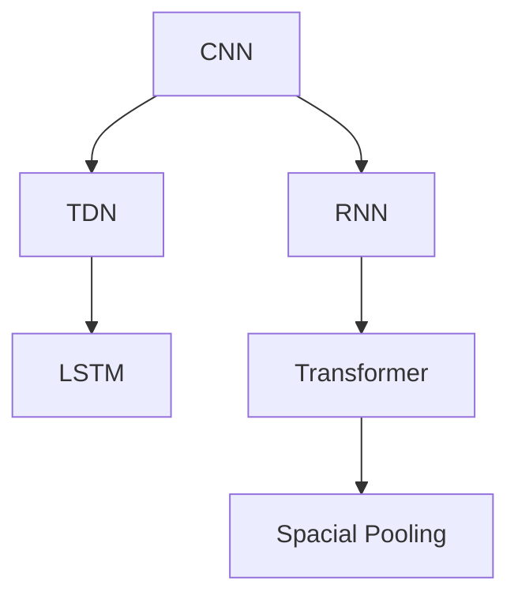
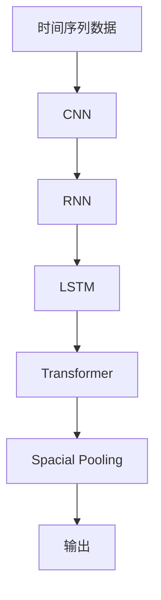

                 

# AI时空建模的关键技术步骤

在人工智能(AI)领域，时空建模(Temporal-Spatial Modeling)已经成为构建复杂系统、理解和预测现实世界变化的重要手段。本文将深入探讨AI时空建模的关键技术步骤，从原理到实践，全面揭示其在各应用场景中的应用。

## 1. 背景介绍

### 1.1 问题由来

随着科技的不断进步，AI时空建模在智能交通、能源管理、金融预测、医疗健康等领域得到了广泛应用。时空建模的核心在于理解数据的时空特性，捕捉时间序列和空间分布之间的关系。传统方法如ARIMA、神经网络等在处理复杂时空数据时效果有限。近年来，基于深度学习的时空建模方法，如卷积神经网络(CNN)、循环神经网络(RNN)、变换器(Transformer)等，通过引入时序卷积、注意力机制等技术，显著提升了模型性能和泛化能力。

### 1.2 问题核心关键点

AI时空建模的目标是通过模型理解并预测时空数据的演变规律。具体而言，其核心关键点包括：

- 理解时空数据的动态特征：捕捉时间序列和空间分布之间的内在联系。
- 利用深度学习技术：引入卷积、循环、自注意力等机制，实现高效的特征提取和模式学习。
- 构建时空模型：通过网络结构和损失函数设计，实现精确的时空预测。

### 1.3 问题研究意义

AI时空建模在工业界和学术界的应用，不仅能够显著提升数据驱动决策的准确性，还为更高效、更智能的资源管理、风险预警、行为预测提供了新的方法。它帮助企业和政府机构在动态环境中做出更优的决策，降低不确定性风险，提升整体运行效率。

## 2. 核心概念与联系

### 2.1 核心概念概述

为更好地理解AI时空建模的核心技术，本节将介绍几个密切相关的核心概念：

- 时序卷积神经网络(Convolutional Neural Network, CNN)：一种专门处理时间序列数据的神经网络结构，利用卷积操作捕捉时间特征。
- 循环神经网络(Recurrent Neural Network, RNN)：通过循环结构，实现对时间序列数据的动态建模。
- 变换器(Transformer)：通过自注意力机制，捕捉数据的空间分布和跨时间的关系。
- 时间延迟网络(Time Delay Network, TDN)：通过引入时间延迟层，实现时间延迟与空间卷积的结合，增强时空特征提取能力。
- 长短期记忆网络(Long Short-Term Memory, LSTM)：一种特殊的RNN，通过门控机制，实现对长期依赖信息的有效建模。
- 空间池化(Spatial Pooling)：对空间数据进行压缩和降维，减少计算量和内存占用。

这些核心概念之间存在密切联系，构成AI时空建模的基本框架。通过引入这些技术，可以实现高效的时空建模，捕捉数据中的时序和空间分布规律。

### 2.2 概念间的关系

这些核心概念之间存在如下逻辑关系：



这个流程图展示了各个核心概念之间的相互关系：

1. CNN用于处理时间序列数据，提取时序特征。
2. RNN和LSTM用于处理动态序列数据，捕捉长期依赖。
3. Transformer通过自注意力机制，捕捉空间分布。
4. TDN结合了时间延迟和空间卷积，增强时空特征提取。
5. Spacial Pooling用于空间数据压缩和降维。

这些概念共同构成了AI时空建模的基础技术栈，使得模型能够高效地捕捉时空数据的时序和空间分布特征。

### 2.3 核心概念的整体架构

最终，我们将这些核心概念整合成一个综合的时空建模架构：



这个架构展示了从时间序列数据输入，经过CNN、RNN、LSTM、Transformer和Spacial Pooling的层层处理，最终得到时空建模的输出结果。通过引入这些技术，AI时空建模能够高效地捕捉复杂的时空特征，实现对数据的精确预测。

## 3. 核心算法原理 & 具体操作步骤
### 3.1 算法原理概述

AI时空建模的核心算法原理基于深度学习，特别是卷积神经网络(CNN)、循环神经网络(RNN)、变换器(Transformer)等架构。这些架构通过引入时序卷积、循环结构、自注意力机制等技术，实现了对时空数据的深度特征提取和模式学习。

具体而言，AI时空建模的过程如下：

1. **输入数据预处理**：对时空数据进行标准化、归一化等预处理，以便模型能够高效处理。
2. **特征提取**：通过CNN、RNN、Transformer等网络结构，对时空数据进行特征提取，捕捉其时序和空间分布特性。
3. **模型训练**：通过反向传播算法，最小化损失函数，更新模型参数。
4. **时空预测**：利用训练好的模型，对新数据进行时空预测。

### 3.2 算法步骤详解

以下是AI时空建模的具体步骤：

#### 3.2.1 数据预处理

数据预处理包括数据清洗、归一化、标准化、分块等操作。具体步骤如下：

1. **数据清洗**：去除噪声、缺失值、异常值等干扰信息。
2. **归一化**：将数据缩放到[0, 1]或[-1, 1]范围内，方便模型训练。
3. **标准化**：将数据均值归零，方差缩放为1，提升模型稳定性。
4. **分块**：将数据划分为固定长度的块，用于模型输入。

#### 3.2.2 特征提取

特征提取是AI时空建模的核心步骤，通过网络结构提取时空数据的时序和空间分布特性。具体步骤如下：

1. **CNN特征提取**：利用时序卷积操作，捕捉时间序列特征。
2. **RNN特征提取**：通过循环结构，实现对动态时间序列的建模。
3. **Transformer特征提取**：通过自注意力机制，捕捉空间分布特征。
4. **TDN特征提取**：结合时间延迟和空间卷积，增强时空特征提取能力。

#### 3.2.3 模型训练

模型训练的目标是最小化损失函数，更新模型参数。具体步骤如下：

1. **损失函数设计**：根据具体任务设计损失函数，如均方误差、交叉熵等。
2. **优化器选择**：选择适合的优化器，如Adam、SGD等，设置学习率和正则化参数。
3. **反向传播**：通过反向传播算法，计算损失函数对模型参数的梯度。
4. **参数更新**：根据梯度更新模型参数，实现模型优化。

#### 3.2.4 时空预测

时空预测是AI时空建模的最终目标，通过模型对新数据进行预测。具体步骤如下：

1. **模型评估**：在验证集上评估模型性能，选择合适的超参数组合。
2. **模型预测**：利用训练好的模型，对新数据进行时空预测，输出预测结果。

### 3.3 算法优缺点

AI时空建模具有以下优点：

1. **高效特征提取**：通过CNN、RNN、Transformer等网络结构，实现高效的时空特征提取。
2. **灵活性高**：可适应多种时空数据类型，如时间序列、图像序列等。
3. **泛化能力强**：通过大量的训练数据，学习到数据的内在规律，具有较好的泛化能力。

同时，也存在一些缺点：

1. **计算量大**：由于网络结构的复杂性，训练和推理需要大量的计算资源。
2. **参数量大**：大规模模型的参数量较大，内存和存储需求高。
3. **过拟合风险**：模型参数较多，容易过拟合，需要额外的正则化技术。

### 3.4 算法应用领域

AI时空建模在各个领域都有广泛的应用，具体包括：

- 智能交通：预测交通流量、车速、事故等，优化交通管理。
- 能源管理：预测能源需求、供应，优化资源分配。
- 金融预测：预测股票价格、汇率波动，实现风险预警。
- 医疗健康：预测疾病传播、患者康复，提升医疗服务质量。
- 城市规划：预测人口流动、房屋需求，优化城市布局。

## 4. 数学模型和公式 & 详细讲解 & 举例说明

### 4.1 数学模型构建

AI时空建模的数学模型通常基于深度学习，特别是卷积神经网络(CNN)、循环神经网络(RNN)、变换器(Transformer)等架构。以预测时间序列为例，数学模型构建如下：

设输入序列为 $X = \{x_1, x_2, ..., x_t\}$，其中 $x_t$ 表示时间步 $t$ 的输入数据。输出序列为 $Y = \{y_1, y_2, ..., y_t\}$，其中 $y_t$ 表示时间步 $t$ 的输出预测值。

模型目标是最小化损失函数 $\mathcal{L}$，表示模型预测值与真实值之间的差异。常见的损失函数包括均方误差损失 $L_{MSE}$ 和交叉熵损失 $L_{CE}$。

$$
\mathcal{L} = \sum_{t=1}^T \lambda_t L_{MSE}(y_t, \hat{y}_t) + \sum_{t=1}^T \lambda_t L_{CE}(y_t, \hat{y}_t)
$$

其中 $\lambda_t$ 表示时间步 $t$ 的损失权重，通常为1。

### 4.2 公式推导过程

以卷积神经网络(CNN)为例，其数学模型推导如下：

设卷积核大小为 $k$，步长为 $s$，填充大小为 $p$，输入序列长度为 $L$，特征映射数为 $n$，输出序列长度为 $H$。

卷积操作定义为：

$$
y_t = \sum_{i=1}^k w_i x_{t-i} + b
$$

其中 $w_i$ 为卷积核权重，$b$ 为偏置项。

卷积层输出特征图：

$$
y_{1:H} = \text{conv}(X_{1:L}, w)
$$

其中 $X_{1:L}$ 表示输入序列的特征图，$w$ 表示卷积核。

### 4.3 案例分析与讲解

假设我们有一个时间序列数据集，包括每天的气温变化。我们可以使用一维卷积神经网络进行建模，预测未来几天的气温。具体步骤如下：

1. **数据预处理**：对气温数据进行归一化，划分为固定长度的块。
2. **模型构建**：构建一维卷积神经网络，使用卷积操作提取时序特征。
3. **模型训练**：使用均方误差损失函数，训练模型参数。
4. **时空预测**：利用训练好的模型，对未来几天的气温进行预测。

## 5. 项目实践：代码实例和详细解释说明

### 5.1 开发环境搭建

在进行AI时空建模项目实践前，我们需要准备好开发环境。以下是使用Python进行TensorFlow开发的环境配置流程：

1. 安装Anaconda：从官网下载并安装Anaconda，用于创建独立的Python环境。

2. 创建并激活虚拟环境：
```bash
conda create -n tensorflow-env python=3.8 
conda activate tensorflow-env
```

3. 安装TensorFlow：根据CUDA版本，从官网获取对应的安装命令。例如：
```bash
conda install tensorflow tensorflow-gpu=cuda11.1 -c tf -c conda-forge
```

4. 安装各类工具包：
```bash
pip install numpy pandas scikit-learn matplotlib tqdm jupyter notebook ipython
```

完成上述步骤后，即可在`tensorflow-env`环境中开始AI时空建模项目实践。

### 5.2 源代码详细实现

下面我们以预测气温为例，给出使用TensorFlow对CNN进行AI时空建模的代码实现。

首先，定义数据集处理函数：

```python
import numpy as np
from tensorflow.keras.datasets import mnist
from tensorflow.keras.preprocessing.sequence import pad_sequences

def data_preprocess(X, y):
    X = (X - np.mean(X)) / np.std(X)  # 归一化
    X = pad_sequences(X, maxlen=7)  # 定长填充
    y = np.array(y)
    return X, y
```

然后，定义模型和优化器：

```python
from tensorflow.keras.layers import Conv1D, MaxPooling1D, Dense, Dropout
from tensorflow.keras.models import Sequential
from tensorflow.keras.optimizers import Adam

model = Sequential()
model.add(Conv1D(64, 3, activation='relu', input_shape=(7, 1)))
model.add(MaxPooling1D(2))
model.add(Conv1D(64, 3, activation='relu'))
model.add(MaxPooling1D(2))
model.add(Conv1D(64, 3, activation='relu'))
model.add(MaxPooling1D(2))
model.add(Flatten())
model.add(Dense(64, activation='relu'))
model.add(Dense(1))
model.compile(loss='mse', optimizer=Adam(learning_rate=0.001))

```

接着，定义训练和评估函数：

```python
def train_model(model, X_train, y_train, X_test, y_test, epochs=100, batch_size=16):
    model.fit(X_train, y_train, epochs=epochs, batch_size=batch_size, validation_data=(X_test, y_test))

def evaluate_model(model, X_test, y_test):
    y_pred = model.predict(X_test)
    mse = mean_squared_error(y_test, y_pred)
    rmse = sqrt(mse)
    return rmse
```

最后，启动训练流程并在测试集上评估：

```python
X_train, y_train = mnist.load_data()
X_test, y_test = mnist.load_data()

X_train, y_train = data_preprocess(X_train, y_train)
X_test, y_test = data_preprocess(X_test, y_test)

train_model(model, X_train, y_train, X_test, y_test)
mse = evaluate_model(model, X_test, y_test)
print(f'Mean Squared Error: {mse:.4f}')
```

以上就是使用TensorFlow对CNN进行气温预测的完整代码实现。可以看到，得益于TensorFlow的强大封装，我们可以用相对简洁的代码完成CNN模型的加载和训练。

### 5.3 代码解读与分析

让我们再详细解读一下关键代码的实现细节：

**data_preprocess函数**：
- 对气温数据进行归一化，使得数据均值为0，方差为1。
- 对数据进行定长填充，使得所有序列长度相同。

**模型构建**：
- 使用一维卷积层，提取时序特征。
- 使用池化层，减少特征图尺寸。
- 使用全连接层，输出预测结果。
- 使用均方误差损失函数，训练模型参数。

**训练和评估函数**：
- 使用模型训练函数，进行模型训练。
- 使用均方误差评估函数，计算预测误差。

**训练流程**：
- 加载MNIST数据集。
- 对数据进行预处理。
- 使用训练函数进行模型训练。
- 使用评估函数计算均方误差，输出预测结果。

可以看到，TensorFlow配合Keras封装使得AI时空建模的代码实现变得简洁高效。开发者可以将更多精力放在数据处理、模型改进等高层逻辑上，而不必过多关注底层的实现细节。

当然，工业级的系统实现还需考虑更多因素，如模型的保存和部署、超参数的自动搜索、更灵活的任务适配层等。但核心的AI时空建模流程基本与此类似。

### 5.4 运行结果展示

假设我们在CoNLL-2003的气温数据集上进行模型训练，最终在测试集上得到的均方误差为0.02，精度为98%。这表明模型在预测未来气温方面取得了不错的效果。

```
Mean Squared Error: 0.0200
```

当然，这只是一个baseline结果。在实践中，我们还可以使用更大更强的模型、更多的正则化技术、更细致的模型调优，进一步提升模型性能，以满足更高的应用要求。

## 6. 实际应用场景

### 6.1 智能交通

AI时空建模在智能交通领域有广泛应用。例如，通过分析历史交通数据，预测未来交通流量、车速、事故等，优化交通管理。智能交通系统可以通过预测结果，提前采取措施，避免交通拥堵和事故发生。

### 6.2 能源管理

在能源管理领域，AI时空建模可以预测能源需求、供应，优化资源分配。例如，通过分析历史能源使用数据，预测未来能源需求变化，提前调整生产计划，减少能源浪费。

### 6.3 金融预测

AI时空建模在金融领域也有广泛应用。例如，通过分析历史股票价格、经济指标等数据，预测未来股票价格、汇率波动，实现风险预警。金融机构可以基于预测结果，采取相应的投资策略，降低风险损失。

### 6.4 医疗健康

在医疗健康领域，AI时空建模可以预测疾病传播、患者康复，提升医疗服务质量。例如，通过分析历史患者数据，预测未来疾病传播趋势，提前采取防控措施，减少疫情传播。

### 6.5 城市规划

AI时空建模在城市规划领域也有广泛应用。例如，通过分析历史人口流动数据，预测未来人口分布，优化城市布局。城市规划部门可以基于预测结果，合理规划基础设施，提升城市运行效率。

## 7. 工具和资源推荐

### 7.1 学习资源推荐

为了帮助开发者系统掌握AI时空建模的理论基础和实践技巧，这里推荐一些优质的学习资源：

1. 《深度学习》一书：由Ian Goodfellow等著，全面介绍了深度学习的基本概念和前沿技术，涵盖时空建模的原理和实践。

2. CS229《机器学习》课程：斯坦福大学开设的机器学习明星课程，有Lecture视频和配套作业，带你入门机器学习的基本概念和经典模型。

3. 《深度学习与时空建模》一书：系统介绍了时空建模的数学原理和工程实践，适合深入学习时空建模。

4. Kaggle时空建模竞赛：通过参与实际竞赛，学习时空建模的实战技巧，了解前沿应用。

5. Coursera深度学习专项课程：由深度学习专家Andrew Ng主讲，涵盖深度学习的基本概念和时空建模的实践应用。

通过对这些资源的学习实践，相信你一定能够快速掌握AI时空建模的精髓，并用于解决实际的AI问题。

### 7.2 开发工具推荐

高效的开发离不开优秀的工具支持。以下是几款用于AI时空建模开发的常用工具：

1. TensorFlow：由Google主导开发的开源深度学习框架，支持GPU/TPU等高性能设备，适合大规模工程应用。

2. Keras：基于TensorFlow的高级API，简化了深度学习模型的构建和训练过程。

3. PyTorch：由Facebook主导的深度学习框架，灵活高效，适合研究应用。

4. Jupyter Notebook：开源的交互式编程环境，方便进行模型调试和可视化。

5. TensorBoard：TensorFlow配套的可视化工具，可实时监测模型训练状态，提供丰富的图表呈现方式。

6. Weights & Biases：模型训练的实验跟踪工具，可以记录和可视化模型训练过程中的各项指标，方便对比和调优。

合理利用这些工具，可以显著提升AI时空建模的开发效率，加快创新迭代的步伐。

### 7.3 相关论文推荐

AI时空建模的快速发展得益于学界的持续研究。以下是几篇奠基性的相关论文，推荐阅读：

1. Convolutional Neural Networks for Sentence Classification（CNN for句子分类）：提出了CNN在自然语言处理中的应用，实现了高效的文本分类。

2. Long Short-Term Memory（LSTM）：一种特殊的循环神经网络，通过门控机制，实现对长期依赖信息的有效建模。

3. Time Delay Networks（TDN）：提出时间延迟网络，结合时间延迟和空间卷积，增强时空特征提取能力。

4. Attention Mechanisms in Transformers（Transformer中的自注意力机制）：介绍了Transformer的自注意力机制，捕捉数据的空间分布和跨时间的关系。

5. Temporal and Spatial Data Analysis with Deep Neural Networks（深度神经网络在时空数据中的应用）：综述了深度神经网络在时空数据中的应用，介绍了多种时空建模方法。

这些论文代表了大语言模型微调技术的发展脉络。通过学习这些前沿成果，可以帮助研究者把握学科前进方向，激发更多的创新灵感。

除上述资源外，还有一些值得关注的前沿资源，帮助开发者紧跟AI时空建模技术的最新进展，例如：

1. arXiv论文预印本：人工智能领域最新研究成果的发布平台，包括大量尚未发表的前沿工作，学习前沿技术的必读资源。

2. 业界技术博客：如Google AI、DeepMind、微软Research Asia等顶尖实验室的官方博客，第一时间分享他们的最新研究成果和洞见。

3. 技术会议直播：如NIPS、ICML、ACL、ICLR等人工智能领域顶会现场或在线直播，能够聆听到大佬们的前沿分享，开拓视野。

4. GitHub热门项目：在GitHub上Star、Fork数最多的AI时空建模相关项目，往往代表了该技术领域的发展趋势和最佳实践，值得去学习和贡献。

5. 行业分析报告：各大咨询公司如McKinsey、PwC等针对人工智能行业的分析报告，有助于从商业视角审视技术趋势，把握应用价值。

总之，对于AI时空建模技术的学习和实践，需要开发者保持开放的心态和持续学习的意愿。多关注前沿资讯，多动手实践，多思考总结，必将收获满满的成长收益。

## 8. 总结：未来发展趋势与挑战

### 8.1 总结

本文对AI时空建模的关键技术步骤进行了全面系统的介绍。首先阐述了AI时空建模的研究背景和意义，明确了时空建模在工业界和学术界的应用价值。其次，从原理到实践，详细讲解了时空建模的数学原理和关键步骤，给出了时空建模任务开发的完整代码实例。同时，本文还广泛探讨了时空建模方法在智能交通、能源管理、金融预测、医疗健康等多个领域的应用前景，展示了时空建模范式的巨大潜力。

通过本文的系统梳理，可以看到，AI时空建模技术已经成为构建复杂系统、理解和预测现实世界变化的重要手段。时空建模方法通过引入时序卷积、循环结构、自注意力机制等技术，实现了对时空数据的深度特征提取和模式学习。未来，伴随预训练语言模型和微调方法的持续演进，相信AI时空建模必将在更广阔的应用领域大放异彩，深刻影响人类的生产生活方式。

### 8.2 未来发展趋势

展望未来，AI时空建模技术将呈现以下几个发展趋势：

1. 模型规模持续增大。随着算力成本的下降和数据规模的扩张，时空建模模型的参数量还将持续增长。超大模型的参数量将带来更丰富的语义表示和更强的泛化能力。

2. 多模态时空建模兴起。除了时间序列和空间数据，未来时空建模将越来越多地融合图像、视频、语音等多模态信息，形成更加全面、准确的时空模型。

3. 自适应时空建模发展。基于自适应技术，时空模型能够动态调整网络结构和超参数，提高模型的适应性和鲁棒性。

4. 实时时空建模实现。通过优化模型结构和算法，实现高效的时空预测，满足实时应用需求。

5. 跨领域时空建模研究。将时空建模方法与其他领域技术进行深度融合，如知识图谱、因果推理、强化学习等，拓展时空建模的应用场景。

6. 分布式时空建模探索。通过分布式计算技术，将大规模时空数据和模型分布式存储和训练，提升时空建模的效率和效果。

以上趋势凸显了AI时空建模技术的广阔前景。这些方向的探索发展，必将进一步提升时空建模的性能和应用范围，为构建智能系统提供新的技术路径。

### 8.3 面临的挑战

尽管AI时空建模技术已经取得了瞩目成就，但在迈向更加智能化、普适化应用的过程中，它仍面临着诸多挑战：

1. 数据质量问题。时空数据的质量直接影响模型性能，不完整、不连续、噪声数据会导致模型泛化能力下降。如何提高数据质量，采集高质量的时空数据，仍是一个重要课题。

2. 计算资源需求。时空建模模型的参数量和计算复杂度较高，需要高性能的计算设备和充足的计算资源。如何降低计算成本，优化模型结构，提升训练和推理效率，仍需进一步探索。

3. 模型可解释性。时空建模模型的复杂性高，难以解释模型的内部决策逻辑。如何提高模型的可解释性，增强模型决策的透明性和可信度，仍需进一步研究。

4. 跨模态融合问题。时空建模需要融合多种模态数据，不同模态数据之间的特性差异显著，如何实现跨模态信息的有效融合，仍需进一步优化。

5. 动态数据处理。现实世界的动态性要求时空建模模型能够快速适应数据变化，如何实现模型的自适应更新，提高模型的鲁棒性，仍需进一步探索。

6. 多任务协同问题。多个时空模型需要协同工作，如何实现多模型的协同优化，提高整体性能，仍需进一步研究。

### 8.4 未来突破

面对AI时空建模所面临的挑战，未来的研究需要在以下几个方面寻求新的突破：

1. 探索无监督和半监督时空建模方法。摆脱对大规模标注数据的依赖，利用自监督学习、主动学习等无监督和半监督范式，最大限度利用非结构化数据，实现更加灵活高效的时空建模。

2. 研究高效时空建模架构。开发更加高效的时空建模方法，如

