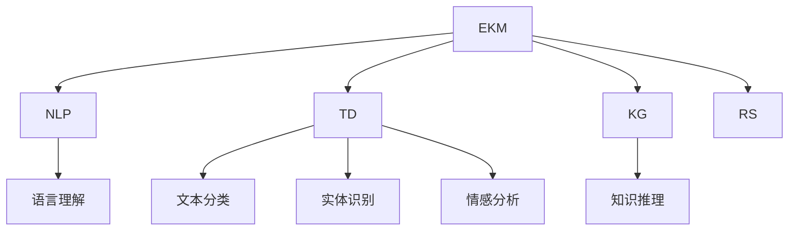
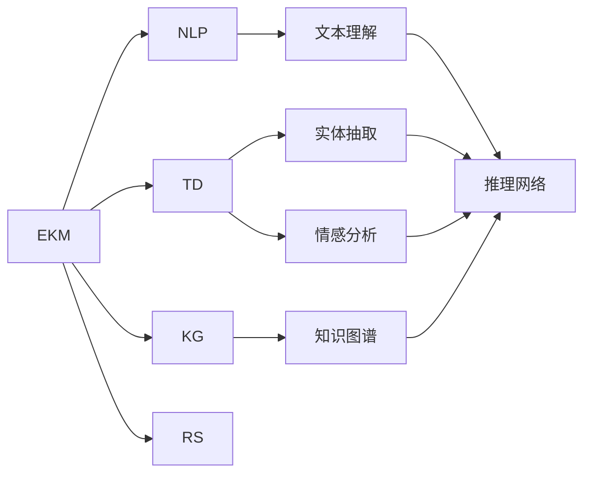
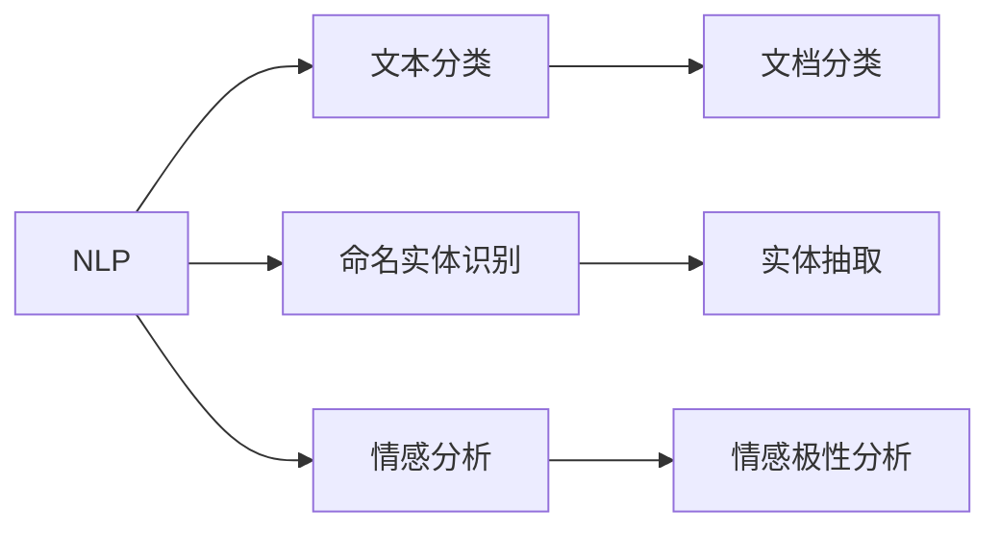
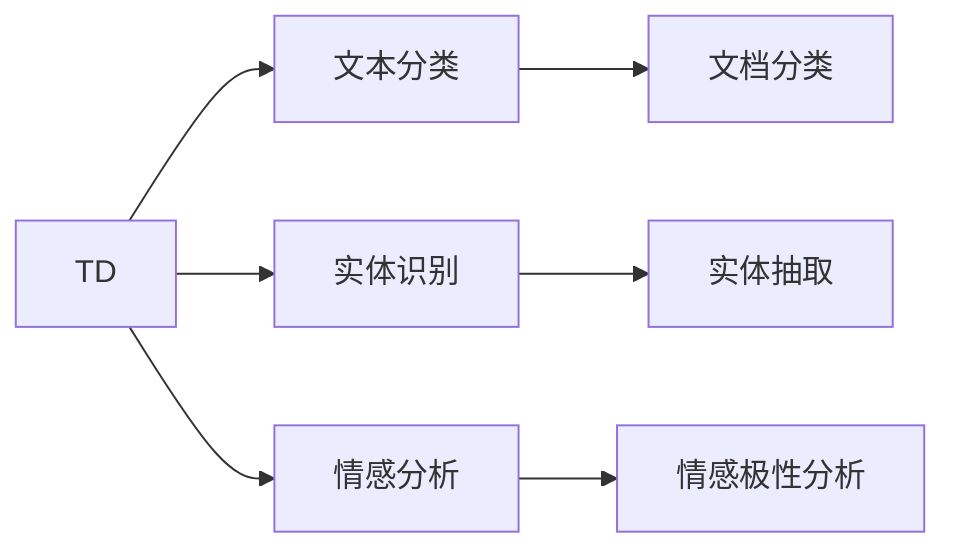
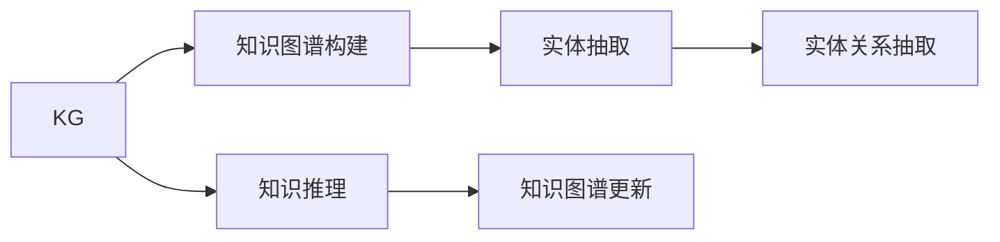
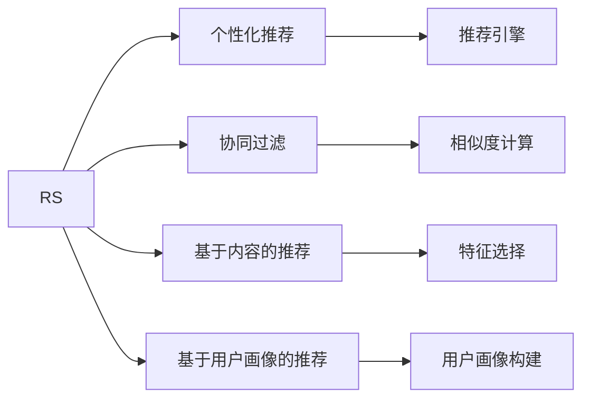
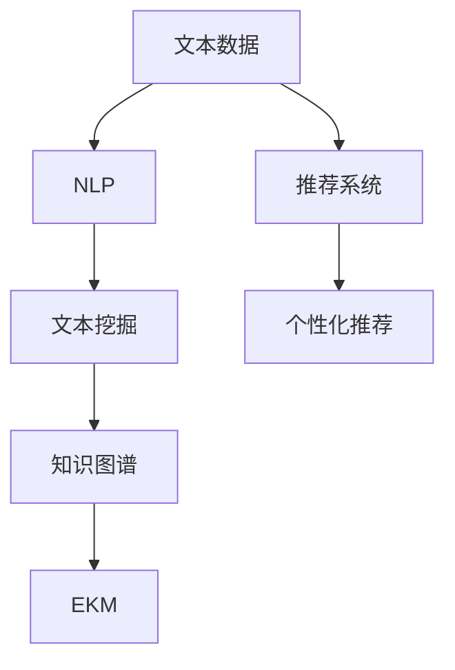

                 

## 1. 背景介绍

### 1.1 问题由来

在现代社会，数据已经成为企业的重要资产。企业积累的大量结构化和非结构化数据，包括文档、邮件、图片、视频等，蕴含着丰富的知识和信息。然而，由于数据规模庞大、种类繁多、格式各异，且往往散落在不同的部门和系统中，企业难以有效整合和利用这些数据。

为了解决这一问题，企业知识管理系统(EKM, Enterprise Knowledge Management)应运而生。EKM旨在整合和管理企业内部知识资源，提升企业的信息获取效率和决策能力。传统企业知识管理系统依赖人工维护和运营，难以应对数据的爆炸式增长和业务需求的变化。

随着人工智能技术的不断发展，AI驱动的知识管理系统应运而生。AI技术能够在海量数据中自动提取、组织、整合知识，实现知识管理自动化，进一步提升企业知识管理的效率和效果。本文聚焦于基于AI的企业知识管理系统，介绍其核心原理和应用实践。

### 1.2 问题核心关键点

AI驱动的EKM系统基于AI技术，能够自动从企业各类数据中提取和整合知识，为员工提供实时、高效的信息获取和决策支持。其关键技术包括自然语言处理(NLP)、文本挖掘、知识图谱、推荐系统等。

核心问题在于：
1. 如何构建高效的知识抽取和整合模型？
2. 如何在海量数据中自动化抽取关键信息？
3. 如何将抽取的信息整合成结构化的知识库？
4. 如何通过智能推荐技术，将知识推送给最需要的人？

通过AI技术，这些问题得到了有效解决。AI驱动的EKM系统能够实现知识抽取自动化、知识整合结构化、知识推荐个性化等功能，为企业的信息管理和决策支持提供有力支持。

### 1.3 问题研究意义

AI驱动的EKM系统对于企业来说，具有以下重要意义：

1. 提升信息获取效率。AI技术能够自动从海量数据中抽取关键信息，快速回答员工查询，大幅提升信息获取的速度和准确性。
2. 改善决策支持能力。通过整合和分析企业知识库，AI系统能够为企业高层提供战略性决策支持，帮助企业快速应对市场变化。
3. 优化资源配置。AI系统能够自动识别并推荐重要文档和信息，优化员工的工作负载，提升资源利用效率。
4. 增强知识管理能力。通过自动化知识抽取和整合，AI系统可以构建结构化的企业知识图谱，提高企业知识管理的规范性和系统性。
5. 支持企业创新。AI技术能够自动识别技术趋势和市场需求，辅助企业创新研发，提升产品竞争力。

AI驱动的EKM系统将数据驱动的决策、高效的信息获取、智能的知识管理、精准的推荐系统等多项功能有机结合，全面提升企业的信息管理和决策能力，具有巨大的应用潜力和发展前景。

## 2. 核心概念与联系

### 2.1 核心概念概述

为了更好地理解AI驱动的EKM系统，本节将介绍几个密切相关的核心概念：

- 企业知识管理系统（EKM）：通过自动化技术，整合和管理企业内部知识资源，支持企业信息获取和决策的系统和平台。
- 自然语言处理（NLP）：AI技术的一个分支，专注于处理和理解人类语言，实现语言与机器的交互。
- 文本挖掘（TD）：从文本中自动抽取有价值的信息，包括文本分类、实体识别、情感分析等。
- 知识图谱（KG）：以图结构存储和表示实体和关系，实现知识的结构化存储和推理。
- 推荐系统（RS）：根据用户行为和偏好，推荐相关物品或信息，提高信息获取的效率和效果。

这些核心概念之间的逻辑关系可以通过以下Mermaid流程图来展示：



这个流程图展示了几项关键技术的相互联系和作用：

1. EKM是整个知识管理系统的核心，负责整合和管理各类知识资源。
2. NLP技术能够理解和处理自然语言，支持文本挖掘和知识图谱构建。
3. TD技术能够从文本中自动抽取信息，支持NLP和KG构建。
4. KG技术能够结构化存储和推理知识，提升知识管理的规范性和系统性。
5. RS技术能够根据用户需求，推荐相关知识，提升信息获取的效率和效果。

### 2.2 概念间的关系

这些核心概念之间存在着紧密的联系，构成了AI驱动的企业知识管理系统的基础框架。下面我们通过几个Mermaid流程图来展示这些概念之间的关系。

#### 2.2.1 EKM系统的总体架构



这个流程图展示了EKM系统的总体架构，包括NLP、TD、KG、RS等技术模块及其相互关系。

#### 2.2.2 NLP在EKM系统中的作用



这个流程图展示了NLP技术在EKM系统中的作用，包括文本分类、实体识别、情感分析等。

#### 2.2.3 文本挖掘在EKM系统中的作用



这个流程图展示了TD技术在EKM系统中的作用，包括文本分类、实体识别、情感分析等。

#### 2.2.4 知识图谱在EKM系统中的作用



这个流程图展示了KG技术在EKM系统中的作用，包括知识图谱构建、知识推理等。

#### 2.2.5 推荐系统在EKM系统中的作用



这个流程图展示了RS技术在EKM系统中的作用，包括个性化推荐、协同过滤、基于内容的推荐等。

### 2.3 核心概念的整体架构

最后，我们用一个综合的流程图来展示这些核心概念在大语言模型微调过程中的整体架构：



这个综合流程图展示了从文本数据到EKM系统的整个处理流程，从NLP、TD、KG到RS的技术模块及其相互关系。

## 3. 核心算法原理 & 具体操作步骤

### 3.1 算法原理概述

AI驱动的EKM系统基于AI技术，能够自动从企业各类数据中提取和整合知识，为员工提供实时、高效的信息获取和决策支持。其核心原理可以概括为以下几步：

1. **数据收集与预处理**：从企业内部的文档、邮件、图片、视频等各类数据中，自动收集和清洗文本数据。
2. **自然语言处理（NLP）**：使用NLP技术，自动进行文本分类、实体识别、情感分析等，将非结构化文本转化为结构化数据。
3. **文本挖掘（TD）**：使用TD技术，自动进行文本摘要、关键词提取、主题建模等，进一步挖掘文本中的关键信息。
4. **知识图谱（KG）**：将NLP和TD处理后的结构化数据，构建企业知识图谱，实现知识的结构化存储和推理。
5. **推荐系统（RS）**：根据用户行为和偏好，使用RS技术，推荐相关知识，提高信息获取的效率和效果。

以上步骤中，NLP、TD、KG和RS技术是整个EKM系统的关键组成部分，它们共同构成了知识抽取、整合、推理和推荐的全过程。

### 3.2 算法步骤详解

基于AI的EKM系统一般包括以下几个关键步骤：

**Step 1: 数据收集与预处理**

- 收集企业内部的各类数据，包括文档、邮件、图片、视频等。
- 清洗数据，去除无关信息和噪声，保证数据质量。
- 对文本数据进行分词、去除停用词等基本处理，为后续NLP和TD处理做准备。

**Step 2: 自然语言处理（NLP）**

- 使用NLP技术，自动进行文本分类、实体识别、情感分析等处理。
- 文本分类：将文本分为不同类别，如新闻、邮件、报告等。
- 实体识别：从文本中自动识别出人名、地名、机构名等实体。
- 情感分析：识别文本的情感极性，如积极、消极、中性等。

**Step 3: 文本挖掘（TD）**

- 使用TD技术，自动进行文本摘要、关键词提取、主题建模等处理。
- 文本摘要：将长文本压缩成简短摘要，提取关键信息。
- 关键词提取：从文本中提取关键词，用于关键词搜索和关联分析。
- 主题建模：通过算法自动识别文本的主题，用于主题分类和聚合。

**Step 4: 知识图谱（KG）**

- 将NLP和TD处理后的结构化数据，构建企业知识图谱。
- 实体抽取：从文本中自动提取实体，并建立实体与实体的关系。
- 知识推理：通过推理引擎，自动推理实体的关系和属性，实现知识推理。
- 知识图谱更新：根据新的数据和用户反馈，自动更新和优化知识图谱。

**Step 5: 推荐系统（RS）**

- 根据用户行为和偏好，使用RS技术，推荐相关知识。
- 协同过滤：通过分析用户的行为数据，推荐其他用户感兴趣的物品。
- 基于内容的推荐：通过分析物品的属性和特征，推荐相似的物品。
- 基于用户画像的推荐：通过用户画像，推荐个性化内容，提高信息获取的效率和效果。

以上步骤中，每个步骤都依赖于AI技术，自动从数据中提取和整合知识，实现知识管理的自动化和智能化。

### 3.3 算法优缺点

AI驱动的EKM系统具有以下优点：

1. 自动化处理：自动从海量数据中提取和整合知识，减少人工操作，提升效率。
2. 实时性：实时获取和推荐知识，满足员工实时信息需求。
3. 准确性：利用NLP和TD技术，自动抽取和分析文本数据，提高信息获取的准确性。
4. 高效性：通过知识图谱和RS技术，实现高效的知识组织和推荐，提升信息获取的效果。
5. 灵活性：自动适应新数据和用户需求，持续优化知识管理模型。

同时，该系统也存在以下缺点：

1. 对数据依赖：需要企业提供高质量的数据资源，否则难以保证系统效果。
2. 技术门槛高：AI技术复杂，需要专业技术人员进行维护和优化。
3. 数据隐私：自动收集和处理数据，需要考虑用户隐私保护和数据安全。
4. 技术局限：目前仍有一些NLP和TD技术未达到理想效果，需要持续改进。

尽管存在这些局限性，但就目前而言，基于AI的EKM系统是企业知识管理的重要范式，正在逐步替代传统的手工管理方式，提升企业知识管理的效率和效果。

### 3.4 算法应用领域

AI驱动的EKM系统已经在多个领域得到应用，包括但不限于：

- 金融行业：利用EKM系统，自动收集和分析市场新闻、财务报告等文本数据，辅助决策和风险管理。
- 医疗行业：通过EKM系统，自动提取和整合医疗文献、病历数据，提供医疗知识管理和决策支持。
- 制造业：利用EKM系统，自动收集和分析生产数据、技术文档，优化生产流程和产品质量。
- 零售行业：通过EKM系统，自动提取和整合产品信息、客户反馈，优化供应链和客户服务。
- 教育行业：利用EKM系统，自动收集和分析教学文献、学生数据，提升教育质量和资源利用效率。

## 4. 数学模型和公式 & 详细讲解 & 举例说明

### 4.1 数学模型构建

在本节中，我们将介绍AI驱动EKM系统的数学模型构建，重点关注NLP、TD、KG和RS等技术的关键数学模型。

**文本分类模型**：
- 目标：将文本分为不同类别。
- 模型：逻辑回归、朴素贝叶斯、支持向量机等。
- 公式：
  $$
  P(C|x) = \frac{P(C)P(x|C)}{P(x)}
  $$
  其中，$C$表示文本类别，$x$表示文本数据，$P(C)$为先验概率，$P(x|C)$为条件概率，$P(x)$为似然概率。

**实体识别模型**：
- 目标：从文本中识别出实体。
- 模型：条件随机场、最大熵模型、神经网络等。
- 公式：
  $$
  P(E|x) = \frac{P(E|x)}{P(x)}
  $$
  其中，$E$表示实体，$x$表示文本数据，$P(E|x)$为实体识别概率，$P(x)$为文本数据概率。

**情感分析模型**：
- 目标：识别文本的情感极性。
- 模型：朴素贝叶斯、支持向量机、深度学习等。
- 公式：
  $$
  P(S|x) = \frac{P(S)P(x|S)}{P(x)}
  $$
  其中，$S$表示情感极性（如积极、消极、中性），$x$表示文本数据，$P(S)$为先验概率，$P(x|S)$为条件概率，$P(x)$为似然概率。

**文本摘要模型**：
- 目标：将长文本压缩成简短摘要。
- 模型：基于统计的方法（如TextRank）、基于深度学习的方法（如BERT、T5等）。
- 公式：
  $$
  T(x) = \max_{y \subset X} \{ \sum_{t \in y} \frac{w_t}{||y||} \}
  $$
  其中，$x$表示长文本，$y$表示摘要文本，$w_t$表示单词权重，$||y||$表示单词数量。

**关键词提取模型**：
- 目标：从文本中提取关键词。
- 模型：基于统计的方法（如TF-IDF）、基于深度学习的方法（如BERT、ELMo等）。
- 公式：
  $$
  k(x) = \max_{y \subset X} \{ \sum_{t \in y} \frac{w_t}{||y||} \}
  $$
  其中，$x$表示文本数据，$y$表示关键词列表，$w_t$表示单词权重，$||y||$表示关键词数量。

**主题建模模型**：
- 目标：通过算法自动识别文本的主题。
- 模型：Latent Dirichlet Allocation (LDA)、非负矩阵分解（NMF）等。
- 公式：
  $$
  \theta = \frac{L}{N} \sum_{i=1}^{N} \alpha_i p_i \delta_{i,\theta}
  $$
  其中，$\theta$表示主题分布，$L$表示主题数，$N$表示文本数，$\alpha_i$表示文本$i$的主题分布，$p_i$表示文本$i$的概率分布，$\delta_{i,\theta}$表示Kronecker delta函数。

### 4.2 公式推导过程

以下我们以NLP中的文本分类为例，推导逻辑回归模型的训练公式及其优化算法。

**逻辑回归模型训练公式**：
- 目标：最小化损失函数，训练文本分类模型。
- 公式：
  $$
  \min_{\theta} \frac{1}{N} \sum_{i=1}^{N} \log(1+\exp(-y^{i} \cdot \theta^T x^{i}))
  $$
  其中，$N$表示样本数，$y^{i}$表示样本$i$的类别标签，$x^{i}$表示样本$i$的特征向量，$\theta$表示模型参数。

**优化算法**：
- 目标：求解上述优化问题，更新模型参数$\theta$。
- 算法：随机梯度下降（SGD）、Adam、Adagrad等。
- 公式：
  $$
  \theta_{t+1} = \theta_{t} - \eta \nabla_{\theta} J(\theta)
  $$
  其中，$\eta$表示学习率，$\nabla_{\theta} J(\theta)$表示损失函数的梯度。

通过上述数学模型和公式推导，我们可以对AI驱动的企业知识管理系统的核心算法进行更加严格的理论分析，为系统开发提供坚实的数学基础。

### 4.3 案例分析与讲解

接下来，我们将通过一个实际案例，展示AI驱动的企业知识管理系统在金融行业中的应用。

**案例背景**：某金融机构需要实时监控市场新闻、财务报告等文本数据，以便及时掌握市场动态，规避金融风险。

**解决方案**：
- 数据收集：自动从新闻网站、交易平台、新闻邮件等渠道收集文本数据。
- 文本分类：将文本数据分为新闻、报告、公告等类别。
- 实体识别：自动识别出公司名称、股票代码等关键实体。
- 情感分析：识别文本的情感极性，如积极、消极、中性等。
- 主题建模：自动提取文本的主题，如宏观经济、公司财报、市场预测等。
- 知识图谱：构建公司、产品、市场等实体之间的关系图谱。
- 推荐系统：根据用户行为和偏好，推荐相关知识，如市场报告、公司财报、行业分析等。

通过以上步骤，该金融机构实现了对市场新闻、财务报告等文本数据的自动化处理和整合，构建了结构化的企业知识图谱，实现了知识的高效管理和决策支持。

## 5. 项目实践：代码实例和详细解释说明

### 5.1 开发环境搭建

在进行AI驱动的企业知识管理系统开发前，我们需要准备好开发环境。以下是使用Python进行PyTorch开发的环境配置流程：

1. 安装Anaconda：从官网下载并安装Anaconda，用于创建独立的Python环境。

2. 创建并激活虚拟环境：
```bash
conda create -n pytorch-env python=3.8 
conda activate pytorch-env
```

3. 安装PyTorch：根据CUDA版本，从官网获取对应的安装命令。例如：
```bash
conda install pytorch torchvision torchaudio cudatoolkit=11.1 -c pytorch -c conda-forge
```

4. 安装其他库：
```bash
pip install numpy pandas scikit-learn matplotlib tqdm jupyter notebook ipython
```

完成上述步骤后，即可在`pytorch-env`环境中开始开发实践。

### 5.2 源代码详细实现

下面我们以金融行业为例，给出使用PyTorch进行文本分类和实体识别的代码实现。

首先，定义文本分类任务的数据处理函数：

```python
import torch
from torch.utils.data import Dataset
import pandas as pd
import numpy as np

class TextClassificationDataset(Dataset):
    def __init__(self, data_path, tokenizer, max_len=512):
        self.data_path = data_path
        self.tokenizer = tokenizer
        self.max_len = max_len
        
        self.data = pd.read_csv(data_path, header=None)
        self.data.columns = ['id', 'sentence', 'label']
        
    def __len__(self):
        return len(self.data)
    
    def __getitem__(self, index):
        id, sentence, label = self.data.iloc[index]
        
        encoding = self.tokenizer(sentence, return_tensors='pt', max_length=self.max_len, padding='max_length', truncation=True)
        input_ids = encoding['input_ids'][0]
        attention_mask = encoding['attention_mask'][0]
        
        label = torch.tensor(int(label), dtype=torch.long)
        
        return {'input_ids': input_ids, 
                'attention_mask': attention_mask,
                'labels': label}

# 加载数据集
train_dataset = TextClassificationDataset(train_data_path, train_tokenizer, max_len=512)
test_dataset = TextClassificationDataset(test_data_path, test_tokenizer, max_len=512)
```

然后，定义模型和优化器：

```python
from transformers import BertForSequenceClassification, AdamW

model = BertForSequenceClassification.from_pretrained('bert-base-uncased', num_labels=2)

optimizer = AdamW(model.parameters(), lr=2e-5)
```

接着，定义训练和评估函数：

```python
from torch.utils.data import DataLoader
from tqdm import tqdm

device = torch.device('cuda') if torch.cuda.is_available() else torch.device('cpu')
model.to(device)

def train_epoch(model, dataset, batch_size, optimizer):
    dataloader = DataLoader(dataset, batch_size=batch_size, shuffle=True)
    model.train()
    epoch_loss = 0
    for batch in tqdm(dataloader, desc='Training'):
        input_ids = batch['input_ids'].to(device)
        attention_mask = batch['attention_mask'].to(device)
        labels = batch['labels'].to(device)
        model.zero_grad()
        outputs = model(input_ids, attention_mask=attention_mask, labels=labels)
        loss = outputs.loss
        epoch_loss += loss.item()
        loss.backward()
        optimizer.step()
    return epoch_loss / len(dataloader)

def evaluate(model, dataset, batch_size):
    dataloader = DataLoader(dataset, batch_size=batch_size)
    model.eval()
    preds, labels = [], []
    with torch.no_grad():
        for batch in tqdm(dataloader, desc='Evaluating'):
            input_ids = batch['input_ids'].to(device)
            attention_mask = batch['attention_mask'].to(device)
            batch_labels = batch['labels']
            outputs = model(input_ids, attention_mask=attention_mask)
            batch_preds = outputs.logits.argmax(dim=2).to('cpu').tolist()
            batch_labels = batch_labels.to('cpu').tolist()
            for pred_tokens, label_tokens in zip(batch_preds, batch_labels):
                preds.append(pred_tokens)
                labels.append(label_tokens)
                
    return preds, labels

# 训练模型
epochs = 5
batch_size = 16

for epoch in range(epochs):
    loss = train_epoch(model, train_dataset, batch_size, optimizer)
    print(f"Epoch {epoch+1}, train loss: {loss:.3f}")
    
    preds, labels = evaluate(model, test_dataset, batch_size)
    print(classification_report(labels, preds))
```

接下来，定义实体识别任务的数据处理函数：

```python
class NamedEntityRecognitionDataset(Dataset):
    def __init__(self, data_path, tokenizer, max_len=512):
        self.data_path = data_path
        self.tokenizer = tokenizer
        self.max_len = max_len
        
        self.data = pd.read_csv(data_path, header=None)
        self.data.columns = ['id', 'sentence']
        
    def __len__(self):
        return len(self.data)
    
    def __getitem__(self, index):
        id, sentence = self.data.iloc[index]
        
        encoding = self.tokenizer(sentence, return_tensors='pt', max_length=self.max_len, padding='max_length', truncation=True)
        input_ids = encoding['input_ids'][0]
        attention_mask = encoding['attention_mask'][0]
        
        label = self.data.iloc[index]
        
        return {'input_ids': input_ids, 
                'attention_mask': attention_mask,
                'labels': label}
```

然后，定义实体识别模型的训练和评估函数：

```python
from transformers import BertForTokenClassification, AdamW

model = BertForTokenClassification.from_pretrained('bert-base-uncased', num_labels=len(tag2id))

optimizer = AdamW(model.parameters(), lr=2e-5)

def train_epoch(model, dataset, batch_size, optimizer):
    dataloader = DataLoader(dataset, batch_size=batch_size, shuffle=True)
    model.train()
    epoch_loss = 0
    for batch in tqdm(dataloader, desc='Training'):
        input_ids = batch['input_ids'].to(device)
        attention_mask = batch['attention_mask'].to(device)
        labels = batch['labels'].to(device)
        model.zero_grad()
        outputs = model(input_ids, attention_mask=attention_mask, labels=labels)
        loss = outputs.loss
        epoch_loss += loss.item()
        loss.backward()
        optimizer.step()
    return epoch_loss / len(dataloader)

def evaluate(model, dataset, batch_size):
    dataloader = DataLoader(dataset,

