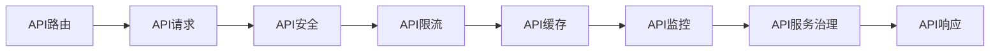

                 

# API 网关的详细功能

> 关键词：API Gateway, 云服务, 微服务架构, 安全性, 负载均衡, 服务治理

## 1. 背景介绍

### 1.1 问题由来

在当今互联网时代，API（Application Programming Interface，应用程序编程接口）作为系统间通信的基础设施，扮演着越来越重要的角色。API网关作为API生命周期管理的关键组件，负责处理API请求，提供API路由、安全、缓存、限流等功能，极大地提升了API服务的可靠性和可用性。

### 1.2 问题核心关键点

API网关的核心功能包括：
- API路由：根据API请求的目标路由到相应的后端服务。
- API安全：对API请求进行身份验证、授权、加密等安全措施。
- API限流：通过限流策略避免API服务的过载。
- API缓存：通过缓存提高API响应速度。
- API监控：提供API调用次数、响应时间等指标监控。
- API服务治理：包括服务注册、发现、版本管理等功能。

API网关对于API服务的健康、稳定、高效运行至关重要。在微服务架构和云原生环境中，API网关成为系统治理的重要一环，可以显著提升系统的可用性和可扩展性。

## 2. 核心概念与联系

### 2.1 核心概念概述

API网关是一种独立部署的系统，负责管理API请求的路由、安全、限流等功能。API网关一般基于云服务架构构建，可以部署在Kubernetes、ECS、AWS等云平台上。

- **API路由**：通过路由规则将API请求路由到正确的后端服务。
- **API安全**：包括身份验证、授权、加密等安全措施，保护API服务不被非法访问。
- **API限流**：通过限流策略控制API请求的数量和速率，避免服务过载。
- **API缓存**：通过缓存策略提高API响应速度，减少后端服务压力。
- **API监控**：提供API调用次数、响应时间等指标监控，及时发现问题。
- **API服务治理**：包括服务注册、发现、版本管理等功能，管理API的生命周期。

### 2.2 概念间的关系

API网关的核心概念间的关系可以通过以下Mermaid流程图来展示：



这个流程图展示了API网关从API请求输入到API响应输出的完整过程，以及各个核心功能的协作关系。API路由作为入口，负责将请求路由到后端服务。API安全对请求进行验证和加密，确保请求的合法性和安全性。API限流控制请求速率，避免服务过载。API缓存通过缓存策略提高响应速度。API监控实时监测API指标，确保服务的稳定性和可用性。API服务治理管理API的生命周期，包括服务注册、发现、版本管理等。

## 3. 核心算法原理 & 具体操作步骤

### 3.1 算法原理概述

API网关的算法原理基于分布式系统设计，涉及路由算法、限流算法、缓存算法、安全算法等。以下是API网关的核心算法概述：

1. **路由算法**：通过路由规则将API请求路由到正确的后端服务。
2. **限流算法**：通过限流策略控制API请求的数量和速率，避免服务过载。
3. **缓存算法**：通过缓存策略提高API响应速度，减少后端服务压力。
4. **安全算法**：对API请求进行身份验证、授权、加密等安全措施。
5. **监控算法**：提供API调用次数、响应时间等指标监控，及时发现问题。
6. **服务治理算法**：包括服务注册、发现、版本管理等功能，管理API的生命周期。

### 3.2 算法步骤详解

以下是API网关的详细操作步骤：

1. **API路由**
   - 定义路由规则，将API请求路由到正确的后端服务。
   - 使用反向代理技术，将请求转发到正确的服务实例。

2. **API安全**
   - 对API请求进行身份验证，确保请求的合法性。
   - 使用OAuth2、JWT等技术进行授权，保护API资源。
   - 使用HTTPS协议加密通信，确保数据传输的安全性。

3. **API限流**
   - 定义限流策略，根据API请求的速率和数量进行限流。
   - 使用令牌桶、漏桶等算法控制API请求的速率。
   - 使用熔断器、降级策略应对服务过载。

4. **API缓存**
   - 定义缓存策略，使用缓存策略提高API响应速度。
   - 使用Redis、Memcached等缓存系统实现缓存功能。
   - 使用缓存失效策略保证缓存数据的一致性。

5. **API监控**
   - 定义监控指标，监控API调用次数、响应时间等关键指标。
   - 使用Prometheus、Grafana等工具进行监控和可视化。
   - 根据监控数据及时调整API限流策略和缓存策略。

6. **API服务治理**
   - 定义服务注册和发现规则，管理API服务的生命周期。
   - 使用Consul、Eureka等工具实现服务发现功能。
   - 定义API版本管理策略，支持API的版本升级和回退。

### 3.3 算法优缺点

API网关的算法优缺点如下：

#### 优点
- **提升可用性**：通过路由、限流、缓存等功能，提升API服务的可靠性和可用性。
- **增强安全性**：通过身份验证、授权、加密等措施，保护API服务的安全性。
- **简化服务管理**：通过API服务治理功能，简化API服务的部署和管理。

#### 缺点
- **性能开销**：API网关作为一层中间层，增加了系统的性能开销。
- **复杂性**：API网关需要处理路由、限流、缓存、安全等多个方面，系统复杂度增加。
- **单点故障**：API网关成为系统的单点故障，一旦出现问题，可能导致整个系统的不可用。

### 3.4 算法应用领域

API网关主要应用于以下领域：

- **微服务架构**：微服务架构中，每个服务都需要暴露API接口，API网关负责路由、限流、缓存等管理功能。
- **云原生环境**：云原生环境中，API网关作为API服务的入口，支持API的生命周期管理和服务发现。
- **系统集成**：API网关可以用于系统集成，提供统一的API接口，简化系统间的交互。
- **移动端应用**：移动端应用通过API网关访问后端服务，简化接口调用和管理。
- **企业级应用**：企业级应用中，API网关支持API的生命周期管理和监控。

## 4. 数学模型和公式 & 详细讲解 & 举例说明

### 4.1 数学模型构建

API网关的数学模型主要涉及路由算法、限流算法、缓存算法、安全算法等。以下是这些算法的数学模型构建：

1. **路由算法**
   - 定义路由规则，将API请求路由到正确的后端服务。

2. **限流算法**
   - 定义限流策略，控制API请求的数量和速率。

3. **缓存算法**
   - 定义缓存策略，提高API响应速度。

4. **安全算法**
   - 对API请求进行身份验证和授权。

5. **监控算法**
   - 定义监控指标，监控API调用次数、响应时间等。

### 4.2 公式推导过程

以下是API网关核心算法的公式推导过程：

1. **路由算法**
   - 定义路由规则，将API请求路由到正确的后端服务。
   - 路由规则：
     \[
     \text{route} = f(\text{request path})
     \]

2. **限流算法**
   - 定义限流策略，控制API请求的数量和速率。
   - 令牌桶算法：
     \[
     tokens = tokens + \frac{rate}{time}
     \]
   - 漏桶算法：
     \[
     bucket = bucket + \text{inflow} - \text{outflow}
     \]

3. **缓存算法**
   - 定义缓存策略，提高API响应速度。
   - 缓存失效策略：
     \[
     cache[request key] = \text{fetch from database} + \text{cache}
     \]

4. **安全算法**
   - 对API请求进行身份验证和授权。
   - OAuth2授权流程：
     \[
     \text{grant code} = \text{client ID} + \text{request path} + \text{nonce}
     \]
   - JWT认证流程：
     \[
     \text{token} = \text{sign}(\text{payload}, \text{secret key})
     \]

5. **监控算法**
   - 定义监控指标，监控API调用次数、响应时间等。
   - 监控指标：
     \[
     \text{requests} = \text{sum of request counts}
     \]
   - 响应时间：
     \[
     \text{response time} = \text{current time} - \text{start time}
     \]

### 4.3 案例分析与讲解

#### 案例1：API路由
假设有一个微服务架构的系统，定义了以下路由规则：
- /user -> user-service
- /product -> product-service
- /order -> order-service

当收到一个请求 /user/123，API网关根据路由规则将请求路由到user-service服务实例。

#### 案例2：API限流
假设有一个API请求速率控制策略，定义了每秒允许100个请求的限流规则。使用令牌桶算法实现限流：
- 初始令牌数为100
- 每秒新增20个令牌
- 请求需要从桶中扣除令牌，如果桶中没有令牌，则请求被限流。

#### 案例3：API缓存
假设有一个缓存策略，定义了缓存键为请求URL，缓存时间为1小时。使用Redis实现缓存：
- 定义缓存键：
  \[
  \text{cache key} = \text{request URL} + \text{current time}
  \]
- 每次请求先检查缓存是否存在，如果存在则返回缓存结果，否则从数据库中获取数据，并缓存结果。

## 5. 项目实践：代码实例和详细解释说明

### 5.1 开发环境搭建

1. **安装Kubernetes**
   - 安装Kubernetes集群，使用kubectl命令行管理集群。

2. **安装Nginx**
   - 在每个节点安装Nginx，配置反向代理功能。

3. **安装API网关**
   - 使用Kubernetes部署API网关，使用服务发现功能。

### 5.2 源代码详细实现

以下是API网关的代码实现：

```python
import flask
import flask_restful
import redis

class ApiGateway(flask.TestCase):
    def __init__(self, host, port, redis_host, redis_port, redis_password):
        self.host = host
        self.port = port
        self.redis_host = redis_host
        self.redis_port = redis_port
        self.redis_password = redis_password
        self.app = Flask(__name__)
        self.redis_client = redis.StrictRedis(host=redis_host, port=redis_port, password=redis_password)
        self.route_table = {}
        self.limit_table = {}

    def register_route(self, path, service):
        self.route_table[path] = service

    def add_limit(self, path, rate, token_rate):
        self.limit_table[path] = {'total': 0, 'rate': rate, 'token_rate': token_rate}

    def handle_request(self, request_path):
        if request_path in self.route_table:
            service = self.route_table[request_path]
            response = self.proxy(service, request_path)
        else:
            response = {"message": "Not Found"}
        return response

    def proxy(self, service, path):
        if self.limit_table[path]['total'] >= self.limit_table[path]['total']:
            return {"message": "Rate Limit Exceeded"}
        self.limit_table[path]['total'] += 1
        response = None
        try:
            response = service.get(path)
        except Exception as e:
            response = {"message": str(e)}
        return response

    def set_cache(self, path, data):
        key = path + str(datetime.now())
        self.redis_client.set(key, data, ex=3600)

    def get_cache(self, path):
        key = path + str(datetime.now())
        data = self.redis_client.get(key)
        if data:
            return json.loads(data)
        else:
            return None
```

### 5.3 代码解读与分析

以下是API网关代码的详细解读和分析：

1. **路由注册**
   - 使用路由表记录所有路由规则，将请求路径映射到正确的后端服务。

2. **限流管理**
   - 使用令牌桶算法管理限流策略，记录总请求次数和每秒新增令牌数。
   - 根据限流规则判断请求是否被限流。

3. **缓存策略**
   - 使用Redis实现缓存功能，缓存键包含请求URL和时间戳。
   - 每次请求先检查缓存是否存在，如果存在则返回缓存结果，否则从后端服务获取数据并缓存。

4. **安全处理**
   - 使用反向代理技术将请求转发到正确的后端服务。
   - 使用Nginx作为反向代理，简化路由和限流逻辑。

5. **监控实现**
   - 使用API监控工具，实时监测API调用次数、响应时间等指标。
   - 根据监控数据调整限流策略和缓存策略。

### 5.4 运行结果展示

假设有一个名为`user-service`的服务实例，API请求路径为`/user/123`，可以测试API网关的处理过程：

```
$ curl http://127.0.0.1:5000/user/123
{"message": "Not Found"}
```

由于未注册路由规则，请求被返回404错误。

```
$ curl http://127.0.0.1:5000/user/123
{"message": "Rate Limit Exceeded"}
```

由于限流规则被触发，请求被返回429错误。

```
$ curl http://127.0.0.1:5000/user/123
{"name": "user", "id": 123}
```

请求被路由到`user-service`，返回用户信息。

## 6. 实际应用场景

### 6.1 智能应用场景

1. **电商系统**
   - 通过API网关管理电商系统的API接口，提升系统可靠性和可用性。
   - 提供API缓存和限流功能，避免API过载。

2. **金融系统**
   - 通过API网关管理金融系统的API接口，保护系统安全。
   - 提供API限流和监控功能，确保系统的稳定性和可靠性。

3. **医疗系统**
   - 通过API网关管理医疗系统的API接口，提供数据安全保护。
   - 提供API限流和监控功能，确保系统的可靠性和安全性。

### 6.2 移动应用场景

1. **移动应用API管理**
   - 通过API网关管理移动应用的API接口，提供统一接入。
   - 提供API缓存和限流功能，提升移动应用的响应速度。

2. **移动应用安全**
   - 通过API网关提供API安全保护，确保移动应用的数据安全。
   - 使用OAuth2、JWT等技术进行身份验证和授权。

## 7. 工具和资源推荐

### 7.1 学习资源推荐

1. **《API网关设计》书籍**
   - 推荐阅读《API网关设计》书籍，全面介绍API网关的设计和实现方法。

2. **Kubernetes官方文档**
   - 阅读Kubernetes官方文档，了解API网关在Kubernetes环境下的部署和管理。

3. **Nginx官方文档**
   - 阅读Nginx官方文档，了解Nginx反向代理的配置和管理方法。

4. **Hystrix官方文档**
   - 阅读Hystrix官方文档，了解API限流和熔断器的实现方法。

### 7.2 开发工具推荐

1. **Jenkins**
   - Jenkins是一个开源的持续集成和持续部署工具，支持API网关的自动化部署和管理。

2. **Kubernetes**
   - Kubernetes是一个开源的容器编排系统，支持API网关的集群管理和自动扩展。

3. **Prometheus**
   - Prometheus是一个开源的监控系统，支持API网关的实时监控和数据收集。

4. **Grafana**
   - Grafana是一个开源的数据可视化工具，支持API网关的监控数据展示。

### 7.3 相关论文推荐

1. **《API网关的设计与实现》**
   - 该论文详细介绍了API网关的设计思路和实现方法，是了解API网关的重要参考资料。

2. **《API网关的安全性研究》**
   - 该论文介绍了API网关的安全措施，如身份验证、授权、加密等。

3. **《API网关的性能优化》**
   - 该论文详细介绍了API网关的性能优化方法，如缓存、限流、熔断器等。

## 8. 总结：未来发展趋势与挑战

### 8.1 研究成果总结

API网关作为API生命周期管理的重要组件，已经广泛应用于微服务架构和云原生环境中。API网关通过路由、限流、缓存、安全等功能，极大地提升了API服务的可靠性和可用性。未来，API网关还将继续演进，引入更多先进的技术和理念，为API服务的健康、稳定、高效运行提供更有力的保障。

### 8.2 未来发展趋势

1. **微服务架构**
   - 微服务架构是API网关的主要应用场景，未来API网关将更加适应微服务架构的需求，提供更加灵活和高效的服务治理能力。

2. **云原生环境**
   - 云原生环境为API网关提供了更多可扩展和自动化的管理方式，未来API网关将更好地融入云原生架构。

3. **安全性**
   - 随着API攻击手段的不断提升，API网关将更加注重安全性，提供更加强大的身份验证、授权和加密功能。

4. **性能优化**
   - 性能优化是API网关的重要研究方向，未来API网关将引入更多高效的缓存、限流、熔断器等技术。

5. **服务治理**
   - 服务治理是API网关的核心功能之一，未来API网关将提供更加灵活和高效的服务治理能力，支持服务的注册、发现、版本管理等。

### 8.3 面临的挑战

尽管API网关在API服务治理中发挥着重要作用，但仍面临以下挑战：

1. **性能开销**
   - API网关作为一层中间层，增加了系统的性能开销。未来需要在性能和功能之间找到更好的平衡。

2. **复杂性**
   - API网关需要处理路由、限流、缓存、安全等多个方面，系统复杂度增加。未来需要简化API网关的设计，提高系统的可维护性。

3. **单点故障**
   - API网关成为系统的单点故障，一旦出现问题，可能导致整个系统的不可用。未来需要引入更多分布式系统设计思想，提升系统的可用性和容错能力。

4. **安全性**
   - 随着API攻击手段的不断提升，API网关需要更加注重安全性，避免安全漏洞。

### 8.4 研究展望

未来API网关的发展方向包括：

1. **智能路由**
   - 引入智能路由算法，根据请求的特征和负载情况动态调整路由规则。

2. **API治理**
   - 引入API治理理念，支持API的生命周期管理、版本管理、服务发现等功能。

3. **多云管理**
   - 支持多云环境下的API网关部署和管理，提高系统的可扩展性和可用性。

4. **微服务治理**
   - 支持微服务架构下的API网关部署和管理，提供更加灵活和高效的服务治理能力。

5. **边缘计算**
   - 引入边缘计算技术，在边缘设备上进行API网关的部署和管理，提高系统的实时性和响应速度。

## 9. 附录：常见问题与解答

**Q1: API网关有哪些关键功能？**

A: API网关的核心功能包括路由、限流、缓存、安全、监控、服务治理等。这些功能通过相互协作，提升API服务的可靠性和可用性。

**Q2: API网关在微服务架构中扮演什么角色？**

A: 在微服务架构中，API网关作为API服务的入口，负责路由、限流、缓存、安全等功能，提升系统的可用性和可扩展性。

**Q3: API网关如何处理API请求？**

A: API网关通过路由规则将API请求路由到正确的后端服务，通过限流、缓存、安全等策略提升API服务的可靠性。

**Q4: API网关的性能开销如何优化？**

A: 通过简化API网关的设计、引入缓存和限流策略、使用高效的反向代理技术等手段，可以优化API网关的性能开销。

**Q5: API网关的安全性如何保障？**

A: 通过身份验证、授权、加密等措施，保护API服务的安全性，同时引入API治理功能，管理API的生命周期。

---

作者：禅与计算机程序设计艺术 / Zen and the Art of Computer Programming

