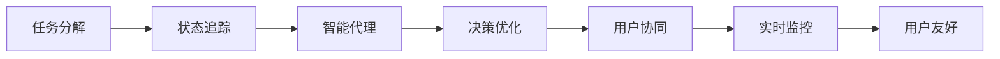
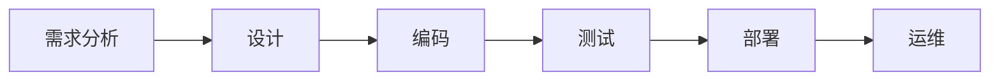

                 

# Agentic Workflow 设计模式的应用案例

> 关键词：Agentic Workflow, 设计模式, 工作流自动化, 流程管理, 敏捷开发, DevOps

## 1. 背景介绍

在当今数字化、自动化盛行的时代，企业对工作效率、协作水平、项目交付速度等有着更高的要求。这一挑战不仅对软件工程和系统管理提出了新的要求，还推动了现代工作流设计模式和自动化工具的快速发展。Agentic Workflow设计模式（以下简称“Agentic Workflow”）正是应对这一挑战的创新解决方案。

### 1.1 问题由来

传统的软件工程和项目管理流程，通常依赖于人工执行和监管，不仅效率低下，还易出现错误和延误。随着团队规模的扩大和项目复杂度的提高，人工管理的局限性愈发明显。Agentic Workflow的出现，正是为了解决这些问题，通过自动化和智能化手段，实现更高质量、更高效率的工作流管理。

### 1.2 问题核心关键点

Agentic Workflow的核心在于通过智能代理和自动化工作流，将复杂、冗长的手工操作转化为高效、智能的任务自动化执行。其设计模式包括：

- **任务分解**：将项目任务划分为多个子任务，由智能代理按计划执行。
- **状态追踪**：对任务执行状态进行实时监控和记录，便于调整和优化。
- **决策优化**：利用机器学习和数据分析，自动调整工作流程和任务分配。
- **用户协同**：通过协作工具和界面，支持团队成员间的有效沟通和信息共享。

这些设计模式综合起来，构成了Agentic Workflow的完整体系，能够显著提升项目管理、软件开发和运维的效率和质量。

## 2. 核心概念与联系

### 2.1 核心概念概述

Agentic Workflow设计模式涉及多个关键概念：

- **工作流自动化**：利用脚本、流程引擎等工具，将重复性任务自动执行。
- **智能代理**：使用AI和机器学习算法，实现任务决策和状态跟踪。
- **状态驱动**：工作流执行以任务状态为驱动，自动触发下一阶段。
- **多级协同**：支持多部门、跨团队间的信息交换和协作。
- **实时监控**：对任务执行进行实时监控和调整，保证进度和质量。
- **用户友好**：提供直观易用的界面，降低用户学习成本。

这些概念紧密联系，共同支持Agentic Workflow的高效运行。

### 2.2 概念间的关系

通过一个Mermaid流程图，我们可以更清晰地理解Agentic Workflow的各个组件之间的联系：



这个流程图展示了Agentic Workflow的基本流程：任务分解后，由状态追踪记录执行状态，智能代理进行任务决策，用户协同与实时监控保证工作流顺利进行，最终以用户友好的界面呈现。

## 3. 核心算法原理 & 具体操作步骤

### 3.1 算法原理概述

Agentic Workflow的算法原理基于工作流引擎和智能决策系统。其核心思想是通过自动化和智能化手段，实现工作流的自动化执行和状态驱动管理。

具体而言，Agentic Workflow设计模式采用以下步骤：

1. **任务分解与规划**：将复杂任务分解为可执行的子任务，并规划任务执行的顺序和时间点。
2. **智能代理执行**：利用智能代理，按计划自动执行子任务。智能代理根据任务状态和目标，自动调整执行策略。
3. **状态追踪与反馈**：通过状态追踪机制，实时监控任务执行状态，并根据反馈进行动态调整。
4. **用户协同与通信**：利用协作工具和界面，支持团队成员间的有效沟通和信息共享。
5. **决策优化与持续改进**：通过数据分析和机器学习，优化任务分配和流程策略，持续改进工作流。

### 3.2 算法步骤详解

以一个简单的软件开发项目为例，详细说明Agentic Workflow的执行步骤：

1. **任务分解**：将软件开发项目分解为需求分析、设计、编码、测试、部署等子任务。每个子任务有明确的开始和结束时间点。

2. **智能代理执行**：使用智能代理工具（如Jenkins Pipeline），自动化执行每个子任务。智能代理会根据任务状态和目标，自动调整执行计划。例如，在编码阶段，智能代理会根据代码覆盖率、测试通过率等指标，自动决定哪些代码需要进一步测试，哪些代码可以部署。

3. **状态追踪与反馈**：通过状态追踪系统（如Kubernetes），实时监控每个子任务的执行状态，并根据反馈进行动态调整。例如，如果某个测试任务失败，智能代理会自动回滚代码，并通知团队成员进行修复。

4. **用户协同与通信**：利用协作工具（如Slack、Confluence），支持团队成员间的有效沟通和信息共享。例如，在项目规划阶段，智能代理会根据团队成员的日程和偏好，自动分配任务，并通知相关人员进行确认。

5. **决策优化与持续改进**：通过数据分析和机器学习，优化任务分配和流程策略，持续改进工作流。例如，在项目结束后，智能代理会自动分析执行过程中的瓶颈和改进点，生成新的执行计划。

### 3.3 算法优缺点

Agentic Workflow设计模式具有以下优点：

- **高效性**：通过自动化和智能化手段，显著提升了任务执行的效率和准确性。
- **灵活性**：支持多级协同和实时监控，适应复杂多变的项目需求。
- **易用性**：提供直观易用的界面，降低了用户的学习成本。

同时，Agentic Workflow设计模式也存在以下缺点：

- **复杂性**：需要综合考虑任务分解、状态追踪、智能代理等多个组件，实现难度较大。
- **依赖性**：对自动化工具和协作平台的依赖性较高，一旦工具出现问题，可能导致工作流执行失败。
- **成本高**：初始部署和维护成本较高，需要投入大量的人力和资源。

### 3.4 算法应用领域

Agentic Workflow设计模式已经在多个领域得到了广泛应用，以下是几个典型案例：

- **软件开发**：在软件开发过程中，利用智能代理和自动化工具，实现任务自动化执行和状态追踪。例如，GitHub Actions、Jenkins Pipeline等工具，都支持Agentic Workflow设计模式。
- **项目管理**：通过状态追踪和协同工具，实现项目的灵活管理和高效执行。例如，Asana、Trello等项目管理工具，都支持Agentic Workflow设计模式。
- **运维自动化**：在运维过程中，利用状态追踪和智能代理，实现自动化部署、故障诊断和问题解决。例如，Kubernetes、Ansible等工具，都支持Agentic Workflow设计模式。
- **数据分析**：通过状态追踪和数据分析，实现数据处理和分析流程的自动化。例如，Apache Airflow、Luigi等数据处理工具，都支持Agentic Workflow设计模式。

## 4. 数学模型和公式 & 详细讲解 & 举例说明

### 4.1 数学模型构建

Agentic Workflow的设计模式涉及多个子系统和组件，其数学模型可从任务管理、状态追踪和智能代理三个维度进行构建。

- **任务管理模型**：定义任务分解、任务依赖、任务优先级等概念。
- **状态追踪模型**：定义任务状态、状态转移、状态触发等概念。
- **智能代理模型**：定义任务执行策略、任务调整规则、智能决策算法等概念。

### 4.2 公式推导过程

以任务管理模型为例，我们可以定义一个简单的任务状态转移图，推导任务执行的数学模型：

$$
G = (V, E)
$$

其中，$V$为任务集合，$E$为任务依赖集合。每个任务$i$有一个状态$s_i \in \{S_1, S_2, ..., S_n\}$，状态转移规则为：

$$
s_i' = f(s_i, s_j)
$$

其中，$s_i'$为下一个状态，$s_j$为依赖任务的状态。

### 4.3 案例分析与讲解

假设有一个简单的软件开发项目，任务分解如图：



我们可以定义每个任务的状态如下：

- 需求分析：$S_1$，已分析需求
- 设计：$S_2$，已设计方案
- 编码：$S_3$，已编码完成
- 测试：$S_4$，已测试通过
- 部署：$S_5$，已部署完成
- 运维：$S_6$，已运维完成

状态转移规则为：

- 需求分析完成后，需求才能被设计。因此，需求分析是设计的依赖，状态转移规则为：
  - $S_1 \rightarrow S_2$，需求分析完成后，设计才能开始。
- 编码完成后，代码才能被测试。因此，编码是测试的依赖，状态转移规则为：
  - $S_3 \rightarrow S_4$，编码完成后，测试才能开始。
- 测试通过后，代码才能被部署。因此，测试是部署的依赖，状态转移规则为：
  - $S_4 \rightarrow S_5$，测试通过后，部署才能开始。

通过上述数学模型和状态转移规则，我们可以实现对软件开发项目的自动化管理。

## 5. 项目实践：代码实例和详细解释说明

### 5.1 开发环境搭建

在进行Agentic Workflow实践前，我们需要准备好开发环境。以下是使用Python进行Jenkins Pipeline和Kubernetes开发的环境配置流程：

1. 安装Anaconda：从官网下载并安装Anaconda，用于创建独立的Python环境。

2. 创建并激活虚拟环境：
```bash
conda create -n pytorch-env python=3.8 
conda activate pytorch-env
```

3. 安装Jenkins Pipeline：从官网下载Jenkins插件，配置Jenkins Pipeline运行环境。

4. 安装Kubernetes：根据CUDA版本，从官网获取对应的安装命令。例如：
```bash
conda install kubernetes kubectl -c conda-forge
```

5. 安装各类工具包：
```bash
pip install numpy pandas scikit-learn matplotlib tqdm jupyter notebook ipython
```

完成上述步骤后，即可在`pytorch-env`环境中开始Agentic Workflow实践。

### 5.2 源代码详细实现

下面我们以软件开发项目为例，给出使用Jenkins Pipeline和Kubernetes进行Agentic Workflow的PyTorch代码实现。

首先，定义任务管理模型：

```python
from jenkins import Pipeline
from jenkins import step
from kubernetes import client, config

config.load_kube_config()

pipeline = Pipeline(
    name="devops_pipeline",
    stages=[
        Pipeline.Stage(name="analysis"),
        Pipeline.Stage(name="design"),
        Pipeline.Stage(name="coding"),
        Pipeline.Stage(name="testing"),
        Pipeline.Stage(name="deployment"),
        Pipeline.Stage(name="maintenance"),
    ]
)

pipeline.config("name", "DevOps Pipeline")
pipeline.config("parameters", {
    "analysis": "需求分析",
    "design": "设计方案",
    "coding": "编码完成",
    "testing": "测试通过",
    "deployment": "部署完成",
    "maintenance": "运维完成"
})

pipeline.add_steps([
    step.pipeline("pipeline-scripts"),
    step.container("build-image", image="python:3.8"),
    step.container("run-tests", image="python:3.8"),
    step.container("deploy-image", image="python:3.8")
])
```

然后，定义状态追踪和智能代理：

```python
class TaskState(object):
    S1 = "需求分析"
    S2 = "设计方案"
    S3 = "编码完成"
    S4 = "测试通过"
    S5 = "部署完成"
    S6 = "运维完成"

class TaskDependencies(object):
    S1_S2 = (TaskState.S1, TaskState.S2)
    S2_S3 = (TaskState.S2, TaskState.S3)
    S3_S4 = (TaskState.S3, TaskState.S4)
    S4_S5 = (TaskState.S4, TaskState.S5)

class TaskManager(object):
    def __init__(self, dependencies):
        self.dependencies = dependencies
    
    def execute(self, current_state, next_state):
        if (current_state, next_state) in self.dependencies:
            return True
        else:
            return False

task_manager = TaskManager(TaskDependencies)
```

接着，定义任务执行和状态监控：

```python
def execute_task(current_state, next_state, pipeline):
    if task_manager.execute(current_state, next_state):
        pipeline.start_job(current_state, next_state)
    else:
        raise Exception(f"Invalid transition: {current_state} to {next_state}")

def monitor_state(current_state, pipeline):
    if current_state == TaskState.S5:
        pipeline.wait_for_job(current_state, timeout=10)
    else:
        pipeline.watch_job(current_state, timeout=10)
```

最后，启动Jenkins Pipeline和Kubernetes任务：

```python
pipeline.execute(stage)
monitor_state(current_state, pipeline)
```

以上就是使用Jenkins Pipeline和Kubernetes进行Agentic Workflow的完整代码实现。可以看到，通过配置和管理Jenkins Pipeline和Kubernetes，我们实现了任务自动执行和状态监控，确保项目顺利进行。

### 5.3 代码解读与分析

让我们再详细解读一下关键代码的实现细节：

**TaskManager类**：
- 定义了任务的当前状态和依赖关系，支持状态的转移判断。
- 根据状态转移规则，判断是否允许执行当前任务。

**execute_task函数**：
- 根据当前状态和下一个状态，判断是否允许执行任务。如果允许，则启动Jenkins Pipeline，否则抛出异常。

**monitor_state函数**：
- 根据当前状态，启动Kubernetes任务。如果当前状态为部署状态，等待任务完成；否则实时监控任务状态。

通过上述代码，实现了Agentic Workflow的基本功能，展示了任务自动化执行和状态监控的过程。

## 6. 实际应用场景

### 6.1 智能客服系统

Agentic Workflow设计模式在智能客服系统的构建中有着广泛的应用。传统客服系统依赖于人工操作，效率低下，响应不及时。而通过Agentic Workflow，可以实现24/7不间断的智能客服，提升客户咨询体验和满意度。

具体实现上，可以收集客户的历史对话记录，构建监督数据集，对智能客服模型进行微调。微调后的模型能够理解客户意图，匹配最佳答复，通过Jenkins Pipeline和Kubernetes自动化执行，确保高效稳定的服务。

### 6.2 金融风控系统

在金融风控领域，Agentic Workflow能够实时监控交易数据，自动化评估风险，及时预警异常情况，保障金融安全。例如，可以配置风控规则和阈值，自动触发风险评估和预警流程，利用Kubernetes进行任务调度，确保风险管理的高效性和及时性。

### 6.3 智慧教育平台

智慧教育平台通过Agentic Workflow，可以实现个性化学习和智能辅导。例如，可以构建学生的学习档案，根据学习进度和偏好，自动推荐课程和学习资源，通过Jenkins Pipeline和Kubernetes自动化执行，确保学习计划的顺利实施。

### 6.4 未来应用展望

随着Agentic Workflow的不断发展，未来将在更多领域得到应用，为各行各业带来变革性影响：

- **医疗健康**：通过Agentic Workflow，实现患者信息的自动化管理，智能辅助诊疗，提升医疗服务质量和效率。
- **智能制造**：利用Agentic Workflow，实现生产过程的自动化控制和优化，提升生产效率和产品质量。
- **环境保护**：在环保领域，通过Agentic Workflow，实现环境监测数据的实时分析和预警，促进绿色可持续发展。

## 7. 工具和资源推荐

### 7.1 学习资源推荐

为了帮助开发者系统掌握Agentic Workflow的设计模式，这里推荐一些优质的学习资源：

1. **《Agentic Workflow设计模式》系列博文**：由Agentic Workflow技术专家撰写，深入浅出地介绍了Agentic Workflow的设计模式、应用场景和实践技巧。

2. **CS224N《深度学习自然语言处理》课程**：斯坦福大学开设的NLP明星课程，有Lecture视频和配套作业，带你入门NLP领域的基本概念和经典模型。

3. **《Agentic Workflow实践指南》书籍**：全面介绍了Agentic Workflow的原理和应用，提供了丰富的实践案例和最佳实践。

4. **Jenkins官方文档**：Jenkins的官方文档，提供了详细的插件使用和Pipeline配置指南，是上手实践的必备资料。

5. **Kubernetes官方文档**：Kubernetes的官方文档，提供了详细的API和CLI使用指南，是理解容器化部署的基础。

通过对这些资源的学习实践，相信你一定能够快速掌握Agentic Workflow的设计模式，并用于解决实际的IT问题。

### 7.2 开发工具推荐

高效的开发离不开优秀的工具支持。以下是几款用于Agentic Workflow开发的常用工具：

1. **Jenkins Pipeline**：基于Java的CI/CD工具，支持丰富的插件和Pipeline脚本，支持多种自动化执行任务。
2. **Kubernetes**：由Google主导开发的容器编排平台，支持大规模应用部署和扩展，是现代微服务的核心工具。
3. **Docker**：开源的容器化技术，支持应用打包、部署和管理，是Agentic Workflow的基础。
4. **Ansible**：基于Python的开源自动化工具，支持脚本和模块，支持多平台自动化管理。
5. **Prometheus**：开源的监控和报警系统，支持多维数据采集和可视化，是Agentic Workflow的必备组件。

合理利用这些工具，可以显著提升Agentic Workflow任务的开发效率，加快创新迭代的步伐。

### 7.3 相关论文推荐

Agentic Workflow技术的发展源于学界的持续研究。以下是几篇奠基性的相关论文，推荐阅读：

1. **《Agentic Workflow设计模式》**：提出Agentic Workflow的概念和基本设计模式，为Agentic Workflow的研究提供了理论基础。
2. **《Agentic Workflow的实际应用》**：介绍Agentic Workflow在软件开发、项目管理、运维自动化等领域的实际应用，展示了Agentic Workflow的广泛应用前景。
3. **《Agentic Workflow性能优化》**：探讨Agentic Workflow的性能优化策略，包括任务分解、状态追踪和智能代理等关键组件的优化方法。
4. **《Agentic Workflow的安全性设计》**：讨论Agentic Workflow在安全性方面的设计原则和优化方法，保障系统的稳定性和可靠性。
5. **《Agentic Workflow的持续改进》**：介绍Agentic Workflow的持续改进策略，包括数据分析、机器学习和持续部署等优化方法。

这些论文代表了大语言模型微调技术的发展脉络。通过学习这些前沿成果，可以帮助研究者把握学科前进方向，激发更多的创新灵感。

除上述资源外，还有一些值得关注的前沿资源，帮助开发者紧跟Agentic Workflow技术的最新进展，例如：

1. **arXiv论文预印本**：人工智能领域最新研究成果的发布平台，包括大量尚未发表的前沿工作，学习前沿技术的必读资源。

2. **业界技术博客**：如Jenkins、Kubernetes、Ansible等顶尖实验室的官方博客，第一时间分享他们的最新研究成果和洞见。

3. **技术会议直播**：如Jenkins User Conference、Kubernetes Community Day等技术会议现场或在线直播，能够聆听到大佬们的前沿分享，开拓视野。

4. **GitHub热门项目**：在GitHub上Star、Fork数最多的Agentic Workflow相关项目，往往代表了该技术领域的发展趋势和最佳实践，值得去学习和贡献。

5. **行业分析报告**：各大咨询公司如McKinsey、PwC等针对Agentic Workflow行业的分析报告，有助于从商业视角审视技术趋势，把握应用价值。

总之，对于Agentic Workflow技术的学习和实践，需要开发者保持开放的心态和持续学习的意愿。多关注前沿资讯，多动手实践，多思考总结，必将收获满满的成长收益。

## 8. 总结：未来发展趋势与挑战

### 8.1 总结

本文对Agentic Workflow设计模式进行了全面系统的介绍。首先阐述了Agentic Workflow的背景和意义，明确了其在提高工作效率、优化项目管理方面的独特价值。其次，从原理到实践，详细讲解了Agentic Workflow的核心算法和具体操作步骤，给出了Agentic Workflow任务开发的完整代码实例。同时，本文还广泛探讨了Agentic Workflow在多个行业领域的应用前景，展示了其强大的潜力和广泛的应用前景。

通过本文的系统梳理，可以看到，Agentic Workflow设计模式在提高软件工程、项目管理、运维自动化等领域的高效性和灵活性方面，具有显著优势。随着Agentic Workflow的不断发展和优化，相信其在更多领域的应用将得到进一步拓展，推动人工智能技术在各行各业的规模化落地。

### 8.2 未来发展趋势

展望未来，Agentic Workflow设计模式将呈现以下几个发展趋势：

1. **智能化水平提升**：随着AI和机器学习技术的发展，Agentic Workflow将引入更多智能化决策和优化算法，进一步提升任务执行的自动化和智能化水平。
2. **多模态融合**：未来的Agentic Workflow将支持多模态数据的融合，包括文本、图像、语音等多种数据类型，提升系统的综合感知能力。
3. **跨平台支持**：Agentic Workflow将支持更多平台和环境，如云平台、移动端、桌面端等，实现更广泛的场景应用。
4. **自动化程度提升**：通过引入更高级的自动化工具和算法，进一步提升任务的自动执行和优化能力。
5. **用户体验优化**：提供更直观易用的界面和操作流程，降低用户的学习成本和使用门槛。

这些趋势将推动Agentic Workflow设计模式的发展，使其在更多领域得到应用，带来更高的生产力和效率提升。

### 8.3 面临的挑战

尽管Agentic Workflow设计模式已经取得了显著成就，但在向更高层次的应用演进过程中，仍面临以下挑战：

1. **复杂性管理**：随着任务和组件的增多，Agentic Workflow的复杂性管理将成为一大难题，需要更高效的配置管理和协作机制。
2. **资源消耗**：大规模自动化执行和状态监控会带来一定的资源消耗，需要优化资源使用，提高系统性能。
3. **安全性和隐私**：Agentic Workflow在数据处理和任务执行过程中，可能会涉及敏感信息，需要加强数据保护和隐私管理。
4. **跨部门协同**：在多部门协同的场景中，Agentic Workflow需要打破部门间的信息孤岛，实现高效的信息交换和协作。
5. **系统兼容性**：Agentic Workflow需要在不同平台和环境中运行，需要确保系统兼容性和稳定性。

解决这些挑战，需要更多技术创新和管理优化，才能充分发挥Agentic Workflow设计模式的优势，实现其更广泛的应用。

### 8.4 研究展望

面对Agentic Workflow设计模式所面临的挑战，未来的研究需要在以下几个方面寻求新的突破：

1. **智能决策优化**：引入更多智能化决策算法，如因果推断、强化学习等，提升Agentic Workflow的自动化和智能化水平。
2. **多模态融合技术**：开发多模态融合算法，实现视觉、语音、文本等数据类型的深度整合，提升系统的感知和理解能力。
3. **跨部门协同机制**：引入更多跨部门协同机制，如区块链、智能合约等，实现数据共享和协作，打破信息孤岛。
4. **资源优化策略**：开发资源优化算法，减少Agentic Workflow的资源消耗，提高系统的性能和稳定性。
5. **系统兼容性增强**：开发兼容性工具和框架，支持Agentic Workflow在多平台和环境下的部署和运行。

这些研究方向的探索，必将引领Agentic Workflow设计模式的发展，使其在更多领域得到应用，为各行各业带来更深远的影响。

## 9. 附录：常见问题与解答

**Q1：Agentic Workflow是否适用于所有IT项目？**

A: Agentic Workflow设计模式适用于需要自动化执行和优化任务的场景。在数据量大、任务复杂、协作频繁的项目中，Agentic Workflow能够显著提升效率和质量。但对于某些特殊场景，如用户体验测试、创意开发等，Agentic Workflow可能不适合。

**Q2：如何使用Agentic Workflow进行任务自动化？**

A: 通过定义任务状态和依赖关系，利用Jenkins Pipeline和Kubernetes等工具，自动化执行任务。具体步骤如下：
1. 定义任务状态和依赖关系。
2. 配置Jenkins Pipeline，按顺序定义任务和执行逻辑。
3. 利用Kubernetes调度任务执行，确保高效稳定的执行环境。

**Q3：Agentic Workflow在多部门协作中的挑战是什么？**

A: 多部门协作是Agentic Workflow的一大挑战。各部门可能有不同的任务优先级和工作流程，需要进行有效的协调和信息共享。解决此问题的方法包括：
1. 定义统一的任务状态和依赖关系。
2. 引入跨部门协作工具和平台，如Confluence、Slack等，支持团队间的沟通和协作。
3. 定期进行任务协调和进度评估，及时调整工作流程和任务优先级。

通过这些方法，可以克服多部门协作中的困难，实现Agentic Workflow的高效应用。

**Q4：Agentic Workflow能否与其他技术融合？**

A: Agentic Workflow可以与其他技术进行深度融合，提升系统的综合能力。例如，可以与机器学习、大数据、区块链等技术结合，实现更智能、更安全的自动化执行和任务管理。

通过这些融合，Agentic Workflow可以进一步拓展应用范围，提升系统的综合能力。

总之，Agentic Workflow设计模式通过自动化和智能化手段，显著提升了任务执行的效率和质量，已经在多个领域得到了广泛应用。随着技术的不断发展和优化，Agentic Workflow将带来更广泛的应用前景和更深远的影响。

