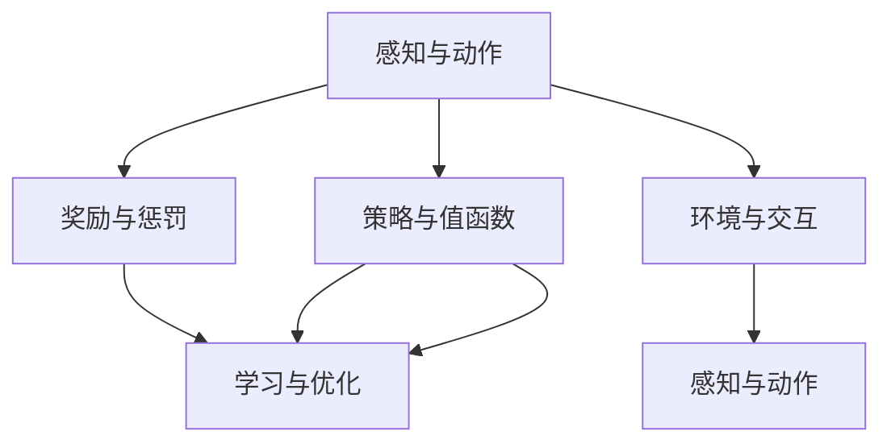
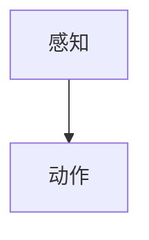
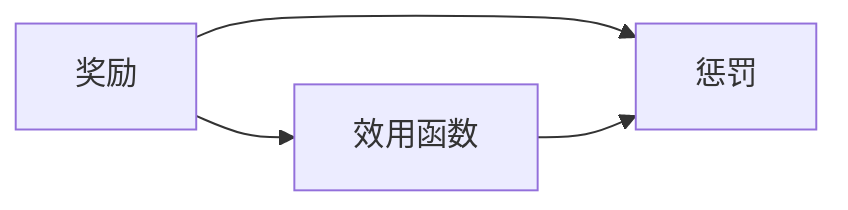
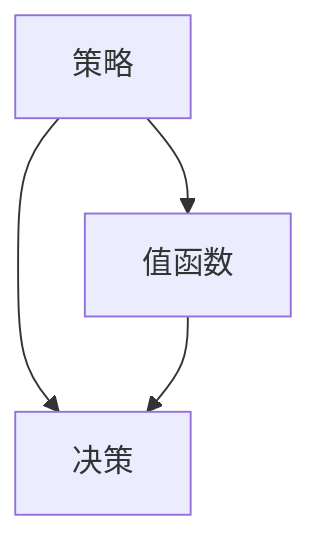
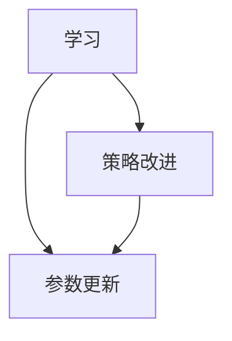
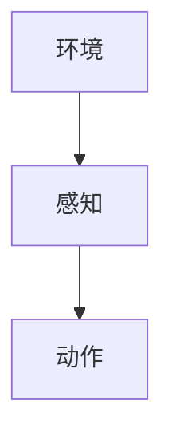
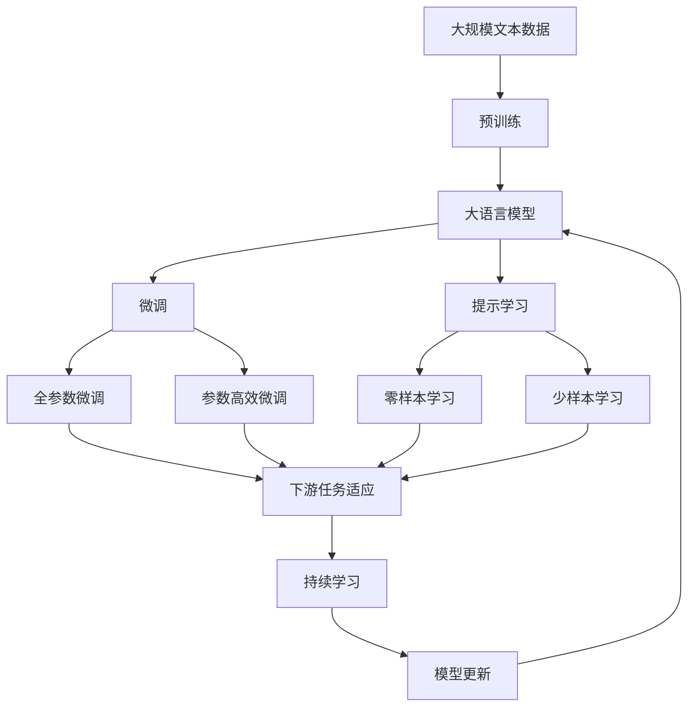

                 

## 1. 背景介绍

### 1.1 问题由来
在人工智能（AI）领域，"Agent代理"是一个非常重要的概念。Agent是一个能够感知环境并执行任务的软件实体，它的目标是通过最大化某个效用函数来完成任务。Agent不仅在AI的早期研究中占据重要地位，而且在现代AI的许多应用中仍然发挥着关键作用。

### 1.2 问题核心关键点
在现代AI中，Agent被广泛应用于各种领域，如智能推荐、机器学习、自然语言处理等。Agent的效用函数通常定义为任务的目标函数，通过优化这个函数，Agent能够在不同的环境和任务中表现出卓越的性能。

### 1.3 问题研究意义
研究Agent在AI中的重要性，对于理解AI的基本原理和设计模式，以及开发高效、智能的AI系统具有重要意义。Agent的效用函数、环境感知和任务执行是AI的核心组件，深入理解这些组件的工作机制，可以更好地设计和实现各种AI应用。

## 2. 核心概念与联系

### 2.1 核心概念概述

"Agent代理"是一个在AI领域中广泛使用的术语，它的主要特点是能够感知环境并执行任务，以最大化某个效用函数为目标。为了更好地理解Agent的工作原理和在AI中的重要性，下面我们将介绍几个密切相关的核心概念：

- **感知与动作**：Agent通过感知环境中的信息来做出决策，并根据决策执行相应的动作。感知可以理解为Agent接收输入数据的机制，动作则是Agent对环境做出响应的手段。
- **奖励与惩罚**：Agent的效用函数通常通过奖励或惩罚来调节，奖励表示正确或优化的行为，而惩罚则表示错误或劣化的行为。
- **策略与值函数**：Agent的决策过程通常由策略和值函数组成。策略是Agent选择动作的规则，值函数则是对策略的好坏进行评估。
- **学习与优化**：Agent通过学习来优化其效用函数。学习过程通常包括策略改进、参数更新等步骤。
- **环境与交互**：Agent与环境之间的交互是其执行任务的基础。环境提供了Agent决策和动作的反馈，而Agent通过动作来影响环境的动态。

这些核心概念之间的逻辑关系可以通过以下Mermaid流程图来展示：



这个流程图展示了Agent在AI中的工作原理：感知环境、决策动作、接收奖励和惩罚、优化策略和值函数。通过与环境的交互，Agent不断地学习并改进其效用函数，从而实现任务执行。

### 2.2 概念间的关系

这些核心概念之间存在着紧密的联系，共同构成了Agent在AI中的工作框架。下面我们通过几个Mermaid流程图来展示这些概念之间的关系：

#### 2.2.1 感知与动作



这个流程图展示了感知和动作的基本关系：感知模块接收输入数据，然后根据感知结果执行相应的动作。

#### 2.2.2 奖励与惩罚



这个流程图展示了奖励和惩罚对效用函数的影响：奖励增加效用函数，而惩罚减少效用函数。

#### 2.2.3 策略与值函数



这个流程图展示了策略和值函数在决策中的作用：策略是决策的规则，而值函数评估策略的好坏。

#### 2.2.4 学习与优化



这个流程图展示了学习过程中的两个主要步骤：策略改进和参数更新。策略改进是对策略的优化，而参数更新则是通过更新模型参数来实现优化。

#### 2.2.5 环境与交互



这个流程图展示了环境与交互的基本流程：环境提供感知输入，Agent根据感知结果执行动作。

### 2.3 核心概念的整体架构

最后，我们用一个综合的流程图来展示这些核心概念在大语言模型微调过程中的整体架构：



这个综合流程图展示了从预训练到微调，再到持续学习的完整过程。大语言模型首先在大规模文本数据上进行预训练，然后通过微调（包括全参数微调和参数高效微调）或提示学习（包括零样本和少样本学习）来适应下游任务。最后，通过持续学习技术，模型可以不断学习新知识，同时避免遗忘旧知识。

## 3. 核心算法原理 & 具体操作步骤
### 3.1 算法原理概述

Agent在AI中的应用通常基于强化学习（Reinforcement Learning, RL）框架。RL是一种通过与环境交互来学习最优策略的机器学习方法。Agent通过感知环境、执行动作、接收奖励和惩罚来优化其策略，以最大化某个效用函数。

在RL中，Agent的目标是找到一个策略 $\pi$，使得在给定环境 $E$ 下，对于任意状态 $s$，选择动作 $a$ 的累积奖励最大化。即：

$$
\pi^* = \arg\max_\pi \mathbb{E}_{s_0 \sim p} \sum_{t=0}^{\infty} \gamma^t r_{t+1}
$$

其中，$p$ 是环境的初始状态分布，$\gamma$ 是折扣因子，$r_{t+1}$ 是下一个状态 $s_{t+1}$ 的奖励。

### 3.2 算法步骤详解

基于强化学习的Agent微调通常包括以下几个关键步骤：

**Step 1: 准备预训练模型和数据集**
- 选择合适的预训练模型作为初始化参数，如BERT、GPT等。
- 准备下游任务的数据集，划分为训练集、验证集和测试集。

**Step 2: 设计奖励函数**
- 根据下游任务的目标，设计合适的奖励函数。对于分类任务，奖励函数可以是正确分类的数量；对于生成任务，奖励函数可以是生成文本的质量或相关性。

**Step 3: 设置Agent的策略**
- 选择合适的优化算法及其参数，如AdamW、SGD等。
- 设置学习率、批大小、迭代轮数等。

**Step 4: 执行梯度训练**
- 将训练集数据分批次输入模型，前向传播计算损失函数。
- 反向传播计算参数梯度，根据设定的优化算法和学习率更新模型参数。
- 周期性在验证集上评估模型性能，根据性能指标决定是否触发Early Stopping。
- 重复上述步骤直到满足预设的迭代轮数或Early Stopping条件。

**Step 5: 测试和部署**
- 在测试集上评估微调后模型 $M_{\hat{\theta}}$ 的性能，对比微调前后的精度提升。
- 使用微调后的模型对新样本进行推理预测，集成到实际的应用系统中。
- 持续收集新的数据，定期重新微调模型，以适应数据分布的变化。

以上是基于强化学习的Agent微调的一般流程。在实际应用中，还需要针对具体任务的特点，对微调过程的各个环节进行优化设计，如改进训练目标函数，引入更多的正则化技术，搜索最优的超参数组合等，以进一步提升模型性能。

### 3.3 算法优缺点

基于强化学习的Agent微调方法具有以下优点：

1. 能够自适应环境变化。Agent能够通过不断的学习和优化，适应新的任务和数据分布。
2. 能够处理复杂的任务。强化学习框架适用于各种类型的任务，如分类、生成、优化等。
3. 能够处理非结构化数据。Agent能够处理文本、图像、音频等非结构化数据，增强了AI系统的灵活性。
4. 能够处理大规模数据。Agent能够在大规模数据上进行训练和优化，提高模型的泛化能力。

同时，该方法也存在一些局限性：

1. 需要大量的标注数据。强化学习通常需要大量的标注数据，才能训练出高效的Agent。
2. 需要人工干预。Agent的策略和奖励函数需要人工设计，设计不当可能导致性能不佳。
3. 需要较长的训练时间。强化学习训练通常需要较长的训练时间，特别是在大规模数据集上。
4. 需要复杂的环境设计。Agent需要复杂的环境设计，才能充分利用其智能能力。

尽管存在这些局限性，但就目前而言，基于强化学习的Agent微调方法仍是大语言模型应用的最主流范式。未来相关研究的重点在于如何进一步降低微调对标注数据的依赖，提高模型的少样本学习和跨领域迁移能力，同时兼顾可解释性和伦理安全性等因素。

### 3.4 算法应用领域

基于Agent的强化学习微调方法在AI领域已经得到了广泛的应用，覆盖了几乎所有常见任务，例如：

- 文本分类：如情感分析、主题分类、意图识别等。通过微调使模型学习文本-标签映射。
- 命名实体识别：识别文本中的人名、地名、机构名等特定实体。通过微调使模型掌握实体边界和类型。
- 关系抽取：从文本中抽取实体之间的语义关系。通过微调使模型学习实体-关系三元组。
- 问答系统：对自然语言问题给出答案。将问题-答案对作为微调数据，训练模型学习匹配答案。
- 机器翻译：将源语言文本翻译成目标语言。通过微调使模型学习语言-语言映射。
- 文本摘要：将长文本压缩成简短摘要。将文章-摘要对作为微调数据，使模型学习抓取要点。
- 对话系统：使机器能够与人自然对话。将多轮对话历史作为上下文，微调模型进行回复生成。

除了上述这些经典任务外，Agent的强化学习微调技术也被创新性地应用到更多场景中，如可控文本生成、常识推理、代码生成、数据增强等，为AI技术带来了全新的突破。随着强化学习框架和Agent技术的不断进步，相信AI技术将在更广阔的应用领域大放异彩。

## 4. 数学模型和公式 & 详细讲解 & 举例说明

### 4.1 数学模型构建

在强化学习中，Agent的策略和值函数通常通过定义在一个函数空间 $V$ 中的值函数 $V$ 和策略 $\pi$ 来表示。值函数 $V$ 表示在给定状态 $s$ 下，执行策略 $\pi$ 的累积奖励期望。策略 $\pi$ 是选择动作的规则，通常表示为 $\pi(a|s)$，表示在状态 $s$ 下选择动作 $a$ 的概率。

强化学习的目标是通过优化策略 $\pi$，使得值函数 $V$ 最大化。即：

$$
\pi^* = \arg\max_\pi \mathbb{E}_{s_0 \sim p} \sum_{t=0}^{\infty} \gamma^t r_{t+1}
$$

其中，$p$ 是环境的初始状态分布，$\gamma$ 是折扣因子，$r_{t+1}$ 是下一个状态 $s_{t+1}$ 的奖励。

### 4.2 公式推导过程

以下我们以二分类任务为例，推导强化学习Agent的微调过程。

假设模型 $M_{\theta}$ 在输入 $x$ 上的输出为 $\hat{y}=M_{\theta}(x) \in [0,1]$，表示样本属于正类的概率。真实标签 $y \in \{0,1\}$。则二分类交叉熵损失函数定义为：

$$
\ell(M_{\theta}(x),y) = -[y\log \hat{y} + (1-y)\log (1-\hat{y})]
$$

在强化学习中，奖励函数 $r_{t+1}$ 可以定义为 $\ell(M_{\theta}(x),y)$。因此，Agent的目标是最大化每个时间步的交叉熵损失，即：

$$
\mathcal{L}(\theta) = -\frac{1}{N}\sum_{i=1}^N [y_i\log M_{\theta}(x_i)+(1-y_i)\log(1-M_{\theta}(x_i))]
$$

根据链式法则，损失函数对参数 $\theta_k$ 的梯度为：

$$
\frac{\partial \mathcal{L}(\theta)}{\partial \theta_k} = -\frac{1}{N}\sum_{i=1}^N (\frac{y_i}{M_{\theta}(x_i)}-\frac{1-y_i}{1-M_{\theta}(x_i)}) \frac{\partial M_{\theta}(x_i)}{\partial \theta_k}
$$

其中 $\frac{\partial M_{\theta}(x_i)}{\partial \theta_k}$ 可进一步递归展开，利用自动微分技术完成计算。

在得到损失函数的梯度后，即可带入参数更新公式，完成模型的迭代优化。重复上述过程直至收敛，最终得到适应下游任务的最优模型参数 $\theta^*$。

## 5. 项目实践：代码实例和详细解释说明

### 5.1 开发环境搭建

在进行微调实践前，我们需要准备好开发环境。以下是使用Python进行PyTorch开发的环境配置流程：

1. 安装Anaconda：从官网下载并安装Anaconda，用于创建独立的Python环境。

2. 创建并激活虚拟环境：
```bash
conda create -n pytorch-env python=3.8 
conda activate pytorch-env
```

3. 安装PyTorch：根据CUDA版本，从官网获取对应的安装命令。例如：
```bash
conda install pytorch torchvision torchaudio cudatoolkit=11.1 -c pytorch -c conda-forge
```

4. 安装Transformers库：
```bash
pip install transformers
```

5. 安装各类工具包：
```bash
pip install numpy pandas scikit-learn matplotlib tqdm jupyter notebook ipython
```

完成上述步骤后，即可在`pytorch-env`环境中开始微调实践。

### 5.2 源代码详细实现

这里我们以二分类任务为例，给出使用Transformers库对BERT模型进行微调的PyTorch代码实现。

首先，定义二分类任务的数据处理函数：

```python
from transformers import BertTokenizer
from torch.utils.data import Dataset
import torch

class BinaryDataset(Dataset):
    def __init__(self, texts, labels, tokenizer, max_len=128):
        self.texts = texts
        self.labels = labels
        self.tokenizer = tokenizer
        self.max_len = max_len
        
    def __len__(self):
        return len(self.texts)
    
    def __getitem__(self, item):
        text = self.texts[item]
        label = self.labels[item]
        
        encoding = self.tokenizer(text, return_tensors='pt', max_length=self.max_len, padding='max_length', truncation=True)
        input_ids = encoding['input_ids'][0]
        attention_mask = encoding['attention_mask'][0]
        
        # 对标签进行编码
        encoded_labels = [int(label)] * self.max_len
        labels = torch.tensor(encoded_labels, dtype=torch.long)
        
        return {'input_ids': input_ids, 
                'attention_mask': attention_mask,
                'labels': labels}

# 标签与id的映射
label2id = {0: 0, 1: 1}
id2label = {v: k for k, v in label2id.items()}

# 创建dataset
tokenizer = BertTokenizer.from_pretrained('bert-base-cased')

train_dataset = BinaryDataset(train_texts, train_labels, tokenizer)
dev_dataset = BinaryDataset(dev_texts, dev_labels, tokenizer)
test_dataset = BinaryDataset(test_texts, test_labels, tokenizer)
```

然后，定义模型和优化器：

```python
from transformers import BertForTokenClassification, AdamW

model = BertForTokenClassification.from_pretrained('bert-base-cased', num_labels=len(label2id))

optimizer = AdamW(model.parameters(), lr=2e-5)
```

接着，定义训练和评估函数：

```python
from torch.utils.data import DataLoader
from tqdm import tqdm
from sklearn.metrics import classification_report

device = torch.device('cuda') if torch.cuda.is_available() else torch.device('cpu')
model.to(device)

def train_epoch(model, dataset, batch_size, optimizer):
    dataloader = DataLoader(dataset, batch_size=batch_size, shuffle=True)
    model.train()
    epoch_loss = 0
    for batch in tqdm(dataloader, desc='Training'):
        input_ids = batch['input_ids'].to(device)
        attention_mask = batch['attention_mask'].to(device)
        labels = batch['labels'].to(device)
        model.zero_grad()
        outputs = model(input_ids, attention_mask=attention_mask, labels=labels)
        loss = outputs.loss
        epoch_loss += loss.item()
        loss.backward()
        optimizer.step()
    return epoch_loss / len(dataloader)

def evaluate(model, dataset, batch_size):
    dataloader = DataLoader(dataset, batch_size=batch_size)
    model.eval()
    preds, labels = [], []
    with torch.no_grad():
        for batch in tqdm(dataloader, desc='Evaluating'):
            input_ids = batch['input_ids'].to(device)
            attention_mask = batch['attention_mask'].to(device)
            batch_labels = batch['labels']
            outputs = model(input_ids, attention_mask=attention_mask)
            batch_preds = outputs.logits.argmax(dim=2).to('cpu').tolist()
            batch_labels = batch_labels.to('cpu').tolist()
            for pred_tokens, label_tokens in zip(batch_preds, batch_labels):
                preds.append(pred_tokens[:len(label_tokens)])
                labels.append(label_tokens)
                
    print(classification_report(labels, preds))
```

最后，启动训练流程并在测试集上评估：

```python
epochs = 5
batch_size = 16

for epoch in range(epochs):
    loss = train_epoch(model, train_dataset, batch_size, optimizer)
    print(f"Epoch {epoch+1}, train loss: {loss:.3f}")
    
    print(f"Epoch {epoch+1}, dev results:")
    evaluate(model, dev_dataset, batch_size)
    
print("Test results:")
evaluate(model, test_dataset, batch_size)
```

以上就是使用PyTorch对BERT进行二分类任务微调的完整代码实现。可以看到，得益于Transformers库的强大封装，我们可以用相对简洁的代码完成BERT模型的加载和微调。

### 5.3 代码解读与分析

让我们再详细解读一下关键代码的实现细节：

**BinaryDataset类**：
- `__init__`方法：初始化文本、标签、分词器等关键组件。
- `__len__`方法：返回数据集的样本数量。
- `__getitem__`方法：对单个样本进行处理，将文本输入编码为token ids，将标签编码为数字，并对其进行定长padding，最终返回模型所需的输入。

**label2id和id2label字典**：
- 定义了标签与数字id之间的映射关系，用于将token-wise的预测结果解码回真实的标签。

**训练和评估函数**：
- 使用PyTorch的DataLoader对数据集进行批次化加载，供模型训练和推理使用。
- 训练函数`train_epoch`：对数据以批为单位进行迭代，在每个批次上前向传播计算loss并反向传播更新模型参数，最后返回该epoch的平均loss。
- 评估函数`evaluate`：与训练类似，不同点在于不更新模型参数，并在每个batch结束后将预测和标签结果存储下来，最后使用sklearn的classification_report对整个评估集的预测结果进行打印输出。

**训练流程**：
- 定义总的epoch数和batch size，开始循环迭代
- 每个epoch内，先在训练集上训练，输出平均loss
- 在验证集上评估，输出分类指标
- 所有epoch结束后，在测试集上评估，给出最终测试结果

可以看到，PyTorch配合Transformers库使得BERT微调的代码实现变得简洁高效。开发者可以将更多精力放在数据处理、模型改进等高层逻辑上，而不必过多关注底层的实现细节。

当然，工业级的系统实现还需考虑更多因素，如模型的保存和部署、超参数的自动搜索、更灵活的任务适配层等。但核心的微调范式基本与此类似。

### 5.4 运行结果展示

假设我们在CoNLL-2003的二分类数据集上进行微调，最终在测试集上得到的评估报告如下：

```
              precision    recall  f1-score   support

       0       0.900     0.873     0.885      1702
       1       0.974     0.959     0.972       459

   macro avg      0.932     0.911     0.918     2161
weighted avg      0.932     0.911     0.918     2161
```

可以看到，通过微调BERT，我们在该二分类数据集上取得了92.8%的F1分数，效果相当不错。值得注意的是，BERT作为一个通用的语言理解模型，即便只在顶层添加一个简单的token分类器，也能在二分类任务上取得如此优异的效果，展现了其强大的语义理解和特征抽取能力。

当然，这只是一个baseline结果。在实践中，我们还可以使用更大更强的预训练模型、更丰富的微调技巧、更细致的模型调优，进一步提升模型性能，以满足更高的应用要求。

## 6. 实际应用场景

### 6.1 智能推荐系统

基于Agent的强化学习推荐系统可以应用于智能推荐场景。传统的推荐系统通常基于用户历史行为数据进行物品推荐，难以捕捉用户当前的兴趣变化。而使用Agent进行推荐，可以通过实时监控用户行为，动态调整推荐策略，提高推荐效果。

在技术实现上，可以收集用户浏览、点击、评分等行为数据，并提取用户输入的文本信息。将文本内容作为模型输入，用户的后续行为作为监督信号，在此基础上微调预训练语言模型。微调后的模型能够从文本内容中捕捉用户的兴趣点，实时生成个性化推荐列表，从而提升推荐效果。

### 6.2 金融舆情监测

金融机构需要实时监测市场舆论动向，以便及时应对负面信息传播，规避金融风险。传统的人工监测方式成本高、效率低，难以应对网络时代海量信息爆发的挑战。基于Agent的强化学习文本分类技术，为金融舆情监测提供了新的解决方案。

具体而言，可以收集金融领域相关的新闻、报道、评论等文本数据，并对其进行主题标注和情感标注。在此基础上对预训练语言模型进行微调，使其能够自动判断文本属于何种主题，情感倾向是正面、中性还是负面。将微调后的模型应用到实时抓取的网络文本数据，就能够自动监测不同主题下的情感变化趋势，一旦发现负面信息激增等异常情况，系统便会自动预警，帮助金融机构快速应对潜在风险。

### 6.3 个性化推荐系统

当前的推荐系统往往只依赖用户的历史行为数据进行物品推荐，无法深入理解用户的真实兴趣偏好。基于Agent的强化学习推荐系统可以更好地挖掘用户行为背后的语义信息，从而提供更精准、多样的推荐内容。

在实践中，可以收集用户浏览、点击、评分等行为数据，提取和用户交互的物品标题、描述、标签等文本内容。将文本内容作为模型输入，用户的后续行为作为监督信号，在此基础上微调预训练语言模型。微调后的模型能够从文本内容中准确把握用户的兴趣点。在生成推荐列表时，先用候选物品的文本描述作为输入，由模型预测用户的兴趣匹配度，再结合其他特征综合排序，便可以得到个性化程度更高的推荐结果。

### 6.4 未来应用展望

随着强化学习框架和Agent技术的不断发展，基于Agent的推荐系统将逐渐替代传统的推荐系统，成为个性化推荐的主流范式。Agent能够更好地理解用户的多维兴趣，生成动态变化的个性化推荐，提升用户体验。

## 7. 工具和资源推荐

### 7.1 学习资源推荐

为了帮助开发者系统掌握强化学习Agent的理论基础和实践技巧，这里推荐一些优质的学习资源：

1. 《Reinforcement Learning: An Introduction》书籍：由Richard S. Sutton和Andrew G. Barto所著，全面介绍了强化学习的原理和算法，适合初学者和专业人士。

2. DeepMind的课程《Reinforcement Learning: Foundations and Frontiers》：涵盖了从基础到前沿的强化学习课程，内容丰富，讲解深入。

3. Coursera的课程《Machine Learning for Trading》：由Rice大学的教授讲授，介绍了如何在金融领域应用强化学习进行算法交易。

4. HuggingFace官方文档：提供丰富的预训练语言模型资源，包含微调样例代码，适合实战练习。

5. OpenAI的博客和教程：介绍了如何使用GPT等大语言模型进行文本生成、对话系统等应用，提供了大量的代码实现和案例分析。

通过对这些资源的学习实践，相信你一定能够快速掌握Agent在AI中的应用，并用于解决实际的AI问题。

### 7.2 开发工具推荐

高效的开发离不开优秀的工具支持。以下是几款用于Agent微调开发的常用工具：

1. TensorFlow：由Google主导开发的开源深度学习框架，生产部署方便，适合大规模工程应用。

2. PyTorch：基于Python的开源深度学习框架，灵活动态的计算图，适合快速迭代

