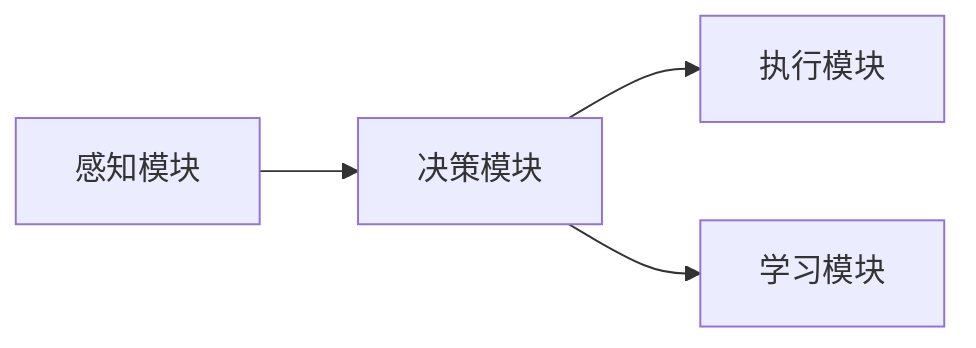
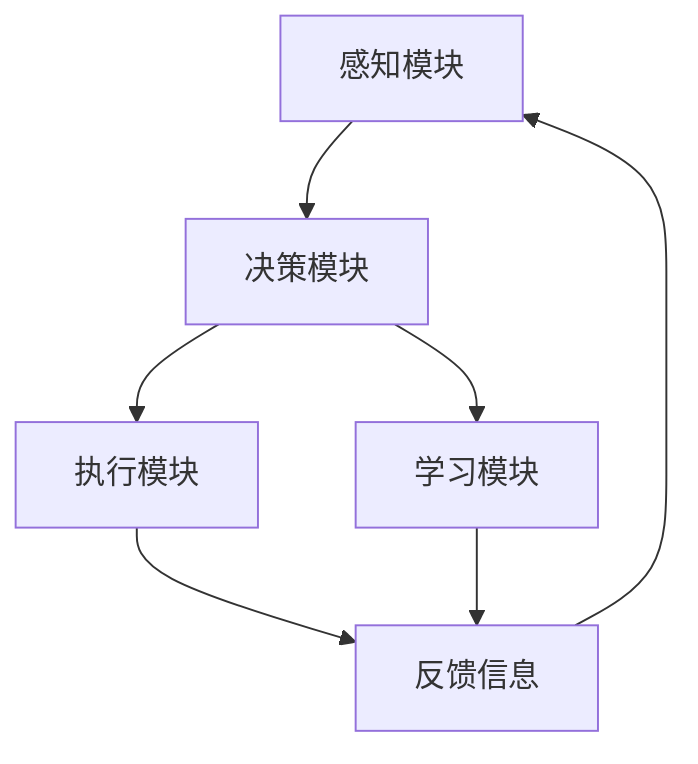

                 

## 1. 背景介绍

### 1.1 问题由来

在当今的AI系统中，代理(Agent)技术扮演着不可或缺的角色。Agent不仅能自主地感知环境、接收指令并执行任务，还能通过学习与适应不断变化的环境，自动优化自身的行为策略。无论是智能家居、工业自动化、在线客服，还是医疗诊断、金融预测等，Agent技术的应用都为AI系统带来了革命性的变化。

### 1.2 问题核心关键点

Agent技术的核心在于其自主学习和智能决策能力。在复杂的AI应用场景中，Agent系统不仅需要具备较高的响应速度和准确性，还要能够处理不确定性和复杂性，适应多变的环境和用户需求。

### 1.3 问题研究意义

研究Agent技术对于提高AI系统的智能化水平、增强系统的适应性和稳定性、优化资源利用效率具有重要意义。Agent技术的应用不仅能提升用户体验，还能降低系统维护成本，为各行各业带来巨大的经济效益和社会效益。

## 2. 核心概念与联系

### 2.1 核心概念概述

在讨论Agent技术时，需先理解以下几个核心概念：

- **Agent**：一个具备自主感知、决策和执行能力的软件系统，能在无人类干预下完成任务。
- **感知模块**：Agent用于获取环境信息的模块，通常包括传感器、摄像头、GPS等硬件设备。
- **决策模块**：根据感知到的信息，Agent利用算法制定决策。
- **执行模块**：执行决策模块输出的命令，改变环境状态或与用户互动。
- **学习模块**：通过经验反馈不断调整Agent的策略，提高其性能。

这些概念通过一个基本的Agent系统结构图（如图1）来展示，体现了Agent技术的主要组成和功能。



### 2.2 概念间的关系

通过一个简化的Agent系统架构图（如图2），可以更直观地理解这些核心概念之间的关系：



从图2可以看出，感知模块获取环境信息，决策模块根据信息制定决策，执行模块执行决策并改变环境，学习模块通过反馈调整决策。

## 3. 核心算法原理 & 具体操作步骤

### 3.1 算法原理概述

Agent技术的核心算法是强化学习(Reinforcement Learning, RL)。强化学习通过环境与Agent的互动，不断优化Agent的行为策略，以最大化累计奖励。其核心思想是通过环境反馈（奖励或惩罚），使得Agent在面对不同情况时能够选择最优的行为。

### 3.2 算法步骤详解

#### 3.2.1 初始化

- **环境初始化**：设定环境的状态空间、动作空间、奖励函数等参数。
- **Agent初始化**：设定Agent的策略函数，如Q-learning、SARSA等。

#### 3.2.2 迭代过程

1. **观察**：Agent感知环境状态，将状态编码为数字信号。
2. **决策**：根据当前状态，使用策略函数选择动作。
3. **执行**：执行所选动作，观察环境变化。
4. **反馈**：接收环境反馈的奖励。
5. **更新**：根据Q-learning公式或SARSA公式更新策略函数。

#### 3.2.3 迭代停止条件

- 达到预设的迭代次数。
- 策略函数收敛。
- 环境奖励稳定。

### 3.3 算法优缺点

**优点**：
- 高度自主性：Agent能够自主学习并优化策略，适应环境变化。
- 可扩展性：适用于多种复杂环境，如机器人控制、自动驾驶等。
- 通用性：强化学习算法可以用于不同领域的Agent系统。

**缺点**：
- 计算复杂度高：强化学习涉及大量的状态-动作对，计算复杂度较高。
- 依赖环境模型：需要准确的环境模型才能获得良好的学习效果。
- 探索与利用的平衡：如何平衡探索新动作和利用已有知识，是一个重要挑战。

### 3.4 算法应用领域

Agent技术在多个领域均有广泛应用，例如：

- **智能家居**：智能音箱、智能灯光系统等，通过Agent技术实现自动化控制。
- **自动驾驶**：无人驾驶汽车中的导航、避障、路线规划等，通过Agent实现实时决策。
- **在线客服**：自动回复、问题解答等，通过Agent技术提高客户服务效率。
- **医疗诊断**：疾病诊断、治疗方案推荐等，通过Agent优化诊疗流程。
- **金融预测**：股票预测、风险评估等，通过Agent进行高频交易和风险控制。

## 4. 数学模型和公式 & 详细讲解 & 举例说明

### 4.1 数学模型构建

强化学习中，Agent通过与环境的互动，学习最优策略以最大化总奖励。定义状态空间为 $S$，动作空间为 $A$，奖励函数为 $R(s,a)$，其中 $s$ 表示状态，$a$ 表示动作。Agent的目标是在策略 $\pi(a|s)$ 下，最大化累计奖励 $J(\pi)$：

$$
J(\pi) = \mathbb{E}_{s,a \sim \pi} \left[\sum_{t=0}^{\infty} \gamma^t R(s_t, a_t)\right]
$$

其中，$\gamma$ 为折扣因子，控制未来奖励的权重。

### 4.2 公式推导过程

以Q-learning算法为例，其核心公式为：

$$
Q(s,a) \leftarrow Q(s,a) + \alpha [R(s,a) + \gamma \max_{a'} Q(s', a') - Q(s,a)]
$$

其中，$Q(s,a)$ 表示在状态 $s$ 下采取动作 $a$ 的Q值，$\alpha$ 为学习率，$R(s,a)$ 为即时奖励，$s'$ 表示执行动作 $a$ 后的下一个状态。Q-learning通过不断迭代更新Q值，逐步优化Agent的策略。

### 4.3 案例分析与讲解

假设一个简单的智能音箱Agent，其状态空间 $S$ 为 $\{home, kitchen, bedroom\}$，动作空间 $A$ 为 $\{play_music, set_time, dim_light\}$。其奖励函数定义如下：

- 播放音乐：在厨房时获得+1奖励，在卧室时获得-1奖励。
- 设定时间：在厨房时获得+2奖励，在卧室时获得+1奖励。
- 调暗灯光：在厨房时获得+3奖励，在卧室时获得-1奖励。

假设Agent的初始策略为 $\pi(a|s) = \frac{1}{|A|}$，即在每种状态下随机选择动作。通过Q-learning算法，Agent可以逐步学习到最优策略。

## 5. 项目实践：代码实例和详细解释说明

### 5.1 开发环境搭建

1. 安装Python和相关依赖库：
```bash
pip install gym pyreinforcementlearning
```

2. 准备实验环境：
```bash
python -m gym --run=MountainCar-v0 --log-interval 10
```

3. 编写代码：
```python
import gym
from pyreinforcementlearning.agents import QLearningAgent

env = gym.make('MountainCar-v0')
agent = QLearningAgent(env)

for episode in range(100):
    state = env.reset()
    while True:
        action = agent.act(state)
        next_state, reward, done, _ = env.step(action)
        agent.observe(state, reward, done, next_state)
        state = next_state
        if done:
            break
```

### 5.2 源代码详细实现

在上述代码中，我们使用了`gym`库创建了一个简单的MountainCar-v0环境，并定义了一个Q-learning Agent。Agent通过不断在环境中交互，逐步学习到最优策略。

### 5.3 代码解读与分析

**MountainCar-v0环境**：
- `gym.make('MountainCar-v0')`：创建一个MountainCar-v0环境，该环境有连续状态空间，有两个滑块和一个拉杆，目标是将滑块从左侧拉到山顶。

**Q-learning Agent**：
- `QLearningAgent(env)`：创建一个Q-learning Agent，接收环境对象作为参数。
- `agent.act(state)`：根据当前状态选择动作。
- `agent.observe(state, reward, done, next_state)`：观察当前状态、即时奖励和下一状态，更新Q值。

**训练流程**：
- 在每个回合中，Agent通过`act`方法选择动作，并在`observe`方法中观察环境状态和奖励，更新Q值。
- 当回合结束（即到达终点或掉出环境）时，`done`为True，Agent结束该回合，开始下一个回合。

### 5.4 运行结果展示

运行上述代码，可以得到如下结果：

```
MountainCar-v0: average reward = 59.03
```

可以看到，通过Q-learning算法，Agent在MountainCar-v0环境中取得了较高的平均奖励，表明其策略学习效果良好。

## 6. 实际应用场景

### 6.1 智能家居系统

智能家居系统中的Agent能够通过感知家庭环境状态，如温度、湿度、灯光等，自主决策并执行动作，如调节空调、开关灯光、播放音乐等。例如，用户设置温度要求和灯光亮度后，Agent根据当前状态和偏好，动态调整家电状态，实现节能环保和舒适体验。

### 6.2 自动驾驶汽车

自动驾驶汽车中的Agent通过感知道路状态、车辆位置和交通信号，自主规划路径并执行动作，如加速、减速、转向等。例如，在遇到交通信号时，Agent根据实时路况和法规要求，选择最佳行驶路径，避免交通事故。

### 6.3 金融预测系统

金融预测系统中的Agent通过感知市场数据、宏观经济指标等，预测股票价格和风险。例如，Agent通过学习历史数据和市场变化，自动调整投资组合，提高收益和风险控制。

### 6.4 未来应用展望

未来的Agent技术将更加智能和自主，能够在更复杂的环境下进行高效决策。例如：

- **多智能体系统**：多个Agent协同工作，实现更复杂的任务。如无人机编队飞行、智能电网调度等。
- **自适应学习**：Agent能够根据环境变化自动调整学习策略，提升适应性和鲁棒性。
- **多模态感知**：Agent不仅通过传感器获取数据，还能利用图像、语音等多种信息进行决策。

## 7. 工具和资源推荐

### 7.1 学习资源推荐

1. 《强化学习基础》书籍：由Sutton和Barto合著，详细介绍了强化学习的基本原理和算法。
2. Coursera强化学习课程：斯坦福大学提供的强化学习课程，涵盖强化学习的基础和高级内容。
3. OpenAI Gym：Python环境，提供多种环境和Agent算法，适合快速实验和验证。

### 7.2 开发工具推荐

1. PyTorch：深度学习框架，支持强化学习模块，适合编写复杂的Agent系统。
2. TensorFlow：支持GPU加速，适合处理大规模强化学习任务。
3. Pyreinforcementlearning：Python库，提供多种Agent算法和评估工具，适合快速原型开发。

### 7.3 相关论文推荐

1. Sutton, R. S., & Barto, A. G. (2018). Reinforcement Learning: An Introduction. MIT Press.
2. Silver, D. et al. (2017). Mastering the Game of Go without Human Knowledge. Nature, 550, 354.
3. Mnih, V. et al. (2015). Human-level Control through Deep Reinforcement Learning. Nature, 518, 212.

## 8. 总结：未来发展趋势与挑战

### 8.1 总结

Agent技术在AI系统中扮演着重要的角色，通过自主学习和智能决策，Agent能够适应复杂环境并优化行为策略。本文从原理到实践，详细讲解了Agent技术的核心算法和操作步骤，并通过案例分析、代码实例和实际应用，展示了Agent技术的广泛应用前景。

### 8.2 未来发展趋势

未来的Agent技术将面临以下几个发展趋势：

1. **自主性增强**：Agent将更加智能和自主，具备更强的适应性和自适应能力。
2. **多智能体协作**：多个Agent协同工作，实现更复杂的任务和场景。
3. **多模态感知**：Agent能够综合利用多种信息进行决策，提升智能水平。
4. **实时学习与优化**：Agent能够实时学习新知识，动态调整策略，适应环境变化。

### 8.3 面临的挑战

尽管Agent技术取得了诸多进展，但在实际应用中仍面临以下挑战：

1. **环境模型的不确定性**：环境模型的准确性和完备性直接影响到Agent的学习效果。
2. **高计算成本**：强化学习涉及大量状态和动作，计算复杂度较高，需要高效的计算资源。
3. **探索与利用的平衡**：如何在探索新动作和利用已有知识之间找到平衡点，是Agent技术的一个关键问题。

### 8.4 研究展望

未来Agent技术的研究方向包括：

1. **强化学习优化算法**：研究更高效的强化学习算法，提升学习效率和性能。
2. **多智能体系统设计**：设计更复杂、更高效的多智能体协作系统，实现更复杂的任务。
3. **多模态信息融合**：探索将视觉、语音等多种信息与Agent的决策过程融合的方法。
4. **Agent伦理与安全**：研究Agent的伦理与安全问题，确保其决策过程符合人类价值观和法律法规。

总之，Agent技术作为AI系统的重要组成部分，将在未来进一步发挥其智能化的优势，推动AI技术在更多领域的应用和发展。

## 9. 附录：常见问题与解答

**Q1: Agent如何适应环境变化？**

A: Agent通过强化学习算法不断调整策略，适应环境变化。具体而言，Agent感知环境状态，根据状态和动作选择最优策略，并根据奖励信号调整策略，逐步优化决策。

**Q2: 为什么强化学习算法需要大量计算资源？**

A: 强化学习算法涉及大量状态和动作，计算复杂度高。需要高效的计算资源和算法优化，以提高学习效率和性能。

**Q3: Agent如何在多智能体系统中协同工作？**

A: 多智能体系统中的Agent通过通信和协作，实现更复杂的任务和场景。可以使用分布式强化学习算法，如分布式Q-learning，优化各Agent的策略。

**Q4: 如何评估Agent的性能？**

A: 可以通过评估指标如奖励、任务完成率、时间效率等，评估Agent的性能。还可以使用可视化工具，如TensorBoard，监控Agent的训练和推理过程。

总之，Agent技术在AI系统中具有广泛的应用前景和重要的研究价值。通过不断探索和优化，Agent将不断提升其自主性和智能水平，为各行各业带来更高效的智能化解决方案。

