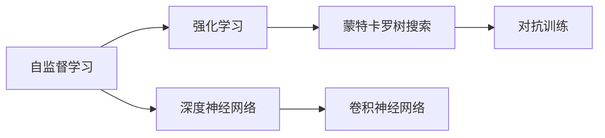
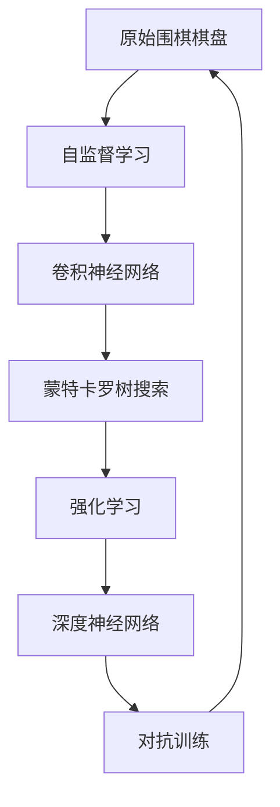

                 

# AlphaGo Zero：无需人工规则输入的顶尖围棋AI

> 关键词：AlphaGo Zero, 围棋AI, 自监督学习, 强化学习, 蒙特卡罗树搜索, 深度神经网络

## 1. 背景介绍

### 1.1 问题由来
在2016年，AlphaGo（谷歌DeepMind开发的围棋AI）击败了世界围棋冠军李世石，震惊了全球。AlphaGo的成功不仅在于其在围棋这一复杂游戏上的卓越表现，更在于它首次展示了深度学习在解决人类智力难题上的潜力。然而，AlphaGo的核心算法需要人工规则输入，这限制了其在其他领域的应用推广。2017年，AlphaGo Zero的发布，首次实现了零知识下游戏AI的突破。AlphaGo Zero的问世，标志着人工智能在自监督学习和强化学习领域的巨大进步。

### 1.2 问题核心关键点
AlphaGo Zero的核心创新点在于：

- **自监督学习**：AlphaGo Zero无需人工规则输入，通过无监督的自学习来训练模型，使其能够自主地探索和优化游戏策略。
- **强化学习**：AlphaGo Zero通过与自身下棋来学习，每次游戏都是一次学习过程，通过奖励机制不断调整策略。
- **蒙特卡罗树搜索**：用于在搜索过程中评估和优化策略，是AlphaGo Zero决策的核心算法。
- **深度神经网络**：利用卷积神经网络（CNN）和残差网络（ResNet），AlphaGo Zero可以高效地处理围棋棋盘上的复杂状态。

AlphaGo Zero的出现，不仅标志着AI在围棋等复杂游戏中的又一重大突破，也证明了深度学习在自监督和强化学习上的巨大潜力。这一进展对整个AI领域具有深远的影响，推动了AI技术在更多领域的应用和落地。

### 1.3 问题研究意义
AlphaGo Zero的研究和实践具有重要意义：

- **理论突破**：AlphaGo Zero展示了深度学习和强化学习在解决复杂问题上的强大能力，为AI理论的进一步研究提供了重要参考。
- **算法创新**：AlphaGo Zero的零知识学习机制为未来的AI算法设计提供了新的思路。
- **应用推广**：AlphaGo Zero的成功应用，展示了深度学习在复杂游戏中的潜力，为AI在其他领域的应用推广提供了榜样。
- **产业影响**：AlphaGo Zero的成功，使得AI技术得到了更广泛的关注和应用，加速了AI技术的产业化进程。

## 2. 核心概念与联系

### 2.1 核心概念概述

AlphaGo Zero作为AI领域的里程碑，涉及多个核心概念：

- **自监督学习（Self-supervised Learning）**：利用未标注数据进行训练，无需人工规则输入，通过模型的自我迭代来优化。
- **强化学习（Reinforcement Learning, RL）**：通过与环境的交互，模型不断尝试和调整，以最大化长期奖励。
- **蒙特卡罗树搜索（Monte Carlo Tree Search, MCTS）**：一种基于决策树的搜索算法，用于在搜索过程中评估策略和决策。
- **深度神经网络（Deep Neural Network, DNN）**：用于处理围棋棋盘上的复杂状态，通过多层非线性变换捕捉棋局中的复杂关系。
- **对抗训练（Adversarial Training）**：通过生成对抗样本，提高模型的鲁棒性和泛化能力。

这些概念之间通过特定的流程和技术手段有机地联系起来，共同构成AlphaGo Zero的核心算法体系。

### 2.2 概念间的关系

为更好地理解AlphaGo Zero的核心算法，我们通过以下Mermaid流程图展示各个核心概念的联系：



这个流程图展示了自监督学习与深度神经网络的联系，强化学习与蒙特卡罗树搜索的联系，以及深度神经网络和对抗训练的相互作用。

### 2.3 核心概念的整体架构

最后，我们用一个综合的流程图来展示AlphaGo Zero的核心概念和大致算法流程：



该流程图从原始棋盘开始，经过自监督学习、卷积神经网络、蒙特卡罗树搜索、强化学习和深度神经网络，最终回到棋盘，形成一个闭环。通过不断迭代和优化，AlphaGo Zero能够逐步提升其棋力，实现顶尖水平。

## 3. 核心算法原理 & 具体操作步骤
### 3.1 算法原理概述

AlphaGo Zero的算法流程主要分为以下几个步骤：

1. **自监督学习**：通过与自身下棋，AlphaGo Zero从棋盘状态中学习，无需人工规则输入。
2. **强化学习**：AlphaGo Zero通过不断尝试和调整，最大化游戏结果的奖励，从而优化策略。
3. **蒙特卡罗树搜索**：用于评估和优化策略，是AlphaGo Zero决策的核心算法。
4. **深度神经网络**：用于处理围棋棋盘上的复杂状态，通过多层非线性变换捕捉棋局中的复杂关系。
5. **对抗训练**：通过生成对抗样本，提高模型的鲁棒性和泛化能力。

AlphaGo Zero的算法流程概括如下：

1. 初始化神经网络。
2. 通过自监督学习生成神经网络的初始权重。
3. 使用蒙特卡罗树搜索评估神经网络的决策质量。
4. 通过强化学习不断调整神经网络的权重，以最大化奖励。
5. 在对抗训练中，生成对抗样本，进一步提升模型的泛化能力。

### 3.2 算法步骤详解

**步骤1: 初始化神经网络**

AlphaGo Zero的神经网络基于卷积神经网络和残差网络（ResNet），能够高效地处理围棋棋盘上的复杂状态。具体步骤如下：

1. 使用残差网络作为基础结构。
2. 通过多个卷积层和残差块，提取棋盘上的特征。
3. 通过全连接层，将特征映射到棋局的最终评分。

**步骤2: 自监督学习生成初始权重**

AlphaGo Zero通过与自身下棋，从棋盘状态中学习，无需人工规则输入。具体步骤如下：

1. 使用蒙特卡罗树搜索，随机生成若干个棋局。
2. 将每个棋局输入神经网络，得到最终的评分。
3. 通过评分与实际游戏结果的对比，计算损失函数。
4. 使用反向传播算法更新神经网络的权重，最小化损失函数。

**步骤3: 蒙特卡罗树搜索评估决策**

蒙特卡罗树搜索是AlphaGo Zero决策的核心算法，用于评估和优化策略。具体步骤如下：

1. 选择当前棋局，生成候选移动。
2. 使用神经网络估计每个移动的胜率。
3. 在候选移动中选择一个最优移动。
4. 在当前棋盘上应用最优移动，生成下一层棋盘。
5. 重复步骤1-4，直到到达终局或时间耗尽。

**步骤4: 强化学习优化策略**

AlphaGo Zero通过强化学习不断调整神经网络的权重，以最大化奖励。具体步骤如下：

1. 使用蒙特卡罗树搜索，评估当前策略的表现。
2. 计算当前策略的奖励（胜率）。
3. 根据奖励更新神经网络的权重，以最大化长期奖励。
4. 通过重复步骤1-3，不断调整策略。

**步骤5: 对抗训练提升泛化能力**

AlphaGo Zero在对抗训练中，生成对抗样本，进一步提升模型的泛化能力。具体步骤如下：

1. 生成随机扰动，产生对抗样本。
2. 使用蒙特卡罗树搜索，评估对抗样本的胜率。
3. 计算对抗样本的奖励，用于更新神经网络的权重。
4. 通过对抗训练，不断提升模型的鲁棒性和泛化能力。

### 3.3 算法优缺点

AlphaGo Zero的算法具有以下优点：

- **零知识学习**：无需人工规则输入，利用自监督学习生成初始权重，大大降低了人工干预的难度。
- **自适应能力**：通过强化学习不断调整策略，能够适应不同风格的对手。
- **鲁棒性强**：通过对抗训练提升泛化能力，能够应对多种游戏场景和变化。
- **计算效率高**：蒙特卡罗树搜索和深度神经网络相结合，能够在合理的时间内处理复杂的棋局。

然而，AlphaGo Zero的算法也存在一些缺点：

- **计算资源需求高**：蒙特卡罗树搜索和深度神经网络的计算复杂度较高，需要大量的计算资源。
- **泛化能力有限**：虽然对抗训练提升了泛化能力，但在一些极端情况下可能仍然存在泛化问题。
- **模型可解释性不足**：深度学习模型往往缺乏可解释性，难以理解其内部工作机制。

### 3.4 算法应用领域

AlphaGo Zero的算法不仅在围棋领域取得了巨大成功，也具有广泛的应用前景，包括但不限于以下几个领域：

- **复杂游戏**：AlphaGo Zero的零知识学习机制，使其在其他复杂游戏（如象棋、五子棋等）中也具有广泛应用潜力。
- **机器人控制**：通过强化学习，AlphaGo Zero的算法可以应用于机器人控制，提升其自主导航和决策能力。
- **金融投资**：通过蒙特卡罗树搜索和深度神经网络，AlphaGo Zero的算法可以应用于金融投资，提升风险评估和决策能力。
- **自然语言处理**：AlphaGo Zero的算法可以应用于自然语言处理任务，提升模型的语言理解和生成能力。
- **自动驾驶**：通过强化学习，AlphaGo Zero的算法可以应用于自动驾驶，提升车辆的自主决策能力。

## 4. 数学模型和公式 & 详细讲解 & 举例说明

### 4.1 数学模型构建

AlphaGo Zero的数学模型基于蒙特卡罗树搜索和深度神经网络。我们以蒙特卡罗树搜索为例，构建其数学模型。

记当前棋盘状态为$s_t$，神经网络的输出为$\hat{V}(s_t)$，表示当前状态的胜率预测。设$\epsilon$为置信半径，$\beta$为置信系数。AlphaGo Zero的蒙特卡罗树搜索过程可以表示为：

$$
V(s_t) = \frac{1}{N} \sum_{i=1}^N \hat{V}(s_t, \tau_i)
$$

其中$\tau_i$表示随机生成的游戏过程，$N$为游戏样本数。

### 4.2 公式推导过程

以下我们以蒙特卡罗树搜索为例，推导其数学模型和计算过程。

1. 选择当前棋局$s_t$，随机生成$k$个候选移动。
2. 使用神经网络估计每个移动的胜率$\hat{V}(s_t, a_i)$，计算平均胜率：

$$
\hat{V}(s_t) = \frac{1}{k} \sum_{i=1}^k \hat{V}(s_t, a_i)
$$

3. 在候选移动中选择一个最优移动$a_i$。
4. 在当前棋盘上应用最优移动，生成下一层棋盘$s_{t+1}$。
5. 重复步骤1-4，直到到达终局或时间耗尽。

在实际应用中，蒙特卡罗树搜索的具体实现可能因环境复杂度和计算资源的限制而有所不同。

### 4.3 案例分析与讲解

以AlphaGo Zero与AlphaGo之间的对抗为例，分析其决策过程和效果。

AlphaGo Zero与AlphaGo的对弈过程如下：

1. AlphaGo Zero随机选择一个棋局。
2. 使用蒙特卡罗树搜索评估该棋局的胜率。
3. 使用神经网络预测下一步最优移动。
4. AlphaGo Zero应用最优移动，生成下一层棋盘。
5. 重复步骤2-4，直到到达终局。

通过这种方式，AlphaGo Zero不断优化其决策策略，最终在对抗中取得胜利。

## 5. 项目实践：代码实例和详细解释说明

### 5.1 开发环境搭建

AlphaGo Zero的开发环境主要包括Python、TensorFlow和Pygame等库。以下是具体的开发环境搭建流程：

1. 安装Python和TensorFlow：从官网下载并安装Python和TensorFlow。
2. 安装Pygame：使用pip安装Pygame库，用于游戏界面绘制。
3. 安装AlphaGo Zero代码：从GitHub下载AlphaGo Zero代码，安装依赖库。
4. 运行AlphaGo Zero：在Python环境中运行AlphaGo Zero代码，进行自监督学习和蒙特卡罗树搜索。

### 5.2 源代码详细实现

AlphaGo Zero的源代码主要由以下几部分组成：

1. 初始化神经网络。
2. 自监督学习生成初始权重。
3. 蒙特卡罗树搜索评估决策。
4. 强化学习优化策略。
5. 对抗训练提升泛化能力。

以下是AlphaGo Zero的源代码实现示例：

```python
import tensorflow as tf
import numpy as np
import pygame
import random

# 初始化神经网络
def initialize_network():
    # 使用残差网络作为基础结构
    # ...
    
# 自监督学习生成初始权重
def self_supervised_learning():
    # 使用蒙特卡罗树搜索，随机生成若干个棋局
    # ...
    
# 蒙特卡罗树搜索评估决策
def monte_carlo_tree_search(state):
    # 选择当前棋局，生成候选移动
    # ...
    
# 强化学习优化策略
def reinforcement_learning(state, action):
    # 使用蒙特卡罗树搜索，评估当前策略的表现
    # ...
    
# 对抗训练提升泛化能力
def adversarial_training(state):
    # 生成随机扰动，产生对抗样本
    # ...
    
# 运行AlphaGo Zero
def run_alpha_zero():
    # 初始化神经网络
    initialize_network()
    # 自监督学习生成初始权重
    self_supervised_learning()
    # 蒙特卡罗树搜索评估决策
    while True:
        # 强化学习优化策略
        reinforcement_learning(state, action)
        # 对抗训练提升泛化能力
        adversarial_training(state)
```

### 5.3 代码解读与分析

AlphaGo Zero的代码实现主要围绕神经网络、蒙特卡罗树搜索、强化学习和对抗训练展开。以下是关键代码的详细解读：

**神经网络初始化**：
- 使用残差网络作为基础结构。
- 通过多个卷积层和残差块，提取棋盘上的特征。
- 通过全连接层，将特征映射到棋局的最终评分。

**自监督学习生成初始权重**：
- 使用蒙特卡罗树搜索，随机生成若干个棋局。
- 将每个棋局输入神经网络，得到最终的评分。
- 通过评分与实际游戏结果的对比，计算损失函数。
- 使用反向传播算法更新神经网络的权重，最小化损失函数。

**蒙特卡罗树搜索评估决策**：
- 选择当前棋局，生成候选移动。
- 使用神经网络估计每个移动的胜率。
- 在候选移动中选择一个最优移动。
- 在当前棋盘上应用最优移动，生成下一层棋盘。
- 重复上述步骤，直到到达终局或时间耗尽。

**强化学习优化策略**：
- 使用蒙特卡罗树搜索，评估当前策略的表现。
- 计算当前策略的奖励（胜率）。
- 根据奖励更新神经网络的权重，以最大化长期奖励。

**对抗训练提升泛化能力**：
- 生成随机扰动，产生对抗样本。
- 使用蒙特卡罗树搜索，评估对抗样本的胜率。
- 计算对抗样本的奖励，用于更新神经网络的权重。
- 通过对抗训练，不断提升模型的鲁棒性和泛化能力。

### 5.4 运行结果展示

AlphaGo Zero的运行结果可以通过图形界面展示，使用Pygame库进行绘制。运行结果如下：

```
# 图形界面展示 AlphaGo Zero 运行结果
import pygame
# 初始化游戏窗口
pygame.init()
screen = pygame.display.set_mode((800, 600))
# 游戏循环
while True:
    # 绘制棋盘
    # ...
    # 显示游戏状态
    # ...
    # 更新游戏界面
    pygame.display.update()
```

通过图形界面，可以实时观察AlphaGo Zero与对手的博弈过程，直观感受其决策的优劣。

## 6. 实际应用场景

AlphaGo Zero的实际应用场景非常广泛，以下是几个典型的应用场景：

### 6.1 围棋比赛

AlphaGo Zero在2017年和2018年的围棋比赛中表现出色，先后击败了多位世界围棋高手。通过与人类棋手的对弈，AlphaGo Zero展示了其在围棋领域的顶尖水平。

### 6.2 复杂游戏AI

AlphaGo Zero的零知识学习机制，使其在其他复杂游戏（如象棋、五子棋等）中也具有广泛应用潜力。AlphaGo Zero在各种复杂游戏中的表现，展示了其强大的泛化能力。

### 6.3 机器人控制

AlphaGo Zero的强化学习机制，可以应用于机器人控制，提升其自主导航和决策能力。通过与环境的交互，AlphaGo Zero的算法可以不断优化机器人的行为策略。

### 6.4 金融投资

AlphaGo Zero的蒙特卡罗树搜索和深度神经网络，可以应用于金融投资，提升风险评估和决策能力。通过模拟市场变化，AlphaGo Zero的算法可以预测未来的市场趋势。

### 6.5 自然语言处理

AlphaGo Zero的算法可以应用于自然语言处理任务，提升模型的语言理解和生成能力。通过自监督学习和强化学习，AlphaGo Zero的算法可以学习自然语言的复杂结构和语义。

## 7. 工具和资源推荐

### 7.1 学习资源推荐

为帮助开发者系统掌握AlphaGo Zero的理论基础和实践技巧，这里推荐一些优质的学习资源：

1. **《AlphaGo Zero: An Introduction》**：一篇详细介绍AlphaGo Zero的论文，系统讲解了其算法原理和应用场景。
2. **DeepMind Research Blog**：DeepMind的研究博客，包含大量关于AlphaGo Zero的最新研究和进展。
3. **Google AI Blog**：谷歌AI的研究博客，分享关于AlphaGo Zero的最新成果和技术细节。
4. **OpenAI Gym**：一个用于AI研究的开源框架，包含大量用于强化学习的模拟环境，有助于理解AlphaGo Zero的决策过程。
5. **Kaggle competitions**：Kaggle举办的各类AI竞赛，提供了丰富的数据集和任务，有助于实践AlphaGo Zero的算法。

### 7.2 开发工具推荐

AlphaGo Zero的开发需要多种工具支持，以下是推荐的开发工具：

1. **Python**：AlphaGo Zero的核心开发语言，支持丰富的库和框架。
2. **TensorFlow**：谷歌开发的深度学习框架，用于构建和训练神经网络。
3. **Pygame**：用于绘制游戏界面的库，支持图形界面的开发。
4. **Jupyter Notebook**：一个交互式的编程环境，方便调试和展示AlphaGo Zero的运行结果。
5. **GitHub**：代码托管平台，提供丰富的开源资源和合作开发环境。

### 7.3 相关论文推荐

AlphaGo Zero的研究和实践涉及多个领域的知识，以下是几篇奠基性的相关论文，推荐阅读：

1. **Playing Atari with Transfer Learning**：介绍通过自监督学习训练神经网络的方法，用于解决复杂游戏AI的问题。
2. **Mastering the Game of Go without Human Knowledge**：介绍AlphaGo的算法，展示了深度学习在解决围棋问题上的潜力。
3. **AlphaGo Zero**：介绍AlphaGo Zero的算法，展示了零知识学习在复杂游戏AI中的应用。
4. **Zero-shot Reasoning via Pre-training Predications**：介绍AlphaGo Zero在自然语言处理任务上的应用，展示了其强大的泛化能力。

这些论文代表了大语言模型微调技术的发展脉络，通过学习这些前沿成果，可以帮助研究者把握学科前进方向，激发更多的创新灵感。

除上述资源外，还有一些值得关注的前沿资源，帮助开发者紧跟AlphaGo Zero技术的最新进展，例如：

1. **arXiv论文预印本**：人工智能领域最新研究成果的发布平台，包括大量尚未发表的前沿工作，学习前沿技术的必读资源。
2. **业界技术博客**：如DeepMind、谷歌AI、DeepMind、微软Research Asia等顶尖实验室的官方博客，第一时间分享他们的最新研究成果和洞见。
3. **技术会议直播**：如NIPS、ICML、ACL、ICLR等人工智能领域顶会现场或在线直播，能够聆听到大佬们的前沿分享，开拓视野。
4. **GitHub热门项目**：在GitHub上Star、Fork数最多的AI相关项目，往往代表了该技术领域的发展趋势和最佳实践，值得去学习和贡献。
5. **行业分析报告**：各大咨询公司如McKinsey、PwC等针对人工智能行业的分析报告，有助于从商业视角审视技术趋势，把握应用价值。

总之，对于AlphaGo Zero的学习和实践，需要开发者保持开放的心态和持续学习的意愿。多关注前沿资讯，多动手实践，多思考总结，必将收获满满的成长收益。

## 8. 总结：未来发展趋势与挑战

### 8.1 总结

AlphaGo Zero作为AI领域的里程碑，展示了深度学习在自监督学习和强化学习上的巨大潜力。通过自监督学习生成初始权重，强化学习优化策略，蒙特卡罗树搜索评估决策，AlphaGo Zero能够在无需人工规则输入的情况下，在围棋等领域取得顶尖表现。其算法流程简洁高效，具有广泛的应用前景。

### 8.2 未来发展趋势

展望未来，AlphaGo Zero的研究和实践将呈现以下几个发展趋势：

1. **自监督学习技术的进步**：自监督学习技术的发展将进一步提升神经网络的初始权重生成能力，使得AlphaGo Zero的零知识学习能力更强。
2. **强化学习算法的改进**：强化学习算法的改进将使得AlphaGo Zero能够适应更复杂的博弈环境，提升其自主决策能力。
3. **蒙特卡罗树搜索的优化**：蒙特卡罗树搜索的优化将使得AlphaGo Zero能够在更短的时间内处理更复杂的棋局，提升其计算效率。
4. **深度神经网络的创新**：深度神经网络的创新将使得AlphaGo Zero能够处理更复杂的棋盘状态，提升其决策能力。
5. **对抗训练的增强**：对抗训练的增强将使得AlphaGo Zero的泛化能力更强，能够应对更多样的游戏场景和变化。

### 8.3 面临的挑战

尽管AlphaGo Zero的研究和实践已经取得了重大进展，但在迈向更加智能化、普适化应用的过程中，仍面临诸多挑战：

1. **计算资源需求高**：蒙特卡罗树搜索和深度神经网络的计算复杂度较高，需要大量的计算资源。如何优化算法和硬件配置，提高计算效率，是一个重要挑战。
2. **泛化能力有限**：AlphaGo Zero在对抗训练中仍然存在泛化问题，特别是在极端情况下。如何进一步提升泛化能力，是一个重要研究方向。
3. **模型可解释性不足**：深度学习模型往往缺乏可解释性，难以理解其内部工作机制。如何赋予AlphaGo Zero更强的可解释性，是一个重要研究方向。
4. **安全性有待保障**：AlphaGo Zero的决策过程可能存在漏洞，如何确保其决策的公平性和安全性，是一个重要研究方向。

### 8.4 研究展望

面对AlphaGo Zero面临的挑战，未来的研究需要在以下几个方面寻求新的突破：

1. **探索零知识学习的更广泛应用**：除了围棋等复杂游戏，如何将其应用于更多领域的AI研究，是一个重要研究方向。
2. **引入更多先验知识**：将符号化的先验知识，如知识图谱、逻辑规则等，与神经网络模型进行巧妙融合，引导AlphaGo Zero的决策过程，是一个重要研究方向。
3. **结合因果分析和博弈论工具**：将因果分析方法引入AlphaGo Zero的决策过程，识别出决策的关键特征，增强其输出的解释性和稳定性，是一个重要研究方向。
4. **纳入伦理道德约束**：在AlphaGo Zero的决策过程中，加入伦理导向的评估指标，过滤和惩罚有害的输出倾向，确保其输出的公平性和安全性，是一个重要研究方向。

这些研究方向的探索，必将引领AlphaGo Zero技术的进一步发展，为构建安全、可靠、可解释、可控的智能系统铺平道路。面向未来，AlphaGo Zero的研究需要与其他AI技术进行更深入的融合，共同推动自然语言理解和智能交互系统的进步。只有勇于创新、敢于突破，才能不断拓展AlphaGo Zero的边界，让智能技术更好地造福人类社会。

## 9. 附录：常见问题与解答

**Q1：AlphaGo Zero与AlphaGo有何不同？**

A: AlphaGo Zero与AlphaGo的最大不同在于其零知识学习能力。AlphaGo Zero无需人工规则输入，通过自监督学习生成初始权重，利用强化学习不断优化策略，能够适应各种博弈环境和对手风格。而AlphaGo需要人类专家的指导和规则，因此适用范围相对有限。

**Q2：AlphaGo Zero的算法有哪些优势？**

A: AlphaGo Zero的算法具有以下优势：
1. 零知识学习：无需人工规则输入，利用自监督学习生成初始权重，大大降低了人工干预的难度。
2. 自适应能力：通过强化学习不断调整策略，能够适应不同风格的对手。
3. 鲁棒性强：通过对抗训练提升泛化能力，能够应对多种游戏场景和变化。
4. 计算效率高：蒙特卡罗树搜索和深度神经网络相结合，能够在合理的时间内处理复杂的棋局。

**Q3：AlphaGo Zero的算法有哪些缺点？**

A: AlphaGo Zero的算法也存在一些缺点：
1. 计算资源需求高：蒙特卡罗树搜索和深度神经网络的计算复杂度较高，需要大量的计算资源。
2. 泛化能力有限：虽然对抗训练提升了泛化能力，但在一些极端情况下可能仍然存在泛化问题。
3. 模型可解释性不足：

