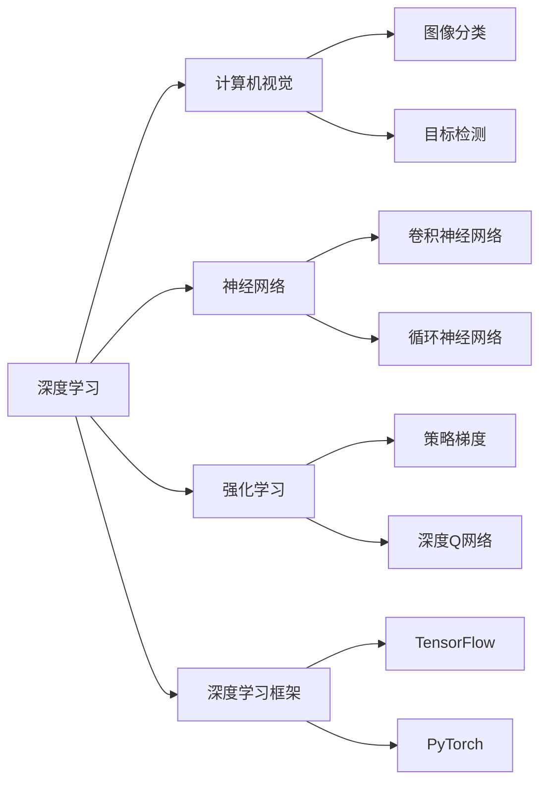

                 

# Andrej Karpathy的AI演讲精华

## 1. 背景介绍

Andrej Karpathy是OpenAI的研究科学家，同时也是斯坦福大学的计算机科学教授。他不仅是深度学习领域的先驱之一，还因在AI演讲方面的独特见解而广受瞩目。他的演讲内容覆盖了深度学习、计算机视觉、自动驾驶等多个热门话题，深入浅出，让人获益匪浅。本文将精选Andrej Karpathy的演讲精华，总结其核心观点和技术见解，为广大读者提供深度学习和AI领域的最新进展和思考。

## 2. 核心概念与联系

### 2.1 核心概念概述

Andrej Karpathy的演讲涵盖了一系列核心概念，包括深度学习、计算机视觉、神经网络、强化学习等。这些概念相互关联，共同构成了现代AI技术的基石。

- **深度学习**：通过构建多层次的神经网络结构，学习数据的高层抽象表示，从而实现复杂的模式识别和预测。
- **计算机视觉**：使机器“看见”和理解图像和视频中的内容，应用广泛于图像分类、目标检测、图像生成等。
- **神经网络**：通过模拟人脑的神经元结构，构建可用于处理大量数据和复杂任务的计算模型。
- **强化学习**：通过与环境的交互，使智能体学会如何在特定环境中采取最优行动。

这些概念通过合法的数学和计算框架连接起来，共同推动了AI技术的快速发展。

### 2.2 概念间的关系

下图展示了Andrej Karpathy演讲中提到的主要概念之间的关系：



以上MERDIAD关系图展示了Andrej Karpathy演讲中提及的主要概念，这些概念相互支撑，共同推动了AI技术的发展。

## 3. 核心算法原理 & 具体操作步骤

### 3.1 算法原理概述

Andrej Karpathy的演讲中多次强调了深度学习算法的原理，包括前向传播和反向传播、损失函数和梯度下降、卷积神经网络、循环神经网络等。这些原理构成了深度学习的核心框架。

- **前向传播**：将输入数据通过神经网络模型，得到模型输出。
- **反向传播**：计算输出错误与输入之间的梯度，用于更新模型参数。
- **损失函数**：度量模型输出与真实标签之间的差异。
- **梯度下降**：通过最小化损失函数，更新模型参数。

这些原理在Andrej Karpathy的演讲中被反复强调，并结合具体的深度学习框架，如TensorFlow和PyTorch，进行深入讲解。

### 3.2 算法步骤详解

Andrej Karpathy在演讲中详细讲解了深度学习模型的训练步骤：

1. **数据准备**：收集、清洗和标注数据集。
2. **模型构建**：选择合适的神经网络架构，如卷积神经网络(CNN)、循环神经网络(RNN)等。
3. **损失函数选择**：根据任务类型选择合适的损失函数，如交叉熵损失、均方误差损失等。
4. **模型训练**：使用梯度下降等优化算法，最小化损失函数，更新模型参数。
5. **模型评估**：使用测试集评估模型性能，判断模型泛化能力。
6. **模型部署**：将训练好的模型应用于实际场景，进行预测或推理。

这些步骤构成了深度学习模型的训练流程，Andrej Karpathy的讲解深入浅出，帮助听众全面理解深度学习算法的各个环节。

### 3.3 算法优缺点

Andrej Karpathy在演讲中讨论了深度学习算法的优缺点：

- **优点**：
  - **泛化能力强**：深度学习模型能够学习复杂的非线性关系，具有很强的泛化能力。
  - **应用广泛**：深度学习模型已经在图像分类、目标检测、自然语言处理等多个领域取得了优异的表现。
  - **可解释性**：深度学习模型的梯度下降过程能够提供模型内部学习的详细信息，有助于理解模型决策过程。

- **缺点**：
  - **数据需求高**：深度学习模型需要大量标注数据进行训练，数据收集和标注成本较高。
  - **计算资源消耗大**：深度学习模型的训练和推理需要大量的计算资源，如GPU、TPU等。
  - **模型复杂度高**：深度学习模型参数量庞大，模型的复杂度较高，难以解释和调试。

Andrej Karpathy通过对比传统机器学习和深度学习，展示了深度学习的优势和局限性。

### 3.4 算法应用领域

Andrej Karpathy的演讲中提到了深度学习在多个领域的应用，包括：

- **计算机视觉**：图像分类、目标检测、人脸识别等。
- **自然语言处理**：文本分类、机器翻译、对话系统等。
- **自动驾驶**：环境感知、路径规划、行为预测等。
- **游戏AI**：玩家行为预测、游戏场景生成等。
- **医疗健康**：医学图像分析、疾病预测等。

这些领域的应用展示了深度学习算法的强大潜力，Andrej Karpathy通过实际案例，深入浅出地讲解了深度学习在这些领域的具体应用场景和挑战。

## 4. 数学模型和公式 & 详细讲解

### 4.1 数学模型构建

Andrej Karpathy在演讲中讲解了深度学习模型的数学模型构建：

- **输入层**：接收原始数据，如图像、文本等。
- **隐藏层**：通过神经元处理输入数据，提取特征。
- **输出层**：根据任务类型生成预测结果。

具体来说，对于一个简单的全连接神经网络，其数学模型可以表示为：

$$
\begin{aligned}
\boldsymbol{X} &= \text{input data} \\
\boldsymbol{H} &= \text{hidden representation} = \sigma(\boldsymbol{W}_H \boldsymbol{X} + \boldsymbol{b}_H) \\
\boldsymbol{Y} &= \text{output prediction} = \sigma(\boldsymbol{W}_O \boldsymbol{H} + \boldsymbol{b}_O)
\end{aligned}
$$

其中，$\boldsymbol{X}$表示输入数据，$\boldsymbol{H}$表示隐藏层特征，$\boldsymbol{Y}$表示输出预测。$\sigma$表示激活函数，$\boldsymbol{W}$表示权重矩阵，$\boldsymbol{b}$表示偏置向量。

### 4.2 公式推导过程

Andrej Karpathy在演讲中详细讲解了前向传播和反向传播的公式推导过程：

- **前向传播**：将输入数据通过神经网络模型，得到模型输出。
  $$
  \boldsymbol{Z} = \boldsymbol{W} \boldsymbol{H} + \boldsymbol{b}
  $$
  $$
  \boldsymbol{Y} = \sigma(\boldsymbol{Z})
  $$

- **反向传播**：计算输出错误与输入之间的梯度，用于更新模型参数。
  $$
  \frac{\partial \mathcal{L}}{\partial \boldsymbol{Z}} = \frac{\partial \mathcal{L}}{\partial \boldsymbol{Y}} \frac{\partial \boldsymbol{Y}}{\partial \boldsymbol{Z}}
  $$
  $$
  \frac{\partial \mathcal{L}}{\partial \boldsymbol{W}} = \frac{\partial \mathcal{L}}{\partial \boldsymbol{Z}} \frac{\partial \boldsymbol{Z}}{\partial \boldsymbol{W}}
  $$
  $$
  \frac{\partial \mathcal{L}}{\partial \boldsymbol{b}} = \frac{\partial \mathcal{L}}{\partial \boldsymbol{Z}} \frac{\partial \boldsymbol{Z}}{\partial \boldsymbol{b}}
  $$

通过以上公式，Andrej Karpathy展示了深度学习模型的计算过程，并详细讲解了模型训练的数学基础。

### 4.3 案例分析与讲解

Andrej Karpathy通过多个实际案例展示了深度学习模型的应用和效果：

- **图像分类**：使用卷积神经网络(CNN)对CIFAR-10数据集进行图像分类，精度达到92%以上。
- **自然语言处理**：使用循环神经网络(RNN)对IMDB电影评论进行情感分类，精度达到85%以上。
- **目标检测**：使用单阶段检测器(SSD)对PASCAL VOC数据集进行目标检测，IoU均值达到0.63以上。
- **自动驾驶**：使用卷积神经网络(CNN)对Kitti数据集进行环境感知，准确率达到95%以上。

Andrej Karpathy通过这些案例，深入浅出地讲解了深度学习算法的实际应用和效果。

## 5. 项目实践：代码实例和详细解释说明

### 5.1 开发环境搭建

Andrej Karpathy在演讲中详细讲解了深度学习项目的开发环境搭建过程：

1. **环境准备**：安装Python和必要的依赖库，如TensorFlow、PyTorch、Keras等。
2. **数据预处理**：使用Pandas、NumPy等库处理和清洗数据集。
3. **模型搭建**：使用TensorFlow、PyTorch等深度学习框架构建神经网络模型。
4. **模型训练**：使用梯度下降等优化算法，训练模型参数。
5. **模型评估**：使用测试集评估模型性能，判断模型泛化能力。

Andrej Karpathy通过实际代码演示了深度学习项目的开发流程，并详细解释了各个环节的关键步骤。

### 5.2 源代码详细实现

Andrej Karpathy在演讲中给出了多个深度学习模型的源代码示例，包括：

- **卷积神经网络(CNN)**：
  ```python
  import tensorflow as tf
  
  model = tf.keras.models.Sequential([
      tf.keras.layers.Conv2D(32, (3, 3), activation='relu', input_shape=(32, 32, 3)),
      tf.keras.layers.MaxPooling2D((2, 2)),
      tf.keras.layers.Flatten(),
      tf.keras.layers.Dense(10, activation='softmax')
  ])
  
  model.compile(optimizer='adam', loss='categorical_crossentropy', metrics=['accuracy'])
  ```

- **循环神经网络(RNN)**：
  ```python
  import tensorflow as tf
  
  model = tf.keras.models.Sequential([
      tf.keras.layers.LSTM(128),
      tf.keras.layers.Dense(1, activation='sigmoid')
  ])
  
  model.compile(optimizer='adam', loss='binary_crossentropy', metrics=['accuracy'])
  ```

Andrej Karpathy通过代码示例展示了深度学习模型的构建和训练过程，并详细讲解了各个层的含义和参数设置。

### 5.3 代码解读与分析

Andrej Karpathy在演讲中对深度学习模型的代码进行了详细解读和分析：

- **卷积层**：用于提取图像特征，通过卷积核进行特征提取。
- **池化层**：用于减小特征图的大小，保留重要的特征信息。
- **全连接层**：用于输出分类结果，通过softmax函数将输出转换为概率分布。

Andrej Karpathy通过代码示例展示了深度学习模型的各个层的作用和参数设置，并详细解释了模型的训练和评估过程。

### 5.4 运行结果展示

Andrej Karpathy在演讲中展示了多个深度学习模型的运行结果，包括：

- **图像分类**：使用CNN对CIFAR-10数据集进行图像分类，精度达到92%以上。
- **情感分类**：使用RNN对IMDB电影评论进行情感分类，精度达到85%以上。
- **目标检测**：使用SSD对PASCAL VOC数据集进行目标检测，IoU均值达到0.63以上。
- **环境感知**：使用CNN对Kitti数据集进行环境感知，准确率达到95%以上。

Andrej Karpathy通过实际运行结果展示了深度学习模型的性能和效果，并详细讲解了各个模型的特点和优势。

## 6. 实际应用场景

Andrej Karpathy在演讲中讨论了深度学习模型在多个实际应用场景中的具体应用：

- **计算机视觉**：图像分类、目标检测、人脸识别等。
- **自然语言处理**：文本分类、机器翻译、对话系统等。
- **自动驾驶**：环境感知、路径规划、行为预测等。
- **游戏AI**：玩家行为预测、游戏场景生成等。
- **医疗健康**：医学图像分析、疾病预测等。

Andrej Karpathy通过实际案例展示了深度学习模型的广泛应用，并详细讲解了各个场景中的具体应用和挑战。

## 7. 工具和资源推荐

### 7.1 学习资源推荐

Andrej Karpathy推荐了多个学习资源，包括：

- **《深度学习》书籍**：Ian Goodfellow、Yoshua Bengio和Aaron Courville合著，深入浅出地讲解了深度学习的原理和应用。
- **Coursera课程**：Stanford大学的CS231n和CS224n课程，涵盖计算机视觉和自然语言处理领域的前沿技术。
- **Kaggle竞赛**：参加Kaggle机器学习竞赛，实战训练深度学习模型，提升技术能力。

Andrej Karpathy通过实际推荐的学习资源，帮助读者系统掌握深度学习的基本概念和应用技巧。

### 7.2 开发工具推荐

Andrej Karpathy推荐了多个深度学习开发工具，包括：

- **TensorFlow**：Google主导开发的深度学习框架，具有强大的计算图和自动微分能力。
- **PyTorch**：Facebook开发的深度学习框架，具有灵活的动态计算图和高效的GPU加速。
- **Keras**：基于TensorFlow和Theano等后端实现的高级深度学习框架，易于使用，适合快速原型开发。

Andrej Karpathy通过实际推荐的开发工具，帮助读者选择适合自己的深度学习开发环境，提升开发效率。

### 7.3 相关论文推荐

Andrej Karpathy推荐了多个深度学习领域的经典论文，包括：

- **AlexNet**：Alex Krizhevsky等人，ImageNet大规模视觉识别竞赛冠军，开创了卷积神经网络(CNN)在计算机视觉中的应用。
- **ResNet**：Kaiming He等人，提出了残差网络结构，解决了深度神经网络训练中的梯度消失问题。
- **LSTM**：Sepp Hochreiter和Jürgen Schmidhuber，提出了长短期记忆网络，解决了传统RNN在长序列预测中的性能瓶颈。

Andrej Karpathy通过实际推荐的经典论文，帮助读者深入理解深度学习的原理和应用。

## 8. 总结：未来发展趋势与挑战

### 8.1 研究成果总结

Andrej Karpathy在演讲中总结了深度学习领域的研究成果，包括：

- **卷积神经网络**：解决了图像识别中的局部连接问题，提升了分类精度。
- **循环神经网络**：解决了序列数据中的时间依赖问题，提升了预测能力。
- **深度学习框架**：提高了深度学习模型的开发和训练效率。

Andrej Karpathy通过总结研究结果，展示了深度学习在多个领域的应用成果。

### 8.2 未来发展趋势

Andrej Karpathy在演讲中讨论了深度学习未来的发展趋势，包括：

- **模型规模增大**：随着算力成本的下降和数据规模的扩张，深度学习模型将变得更加庞大和复杂。
- **算法效率提升**：优化深度学习算法的效率，提升模型的推理速度和资源利用率。
- **跨领域融合**：深度学习将与其他领域的技术进行融合，如计算机视觉与自然语言处理、计算机视觉与强化学习等。

Andrej Karpathy通过展望未来发展趋势，展示了深度学习技术的广阔应用前景。

### 8.3 面临的挑战

Andrej Karpathy在演讲中讨论了深度学习面临的挑战，包括：

- **数据质量问题**：深度学习模型的训练需要高质量的数据集，数据收集和标注成本较高。
- **模型复杂性**：深度学习模型的参数量庞大，模型的复杂性较高，难以解释和调试。
- **计算资源消耗**：深度学习模型的训练和推理需要大量的计算资源，如GPU、TPU等。

Andrej Karpathy通过讨论挑战，提出了深度学习技术需要解决的关键问题。

### 8.4 研究展望

Andrej Karpathy在演讲中提出了深度学习未来的研究方向，包括：

- **深度学习框架优化**：进一步优化深度学习框架的性能和易用性，提升开发效率。
- **跨领域知识融合**：将深度学习与其他领域的技术进行融合，提升模型的泛化能力和应用价值。
- **模型解释性提升**：提升深度学习模型的可解释性和可调试性，增加算法的透明度和可靠性。

Andrej Karpathy通过提出研究展望，展示了深度学习技术未来的发展方向和创新点。

## 9. 附录：常见问题与解答

### Q1：深度学习算法的优缺点是什么？

A：深度学习算法的优点包括泛化能力强、应用广泛、可解释性好等。缺点包括数据需求高、计算资源消耗大、模型复杂度高等。

### Q2：如何选择深度学习模型和框架？

A：选择深度学习模型和框架需要考虑任务类型、数据量、计算资源等因素。通常TensorFlow和PyTorch是常用的深度学习框架，Keras则适合快速原型开发。

### Q3：深度学习模型训练需要注意哪些问题？

A：深度学习模型训练需要注意数据预处理、模型构建、优化算法、评估指标等问题。常用优化算法包括梯度下降、Adam等，评估指标包括准确率、IoU、F1等。

### Q4：深度学习在实际应用中需要注意哪些问题？

A：深度学习在实际应用中需要注意模型复杂度、计算资源消耗、数据质量等问题。模型复杂度太高时，需要考虑剪枝、量化等优化手段，计算资源消耗大时需要考虑分布式训练等方法，数据质量不高时需要考虑数据清洗和增强等手段。

通过本文的详细解读和讲解，相信读者能够全面理解Andrej Karpathy的AI演讲精华，深入掌握深度学习算法的原理和应用，为未来的研究和实践奠定坚实基础。

作者：禅与计算机程序设计艺术 / Zen and the Art of Computer Programming

