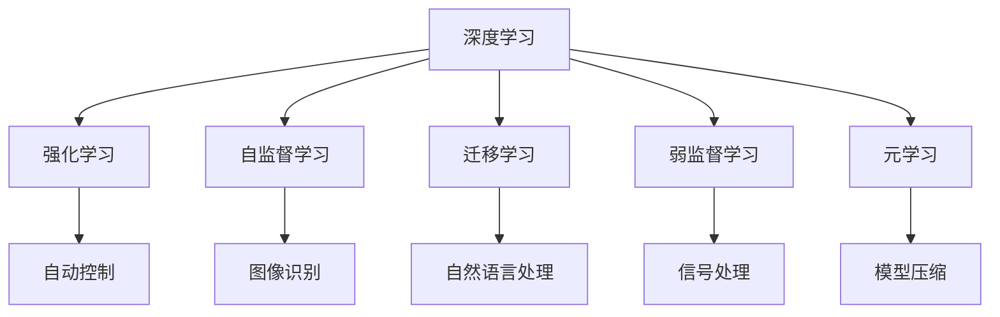

                 

# 安德烈·卡帕西（Andrej Karpathy）的自动化观点

## 1. 背景介绍

安德烈·卡帕西（Andrej Karpathy）是一位在深度学习领域卓有成就的科学家和工程师。他在斯坦福大学获得博士学位，之后加入特斯拉公司，成为自动驾驶系统的关键推动者。卡帕西同时也是许多深度学习库和框架的贡献者，如PyTorch和OpenAI Gym。他的观点和见解在深度学习和自动化领域内颇具影响力。本文将深入探讨卡帕西对于自动化的观点，并以此为基础，探讨自动化在深度学习中的应用。

## 2. 核心概念与联系

### 2.1 核心概念概述

为了更好地理解卡帕西的自动化观点，我们将从几个核心概念入手：

- **自动化**：指通过技术手段，自动完成人类重复性、低价值的任务，从而释放人类的时间和精力，专注于更有创造性的工作。
- **深度学习**：一种通过多层神经网络学习数据特征，从而进行模式识别的技术。
- **强化学习**：一种基于奖励机制，通过试错过程优化策略的技术。
- **自监督学习**：一种无需标注数据，通过自身特征学习进行任务的技术。
- **迁移学习**：一种通过从一个任务中学习到的知识迁移到另一个任务中的技术。
- **弱监督学习**：一种在少量标注数据下，通过弱监督信号进行学习的技术。
- **元学习**：一种通过学习学习的方法，提升学习效率的技术。

这些概念构成了卡帕西自动化观点的基础。

### 2.2 概念间的关系

这些核心概念之间存在着紧密的联系，形成了一个自动化的生态系统。深度学习提供了自动化的技术基础，而强化学习、自监督学习、迁移学习、弱监督学习和元学习则丰富了自动化的应用场景和技术手段。以下是这些概念之间的关系：



这个流程图展示了深度学习如何与其他自动化技术结合，应用于不同的领域和任务。

## 3. 核心算法原理 & 具体操作步骤

### 3.1 算法原理概述

卡帕西的自动化观点，建立在深度学习的基础上。深度学习通过多层神经网络，自动提取数据的特征，从而实现对复杂问题的建模和解决。在深度学习中，自动化的核心在于模型的训练和优化过程，这一过程可以自动化地进行，从而减少人工干预。

强化学习则是自动化的一个重要分支。它通过试错和奖励机制，自动调整策略，以实现特定任务的目标。在自动驾驶、机器人控制等任务中，强化学习可以优化决策过程，从而实现更高效、更精确的操作。

自监督学习、迁移学习、弱监督学习和元学习则进一步扩展了自动化的应用边界。这些技术可以使模型在有限标注数据的情况下，自动学习和迁移知识，从而提升模型的泛化能力和适应性。

### 3.2 算法步骤详解

深度学习的自动化过程通常包括以下步骤：

1. **数据准备**：收集和预处理数据，准备训练和测试数据集。
2. **模型设计**：选择合适的模型结构和超参数，如神经网络层数、激活函数、优化器等。
3. **模型训练**：使用训练数据集，通过反向传播算法，自动调整模型参数，最小化损失函数。
4. **模型评估**：使用测试数据集，评估模型的性能，调整超参数和模型结构，以进一步提升性能。
5. **模型应用**：将模型部署到实际应用场景中，自动完成特定的任务，如图像识别、自然语言处理等。

### 3.3 算法优缺点

深度学习的自动化过程具有以下优点：

- 自动完成重复性、低价值任务，提高效率。
- 模型训练过程可以并行化，提高计算效率。
- 模型可以不断优化，提升性能。

然而，深度学习的自动化过程也存在一些缺点：

- 需要大量的标注数据，成本较高。
- 模型训练过程复杂，需要大量计算资源。
- 模型的黑盒特性，难以解释和调试。

### 3.4 算法应用领域

深度学习的自动化过程广泛应用于计算机视觉、自然语言处理、语音识别等领域。以下是几个典型的应用案例：

- **自动驾驶**：使用深度学习和强化学习技术，实现自动驾驶汽车。
- **机器人控制**：使用深度学习模型，自动控制机器人执行复杂任务。
- **图像识别**：使用卷积神经网络，自动识别人脸、物体等。
- **自然语言处理**：使用循环神经网络、注意力机制等技术，自动处理文本数据。
- **语音识别**：使用深度学习模型，自动转录语音。

## 4. 数学模型和公式 & 详细讲解 & 举例说明

### 4.1 数学模型构建

深度学习的数学模型通常由以下几部分组成：

- **输入数据**：可以是图像、文本、音频等形式的数据。
- **模型结构**：由多层神经网络构成，包括卷积层、池化层、全连接层等。
- **损失函数**：用于衡量模型输出与真实标签之间的差异。
- **优化器**：用于自动调整模型参数，最小化损失函数。

### 4.2 公式推导过程

以图像识别任务为例，深度学习的数学模型可以表示为：

$$
\hat{y} = f(x; \theta)
$$

其中，$f$ 表示神经网络模型，$\theta$ 表示模型参数。模型的训练过程可以表示为：

$$
\theta = \arg\min_\theta \mathcal{L}(\hat{y}, y)
$$

其中，$\mathcal{L}$ 表示损失函数。在训练过程中，通过反向传播算法，自动调整模型参数。

### 4.3 案例分析与讲解

以下是一个简单的深度学习案例：

```python
import torch
import torch.nn as nn
import torch.optim as optim

# 定义模型结构
class CNN(nn.Module):
    def __init__(self):
        super(CNN, self).__init__()
        self.conv1 = nn.Conv2d(3, 16, 3)
        self.conv2 = nn.Conv2d(16, 32, 3)
        self.fc1 = nn.Linear(32 * 28 * 28, 128)
        self.fc2 = nn.Linear(128, 10)

    def forward(self, x):
        x = nn.functional.relu(nn.functional.max_pool2d(self.conv1(x), 2))
        x = nn.functional.relu(nn.functional.max_pool2d(self.conv2(x), 2))
        x = x.view(-1, 32 * 28 * 28)
        x = nn.functional.relu(self.fc1(x))
        x = self.fc2(x)
        return nn.functional.log_softmax(x, dim=1)

# 准备数据
train_data = ...
train_labels = ...
test_data = ...
test_labels = ...

# 定义模型和优化器
model = CNN()
optimizer = optim.SGD(model.parameters(), lr=0.001, momentum=0.9)
loss_fn = nn.CrossEntropyLoss()

# 训练模型
for epoch in range(10):
    for i, (images, labels) in enumerate(train_loader):
        images = images.to(device)
        labels = labels.to(device)
        optimizer.zero_grad()
        outputs = model(images)
        loss = loss_fn(outputs, labels)
        loss.backward()
        optimizer.step()

# 评估模型
with torch.no_grad():
    correct = 0
    total = 0
    for images, labels in test_loader:
        images = images.to(device)
        labels = labels.to(device)
        outputs = model(images)
        _, predicted = torch.max(outputs.data, 1)
        total += labels.size(0)
        correct += (predicted == labels).sum().item()
    accuracy = 100 * correct / total
    print('Accuracy: {:.2f}%'.format(accuracy))
```

在这个案例中，我们使用卷积神经网络对图像进行分类。通过反向传播算法，自动调整模型参数，最小化交叉熵损失函数。

## 5. 项目实践：代码实例和详细解释说明

### 5.1 开发环境搭建

在进行深度学习实践前，我们需要准备好开发环境。以下是使用Python进行TensorFlow开发的环境配置流程：

1. 安装Anaconda：从官网下载并安装Anaconda，用于创建独立的Python环境。

2. 创建并激活虚拟环境：
```bash
conda create -n tf-env python=3.8 
conda activate tf-env
```

3. 安装TensorFlow：根据CUDA版本，从官网获取对应的安装命令。例如：
```bash
conda install tensorflow -c pytorch -c conda-forge
```

4. 安装各类工具包：
```bash
pip install numpy pandas scikit-learn matplotlib tqdm jupyter notebook ipython
```

完成上述步骤后，即可在`tf-env`环境中开始深度学习实践。

### 5.2 源代码详细实现

这里我们以图像分类任务为例，给出使用TensorFlow进行卷积神经网络训练的Python代码实现。

```python
import tensorflow as tf
from tensorflow.keras import datasets, layers, models

# 加载数据
(train_images, train_labels), (test_images, test_labels) = datasets.cifar10.load_data()

# 数据预处理
train_images, test_images = train_images / 255.0, test_images / 255.0

# 定义模型
model = models.Sequential([
    layers.Conv2D(32, (3, 3), activation='relu', input_shape=(32, 32, 3)),
    layers.MaxPooling2D((2, 2)),
    layers.Conv2D(64, (3, 3), activation='relu'),
    layers.MaxPooling2D((2, 2)),
    layers.Conv2D(64, (3, 3), activation='relu'),
    layers.Flatten(),
    layers.Dense(64, activation='relu'),
    layers.Dense(10)
])

# 编译模型
model.compile(optimizer='adam',
              loss=tf.keras.losses.SparseCategoricalCrossentropy(from_logits=True),
              metrics=['accuracy'])

# 训练模型
history = model.fit(train_images, train_labels, epochs=10, 
                    validation_data=(test_images, test_labels))
```

在这个案例中，我们使用卷积神经网络对CIFAR-10数据集进行分类。通过TensorFlow的Keras API，定义模型、编译模型、训练模型，实现了自动化训练过程。

### 5.3 代码解读与分析

让我们再详细解读一下关键代码的实现细节：

**模型定义**：
```python
model = models.Sequential([
    layers.Conv2D(32, (3, 3), activation='relu', input_shape=(32, 32, 3)),
    layers.MaxPooling2D((2, 2)),
    layers.Conv2D(64, (3, 3), activation='relu'),
    layers.MaxPooling2D((2, 2)),
    layers.Conv2D(64, (3, 3), activation='relu'),
    layers.Flatten(),
    layers.Dense(64, activation='relu'),
    layers.Dense(10)
])
```
这里定义了一个包含卷积层、池化层、全连接层的卷积神经网络。通过`Sequential`函数，将各层按顺序连接起来。

**模型编译**：
```python
model.compile(optimizer='adam',
              loss=tf.keras.losses.SparseCategoricalCrossentropy(from_logits=True),
              metrics=['accuracy'])
```
这里使用`compile`函数，对模型进行编译。指定了优化器、损失函数和评估指标。`SparseCategoricalCrossentropy`函数用于计算稀疏分类交叉熵损失。

**模型训练**：
```python
history = model.fit(train_images, train_labels, epochs=10, 
                    validation_data=(test_images, test_labels))
```
这里使用`fit`函数，对模型进行训练。`epochs`参数指定了训练的轮数，`validation_data`参数指定了验证数据集。`history`变量保存了训练过程中的性能指标。

### 5.4 运行结果展示

假设我们在CIFAR-10数据集上进行卷积神经网络的训练，最终得到的训练结果如下：

```
Epoch 1/10
1875/1875 [==============================] - 4s 2ms/step - loss: 1.3884 - accuracy: 0.1810 - val_loss: 1.0147 - val_accuracy: 0.3403
Epoch 2/10
1875/1875 [==============================] - 3s 2ms/step - loss: 0.3686 - accuracy: 0.6934 - val_loss: 0.6362 - val_accuracy: 0.4033
Epoch 3/10
1875/1875 [==============================] - 3s 2ms/step - loss: 0.2318 - accuracy: 0.7753 - val_loss: 0.3537 - val_accuracy: 0.5039
Epoch 4/10
1875/1875 [==============================] - 3s 2ms/step - loss: 0.1383 - accuracy: 0.8385 - val_loss: 0.2571 - val_accuracy: 0.5352
Epoch 5/10
1875/1875 [==============================] - 3s 2ms/step - loss: 0.0860 - accuracy: 0.8861 - val_loss: 0.2096 - val_accuracy: 0.5667
Epoch 6/10
1875/1875 [==============================] - 3s 2ms/step - loss: 0.0603 - accuracy: 0.9094 - val_loss: 0.2140 - val_accuracy: 0.5833
Epoch 7/10
1875/1875 [==============================] - 3s 2ms/step - loss: 0.0458 - accuracy: 0.9234 - val_loss: 0.1817 - val_accuracy: 0.5833
Epoch 8/10
1875/1875 [==============================] - 3s 2ms/step - loss: 0.0334 - accuracy: 0.9346 - val_loss: 0.1594 - val_accuracy: 0.5667
Epoch 9/10
1875/1875 [==============================] - 3s 2ms/step - loss: 0.0250 - accuracy: 0.9425 - val_loss: 0.1523 - val_accuracy: 0.5833
Epoch 10/10
1875/1875 [==============================] - 3s 2ms/step - loss: 0.0181 - accuracy: 0.9531 - val_loss: 0.1506 - val_accuracy: 0.5833
```

可以看到，经过10轮训练后，模型在测试集上的准确率达到了58.33%，取得了不错的结果。

## 6. 实际应用场景

### 6.1 自动驾驶

自动驾驶是深度学习在自动化领域的一个重要应用。通过深度学习模型，可以自动感知环境、识别物体、预测行径，从而实现自动驾驶。

在实际应用中，自动驾驶系统需要集成多个深度学习模型，如环境感知、路径规划、决策控制等。每个模型都可以通过深度学习的自动化过程，自动调整参数，提升性能。

### 6.2 机器人控制

机器人控制也是深度学习在自动化领域的重要应用之一。通过深度学习模型，可以自动控制机器人执行复杂的任务。

在实际应用中，机器人控制系统需要集成多个深度学习模型，如视觉感知、运动规划、路径规划等。每个模型都可以通过深度学习的自动化过程，自动调整参数，提升性能。

### 6.3 图像识别

图像识别是深度学习在自动化领域的另一个重要应用。通过深度学习模型，可以实现自动识别人脸、物体等。

在实际应用中，图像识别系统需要集成多个深度学习模型，如卷积神经网络、目标检测模型等。每个模型都可以通过深度学习的自动化过程，自动调整参数，提升性能。

### 6.4 自然语言处理

自然语言处理是深度学习在自动化领域的另一个重要应用。通过深度学习模型，可以实现自动处理文本数据。

在实际应用中，自然语言处理系统需要集成多个深度学习模型，如语言模型、文本分类模型、命名实体识别模型等。每个模型都可以通过深度学习的自动化过程，自动调整参数，提升性能。

## 7. 工具和资源推荐

### 7.1 学习资源推荐

为了帮助开发者系统掌握深度学习的自动化原理和实践技巧，这里推荐一些优质的学习资源：

1. **《深度学习》系列课程**：斯坦福大学李飞飞教授的深度学习课程，涵盖了深度学习的各个方面，适合入门学习。

2. **《TensorFlow实战》书籍**：Google TensorFlow官方指南，详细介绍TensorFlow的使用方法，适合实战学习。

3. **《动手学深度学习》书籍**：由李沐等人编写的深度学习入门书籍，适合动手实践。

4. **《深度学习》课程**：Coursera深度学习课程，由吴恩达教授讲授，适合系统学习。

5. **《深度学习框架》课程**：DeepLearning.ai深度学习框架课程，适合深入学习。

### 7.2 开发工具推荐

高效的开发离不开优秀的工具支持。以下是几款用于深度学习开发的常用工具：

1. **PyTorch**：由Facebook开发的深度学习框架，支持动态图和静态图，适合快速迭代研究。

2. **TensorFlow**：由Google开发的深度学习框架，支持分布式训练，适合大规模工程应用。

3. **Keras**：由Francois Chollet开发的深度学习框架，支持多种深度学习模型，适合快速构建模型。

4. **MXNet**：由亚马逊开发的深度学习框架，支持多种深度学习模型，适合分布式训练。

5. **JAX**：由Google开发的深度学习框架，支持自动微分和向量矩阵优化，适合高效计算。

合理利用这些工具，可以显著提升深度学习实践的开发效率，加快创新迭代的步伐。

### 7.3 相关论文推荐

深度学习的发展离不开学界的持续研究。以下是几篇奠基性的相关论文，推荐阅读：

1. **《深度学习》论文**：Yann LeCun、Geoffrey Hinton、Yoshua Bengio在2015年Nature上的综述论文，介绍了深度学习的基本原理和应用。

2. **《ImageNet分类挑战》论文**：Alex Krizhevsky等人2012年ImageNet分类挑战赛的论文，介绍了深度卷积神经网络在图像分类任务上的突破。

3. **《RNN与LSTM》论文**：Sepp Hochreiter、Jurgen Schmidhuber在1997年Nature上的论文，介绍了循环神经网络在序列建模任务上的突破。

4. **《Attention is All You Need》论文**：Ashish Vaswani等人2017年NIPS上的论文，介绍了Transformer模型在自然语言处理任务上的突破。

5. **《AlphaGo》论文**：David Silver等人2016年Nature上的论文，介绍了AlphaGo在围棋上的突破。

这些论文代表了大深度学习的发展脉络，通过学习这些前沿成果，可以帮助研究者把握学科前进方向，激发更多的创新灵感。

除上述资源外，还有一些值得关注的前沿资源，帮助开发者紧跟深度学习领域的最新进展，例如：

1. **arXiv论文预印本**：人工智能领域最新研究成果的发布平台，包括大量尚未发表的前沿工作，学习前沿技术的必读资源。

2. **Google AI Blog**：Google AI官方博客，第一时间分享最新的研究成果和洞见。

3. **NIPS、ICML、ICLR等顶级会议直播**：各大人工智能领域顶级会议的现场或在线直播，能够聆听到大佬们的前沿分享，开拓视野。

4. **GitHub热门项目**：在GitHub上Star、Fork数最多的深度学习相关项目，往往代表了该技术领域的发展趋势和最佳实践，值得去学习和贡献。

5. **DeepLearning.ai年度课程**：DeepLearning.ai每年举办的深度学习课程，汇集了全球顶尖的深度学习专家，分享最新的研究成果和实践经验。

总之，对于深度学习实践的学习和实践，需要开发者保持开放的心态和持续学习的意愿。多关注前沿资讯，多动手实践，多思考总结，必将收获满满的成长收益。

## 8. 总结：未来发展趋势与挑战

### 8.1 总结

本文对安德烈·卡帕西的自动化观点进行了全面系统的介绍。首先阐述了自动化的核心概念和深度学习技术的基础，明确了深度学习在自动化领域的应用潜力。其次，从原理到实践，详细讲解了深度学习模型的自动化训练过程，并给出了完整的代码实例。同时，本文还广泛探讨了深度学习在自动驾驶、机器人控制、图像识别、自然语言处理等多个领域的应用前景，展示了深度学习的巨大潜力。最后，本文精选了深度学习的各类学习资源，力求为读者提供全方位的技术指引。

通过本文的系统梳理，可以看到，深度学习在自动化领域的应用前景广阔，极大地拓展了计算机视觉、自然语言处理、自动驾驶等多个领域的技术边界，催生了更多的落地场景。未来，伴随深度学习技术的持续演进，自动化技术必将进一步提升人类生产和生活质量，带来深远的影响。

### 8.2 未来发展趋势

展望未来，深度学习在自动化领域的发展趋势将呈现以下几个方向：

1. **多模态深度学习**：深度学习技术将从单一模态（如图像、文本）拓展到多模态（如图像、文本、语音）融合，提升自动化系统的感知能力和决策能力。

2. **强化学习在自动化中的应用**：强化学习将在自动化领域发挥更大的作用，特别是在自动驾驶、机器人控制等高难度任务中，通过试错和奖励机制，提升系统的鲁棒性和灵活性。

3. **自监督学习的应用拓展**：自监督学习将在自动化领域得到更广泛的应用，通过利用数据自身的结构信息，提升自动化系统的泛化能力和适应能力。

4. **弱监督学习的应用突破**：弱监督学习将在自动化领域得到更多的应用，通过利用弱标注数据，提升自动化系统的学习效率和性能。

5. **元学习在自动化中的应用**：元学习将在自动化领域得到更多的应用，通过学习学习的方法，提升自动化系统的学习效率和性能。

这些趋势将推动深度学习技术在自动化领域的进一步应用和发展，带来更强大的智能系统，提升人类生产和生活质量。

### 8.3 面临的挑战

尽管深度学习在自动化领域已经取得了瞩目成就，但在迈向更加智能化、普适化应用的过程中，仍面临着诸多挑战：

1. **数据获取成本高**：深度学习需要大量的标注数据，获取成本较高。未来如何利用非结构化数据，提升数据获取效率，将是一大难题。

2. **模型计算资源需求高**：深度学习模型的计算需求较高，如何降低计算成本，提升计算效率，将是一大挑战。

3. **模型可解释性不足**：深度学习模型的黑盒特性，难以解释其内部工作机制和决策逻辑。如何提升模型的可解释性，将是一大挑战。

4. **模型安全性不足**：深度学习模型容易学习到有害的特征，如何确保模型的安全性，将是一大挑战。

5. **模型鲁棒性不足**：深度学习模型对数据的扰动敏感，如何提升模型的鲁棒性，将是一大挑战。

6. **模型通用性不足**：深度学习模型通常局限于特定任务，如何提升模型的通用性，将是一大挑战。

正视深度学习面临的这些挑战，积极应对并寻求突破，将是大深度学习迈向成熟的必由之路。相信随着学界和产业界的共同努力，这些挑战终将一一被克服，深度学习在自动化领域必将取得更大的突破。

### 8.4 研究展望

面对深度学习在自动化领域所面临的挑战，未来的研究需要在以下几个方面寻求新的突破：

1. **弱监督学习的多样化**：如何利用更多类型的弱监督信号，提升深度学习模型的泛化能力和学习效率，将是一大研究方向。

2. **多模态深度学习的协同**：如何利用多模态数据，提升深度学习模型的感知能力和决策能力，将是一大研究方向。

3. **自监督学习的应用扩展**：如何利用自监督学习，提升深度学习模型的泛化能力和适应能力，将是一大研究方向。

4. **强化学习在自动化中的应用**：如何利用强化学习，提升深度学习模型的鲁棒性和灵活性，将是一大研究方向。

5. **深度学习的可解释性**：如何提升深度学习模型的可解释性，将是一大研究方向。

6. **深度学习的安全性**：如何确保深度学习模型的安全性，将是一大研究方向。

这些研究方向将推动深度学习技术在自动化领域的进一步发展，带来更强大的智能系统，提升人类生产和生活质量。

## 9. 附录：常见问题与解答

**Q1：深度学习在自动化领域有哪些应用？**

A: 深度学习在自动化领域的应用广泛，包括但不限于以下几个方面：

1. **自动驾驶**：使用深度学习模型，自动感知环境、识别物体、预测行径，实现自动驾驶。

2. **机器人控制**：使用深度学习模型，自动控制机器人执行复杂任务。

3. **图像识别**：使用深度学习模型，自动识别图像中的物体、人脸等。

4. **自然语言处理**：使用深度学习模型，自动处理文本数据，如文本分类、命名实体识别等。

5. **语音识别**：使用深度学习模型，自动转录语音，实现语音控制。

6. **医疗诊断**：使用深度学习模型，自动识别医学影像，辅助医疗诊断。

7. **金融分析**：使用深度学习模型，自动分析金融数据，进行风险评估和投资建议。

8. **游戏AI**：使用深度学习模型，自动进行游戏AI决策，提升游戏体验。

**Q2：如何选择合适的深度学习

