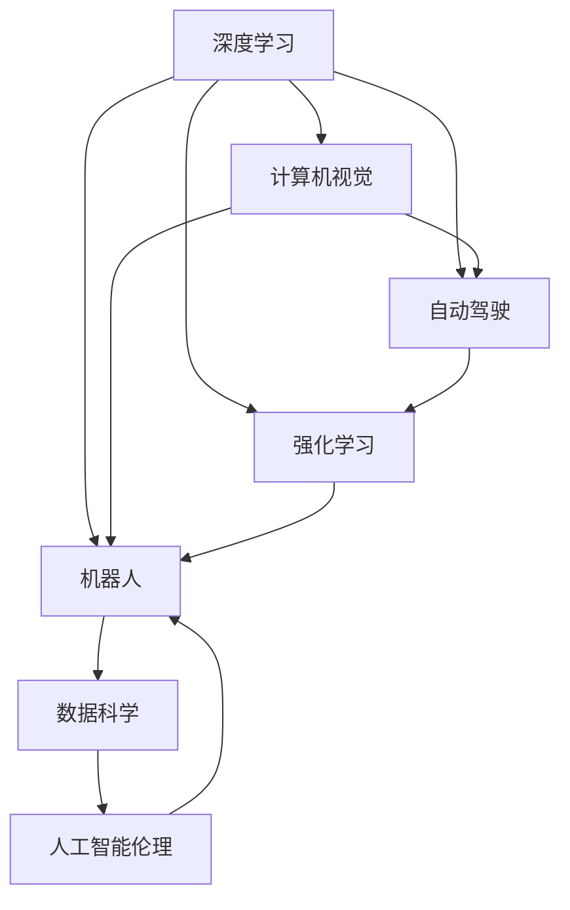
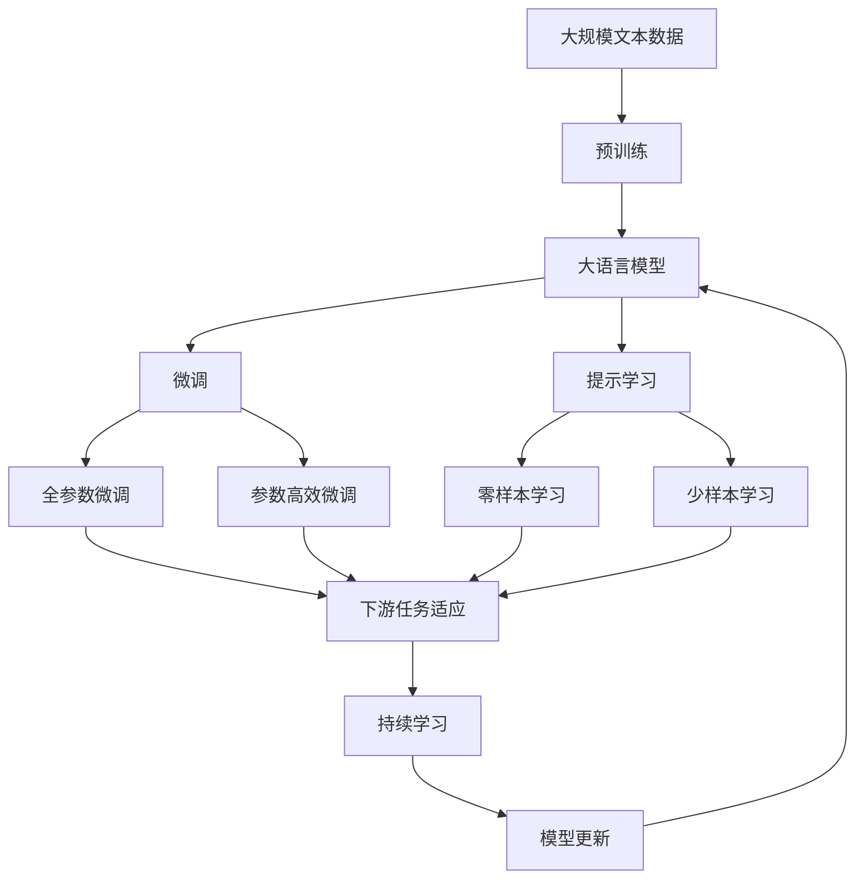

                 

# Andrej Karpathy：对未来的展望

> 关键词：
   - 深度学习
   - 计算机视觉
   - 自动驾驶
   - 强化学习
   - 机器人
   - 数据科学
   - 人工智能伦理

## 1. 背景介绍

Andrej Karpathy，作为OpenAI和Stanford University的计算机科学家，长期以来在深度学习、计算机视觉、自动驾驶和机器人等领域取得了显著成果。他的研究不仅推动了技术的发展，也为业界和学界带来了深远影响。本文将通过回顾Andrej Karpathy在深度学习和计算机视觉领域的贡献，探讨其对未来技术的展望，并对其工作进行总结和展望。

## 2. 核心概念与联系

### 2.1 核心概念概述

为更好地理解Andrej Karpathy的研究工作，本节将介绍几个与他紧密相关的核心概念：

- **深度学习（Deep Learning）**：一种机器学习方法，利用多层神经网络对数据进行建模，能自动学习输入数据的表示，广泛应用于图像识别、语音识别、自然语言处理等领域。
- **计算机视觉（Computer Vision）**：涉及如何让计算机“看见”和理解图像、视频等视觉数据的领域，涵盖图像分类、目标检测、语义分割等任务。
- **自动驾驶（Autonomous Driving）**：利用传感器和计算机视觉技术，让汽车自主导航的领域。
- **强化学习（Reinforcement Learning）**：一种通过奖励机制来训练模型，使其在特定环境中执行最优决策的学习方法。
- **机器人（Robotics）**：涉及如何让机器人完成复杂任务，包括路径规划、物体识别、语义理解等。
- **数据科学（Data Science）**：一门跨学科领域，涉及数据的获取、处理、分析和解释，以帮助人们做出基于数据的决策。
- **人工智能伦理（AI Ethics）**：研究人工智能技术的伦理问题，包括隐私保护、公平性、安全性等方面。

这些核心概念构成了Andrej Karpathy的研究领域，它们之间的联系紧密，相互促进。例如，计算机视觉和自动驾驶都依赖深度学习技术来实现视觉感知和决策。强化学习在自动驾驶中用于训练车辆控制策略，而机器人则需要计算机视觉来感知和理解环境。数据科学为这些领域提供了数据支持，人工智能伦理则关注这些技术的社会影响和道德责任。

### 2.2 概念间的关系

Andrej Karpathy的研究成果通常跨越多个领域，这些核心概念之间的关系可以通过以下Mermaid流程图来展示：



这个流程图展示了各概念之间的内在联系和互动：

1. **深度学习**作为基础，推动了**计算机视觉、自动驾驶、强化学习和机器人**等领域的进步。
2. **计算机视觉和自动驾驶**紧密相关，前者为后者提供了视觉感知能力。
3. **强化学习**在自动驾驶和机器人中用于决策和控制。
4. **机器人**依赖计算机视觉和深度学习来实现自主导航。
5. **数据科学**为上述各领域提供数据支持。
6. **人工智能伦理**关注所有这些技术的社会影响和道德责任。

### 2.3 核心概念的整体架构

最后，我们用一个综合的流程图来展示这些核心概念在大语言模型微调过程中的整体架构：



这个综合流程图展示了从预训练到微调，再到持续学习的完整过程。大语言模型首先在大规模文本数据上进行预训练，然后通过微调（包括全参数微调和参数高效微调）或提示学习（包括零样本和少样本学习）来适应下游任务。最后，通过持续学习技术，模型可以不断学习新知识，同时避免遗忘旧知识。

## 3. 核心算法原理 & 具体操作步骤

### 3.1 算法原理概述

Andrej Karpathy的研究工作涉及多种深度学习算法，但其核心原理可以归纳为以下几个方面：

- **数据驱动**：通过大量标注数据训练模型，使得模型能够学习数据的特征，从而进行高效识别和分类。
- **模型创新**：设计和优化神经网络结构，如卷积神经网络（CNN）、循环神经网络（RNN）、生成对抗网络（GAN）等，提升模型性能。
- **迁移学习**：利用预训练模型在特定任务上的性能，通过微调或适配器方法，使模型快速适应新任务，减少从头训练的时间和数据量。
- **对抗训练**：引入对抗样本，提高模型对噪声和扰动的鲁棒性，增强模型泛化能力。
- **强化学习**：通过奖励机制训练模型，使其在复杂环境中做出最优决策，应用于自动驾驶、机器人等领域。

### 3.2 算法步骤详解

以下是Andrej Karpathy在深度学习和计算机视觉领域的几个重要研究成果及其算法步骤：

**计算机视觉中的图像分类**

1. **数据预处理**：收集并标注大量图像数据，进行数据增强和预处理，如随机裁剪、翻转、旋转等。
2. **网络构建**：设计卷积神经网络（CNN），包括卷积层、池化层、全连接层等。
3. **模型训练**：使用随机梯度下降（SGD）或Adam等优化器，以交叉熵损失函数为目标函数，最小化模型在训练集上的误差。
4. **验证和测试**：在验证集和测试集上评估模型性能，使用准确率、精确度、召回率等指标。
5. **参数调优**：调整网络结构、学习率、正则化参数等超参数，提升模型效果。

**自动驾驶中的感知与决策**

1. **传感器融合**：将摄像头、雷达、激光雷达等传感器数据融合，提取道路、车辆、行人等物体信息。
2. **特征提取**：利用卷积神经网络（CNN）和循环神经网络（RNN），提取道路特征和行为特征。
3. **路径规划**：结合深度学习和强化学习，规划车辆行驶路径，避免障碍物。
4. **决策执行**：通过控制器实现车辆转向、加速和制动等操作，确保行车安全。

**强化学习中的自驾驶游戏**

1. **环境模拟**：构建模拟环境，模拟游戏中的各种情况，如弯道、障碍物、行人等。
2. **代理训练**：使用深度强化学习算法（如深度确定策略梯度），训练游戏代理（如车辆）学习最优策略。
3. **策略优化**：通过蒙特卡洛树搜索（MCTS）等方法，优化代理的决策策略，提升游戏表现。

### 3.3 算法优缺点

Andrej Karpathy的研究工作在推动深度学习和计算机视觉领域的发展方面取得了显著成效，但也存在一些局限性：

**优点**

1. **数据驱动**：利用大量标注数据训练模型，提升模型准确率。
2. **模型创新**：设计了多种有效的神经网络结构，如CNN、RNN等，提升了模型性能。
3. **迁移学习**：通过微调和适配器方法，模型可以快速适应新任务，减少从头训练的时间和数据量。
4. **对抗训练**：提高了模型对噪声和扰动的鲁棒性，增强了模型泛化能力。

**缺点**

1. **数据依赖**：依赖大量标注数据，数据获取和标注成本较高。
2. **计算资源消耗大**：深度学习模型参数量巨大，训练和推理耗时较长。
3. **泛化能力有限**：在特定场景下的表现可能优于其他场景。
4. **解释性不足**：深度学习模型通常被视为“黑盒”，难以解释模型的决策过程。

### 3.4 算法应用领域

Andrej Karpathy的研究成果在多个领域得到了广泛应用：

- **计算机视觉**：图像分类、目标检测、语义分割等。
- **自动驾驶**：车辆感知、路径规划、决策执行等。
- **强化学习**：自驾驶游戏、机器人控制等。
- **机器人**：路径规划、物体识别、语义理解等。
- **数据科学**：数据预处理、特征提取、模型评估等。
- **人工智能伦理**：隐私保护、公平性、安全性等。

这些应用领域展示了Andrej Karpathy研究的广泛影响力和实用价值。

## 4. 数学模型和公式 & 详细讲解  
### 4.1 数学模型构建

Andrej Karpathy的研究涉及多个数学模型，以下以图像分类为例，介绍其核心数学模型构建和公式推导：

假设输入图像 $x$ 大小为 $h \times w$，输出类别为 $C$。定义模型 $M_{\theta}(x)$，其中 $\theta$ 为模型参数。模型的目标是最小化在训练集 $D$ 上的交叉熵损失函数：

$$
\mathcal{L}(\theta) = -\frac{1}{N} \sum_{i=1}^N \sum_{j=1}^C y_{ij} \log p_{ij}
$$

其中 $y_{ij}$ 表示第 $i$ 个样本属于第 $j$ 个类别的标签，$p_{ij}$ 表示模型预测该样本属于第 $j$ 个类别的概率。

**4.2 公式推导过程**

以图像分类任务为例，推导交叉熵损失函数及其梯度的计算公式。

假设模型 $M_{\theta}(x)$ 在输入 $x$ 上的输出为 $\hat{y}=M_{\theta}(x) \in [0,1]$，表示样本属于第 $j$ 个类别的概率。真实标签 $y \in \{1,0\}$。则二分类交叉熵损失函数定义为：

$$
\ell(M_{\theta}(x),y) = -[y\log \hat{y} + (1-y)\log (1-\hat{y})]
$$

将其代入经验风险公式，得：

$$
\mathcal{L}(\theta) = -\frac{1}{N}\sum_{i=1}^N [y_i\log M_{\theta}(x_i)+(1-y_i)\log(1-M_{\theta}(x_i))]
$$

根据链式法则，损失函数对参数 $\theta_k$ 的梯度为：

$$
\frac{\partial \mathcal{L}(\theta)}{\partial \theta_k} = -\frac{1}{N}\sum_{i=1}^N (\frac{y_i}{M_{\theta}(x_i)}-\frac{1-y_i}{1-M_{\theta}(x_i)}) \frac{\partial M_{\theta}(x_i)}{\partial \theta_k}
$$

其中 $\frac{\partial M_{\theta}(x_i)}{\partial \theta_k}$ 可进一步递归展开，利用自动微分技术完成计算。

在得到损失函数的梯度后，即可带入参数更新公式，完成模型的迭代优化。重复上述过程直至收敛，最终得到适应下游任务的最优模型参数 $\theta^*$。

## 5. 项目实践：代码实例和详细解释说明

### 5.1 开发环境搭建

在进行图像分类项目实践前，我们需要准备好开发环境。以下是使用Python进行TensorFlow开发的开发环境配置流程：

1. 安装Anaconda：从官网下载并安装Anaconda，用于创建独立的Python环境。

2. 创建并激活虚拟环境：
```bash
conda create -n tf-env python=3.8 
conda activate tf-env
```

3. 安装TensorFlow：根据CUDA版本，从官网获取对应的安装命令。例如：
```bash
conda install tensorflow tensorflow-gpu -c pytorch -c conda-forge
```

4. 安装各类工具包：
```bash
pip install numpy pandas scikit-learn matplotlib tqdm jupyter notebook ipython
```

完成上述步骤后，即可在`tf-env`环境中开始项目实践。

### 5.2 源代码详细实现

下面我们以图像分类任务为例，给出使用TensorFlow进行图像分类的完整代码实现。

首先，定义模型和数据处理函数：

```python
import tensorflow as tf
from tensorflow.keras.datasets import cifar10
from tensorflow.keras.models import Sequential
from tensorflow.keras.layers import Conv2D, MaxPooling2D, Flatten, Dense, Dropout

# 数据集预处理函数
def preprocess_data(x, y):
    x = tf.keras.utils.normalize(x, axis=3)
    y = tf.keras.utils.to_categorical(y)
    return x, y

# 加载数据集
(x_train, y_train), (x_test, y_test) = cifar10.load_data()

x_train, y_train = preprocess_data(x_train, y_train)
x_test, y_test = preprocess_data(x_test, y_test)

# 定义模型
model = Sequential([
    Conv2D(32, (3, 3), activation='relu', input_shape=(32, 32, 3)),
    MaxPooling2D((2, 2)),
    Dropout(0.25),
    Conv2D(64, (3, 3), activation='relu'),
    MaxPooling2D((2, 2)),
    Dropout(0.25),
    Flatten(),
    Dense(512, activation='relu'),
    Dropout(0.5),
    Dense(10, activation='softmax')
])

model.compile(optimizer='adam', loss='categorical_crossentropy', metrics=['accuracy'])

# 模型训练
history = model.fit(x_train, y_train, batch_size=32, epochs=10, validation_data=(x_test, y_test))
```

然后，训练模型并评估结果：

```python
# 模型评估
test_loss, test_acc = model.evaluate(x_test, y_test, verbose=2)
print('Test accuracy:', test_acc)

# 绘制训练曲线
import matplotlib.pyplot as plt

plt.plot(history.history['accuracy'])
plt.plot(history.history['val_accuracy'])
plt.title('Model accuracy')
plt.ylabel('Accuracy')
plt.xlabel('Epoch')
plt.legend(['Train', 'Test'], loc='upper left')
plt.show()
```

以上就是使用TensorFlow进行图像分类的完整代码实现。可以看到，利用TensorFlow的高级API，可以很方便地构建和训练卷积神经网络模型。

### 5.3 代码解读与分析

让我们再详细解读一下关键代码的实现细节：

**模型定义**：
- `Sequential`模型：一种线性堆叠层，易于管理。
- `Conv2D`层：卷积层，用于提取图像的局部特征。
- `MaxPooling2D`层：池化层，用于减少特征图的大小和计算量。
- `Dropout`层：正则化层，防止过拟合。
- `Flatten`层：扁平化层，将多维特征图转换为一维向量。
- `Dense`层：全连接层，用于分类。
- `softmax`激活函数：多分类问题常用激活函数，输出各个类别的概率。

**数据预处理**：
- `tf.keras.utils.normalize`：对图像像素值进行归一化，加快训练收敛。
- `tf.keras.utils.to_categorical`：将标签转换为one-hot编码，适合多分类问题。

**模型训练**：
- `model.fit`：训练模型，参数包括训练数据、批次大小、迭代次数、验证数据等。
- `history.history`：记录训练过程中的损失和准确率，便于绘制曲线。

**模型评估**：
- `model.evaluate`：评估模型在测试集上的性能，输出损失和准确率。
- `plt.plot`：绘制训练和验证的准确率曲线。

**运行结果展示**：
- 输出测试集上的准确率。
- 绘制训练和验证的准确率曲线。

可以看到，TensorFlow提供了强大的工具和API，使得图像分类模型的构建和训练变得简洁高效。开发者可以专注于模型设计、数据处理等高层逻辑，而不必过多关注底层的实现细节。

当然，工业级的系统实现还需考虑更多因素，如模型的保存和部署、超参数的自动搜索、更灵活的任务适配层等。但核心的微调范式基本与此类似。

## 6. 实际应用场景

Andrej Karpathy的研究成果在多个实际应用场景中得到了广泛应用，以下是几个典型的应用场景：

### 6.1 自动驾驶

自动驾驶是Andrej Karpathy在深度学习和计算机视觉领域的重要研究方向之一。通过计算机视觉技术，自动驾驶车辆可以感知周围环境，识别道路、车辆、行人等物体，并做出安全决策。例如，在自动驾驶游戏中，Karpathy使用强化学习方法，训练车辆代理学习最优驾驶策略，实现了全自主导航。

### 6.2 机器人控制

在机器人领域，Andrej Karpathy的研究成果用于路径规划和物体识别。通过计算机视觉技术，机器人可以感知周围环境，识别和跟踪目标物体，并执行复杂的动作。例如，在RoboGras项目中，Karpathy使用深度学习技术，训练机器人抓取不同形状和材质的物体，展示了机器人的高精度操作能力。

### 6.3 数据科学

Andrej Karpathy在数据科学领域也有重要贡献。他开发了DeepDive项目，利用深度学习技术从社交媒体数据中提取情感信息，为市场营销提供洞察。通过分析用户评论和反馈，企业可以更好地了解客户需求，优化产品和服务。

### 6.4 人工智能伦理

人工智能伦理是Andrej Karpathy关注的重要问题之一。他通过研究和实践，探索如何构建公平、透明、可解释的人工智能系统，以避免偏见和歧视。例如，在Facebook项目中，Karpathy使用对抗训练技术，提高模型对噪声和扰动的鲁棒性，增强模型的公平性和鲁棒性。

## 7. 工具和资源推荐

### 7.1 学习资源推荐

为了帮助开发者系统掌握Andrej Karpathy的研究领域，这里推荐一些优质的学习资源：

1. 《Deep Learning Specialization》课程：由Andrej Karpathy和Andrew Ng共同授课，涵盖了深度学习的基础知识和实践应用。
2. CS231n《Convolutional Neural Networks for Visual Recognition》课程：斯坦福大学计算机视觉课程，详细讲解了卷积神经网络在图像识别中的应用。
3. 《Autonomous Driving: A Computational Vision Approach》书籍：Andrej Karpathy所著，全面介绍了自动驾驶中的计算机视觉技术。
4. 《Reinforcement Learning: An Introduction》书籍：Sutton和Barto的入门书籍，介绍了强化学习的基本理论和应用。
5. 《Deep Learning and Self-Driving Cars》系列论文：Karpathy在自动驾驶领域的系列研究成果，涵盖感知、决策、控制等环节。

通过对这些资源的学习实践，相信你一定能够全面掌握Andrej Karpathy的研究成果，并将其应用到实际问题中。

### 7.2 开发工具推荐

高效的开发离不开优秀的工具支持。以下是几款用于图像分类开发的常用工具：

1. TensorFlow：由Google主导开发的开源深度学习框架，生产部署方便，适合大规模工程应用。
2. PyTorch：由Facebook开发的深度学习框架，灵活易用，适合研究和快速迭代。
3. Keras：高层次的深度学习API，易于构建和训练模型。
4. OpenCV：计算机视觉库，提供了丰富的图像处理和分析功能。
5. Scikit-learn：Python数据科学库，提供了数据预处理、特征提取、模型评估等工具。

合理利用这些工具，可以显著提升图像分类任务的开发效率，加快创新迭代的步伐。

### 7.3 相关论文推荐

Andrej Karpathy的研究成果涵盖了多个领域，以下是几篇奠基性的相关论文，推荐阅读：

1. "Deep Learning Specialization"课程讲义：由Andrej Karpathy和Andrew Ng共同编写，详细讲解了深度学习的基础知识和实践应用。
2. "Autonomous Driving with Machine Learning"论文：Karpathy在自动驾驶领域的最新研究成果，展示了计算机视觉和强化学习在自动驾驶中的应用。
3. "RoboGras: Visual Object Recognition for Object Grasping and Manipulation"论文：Karpathy在机器人控制领域的最新研究成果，展示了深度学习在机器人操作中的应用。
4. "DeepDive: Finding Hidden Semantic Themes in Big Data"论文：Karpathy在数据科学领域的最新研究成果，展示了深度学习在社交媒体数据分析中的应用。
5. "Fairness, Accountability, and Transparency in AI"论文：Karpathy在人工智能伦理领域的最新研究成果，探讨了如何构建公平、透明、可解释的AI系统。

这些论文代表了大语言模型微调技术的发展脉络。通过学习这些前沿成果，可以帮助研究者把握学科前进方向，激发更多的创新灵感。

除上述资源外，还有一些值得关注的前沿资源，帮助开发者紧跟Andrej Karpathy的研究进展，例如：

1. arXiv论文预印本：人工智能领域最新研究成果的发布平台，包括大量尚未发表的前沿工作，学习前沿技术的必读资源。
2. 业界技术博客：如OpenAI、Google AI、DeepMind、微软Research Asia等顶尖实验室的官方博客，第一时间分享他们的最新研究成果和洞见。
3. 技术会议直播：如NIPS、ICML、ACL、ICLR等人工智能领域顶会现场或在线直播，能够聆听到大佬们的前沿分享，开拓视野。
4. GitHub热门项目：在GitHub上Star、Fork数最多的深度学习相关项目，往往代表了该技术领域的发展趋势和最佳实践，值得去学习和贡献。
5. 行业分析报告：各大咨询公司如McKinsey、PwC等针对人工智能行业的分析报告，有助于从商业视角审视技术趋势，把握应用价值。

总之，对于Andrej Karpathy的研究领域的学习和实践，需要开发者保持开放的心态和持续学习的意愿。多关注前沿资讯，多动手实践，多思考总结，必将收获满满的成长收益。

## 8. 总结：未来发展趋势与挑战

### 8.1 总结

本文通过回顾Andrej Karpathy在深度学习和计算机视觉领域的贡献，探讨了其对未来技术的展望，并对其工作进行总结和展望。

### 8.2 未来发展趋势

展望未来，Andrej Karpathy的研究方向将继续引领深度学习和计算机视觉领域的发展，其研究成果将在自动驾驶、机器人、数据科学、人工智能伦理等多个领域得到广泛应用。具体趋势如下：

1. **深度学习模型的优化**：进一步优化深度学习模型结构，提高模型的准确率和效率。
2. **计算机视觉技术的应用**：深入研究计算机视觉技术在自动驾驶、机器人、医疗等领域的应用。
3. **强化学习与深度学习结合**：探索强化学习与深度学习的结合方式，提升智能体在复杂环境中的决策能力。
4. **数据科学与人工智能伦理**：研究如何利用数据科学工具，处理和分析大规模数据，同时关注人工智能伦理问题。

### 8.3 面临的挑战

尽管Andrej Karpathy的研究成果取得了显著成效，但在迈向更加智能化、普适化应用的过程中，仍面临诸多挑战：

1. **计算资源限制**：深度学习模型通常需要大量的计算资源，如何高效利用计算资源，仍是一个挑战。
2. **模型复杂性**：深度学习模型结构复杂，难以理解和解释，如何提高模型的可解释性，仍是一个重要问题。
3. **数据质量与分布**：深度学习模型对数据质量与分布的要求较高，如何获取和处理高质量数据，仍是一个挑战。
4. **模型泛化能力**：深度学习模型在特定场景下的泛化能力有限，如何提高模型的泛化能力，仍是一个挑战。

### 8.4 研究展望

面对Andrej Karpathy的研究面临的挑战，未来的研究需要在以下几个方面寻求新的突破：

1. **模型压缩与优化**：通过模型压缩和优化技术，提高深度学习模型的效率，降低计算资源消耗。
2. **可解释性与透明性**：开发可解释性强的深度学习模型，提高模型的透明性和可解释性。
3. **数据增强与清洗**：研究如何有效处理和增强数据，提高模型的泛化能力。
4. **跨领域应用**：探索深度学习模型在跨领域应用中的表现，提高模型的泛化能力和应用范围。

总之，Andrej Karpathy的研究成果为深度学习和计算机视觉领域带来了诸多突破，未来将继续引领这一领域的发展。面对挑战，我们需要在模型优化、数据处理、跨领域应用等方面持续努力，推动人工智能技术的不断进步。

## 9. 附录：常见问题与解答

**Q1：Andrej Karpathy的研究工作主要涉及哪些领域？**

A: Andrej Karpathy的研究工作主要涉及深度学习、计算机视觉、自动驾驶、强化学习、机器人、数据科学和人工智能伦理等多个领域。他在这些领域都取得了显著成果，推动了相关技术的发展。

**Q2：Andrej Karpathy在计算机视觉领域有哪些重要研究成果？**

A: Andrej Karpathy在计算机视觉领域的重要研究成果包括：
1. 卷积神经网络（CNN）的提出和应用，提高了图像识别和分类任务的准确率。
2. 目标检测和语义分割技术的提升，使计算机视觉系统能够更好地理解图像内容。
3. 数据增强和预处理技术的创新，提高了数据利用率和模型鲁棒性。

**Q3：Andrej Karpathy在自动驾驶领域有哪些重要研究成果？**

A: Andrej Karpathy在自动驾驶领域的重要研究成果包括：
1. 基于计算机视觉的车辆感知技术，使自动驾驶

