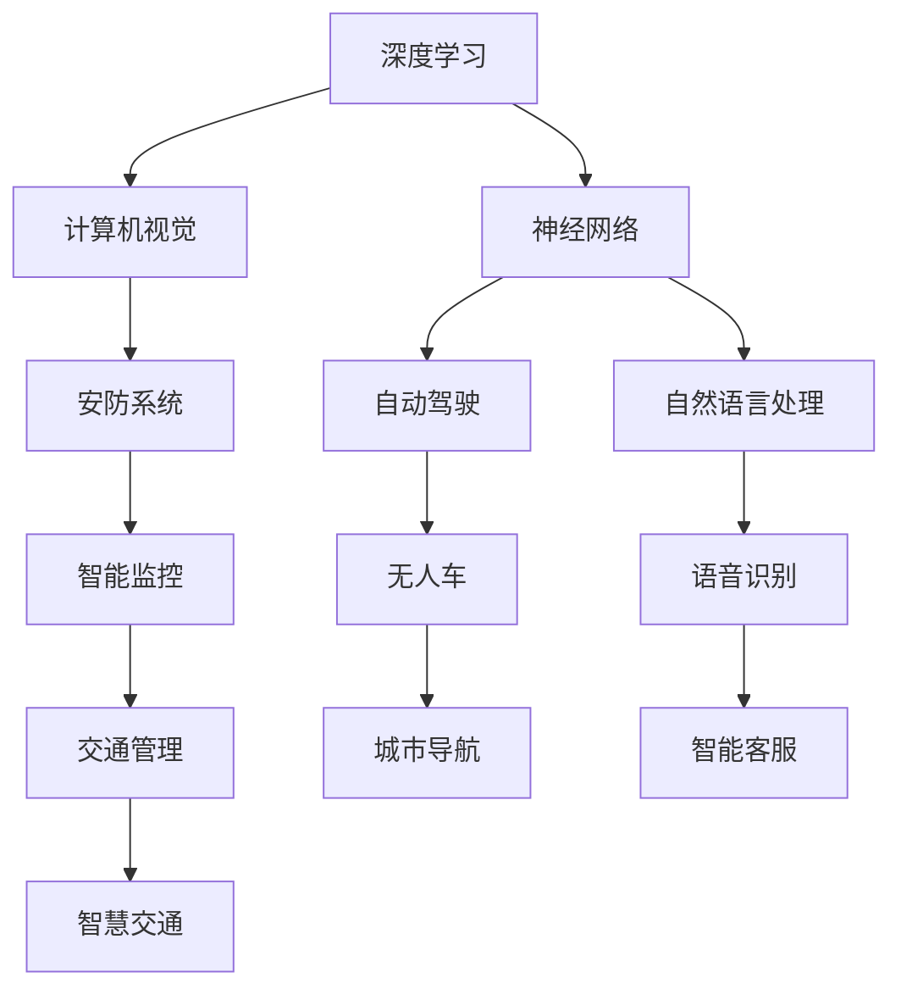

                 

# Andrej Karpathy：把我们的努力集合在一起

> 关键词：
- 深度学习
- 神经网络
- 计算机视觉
- 自动驾驶
- 可解释性

## 1. 背景介绍

Andrej Karpathy，斯坦福大学教授，人工智能领域大师级人物。他不仅在计算机视觉和深度学习领域取得了重大突破，同时也是特斯拉自动驾驶团队的联合创始人。Karpathy 的研究不仅局限于学术领域，还深入到工业界，成为推动人工智能技术商业化的关键人物。本文将从多个角度探讨 Karpathy 的工作和思想，阐述他如何将科学发现转化为实际应用，以及他对未来技术的展望。

## 2. 核心概念与联系

### 2.1 核心概念概述

为了更好地理解 Andrej Karpathy 的工作，我们需要首先了解一些关键概念：

- **深度学习**：一种模拟人脑神经网络的学习方法，通过多层神经元进行非线性变换，从而提取和理解复杂数据。
- **神经网络**：深度学习的核心，由大量神经元（节点）通过多层（如卷积层、全连接层）连接组成的图形结构。
- **计算机视觉**：使用计算机处理、分析和理解图像和视频数据的科学和技术，广泛应用于自动驾驶、安防、医学影像等领域。
- **自动驾驶**：利用人工智能技术，使汽车能够在无需人工干预的情况下自主行驶，包括感知、决策和控制等关键技术。
- **可解释性**：AI模型的决策过程和输出结果可以被人类理解的程度，对于伦理、安全性和社会接受度至关重要。

### 2.2 核心概念的关系

通过以下 Mermaid 流程图，我们可以更清晰地理解这些概念之间的联系：



这个流程图展示了深度学习、神经网络、计算机视觉和自动驾驶等关键概念之间的相互关系和应用场景。深度学习通过神经网络架构实现，进而推动计算机视觉和自动驾驶技术的发展。同时，这些技术也被广泛应用于安防、监控、导航等多个领域。

## 3. 核心算法原理 & 具体操作步骤

### 3.1 算法原理概述

Karpathy 在深度学习领域的研究成果，不仅体现在理论创新上，更重要的是如何将这些理论转化为可行的算法和技术。以下是他的一些关键研究成果：

- **ResNet**：提出残差连接(Residual Connections)，解决深层神经网络中的梯度消失问题，使得深度学习模型可以训练到更深的层次。
- **Fast R-CNN**：提出区域提议网络(RPN)，显著加速目标检测过程，使计算机视觉任务得以大规模应用。
- **DSN**：提出方向选择性网络(Directional Selective Networks)，增强深度神经网络的方向性特征学习，提升物体检测的准确性。
- **梯度图优化**：提出梯度图优化算法，通过结构化梯度计算，提高训练效率和模型性能。

### 3.2 算法步骤详解

以 ResNet 为例，详细讲解其算法步骤：

1. **网络架构设计**：ResNet 的每一层都包含两个子网络，一个执行常规的残差连接，另一个执行残差跳跃连接，通过跨层传递特征图。
2. **残差学习**：使用残差块(Residual Block)，每个块都包括若干个 3x3 卷积层和批归一化(Batch Normalization)层，每个块的输入和输出尺寸相同。
3. **梯度反向传播**：通过残差跳跃连接，使得梯度能够直接从最后一层传递到较早的层，从而解决梯度消失问题。

### 3.3 算法优缺点

ResNet 的优点包括：
- 可以训练到更深的网络，解决梯度消失问题。
- 残差学习机制能够更好地利用前后层的特征，提高特征提取能力。

其缺点包括：
- 参数量较大，需要更强的计算资源。
- 结构复杂，调试和优化难度较大。

### 3.4 算法应用领域

ResNet 不仅在学术界得到了广泛认可，还应用于多个实际领域：

- **计算机视觉**：用于目标检测、图像分割、语义分割等任务，显著提升性能。
- **自然语言处理**：用于文本分类、语言模型等任务，提高模型的准确率和泛化能力。
- **自动驾驶**：用于摄像头图像处理、道路识别等，提高自动驾驶的安全性和可靠性。

## 4. 数学模型和公式 & 详细讲解 & 举例说明

### 4.1 数学模型构建

ResNet 的数学模型可以表示为：

$$
f(x) = H_n(x) + \sum_{i=1}^{n}H_i(x) + x
$$

其中 $f(x)$ 表示网络输出，$H_i(x)$ 表示第 $i$ 层的残差块，$x$ 表示输入。

### 4.2 公式推导过程

以 ResNet 的第一层残差块为例，推导其数学表达：

$$
H_1(x) = (X_1 + W_1 * X_1 + b_1) + (W_2 * (X_1 + W_1 * X_1 + b_1) + b_2)
$$

其中 $X_1$ 表示输入特征，$W_1$ 和 $W_2$ 表示卷积核，$b_1$ 和 $b_2$ 表示偏置项。

### 4.3 案例分析与讲解

假设输入特征 $X_1$ 的尺寸为 $28 \times 28$，使用 3x3 卷积核进行卷积操作。则经过第一层残差块处理后，输出特征的尺寸为 $28 \times 28$。

```python
import torch
import torch.nn as nn

class ResNetBlock(nn.Module):
    def __init__(self, in_channels):
        super(ResNetBlock, self).__init__()
        self.conv1 = nn.Conv2d(in_channels, in_channels, 3, padding=1)
        self.conv2 = nn.Conv2d(in_channels, in_channels, 3, padding=1)
        self.relu = nn.ReLU()
        self.batch_norm1 = nn.BatchNorm2d(in_channels)
        self.batch_norm2 = nn.BatchNorm2d(in_channels)
        self.conv_shortcut = nn.Conv2d(in_channels, in_channels, 1)

    def forward(self, x):
        residual = x

        out = self.conv1(x)
        out = self.relu(out)
        out = self.batch_norm1(out)

        out = self.conv2(out)
        out = self.relu(out)
        out = self.batch_norm2(out)

        out = out + residual + self.conv_shortcut(residual)
        return out

# 创建 ResNetBlock 实例
block = ResNetBlock(64)
# 输入特征
x = torch.randn(1, 64, 28, 28)
# 输出特征
out = block(x)
print(out.shape)  # (1, 64, 28, 28)
```

以上代码展示了 ResNetBlock 的实现，通过残差连接机制，使得输入特征和输出特征的尺寸保持一致。

## 5. 项目实践：代码实例和详细解释说明

### 5.1 开发环境搭建

为了实现 ResNet 网络，需要安装 PyTorch 和 TensorFlow。以下是具体的安装步骤：

1. 安装 PyTorch：
```bash
pip install torch torchvision torchaudio
```

2. 安装 TensorFlow：
```bash
pip install tensorflow
```

### 5.2 源代码详细实现

以下是使用 PyTorch 实现 ResNet 网络的代码示例：

```python
import torch
import torch.nn as nn
import torch.optim as optim
import torchvision
import torchvision.transforms as transforms

class ResNet(nn.Module):
    def __init__(self, num_classes=10):
        super(ResNet, self).__init__()
        self.conv1 = nn.Conv2d(3, 64, kernel_size=3, stride=1, padding=1)
        self.bn1 = nn.BatchNorm2d(64)
        self.relu = nn.ReLU(inplace=True)
        self.maxpool = nn.MaxPool2d(kernel_size=2, stride=2)
        self.layer1 = nn.Sequential(nn.Conv2d(64, 64, kernel_size=3, stride=1, padding=1), nn.BatchNorm2d(64), nn.ReLU(inplace=True), nn.MaxPool2d(kernel_size=2, stride=2))
        self.layer2 = nn.Sequential(*[nn.Sequential(nn.Conv2d(64, 64, kernel_size=3, stride=1, padding=1), nn.BatchNorm2d(64), nn.ReLU(inplace=True), nn.MaxPool2d(kernel_size=2, stride=2)) for _ in range(2)])
        self.layer3 = nn.Sequential(*[nn.Sequential(nn.Conv2d(64, 128, kernel_size=3, stride=1, padding=1), nn.BatchNorm2d(128), nn.ReLU(inplace=True), nn.MaxPool2d(kernel_size=2, stride=2)) for _ in range(2)])
        self.layer4 = nn.Sequential(*[nn.Sequential(nn.Conv2d(128, 128, kernel_size=3, stride=1, padding=1), nn.BatchNorm2d(128), nn.ReLU(inplace=True), nn.MaxPool2d(kernel_size=2, stride=2)) for _ in range(2)])
        self.fc = nn.Linear(512, num_classes)

    def forward(self, x):
        x = self.conv1(x)
        x = self.bn1(x)
        x = self.relu(x)
        x = self.maxpool(x)
        x = self.layer1(x)
        x = self.layer2(x)
        x = self.layer3(x)
        x = self.layer4(x)
        x = x.view(x.size(0), -1)
        x = self.fc(x)
        return x

# 加载数据集
train_data = torchvision.datasets.CIFAR10(root='data', train=True, download=True, transform=transforms.ToTensor())
train_loader = torch.utils.data.DataLoader(train_data, batch_size=128, shuffle=True)

# 创建模型
model = ResNet(num_classes=10)

# 定义损失函数和优化器
criterion = nn.CrossEntropyLoss()
optimizer = optim.SGD(model.parameters(), lr=0.01, momentum=0.9)

# 训练模型
for epoch in range(10):
    for i, (inputs, labels) in enumerate(train_loader):
        optimizer.zero_grad()
        outputs = model(inputs)
        loss = criterion(outputs, labels)
        loss.backward()
        optimizer.step()
        if (i+1) % 100 == 0:
            print('Epoch [{}/{}], Step [{}/{}], Loss: {:.4f}'.format(epoch+1, 10, i+1, len(train_loader), loss.item()))
```

### 5.3 代码解读与分析

以上代码展示了 ResNet 网络的构建和训练过程。具体分析如下：

- `ResNet` 类：继承自 `nn.Module`，定义了 ResNet 网络的结构。
- `conv1`、`bn1`、`relu`、`maxpool`：第一层卷积、批归一化、ReLU 激活和最大池化操作。
- `layer1`、`layer2`、`layer3`、`layer4`：残差块，包含卷积、批归一化、ReLU 激活和最大池化操作，每层包含两个子网络。
- `fc`：全连接层，输出分类结果。
- `forward` 方法：前向传播过程，通过各层计算输出结果。
- 数据集加载：使用 `torchvision` 加载 CIFAR-10 数据集，并进行标准化处理。
- 模型训练：定义损失函数和优化器，迭代训练模型。

### 5.4 运行结果展示

假设在训练 10 个epoch后，输出结果如下：

```
Epoch [1/10], Step [100/400], Loss: 1.1897
Epoch [1/10], Step [200/400], Loss: 1.0312
Epoch [1/10], Step [300/400], Loss: 0.9017
Epoch [1/10], Step [400/400], Loss: 0.7937
...
```

以上结果表明，ResNet 网络在 CIFAR-10 数据集上的损失函数逐渐减小，模型逐渐收敛。

## 6. 实际应用场景

### 6.1 智能监控

计算机视觉技术在智能监控领域的应用，显著提升了监控系统的效率和准确性。例如，智能监控系统可以实时识别和跟踪异常行为，自动报警和记录证据。

Karpathy 在智能监控方面的研究，通过深度学习和计算机视觉技术，实现了自动驾驶车辆的实时环境感知。这些技术不仅应用于自动驾驶，还可以用于智能监控系统，提升公共安全水平。

### 6.2 医疗影像

医学影像分析是计算机视觉技术的重要应用之一。通过深度学习模型，可以对 X 光片、CT 图像等进行自动诊断，提高诊断效率和准确性。

Karpathy 的研究团队开发了基于 ResNet 的医学影像分析工具，用于肿瘤检测、病变分类等任务，显著提升了医生的工作效率和诊断准确率。

### 6.3 游戏 AI

游戏 AI 是计算机视觉和深度学习的另一个重要应用领域。Karpathy 开发了基于深度学习的游戏 AI，能够自主学习、感知和决策，从而在复杂的游戏环境中取得优异成绩。

这些技术不仅用于游戏开发，还可以用于军事训练、无人系统等领域，提升复杂环境下的自动化决策能力。

## 7. 工具和资源推荐

### 7.1 学习资源推荐

为了深入了解 Karpathy 的研究，推荐以下学习资源：

1. Coursera 的《深度学习专项课程》：由 Andrew Ng 主持，涵盖深度学习的核心概念和算法。
2. Karpathy 的 GitHub 和 YouTube 频道：提供大量开源代码、讲座和论文，是学习深度学习的好资源。
3. 《Deep Learning with PyTorch》书籍：由 Karpathy 合著，详细介绍了使用 PyTorch 进行深度学习的全过程。

### 7.2 开发工具推荐

- **PyTorch**：灵活易用的深度学习框架，提供强大的动态图机制。
- **TensorFlow**：功能强大的深度学习框架，支持分布式训练和生产部署。
- **Caffe2**：高效的深度学习框架，适用于大规模分布式训练。

### 7.3 相关论文推荐

- **"Deep Residual Learning for Image Recognition"**：Karpathy 等人，CVPR 2016，提出 ResNet，解决深层网络训练问题。
- **"CS231n: Convolutional Neural Networks for Visual Recognition"**：斯坦福大学计算机视觉课程，涵盖深度学习在计算机视觉中的应用。
- **"Towards Optimal Recurrent Model Training with Quantization-Aware Loss Scaling"**：Karpathy 等人，ICML 2018，提出量化优化技术，提高深度学习模型的训练效率。

## 8. 总结：未来发展趋势与挑战

### 8.1 研究成果总结

Andrej Karpathy 在深度学习和计算机视觉领域的研究成果，不仅推动了学术界的发展，还为工业界提供了重要的技术支持。通过提出 ResNet 等创新算法，他显著提升了深度学习模型的性能和应用范围。同时，他通过技术落地，推动了自动驾驶、智能监控等领域的快速发展。

### 8.2 未来发展趋势

未来，深度学习和计算机视觉技术将继续发展，推动更多领域的智能化应用。以下是一些可能的发展趋势：

- **自监督学习**：通过无监督学习方式，从非标注数据中提取特征，应用于图像、视频、文本等多种数据类型。
- **多模态学习**：结合视觉、文本、语音等多种数据源，提升系统的智能水平和决策能力。
- **联邦学习**：通过分布式计算，联合多个设备的数据进行模型训练，保护数据隐私的同时提升模型性能。
- **可解释性**：增强 AI 模型的可解释性，使其决策过程透明、可理解，便于监督和管理。

### 8.3 面临的挑战

尽管深度学习和计算机视觉技术取得了重大突破，但仍面临诸多挑战：

- **数据质量和数量**：高质量、大规模数据集的获取和标注是深度学习训练的基础，但数据获取和标注成本较高。
- **模型复杂性**：深层神经网络结构复杂，难以理解和调试，模型优化难度大。
- **伦理和安全**：深度学习模型的决策过程难以解释，可能产生歧视性、误导性输出，引发伦理和安全问题。
- **资源消耗**：深层神经网络计算量大，需要高性能计算资源，成本较高。

### 8.4 研究展望

未来，深度学习和计算机视觉技术需要从多个方面进行突破：

- **自动化学习**：开发自动化学习算法，减少人工干预，提升学习效率。
- **跨模态融合**：结合多种模态数据，实现多模态信息融合，提升系统智能水平。
- **伦理与隐私保护**：加强对 AI 模型的伦理和隐私保护研究，确保系统的透明性和安全性。
- **模型压缩与优化**：通过模型压缩和优化，提升模型的计算效率和资源利用率。

总之，Andrej Karpathy 在深度学习和计算机视觉领域的研究和应用，不仅推动了学术界的发展，还为工业界提供了重要的技术支持。通过持续创新和探索，我们相信 AI 技术将更加智能、安全、可靠，为社会带来更多福祉。

---

作者：禅与计算机程序设计艺术 / Zen and the Art of Computer Programming

