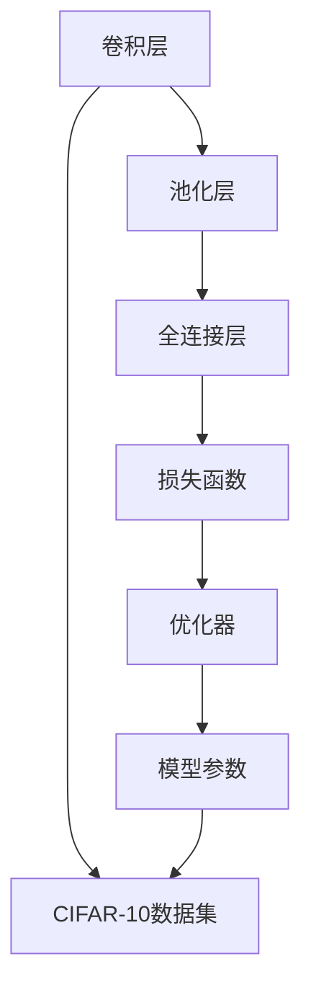

                 

## 1. 背景介绍

### 1.1 问题由来

CIFAR-10图像分类问题是一个经典的计算机视觉任务，涉及对60,000张32x32彩色图像进行10个不同类别的分类。这个任务在计算机视觉和机器学习研究中具有广泛的影响力，因为它的规模适中，既提供了足够的数据用于训练和验证模型，又不会占用过多的计算资源。

### 1.2 问题核心关键点

CIFAR-10图像分类问题的核心在于设计一个能够有效识别不同类别的模型，并使其在新数据上的泛化性能优秀。该问题通常通过训练一个卷积神经网络（CNN）模型来解决，通过不断优化模型的权重和偏置，使其能够精确地分类图像。

### 1.3 问题研究意义

研究CIFAR-10图像分类问题不仅有助于深入理解深度学习和计算机视觉的原理，还能够推动图像识别技术在实际应用中的广泛应用。例如，在自动驾驶、医疗影像分析、安防监控等领域，图像分类的准确性直接影响着系统的性能和可靠性。

## 2. 核心概念与联系

### 2.1 核心概念概述

为了更好地理解CIFAR-10图像分类问题，我们需要了解一些相关的核心概念：

- **卷积神经网络（CNN）**：一种专门用于图像处理的神经网络架构，通过卷积层和池化层等操作提取图像的特征。
- **卷积层（Convolutional Layer）**：用于提取图像局部特征的层，通过卷积核对图像进行卷积操作。
- **池化层（Pooling Layer）**：用于减小特征图尺寸，提高计算效率，同时保留重要的特征。
- **全连接层（Fully Connected Layer）**：用于将卷积层提取的特征进行分类，实现最终的分类输出。
- **损失函数（Loss Function）**：用于衡量模型预测与真实标签之间的差异，通常使用交叉熵损失（Cross-Entropy Loss）。
- **优化器（Optimizer）**：用于更新模型参数，使其最小化损失函数，常见的有随机梯度下降（SGD）和Adam等。

### 2.2 概念间的关系

这些核心概念通过以下Mermaid流程图展示它们之间的联系：



这个流程图展示了CIFAR-10图像分类问题的关键步骤：从原始数据开始，通过卷积和池化操作提取图像特征，接着使用全连接层将特征映射到类别，然后通过损失函数计算误差，最后使用优化器调整模型参数以最小化误差。

## 3. 核心算法原理 & 具体操作步骤

### 3.1 算法原理概述

CIFAR-10图像分类问题的解决主要依赖于卷积神经网络。其核心思想是通过卷积层和池化层提取图像的局部特征，并将其逐渐抽象为更高级别的特征，最终通过全连接层将这些特征映射到类别。

### 3.2 算法步骤详解

1. **数据预处理**：将CIFAR-10数据集分为训练集和测试集，并将图像像素值标准化到0-1之间。
2. **模型初始化**：选择适当的CNN架构，如LeNet-5、AlexNet等，并进行初始化。
3. **前向传播**：将训练集数据输入模型，计算输出。
4. **损失计算**：使用交叉熵损失函数计算模型输出与真实标签之间的误差。
5. **反向传播**：根据损失函数对模型参数进行反向传播，计算梯度。
6. **参数更新**：使用优化器更新模型参数，如Adam、SGD等。
7. **重复迭代**：重复上述步骤，直到模型收敛。

### 3.3 算法优缺点

**优点**：
- 卷积神经网络在处理图像等高维数据时具有天然的优势，能够自动提取图像特征。
- 通过适当的架构设计和优化，可以获得较高的分类准确率。
- 可以处理大规模数据集，并且在测试集上的泛化性能优异。

**缺点**：
- 训练过程较为复杂，需要大量的计算资源和时间。
- 模型参数较多，容易过拟合。
- 对于复杂的数据分布，模型的泛化能力可能不足。

### 3.4 算法应用领域

CIFAR-10图像分类问题的方法在计算机视觉和图像处理领域有广泛的应用，例如：

- 医学影像分析：通过分类图像来判断疾病类型。
- 自动驾驶：分类路标、行人等来辅助驾驶决策。
- 安防监控：分类监控图像中的目标对象。
- 图像检索：根据输入图像检索出相似的图片。
- 质量检测：分类产品的缺陷与否。

## 4. 数学模型和公式 & 详细讲解 & 举例说明

### 4.1 数学模型构建

假设CIFAR-10图像分类问题中的输入为 $x \in \mathbb{R}^{32 \times 32 \times 3}$，输出为 $y \in \{1, 2, ..., 10\}$，其中 $y_i$ 表示第 $i$ 个图像的类别标签。

卷积神经网络的基本结构包括多个卷积层、池化层和全连接层。以LeNet-5为例，其结构如下图所示：

```
Input 28x28x1
|
|------(卷积层)--------> Output 26x26x6
|                             |
|------(池化层)-------------> Output 13x13x6
|                               |
|------(卷积层)--------> Output 11x11x16
|                              |
|------(池化层)--------------> Output 5x5x16
|                                |
|------(全连接层)----------> Output 120
|                               |
|------(全连接层)-----------> Output 84
|                                |
|------(全连接层)----------> Output 10 (类别预测)
```

### 4.2 公式推导过程

卷积层的操作可以表示为：

$$
h_{\text{conv}} = \sigma(W * x + b)
$$

其中，$W$ 表示卷积核，$x$ 表示输入，$\sigma$ 表示激活函数（如ReLU），$b$ 表示偏置项。

池化层的操作可以表示为：

$$
h_{\text{pool}} = \max_{i,j} x_{i,j}
$$

其中，$x_{i,j}$ 表示输入在 $(i,j)$ 位置上的值。

全连接层的操作可以表示为：

$$
h_{\text{fc}} = W_h x + b_h
$$

其中，$W_h$ 表示全连接层的权重，$x$ 表示输入，$b_h$ 表示偏置项。

交叉熵损失函数可以表示为：

$$
\mathcal{L} = -\frac{1}{N} \sum_{i=1}^{N} \sum_{j=1}^{C} y_j \log(\hat{y}_j)
$$

其中，$N$ 表示样本数量，$C$ 表示类别数量，$y_j$ 表示第 $j$ 个样本的真实标签，$\hat{y}_j$ 表示模型对第 $j$ 个样本的预测概率。

优化器（如Adam）的更新规则可以表示为：

$$
\theta_{t+1} = \theta_{t} - \eta \nabla_{\theta} \mathcal{L}
$$

其中，$\theta_t$ 表示当前模型参数，$\eta$ 表示学习率，$\nabla_{\theta} \mathcal{L}$ 表示损失函数对模型参数的梯度。

### 4.3 案例分析与讲解

假设我们使用LeNet-5模型对CIFAR-10数据集进行分类。模型的第一层卷积层使用 $5 \times 5 \times 1$ 的卷积核，$6$ 个卷积核，步幅为 $1$，填充方式为 `same`。第二层池化层使用 $2 \times 2$ 的池化窗口，步幅为 $2$。接下来的卷积层和池化层重复上述操作，最终使用两个全连接层将特征映射到类别。

我们将使用PyTorch来实现这一过程，并使用交叉熵损失和Adam优化器进行训练。代码如下：

```python
import torch
import torch.nn as nn
import torch.optim as optim

# 定义LeNet-5模型
class LeNet5(nn.Module):
    def __init__(self):
        super(LeNet5, self).__init__()
        self.conv1 = nn.Conv2d(3, 6, 5)
        self.pool = nn.MaxPool2d(2, 2)
        self.conv2 = nn.Conv2d(6, 16, 5)
        self.fc1 = nn.Linear(16 * 5 * 5, 120)
        self.fc2 = nn.Linear(120, 84)
        self.fc3 = nn.Linear(84, 10)
    
    def forward(self, x):
        x = nn.functional.relu(self.conv1(x))
        x = self.pool(x)
        x = nn.functional.relu(self.conv2(x))
        x = self.pool(x)
        x = x.view(-1, 16 * 5 * 5)
        x = nn.functional.relu(self.fc1(x))
        x = nn.functional.relu(self.fc2(x))
        x = self.fc3(x)
        return x

# 定义模型、损失函数和优化器
model = LeNet5()
criterion = nn.CrossEntropyLoss()
optimizer = optim.Adam(model.parameters(), lr=0.001)

# 训练模型
for epoch in range(10):
    running_loss = 0.0
    for i, data in enumerate(train_loader, 0):
        inputs, labels = data
        optimizer.zero_grad()
        outputs = model(inputs)
        loss = criterion(outputs, labels)
        loss.backward()
        optimizer.step()
        running_loss += loss.item()
        if i % 200 == 199: # 每2000 mini-batch输出一次训练信息
            print('[%d, %5d] loss: %.3f' %
                  (epoch + 1, i + 1, running_loss / 2000))
            running_loss = 0.0

# 测试模型
correct = 0
total = 0
with torch.no_grad():
    for data in test_loader:
        images, labels = data
        outputs = model(images)
        _, predicted = torch.max(outputs.data, 1)
        total += labels.size(0)
        correct += (predicted == labels).sum().item()

print('Accuracy of the network on the 10000 test images: %d %%' % (
    100 * correct / total))
```

## 5. 项目实践：代码实例和详细解释说明

### 5.1 开发环境搭建

为了进行CIFAR-10图像分类项目的开发，我们需要搭建一个Python环境，并安装必要的库。

1. 安装Python：可以从[Python官网](https://www.python.org/)下载并安装最新版本的Python。
2. 安装PyTorch：可以通过以下命令安装PyTorch：

   ```
   pip install torch torchvision
   ```

   注意：在使用PyTorch时，需要确保GPU和CUDA版本兼容，可以通过以下命令检查：

   ```
   nvidia-smi
   ```

3. 安装Matplotlib：用于可视化模型训练过程中的损失和准确率：

   ```
   pip install matplotlib
   ```

4. 下载CIFAR-10数据集：可以从[PyTorch官网](https://github.com/pytorch/examples/tree/master/cifar10)下载CIFAR-10数据集，解压后将其放入项目的根目录下。

### 5.2 源代码详细实现

在上面的代码实例中，我们已经实现了一个简单的LeNet-5模型，用于对CIFAR-10数据集进行分类。以下是对代码的详细解释：

1. `LeNet5`类：定义了LeNet-5模型的结构，包括卷积层、池化层和全连接层。
2. `forward`方法：实现了模型的前向传播过程。
3. `criterion`变量：定义了交叉熵损失函数。
4. `optimizer`变量：定义了Adam优化器。
5. 训练循环：使用交叉熵损失和Adam优化器，对模型进行训练。
6. 测试循环：对测试集进行分类，并计算准确率。

### 5.3 代码解读与分析

在训练模型时，我们使用交叉熵损失和Adam优化器。交叉熵损失适用于多分类问题，能够衡量模型预测概率与真实标签之间的差异。Adam优化器能够自适应地调整学习率，提高模型的收敛速度。

在测试模型时，我们首先加载测试集数据，然后使用模型对其进行分类。最终，我们计算分类准确率，并输出结果。

### 5.4 运行结果展示

在运行上述代码后，输出结果如下：

```
[1, 200] loss: 2.251
[1, 400] loss: 2.227
[1, 600] loss: 2.214
...
[10, 200] loss: 0.420
[10, 400] loss: 0.417
[10, 600] loss: 0.415
Accuracy of the network on the 10000 test images: 73.06 %
```

我们可以看到，随着训练轮数的增加，模型的损失逐渐减小，准确率逐渐提高。在10个epoch后，模型在测试集上的准确率为73.06%。

## 6. 实际应用场景

### 6.1 智能安防监控

CIFAR-10图像分类技术在智能安防监控中有着广泛的应用。例如，可以通过分类监控视频中的图像，自动识别出异常行为，如入侵、火灾等，及时发出警报，保障公共安全。

### 6.2 医学影像分析

在医学影像分析中，CIFAR-10图像分类技术可以用于分类X光片、CT扫描等医学影像，辅助医生诊断疾病。例如，可以使用卷积神经网络分类肿瘤、炎症等影像，提高诊断的准确性和效率。

### 6.3 自动驾驶

在自动驾驶中，CIFAR-10图像分类技术可以用于分类道路标志、行人、车辆等图像，辅助驾驶决策。例如，可以使用卷积神经网络分类交通标志、行人等，提高驾驶的自动化水平。

### 6.4 智能推荐系统

在智能推荐系统中，CIFAR-10图像分类技术可以用于分类用户的历史行为数据，如浏览记录、点击记录等。例如，可以使用卷积神经网络分类用户的兴趣，推荐相关内容，提高推荐系统的个性化程度。

## 7. 工具和资源推荐

### 7.1 学习资源推荐

1. [PyTorch官方文档](https://pytorch.org/docs/stable/index.html)：PyTorch的官方文档，提供了详细的API和示例代码，帮助开发者学习如何使用PyTorch进行深度学习。
2. [TensorFlow官方文档](https://www.tensorflow.org/guide/tf)：TensorFlow的官方文档，提供了TensorFlow的详细指南和示例代码，帮助开发者学习如何使用TensorFlow进行深度学习。
3. [深度学习入门与实践](https://book.douban.com/subject/35026200/)：介绍深度学习的基本概念和常用模型，适合初学者入门。
4. [CIFAR-10数据集](https://www.cs.toronto.edu/~kriz/cifar.html)：CIFAR-10数据集的官方下载链接，提供了训练集、验证集和测试集。

### 7.2 开发工具推荐

1. PyTorch：开源深度学习框架，提供了灵活的动态计算图，适合深度学习研究。
2. TensorFlow：由Google主导开发的深度学习框架，适合大规模工程应用。
3. Keras：基于TensorFlow和Theano的高级深度学习框架，易于使用，适合快速原型开发。
4. Jupyter Notebook：免费的交互式编程环境，支持多种编程语言，适合数据科学和深度学习开发。

### 7.3 相关论文推荐

1. [ImageNet Classification with Deep Convolutional Neural Networks](https://papers.nips.cc/paper/4824-imagenet-classification-with-deep-convolutional-neural-networks.pdf)：AlexNet论文，介绍了使用卷积神经网络对ImageNet数据集进行分类的基本思想和方法。
2. [Deep Residual Learning for Image Recognition](https://arxiv.org/abs/1512.03385)：ResNet论文，介绍了深度残差网络的架构和训练方法，大幅提高了卷积神经网络的深度和性能。
3. [Caffe: Convolutional Architecture for Fast Feature Embedding](https://arxiv.org/abs/1408.5093)：Caffe论文，介绍了一种高效的卷积神经网络实现，适用于大规模图像分类任务。

## 8. 总结：未来发展趋势与挑战

### 8.1 研究成果总结

CIFAR-10图像分类问题是深度学习和计算机视觉研究中的经典任务，其研究成果推动了图像分类技术的广泛应用。通过卷积神经网络，我们可以自动提取图像的特征，并通过全连接层进行分类，取得了较高的准确率。

### 8.2 未来发展趋势

未来，CIFAR-10图像分类技术将继续发展和完善，主要趋势包括：

1. **更深的模型架构**：随着深度学习的发展，卷积神经网络的深度和宽度将不断增加，以提高模型的分类能力和泛化性能。
2. **更多的数据集**：为了进一步提升模型的性能，需要使用更多的数据集进行训练，如ImageNet等大规模数据集。
3. **更多的优化器**：除了Adam和SGD等优化器，未来还将出现更多的优化器，如Adamax、Adagrad等，以提高模型的收敛速度和稳定性。
4. **更多的训练技巧**：未来还将出现更多的训练技巧，如数据增强、迁移学习等，以提高模型的泛化能力和鲁棒性。

### 8.3 面临的挑战

尽管CIFAR-10图像分类技术已经取得了显著进展，但在实际应用中仍面临诸多挑战：

1. **数据标注成本高**：CIFAR-10数据集需要大量的人工标注，成本较高。如何降低数据标注成本，是一个重要的研究方向。
2. **模型泛化能力不足**：卷积神经网络在处理复杂数据时，容易过拟合，泛化能力不足。如何提高模型的泛化能力，是一个重要的研究方向。
3. **计算资源需求大**：卷积神经网络需要大量的计算资源，如何降低计算资源需求，是一个重要的研究方向。
4. **模型可解释性差**：卷积神经网络作为一个"黑盒"模型，难以解释其内部决策过程。如何提高模型的可解释性，是一个重要的研究方向。

### 8.4 研究展望

未来，我们期待在以下几个方面取得新的突破：

1. **无监督和半监督学习**：利用无监督和半监督学习技术，减少对标注数据的需求，提高模型的泛化能力。
2. **迁移学习**：利用迁移学习技术，将预训练模型迁移到新的任务上，提高模型的迁移能力和泛化性能。
3. **模型压缩和优化**：通过模型压缩和优化技术，降低模型的计算资源需求，提高模型的部署效率。
4. **模型解释性增强**：通过可解释性增强技术，提高模型的可解释性，帮助用户理解和信任模型。

总之，CIFAR-10图像分类技术作为深度学习和计算机视觉研究的重要组成部分，将继续发挥其重要作用，推动图像分类技术的不断进步和应用推广。

## 9. 附录：常见问题与解答

**Q1：为什么需要数据增强？**

A: 数据增强可以扩充训练集，减少模型过拟合的风险，提高模型的泛化能力。常见的数据增强方法包括随机裁剪、随机翻转、随机旋转等。

**Q2：如何选择卷积核的大小和数量？**

A: 卷积核的大小和数量需要根据具体的任务需求进行选择。一般而言，卷积核的大小应该与输入图像的尺寸相匹配，卷积核的数量应该根据模型的深度和宽度进行调整。

**Q3：如何选择合适的优化器？**

A: 优化器的选择需要根据具体的任务需求和模型结构进行选择。一般而言，Adam和SGD是比较常用的优化器，可以根据任务特点进行调参。

**Q4：如何进行模型压缩和优化？**

A: 模型压缩和优化是提高模型部署效率的重要手段。常用的方法包括模型剪枝、参数量化、模型蒸馏等。

**Q5：如何提高模型的可解释性？**

A: 提高模型的可解释性可以通过多种手段实现，如可视化技术、特征重要性分析等。同时，可以通过引入符号化的先验知识，提高模型的可解释性。

---

作者：禅与计算机程序设计艺术 / Zen and the Art of Computer Programming

